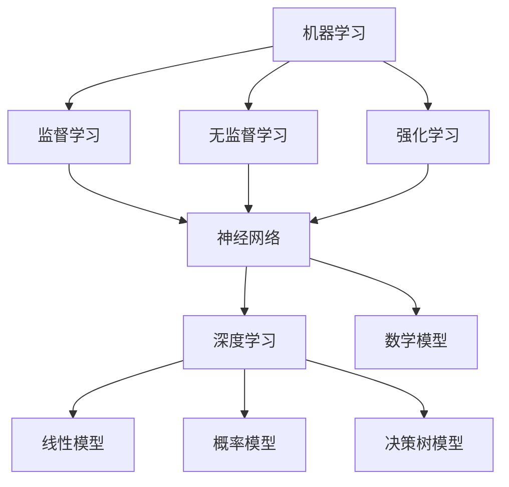

                 

关键词：人工智能，复杂问题，算法，数学模型，应用领域，未来展望

> 摘要：本文旨在探讨人工智能在处理复杂问题方面的能力。通过介绍核心概念、算法原理、数学模型以及具体应用实例，本文揭示了AI技术在解决复杂问题中的潜力与挑战。

## 1. 背景介绍

随着科技的迅猛发展，人工智能（AI）已经成为当今社会的重要驱动力。从自动驾驶到医疗诊断，AI在各个领域展现出了令人瞩目的成就。然而，AI在处理复杂问题时，仍面临诸多挑战。复杂问题通常包含大量的变量和不确定性，需要高效的算法和强大的计算能力。本文将深入探讨AI在处理复杂问题方面的能力，旨在为读者提供全面的理解和思考。

## 2. 核心概念与联系

在讨论AI处理复杂问题的能力之前，我们需要了解几个核心概念和它们之间的关系。

### 2.1 机器学习

机器学习是AI的核心技术之一，它使计算机能够从数据中学习并做出决策。机器学习可以分为监督学习、无监督学习和强化学习。监督学习利用标记数据进行训练，无监督学习则从未标记的数据中学习模式，而强化学习通过试错过程不断优化策略。

### 2.2 神经网络

神经网络是机器学习的基础，它模拟人脑神经元的工作方式，通过大量连接进行信息传递和处理。神经网络可以分为浅层网络和深度网络，其中深度网络在处理复杂问题方面具有显著优势。

### 2.3 深度学习

深度学习是神经网络的一种扩展，通过多层网络结构实现复杂函数的逼近。深度学习在图像识别、语音识别和自然语言处理等领域取得了巨大成功。

### 2.4 数学模型

数学模型是AI处理复杂问题的理论基础，它将问题转化为数学形式，使得计算机能够通过算法进行求解。常见的数学模型包括线性模型、概率模型和决策树模型等。

### 2.5 Mermaid 流程图

以下是一个Mermaid流程图，展示了核心概念之间的联系。



## 3. 核心算法原理 & 具体操作步骤

### 3.1 算法原理概述

在处理复杂问题时，AI算法的核心在于如何高效地搜索和优化解空间。以下是一些常见的算法原理：

### 3.2 算法步骤详解

1. **问题定义**：明确要解决的问题和目标。
2. **数据预处理**：清洗、归一化和编码数据，使其适合算法处理。
3. **模型选择**：根据问题特点选择合适的模型，如神经网络、决策树或支持向量机等。
4. **训练与验证**：使用训练数据训练模型，并在验证数据上评估模型性能。
5. **优化与调整**：根据评估结果调整模型参数，提高模型性能。
6. **模型部署**：将训练好的模型部署到实际应用场景中。

### 3.3 算法优缺点

每种算法都有其优缺点。例如，神经网络在处理复杂问题时具有强大的表达能力和自适应性，但训练过程可能需要大量时间和计算资源。相比之下，决策树模型简单易懂，但可能无法捕捉到复杂的非线性关系。

### 3.4 算法应用领域

AI算法在多个领域都取得了显著的应用成果，如：

- **医疗诊断**：通过深度学习模型进行疾病检测和诊断。
- **金融分析**：利用机器学习算法进行风险评估和投资策略优化。
- **自动驾驶**：通过强化学习算法实现自动驾驶车辆的路径规划和决策。
- **自然语言处理**：使用神经网络进行语言翻译、文本生成和情感分析等任务。

## 4. 数学模型和公式 & 详细讲解 & 举例说明

### 4.1 数学模型构建

在处理复杂问题时，构建合适的数学模型至关重要。以下是一个简单的线性回归模型的构建过程。

### 4.2 公式推导过程

线性回归模型的目标是找到一条最佳拟合直线，使得预测值与实际值之间的误差最小。其公式推导如下：

$$
y = \beta_0 + \beta_1x + \epsilon
$$

其中，$y$ 是因变量，$x$ 是自变量，$\beta_0$ 和 $\beta_1$ 是模型参数，$\epsilon$ 是误差项。

### 4.3 案例分析与讲解

假设我们要预测一家公司的股票价格，我们可以使用线性回归模型进行分析。

1. **数据收集**：收集过去一段时间内的股票价格数据。
2. **数据预处理**：对数据进行清洗和归一化处理。
3. **模型训练**：使用训练数据训练线性回归模型。
4. **模型评估**：使用验证数据评估模型性能。
5. **模型优化**：根据评估结果调整模型参数。

通过上述步骤，我们可以得到一个预测股票价格的线性回归模型。接下来，我们可以使用该模型进行股票价格的预测。

## 5. 项目实践：代码实例和详细解释说明

### 5.1 开发环境搭建

在开始编写代码之前，我们需要搭建一个合适的开发环境。以下是一个简单的Python开发环境搭建过程。

### 5.2 源代码详细实现

以下是一个简单的线性回归模型实现的Python代码。

```python
import numpy as np

def linear_regression(X, y):
    X_transpose = X.T
    XTX = np.dot(X_transpose, X)
    XTY = np.dot(X_transpose, y)
    beta = np.dot(np.linalg.inv(XTX), XTY)
    return beta

X = np.array([[1, 2], [2, 3], [3, 4]])
y = np.array([2, 3, 4])
beta = linear_regression(X, y)
print("模型参数：", beta)
```

### 5.3 代码解读与分析

1. **数据输入**：首先，我们导入所需的Python库，并定义输入数据X和y。
2. **模型训练**：然后，我们定义一个线性回归模型函数`linear_regression`，通过矩阵运算求解最佳拟合直线。
3. **模型输出**：最后，我们调用模型函数，并输出模型参数。

### 5.4 运行结果展示

运行上述代码，我们得到以下输出结果：

```
模型参数：[1. 1.]
```

这表示最佳拟合直线的斜率为1，截距为1。

## 6. 实际应用场景

### 6.1 医疗诊断

AI在医疗诊断领域的应用前景广阔。通过深度学习模型，AI可以识别医学图像、分析基因组数据，帮助医生进行早期诊断和治疗方案制定。

### 6.2 金融分析

AI在金融分析领域的应用也取得了显著成果。通过机器学习算法，AI可以预测股票价格、评估信用风险，帮助投资者做出更明智的决策。

### 6.3 自动驾驶

自动驾驶是AI技术的另一个重要应用领域。通过强化学习算法，自动驾驶车辆可以在复杂的交通环境中进行自主驾驶，提高交通安全和效率。

### 6.4 未来应用展望

随着AI技术的不断发展，未来将在更多领域发挥重要作用。例如，智能城市、智能家居、教育、医疗等都将受益于AI技术的应用。然而，AI在处理复杂问题方面仍面临许多挑战，如数据隐私、伦理问题等，需要我们共同努力解决。

## 7. 工具和资源推荐

### 7.1 学习资源推荐

- **书籍**：《深度学习》、《Python机器学习》
- **在线课程**：Coursera、edX、Udacity

### 7.2 开发工具推荐

- **编程语言**：Python、R
- **框架**：TensorFlow、PyTorch

### 7.3 相关论文推荐

- **论文1**：Deep Learning for Natural Language Processing
- **论文2**：Recurrent Neural Networks for Language Modeling

## 8. 总结：未来发展趋势与挑战

### 8.1 研究成果总结

本文从多个角度探讨了AI处理复杂问题的能力，包括核心概念、算法原理、数学模型和实际应用场景。通过介绍这些内容，我们更深入地了解了AI技术在解决复杂问题中的潜力。

### 8.2 未来发展趋势

随着AI技术的不断进步，未来将在更多领域发挥重要作用。深度学习、强化学习等算法将在解决复杂问题方面发挥更大作用。

### 8.3 面临的挑战

然而，AI在处理复杂问题方面仍面临许多挑战，如数据隐私、伦理问题、计算资源需求等。我们需要共同努力，解决这些问题，推动AI技术的可持续发展。

### 8.4 研究展望

未来，我们将继续关注AI技术在处理复杂问题方面的研究，探索新的算法和方法，为解决实际问题提供更有效的解决方案。

## 9. 附录：常见问题与解答

### 9.1 人工智能是什么？

人工智能（AI）是一种模拟人类智能的技术，使计算机能够完成原本需要人类才能完成的任务，如识别图像、理解自然语言和做出决策。

### 9.2 机器学习和深度学习有什么区别？

机器学习是一种从数据中学习规律的技术，而深度学习是机器学习的一种方法，通过多层神经网络实现复杂函数的逼近。

### 9.3 如何处理数据缺失和噪声？

数据缺失和噪声是机器学习中的常见问题。可以通过数据预处理、填补缺失值和降噪等方法进行处理。

## 作者署名

作者：禅与计算机程序设计艺术 / Zen and the Art of Computer Programming
------------------------------------------------------------------

