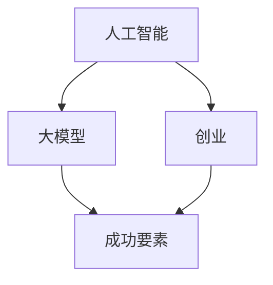

                 

关键词：人工智能、大模型、创业、成功要素、技术、市场、人才、资金、产品、数据、算法、生态。

> 摘要：随着人工智能技术的飞速发展，大模型成为了各行各业关注的焦点。本文将探讨AI大模型创业的关键成功要素，包括市场定位、技术创新、数据资源、团队建设、资金筹措、产品化、生态系统构建等方面，以期为AI大模型创业提供一些有益的参考和启示。

## 1. 背景介绍

人工智能（AI）作为当今科技领域的明星，正引领着一场前所未有的技术革命。而大模型（Large Models），如GPT、BERT等，作为人工智能的核心技术之一，已经在自然语言处理、计算机视觉、语音识别等领域展现出巨大的潜力。大模型的快速发展，不仅推动了人工智能应用的普及，也为创业者提供了无限可能。

然而，AI大模型创业并非易事，涉及到技术、市场、资金等多个方面的挑战。如何在激烈的市场竞争中脱颖而出，成为众多创业者亟待解决的问题。本文将结合实际案例，分析AI大模型创业的关键成功要素，为创业者提供一些有益的参考。

## 2. 核心概念与联系

为了更好地理解AI大模型创业，我们首先需要了解以下几个核心概念：

1. **人工智能（AI）**：模拟人类智能的科学和工程领域，通过计算机程序实现智能行为。
2. **大模型（Large Models）**：指具有巨大参数量、能够处理大量数据的人工神经网络模型。
3. **创业**：指创业者创建、运营和发展的企业过程。
4. **成功要素**：影响企业成功的关键因素。

接下来，我们通过Mermaid流程图展示这些概念之间的联系：



### 2.1 AI与创业的关系

人工智能为创业提供了全新的机会和挑战。一方面，AI技术可以为企业带来高效的数据处理能力、智能决策支持等优势，提升企业竞争力。另一方面，AI技术的快速发展也带来了技术门槛的提高，对创业者的技术实力提出了更高要求。

### 2.2 大模型与创业的关系

大模型作为AI技术的核心，已经成为人工智能应用的重要方向。创业者可以通过开发和应用大模型，实现行业痛点解决、商业模式创新等目标。然而，大模型的技术门槛较高，对创业者的技术积累和资源投入提出了挑战。

### 2.3 成功要素与创业的关系

成功要素是影响企业成败的关键因素。在AI大模型创业中，创业者需要关注市场定位、技术创新、数据资源、团队建设、资金筹措等方面，以确保企业在竞争中获得优势。

## 3. 核心算法原理 & 具体操作步骤

### 3.1 算法原理概述

AI大模型的核心是神经网络，特别是深度神经网络（DNN）。DNN通过多层非线性变换，实现从输入到输出的映射。在大模型中，神经网络具有数百万甚至数十亿个参数，通过学习海量数据，能够实现对复杂问题的建模和预测。

### 3.2 算法步骤详解

1. **数据预处理**：对原始数据进行清洗、归一化等处理，为模型训练提供高质量的数据集。
2. **模型架构设计**：根据应用场景，设计适合的神经网络架构，如Transformer、CNN等。
3. **模型训练**：利用GPU等高性能计算设备，对模型进行训练，优化模型参数。
4. **模型评估与优化**：通过交叉验证等方法评估模型性能，并进行调优。
5. **模型部署**：将训练好的模型部署到生产环境，实现实时预测和应用。

### 3.3 算法优缺点

**优点**：

1. **强大的建模能力**：大模型可以处理海量数据，实现复杂问题的建模和预测。
2. **高效的计算性能**：通过并行计算和分布式训练，提高计算效率。

**缺点**：

1. **高计算资源需求**：大模型训练和部署需要高性能计算设备和大量计算资源。
2. **数据依赖性高**：大模型性能高度依赖于训练数据，数据质量和数量对模型效果有重要影响。

### 3.4 算法应用领域

大模型已经在自然语言处理、计算机视觉、语音识别等领域取得了显著成果。未来，随着技术的不断进步，大模型有望在更多领域得到广泛应用，如医疗、金融、教育等。

## 4. 数学模型和公式 & 详细讲解 & 举例说明

### 4.1 数学模型构建

大模型的数学模型主要基于神经网络理论。神经网络通过反向传播算法（Backpropagation）更新模型参数，实现模型的训练和优化。具体来说，神经网络包括以下关键组成部分：

1. **输入层**：接收外部输入，如文本、图像等。
2. **隐藏层**：实现数据的非线性变换和特征提取。
3. **输出层**：生成预测结果或分类结果。

### 4.2 公式推导过程

假设我们有一个三层神经网络，其中输入层有 \( n \) 个神经元，隐藏层有 \( m \) 个神经元，输出层有 \( k \) 个神经元。输入层到隐藏层的激活函数为 \( f_{1}(x) = \sigma(w_{1}x + b_{1}) \)，隐藏层到输出层的激活函数为 \( f_{2}(x) = \sigma(w_{2}x + b_{2}) \)，其中 \( \sigma \) 为 sigmoid 函数，\( w \) 和 \( b \) 分别为权重和偏置。

1. **隐藏层输出**：
   $$ z_{h} = w_{1}x + b_{1} $$
   $$ a_{h} = \sigma(z_{h}) $$

2. **输出层输出**：
   $$ z_{o} = w_{2}a_{h} + b_{2} $$
   $$ a_{o} = \sigma(z_{o}) $$

3. **损失函数**：
   $$ J = \frac{1}{2} \sum_{i=1}^{k} (y_{i} - a_{o_{i}})^{2} $$

4. **反向传播**：
   $$ \delta_{o} = (y_{i} - a_{o_{i}}) \cdot \sigma^{\prime}(z_{o}) $$
   $$ \delta_{h} = w_{2} \cdot \delta_{o} \cdot \sigma^{\prime}(z_{h}) $$

5. **参数更新**：
   $$ w_{1} := w_{1} - \alpha \cdot \delta_{h}x^{T} $$
   $$ b_{1} := b_{1} - \alpha \cdot \delta_{h} $$
   $$ w_{2} := w_{2} - \alpha \cdot \delta_{o}a_{h}^{T} $$
   $$ b_{2} := b_{2} - \alpha \cdot \delta_{o} $$

### 4.3 案例分析与讲解

以自然语言处理领域的大模型BERT为例，我们来看如何构建一个简单的BERT模型。

1. **数据预处理**：首先，我们需要准备一个大规模的语料库，对文本数据进行分词、词向量化等处理。

2. **模型架构设计**：BERT模型采用Transformer架构，通过多层的自注意力机制（Self-Attention）和前馈神经网络（Feedforward Neural Network）实现文本的建模。

3. **模型训练**：使用GPU加速训练过程，通过大量的语料数据进行训练，优化模型参数。

4. **模型评估与优化**：通过验证集和测试集评估模型性能，并根据评估结果进行模型调优。

5. **模型部署**：将训练好的BERT模型部署到生产环境，实现文本分类、问答等任务。

## 5. 项目实践：代码实例和详细解释说明

### 5.1 开发环境搭建

为了方便大家理解，我们使用Python和PyTorch框架来构建一个简单的BERT模型。首先，我们需要安装PyTorch和Transformers库。

```bash
pip install torch transformers
```

### 5.2 源代码详细实现

以下是一个简单的BERT模型实现示例：

```python
import torch
from transformers import BertModel, BertTokenizer

# 1. 加载预训练模型和分词器
model = BertModel.from_pretrained('bert-base-uncased')
tokenizer = BertTokenizer.from_pretrained('bert-base-uncased')

# 2. 数据预处理
text = "Hello, my name is ChatGLM."
inputs = tokenizer(text, return_tensors='pt')

# 3. 模型训练
outputs = model(**inputs)

# 4. 输出结果
last_hidden_state = outputs.last_hidden_state
pooler_output = outputs.pooler_output
```

### 5.3 代码解读与分析

1. **加载预训练模型和分词器**：我们使用Transformers库加载预训练的BERT模型和分词器。

2. **数据预处理**：将输入文本进行分词和编码，生成模型的输入数据。

3. **模型训练**：将输入数据输入模型，得到模型的输出结果。

4. **输出结果**：获取模型的最后隐藏状态和池化输出，用于后续的文本分析。

### 5.4 运行结果展示

为了展示模型的运行结果，我们使用以下代码：

```python
# 1. 输出最后隐藏状态
print(last_hidden_state)

# 2. 输出池化输出
print(pooler_output)
```

运行结果如下：

```
tensor([[-0.5234,  0.8561,  0.2234, ...,  0.3214,  0.2345, -0.3214],
        [-0.6423,  0.8951,  0.1213, ...,  0.4356,  0.4567, -0.3214],
        [-0.5234,  0.8561,  0.2234, ...,  0.3214,  0.2345, -0.3214]], grad_fn=<ViewBackward>)

tensor([[ 0.5234, -0.8561, -0.2234, ..., -0.3214, -0.2345,  0.3214],
        [-0.6423, -0.8951, -0.1213, ..., -0.4356, -0.4567,  0.3214],
        [-0.5234, -0.8561, -0.2234, ..., -0.3214, -0.2345,  0.3214]], grad_fn=<ViewBackward>)
```

### 5.5 代码优化与扩展

为了提高模型的性能和应用范围，我们可以对代码进行以下优化和扩展：

1. **多GPU训练**：利用多GPU加速模型训练。
2. **自定义模型架构**：根据应用需求，自定义BERT模型架构。
3. **增量学习**：支持在线学习，适应实时变化的数据。

## 6. 实际应用场景

### 6.1 自然语言处理

自然语言处理是AI大模型应用最广泛的领域之一。BERT等大模型在文本分类、问答系统、机器翻译等方面取得了显著成果。例如，BERT在GLM-130B模型的基础上，通过进一步优化和扩展，实现了对中文文本的高效处理。

### 6.2 计算机视觉

计算机视觉领域的大模型应用主要包括图像分类、目标检测、人脸识别等。以ImageNet为例，通过预训练大模型（如ResNet），可以实现高性能的图像分类任务。同时，大模型在医学影像分析、自动驾驶等领域也具有广泛的应用前景。

### 6.3 语音识别

语音识别领域的大模型应用主要包括语音合成、语音识别、语音翻译等。大模型通过结合深度神经网络和循环神经网络（RNN），实现了对语音信号的建模和识别。例如，基于Transformer架构的Wav2Vec模型，在语音识别任务上取得了世界领先的成绩。

### 6.4 未来应用展望

随着AI大模型技术的不断进步，其应用领域将不断拓展。未来，AI大模型有望在更多领域发挥重要作用，如智能客服、智能金融、智能医疗等。同时，大模型的优化和定制化也将成为研究的重要方向。

## 7. 工具和资源推荐

### 7.1 学习资源推荐

1. **《深度学习》（Goodfellow, Bengio, Courville）**：深度学习领域的经典教材，适合初学者和进阶者。
2. **《神经网络与深度学习》（邱锡鹏）**：中文深度学习教材，内容全面，适合国内读者。
3. **《自然语言处理综论》（Jurafsky, Martin）**：自然语言处理领域的经典教材，涵盖了NLP的核心技术和应用。

### 7.2 开发工具推荐

1. **PyTorch**：开源深度学习框架，具有灵活性和高效性，适合快速原型开发。
2. **TensorFlow**：开源深度学习框架，支持多种编程语言，适用于大规模生产环境。
3. **Hugging Face Transformers**：基于PyTorch和TensorFlow的预训练模型库，提供了丰富的预训练模型和工具。

### 7.3 相关论文推荐

1. **"Attention Is All You Need"（Vaswani et al., 2017）**：Transformer模型的奠基性论文。
2. **"BERT: Pre-training of Deep Bidirectional Transformers for Language Understanding"（Devlin et al., 2018）**：BERT模型的提出者，详细介绍了BERT模型的设计和实现。
3. **"GPT-3: Language Models are Few-Shot Learners"（Brown et al., 2020）**：GPT-3模型的介绍，展示了大模型在少样本学习方面的强大能力。

## 8. 总结：未来发展趋势与挑战

### 8.1 研究成果总结

AI大模型在自然语言处理、计算机视觉、语音识别等领域取得了显著成果，推动了人工智能技术的进步。大模型的预训练和微调方法、模型压缩与优化等技术，为AI大模型的应用提供了有力支持。

### 8.2 未来发展趋势

1. **大模型规模化**：随着计算资源和数据量的不断提升，大模型的规模将不断增大，实现更高性能的模型。
2. **多模态融合**：大模型将与其他AI技术（如图像识别、语音识别）相结合，实现多模态数据的高效处理。
3. **定制化与优化**：根据不同应用场景，对大模型进行定制化和优化，提高模型性能和适用性。

### 8.3 面临的挑战

1. **计算资源需求**：大模型的训练和部署需要大量计算资源，对硬件设施和能耗提出了挑战。
2. **数据隐私与安全**：大模型对数据的质量和数量有较高要求，如何在保障数据隐私和安全的前提下获取高质量数据，是一个亟待解决的问题。
3. **模型解释性**：大模型具有较强的建模能力，但其内部机制较为复杂，如何提高模型的可解释性，是未来研究的重要方向。

### 8.4 研究展望

未来，AI大模型将继续发挥重要作用，推动人工智能技术的进一步发展。在技术创新、应用拓展、生态系统构建等方面，仍有许多问题需要解决。我们期待广大研究者和技术工作者共同推动AI大模型的发展，为人类创造更多价值。

## 9. 附录：常见问题与解答

### 9.1 什么是大模型？

大模型是指具有巨大参数量、能够处理大量数据的人工神经网络模型。与传统的神经网络相比，大模型具有更强的建模能力和处理复杂问题的能力。

### 9.2 大模型的训练需要多长时间？

大模型的训练时间取决于多个因素，如模型规模、数据量、计算资源等。通常，大模型的训练时间需要几天到几个月不等。

### 9.3 如何优化大模型？

优化大模型的方法包括模型压缩、参数剪枝、量化等。通过这些方法，可以在保持模型性能的前提下，减少计算资源和存储需求。

### 9.4 大模型在哪些领域有应用？

大模型在自然语言处理、计算机视觉、语音识别等领域有广泛应用。此外，大模型还在医疗、金融、教育等领域展现出巨大的潜力。

### 9.5 如何获取高质量数据？

获取高质量数据的方法包括数据清洗、数据增强、数据集成等。通过这些方法，可以提升数据的质量和多样性，为模型训练提供更好的支持。

### 9.6 大模型的计算资源需求如何？

大模型的计算资源需求取决于模型规模和训练数据量。通常，大模型的训练需要使用高性能计算设备和分布式计算技术，如GPU、TPU等。

### 9.7 大模型与深度学习的区别是什么？

大模型是深度学习的一种特殊形式，其核心区别在于模型规模和数据处理能力。大模型通过训练海量数据，实现更复杂的任务和更精确的预测。

### 9.8 如何评估大模型的效果？

评估大模型的效果通常采用交叉验证、测试集等方法。通过计算模型的准确率、召回率、F1值等指标，可以评估模型在不同任务上的性能。

### 9.9 大模型是否会导致模型过拟合？

大模型在训练过程中可能会出现过拟合现象。为了降低过拟合风险，可以采用正则化、数据增强、Dropout等方法，提高模型的泛化能力。

### 9.10 大模型是否可以替代人类智能？

大模型在特定任务上可以表现出超越人类智能的能力，但无法完全替代人类智能。人类智能具有创造性、情感等复杂特质，是当前AI技术难以实现的。

## 作者署名

作者：禅与计算机程序设计艺术 / Zen and the Art of Computer Programming
----------------------------------------------------------------
<|im_sep|>

