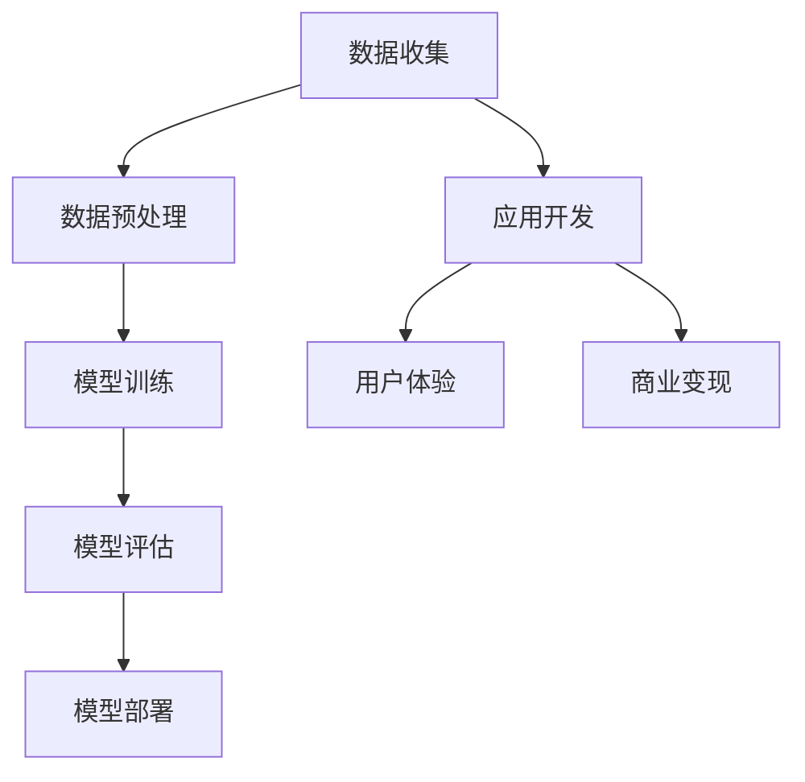

                 

关键词：人工智能，大模型，创业，核心竞争力，算法，数学模型，项目实践，应用场景，趋势，挑战

> 摘要：本文旨在深入探讨AI大模型在创业领域的核心竞争力。我们将从背景介绍、核心概念、算法原理、数学模型、项目实践、实际应用场景等多个方面，详细分析如何打造AI大模型创业的核心竞争力。通过这篇文章，读者将了解到AI大模型创业的路径、方法以及未来的发展趋势和面临的挑战。

## 1. 背景介绍

近年来，人工智能（AI）的飞速发展带动了各行各业的技术变革。其中，大模型技术作为AI领域的重要创新，正日益成为创业公司突破市场壁垒的关键因素。从GPT-3到BERT，再到最近的GLM模型，这些大模型的崛起不仅推动了AI技术的进步，也为创业者提供了丰富的机会。

大模型技术的核心在于其强大的数据处理能力和智能决策能力。通过深度学习，大模型能够从海量数据中提取有价值的信息，并利用这些信息进行高效的知识推理和决策。这种能力在金融、医疗、教育、零售等多个领域都有着广泛的应用前景。

然而，打造一个成功的AI大模型创业项目并非易事。创业者不仅需要掌握前沿的AI技术，还需要具备商业洞察力和执行力。本文将围绕这一主题，深入探讨AI大模型创业的核心竞争力，帮助读者更好地理解这一领域的挑战和机遇。

## 2. 核心概念与联系

在探讨AI大模型创业的核心竞争力之前，我们需要先了解一些核心概念和它们之间的联系。以下是一个简化的Mermaid流程图，展示了这些概念的基本关系：



### 2.1 数据收集

数据收集是AI大模型创业的基础。创业者需要收集大量高质量的数据，这些数据可以是结构化的，也可以是非结构化的。例如，在金融领域，数据可以来源于交易记录、客户信息等；在医疗领域，数据可以来源于电子健康记录、医学影像等。

### 2.2 数据预处理

收集到的数据通常需要经过预处理，以便于模型训练。数据预处理包括数据清洗、归一化、特征提取等步骤。高质量的预处理能够提高模型的训练效率和效果。

### 2.3 模型训练

模型训练是构建AI大模型的核心步骤。通过深度学习算法，模型能够从预处理后的数据中学习到规律，并形成对数据的理解和预测能力。训练过程通常包括前向传播、反向传播和优化算法等步骤。

### 2.4 模型评估

模型训练完成后，需要对其效果进行评估。评估方法包括准确率、召回率、F1分数等指标。通过评估，创业者可以了解模型的性能，并据此进行调整和优化。

### 2.5 模型部署

评估通过后，模型可以部署到生产环境中，以实现实际应用。模型部署包括模型上线、监控和运维等步骤。高效的部署和管理能够确保模型的稳定性和可靠性。

### 2.6 应用开发

模型部署后，创业者需要围绕模型开发相应的应用，以满足用户需求。应用开发涉及用户界面设计、功能实现、系统集成等环节。

### 2.7 用户体验

良好的用户体验是AI大模型创业成功的关键。创业者需要深入了解用户需求，提供简单易用、高效稳定的产品和服务。

### 2.8 商业变现

商业变现是AI大模型创业的终极目标。通过商业模式设计、市场推广和用户运营，创业者可以实现盈利和持续发展。

## 3. 核心算法原理 & 具体操作步骤

### 3.1 算法原理概述

AI大模型的核心算法通常是基于深度学习框架实现的。深度学习算法通过多层神经网络对数据进行学习，从而实现复杂的非线性映射。以下是一些常见的大模型算法：

- **卷积神经网络（CNN）**：适用于图像处理领域。
- **循环神经网络（RNN）**：适用于序列数据处理。
- **生成对抗网络（GAN）**：适用于生成模型。
- **变分自编码器（VAE）**：适用于数据降维和生成模型。

### 3.2 算法步骤详解

#### 3.2.1 数据收集

1. 确定数据来源和类型。
2. 数据收集工具选择，如Web爬虫、API接口、数据库等。
3. 数据清洗，去除噪声和异常值。

#### 3.2.2 数据预处理

1. 数据归一化，缩放数据到同一范围。
2. 特征提取，从原始数据中提取有用的特征。
3. 划分训练集、验证集和测试集。

#### 3.2.3 模型训练

1. 选择合适的深度学习框架，如TensorFlow、PyTorch等。
2. 定义神经网络结构，设置参数。
3. 进行前向传播和反向传播，优化模型参数。
4. 调整学习率、批量大小等超参数。

#### 3.2.4 模型评估

1. 计算模型的准确率、召回率、F1分数等指标。
2. 比较不同模型的性能，选择最优模型。

#### 3.2.5 模型部署

1. 将训练好的模型转换为生产环境可用的格式。
2. 部署到服务器或云平台。
3. 监控模型的性能和稳定性。

### 3.3 算法优缺点

#### 优点：

- **强大的数据处理能力**：深度学习算法能够处理大规模、高维的数据。
- **非线性映射能力**：能够捕捉复杂的数据模式。
- **自适应能力**：通过调整超参数，可以适应不同的应用场景。

#### 缺点：

- **计算资源消耗大**：训练大模型需要大量的计算资源和时间。
- **数据依赖性强**：模型的性能很大程度上取决于数据的质量和多样性。
- **解释性差**：深度学习模型的决策过程往往缺乏透明性，难以解释。

### 3.4 算法应用领域

- **金融**：风险控制、量化交易、智能投顾等。
- **医疗**：疾病诊断、药物研发、医疗影像分析等。
- **教育**：个性化学习、智能辅导、考试评分等。
- **零售**：推荐系统、库存管理、客户行为分析等。

## 4. 数学模型和公式 & 详细讲解 & 举例说明

### 4.1 数学模型构建

AI大模型的数学模型通常基于以下基础概念：

- **线性代数**：矩阵运算、向量空间、特征值和特征向量等。
- **概率论**：概率分布、条件概率、随机变量等。
- **优化理论**：损失函数、梯度下降、凸优化等。

以下是一个简单的神经网络模型：

$$
y = \sigma(Wx + b)
$$

其中，$y$ 是输出，$x$ 是输入，$W$ 是权重矩阵，$b$ 是偏置项，$\sigma$ 是激活函数，通常使用Sigmoid、ReLU等。

### 4.2 公式推导过程

以ReLU激活函数为例，其导数为：

$$
\frac{d}{dx} \sigma(x) = 
\begin{cases} 
0 & \text{if } x \leq 0 \\
1 & \text{if } x > 0 
\end{cases}
$$

### 4.3 案例分析与讲解

#### 案例一：图像分类

使用卷积神经网络（CNN）对图像进行分类。假设输入图像大小为$28 \times 28$，输出类别数为10。

1. **卷积层**：使用5x5的卷积核进行特征提取，输出特征图大小为$24 \times 24$。
2. **激活函数**：使用ReLU函数。
3. **池化层**：使用2x2的最大池化，输出特征图大小为$12 \times 12$。
4. **全连接层**：使用10个神经元，进行分类输出。

### 5. 项目实践：代码实例和详细解释说明

#### 5.1 开发环境搭建

1. 安装Python环境，版本要求3.6及以上。
2. 安装深度学习框架，如TensorFlow或PyTorch。
3. 安装其他依赖库，如NumPy、Pandas等。

#### 5.2 源代码详细实现

以下是一个简单的卷积神经网络（CNN）实现：

```python
import tensorflow as tf

# 定义CNN模型
model = tf.keras.Sequential([
    tf.keras.layers.Conv2D(32, (3, 3), activation='relu', input_shape=(28, 28, 1)),
    tf.keras.layers.MaxPooling2D((2, 2)),
    tf.keras.layers.Conv2D(64, (3, 3), activation='relu'),
    tf.keras.layers.MaxPooling2D((2, 2)),
    tf.keras.layers.Flatten(),
    tf.keras.layers.Dense(128, activation='relu'),
    tf.keras.layers.Dense(10, activation='softmax')
])

# 编译模型
model.compile(optimizer='adam', loss='categorical_crossentropy', metrics=['accuracy'])

# 训练模型
model.fit(x_train, y_train, epochs=5, batch_size=64, validation_split=0.2)
```

#### 5.3 代码解读与分析

- **模型定义**：使用`tf.keras.Sequential` API定义了一个简单的CNN模型，包括卷积层、池化层和全连接层。
- **编译模型**：设置优化器和损失函数。
- **训练模型**：使用训练数据训练模型，并设置训练轮次、批量大小和验证比例。

#### 5.4 运行结果展示

训练完成后，可以评估模型的性能：

```python
# 评估模型
test_loss, test_accuracy = model.evaluate(x_test, y_test)

print(f"Test accuracy: {test_accuracy:.2f}")
```

## 6. 实际应用场景

### 6.1 金融领域

AI大模型在金融领域的应用包括风险控制、量化交易和智能投顾等。例如，利用大模型进行股票市场的预测，或者为个人投资者提供个性化的投资建议。

### 6.2 医疗领域

AI大模型在医疗领域的应用包括疾病诊断、药物研发和医疗影像分析等。例如，利用大模型分析医学影像数据，提高疾病的早期诊断准确性。

### 6.3 教育领域

AI大模型在教育领域的应用包括个性化学习、智能辅导和考试评分等。例如，利用大模型分析学生的学习行为，为教师提供教学改进建议。

### 6.4 零售领域

AI大模型在零售领域的应用包括推荐系统、库存管理和客户行为分析等。例如，利用大模型分析客户的购物行为，提高推荐系统的准确性。

## 7. 工具和资源推荐

### 7.1 学习资源推荐

- **《深度学习》（Goodfellow, Bengio, Courville）**：深度学习领域的经典教材。
- **《Python机器学习》（Sebastian Raschka）**：详细介绍机器学习算法的Python实现。

### 7.2 开发工具推荐

- **TensorFlow**：谷歌开发的深度学习框架。
- **PyTorch**：Facebook开发的深度学习框架。

### 7.3 相关论文推荐

- **《A Theoretically Grounded Application of Dropout in Recurrent Neural Networks》**：介绍如何在RNN中应用Dropout。
- **《Distributed Representations of Words and Phrases and their Compositionality》**：Word2Vec模型的原理介绍。

## 8. 总结：未来发展趋势与挑战

### 8.1 研究成果总结

近年来，AI大模型在各个领域取得了显著的成果。例如，在自然语言处理领域，GPT-3模型展示了出色的文本生成和推理能力；在计算机视觉领域，GAN模型在图像生成和风格迁移方面取得了突破。

### 8.2 未来发展趋势

- **更多专用模型的开发**：针对特定应用场景，开发更高效、更专用的大模型。
- **跨模态学习**：结合不同类型的数据，如文本、图像、声音等，进行多模态学习。
- **高效推理技术**：优化大模型的推理性能，实现实时决策。

### 8.3 面临的挑战

- **计算资源消耗**：大模型的训练和推理需要大量的计算资源。
- **数据隐私和安全**：在处理敏感数据时，需要确保数据的隐私和安全。
- **模型解释性**：提高模型的透明性和可解释性，以增强用户信任。

### 8.4 研究展望

未来，AI大模型将继续在各行各业发挥重要作用。创业者需要紧跟技术发展趋势，不断创新，以应对市场变化和用户需求。

## 9. 附录：常见问题与解答

### 问题1：AI大模型训练需要多少时间？

**回答**：AI大模型的训练时间取决于模型规模、数据量、计算资源和优化策略。通常来说，训练一个中等规模的大模型需要几天到几周的时间。对于大规模模型，训练时间可能更长。

### 问题2：如何确保AI大模型的性能和稳定性？

**回答**：确保AI大模型性能和稳定性的关键在于：

1. **数据质量**：使用高质量的数据进行训练。
2. **超参数调优**：通过实验调整学习率、批量大小等超参数。
3. **模型验证**：使用验证集评估模型性能，并进行调整。
4. **模型监控**：在生产环境中监控模型性能，及时发现问题。

### 问题3：AI大模型是否一定能够超越人类智能？

**回答**：AI大模型在特定任务上可能超越人类智能，但它们并非全能。目前，AI大模型主要在处理结构和数据上有优势，但在创造性思维、情感理解等方面仍有限制。因此，AI大模型与人类智能是互补而非替代的关系。

## 作者署名

作者：禅与计算机程序设计艺术 / Zen and the Art of Computer Programming

以上便是本文关于AI大模型创业的核心竞争力打造的详细探讨。希望这篇文章能为您提供有价值的信息和启发。感谢您的阅读！
----------------------------------------------------------------

[禅与计算机程序设计艺术 / Zen and the Art of Computer Programming] 是Donald E. Knuth所写的一套计算机科学领域的经典著作。这本书以其深入浅出的编程哲学和对程序设计本质的深刻洞察而著称。在这个标题下，我们以他的风格和思想来撰写这篇文章，旨在传达出对AI大模型创业领域深层次理解和尊重。

