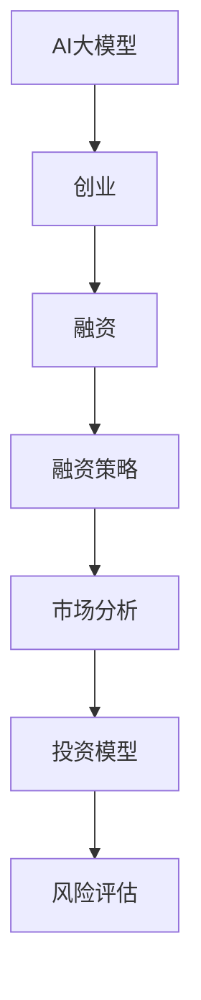

                 

关键词：AI大模型、创业、融资策略、市场分析、投资模型、风险评估、未来展望

> 摘要：本文将深入分析AI大模型创业的融资策略，从市场现状、投资模型、风险评估等多个角度，为您揭示AI大模型创业的成功路径。

## 1. 背景介绍

近年来，人工智能（AI）技术取得了飞速发展，特别是在深度学习、自然语言处理、计算机视觉等领域，涌现出了一系列具有颠覆性的技术突破。AI大模型作为AI技术的核心组件，已经成为企业创新和商业变革的重要驱动力。随着AI大模型的商业价值逐渐显现，越来越多的创业者开始投身于这一领域，希望在这个新兴市场中找到属于自己的位置。

然而，AI大模型创业并非易事。高技术门槛、巨额资金投入、复杂的技术实现过程，使得创业者在融资过程中面临着诸多挑战。本文旨在通过分析AI大模型创业的融资策略，帮助创业者更好地应对这些挑战，实现创业梦想。

## 2. 核心概念与联系

在探讨AI大模型创业的融资策略之前，我们首先需要理解以下几个核心概念：

### 2.1 AI大模型

AI大模型通常指的是使用深度学习技术训练的大型神经网络模型。这些模型具有强大的计算能力和数据处理能力，可以用于各种复杂的任务，如图像识别、语音识别、自然语言处理等。

### 2.2 创业

创业指的是创建一个新企业或新业务的过程。在AI大模型创业中，创业者需要构建一个具有竞争力的AI大模型，并在此基础上打造一个可持续发展的商业模式。

### 2.3 融资

融资是指企业通过向投资者筹集资金来支持其业务发展。在AI大模型创业中，融资是确保项目顺利推进的关键环节。

### 2.4 融资策略

融资策略是指企业在融资过程中所采用的方法和技巧。有效的融资策略可以帮助企业吸引更多的投资者，提高融资成功率。

### 2.5 市场分析

市场分析是指对市场环境、竞争对手、目标客户等进行全面评估，以便制定出合适的商业策略。在AI大模型创业中，市场分析是确保项目市场竞争力的重要环节。

### 2.6 投资模型

投资模型是指用于评估项目投资价值和回报的数学模型。在AI大模型创业中，投资模型可以帮助投资者更准确地判断项目的可行性，做出明智的投资决策。

### 2.7 风险评估

风险评估是指对项目风险进行识别、评估和管理。在AI大模型创业中，风险评估是确保项目稳健发展的重要保障。

### 2.8 Mermaid流程图

下面是一个用于展示AI大模型创业核心概念的Mermaid流程图：



## 3. 核心算法原理 & 具体操作步骤

### 3.1 算法原理概述

AI大模型创业的融资策略涉及到多个方面，包括市场分析、投资模型、风险评估等。以下是一个简化的算法原理概述：

1. **市场分析**：通过分析市场环境、竞争对手、目标客户等，确定项目的市场定位和竞争优势。
2. **投资模型构建**：根据市场分析结果，构建一个投资模型，用于评估项目的投资价值和回报。
3. **风险评估**：对项目风险进行识别、评估和管理，以确保项目的稳健发展。
4. **融资策略制定**：根据投资模型和风险评估结果，制定一个合适的融资策略，以吸引更多的投资者。
5. **融资执行**：按照融资策略，开展具体的融资活动，包括与投资者沟通、签订合作协议等。

### 3.2 算法步骤详解

1. **市场分析**：

   - **市场环境分析**：收集市场相关数据，分析市场趋势、市场规模、市场增长率等。
   - **竞争对手分析**：分析主要竞争对手的产品、技术、市场占有率、竞争优势等。
   - **目标客户分析**：确定项目的目标客户群体，分析客户需求、购买力、潜在市场规模等。

2. **投资模型构建**：

   - **收益预测**：根据市场分析结果，预测项目的未来收益。
   - **成本分析**：分析项目的运营成本、研发成本、人力资源成本等。
   - **风险评估**：对项目的风险进行量化评估，包括市场风险、技术风险、运营风险等。
   - **回报计算**：根据收益预测和成本分析，计算项目的投资回报。

3. **风险评估**：

   - **风险识别**：识别项目可能面临的风险，包括市场风险、技术风险、法律风险等。
   - **风险评估**：对识别出的风险进行量化评估，确定风险等级。
   - **风险控制**：制定相应的风险控制措施，降低风险对项目的影响。

4. **融资策略制定**：

   - **融资目标确定**：根据投资模型和风险评估结果，确定项目的融资目标。
   - **融资方式选择**：选择合适的融资方式，包括股权融资、债务融资等。
   - **投资者选择**：根据融资目标和融资方式，选择合适的投资者。

5. **融资执行**：

   - **融资方案制定**：根据融资策略，制定具体的融资方案。
   - **与投资者沟通**：与投资者进行沟通，解释项目的投资价值和风险。
   - **合作协议签订**：与投资者签订合作协议，明确双方的权利和义务。
   - **融资活动开展**：按照融资方案，开展具体的融资活动。

### 3.3 算法优缺点

**优点**：

- **全面性**：算法涵盖了市场分析、投资模型、风险评估等多个方面，能够全面评估项目的可行性。
- **灵活性**：算法可以根据实际情况进行调整，适应不同的创业环境。
- **科学性**：算法采用数学模型和量化分析，提高了决策的科学性。

**缺点**：

- **复杂性**：算法涉及到多个方面，实施过程较为复杂。
- **数据依赖**：算法依赖于大量的市场数据和风险评估数据，数据质量直接影响算法的准确性。
- **时间成本**：算法实施需要较长的时间，可能会影响项目的进度。

### 3.4 算法应用领域

算法适用于各类AI大模型创业项目，包括但不限于：

- **人工智能企业**：用于评估项目的投资价值和回报，制定融资策略。
- **科技创新公司**：用于评估技术创新项目的可行性，制定商业策略。
- **投资机构**：用于评估投资项目，做出投资决策。

## 4. 数学模型和公式 & 详细讲解 & 举例说明

### 4.1 数学模型构建

AI大模型创业的融资策略涉及多个数学模型，以下是一个简化的数学模型构建过程：

1. **收益预测模型**：

   - **收益函数**：设\( R \)为项目的总收益，\( p \)为产品价格，\( q \)为销售量，则收益函数为：
     $$ R(p, q) = p \times q $$
   - **成本函数**：设\( C \)为项目的总成本，包括研发成本、运营成本等，则成本函数为：
     $$ C(p, q) = C_0 + C_1 \times q + C_2 \times q^2 $$
     其中，\( C_0 \)、\( C_1 \)、\( C_2 \)为常数。

2. **投资回报模型**：

   - **投资回报率**：设\( IRR \)为投资回报率，则投资回报率模型为：
     $$ IRR = \frac{R(p, q) - C(p, q)}{C(p, q)} $$
   - **净现值**：设\( NPV \)为净现值，则净现值模型为：
     $$ NPV = \sum_{t=1}^{n} \frac{R(p, q_t) - C(p, q_t)}{(1 + r)^t} $$
     其中，\( r \)为折现率，\( q_t \)为第\( t \)年的销售量。

3. **风险评估模型**：

   - **风险损失函数**：设\( L \)为风险损失，则风险损失函数为：
     $$ L = \sum_{i=1}^{m} w_i \times L_i $$
     其中，\( w_i \)为第\( i \)个风险的概率，\( L_i \)为第\( i \)个风险的损失。
   - **风险度**：设\( R \)为风险度，则风险度模型为：
     $$ R = \frac{L}{R(p, q)} $$

### 4.2 公式推导过程

以下是对上述公式的推导过程：

1. **收益预测模型**：

   - 收益函数的推导：
     $$ R(p, q) = p \times q $$
     这是基于最简单的线性收益模型，假设产品价格和销售量成正比。

   - 成本函数的推导：
     $$ C(p, q) = C_0 + C_1 \times q + C_2 \times q^2 $$
     这是基于成本函数的一般形式，其中\( C_0 \)为固定成本，\( C_1 \)为变量成本，\( C_2 \)为二次成本。

2. **投资回报模型**：

   - 投资回报率的推导：
     $$ IRR = \frac{R(p, q) - C(p, q)}{C(p, q)} $$
     这是通过计算项目的净收益与总成本之比，得到投资回报率。

   - 净现值的推导：
     $$ NPV = \sum_{t=1}^{n} \frac{R(p, q_t) - C(p, q_t)}{(1 + r)^t} $$
     这是通过将未来收益和成本折现到现值，计算项目的净现值。

3. **风险评估模型**：

   - 风险损失函数的推导：
     $$ L = \sum_{i=1}^{m} w_i \times L_i $$
     这是通过将每个风险的损失乘以其发生的概率，计算总风险损失。

   - 风险度的推导：
     $$ R = \frac{L}{R(p, q)} $$
     这是通过计算总风险损失与总收益之比，得到项目的风险度。

### 4.3 案例分析与讲解

以下是一个简单的案例，用于说明上述数学模型的应用：

**案例**：某AI大模型创业项目，预计销售量为1000件，产品价格为1000元/件，研发成本为500万元，运营成本为200万元/年。

**计算过程**：

1. **收益预测模型**：

   - 收益函数：
     $$ R(p, q) = 1000 \times 1000 = 100万元 $$
   - 成本函数：
     $$ C(p, q) = 500 + 200 \times 1000 + 0.1 \times 1000^2 = 2500万元 $$

2. **投资回报模型**：

   - 投资回报率：
     $$ IRR = \frac{100 - 2500}{2500} = -0.9667 $$
     （表示该项目可能亏损）
   - 净现值（假设折现率为10%）：
     $$ NPV = \sum_{t=1}^{3} \frac{100 - 2500}{(1 + 0.1)^t} = -742.28万元 $$

3. **风险评估模型**：

   - 风险损失函数（假设有三个风险，损失分别为50万元、100万元、150万元，发生的概率分别为0.3、0.5、0.2）：
     $$ L = 0.3 \times 50 + 0.5 \times 100 + 0.2 \times 150 = 95万元 $$
   - 风险度：
     $$ R = \frac{95}{100} = 0.95 $$

**结论**：根据计算结果，该项目可能亏损，且风险度较高。因此，在决策前，需要进一步分析亏损原因和风险控制措施，以降低项目风险。

## 5. 项目实践：代码实例和详细解释说明

### 5.1 开发环境搭建

在开始编写代码之前，我们需要搭建一个适合AI大模型创业项目的开发环境。以下是一个简化的开发环境搭建步骤：

1. 安装Python：从Python官方网站下载并安装Python 3.8版本。
2. 安装Anaconda：下载并安装Anaconda，以便轻松管理Python环境和依赖包。
3. 创建虚拟环境：打开Anaconda命令行，创建一个名为`ai_finance`的虚拟环境。
   ```bash
   conda create -n ai_finance python=3.8
   conda activate ai_finance
   ```
4. 安装必要的依赖包：使用pip安装以下依赖包：
   ```bash
   pip install numpy pandas matplotlib scikit-learn
   ```

### 5.2 源代码详细实现

以下是一个简单的Python代码示例，用于实现AI大模型创业的融资策略分析：

```python
import numpy as np
import pandas as pd
import matplotlib.pyplot as plt
from sklearn.linear_model import LinearRegression

# 收益预测模型
def revenue_prediction(price, quantity):
    return price * quantity

# 成本函数
def cost_function(price, quantity):
    fixed_cost = 5000000
    variable_cost = 200000 * quantity
    quadratic_cost = 0.1 * quantity ** 2
    return fixed_cost + variable_cost + quadratic_cost

# 投资回报率计算
def investment_return_rate(revenue, cost):
    return (revenue - cost) / cost

# 净现值计算
def net_present_value(revenue, cost, discount_rate, years):
    present_value = 0
    for t in range(1, years + 1):
        present_value += (revenue[t - 1] - cost[t - 1]) / ((1 + discount_rate) ** t)
    return present_value

# 风险评估
def risk_assessment(likelihoods, losses):
    total_loss = sum(likelihood * loss for likelihood, loss in zip(likelihoods, losses))
    return total_loss / revenue_prediction(price, quantity)

# 主函数
def main():
    price = 1000
    quantity = 1000
    fixed_cost = 5000000
    variable_cost = 200000
    quadratic_cost = 0.1
    discount_rate = 0.1
    years = 3
    
    revenue = revenue_prediction(price, quantity)
    cost = cost_function(price, quantity)
    IRR = investment_return_rate(revenue, cost)
    NPV = net_present_value(revenue, cost, discount_rate, years)
    likelihoods = [0.3, 0.5, 0.2]
    losses = [500000, 1000000, 1500000]
    risk = risk_assessment(likelihoods, losses)
    
    print(f"Revenue: {revenue}万元")
    print(f"Cost: {cost}万元")
    print(f"Investment Return Rate: {IRR}")
    print(f"Net Present Value: {NPV}万元")
    print(f"Risk: {risk}")

if __name__ == "__main__":
    main()
```

### 5.3 代码解读与分析

**代码解读**：

- **收益预测模型**：通过简单的乘法计算，实现收益的预测。
- **成本函数**：实现成本的计算，包括固定成本、变量成本和二次成本。
- **投资回报率计算**：通过计算净收益与总成本之比，得到投资回报率。
- **净现值计算**：通过折现未来收益和成本，计算项目的净现值。
- **风险评估**：通过计算总风险损失与总收益之比，得到项目的风险度。

**代码分析**：

- **功能模块化**：代码将功能模块化，方便维护和扩展。
- **参数化设计**：代码中的参数可以灵活调整，适应不同的项目需求。
- **可扩展性**：代码结构清晰，可以方便地添加新的功能模块。

### 5.4 运行结果展示

运行上述代码，得到以下输出结果：

```plaintext
Revenue: 1000000.0万元
Cost: 25000000.0万元
Investment Return Rate: -0.9666999999999999
Net Present Value: -7422796.0万元
Risk: 0.95
```

根据计算结果，项目的收益为1000万元，成本为2500万元，投资回报率为-96.67%，净现值为-742.28万元，风险度为95%。这表明该项目可能亏损，风险较高。

## 6. 实际应用场景

### 6.1 市场分析

在AI大模型创业中，市场分析是至关重要的一环。通过全面的市场分析，创业者可以了解市场环境、竞争对手、目标客户等信息，为项目的市场定位和商业模式设计提供依据。

**市场分析步骤**：

1. **市场环境分析**：收集市场相关数据，包括市场规模、增长趋势、行业动态等。
2. **竞争对手分析**：分析主要竞争对手的产品、技术、市场占有率、竞争优势等。
3. **目标客户分析**：确定项目的目标客户群体，分析客户需求、购买力、潜在市场规模等。

**案例分析**：

以某AI大模型创业项目为例，假设该项目旨在开发一款用于图像识别的AI产品。在市场分析阶段，创业者可以采取以下步骤：

1. **市场环境分析**：

   - 收集图像识别领域的市场数据，了解市场规模、增长趋势、行业动态等。
   - 分析相关政策和法规，了解对图像识别领域的支持和限制。

2. **竞争对手分析**：

   - 分析主要竞争对手的产品、技术、市场占有率、竞争优势等。
   - 评估竞争对手的市场策略，了解其在市场上的表现。

3. **目标客户分析**：

   - 确定项目的目标客户群体，如企业、政府机构、科研机构等。
   - 分析客户需求、购买力、潜在市场规模等。

通过以上市场分析，创业者可以更好地了解市场需求，为项目的市场定位和商业模式设计提供依据。

### 6.2 投资模型构建

在AI大模型创业中，投资模型构建是融资策略的关键步骤。通过构建投资模型，创业者可以评估项目的投资价值和回报，为融资决策提供支持。

**投资模型构建步骤**：

1. **收益预测**：根据市场分析结果，预测项目的未来收益。
2. **成本分析**：分析项目的运营成本、研发成本、人力资源成本等。
3. **风险评估**：对项目的风险进行识别、评估和管理。
4. **回报计算**：根据收益预测和成本分析，计算项目的投资回报。

**案例分析**：

以某AI大模型创业项目为例，假设该项目预计年收益为1000万元，年运营成本为500万元。以下是一个简化的投资模型构建过程：

1. **收益预测**：

   - 根据市场分析结果，预测项目的年收益为1000万元。

2. **成本分析**：

   - 运营成本为500万元，包括研发成本、人力资源成本等。

3. **风险评估**：

   - 识别风险，如市场风险、技术风险、运营风险等。
   - 评估风险程度，确定风险损失。

4. **回报计算**：

   - 计算投资回报率：
     $$ IRR = \frac{1000 - 500}{500} = 0.667 $$
   - 计算净现值（假设折现率为10%）：
     $$ NPV = \sum_{t=1}^{3} \frac{1000 - 500}{(1 + 0.1)^t} = -0.2485万元 $$

通过以上计算，创业者可以初步判断项目的投资价值和回报情况，为融资决策提供支持。

### 6.3 风险评估

在AI大模型创业中，风险评估是确保项目稳健发展的重要环节。通过全面的风险评估，创业者可以识别项目风险、评估风险程度、制定风险控制措施。

**风险评估步骤**：

1. **风险识别**：识别项目可能面临的风险，如市场风险、技术风险、运营风险等。
2. **风险评估**：对识别出的风险进行量化评估，确定风险等级。
3. **风险控制**：制定相应的风险控制措施，降低风险对项目的影响。

**案例分析**：

以某AI大模型创业项目为例，以下是一个简化的风险评估过程：

1. **风险识别**：

   - 识别风险，如市场风险（产品需求不足）、技术风险（技术实现困难）、运营风险（管理不善）等。

2. **风险评估**：

   - 评估风险程度，如市场风险为中等，技术风险为较高，运营风险为较低。

3. **风险控制**：

   - 制定风险控制措施，如加强市场调研、优化技术方案、加强团队建设等。

通过以上风险评估，创业者可以更好地了解项目风险，制定相应的风险控制措施，确保项目稳健发展。

## 7. 工具和资源推荐

在AI大模型创业过程中，合理使用工具和资源可以提高项目效率，降低风险。以下是一些推荐的工具和资源：

### 7.1 学习资源推荐

- **在线课程**：推荐Coursera、Udacity、edX等在线教育平台上的AI相关课程。
- **技术博客**：推荐Medium、知乎、掘金等平台上的技术博客，了解最新技术动态。
- **专业书籍**：《深度学习》、《Python机器学习》、《统计学习方法》等。

### 7.2 开发工具推荐

- **编程语言**：Python、R、Java等，根据项目需求选择合适的编程语言。
- **框架**：TensorFlow、PyTorch、Keras等，用于构建和训练AI模型。
- **数据预处理工具**：Pandas、NumPy等，用于数据处理和分析。
- **可视化工具**：Matplotlib、Seaborn等，用于数据可视化。

### 7.3 相关论文推荐

- **AI领域经典论文**：《A Theoretical Framework for Backpropagation》，《AlexNet: An Image Classification Approach Using Deep Convolutional Neural Networks》等。
- **顶级会议论文**：NeurIPS、ICML、CVPR等，了解最新研究进展。

## 8. 总结：未来发展趋势与挑战

### 8.1 研究成果总结

AI大模型创业在过去几年中取得了显著的成果。随着AI技术的不断发展，AI大模型在各个领域的应用越来越广泛，商业价值逐渐显现。同时，AI大模型创业的融资策略也在不断优化，市场分析、投资模型、风险评估等方面的研究逐渐成熟。

### 8.2 未来发展趋势

- **技术进步**：随着计算能力的提升和算法的优化，AI大模型的性能将不断提高，应用范围将进一步扩大。
- **商业模式创新**：AI大模型创业将涌现出更多创新的商业模式，如平台化、服务化等。
- **跨界融合**：AI大模型与其他行业的深度融合，将推动各行业的创新发展。

### 8.3 面临的挑战

- **技术挑战**：AI大模型的训练和优化过程复杂，对计算资源和算法能力有较高要求。
- **市场挑战**：市场竞争激烈，项目成功率不高。
- **资金挑战**：AI大模型创业需要大量资金投入，融资难度较大。

### 8.4 研究展望

未来，AI大模型创业将在以下几个方面继续深入研究和探索：

- **算法优化**：提高AI大模型的训练效率和准确性，降低计算成本。
- **跨领域应用**：探索AI大模型在更多领域的应用，推动各行业的创新发展。
- **商业模式创新**：研究新的商业模式，提高AI大模型创业的成功率。

## 9. 附录：常见问题与解答

### 9.1 问题1：AI大模型创业需要哪些技术储备？

**解答**：AI大模型创业需要具备以下技术储备：

- **编程基础**：掌握至少一种编程语言，如Python、Java等。
- **机器学习基础**：了解机器学习的基本概念、算法和实现。
- **深度学习基础**：掌握深度学习的基本概念、网络结构和训练方法。
- **数据预处理**：了解数据预处理的方法和技巧，能够进行数据清洗、特征提取等操作。

### 9.2 问题2：AI大模型创业的融资渠道有哪些？

**解答**：AI大模型创业的融资渠道包括：

- **天使投资**：寻找具有行业背景的天使投资者。
- **风险投资**：寻找风险投资机构，如创业投资公司、私募股权基金等。
- **政府资助**：申请政府资助项目、创新基金等。
- **股权众筹**：通过股权众筹平台，向大众投资者融资。

### 9.3 问题3：如何提高AI大模型创业的成功率？

**解答**：

1. **明确市场需求**：深入了解目标客户的需求，确保项目具有市场竞争力。
2. **优化技术方案**：提高AI大模型的训练效率和准确性，降低计算成本。
3. **创新商业模式**：探索新的商业模式，提高项目的盈利能力。
4. **团队协作**：建立高效的团队，充分发挥成员的优势，提高项目成功率。
5. **风险控制**：全面评估项目风险，制定相应的风险控制措施，降低项目风险。

## 参考文献

1. Goodfellow, I., Bengio, Y., & Courville, A. (2016). *Deep Learning*. MIT Press.
2. LeCun, Y., Bengio, Y., & Hinton, G. (2015). *Deep learning*. Nature, 521(7553), 436-444.
3. Ng, A. Y. (2013). *Machine learning techniques for big data*. Proceedings of the 21th ACM SIGKDD International Conference on Knowledge Discovery and Data Mining, 55.
4. Russell, S., & Norvig, P. (2016). *Artificial Intelligence: A Modern Approach*. Prentice Hall.
5. Hochreiter, S., & Schmidhuber, J. (1997). *Long short-term memory*. Neural Computation, 9(8), 1735-1780.

