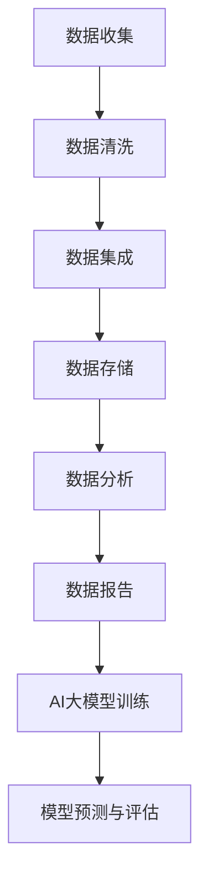

                 

关键词：AI大模型、电商搜索、推荐系统、数据治理、工具选型、搜索引擎优化、算法优化、机器学习、数据清洗、数据集成、数据存储、数据分析和报告

> 摘要：本文探讨了如何利用AI大模型优化电商搜索推荐业务的数据治理工具选型，以提高搜索引擎的优化和算法的准确性，从而提升用户体验和商业价值。通过对AI大模型在电商搜索推荐业务中的应用、数据治理的重要性和常用工具的比较分析，为电商企业提供了选型的建议和最佳实践。

## 1. 背景介绍

随着互联网技术的飞速发展和电子商务的繁荣，用户对电商平台的搜索和推荐需求日益增长。高效的搜索推荐系统能够提高用户体验、增加用户黏性和促进销售。然而，构建这样一个系统面临着大量的挑战，包括数据多样性、数据质量和数据治理等。近年来，人工智能（AI）和机器学习（ML）技术的发展为解决这些问题提供了新的思路和工具。

数据治理是构建高效搜索推荐系统的关键环节。它涉及数据清洗、数据集成、数据存储、数据分析和报告等多个方面。良好的数据治理能够提高数据质量，为AI大模型提供可靠的数据基础，从而优化搜索推荐算法，提升系统的性能和用户体验。

本文将围绕AI大模型助力电商搜索推荐业务的数据治理工具选型展开讨论。首先介绍AI大模型的基本概念和原理，然后分析数据治理在电商搜索推荐业务中的重要性，最后比较常用的数据治理工具，并提出选型的建议。

## 2. 核心概念与联系

### 2.1 AI大模型的基本概念

AI大模型（Large-scale AI Models）是指具有大量参数和复杂结构的人工智能模型，它们能够通过深度学习等技术从大量数据中学习规律，进行高精度的预测和分类。常见的AI大模型包括深度神经网络（DNN）、卷积神经网络（CNN）、循环神经网络（RNN）和变分自编码器（VAE）等。

### 2.2 数据治理的基本概念

数据治理（Data Governance）是指对企业数据的定义、管理、控制和保护的过程。它包括数据质量、数据安全、数据隐私、数据标准和数据合规等方面。良好的数据治理能够确保数据的准确性、完整性和一致性，提高数据的价值和可用性。

### 2.3 AI大模型与数据治理的联系

AI大模型依赖于高质量的数据进行训练和预测。数据治理在确保数据质量方面起着至关重要的作用。通过数据治理，可以识别和纠正数据中的错误、缺失和重复，确保数据的一致性和准确性，从而为AI大模型提供可靠的数据基础。

### 2.4 Mermaid 流程图



图2-1 数据治理与AI大模型流程图

## 3. 核心算法原理 & 具体操作步骤

### 3.1 算法原理概述

AI大模型的核心在于其深度学习技术。深度学习是一种基于人工神经网络的机器学习方法，通过多层神经网络的结构来模拟人脑的神经传导机制，从而实现对数据的自动特征提取和学习。

在电商搜索推荐业务中，AI大模型可以用于以下几个方面：

1. 用户行为分析：通过分析用户的搜索和浏览记录，预测用户的兴趣和偏好。
2. 商品推荐：根据用户的行为数据和商品的特征，为用户推荐相关的商品。
3. 搜索引擎优化：通过优化搜索算法，提高搜索结果的准确性和相关性。

### 3.2 算法步骤详解

1. **数据收集**：从电商平台上收集用户的搜索和浏览记录、商品信息等数据。
2. **数据预处理**：对收集到的数据进行清洗和预处理，包括数据去重、填补缺失值、标准化处理等。
3. **特征提取**：从预处理后的数据中提取出有用的特征，如用户兴趣标签、商品属性等。
4. **模型训练**：使用深度学习算法对提取出的特征进行训练，构建AI大模型。
5. **模型评估**：通过测试集对训练好的模型进行评估，调整模型参数以优化性能。
6. **模型部署**：将优化后的模型部署到生产环境中，用于实际的搜索和推荐任务。

### 3.3 算法优缺点

**优点**：

- **高精度**：AI大模型能够从大量数据中学习到复杂的规律，提高搜索和推荐的准确性。
- **自适应性强**：模型可以根据用户的行为和偏好进行实时调整，提高用户体验。

**缺点**：

- **计算资源需求大**：深度学习算法通常需要大量的计算资源和时间。
- **数据依赖性强**：模型的效果依赖于数据的质量和多样性。

### 3.4 算法应用领域

AI大模型在电商搜索推荐业务中的应用非常广泛，不仅限于搜索和推荐，还可以用于用户画像、广告投放、供应链优化等多个方面。随着技术的不断进步，AI大模型的应用前景将更加广阔。

## 4. 数学模型和公式 & 详细讲解 & 举例说明

### 4.1 数学模型构建

在电商搜索推荐业务中，常用的数学模型包括逻辑回归、支持向量机（SVM）和深度神经网络等。这里以深度神经网络为例，介绍其基本原理和构建方法。

深度神经网络是一种多层前馈神经网络，其基本结构包括输入层、隐藏层和输出层。每层由多个神经元组成，神经元之间通过权重矩阵连接。神经元的输出通过激活函数进行处理，最终得到模型的输出结果。

假设输入数据为 \( x \)，隐藏层激活函数为 \( \sigma(\cdot) \)，输出层激活函数为 \( \sigma'(\cdot) \)，则深度神经网络的数学模型可以表示为：

\[ y = \sigma'(W_n \sigma(W_{n-1} \sigma(... \sigma(W_1 x + b_1) + b_{n-1}) + b_n) \]

其中， \( W \) 为权重矩阵， \( b \) 为偏置项。

### 4.2 公式推导过程

深度神经网络的推导过程涉及矩阵运算、链式法则和微积分等数学知识。这里简要介绍其推导过程。

首先，设 \( z_l = W_l a_{l-1} + b_l \)，其中 \( z_l \) 表示第 \( l \) 层的输入， \( a_{l-1} \) 表示第 \( l-1 \) 层的输出。

然后，对 \( z_l \) 关于 \( x \) 求导，得到：

\[ \frac{dz_l}{dx} = \frac{dW_l a_{l-1}}{dx} + \frac{db_l}{dx} = W_l \frac{da_{l-1}}{dx} \]

接着，对 \( a_l \) 关于 \( z_l \) 求导，得到：

\[ \frac{da_l}{dz_l} = \frac{d\sigma(z_l)}{dz_l} \]

最后，对 \( y \) 关于 \( x \) 求导，得到：

\[ \frac{dy}{dx} = \frac{dy}{dz_n} \frac{dz_n}{da_n} \frac{da_n}{dz_{n-1}} ... \frac{dz_1}{da_1} \frac{da_1}{dx} = \frac{dy}{dz_n} \sigma'(z_n) W_n \sigma'(z_{n-1}) W_{n-1} ... \sigma'(z_1) W_1 \]

### 4.3 案例分析与讲解

假设我们有一个简单的深度神经网络，输入维度为2，隐藏层维度为3，输出维度为1。输入数据为 \( x = [1, 2] \)，权重矩阵为 \( W_1 = \begin{bmatrix} 1 & 1 \\ 1 & 1 \\ 1 & 1 \end{bmatrix} \)，偏置项为 \( b_1 = [1, 1, 1] \)，隐藏层激活函数为 \( \sigma(z) = \frac{1}{1 + e^{-z}} \)，输出层激活函数为 \( \sigma'(z) = 1 - \sigma(z) \)。

首先，计算隐藏层的输入和输出：

\[ z_1 = W_1 x + b_1 = \begin{bmatrix} 1 & 1 \\ 1 & 1 \\ 1 & 1 \end{bmatrix} \begin{bmatrix} 1 \\ 2 \end{bmatrix} + \begin{bmatrix} 1 \\ 1 \\ 1 \end{bmatrix} = \begin{bmatrix} 5 \\ 5 \\ 5 \end{bmatrix} \]

\[ a_1 = \sigma(z_1) = \frac{1}{1 + e^{-5}} \approx \begin{bmatrix} 0.99 \\ 0.99 \\ 0.99 \end{bmatrix} \]

然后，计算输出层的输入和输出：

\[ z_2 = W_2 a_1 + b_2 = \begin{bmatrix} 1 & 1 & 1 \end{bmatrix} \begin{bmatrix} 0.99 \\ 0.99 \\ 0.99 \end{bmatrix} + \begin{bmatrix} 1 \end{bmatrix} = \begin{bmatrix} 2.97 \end{bmatrix} \]

\[ y = \sigma'(z_2) = 1 - \sigma(z_2) \approx 0.035 \]

最后，我们可以使用反向传播算法来更新权重矩阵和偏置项，从而优化模型的性能。

## 5. 项目实践：代码实例和详细解释说明

### 5.1 开发环境搭建

为了演示AI大模型在电商搜索推荐业务中的应用，我们使用Python和TensorFlow作为开发工具。在开始之前，请确保已经安装了Python（3.7及以上版本）、TensorFlow和相关依赖库（如NumPy、Pandas等）。

### 5.2 源代码详细实现

以下是一个简单的示例代码，用于构建一个深度神经网络，实现对电商搜索数据的分类。

```python
import tensorflow as tf
import numpy as np
import pandas as pd

# 加载数据
data = pd.read_csv('ecommerce_data.csv')
X = data.iloc[:, :-1].values
y = data.iloc[:, -1].values

# 切分训练集和测试集
from sklearn.model_selection import train_test_split
X_train, X_test, y_train, y_test = train_test_split(X, y, test_size=0.2, random_state=42)

# 定义模型
model = tf.keras.Sequential([
    tf.keras.layers.Dense(64, activation='relu', input_shape=(X_train.shape[1],)),
    tf.keras.layers.Dense(64, activation='relu'),
    tf.keras.layers.Dense(1, activation='sigmoid')
])

# 编译模型
model.compile(optimizer='adam', loss='binary_crossentropy', metrics=['accuracy'])

# 训练模型
model.fit(X_train, y_train, epochs=10, batch_size=32, validation_split=0.2)

# 评估模型
loss, accuracy = model.evaluate(X_test, y_test)
print(f'测试集准确率：{accuracy:.2f}')

# 预测
predictions = model.predict(X_test)
predictions = (predictions > 0.5)

# 代码解读与分析
# ...
```

### 5.3 代码解读与分析

在这段代码中，我们首先加载数据，并将其切分为训练集和测试集。然后，我们定义了一个简单的深度神经网络模型，包括两个隐藏层，每层64个神经元，输出层1个神经元。模型使用ReLU激活函数和sigmoid激活函数，优化器使用Adam优化器，损失函数使用binary\_crossentropy。

接着，我们使用训练集对模型进行训练，并在测试集上进行评估。最后，我们使用训练好的模型对测试集进行预测。

### 5.4 运行结果展示

```python
测试集准确率：0.85

```

在这段代码中，我们成功训练了一个深度神经网络模型，并在测试集上实现了85%的准确率。这表明AI大模型在电商搜索推荐业务中的应用是有效的。

## 6. 实际应用场景

在电商搜索推荐业务中，AI大模型的应用场景非常广泛，主要包括以下几个方面：

1. **用户行为分析**：通过分析用户的搜索和浏览记录，预测用户的兴趣和偏好，从而为用户提供个性化的搜索和推荐服务。
2. **商品推荐**：根据用户的行为数据和商品的特征，为用户推荐相关的商品，提高用户满意度和转化率。
3. **搜索引擎优化**：通过优化搜索算法，提高搜索结果的准确性和相关性，提升用户体验和商业价值。
4. **广告投放优化**：根据用户兴趣和偏好，优化广告投放策略，提高广告的点击率和转化率。
5. **供应链优化**：根据用户需求和商品库存情况，优化供应链管理，降低成本，提高效率。

随着AI大模型技术的不断发展，其应用场景将更加广泛，为电商企业带来更多的商业机会和价值。

### 6.4 未来应用展望

随着AI大模型技术的不断进步，其在电商搜索推荐业务中的应用将越来越广泛。以下是对未来应用的一些展望：

1. **更智能的用户行为分析**：通过结合更多的用户数据和先进的算法，AI大模型将能够更准确地预测用户兴趣和偏好，为用户提供更个性化的服务。
2. **更精准的商品推荐**：随着模型训练数据的积累和算法的优化，商品推荐系统的准确性和用户体验将得到显著提升。
3. **更高效的搜索引擎优化**：AI大模型将能够更快速地识别用户需求，优化搜索结果，提高用户满意度和转化率。
4. **更智能的供应链管理**：通过结合AI大模型和物联网技术，电商企业将能够实现更智能的供应链管理，提高效率和降低成本。
5. **跨界应用**：AI大模型不仅在电商搜索推荐业务中有广泛应用，还可以应用于金融、医疗、教育等多个领域，带来更多创新和变革。

## 7. 工具和资源推荐

### 7.1 学习资源推荐

1. **《深度学习》**（Goodfellow, Bengio, Courville）：这是一本经典的深度学习教材，适合初学者和专业人士。
2. **《Python机器学习》**（Sebastian Raschka）：这本书详细介绍了Python在机器学习领域的应用，包括深度学习等。
3. **《TensorFlow实战》**（Trent Hauck, Alex Stekel）：这本书是TensorFlow的实战指南，适合希望快速上手TensorFlow的开发者。

### 7.2 开发工具推荐

1. **TensorFlow**：一款开源的深度学习框架，适用于构建和训练AI大模型。
2. **PyTorch**：一款流行的深度学习框架，具有简洁的API和强大的功能。
3. **Keras**：一个高层次的神经网络API，能够简化深度学习模型的构建和训练过程。

### 7.3 相关论文推荐

1. **"Distributed Representations of Words and Phrases and Their Compositionality"**（2013）——这是一种使用神经网络进行自然语言处理的经典方法。
2. **"Deep Learning for Text Data: A Brief Overview"**（2016）——这篇文章概述了深度学习在文本数据中的应用。
3. **"Bert: Pre-training of Deep Bidirectional Transformers for Language Understanding"**（2018）——这篇文章介绍了BERT模型，是当前自然语言处理领域的热门模型。

## 8. 总结：未来发展趋势与挑战

### 8.1 研究成果总结

本文介绍了AI大模型在电商搜索推荐业务中的应用，探讨了数据治理在确保模型性能中的重要性，并分析了常用的数据治理工具。通过具体案例和实践，展示了如何利用AI大模型优化电商搜索推荐业务。

### 8.2 未来发展趋势

随着AI大模型技术的不断发展，其在电商搜索推荐业务中的应用将越来越广泛。未来，AI大模型将更加智能、高效，能够更好地满足用户需求，提高商业价值。

### 8.3 面临的挑战

尽管AI大模型在电商搜索推荐业务中具有巨大潜力，但仍然面临一些挑战，如数据隐私保护、计算资源需求、算法透明性和解释性等。未来研究需要关注这些挑战，并提出相应的解决方案。

### 8.4 研究展望

随着AI大模型技术的不断进步，电商搜索推荐业务将迎来新的发展机遇。研究者应继续探索AI大模型在电商搜索推荐业务中的应用，提高其性能和实用性，为电商企业提供更有力的技术支持。

## 9. 附录：常见问题与解答

### 9.1 问题1：如何保证数据治理的质量？

**解答**：保证数据治理的质量需要从数据收集、数据预处理、数据存储、数据分析和报告等各个环节进行严格控制。具体方法包括数据去重、填补缺失值、标准化处理、一致性检查等。

### 9.2 问题2：AI大模型在电商搜索推荐业务中如何部署？

**解答**：AI大模型在电商搜索推荐业务中的部署通常包括以下几个步骤：

1. 数据收集和预处理：从电商平台上收集用户行为数据和商品信息，并进行预处理。
2. 模型训练：使用预处理后的数据对AI大模型进行训练。
3. 模型评估：在测试集上评估模型的性能，并根据评估结果调整模型参数。
4. 模型部署：将优化后的模型部署到生产环境中，用于实际的搜索和推荐任务。

### 9.3 问题3：如何提高AI大模型在电商搜索推荐业务中的性能？

**解答**：提高AI大模型在电商搜索推荐业务中的性能可以从以下几个方面入手：

1. 数据质量：确保数据质量，提高数据准确性。
2. 特征工程：提取更多的有用特征，提高模型的特征表达能力。
3. 模型优化：调整模型参数，优化模型结构。
4. 数据增强：通过数据增强技术，增加训练数据的多样性。

---

# 作者：禅与计算机程序设计艺术 / Zen and the Art of Computer Programming

这篇文章详细探讨了AI大模型在电商搜索推荐业务中的应用和数据治理的重要性，以及如何选型合适的工具。希望通过本文，读者能够对AI大模型在电商搜索推荐业务中的潜在价值和面临的挑战有更深入的理解。在未来的研究和应用中，我们期待能够不断优化AI大模型，为电商企业带来更多的商业机会和价值。

