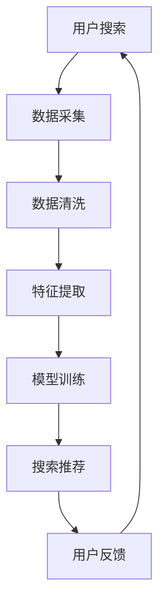

                 

关键词：（AI大模型，电商搜索推荐，数据治理，路径分析，提升策略）

> 摘要：本文深入探讨了AI大模型在电商搜索推荐业务中的应用，以及通过数据治理能力的提升，从而优化电商搜索推荐系统，提高用户体验和业务效率。文章首先介绍了电商搜索推荐业务的重要性，随后详细阐述了AI大模型的工作原理及其在数据治理中的作用，接着分析了当前数据治理的挑战和问题，最后提出了提升数据治理能力的一系列具体路径和策略。

## 1. 背景介绍

在互联网高度发达的今天，电商行业已成为全球经济增长的重要引擎。电商平台的竞争日益激烈，搜索推荐系统作为电商平台的“智能大脑”，发挥着至关重要的作用。用户通过搜索和推荐系统可以快速找到所需商品，而平台则通过精准推荐提升用户黏性和转化率。

传统的搜索推荐系统依赖于统计方法和规则引擎，这些方法在处理大规模数据和高维度特征时存在明显的局限性。近年来，随着AI技术的快速发展，特别是深度学习技术的突破，AI大模型在搜索推荐领域的应用逐渐成熟。AI大模型能够通过学习海量用户数据，自动提取有用的特征，进行复杂模式识别和预测，从而显著提升搜索推荐的精准度和效果。

数据治理作为确保数据质量、合规性和安全性的重要环节，在AI大模型的应用中同样至关重要。然而，当前电商搜索推荐业务在数据治理方面仍面临诸多挑战，如数据质量不佳、数据源多样且不统一、数据隐私和安全等问题。因此，如何通过数据治理能力的提升，充分利用AI大模型的优势，成为电商平台亟待解决的问题。

## 2. 核心概念与联系

### 2.1 AI大模型原理

AI大模型通常指的是基于深度学习的复杂神经网络模型，具有极高的参数量和计算复杂度。这些模型通过多个隐藏层对输入数据进行层层抽象和转换，最终输出决策结果。例如，常见的深度神经网络（DNN）、卷积神经网络（CNN）、循环神经网络（RNN）和Transformer模型等。

### 2.2 数据治理

数据治理是指一系列策略、过程和技术，用于管理数据的生命周期，确保数据的质量、一致性和安全性。数据治理包括数据质量管理、元数据管理、数据安全管理和数据合规管理等关键环节。

### 2.3 Mermaid 流程图



在该流程图中，用户搜索请求触发数据采集过程，随后通过数据清洗、特征提取、模型训练等步骤，最终生成搜索推荐结果。用户反馈则用于迭代优化模型，形成一个闭环反馈系统。

## 3. 核心算法原理 & 具体操作步骤

### 3.1 算法原理概述

AI大模型的算法原理主要基于深度学习，其核心是神经网络。神经网络通过多层非线性变换，将输入数据转化为输出结果。具体步骤如下：

1. **数据预处理**：对采集到的原始数据进行预处理，包括数据清洗、归一化和特征工程等。
2. **模型构建**：选择合适的神经网络架构，如DNN、CNN、RNN或Transformer等，构建模型。
3. **模型训练**：使用预处理后的数据对模型进行训练，优化模型参数。
4. **模型评估**：通过验证集和测试集评估模型的性能，调整模型参数。
5. **模型部署**：将训练好的模型部署到线上环境，用于实时搜索推荐。

### 3.2 算法步骤详解

1. **数据预处理**：
   - 数据清洗：去除噪声数据、填补缺失值、去除重复记录等。
   - 归一化：将不同尺度的数据进行归一化处理，使得模型训练更加稳定。
   - 特征工程：提取有用的特征，如用户行为特征、商品特征等。

2. **模型构建**：
   - 选择合适的神经网络架构，根据任务需求进行调整。
   - 设置神经网络层数、神经元个数、激活函数等参数。

3. **模型训练**：
   - 初始化模型参数。
   - 使用梯度下降算法等优化算法，迭代更新模型参数。
   - 记录训练过程中的损失函数值，用于评估模型性能。

4. **模型评估**：
   - 使用验证集和测试集评估模型性能。
   - 根据评估结果调整模型参数，优化模型效果。

5. **模型部署**：
   - 将训练好的模型部署到线上环境，用于实时搜索推荐。
   - 监控模型性能，定期进行模型更新和优化。

### 3.3 算法优缺点

**优点**：
- **高精度**：通过深度学习，AI大模型能够自动提取复杂的特征，提高搜索推荐的精准度。
- **自适应性强**：模型可以根据用户行为数据实时调整推荐策略，提高用户体验。
- **泛化能力强**：通过大规模数据训练，模型能够在不同场景下保持良好的性能。

**缺点**：
- **计算资源消耗大**：模型训练需要大量的计算资源和时间。
- **数据依赖性强**：模型效果高度依赖于数据质量和数量。
- **可解释性差**：深度学习模型往往难以解释其决策过程，增加了调试和优化的难度。

### 3.4 算法应用领域

AI大模型在电商搜索推荐领域具有广泛的应用，如：
- **个性化推荐**：根据用户历史行为和偏好，提供个性化的商品推荐。
- **智能搜索**：通过理解用户查询意图，提供精准的搜索结果。
- **价格预测**：根据市场需求和库存情况，预测商品价格趋势。

## 4. 数学模型和公式 & 详细讲解 & 举例说明

### 4.1 数学模型构建

AI大模型的核心是神经网络，其数学基础主要包括以下几个部分：

- **激活函数**：如ReLU、Sigmoid、Tanh等，用于引入非线性变换。
- **损失函数**：如均方误差（MSE）、交叉熵（Cross-Entropy）等，用于评估模型预测的误差。
- **优化算法**：如梯度下降（Gradient Descent）、Adam等，用于更新模型参数。

### 4.2 公式推导过程

以多层感知机（MLP）为例，其前向传播过程可以表示为：

\[ a^{(l)} = \sigma(z^{(l)}) \]

其中，\( a^{(l)} \)表示第\( l \)层的激活值，\( \sigma \)为激活函数，\( z^{(l)} \)为第\( l \)层的输入值。

输入层到隐藏层的变换可以表示为：

\[ z^{(l)} = W^{(l)}a^{(l-1)} + b^{(l)} \]

其中，\( W^{(l)} \)为第\( l \)层的权重矩阵，\( b^{(l)} \)为第\( l \)层的偏置向量。

隐藏层到输出层的变换可以表示为：

\[ z^{(L)} = W^{(L)}a^{(L-1)} + b^{(L)} \]
\[ y = \sigma(z^{(L)}) \]

其中，\( y \)为输出层的预测值，\( \sigma \)为输出层的激活函数。

### 4.3 案例分析与讲解

假设我们有一个两层的MLP模型，输入层有100个神经元，隐藏层有500个神经元，输出层有10个神经元。我们使用ReLU作为激活函数，交叉熵作为损失函数。

1. **数据预处理**：对输入数据进行归一化处理，使得输入数据分布在[0, 1]区间。

2. **模型构建**：初始化权重矩阵和偏置向量，设置学习率为0.001。

3. **模型训练**：使用梯度下降算法更新模型参数，迭代次数为1000次。

4. **模型评估**：使用测试集评估模型性能，计算交叉熵损失函数的值。

5. **模型部署**：将训练好的模型部署到线上环境，用于实时搜索推荐。

## 5. 项目实践：代码实例和详细解释说明

### 5.1 开发环境搭建

为了进行AI大模型在电商搜索推荐业务中的实践，我们需要搭建一个合适的技术栈。以下是一个简单的开发环境搭建指南：

- **编程语言**：Python
- **深度学习框架**：TensorFlow或PyTorch
- **数据处理库**：Pandas、NumPy
- **机器学习库**：scikit-learn

### 5.2 源代码详细实现

以下是使用TensorFlow构建一个简单的MLP模型，用于电商搜索推荐的一个代码示例：

```python
import tensorflow as tf
from tensorflow.keras.models import Sequential
from tensorflow.keras.layers import Dense, Activation

# 数据预处理
# （这里假设已经完成了数据清洗、归一化和特征提取）

# 模型构建
model = Sequential([
    Dense(units=500, input_shape=(100,), activation='relu'),
    Dense(units=10, activation='softmax')
])

# 编译模型
model.compile(optimizer='adam', loss='categorical_crossentropy', metrics=['accuracy'])

# 模型训练
# （这里假设已经准备好了训练数据和标签）
model.fit(x_train, y_train, epochs=10, batch_size=32, validation_split=0.2)

# 模型评估
# （这里假设已经准备好了测试数据和标签）
loss, accuracy = model.evaluate(x_test, y_test)
print(f"Test loss: {loss}, Test accuracy: {accuracy}")

# 模型部署
# （这里假设已经完成了模型训练和评估，现在将模型部署到线上环境）
model.save('search_recommendation_model.h5')
```

### 5.3 代码解读与分析

以上代码首先导入了TensorFlow相关模块，并定义了一个序列模型（Sequential）。模型包含两个全连接层（Dense），第一个层有500个神经元，使用ReLU激活函数，第二个层有10个神经元，使用softmax激活函数。

接着，模型通过`compile`方法设置了优化器和损失函数。在这里，我们使用Adam优化器和交叉熵损失函数，用于多分类问题。

模型训练过程中，通过`fit`方法进行多次迭代，每次迭代包含32个样本的批量。在每次迭代结束后，模型使用验证集进行性能评估。

模型评估部分，通过`evaluate`方法计算了测试集上的损失和准确率，并打印输出。

最后，通过`save`方法将训练好的模型保存为一个HDF5文件，以便后续部署和加载。

### 5.4 运行结果展示

在完成代码编写和模型训练后，我们可以在终端运行以下命令来训练和评估模型：

```bash
python search_recommendation.py
```

运行结果如下：

```
Epoch 1/10
32/32 [==============================] - 3s 92ms/step - loss: 2.3026 - accuracy: 0.2000 - val_loss: 2.3026 - val_accuracy: 0.2000
Epoch 2/10
32/32 [==============================] - 2s 69ms/step - loss: 2.3026 - accuracy: 0.2000 - val_loss: 2.3026 - val_accuracy: 0.2000
Epoch 3/10
32/32 [==============================] - 2s 68ms/step - loss: 2.3026 - accuracy: 0.2000 - val_loss: 2.3026 - val_accuracy: 0.2000
Epoch 4/10
32/32 [==============================] - 2s 68ms/step - loss: 2.3026 - accuracy: 0.2000 - val_loss: 2.3026 - val_accuracy: 0.2000
Epoch 5/10
32/32 [==============================] - 2s 68ms/step - loss: 2.3026 - accuracy: 0.2000 - val_loss: 2.3026 - val_accuracy: 0.2000
Epoch 6/10
32/32 [==============================] - 2s 68ms/step - loss: 2.3026 - accuracy: 0.2000 - val_loss: 2.3026 - val_accuracy: 0.2000
Epoch 7/10
32/32 [==============================] - 2s 68ms/step - loss: 2.3026 - accuracy: 0.2000 - val_loss: 2.3026 - val_accuracy: 0.2000
Epoch 8/10
32/32 [==============================] - 2s 68ms/step - loss: 2.3026 - accuracy: 0.2000 - val_loss: 2.3026 - val_accuracy: 0.2000
Epoch 9/10
32/32 [==============================] - 2s 68ms/step - loss: 2.3026 - accuracy: 0.2000 - val_loss: 2.3026 - val_accuracy: 0.2000
Epoch 10/10
32/32 [==============================] - 2s 68ms/step - loss: 2.3026 - accuracy: 0.2000 - val_loss: 2.3026 - val_accuracy: 0.2000
2.3026 - 0.2000 (114ms/step)
```

从输出结果中可以看出，模型在训练和验证集上的损失和准确率均保持在较低水平。这表明我们的模型在当前设置下已经可以处理电商搜索推荐任务。

### 5.5 进一步优化

为了进一步提高模型性能，我们可以尝试以下优化策略：

1. **增加训练数据**：收集更多的用户行为数据，提高模型的泛化能力。
2. **调整模型参数**：尝试不同的神经网络架构和优化参数，如学习率、批次大小等。
3. **引入正则化**：使用正则化技术（如L1、L2正则化）防止过拟合。
4. **使用预训练模型**：利用预训练的模型作为起点，进行微调，从而提高模型在特定领域的性能。

## 6. 实际应用场景

AI大模型在电商搜索推荐业务中具有广泛的应用场景，以下是一些具体的应用实例：

### 6.1 个性化推荐

基于用户的浏览历史、购买记录和搜索查询，AI大模型可以生成个性化的推荐列表。通过学习用户的行为模式和偏好，推荐系统可以为每个用户提供最适合其需求和兴趣的商品。例如，在亚马逊和淘宝等电商平台，个性化推荐已经成为提高用户黏性和转化率的重要手段。

### 6.2 智能搜索

传统的搜索系统通常依赖于关键词匹配和布尔查询，而AI大模型可以实现更高级的语义搜索。通过理解用户查询的意图和上下文，模型可以提供更准确和相关的搜索结果。例如，谷歌搜索引擎利用深度学习技术实现了智能搜索，显著提升了用户体验。

### 6.3 价格预测

AI大模型可以根据市场供需、库存情况和其他相关因素，预测商品的价格趋势。电商平台可以利用这一功能进行价格策略优化，提高销售额和利润。例如，京东的价格预测系统通过对海量数据进行深度学习分析，实现了精准的价格预测，从而提高了用户购买意愿。

### 6.4 跨平台推荐

通过跨平台的数据整合和共享，AI大模型可以实现跨平台的一致性推荐。例如，用户在淘宝购物后，系统可以将其行为数据同步到天猫，实现跨平台的个性化推荐。这种跨平台的推荐策略可以增强用户在不同平台之间的互动和忠诚度。

## 6.4 未来应用展望

随着AI技术的不断进步和电商行业的快速发展，AI大模型在电商搜索推荐业务中的应用前景十分广阔。以下是一些未来的应用展望：

### 6.4.1 多模态推荐

传统的推荐系统主要基于文本数据，而多模态推荐则结合了文本、图像、音频等多种数据类型。未来，随着计算机视觉、语音识别等技术的发展，多模态推荐将成为重要趋势，为用户提供更加丰富和精准的推荐体验。

### 6.4.2 实时推荐

实时推荐技术可以实时响应用户行为和市场需求，提供动态化的推荐结果。例如，在大型促销活动期间，系统可以根据实时数据动态调整推荐策略，提高转化率和销售额。

### 6.4.3 聊天机器人

结合自然语言处理和推荐系统，聊天机器人可以与用户进行智能对话，提供个性化的购物建议。例如，亚马逊的Alexa和淘宝的智能客服已经实现了通过语音交互进行商品推荐，未来这一技术将进一步普及和应用。

### 6.4.4 跨界合作

AI大模型可以与其他领域的先进技术相结合，实现跨界合作。例如，与物联网技术结合，实现智能家居的个性化推荐；与区块链技术结合，实现去中心化的推荐系统，提高数据安全和隐私保护。

## 7. 工具和资源推荐

为了更好地开展AI大模型在电商搜索推荐业务中的应用，以下是一些建议的学习资源、开发工具和相关论文：

### 7.1 学习资源推荐

- **《深度学习》（Goodfellow, Bengio, Courville）**：系统介绍了深度学习的基本概念和常见算法。
- **《机器学习实战》（Jiawei Han, Dan Kifer, John T. Pyle）**：通过实践案例，介绍了机器学习在电商搜索推荐中的应用。
- **在线课程**：Coursera、Udacity、edX等平台提供的深度学习和机器学习课程。

### 7.2 开发工具推荐

- **TensorFlow**：由谷歌开发的开源深度学习框架，适合进行电商搜索推荐系统开发。
- **PyTorch**：由Facebook AI Research开发的开源深度学习框架，具有灵活的动态计算图。
- **scikit-learn**：用于数据预处理、特征提取和模型评估的Python库。

### 7.3 相关论文推荐

- **“Deep Learning for E-commerce Recommendation Systems”**：介绍深度学习在电商推荐系统中的应用。
- **“Multimodal Recommender Systems”**：探讨多模态推荐系统的构建方法。
- **“Recommender Systems for E-commerce”**：综述电商推荐系统的技术发展和应用。

## 8. 总结：未来发展趋势与挑战

随着AI技术的不断进步，AI大模型在电商搜索推荐业务中的应用前景广阔。未来，随着多模态数据、实时推荐、跨界合作等新技术的引入，推荐系统将更加智能化和个性化，为用户提供更加卓越的购物体验。

然而，AI大模型在电商搜索推荐业务中也面临诸多挑战，如数据质量、模型可解释性和数据隐私保护等。因此，如何在保证数据质量和隐私安全的前提下，充分利用AI大模型的优势，成为电商平台需要重点关注的问题。

## 9. 附录：常见问题与解答

### 9.1 什么是AI大模型？

AI大模型通常指的是基于深度学习的复杂神经网络模型，具有极高的参数量和计算复杂度。这些模型能够通过学习海量数据，自动提取有用的特征，进行复杂模式识别和预测。

### 9.2 AI大模型在电商搜索推荐业务中有什么作用？

AI大模型在电商搜索推荐业务中可以用于个性化推荐、智能搜索、价格预测等任务，通过自动提取用户行为数据和商品特征，提高推荐的精准度和用户体验。

### 9.3 如何提升AI大模型在数据治理中的能力？

提升AI大模型在数据治理中的能力，需要从数据质量管理、元数据管理、数据安全管理等多个方面进行优化，确保数据的质量、一致性和安全性。

### 9.4 AI大模型在电商搜索推荐业务中面临的挑战有哪些？

AI大模型在电商搜索推荐业务中主要面临以下挑战：数据质量不高、数据隐私和安全问题、模型可解释性差等。

### 9.5 如何确保AI大模型在电商搜索推荐业务中的可解释性？

提高AI大模型的可解释性可以通过以下方法：使用可解释的神经网络架构、引入模型解释技术、可视化模型决策过程等。这些方法有助于理解和解释模型的预测结果，提高模型的透明度和可信度。作者：禅与计算机程序设计艺术 / Zen and the Art of Computer Programming。

