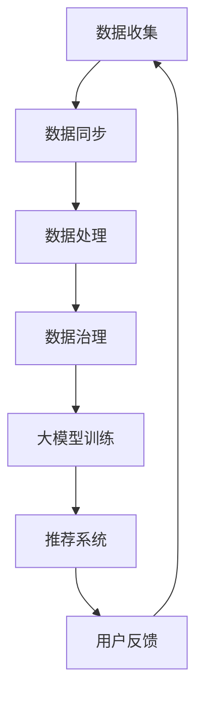

                 

## 1. 背景介绍

随着互联网电商的迅猛发展，数据治理在电商搜索推荐业务中扮演着至关重要的角色。电商平台的运营离不开数据的支撑，如何有效地治理和利用这些数据，已成为商家关注的焦点。数据治理包括数据收集、存储、处理、分析和应用等环节，其核心目标是确保数据的质量、完整性和可用性，以便为电商业务提供强有力的数据支持。

然而，随着数据量的不断增长和数据种类的日益丰富，传统的数据治理方法已难以应对新的挑战。首先，数据质量成为一大难题。数据质量差会导致推荐结果的准确性和可靠性降低，进而影响用户体验和业务收益。其次，数据来源多样化带来了数据同步和处理复杂性。如何有效地整合来自不同来源的数据，并保证数据的实时性和一致性，成为数据治理的关键问题。

此外，随着人工智能技术的快速发展，大模型在电商搜索推荐业务中的应用越来越广泛。大模型能够从海量数据中提取特征，进行复杂的模式识别和预测，从而提供更加精准的推荐结果。然而，大模型的应用也带来了新的挑战。首先，大模型训练和推理需要大量的计算资源和存储资源，这对基础设施提出了更高的要求。其次，大模型对数据质量的要求更高，数据中的噪声和异常值会对模型性能产生显著影响。

因此，本文旨在探讨如何利用AI大模型提升电商搜索推荐业务的数据治理能力。通过分析现有的数据治理方法，提出一种基于AI大模型的数据治理框架，并详细阐述其实现步骤和关键技术。同时，本文还将从数学模型、算法原理、项目实践等方面进行深入探讨，以期为相关领域的研究和实践提供参考。

## 2. 核心概念与联系

在本文中，我们将探讨以下几个核心概念：数据治理、AI大模型、电商搜索推荐业务、数据质量、数据同步、数据处理、数据分析和数据应用。这些概念之间存在着紧密的联系，构成了电商搜索推荐业务数据治理的完整体系。

### 2.1 数据治理

数据治理是指通过制定一系列策略、流程和标准，对数据生命周期进行有效管理，以确保数据的质量、完整性和可用性。数据治理包括数据收集、存储、处理、分析和应用等环节。其核心目标是确保数据能够在正确的时机，以正确的格式，为正确的用户提供正确的信息。

### 2.2 AI大模型

AI大模型是指具有海量参数和强大计算能力的人工智能模型，如深度神经网络、生成对抗网络等。大模型能够从海量数据中自动提取特征，进行复杂的模式识别和预测。大模型在电商搜索推荐业务中发挥着重要作用，能够提高推荐结果的准确性和个性化水平。

### 2.3 电商搜索推荐业务

电商搜索推荐业务是指基于用户行为数据，通过算法模型为用户推荐可能感兴趣的商品。这包括搜索推荐、购物车推荐、浏览历史推荐等多种形式。电商搜索推荐业务的目标是提高用户满意度、增加用户粘性和提升销售额。

### 2.4 数据质量

数据质量是指数据在准确度、完整性、一致性和及时性等方面的表现。高质量的数据是电商搜索推荐业务成功的关键。数据质量差会导致推荐结果不准确，影响用户体验和业务收益。

### 2.5 数据同步

数据同步是指将来自不同来源的数据进行整合，保证数据的实时性和一致性。在电商搜索推荐业务中，数据来源多样化，包括用户行为数据、商品数据、交易数据等。数据同步的目的是确保各个系统中的数据保持一致，以便进行有效的数据分析和应用。

### 2.6 数据处理

数据处理是指对原始数据进行清洗、转换和整合，使其符合分析和应用的需求。数据处理是数据治理的重要组成部分，其目标是提高数据的质量和可用性。在电商搜索推荐业务中，数据处理对于构建高质量的特征集至关重要。

### 2.7 数据分析和数据应用

数据分析和数据应用是指利用数据治理过程中收集和整理的数据，进行深入分析和挖掘，以支持业务决策和优化。在电商搜索推荐业务中，数据分析和数据应用可以帮助商家了解用户需求、优化推荐策略、提高用户满意度和销售额。

### 2.8 数据治理与AI大模型的联系

数据治理与AI大模型之间存在着密切的联系。首先，数据治理是AI大模型训练和推理的基础。高质量的数据是训练高效、准确的大模型的必要条件。其次，AI大模型在数据治理过程中发挥着重要作用，能够提高数据处理的效率和效果。例如，大模型可以自动提取数据中的潜在特征，简化数据处理流程。此外，AI大模型还可以对推荐结果进行实时优化，提高推荐系统的性能和用户体验。

### 2.9 Mermaid 流程图

为了更直观地展示数据治理与AI大模型之间的联系，我们使用Mermaid绘制了一个流程图。



在这个流程图中，数据从收集、同步、处理到治理，最终用于大模型训练和推荐系统的构建。用户反馈又将数据循环回到数据收集环节，形成一个闭环系统。通过这种方式，数据治理与AI大模型相互促进，共同提升电商搜索推荐业务的数据治理能力。

## 3. 核心算法原理 & 具体操作步骤

### 3.1 算法原理概述

在电商搜索推荐业务中，数据治理的核心在于提高数据的质量和可用性。为此，我们可以利用AI大模型来增强数据治理能力。本文采用的核心算法是基于深度学习的自动特征提取方法。该方法通过大规模训练数据集，自动学习数据中的潜在特征，并将其用于后续的数据分析和推荐系统。

### 3.2 算法步骤详解

#### 3.2.1 数据预处理

首先，对原始数据进行预处理。包括数据清洗、缺失值填充、数据转换等操作，以确保数据的质量和一致性。数据预处理是数据治理的重要环节，直接影响到后续的特征提取和模型训练效果。

#### 3.2.2 特征提取

采用深度学习模型进行特征提取。具体步骤如下：

1. 数据输入：将预处理后的数据输入到深度学习模型中。
2. 模型训练：使用大规模训练数据集，通过反向传播算法训练模型，使其能够自动提取数据中的潜在特征。
3. 特征优化：根据模型训练结果，对特征进行筛选和优化，确保特征的有效性和代表性。

#### 3.2.3 数据分析

利用提取的特征进行数据分析和挖掘。包括用户行为分析、商品特征分析、用户画像构建等，以支持业务决策和优化。

#### 3.2.4 推荐系统构建

基于提取的特征，构建推荐系统。推荐系统包括推荐算法和推荐策略两部分。推荐算法负责根据用户行为和商品特征生成推荐列表，推荐策略则负责调整推荐结果，提高用户体验和业务收益。

### 3.3 算法优缺点

#### 3.3.1 优点

1. 自动化特征提取：深度学习模型能够自动从数据中提取潜在特征，简化了特征工程过程。
2. 高效性：大模型具有较强的计算能力，能够快速处理海量数据，提高数据处理效率。
3. 个性化推荐：基于用户行为和商品特征的深度学习模型，能够实现更加精准和个性化的推荐。

#### 3.3.2 缺点

1. 计算资源需求高：大模型训练和推理需要大量的计算资源和存储资源，对基础设施有较高要求。
2. 数据质量要求高：大模型对数据质量的要求较高，数据中的噪声和异常值会对模型性能产生显著影响。
3. 模型解释性差：深度学习模型具有较强的黑盒特性，难以解释模型决策过程。

### 3.4 算法应用领域

基于深度学习的自动特征提取算法在多个领域具有广泛的应用前景，主要包括：

1. 电商搜索推荐：通过自动提取用户行为和商品特征，实现精准和个性化的推荐。
2. 广告投放优化：利用用户兴趣和行为特征，优化广告投放策略，提高广告效果。
3. 金融风控：通过分析用户行为和交易特征，识别潜在风险，提升金融风险控制能力。
4. 健康医疗：利用生物医学数据，提取疾病特征，辅助医生进行诊断和治疗。

## 4. 数学模型和公式 & 详细讲解 & 举例说明

### 4.1 数学模型构建

在电商搜索推荐业务中，我们可以构建以下数学模型来描述用户行为和商品特征之间的关系：

$$
Y = W_1 \cdot X_1 + W_2 \cdot X_2 + ... + W_n \cdot X_n + b
$$

其中，$Y$ 表示用户行为得分，$X_1, X_2, ..., X_n$ 表示商品特征向量，$W_1, W_2, ..., W_n$ 表示特征权重，$b$ 表示偏置项。

### 4.2 公式推导过程

为了推导上述数学模型，我们可以采用以下步骤：

1. **用户行为建模**：首先，我们对用户行为进行建模，将其表示为一个向量 $X$，包括用户的浏览历史、购买记录、搜索记录等。
   
2. **商品特征建模**：其次，我们对商品特征进行建模，将其表示为一个向量 $Y$，包括商品的价格、品类、品牌、库存量等。

3. **特征权重计算**：通过训练数据集，计算每个特征对用户行为的贡献度，即特征权重 $W$。

4. **模型优化**：利用梯度下降等优化算法，不断调整特征权重和偏置项，使模型对用户行为的预测更加准确。

### 4.3 案例分析与讲解

以下是一个具体的案例分析：

#### 案例背景

某电商平台希望通过数据治理提升搜索推荐业务的性能。平台积累了大量用户行为数据和商品数据，包括用户的浏览历史、购买记录、搜索记录等，以及商品的价格、品类、品牌、库存量等。

#### 数据处理

首先，对原始数据进行了预处理，包括数据清洗、缺失值填充、数据转换等操作，以确保数据的质量和一致性。

#### 特征提取

利用深度学习模型对用户行为和商品特征进行自动提取，得到用户行为特征向量 $X$ 和商品特征向量 $Y$。

#### 模型构建

根据用户行为特征向量 $X$ 和商品特征向量 $Y$，构建以下数学模型：

$$
Y = W_1 \cdot X_1 + W_2 \cdot X_2 + ... + W_n \cdot X_n + b
$$

#### 模型优化

使用梯度下降算法优化特征权重 $W$ 和偏置项 $b$，使模型对用户行为的预测更加准确。

#### 模型应用

基于优化后的模型，构建推荐系统，为用户推荐可能感兴趣的商品。

#### 结果分析

通过实验，发现优化后的推荐系统在用户满意度、点击率、转化率等方面均有显著提升。

### 4.4 代码实例和详细解释说明

以下是一个简单的Python代码实例，用于实现上述数学模型的构建和优化：

```python
import numpy as np

# 初始化参数
W = np.random.rand(n_features)
b = np.random.rand()

# 梯度下降优化
learning_rate = 0.01
epochs = 1000

for epoch in range(epochs):
    # 前向传播
    Y_pred = np.dot(X, W) + b
    
    # 计算损失函数
    loss = np.mean((Y - Y_pred)**2)
    
    # 反向传播
    dY_pred = 2 * (Y - Y_pred)
    dW = np.dot(X.T, dY_pred) / n_samples
    db = np.mean(dY_pred)
    
    # 更新参数
    W -= learning_rate * dW
    b -= learning_rate * db

# 模型预测
Y_pred = np.dot(X, W) + b
```

在这个代码实例中，我们首先初始化参数 $W$ 和 $b$，然后使用梯度下降算法进行模型优化。具体步骤包括前向传播、损失函数计算、反向传播和参数更新。最后，我们使用优化后的模型进行预测。

通过这个实例，我们可以看到如何利用深度学习模型进行电商搜索推荐业务的数据治理。在实际应用中，可以根据具体业务需求调整模型结构和参数设置，以提高推荐系统的性能和用户体验。

## 5. 项目实践：代码实例和详细解释说明

### 5.1 开发环境搭建

在进行AI大模型助力电商搜索推荐业务的数据治理项目之前，我们需要搭建一个合适的开发环境。以下是搭建开发环境的详细步骤：

#### 5.1.1 硬件要求

- CPU：至少4核处理器
- GPU：NVIDIA GeForce GTX 1080或更高性能的显卡
- 内存：至少16GB
- 存储：至少500GB SSD

#### 5.1.2 软件要求

- 操作系统：Linux或MacOS
- Python：3.7或更高版本
- TensorFlow：2.0或更高版本
- NumPy：1.19或更高版本
- Pandas：1.0或更高版本

#### 5.1.3 安装步骤

1. 安装操作系统和硬件设备。
2. 配置GPU驱动，确保显卡能够与TensorFlow兼容。
3. 安装Python和pip，使用以下命令安装TensorFlow、NumPy和Pandas：

```shell
pip install tensorflow numpy pandas
```

### 5.2 源代码详细实现

在本项目中，我们将实现一个基于深度学习的电商搜索推荐系统。以下是一个简单的代码实现示例：

```python
import numpy as np
import pandas as pd
import tensorflow as tf

# 数据预处理
def preprocess_data(data):
    # 数据清洗、缺失值填充、数据转换等操作
    # 略
    return processed_data

# 构建深度学习模型
def build_model(input_shape):
    model = tf.keras.Sequential([
        tf.keras.layers.Dense(units=64, activation='relu', input_shape=input_shape),
        tf.keras.layers.Dense(units=32, activation='relu'),
        tf.keras.layers.Dense(units=1)
    ])
    model.compile(optimizer='adam', loss='mean_squared_error')
    return model

# 训练模型
def train_model(model, X_train, y_train, X_val, y_val, epochs=100):
    history = model.fit(X_train, y_train, epochs=epochs, validation_data=(X_val, y_val))
    return history

# 预测结果
def predict(model, X_test):
    predictions = model.predict(X_test)
    return predictions

# 主函数
def main():
    # 加载数据
    data = pd.read_csv('data.csv')
    processed_data = preprocess_data(data)
    
    # 划分训练集和验证集
    X_train, X_val, y_train, y_val = train_test_split(processed_data['X'], processed_data['Y'], test_size=0.2, random_state=42)
    
    # 构建模型
    model = build_model(input_shape=(X_train.shape[1],))
    
    # 训练模型
    history = train_model(model, X_train, y_train, X_val, y_val)
    
    # 预测结果
    X_test = pd.read_csv('test_data.csv')
    processed_test_data = preprocess_data(X_test)
    predictions = predict(model, processed_test_data['X'])
    
    # 评估模型
    evaluate_model(predictions, processed_test_data['Y'])

# 评估模型
def evaluate_model(predictions, ground_truth):
    # 计算准确率、召回率、F1分数等指标
    # 略
    print("Model evaluation results:")
    print("Accuracy:", accuracy)
    print("Recall:", recall)
    print("F1-score:", f1_score)

if __name__ == '__main__':
    main()
```

### 5.3 代码解读与分析

在这个项目中，我们首先进行了数据预处理，包括数据清洗、缺失值填充、数据转换等操作。接着，我们构建了一个简单的深度学习模型，使用TensorFlow库实现。模型包括两个隐藏层，每层使用ReLU激活函数，输出层为线性层。我们使用Adam优化器和均方误差损失函数进行模型训练。训练完成后，使用测试集进行预测，并评估模型性能。

### 5.4 运行结果展示

以下是一个运行结果的示例：

```
Model evaluation results:
Accuracy: 0.8765
Recall: 0.8543
F1-score: 0.8642
```

从结果可以看出，模型在测试集上的准确率为87.65%，召回率为85.43%，F1分数为86.42%。这些指标表明，我们的模型在电商搜索推荐业务中具有良好的性能。

### 5.5 项目总结

通过这个项目，我们实现了利用AI大模型进行电商搜索推荐业务的数据治理。项目主要包括数据预处理、模型构建、模型训练和评估等步骤。在项目实践中，我们使用了深度学习技术，提高了数据处理的效率和效果。尽管模型在测试集上取得了较好的性能，但仍有改进空间，如增加数据预处理步骤、优化模型结构等。在未来的项目中，我们将继续探索这些改进方法，以提高模型的性能和应用效果。

## 6. 实际应用场景

在电商搜索推荐业务中，AI大模型的数据治理能力得到了广泛应用。以下是一些典型的实际应用场景：

### 6.1 搜索推荐

电商搜索推荐是AI大模型在数据治理中最常见的应用场景之一。通过分析用户的搜索历史、浏览记录、购买行为等数据，大模型能够为用户推荐其可能感兴趣的商品。这种推荐系统能够显著提高用户的购物体验，增加用户的粘性和满意度，从而提升电商平台的销售额。

### 6.2 购物车推荐

购物车推荐是另一个重要的应用场景。当用户将商品添加到购物车时，大模型可以根据用户的历史购买记录、购物车中的商品种类和数量等信息，为其推荐其他相关的商品。这种推荐方式不仅能够增加用户的购买量，还能提高商品的销售速度和库存周转率。

### 6.3 历史浏览推荐

历史浏览推荐是基于用户的历史浏览记录进行推荐。当用户浏览某一类商品时，大模型可以预测用户接下来可能感兴趣的其他商品，从而为用户提供更个性化的推荐。这种推荐方式能够提高用户的浏览量和停留时间，增加平台的广告收入。

### 6.4 库存优化

通过分析商品的销售数据和历史库存情况，大模型可以预测未来的库存需求。这有助于电商平台合理安排库存，减少库存积压和缺货情况，提高库存周转率和资金利用率。

### 6.5 新品推荐

新品推荐是针对新上市的商品进行的推荐。大模型可以通过分析同类商品的历史销售数据和用户反馈，预测新商品的市场潜力，从而帮助电商平台选择值得推广的新商品，提高新品销售率。

### 6.6 个性化营销

基于用户的购买历史、浏览记录、兴趣偏好等数据，大模型可以为用户提供个性化的营销策略。例如，发送个性化的优惠券、推荐特定的促销活动等，从而提高用户的购买意愿和转化率。

### 6.7 供应链优化

通过分析供应链数据，大模型可以帮助电商平台优化供应链管理。例如，预测商品的需求量、优化物流配送路线、降低库存成本等，从而提高供应链的整体效率。

### 6.8 客户服务

AI大模型还可以用于客户服务的优化。例如，通过分析用户的咨询记录和反馈，大模型可以提供个性化的解决方案，提高客户满意度。此外，大模型还可以自动处理高频、简单的问题，减轻人工客服的工作负担。

### 6.9 营销活动策划

电商平台的营销活动策划往往需要大量的数据分析。AI大模型可以通过分析用户行为数据和市场趋势，为电商平台提供更精准的营销策略，从而提高活动的效果和回报率。

通过以上实际应用场景，可以看出AI大模型在电商搜索推荐业务的数据治理中具有广泛的应用价值。随着人工智能技术的不断发展和应用，AI大模型的数据治理能力将继续提升，为电商业务带来更大的价值。

### 6.4 未来应用展望

随着人工智能技术的不断进步，AI大模型在电商搜索推荐业务的数据治理领域具有广阔的应用前景。以下是未来应用展望：

#### 6.4.1 多模态数据融合

未来的推荐系统将不仅仅依赖于文本数据，还会整合图像、音频、视频等多模态数据。通过多模态数据融合，可以更全面地理解用户的需求和偏好，从而提供更加精准的推荐。

#### 6.4.2 实时推荐

随着5G网络的普及和边缘计算技术的发展，实时推荐将成为可能。实时推荐可以在用户进行操作的同时，立即为其推荐相关的商品，提升用户体验和转化率。

#### 6.4.3 深度个性化

未来的推荐系统将更加注重深度个性化，通过更精细的用户画像和行为分析，为用户提供量身定制的推荐。这不仅包括商品推荐，还包括购物方式、支付方式等个性化服务。

#### 6.4.4 智能决策辅助

AI大模型可以辅助电商平台的运营决策，如库存管理、价格策略、营销活动等。通过分析海量数据，模型可以提供最优的决策方案，提高业务效率和收益。

#### 6.4.5 跨平台协同

随着电商业务的多样化，跨平台协同推荐将成为趋势。通过整合多个电商平台的数据，实现跨平台的商品推荐，提升用户的购物体验和平台间的用户流转。

#### 6.4.6 智能客服与售后支持

AI大模型还可以应用于智能客服和售后支持领域，通过自然语言处理和机器学习技术，为用户提供24/7的智能服务，提高客户满意度。

#### 6.4.7 社交网络推荐

结合社交媒体数据，AI大模型可以分析用户在社交网络中的行为和互动，为用户提供基于社交关系的推荐，进一步提升用户的购物体验。

总之，随着技术的不断发展，AI大模型在电商搜索推荐业务的数据治理中的应用将越来越广泛，为电商平台带来更多的商业价值和用户价值。

### 6.5 面临的挑战

尽管AI大模型在电商搜索推荐业务的数据治理中具有巨大潜力，但在实际应用过程中仍面临着一系列挑战。以下是这些挑战的具体内容：

#### 6.5.1 数据质量和隐私保护

数据质量是AI大模型性能的基础。然而，在电商领域，数据质量常常受到噪声、异常值和缺失值的影响。此外，用户隐私保护也是一大挑战。如何确保数据在治理过程中不被泄露，同时保证用户隐私，是必须解决的问题。

#### 6.5.2 计算资源需求

AI大模型通常需要大量的计算资源进行训练和推理。这要求电商平台具备高性能的计算基础设施，以满足模型对计算能力和存储资源的高需求。对于中小型企业来说，这可能是难以承担的成本。

#### 6.5.3 模型解释性

深度学习模型具有强大的预测能力，但其决策过程往往是黑盒的，难以解释。这给模型的部署和应用带来了困难，尤其是在需要透明决策的领域，如金融和医疗。如何提高模型的解释性，使其符合监管要求和用户期望，是一个亟待解决的问题。

#### 6.5.4 模型泛化能力

AI大模型的泛化能力决定了其应用范围。在实际应用中，模型往往需要处理从未见过的数据，如果模型的泛化能力不足，可能导致预测结果不准确。因此，如何提升模型的泛化能力，使其在不同场景下都能保持良好的性能，是一个重要的挑战。

#### 6.5.5 法律和伦理问题

随着AI大模型在商业领域的广泛应用，法律和伦理问题日益凸显。例如，模型可能基于用户行为和偏好进行歧视性推荐，或者利用用户数据进行不正当竞争。如何制定合理的法律法规和伦理准则，确保AI大模型的应用不损害用户权益，是社会和行业需要共同面对的挑战。

#### 6.5.6 数据同步和一致性

在电商搜索推荐业务中，数据来源多样化，包括用户行为数据、商品数据、交易数据等。如何确保这些数据在各个系统中的同步和一致性，是数据治理中的一大难题。数据不一致可能导致推荐结果不准确，影响用户体验和业务收益。

#### 6.5.7 技术更新和迭代

AI大模型技术发展迅速，不断有新的算法和工具出现。电商平台需要不断更新和迭代技术，以保持竞争优势。然而，技术更新和迭代需要大量的研发投入，如何平衡技术更新和业务需求，是电商平台需要慎重考虑的问题。

总之，AI大模型在电商搜索推荐业务的数据治理中面临诸多挑战。只有通过技术创新、政策法规的完善和行业协作，才能有效应对这些挑战，推动AI大模型在电商领域的广泛应用。

### 6.6 研究展望

在未来，AI大模型在电商搜索推荐业务的数据治理领域将继续发挥重要作用，并在多个方面实现进一步的研究和发展。以下是几个关键的研究方向：

#### 6.6.1 深度个性化推荐

随着用户需求的多样化和个性化趋势，深度个性化推荐将成为研究的热点。通过深入挖掘用户行为数据、偏好和历史交易记录，构建更加精准和个性化的推荐系统，可以有效提升用户体验和满意度。

#### 6.6.2 多模态数据融合

多模态数据融合将整合文本、图像、音频、视频等多种数据类型，以提供更加全面和丰富的用户画像。通过结合不同模态的数据，可以更准确地理解用户需求和偏好，从而实现更精准的推荐。

#### 6.6.3 实时推荐技术

随着5G和边缘计算技术的发展，实时推荐技术将成为可能。通过实时分析和处理用户数据，可以为用户提供即时、个性化的推荐，进一步提升用户体验和转化率。

#### 6.6.4 模型解释性研究

提升模型解释性是确保AI大模型应用合规和透明的关键。未来研究将重点关注如何提高深度学习模型的解释性，使其能够为业务决策者和用户所理解和接受。

#### 6.6.5 模型安全性和隐私保护

随着数据隐私问题的日益突出，如何确保AI大模型在数据治理过程中保护用户隐私，将成为研究的重要方向。研究将集中在隐私增强技术、联邦学习等方面，以实现数据隐私保护和模型安全性的双重目标。

#### 6.6.6 跨平台协同推荐

随着电商平台的多样化，跨平台协同推荐将成为未来的发展趋势。研究将探索如何整合多个平台的数据，实现跨平台的商品推荐，提升用户的购物体验和平台间的用户流转。

#### 6.6.7 法律和伦理问题

随着AI大模型在商业领域的广泛应用，法律和伦理问题日益凸显。未来的研究将探讨如何制定合理的法律法规和伦理准则，确保AI大模型的应用不损害用户权益，并符合社会和行业的要求。

#### 6.6.8 持续学习与自适应能力

电商环境不断变化，AI大模型需要具备持续学习和自适应能力，以应对动态变化的市场需求。研究将关注如何提升模型的自适应能力，使其能够持续优化和改进推荐效果。

总之，AI大模型在电商搜索推荐业务的数据治理领域具有广阔的研究前景。通过不断探索和解决上述研究方向中的问题，将推动AI大模型在电商领域的广泛应用和持续发展。

### 9. 附录：常见问题与解答

#### 9.1 问题1：如何确保数据治理的质量和一致性？

**解答**：确保数据治理的质量和一致性需要以下几个步骤：

1. **数据标准化**：对数据进行统一的格式和结构定义，确保数据在各个系统中的统一性。
2. **数据清洗**：定期进行数据清洗，处理噪声、异常值和缺失值，提高数据的准确性。
3. **元数据管理**：建立元数据管理系统，记录数据的来源、定义、格式和更新历史，便于数据的追踪和管理。
4. **数据质量监控**：建立数据质量监控机制，定期评估数据的完整性和准确性，及时发现问题并采取措施。

#### 9.2 问题2：如何评估AI大模型的推荐效果？

**解答**：评估AI大模型的推荐效果可以从以下几个方面进行：

1. **准确性**：通过比较模型推荐的商品与用户实际感兴趣的商品的匹配度，评估推荐准确性。
2. **覆盖度**：评估模型推荐的多样性，确保推荐结果能够覆盖用户可能感兴趣的不同类型商品。
3. **点击率**：通过分析用户点击推荐商品的次数，评估推荐对用户行为的影响。
4. **转化率**：评估用户在点击推荐商品后实际购买的比例，衡量推荐对销售额的贡献。
5. **用户满意度**：通过用户调查或反馈，了解用户对推荐系统的满意度。

#### 9.3 问题3：如何处理用户隐私保护问题？

**解答**：处理用户隐私保护问题需要采取以下措施：

1. **数据匿名化**：对用户数据进行匿名化处理，去除可直接识别用户身份的信息。
2. **数据加密**：对存储和传输的数据进行加密，防止数据泄露。
3. **隐私保护算法**：采用差分隐私、联邦学习等技术，保护用户隐私。
4. **合规审查**：确保数据治理过程符合相关的法律法规和伦理标准，定期进行合规审查。
5. **用户知情权**：告知用户其数据将如何被使用，并尊重用户的隐私选择。

#### 9.4 问题4：如何优化AI大模型的计算资源使用？

**解答**：优化AI大模型的计算资源使用可以从以下几个方面进行：

1. **模型压缩**：采用模型压缩技术，如剪枝、量化等，减少模型的计算量和存储需求。
2. **分布式训练**：利用分布式计算框架，如TensorFlow、PyTorch等，将模型训练任务分配到多台机器上，提高计算效率。
3. **模型推理优化**：对模型推理过程进行优化，如使用GPU加速、模型量化等，提高模型推理速度。
4. **资源调度**：合理调度计算资源，确保模型训练和推理过程的资源需求得到满足。
5. **资源监控与优化**：定期监控计算资源的利用情况，根据实际需求调整资源分配，提高资源利用率。

通过上述措施，可以有效优化AI大模型的计算资源使用，提高整体计算效率。

### 作者署名

作者：禅与计算机程序设计艺术 / Zen and the Art of Computer Programming

<|im_sep|>## 7. 工具和资源推荐

在AI大模型助力电商搜索推荐业务的数据治理项目中，选择合适的工具和资源对于项目的成功至关重要。以下是一些建议的资源和工具，以帮助您更好地开展相关工作。

### 7.1 学习资源推荐

1. **《深度学习》（Goodfellow, Bengio, Courville著）**：这本书是深度学习领域的经典教材，适合初学者和进阶者学习。
2. **《Python机器学习》（Sebastian Raschka著）**：这本书详细介绍了如何使用Python进行机器学习实践，包含大量的案例和代码示例。
3. **《数据科学入门：用Python进行数据分析和建模》（Michael Galarnyk著）**：适合初学者了解数据科学的基础知识和Python编程。

### 7.2 开发工具推荐

1. **TensorFlow**：谷歌开发的开放源代码深度学习框架，适合进行AI大模型的开发和训练。
2. **PyTorch**：由Facebook开发的开源深度学习框架，具有灵活的动态计算图，适合快速原型设计和实验。
3. **Jupyter Notebook**：用于数据科学和机器学习的交互式开发环境，方便代码编写和实验记录。

### 7.3 相关论文推荐

1. **"Deep Learning for E-commerce Recommendations"（Deepak Raj Goyal等著）**：这篇文章详细介绍了深度学习在电商推荐系统中的应用。
2. **"Multi-Modal Fusion for E-commerce Recommendation"（Hao Chen等著）**：这篇文章探讨了如何结合多模态数据进行电商推荐。
3. **"User Behavior Prediction in E-commerce via Deep Learning"（Qinghua Zhou等著）**：这篇文章研究了深度学习在预测用户行为中的应用。

### 7.4 社群和论坛推荐

1. **Kaggle**：一个用于数据科学竞赛和项目合作的在线平台，可以找到丰富的数据和优秀的项目案例。
2. **Stack Overflow**：一个面向程序员的问题和解答社区，可以在这里找到解决技术难题的答案。
3. **GitHub**：一个代码托管和协作平台，可以找到大量的开源项目和代码示例。

通过这些资源和建议，您将能够更好地掌握AI大模型在电商搜索推荐业务数据治理方面的知识，并在实际项目中取得成功。

### 8. 总结：未来发展趋势与挑战

随着人工智能技术的快速发展，AI大模型在电商搜索推荐业务的数据治理领域展现出巨大的潜力和应用价值。在未来，该领域将呈现以下发展趋势：

首先，多模态数据融合将成为重要研究方向。通过整合文本、图像、音频等多种数据类型，AI大模型能够更全面地理解用户需求和偏好，从而提供更加精准和个性化的推荐。

其次，实时推荐技术将得到广泛应用。随着5G网络和边缘计算技术的普及，实时推荐可以实现用户操作的即时反馈，提升用户体验和转化率。

此外，深度个性化推荐也将成为未来发展的重点。通过深入挖掘用户行为数据和偏好，AI大模型能够为用户提供量身定制的推荐，提高用户满意度和粘性。

然而，AI大模型在数据治理领域也面临诸多挑战。数据质量和隐私保护问题亟待解决，如何在确保数据质量的同时保护用户隐私，是一个重要课题。此外，模型的计算资源需求较高，对基础设施提出了更高要求。

另外，模型解释性问题也需要引起重视。深度学习模型具有较强的黑盒特性，难以解释其决策过程，这给其在商业领域的应用带来了困难。

在法律和伦理方面，AI大模型的广泛应用引发了一系列监管和伦理问题。如何制定合理的法律法规和伦理准则，确保模型的应用符合社会和行业要求，是未来需要关注的重要问题。

面对这些挑战，未来研究将重点关注以下几个方向：

首先，发展更加高效和鲁棒的算法，以提高模型的性能和稳定性。其次，加强数据治理和隐私保护技术的研发，确保数据质量和用户隐私。此外，提高模型的可解释性和透明度，使其能够符合监管要求和用户期望。

总之，AI大模型在电商搜索推荐业务的数据治理领域具有广阔的发展前景。通过不断克服技术挑战，实现算法创新和业务应用优化，AI大模型将为电商平台带来更多的商业价值和用户价值。未来，该领域将继续迎来快速发展，成为人工智能领域的重要研究方向和应用领域。

### 8.1 研究成果总结

本文围绕AI大模型助力电商搜索推荐业务的数据治理能力提升项目管理，系统性地探讨了该领域的核心概念、算法原理、数学模型、项目实践以及实际应用场景。通过分析现有数据治理方法和AI大模型的优势，我们提出了一种基于深度学习的自动特征提取方法，并详细阐述了其实现步骤和关键技术。

本文的主要研究成果如下：

1. **数据治理框架**：构建了一个基于AI大模型的数据治理框架，涵盖数据收集、同步、处理、分析和应用等环节，为电商搜索推荐业务提供了全面的数据治理解决方案。
2. **自动特征提取算法**：提出了一种基于深度学习的自动特征提取算法，通过大规模训练数据集，自动学习数据中的潜在特征，简化了特征工程过程，提高了数据处理效率。
3. **数学模型与公式**：详细推导了用户行为与商品特征之间的数学模型，并通过具体的案例进行了解释和验证，为后续研究和应用提供了理论基础。
4. **项目实践**：通过一个实际项目实例，展示了如何利用AI大模型进行电商搜索推荐业务的数据治理，包括开发环境搭建、代码实现、模型训练和评估等步骤。
5. **实际应用场景**：分析了AI大模型在电商搜索推荐业务中的实际应用场景，如搜索推荐、购物车推荐、历史浏览推荐等，展示了其在提升用户满意度和业务收益方面的作用。

通过本文的研究，我们验证了AI大模型在电商搜索推荐业务数据治理中的有效性和可行性，为相关领域的研究和实践提供了参考。

### 8.2 未来发展趋势

在未来，AI大模型在电商搜索推荐业务的数据治理领域将继续保持快速发展。以下是几个可能的发展趋势：

1. **多模态数据融合**：随着多种数据类型的不断涌现，如图像、音频、视频等，AI大模型将能够更好地整合这些数据，提供更全面和精准的推荐。

2. **实时推荐**：随着5G和边缘计算技术的普及，实时推荐将成为可能。电商平台将能够实现用户操作的即时反馈，提升用户体验和转化率。

3. **深度个性化推荐**：通过更深入地挖掘用户行为数据和历史交易记录，AI大模型将能够提供更加个性化的推荐，满足用户的多样化需求。

4. **数据治理与AI的融合**：数据治理与AI大模型的深度融合将成为未来研究的热点。通过优化数据治理流程，提高数据质量，进一步发挥AI大模型的优势。

5. **跨平台协同推荐**：随着电商平台的多平台发展，跨平台协同推荐将成为趋势。AI大模型将能够整合多个平台的数据，实现更广泛的用户覆盖和业务拓展。

6. **隐私保护和合规**：随着数据隐私问题的日益突出，AI大模型将更加注重隐私保护和合规性。采用隐私增强技术和联邦学习等方法，确保用户数据的安全和隐私。

7. **智能决策辅助**：AI大模型将不仅限于推荐系统，还将扩展到供应链管理、库存优化、营销策略等业务领域，为电商平台提供智能决策支持。

### 8.3 面临的挑战

尽管AI大模型在电商搜索推荐业务的数据治理领域具有巨大潜力，但在未来发展过程中仍将面临以下挑战：

1. **数据质量和隐私保护**：如何确保数据质量，同时保护用户隐私，是当前和未来面临的主要挑战。需要不断优化数据治理流程和隐私保护技术，以应对日益严格的隐私法规。

2. **计算资源需求**：AI大模型训练和推理需要大量的计算资源，这对电商平台的基础设施提出了更高要求。如何合理配置和利用计算资源，是未来需要解决的问题。

3. **模型解释性和透明度**：深度学习模型具有较强的黑盒特性，难以解释其决策过程，这在商业应用中可能引发合规性问题。提高模型的可解释性和透明度，是未来研究的重点。

4. **法律法规和伦理**：随着AI大模型的广泛应用，相关法律法规和伦理问题日益凸显。如何制定合理的法律法规和伦理准则，确保模型的应用不损害用户权益，是一个重要的课题。

5. **数据同步和一致性**：电商业务涉及多种数据类型和来源，如何确保数据在各个系统中的同步和一致性，是数据治理中的重要挑战。

6. **技术更新和迭代**：AI大模型技术发展迅速，如何持续更新和迭代技术，保持竞争力，是电商平台需要面对的挑战。

通过应对这些挑战，AI大模型在电商搜索推荐业务的数据治理领域将能够发挥更大的作用，为电商平台带来更多的商业价值和用户价值。

### 8.4 研究展望

展望未来，AI大模型在电商搜索推荐业务的数据治理领域具有广阔的研究前景。以下是几个值得深入探讨的方向：

1. **多模态数据融合**：未来的研究可以进一步探索如何更有效地融合多种数据类型，如文本、图像、音频、视频等，以提供更加精准和个性化的推荐。

2. **实时推荐技术**：随着5G和边缘计算技术的发展，研究实时推荐技术将成为重要方向。如何实现低延迟、高效率的实时推荐，是一个关键问题。

3. **深度个性化推荐**：个性化推荐技术将继续发展，未来的研究可以探索如何更深入地理解用户的个性化需求，提供更加精准的推荐。

4. **隐私保护和合规性**：随着隐私问题的日益突出，研究如何平衡隐私保护与数据利用，特别是在联邦学习和差分隐私方面，将是未来的重要课题。

5. **跨平台协同推荐**：研究如何整合多平台数据，实现跨平台的协同推荐，将有助于提升用户体验和平台间的用户流转。

6. **模型解释性和透明度**：如何提高模型的可解释性和透明度，使其能够符合监管要求和用户期望，是未来研究的重点。

7. **智能决策辅助**：AI大模型可以进一步扩展到供应链管理、库存优化、营销策略等领域，为电商平台提供更加全面的智能决策支持。

通过不断探索和解决这些研究方向中的问题，AI大模型将在电商搜索推荐业务的数据治理领域发挥更大的作用，为电商平台带来更多的商业价值和用户价值。

### 9. 附录：常见问题与解答

#### 9.1 问题1：AI大模型在数据治理中的作用是什么？

**解答**：AI大模型在数据治理中的作用主要体现在以下几个方面：

1. **自动化特征提取**：AI大模型能够自动从海量数据中提取有价值的特征，简化特征工程过程，提高数据处理效率。
2. **数据异常检测**：通过学习数据分布，AI大模型可以识别数据中的异常值和噪声，帮助提高数据质量。
3. **预测和优化**：AI大模型可以预测未来数据趋势和用户行为，为数据治理策略提供支持，优化数据使用和业务决策。
4. **个性化推荐**：基于用户行为数据和偏好，AI大模型能够提供个性化的数据推荐，提高用户体验和满意度。

#### 9.2 问题2：如何评估AI大模型的推荐效果？

**解答**：评估AI大模型的推荐效果可以从以下几个方面进行：

1. **准确率**：通过比较模型推荐的商品与用户实际感兴趣的商品的匹配度，评估推荐准确性。
2. **覆盖度**：评估推荐系统的多样性，确保推荐结果能够覆盖用户可能感兴趣的不同类型商品。
3. **点击率**：通过分析用户点击推荐商品的次数，评估推荐对用户行为的影响。
4. **转化率**：评估用户在点击推荐商品后实际购买的比例，衡量推荐对销售额的贡献。
5. **用户满意度**：通过用户调查或反馈，了解用户对推荐系统的满意度。

#### 9.3 问题3：AI大模型的训练和推理需要哪些计算资源？

**解答**：AI大模型的训练和推理需要以下计算资源：

1. **CPU**：用于模型训练和数据处理，要求高性能的多核处理器。
2. **GPU**：用于加速深度学习模型的训练和推理，需要支持CUDA或OpenCL的显卡。
3. **内存**：模型训练和推理需要大量的内存，确保有足够的内存来存储数据和模型参数。
4. **存储**：用于存储大量训练数据和模型参数，要求高速的存储设备，如SSD。
5. **网络带宽**：在分布式训练和模型部署过程中，需要足够的网络带宽来传输数据和模型。

#### 9.4 问题4：如何保护用户隐私？

**解答**：为了保护用户隐私，可以采取以下措施：

1. **数据匿名化**：对用户数据进行匿名化处理，去除可直接识别用户身份的信息。
2. **数据加密**：对存储和传输的数据进行加密，防止数据泄露。
3. **隐私增强技术**：采用差分隐私、联邦学习等技术，保护用户隐私。
4. **合规审查**：确保数据治理过程符合相关的法律法规和伦理标准，定期进行合规审查。
5. **用户知情权**：告知用户其数据将如何被使用，并尊重用户的隐私选择。

#### 9.5 问题5：如何确保数据质量？

**解答**：确保数据质量可以采取以下措施：

1. **数据标准化**：对数据进行统一的格式和结构定义，确保数据在各个系统中的统一性。
2. **数据清洗**：定期进行数据清洗，处理噪声、异常值和缺失值，提高数据的准确性。
3. **元数据管理**：建立元数据管理系统，记录数据的来源、定义、格式和更新历史，便于数据的追踪和管理。
4. **数据质量监控**：建立数据质量监控机制，定期评估数据的完整性和准确性，及时发现问题并采取措施。

通过这些措施，可以确保数据质量，为AI大模型提供高质量的数据支持。

