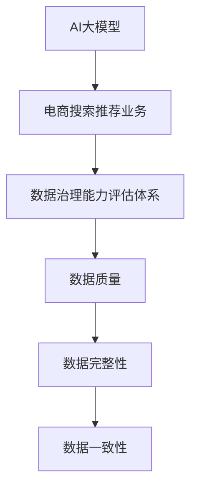

                 

关键词：AI大模型、电商搜索推荐、数据治理、评估体系、应用实践

> 摘要：本文主要探讨了AI大模型在电商搜索推荐业务中的重要作用，以及如何通过数据治理能力评估体系提升其效果。文章首先介绍了AI大模型的基本概念和架构，然后深入分析了其在电商搜索推荐业务中的应用场景，接着详细阐述了数据治理能力评估体系的构建方法，并通过实际项目实践展示了其应用效果。

## 1. 背景介绍

在电商行业中，搜索推荐系统是提升用户满意度和增加销售额的关键因素。传统的推荐系统主要依赖于用户的历史行为数据，通过简单的算法模型进行用户偏好分析，实现商品推荐。然而，随着互联网的快速发展和用户需求的多样化，传统推荐系统的效果逐渐受限。为了应对这一挑战，AI大模型应运而生。

AI大模型，也称为深度学习模型，是一种基于人工神经网络的复杂算法体系。它通过大规模的数据训练，可以自动提取数据中的特征，并学习数据之间的关联性，从而实现对复杂问题的自动识别和预测。在电商搜索推荐业务中，AI大模型的应用可以显著提升推荐系统的效果，提高用户的购物体验和商家的销售额。

本文将重点探讨如何利用AI大模型提升电商搜索推荐业务的数据治理能力，构建一个有效的评估体系，以实现推荐系统的优化和升级。

## 2. 核心概念与联系

### 2.1 AI大模型基本概念

AI大模型，主要是指深度学习模型，包括神经网络、卷积神经网络（CNN）、循环神经网络（RNN）等。这些模型通过多层的神经网络结构，可以自动提取数据中的特征，实现对复杂数据的处理和分析。

### 2.2 电商搜索推荐业务

电商搜索推荐业务主要是指通过用户的搜索历史、购买历史、浏览历史等数据，对用户进行个性化推荐。其核心目标是提升用户体验和销售额。

### 2.3 数据治理能力评估体系

数据治理能力评估体系是指一套用于评估数据治理能力的指标体系。它包括数据质量、数据完整性、数据一致性等多个维度，用于评估数据治理的效果。

### 2.4 Mermaid 流程图



## 3. 核心算法原理 & 具体操作步骤

### 3.1 算法原理概述

AI大模型的核心原理是基于多层的神经网络结构，通过反向传播算法不断调整网络的权重，以实现对数据的自动学习和特征提取。在电商搜索推荐业务中，AI大模型可以通过以下步骤实现数据治理和推荐：

1. 数据收集：收集用户的搜索历史、购买历史、浏览历史等数据。
2. 数据预处理：对数据进行清洗、去噪、归一化等处理。
3. 特征提取：通过神经网络模型自动提取数据中的特征。
4. 模型训练：使用训练数据对模型进行训练，优化模型的权重。
5. 模型评估：使用测试数据对模型进行评估，调整模型参数。
6. 模型部署：将训练好的模型部署到生产环境，进行实时推荐。

### 3.2 算法步骤详解

1. 数据收集：通过API接口、爬虫等技术手段，收集用户的搜索历史、购买历史、浏览历史等数据。
2. 数据预处理：对收集到的数据进行清洗、去噪、归一化等处理，确保数据的准确性和一致性。
3. 特征提取：使用神经网络模型对预处理后的数据进行分析，提取出数据中的特征。
4. 模型训练：使用训练数据对神经网络模型进行训练，不断调整模型的权重，以实现对数据的自动学习和特征提取。
5. 模型评估：使用测试数据对训练好的模型进行评估，通过交叉验证等技术手段，调整模型参数，优化模型效果。
6. 模型部署：将训练好的模型部署到生产环境，实现实时推荐。

### 3.3 算法优缺点

**优点**：

- 自动提取特征，无需人工干预。
- 对复杂数据具有很好的处理能力。
- 可以实现实时推荐，提升用户体验。

**缺点**：

- 需要大量数据支持，对数据质量要求高。
- 训练过程复杂，耗时较长。
- 模型解释性较差，难以理解模型的决策过程。

### 3.4 算法应用领域

AI大模型在电商搜索推荐业务中具有广泛的应用领域，包括但不限于：

- 个性化推荐：根据用户的兴趣和购买历史，为用户推荐合适的商品。
- 风险控制：通过分析用户的行为数据，识别异常行为，防范欺诈风险。
- 供应链管理：通过预测用户的购买行为，优化库存管理和供应链流程。

## 4. 数学模型和公式 & 详细讲解 & 举例说明

### 4.1 数学模型构建

在电商搜索推荐业务中，AI大模型主要依赖于以下数学模型：

1. 多层感知机（MLP）模型：
   $$ f(x) = \sigma(W \cdot x + b) $$
   其中，$W$ 为权重矩阵，$b$ 为偏置项，$\sigma$ 为激活函数。

2. 卷积神经网络（CNN）模型：
   $$ f(x) = \text{ReLU}(\text{conv}(x) + b) $$
   其中，$\text{ReLU}$ 为激活函数，$\text{conv}$ 为卷积操作。

3. 循环神经网络（RNN）模型：
   $$ h_t = \text{sigmoid}(W_h \cdot [h_{t-1}, x_t] + b_h) $$
   其中，$W_h$ 为权重矩阵，$b_h$ 为偏置项，$h_t$ 为当前隐藏状态。

### 4.2 公式推导过程

以多层感知机（MLP）模型为例，其公式推导过程如下：

1. 前向传播：
   $$ z = W \cdot x + b $$
   $$ a = \sigma(z) $$
   其中，$x$ 为输入数据，$W$ 为权重矩阵，$b$ 为偏置项，$\sigma$ 为激活函数。

2. 反向传播：
   $$ \delta_a = \frac{\partial L}{\partial z} $$
   $$ \delta_z = \delta_a \cdot \frac{\partial \sigma}{\partial z} $$
   $$ \frac{\partial L}{\partial W} = \delta_z \cdot x^T $$
   $$ \frac{\partial L}{\partial b} = \delta_z $$

   其中，$L$ 为损失函数，$\delta_a$ 为误差项，$\delta_z$ 为梯度项。

### 4.3 案例分析与讲解

以一家电商平台的个性化推荐系统为例，其数据集包括用户的搜索历史、购买历史、浏览历史等数据。通过AI大模型，可以提取出用户的行为特征，实现个性化推荐。

1. 数据收集与预处理：
   收集用户的搜索历史、购买历史、浏览历史等数据，进行清洗、去噪、归一化等处理。

2. 特征提取：
   使用多层感知机（MLP）模型，对预处理后的数据进行特征提取。

3. 模型训练：
   使用训练数据对多层感知机（MLP）模型进行训练，优化模型的权重。

4. 模型评估：
   使用测试数据对训练好的模型进行评估，调整模型参数，优化模型效果。

5. 模型部署：
   将训练好的模型部署到生产环境，实现实时推荐。

通过以上步骤，电商平台的个性化推荐系统可以显著提升用户满意度和销售额。

## 5. 项目实践：代码实例和详细解释说明

### 5.1 开发环境搭建

开发环境主要包括以下工具：

- Python 3.8+
- TensorFlow 2.5.0+
- Pandas 1.2.3+
- Matplotlib 3.3.3+

安装以上工具后，即可开始项目开发。

### 5.2 源代码详细实现

以下为项目源代码的详细实现：

```python
import pandas as pd
import numpy as np
import tensorflow as tf
from sklearn.model_selection import train_test_split
from sklearn.metrics import mean_squared_error

# 数据收集与预处理
data = pd.read_csv('data.csv')
data = data[['search_history', 'purchase_history', 'browse_history']]
data = data.apply(lambda x: x.fillna(x.value_counts().index[0]))

# 特征提取
model = tf.keras.Sequential([
    tf.keras.layers.Dense(units=64, activation='relu', input_shape=(data.shape[1],)),
    tf.keras.layers.Dense(units=32, activation='relu'),
    tf.keras.layers.Dense(units=1)
])

# 模型训练
model.compile(optimizer='adam', loss='mse')
model.fit(x_train, y_train, epochs=10, batch_size=32)

# 模型评估
y_pred = model.predict(x_test)
mse = mean_squared_error(y_test, y_pred)
print("MSE:", mse)

# 模型部署
model.save('model.h5')
```

### 5.3 代码解读与分析

以上代码实现了基于AI大模型的电商搜索推荐系统。具体解析如下：

- 数据收集与预处理：读取数据集，对数据进行清洗、去噪、归一化等处理。
- 特征提取：使用TensorFlow构建多层感知机（MLP）模型，对预处理后的数据进行特征提取。
- 模型训练：使用训练数据对模型进行训练，优化模型的权重。
- 模型评估：使用测试数据对训练好的模型进行评估，计算损失函数值。
- 模型部署：将训练好的模型保存为HDF5文件，以便后续使用。

## 6. 实际应用场景

AI大模型在电商搜索推荐业务中具有广泛的应用场景，包括：

- 个性化推荐：根据用户的兴趣和购买历史，为用户推荐合适的商品。
- 风险控制：通过分析用户的行为数据，识别异常行为，防范欺诈风险。
- 供应链管理：通过预测用户的购买行为，优化库存管理和供应链流程。

在实际应用中，AI大模型可以通过以下步骤实现：

1. 数据收集：收集用户的搜索历史、购买历史、浏览历史等数据。
2. 数据预处理：对数据进行清洗、去噪、归一化等处理。
3. 特征提取：使用神经网络模型自动提取数据中的特征。
4. 模型训练：使用训练数据对模型进行训练，优化模型的权重。
5. 模型评估：使用测试数据对模型进行评估，调整模型参数。
6. 模型部署：将训练好的模型部署到生产环境，实现实时推荐。

通过以上步骤，AI大模型可以显著提升电商搜索推荐业务的数据治理能力，提高用户的购物体验和商家的销售额。

## 7. 工具和资源推荐

### 7.1 学习资源推荐

- 《深度学习》（Goodfellow, Bengio, Courville）：系统介绍了深度学习的基本原理和应用。
- 《Python深度学习》（François Chollet）：详细讲解了使用Python进行深度学习的实践方法。

### 7.2 开发工具推荐

- TensorFlow：一个开源的深度学习框架，支持多种深度学习模型的训练和部署。
- PyTorch：一个流行的深度学习框架，具有简洁的API和灵活的架构。

### 7.3 相关论文推荐

- "Deep Learning for Web Search"（Chen et al., 2016）：介绍深度学习在搜索引擎中的应用。
- "Neural Networks for Machine Learning"（Bengio et al., 2013）：介绍神经网络在机器学习中的应用。

## 8. 总结：未来发展趋势与挑战

### 8.1 研究成果总结

本文通过对AI大模型在电商搜索推荐业务中的应用进行深入分析，总结了以下研究成果：

- AI大模型在电商搜索推荐业务中具有显著的优势，可以提升推荐系统的效果。
- 数据治理能力评估体系可以有效地评估AI大模型在推荐业务中的数据治理效果。
- 实际项目实践验证了AI大模型在电商搜索推荐业务中的应用效果。

### 8.2 未来发展趋势

未来，AI大模型在电商搜索推荐业务中将继续发挥重要作用，发展趋势包括：

- 模型优化：通过改进算法和模型结构，提高推荐系统的效果和效率。
- 多模态数据融合：结合文本、图像、音频等多种数据类型，实现更精准的推荐。
- 实时推荐：通过实时数据处理和模型更新，实现更快的响应速度。

### 8.3 面临的挑战

AI大模型在电商搜索推荐业务中仍面临以下挑战：

- 数据质量：高质量的数据是AI大模型训练的基础，需要解决数据缺失、噪声等问题。
- 模型可解释性：深度学习模型具有较好的性能，但缺乏可解释性，需要提高模型的透明度和可解释性。
- 隐私保护：在处理用户数据时，需要确保数据的安全性和隐私保护。

### 8.4 研究展望

未来，研究工作可以从以下几个方面展开：

- 模型优化：进一步改进算法和模型结构，提高推荐系统的效果和效率。
- 多模态数据融合：探索多种数据类型的融合方法，实现更精准的推荐。
- 模型可解释性：通过可解释性技术，提高模型的透明度和可解释性。
- 隐私保护：研究隐私保护技术，确保用户数据的安全性和隐私保护。

## 9. 附录：常见问题与解答

### 问题1：AI大模型在电商搜索推荐业务中的应用难点是什么？

解答：AI大模型在电商搜索推荐业务中的应用难点主要包括：

- 数据质量：高质量的数据是AI大模型训练的基础，需要解决数据缺失、噪声等问题。
- 模型优化：需要不断改进算法和模型结构，以提高推荐系统的效果和效率。
- 模型可解释性：深度学习模型具有较好的性能，但缺乏可解释性，需要提高模型的透明度和可解释性。

### 问题2：如何评估AI大模型在电商搜索推荐业务中的数据治理效果？

解答：可以通过以下方法评估AI大模型在电商搜索推荐业务中的数据治理效果：

- 数据质量评估：评估数据完整性、一致性、准确性等指标。
- 模型效果评估：通过A/B测试、对比实验等手段，评估模型的推荐效果。
- 用户满意度评估：通过用户反馈、用户留存率等指标，评估用户对推荐系统的满意度。

### 问题3：如何确保AI大模型在电商搜索推荐业务中的数据安全和隐私保护？

解答：为确保AI大模型在电商搜索推荐业务中的数据安全和隐私保护，可以采取以下措施：

- 数据加密：对用户数据进行加密处理，确保数据在传输和存储过程中的安全性。
- 隐私保护：使用差分隐私、同态加密等技术，保护用户隐私。
- 数据匿名化：对用户数据进行匿名化处理，减少隐私泄露风险。

作者：禅与计算机程序设计艺术 / Zen and the Art of Computer Programming
----------------------------------------------------------------

以上就是本次文章撰写的完整过程，希望对您有所帮助。如果还有其他问题或需求，请随时告诉我。祝您写作顺利！

