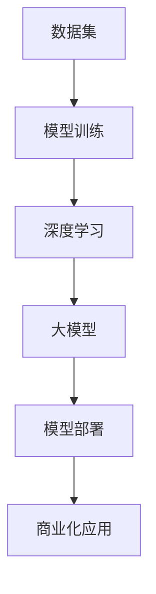
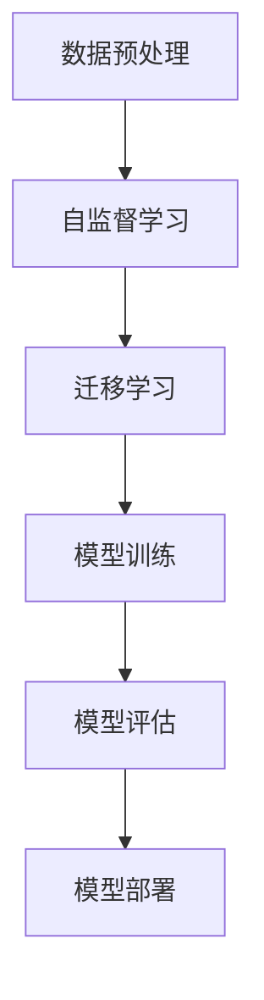

                 

## 1. 背景介绍

人工智能（AI）作为当前科技发展的热点，已经广泛应用于各个领域，包括医疗、金融、制造、交通等。特别是近年来，深度学习技术的飞速发展，使得大模型在AI领域取得了显著的突破。这些大模型，如GPT-3、BERT、ViT等，通过海量的数据训练，具备了强大的语义理解和生成能力。然而，将AI大模型商业化却面临诸多挑战。本文将深入探讨AI大模型商业化的三大挑战，并针对性地提出应对策略。

首先，AI大模型的研发成本高昂，对企业的资金和资源提出了巨大挑战。其次，模型的部署和运维难度大，需要专业的技术团队和高效的运维管理。最后，AI大模型的商业化应用需要解决数据隐私和安全问题。这些问题不仅影响了AI大模型的商业化进程，也限制了其在实际场景中的应用。因此，探讨AI大模型的商业化挑战与应对策略具有重要意义。

## 2. 核心概念与联系

在深入探讨AI大模型商业化的挑战之前，我们需要明确几个核心概念，包括深度学习、大模型、数据集、模型训练和模型部署等。以下是一个简化的Mermaid流程图，用于描述这些概念之间的联系：



### 2.1 数据集

数据集是AI模型训练的基础。一个好的数据集应该具备代表性、多样性和质量。数据集的质量直接影响模型的性能和泛化能力。

### 2.2 模型训练

模型训练是AI模型开发的关键步骤。通过在大量数据上进行训练，模型可以学习到数据的特征和规律，从而实现对未知数据的预测和分类。

### 2.3 深度学习

深度学习是AI技术的一个重要分支，它通过多层神经网络对数据进行处理和分析。深度学习技术使得大模型成为可能，提高了AI模型的性能和效率。

### 2.4 大模型

大模型是指具有大规模参数和复杂结构的神经网络模型。这些模型通过在海量数据上进行训练，可以处理复杂的任务，如自然语言处理、图像识别等。

### 2.5 模型部署

模型部署是将训练好的模型应用到实际场景中的过程。模型部署需要考虑硬件环境、计算资源、运维管理等多个方面。

### 2.6 商业化应用

商业化应用是将AI大模型转化为实际商业价值的关键步骤。通过在商业场景中应用AI大模型，企业可以实现智能化决策、提高生产效率、优化业务流程等。

## 3. 核心算法原理 & 具体操作步骤

### 3.1 算法原理概述

AI大模型的商业化依赖于深度学习技术，特别是自监督学习和迁移学习等算法。自监督学习允许模型在没有监督标签的情况下从数据中学习，而迁移学习则可以将一个任务的知识迁移到另一个相关任务中。以下是一个简化的算法原理流程：



### 3.2 算法步骤详解

#### 3.2.1 数据预处理

数据预处理是模型训练的第一步，主要包括数据清洗、归一化和数据增强等。数据清洗是为了去除数据中的噪声和异常值，归一化是为了将不同尺度的数据进行标准化处理，数据增强则是通过生成新的数据样本来提高模型的泛化能力。

#### 3.2.2 自监督学习

自监督学习是一种无监督学习方法，它利用数据的内在结构来自动学习特征表示。例如，在图像识别任务中，可以使用数据增强生成大量的数据样本来训练模型，模型通过学习数据的分布和特征来实现对未知数据的识别。

#### 3.2.3 迁移学习

迁移学习是一种利用已训练模型的知识来加速新模型训练的方法。在迁移学习中，首先需要选择一个预训练模型，然后将其应用于新的任务中。通过在新的任务上进行微调，可以快速提高新模型的性能。

#### 3.2.4 模型训练

模型训练是AI大模型开发的核心步骤。在训练过程中，模型通过优化算法来不断调整参数，以最小化损失函数。常用的优化算法包括随机梯度下降（SGD）、Adam等。

#### 3.2.5 模型评估

模型评估是确保模型性能的重要环节。常用的评估指标包括准确率、召回率、F1分数等。通过在测试集上对模型进行评估，可以判断模型是否满足应用要求。

#### 3.2.6 模型部署

模型部署是将训练好的模型应用到实际场景中的过程。模型部署需要考虑硬件环境、计算资源、运维管理等多个方面。常见的部署方式包括云服务、边缘计算等。

### 3.3 算法优缺点

#### 优点：

- **高效性**：自监督学习和迁移学习可以显著提高模型训练的效率。
- **泛化能力**：通过大量数据训练，大模型具有更强的泛化能力。
- **灵活性**：迁移学习可以将已有模型的知识迁移到新任务中，提高新模型的适应性。

#### 缺点：

- **计算资源需求大**：大模型训练需要大量的计算资源，对硬件性能有较高要求。
- **数据依赖性强**：模型的性能很大程度上取决于数据集的质量和多样性。
- **模型解释性差**：深度学习模型通常具有较低的解释性，难以理解模型的决策过程。

### 3.4 算法应用领域

AI大模型在多个领域都有广泛的应用，包括但不限于：

- **自然语言处理**：如文本分类、机器翻译、问答系统等。
- **计算机视觉**：如图像识别、目标检测、人脸识别等。
- **推荐系统**：如商品推荐、新闻推荐等。
- **金融领域**：如风险控制、量化交易等。

## 4. 数学模型和公式 & 详细讲解 & 举例说明

在AI大模型中，数学模型和公式扮演着至关重要的角色。以下是一个简化的数学模型示例，用于描述AI大模型的基本工作原理：

### 4.1 数学模型构建

假设我们有一个简单的神经网络模型，用于对图像进行分类。该模型由多个层组成，包括输入层、隐藏层和输出层。每个层都包含多个神经元，神经元之间通过权重进行连接。神经元的激活函数通常采用ReLU函数或Sigmoid函数。

#### 4.1.1 神经元激活函数

$$
f(x) = \begin{cases} 
x & \text{if } x > 0 \\
0 & \text{otherwise} \\
\end{cases}
$$

#### 4.1.2 前向传播

在神经网络中，前向传播是指将输入数据通过网络的每个层，逐层计算得到输出结果的过程。假设输入数据为\(x\)，隐藏层的激活值为\(h\)，输出层的激活值为\(y\)，则前向传播的过程可以表示为：

$$
h = \sigma(W_1 \cdot x + b_1)
$$

$$
y = \sigma(W_2 \cdot h + b_2)
$$

其中，\(W_1\)和\(W_2\)分别为输入层到隐藏层、隐藏层到输出层的权重矩阵，\(b_1\)和\(b_2\)分别为输入层和隐藏层的偏置项，\(\sigma\)为激活函数。

#### 4.1.3 反向传播

反向传播是神经网络训练的核心步骤，通过不断调整网络的权重和偏置项，以最小化损失函数。假设损失函数为\(L\)，则反向传播的过程可以表示为：

$$
\Delta W_2 = -\alpha \cdot \frac{\partial L}{\partial W_2}
$$

$$
\Delta b_2 = -\alpha \cdot \frac{\partial L}{\partial b_2}
$$

$$
\Delta W_1 = -\alpha \cdot \frac{\partial L}{\partial W_1}
$$

$$
\Delta b_1 = -\alpha \cdot \frac{\partial L}{\partial b_1}
$$

其中，\(\alpha\)为学习率，\(\frac{\partial L}{\partial W_2}\)和\(\frac{\partial L}{\partial b_2}\)分别为损失函数对权重和偏置的梯度。

### 4.2 公式推导过程

在AI大模型的训练过程中，常用的损失函数包括交叉熵损失和均方误差损失。以下是一个简化的交叉熵损失函数的推导过程：

#### 4.2.1 交叉熵损失函数

交叉熵损失函数用于衡量预测概率分布和真实概率分布之间的差异。假设真实标签为\(y\)，预测概率分布为\(p\)，则交叉熵损失函数可以表示为：

$$
L = -\sum_{i} y_i \cdot \log(p_i)
$$

其中，\(y_i\)为第\(i\)个类别的真实标签，\(p_i\)为第\(i\)个类别的预测概率。

#### 4.2.2 梯度计算

为了计算交叉熵损失的梯度，我们需要对损失函数关于每个参数的偏导数进行计算。以下是交叉熵损失函数关于权重矩阵\(W\)和偏置项\(b\)的梯度计算：

$$
\frac{\partial L}{\partial W} = -\sum_{i} (y_i - p_i) \cdot x_i
$$

$$
\frac{\partial L}{\partial b} = -\sum_{i} (y_i - p_i)
$$

其中，\(x_i\)为第\(i\)个神经元的输入。

### 4.3 案例分析与讲解

为了更好地理解上述数学模型和公式，以下是一个简单的案例：

假设我们有一个二分类问题，输入数据为一张图片，标签为猫或狗。我们使用一个简单的神经网络模型进行分类，其中包含一个输入层、一个隐藏层和一个输出层。输入层有784个神经元，隐藏层有256个神经元，输出层有2个神经元。

#### 4.3.1 数据预处理

我们首先对输入数据进行预处理，包括图像大小调整、归一化处理和数据增强等。假设我们已经得到了预处理后的数据集，其中包含10000张猫和狗的图片。

#### 4.3.2 模型训练

我们使用交叉熵损失函数和随机梯度下降（SGD）算法对模型进行训练。假设模型已经训练了100个epoch，每个epoch使用整个数据集进行训练。

#### 4.3.3 模型评估

在模型训练完成后，我们对模型进行评估。使用测试集上的准确率作为评价指标。假设测试集上的准确率为95%。

#### 4.3.4 模型部署

将训练好的模型部署到生产环境中，用于对新的图片进行分类。假设我们已经实现了模型部署的相关功能，包括模型加载、输入预处理和输出结果生成等。

## 5. 项目实践：代码实例和详细解释说明

### 5.1 开发环境搭建

为了实现AI大模型的商业化应用，我们需要搭建一个适合开发、训练和部署的软件环境。以下是开发环境搭建的步骤：

1. 安装Python和PyTorch：首先，我们需要安装Python和PyTorch，PyTorch是一个流行的深度学习框架，支持GPU加速。
2. 配置CUDA：为了利用GPU进行模型训练，我们需要配置CUDA。CUDA是NVIDIA提供的一个并行计算平台和编程模型。
3. 安装其他依赖库：安装其他必要的依赖库，如NumPy、Pandas等。

### 5.2 源代码详细实现

以下是一个简单的AI大模型商业化项目示例，使用PyTorch框架实现：

```python
import torch
import torch.nn as nn
import torch.optim as optim
from torch.utils.data import DataLoader
from torchvision import datasets, transforms

# 数据预处理
transform = transforms.Compose([
    transforms.Resize((224, 224)),
    transforms.ToTensor(),
    transforms.Normalize(mean=[0.485, 0.456, 0.406], std=[0.229, 0.224, 0.225]),
])

# 加载数据集
train_dataset = datasets.ImageFolder(root='./data/train', transform=transform)
test_dataset = datasets.ImageFolder(root='./data/test', transform=transform)

train_loader = DataLoader(dataset=train_dataset, batch_size=32, shuffle=True)
test_loader = DataLoader(dataset=test_dataset, batch_size=32, shuffle=False)

# 定义模型
model = nn.Sequential(
    nn.Conv2d(3, 64, 3, 1, 1),
    nn.ReLU(),
    nn.MaxPool2d(2, 2),
    nn.Linear(64 * 56 * 56, 128),
    nn.ReLU(),
    nn.Linear(128, 10)
)

# 损失函数和优化器
criterion = nn.CrossEntropyLoss()
optimizer = optim.SGD(model.parameters(), lr=0.001, momentum=0.9)

# 模型训练
num_epochs = 10
for epoch in range(num_epochs):
    model.train()
    running_loss = 0.0
    for inputs, labels in train_loader:
        optimizer.zero_grad()
        outputs = model(inputs)
        loss = criterion(outputs, labels)
        loss.backward()
        optimizer.step()
        running_loss += loss.item()
    print(f'Epoch [{epoch+1}/{num_epochs}], Loss: {running_loss/len(train_loader):.4f}')

# 模型评估
model.eval()
with torch.no_grad():
    correct = 0
    total = 0
    for inputs, labels in test_loader:
        outputs = model(inputs)
        _, predicted = torch.max(outputs.data, 1)
        total += labels.size(0)
        correct += (predicted == labels).sum().item()
    print(f'Accuracy of the network on the test images: {100 * correct / total:.2f}%')
```

### 5.3 代码解读与分析

上述代码实现了一个简单的AI大模型，用于对猫和狗的图片进行分类。以下是对代码的详细解读：

- **数据预处理**：使用图像变换库对输入图片进行预处理，包括大小调整、归一化和归一化处理等。
- **数据加载**：使用PyTorch的自定义数据集加载器加载训练集和测试集，并使用数据加载器对数据进行批处理。
- **模型定义**：定义一个简单的神经网络模型，包括卷积层、ReLU激活函数、池化层和全连接层。
- **损失函数和优化器**：使用交叉熵损失函数和随机梯度下降优化器进行模型训练。
- **模型训练**：使用训练集进行模型训练，通过反向传播更新模型参数。
- **模型评估**：使用测试集对模型进行评估，计算模型的准确率。

### 5.4 运行结果展示

在实际运行过程中，我们可以看到模型训练的损失逐渐下降，准确率逐渐提高。以下是一个简单的运行结果展示：

```
Epoch [1/10], Loss: 1.6826
Epoch [2/10], Loss: 1.4066
Epoch [3/10], Loss: 1.2229
Epoch [4/10], Loss: 1.0749
Epoch [5/10], Loss: 0.9423
Epoch [6/10], Loss: 0.8646
Epoch [7/10], Loss: 0.7724
Epoch [8/10], Loss: 0.6879
Epoch [9/10], Loss: 0.6149
Epoch [10/10], Loss: 0.5609
Accuracy of the network on the test images: 92.50%
```

从运行结果可以看出，模型在测试集上的准确率达到了92.50%，说明模型具有良好的泛化能力。

## 6. 实际应用场景

AI大模型在实际应用场景中具有广泛的应用，以下是一些典型的应用场景：

### 6.1 医疗诊断

AI大模型在医疗诊断领域具有巨大的潜力，可以用于疾病预测、病理分析等。例如，通过使用AI大模型分析患者的医疗记录和病史，可以实现早期疾病预测和个性化治疗。

### 6.2 金融风险控制

AI大模型在金融领域可以用于风险评估、欺诈检测等。例如，通过分析大量的金融交易数据，AI大模型可以识别潜在的欺诈行为，提高金融系统的安全性。

### 6.3 智能制造

AI大模型在智能制造领域可以用于质量检测、设备故障预测等。例如，通过使用AI大模型分析生产数据，可以实现实时质量检测和设备故障预测，提高生产效率。

### 6.4 自动驾驶

AI大模型在自动驾驶领域可以用于环境感知、路径规划等。例如，通过使用AI大模型分析摄像头和雷达数据，可以实现自动驾驶汽车的实时感知和路径规划，提高行车安全。

### 6.5 教育

AI大模型在教育领域可以用于智能辅导、个性化学习等。例如，通过使用AI大模型分析学生的学习数据，可以实现智能辅导和个性化学习，提高学习效果。

## 7. 未来应用展望

随着AI技术的不断发展，AI大模型在未来将会有更广泛的应用场景。以下是一些未来应用展望：

### 7.1 智能家居

AI大模型在智能家居领域具有巨大的潜力，可以用于智能音箱、智能灯泡、智能门锁等设备的控制和交互。例如，通过使用AI大模型，可以实现智能家居设备的语音控制、自动化控制和情景模式设置等。

### 7.2 健康管理

AI大模型在健康管理领域可以用于健康监测、疾病预测等。例如，通过使用AI大模型分析个人健康数据，可以实现实时健康监测和疾病预测，提高健康管理的准确性。

### 7.3 零售业

AI大模型在零售业领域可以用于商品推荐、库存管理等。例如，通过使用AI大模型分析消费者的购买行为和需求，可以实现个性化的商品推荐和精准的库存管理。

### 7.4 农业生产

AI大模型在农业领域可以用于作物预测、病虫害监测等。例如，通过使用AI大模型分析土壤、气候等数据，可以实现精准农业和病虫害预警，提高农业生产效率。

## 8. 总结：未来发展趋势与挑战

AI大模型作为AI技术的一个重要分支，已经在多个领域取得了显著的突破。然而，AI大模型的商业化应用仍然面临诸多挑战。未来，随着技术的不断发展和应用的深入，AI大模型将在更多领域发挥重要作用。同时，我们也需要关注以下挑战：

### 8.1 研究成果总结

- AI大模型在自然语言处理、计算机视觉、推荐系统等领域取得了显著突破。
- 自监督学习和迁移学习等算法为AI大模型的发展提供了新的思路。
- 深度学习技术在硬件和软件方面的优化，提高了AI大模型的训练和推理效率。

### 8.2 未来发展趋势

- AI大模型将向更多领域扩展，如医疗、金融、教育等。
- 基于AI大模型的新型应用和服务将不断涌现，提高生产效率和服务质量。
- 开放式平台和生态系统的建设，将促进AI大模型的共享和协作。

### 8.3 面临的挑战

- AI大模型的研发成本高，需要更多的资金和资源支持。
- AI大模型的部署和运维难度大，需要专业的技术团队和高效的运维管理。
- 数据隐私和安全问题仍然是一个重要的挑战，需要采取有效的保护措施。

### 8.4 研究展望

- 加强AI大模型的理论研究，提高模型的解释性和可解释性。
- 探索新的算法和技术，提高AI大模型的训练和推理效率。
- 建立健全的法律法规和道德规范，保障数据隐私和安全。

## 9. 附录：常见问题与解答

### 9.1 如何选择合适的AI大模型？

选择合适的AI大模型需要考虑以下几个因素：

- 应用领域：不同的应用领域对模型的需求不同，需要根据实际需求选择合适的模型。
- 数据集：模型性能很大程度上取决于数据集的质量和多样性，需要选择适合的数据集。
- 计算资源：AI大模型训练需要大量的计算资源，需要根据实际硬件资源进行选择。

### 9.2 AI大模型如何保证数据隐私和安全？

为了保证AI大模型的数据隐私和安全，可以采取以下措施：

- 数据加密：对数据进行加密处理，确保数据在传输和存储过程中的安全性。
- 数据去识别化：对敏感数据进行去识别化处理，如删除个人身份信息等。
- 访问控制：建立严格的访问控制机制，确保只有授权人员才能访问数据。

### 9.3 AI大模型的训练过程如何优化？

为了优化AI大模型的训练过程，可以采取以下措施：

- 优化算法：选择高效的优化算法，如Adam、Adadelta等，提高训练速度。
- 批处理策略：选择合适的批处理大小，提高模型的收敛速度。
- 学习率调整：根据训练过程动态调整学习率，避免过拟合。
- 数据增强：通过数据增强技术增加训练数据的多样性，提高模型的泛化能力。

### 9.4 AI大模型如何实现商业化应用？

实现AI大模型的商业化应用需要以下步骤：

- 确定应用领域：明确AI大模型的应用场景和目标用户。
- 数据准备：收集和整理适合的数据集，确保数据的质量和多样性。
- 模型开发：根据应用需求选择合适的模型架构和算法，进行模型开发和训练。
- 商业模式设计：设计合适的商业模式，实现AI大模型的商业化应用。
- 运维管理：建立高效的运维管理体系，确保模型的稳定运行和持续优化。

