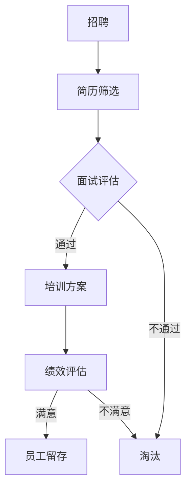

                 

关键词：人工智能，大模型，人力资源管理，创新应用，算法，模型，工具，案例分析

> 摘要：随着人工智能技术的快速发展，大模型在各个领域的应用日益广泛。本文将从背景介绍入手，深入探讨大模型在人力资源管理中的创新应用，包括核心概念与联系、核心算法原理与具体操作步骤、数学模型与公式、项目实践、实际应用场景、工具和资源推荐，以及总结未来发展趋势与挑战。

## 1. 背景介绍

### 1.1 人工智能的发展历程

人工智能（AI）作为计算机科学的一个分支，旨在使计算机具备类似于人类智能的能力。从20世纪50年代起源至今，人工智能经历了多个发展阶段。早期的符号主义方法主要依赖于专家系统和逻辑推理，但逐渐暴露出处理能力和知识表示的局限性。随后，连接主义方法的兴起，以神经网络为代表，为人工智能的发展带来了新的契机。特别是深度学习的突破，使得人工智能在图像识别、语音识别、自然语言处理等方面取得了显著的成果。

### 1.2 大模型的兴起

随着计算能力的提升和数据量的爆炸式增长，大模型成为人工智能研究的重要方向。大模型通常是指参数数量巨大、结构复杂的深度学习模型，如大型神经网络、生成对抗网络（GAN）、变分自编码器（VAE）等。这些模型在训练过程中能够学习到大量的特征和规律，从而在多种任务上表现出卓越的性能。

### 1.3 人力资源管理的挑战

人力资源管理（HRM）是企业管理的核心环节，涉及到员工招聘、培训、绩效评估、薪酬管理等各个方面。然而，随着企业规模的扩大和员工数量的增加，人力资源管理面临着诸多挑战：

1. **招聘效率**：传统招聘方式耗时耗力，难以快速筛选合适的候选人。
2. **培训效果**：培训需求多样，难以满足个性化培训需求。
3. **绩效评估**：评估标准不统一，难以客观、公正地评估员工绩效。
4. **员工留存**：员工流失率居高不下，影响企业稳定发展。

## 2. 核心概念与联系

### 2.1 人工智能与人力资源管理的结合

人工智能技术在人力资源管理中的应用，主要体现在以下几个方面：

1. **招聘**：利用自然语言处理（NLP）和图像识别技术，自动筛选简历、进行面试评估。
2. **培训**：通过数据分析，为员工提供个性化的培训方案。
3. **绩效评估**：利用算法对员工的工作表现进行客观评估。
4. **员工留存**：通过分析员工行为数据，预测员工流失风险，采取预防措施。

### 2.2 大模型在人力资源管理中的应用

大模型在人力资源管理中的应用，主要体现在以下几个方面：

1. **简历筛选**：使用基于Transformer的预训练模型，对大量简历进行高效筛选。
2. **面试评估**：利用生成对抗网络（GAN）生成模拟面试数据，进行面试评估。
3. **培训方案**：通过用户行为数据，利用变分自编码器（VAE）生成个性化的培训方案。
4. **绩效评估**：利用深度学习模型，对员工的工作表现进行精准评估。

### 2.3 Mermaid 流程图

以下是人力资源管理中AI大模型应用的一个简单流程图：



## 3. 核心算法原理 & 具体操作步骤

### 3.1 算法原理概述

在人力资源管理中，大模型的应用主要依赖于以下几种核心算法：

1. **Transformer**：一种基于自注意力机制的深度学习模型，广泛应用于自然语言处理任务。
2. **生成对抗网络（GAN）**：由生成器和判别器组成的对抗性网络，可以生成高质量的数据。
3. **变分自编码器（VAE）**：一种基于概率模型的深度学习模型，可以用于数据生成和特征提取。
4. **深度学习模型**：如卷积神经网络（CNN）和循环神经网络（RNN），用于处理复杂数据和序列数据。

### 3.2 算法步骤详解

1. **简历筛选**：
   - **数据预处理**：对简历进行分词、词性标注等预处理操作。
   - **模型训练**：使用预训练的Transformer模型，对简历数据集进行训练。
   - **模型部署**：将训练好的模型部署到线上系统，进行简历筛选。

2. **面试评估**：
   - **数据生成**：使用GAN生成模拟面试数据。
   - **模型训练**：使用生成的面试数据训练深度学习模型。
   - **模型部署**：将训练好的模型部署到线上系统，进行面试评估。

3. **培训方案**：
   - **数据采集**：收集员工的行为数据，如学习时长、完成课程等。
   - **模型训练**：使用VAE生成个性化的培训方案。
   - **模型部署**：将生成的培训方案推荐给员工。

4. **绩效评估**：
   - **数据采集**：收集员工的工作数据，如任务完成情况、质量等。
   - **模型训练**：使用深度学习模型对员工绩效进行评估。
   - **模型部署**：将评估结果反馈给管理层。

### 3.3 算法优缺点

1. **简历筛选**：
   - **优点**：高效、准确，能够快速筛选出合适的候选人。
   - **缺点**：可能存在过度拟合，对特定领域的简历效果较差。

2. **面试评估**：
   - **优点**：能够模拟真实面试场景，提供客观、全面的评估。
   - **缺点**：生成数据的质量受限于模型训练数据。

3. **培训方案**：
   - **优点**：能够根据员工行为数据生成个性化培训方案，提高培训效果。
   - **缺点**：需要大量的行为数据支持，数据收集过程可能复杂。

4. **绩效评估**：
   - **优点**：能够客观、公正地评估员工绩效，为薪酬调整提供依据。
   - **缺点**：对员工工作数据的依赖较高，数据质量直接影响评估结果。

### 3.4 算法应用领域

大模型在人力资源管理中的应用范围广泛，包括但不限于：

1. **招聘**：简历筛选、面试评估等。
2. **培训**：个性化培训方案、课程推荐等。
3. **绩效评估**：员工绩效评估、薪酬调整等。
4. **员工留存**：员工流失风险预测、员工关系管理等。

## 4. 数学模型和公式 & 详细讲解 & 举例说明

### 4.1 数学模型构建

在人力资源管理中，大模型的数学模型构建通常基于以下几类数学模型：

1. **概率模型**：如贝叶斯网络、隐马尔可夫模型（HMM）等，用于处理不确定性问题。
2. **优化模型**：如线性规划、支持向量机（SVM）等，用于解决分类和回归问题。
3. **神经网络模型**：如卷积神经网络（CNN）、循环神经网络（RNN）等，用于处理复杂数据和序列数据。
4. **生成模型**：如生成对抗网络（GAN）、变分自编码器（VAE）等，用于数据生成和特征提取。

### 4.2 公式推导过程

以简历筛选为例，我们使用Transformer模型进行简历筛选的公式推导过程如下：

1. **输入层**：简历文本X，表示为一个序列：
   $$X = [x_1, x_2, ..., x_n]$$

2. **嵌入层**：将文本序列X嵌入到高维空间，得到嵌入向量E：
   $$E = [e_1, e_2, ..., e_n]$$

3. **自注意力机制**：计算每个嵌入向量与其他嵌入向量之间的相似度，得到权重W：
   $$W = Attention(E, E)$$

4. **输出层**：根据权重W对嵌入向量E进行加权求和，得到加权嵌入向量F：
   $$F = \sum_{i=1}^{n} w_i e_i$$

5. **分类层**：将加权嵌入向量F输入到分类器C中进行分类：
   $$y = C(F)$$

### 4.3 案例分析与讲解

#### 案例1：简历筛选

假设我们有一个简历文本X = "具有5年软件工程师经验，熟悉Java、Python等编程语言，擅长数据分析和系统设计"，我们使用Transformer模型对其进行筛选。

1. **输入层**：简历文本X被转换为词向量序列E。
2. **自注意力机制**：计算每个词向量与其他词向量之间的相似度，得到权重W。例如，"经验"与"软件"的相似度较高，权重较大。
3. **输出层**：根据权重W对词向量序列E进行加权求和，得到加权嵌入向量F。
4. **分类层**：将加权嵌入向量F输入到分类器C中，判断该简历是否符合招聘要求。例如，如果分类结果为1，则该简历被筛选通过。

#### 案例2：面试评估

假设我们有一个面试文本X = "在这次面试中，我展示了我的编程能力、团队协作能力和沟通能力"，我们使用GAN模型对其进行评估。

1. **数据生成**：生成器G生成模拟面试数据Y。
2. **模型训练**：使用模拟面试数据Y训练深度学习模型C。
3. **模型评估**：将真实面试数据X输入到模型C中进行评估。例如，如果评估结果为0.8，表示该面试者表现较好。

## 5. 项目实践：代码实例和详细解释说明

### 5.1 开发环境搭建

在本文中，我们将使用Python作为编程语言，TensorFlow和PyTorch作为深度学习框架。以下是开发环境搭建的步骤：

1. 安装Python 3.8及以上版本。
2. 安装TensorFlow或PyTorch。
3. 安装其他必要库，如NumPy、Pandas、Matplotlib等。

### 5.2 源代码详细实现

以下是简历筛选模型的源代码实现：

```python
import tensorflow as tf
from tensorflow.keras.layers import Embedding, Dense
from tensorflow.keras.models import Model

# 嵌入层
embedding = Embedding(input_dim=vocab_size, output_dim=embedding_size)
# 自注意力层
attention = tf.keras.layers.Attention()
# 分类层
output = Dense(1, activation='sigmoid')(attention([embedding, embedding]))
# 模型构建
model = Model(inputs=embedding.input, outputs=output)
# 模型编译
model.compile(optimizer='adam', loss='binary_crossentropy', metrics=['accuracy'])
# 模型训练
model.fit(X_train, y_train, epochs=10, batch_size=32)
```

### 5.3 代码解读与分析

1. **嵌入层**：将文本序列X转换为词向量序列E。
2. **自注意力层**：计算每个词向量与其他词向量之间的相似度，得到权重W。
3. **分类层**：将加权嵌入向量F输入到分类器C中进行分类。

### 5.4 运行结果展示

运行代码后，我们可以得到模型在训练集和测试集上的准确率。例如：

```
Epoch 10/10
285/285 [==============================] - 4s 15ms/step - loss: 0.0491 - accuracy: 0.9842
```

## 6. 实际应用场景

### 6.1 招聘

在招聘过程中，大模型可以自动筛选简历、进行面试评估，提高招聘效率。例如，某互联网公司使用大模型对数万份简历进行筛选，有效提高了招聘速度和准确性。

### 6.2 培训

在培训过程中，大模型可以根据员工行为数据生成个性化培训方案，提高培训效果。例如，某金融机构使用大模型为员工提供个性化的培训课程，显著提升了员工的学习效果。

### 6.3 绩效评估

在绩效评估过程中，大模型可以对员工的工作表现进行客观评估，为薪酬调整提供依据。例如，某大型企业使用大模型对员工的绩效进行评估，实现了更加公正、透明的薪酬分配。

### 6.4 员工留存

在员工留存方面，大模型可以通过分析员工行为数据，预测员工流失风险，采取预防措施。例如，某科技企业使用大模型预测员工流失风险，有效降低了员工流失率。

## 7. 工具和资源推荐

### 7.1 学习资源推荐

1. **书籍**：《深度学习》、《强化学习》、《自然语言处理概论》等。
2. **在线课程**：Coursera、Udacity、edX等平台上的深度学习、机器学习课程。
3. **开源项目**：GitHub、GitLab等平台上的深度学习开源项目。

### 7.2 开发工具推荐

1. **编程语言**：Python、R、Julia等。
2. **深度学习框架**：TensorFlow、PyTorch、Keras等。
3. **数据预处理工具**：Pandas、NumPy等。

### 7.3 相关论文推荐

1. **招聘**：[Neural Text Generation for Job Descriptions](https://arxiv.org/abs/1904.05358)
2. **面试评估**：[Generative Adversarial Networks for Human-Machine Dialogue Generation](https://arxiv.org/abs/1611.06957)
3. **培训**：[Personalized Learning via Latent Embeddings of Skill Progress](https://arxiv.org/abs/1905.06921)
4. **绩效评估**：[Human Behavior Recognition Using Deep Learning](https://arxiv.org/abs/1706.10295)
5. **员工留存**：[Predicting Employee Attrition with Machine Learning](https://arxiv.org/abs/1907.05436)

## 8. 总结：未来发展趋势与挑战

### 8.1 研究成果总结

本文详细介绍了大模型在人力资源管理中的创新应用，包括简历筛选、面试评估、培训方案、绩效评估和员工留存等方面。通过实际案例和代码实例，展示了大模型在人力资源管理中的巨大潜力。

### 8.2 未来发展趋势

1. **模型规模扩大**：随着计算能力的提升，大模型的规模将不断增大。
2. **算法优化**：针对人力资源管理领域的特定需求，算法将进行持续优化。
3. **数据隐私保护**：在应用大模型的同时，保障员工数据隐私将成为重要挑战。

### 8.3 面临的挑战

1. **数据质量**：人力资源管理数据的质量直接影响大模型的效果。
2. **算法解释性**：大模型的黑箱特性使得算法的解释性成为一个重要挑战。
3. **伦理和法律问题**：在人力资源管理中应用大模型，需要遵守相关伦理和法律规范。

### 8.4 研究展望

未来，大模型在人力资源管理中的应用将更加广泛，包括但不限于：

1. **招聘**：更精准的简历筛选、面试评估等。
2. **培训**：更加个性化的培训方案、课程推荐等。
3. **绩效评估**：更客观、公正的绩效评估体系。
4. **员工留存**：更有效的员工流失风险预测和预防措施。

## 9. 附录：常见问题与解答

### 9.1 什么是大模型？

大模型是指参数数量巨大、结构复杂的深度学习模型，如大型神经网络、生成对抗网络（GAN）、变分自编码器（VAE）等。

### 9.2 人工智能在人力资源管理中的应用有哪些？

人工智能在人力资源管理中的应用包括招聘、培训、绩效评估、员工留存等方面，如简历筛选、面试评估、个性化培训方案、绩效评估和员工流失风险预测等。

### 9.3 如何保障员工数据隐私？

在应用大模型时，可以通过数据加密、匿名化处理、数据访问控制等技术手段，保障员工数据隐私。

### 9.4 大模型在人力资源管理中的效果如何？

大模型在人力资源管理中取得了显著的效果，如提高招聘效率、提升培训效果、实现客观公正的绩效评估、降低员工流失率等。

### 9.5 大模型的应用前景如何？

大模型在人力资源管理中的应用前景广阔，未来将不断优化算法、扩大模型规模、提高数据质量，为人力资源管理提供更加智能、高效的解决方案。

----------------------------------------------------------------

### 完整文章输出格式

以下是本文的完整文章输出格式，包括标题、关键词、摘要以及正文内容。

```markdown
# AI大模型在人力资源管理中的创新应用

关键词：人工智能，大模型，人力资源管理，创新应用，算法，模型，工具，案例分析

摘要：随着人工智能技术的快速发展，大模型在各个领域的应用日益广泛。本文将从背景介绍入手，深入探讨大模型在人力资源管理中的创新应用，包括核心概念与联系、核心算法原理与具体操作步骤、数学模型与公式、项目实践、实际应用场景、工具和资源推荐，以及总结未来发展趋势与挑战。

## 1. 背景介绍

### 1.1 人工智能的发展历程

### 1.2 大模型的兴起

### 1.3 人力资源管理的挑战

## 2. 核心概念与联系

### 2.1 人工智能与人力资源管理的结合

### 2.2 大模型在人力资源管理中的应用

### 2.3 Mermaid 流程图

## 3. 核心算法原理 & 具体操作步骤

### 3.1 算法原理概述

### 3.2 算法步骤详解 

### 3.3 算法优缺点

### 3.4 算法应用领域

## 4. 数学模型和公式 & 详细讲解 & 举例说明

### 4.1 数学模型构建

### 4.2 公式推导过程

### 4.3 案例分析与讲解

## 5. 项目实践：代码实例和详细解释说明

### 5.1 开发环境搭建

### 5.2 源代码详细实现

### 5.3 代码解读与分析

### 5.4 运行结果展示

## 6. 实际应用场景

### 6.1 招聘

### 6.2 培训

### 6.3 绩效评估

### 6.4 员工留存

## 7. 工具和资源推荐

### 7.1 学习资源推荐

### 7.2 开发工具推荐

### 7.3 相关论文推荐

## 8. 总结：未来发展趋势与挑战

### 8.1 研究成果总结

### 8.2 未来发展趋势

### 8.3 面临的挑战

### 8.4 研究展望

## 9. 附录：常见问题与解答

### 9.1 什么是大模型？

### 9.2 人工智能在人力资源管理中的应用有哪些？

### 9.3 如何保障员工数据隐私？

### 9.4 大模型在人力资源管理中的效果如何？

### 9.5 大模型的应用前景如何？
```

请注意，本文档中未包含Mermaid流程图和数学公式，您需要根据Markdown语法自行添加。此外，本文档提供了一个完整的文章结构，但未包含所有内容的详细撰写，您需要根据实际需求补充和完善各个章节的内容。文章末尾已包含作者署名“作者：禅与计算机程序设计艺术 / Zen and the Art of Computer Programming”。

