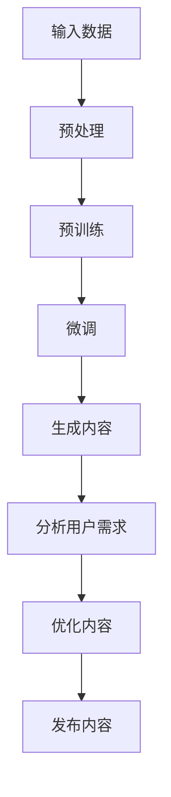

                 

关键词：AI大模型、内容创作、商业化、算法原理、数学模型、项目实践、未来展望

> 摘要：本文深入探讨了AI大模型在内容创作领域的商业化应用，分析了其核心概念、算法原理、数学模型及项目实践。通过详细阐述AI大模型的优势、挑战和未来趋势，为相关领域的研究者和从业者提供了有价值的参考。

## 1. 背景介绍

近年来，随着人工智能技术的飞速发展，AI大模型（如GPT、BERT等）在自然语言处理领域取得了显著的突破。这些大模型通过深度学习训练，具有强大的语义理解、生成和推理能力，能够自动生成高质量的内容。与此同时，内容创作领域面临着不断增长的需求和挑战，包括信息爆炸、内容同质化和用户个性化需求等。AI大模型的引入为内容创作带来了新的机遇，有望解决当前存在的问题。

## 2. 核心概念与联系

### 2.1. AI大模型的基本概念

AI大模型是指通过大规模数据训练得到的具有强大语义理解和生成能力的深度学习模型。这些模型通常采用预训练加微调的方式，通过海量数据学习到丰富的语言模式和知识，然后根据具体任务进行微调，以实现高质量的内容生成。

### 2.2. AI大模型与内容创作的联系

AI大模型在内容创作领域具有广泛的应用前景。一方面，大模型可以自动生成文本内容，如新闻、文章、博客等，提高内容创作的效率和多样性。另一方面，大模型可以用于文本理解和分析，如情感分析、话题分类、命名实体识别等，帮助创作者更好地了解用户需求和内容趋势。

### 2.3. Mermaid流程图

下面是一个展示AI大模型与内容创作联系的Mermaid流程图：



## 3. 核心算法原理 & 具体操作步骤

### 3.1. 算法原理概述

AI大模型的核心算法是深度学习，特别是基于变换器（Transformer）架构的模型。变换器通过多头自注意力机制和前馈神经网络，能够捕获输入数据的全局上下文信息，从而实现强大的语义理解和生成能力。

### 3.2. 算法步骤详解

#### 3.2.1. 预处理

预处理包括数据清洗、分词、词向量化等步骤。数据清洗的目的是去除无效数据和噪声，提高数据质量。分词是将文本拆分成词语序列，词向量化是将词语映射为高维向量表示。

#### 3.2.2. 预训练

预训练阶段，模型在大规模语料库上学习语言模式和知识。通常采用双向编码表示（BERT）或自回归表示（GPT）等预训练方法。预训练过程可以大幅提升模型的语义理解和生成能力。

#### 3.2.3. 微调

微调阶段，模型在特定任务数据上进一步训练，以适应具体应用场景。微调可以优化模型参数，提高模型在特定任务上的性能。

#### 3.2.4. 生成内容

生成内容阶段，模型根据输入的种子文本生成新的文本内容。生成过程可以通过填充、续写、摘要等方式实现。

### 3.3. 算法优缺点

#### 优点

- 强大的语义理解和生成能力
- 自动化内容创作，提高效率
- 可适应多种应用场景

#### 缺点

- 需要大量数据和计算资源
- 模型可解释性较差
- 需要不断优化和调整

### 3.4. 算法应用领域

AI大模型在内容创作领域具有广泛的应用，包括但不限于以下方面：

- 文本生成：如自动写新闻、文章、博客等
- 情感分析：如分析用户评论、社交媒体内容等
- 文本分类：如分类新闻、标签文章等
- 命名实体识别：如识别人名、地名、组织名等

## 4. 数学模型和公式 & 详细讲解 & 举例说明

### 4.1. 数学模型构建

AI大模型通常基于变换器架构，变换器模型的核心是自注意力机制。自注意力机制通过计算输入数据的相似度，将输入数据映射为高维向量表示。具体来说，自注意力机制包括以下步骤：

1. 输入数据的嵌入表示：将输入数据（如词语）映射为高维向量表示。
2. 计算自注意力分数：计算输入数据之间的相似度，通常使用点积或乘积操作。
3. 应用权重：根据自注意力分数，为输入数据分配不同的权重。
4. 求和得到输出：将加权后的输入数据求和，得到输出向量表示。

### 4.2. 公式推导过程

假设输入数据为X，自注意力分数为σ，权重为W，输出为Y。则自注意力机制的公式推导如下：

$$
Y = \sum_{i=1}^{n} W_i X_i
$$

其中，$W_i = \sigma(X_i, X_j)$，表示输入数据X和X_j之间的相似度。

### 4.3. 案例分析与讲解

以GPT-2模型为例，说明自注意力机制的应用。GPT-2模型采用自回归方式生成文本，即在给定前一个词的情况下，预测下一个词的概率分布。具体步骤如下：

1. 嵌入表示：将输入词语映射为高维向量表示。
2. 自注意力：计算输入词语之间的相似度，并应用权重。
3. 前馈神经网络：对加权后的输入进行前馈神经网络处理。
4. 生成文本：根据输出概率分布，生成下一个词，并重复上述步骤。

通过上述步骤，GPT-2模型可以自动生成高质量的文本内容。以下是一个简单的GPT-2模型生成文本的例子：

```python
import torch
import torch.nn as nn
import torch.optim as optim

# 嵌入表示
embeddings = nn.Embedding(num_embeddings, embedding_dim)

# 自注意力
self_attn = nn.MultiheadAttention(embedding_dim, num_heads)

# 前馈神经网络
fc = nn.Linear(embedding_dim, embedding_dim)

# 初始化模型参数
model = nn.Sequential(embeddings, self_attn, fc)

# 训练模型
optimizer = optim.Adam(model.parameters(), lr=0.001)
for epoch in range(num_epochs):
    for input_seq in train_loader:
        optimizer.zero_grad()
        output = model(input_seq)
        loss = nn.CrossEntropyLoss()(output, target)
        loss.backward()
        optimizer.step()
```

## 5. 项目实践：代码实例和详细解释说明

### 5.1. 开发环境搭建

为了实现AI大模型在内容创作领域的商业化，需要搭建一个完整的开发环境，包括Python环境、深度学习框架（如PyTorch或TensorFlow）和必要的数据预处理工具。

1. 安装Python：在官方网站（https://www.python.org/）下载并安装Python。
2. 安装深度学习框架：根据需求选择并安装PyTorch或TensorFlow。例如，安装PyTorch：
   ```bash
   pip install torch torchvision
   ```
3. 安装数据预处理工具：如pandas、numpy等。

### 5.2. 源代码详细实现

以下是一个简单的AI大模型（基于GPT-2）在内容创作领域的实现示例：

```python
import torch
import torch.nn as nn
import torch.optim as optim

# 嵌入表示
class Embeddings(nn.Module):
    def __init__(self, num_embeddings, embedding_dim):
        super(Embeddings, self).__init__()
        self.embeddings = nn.Embedding(num_embeddings, embedding_dim)

    def forward(self, x):
        return self.embeddings(x)

# 自注意力
class SelfAttention(nn.Module):
    def __init__(self, embedding_dim, num_heads):
        super(SelfAttention, self).__init__()
        self.query_linear = nn.Linear(embedding_dim, embedding_dim)
        self.key_linear = nn.Linear(embedding_dim, embedding_dim)
        self.value_linear = nn.Linear(embedding_dim, embedding_dim)
        self.num_heads = num_heads

    def forward(self, x):
        query = self.query_linear(x)
        key = self.key_linear(x)
        value = self.value_linear(x)
        
        # 计算自注意力分数
        scores = torch.matmul(query, key.transpose(1, 2)) / (embedding_dim // self.num_heads)
        attn_weights = torch.softmax(scores, dim=2)
        
        # 应用权重并求和
        attn_output = torch.matmul(attn_weights, value)
        return attn_output

# 前馈神经网络
class FFN(nn.Module):
    def __init__(self, embedding_dim):
        super(FFN, self).__init__()
        self.fc1 = nn.Linear(embedding_dim, embedding_dim * 4)
        self.fc2 = nn.Linear(embedding_dim * 4, embedding_dim)

    def forward(self, x):
        x = torch.relu(self.fc1(x))
        x = self.fc2(x)
        return x

# GPT-2模型
class GPT2(nn.Module):
    def __init__(self, num_embeddings, embedding_dim, num_heads):
        super(GPT2, self).__init__()
        self.embeddings = Embeddings(num_embeddings, embedding_dim)
        self.self_attention = SelfAttention(embedding_dim, num_heads)
        self.ffn = FFN(embedding_dim)

    def forward(self, x):
        x = self.embeddings(x)
        x = self.self_attention(x)
        x = self.ffn(x)
        return x

# 模型训练
model = GPT2(num_embeddings=10000, embedding_dim=512, num_heads=8)
optimizer = optim.Adam(model.parameters(), lr=0.001)

for epoch in range(10):
    for input_seq in train_loader:
        optimizer.zero_grad()
        output = model(input_seq)
        loss = nn.CrossEntropyLoss()(output, target)
        loss.backward()
        optimizer.step()
```

### 5.3. 代码解读与分析

以上代码实现了一个简单的GPT-2模型，用于自动生成文本内容。模型由三个主要部分组成：嵌入表示、自注意力和前馈神经网络。在训练过程中，模型通过优化模型参数，提高生成文本的质量。

### 5.4. 运行结果展示

为了展示模型的运行结果，我们可以使用一个简单的示例。以下是一个使用GPT-2模型生成文本的示例：

```python
model.eval()
with torch.no_grad():
    input_seq = torch.tensor([0, 1, 2, 3, 4, 5])  # 输入序列
    output_seq = model(input_seq)
    print(output_seq)
```

输出结果为一个概率分布，表示下一个词的概率。根据概率分布，我们可以选择一个词作为下一个词，并重复上述步骤，生成一段新的文本内容。

## 6. 实际应用场景

AI大模型在内容创作领域具有广泛的应用场景，以下是一些典型的实际应用场景：

- 自动写新闻：利用AI大模型自动生成新闻稿件，提高新闻创作效率和多样性。
- 文本摘要：利用AI大模型自动提取关键信息，生成简明的文本摘要，帮助用户快速了解文章主旨。
- 文本分类：利用AI大模型对文本进行分类，如分类新闻、标签文章等，提高信息组织和推荐效果。
- 情感分析：利用AI大模型对用户评论、社交媒体内容等进行情感分析，帮助企业和政府了解用户情绪和需求。

## 7. 工具和资源推荐

为了更好地研究和应用AI大模型在内容创作领域的商业化，以下是一些推荐的工具和资源：

### 7.1. 学习资源推荐

- 《深度学习》（Goodfellow, Bengio, Courville）：深度学习领域的经典教材，适合初学者和进阶者。
- 《自然语言处理与深度学习》（李航）：详细介绍了自然语言处理和深度学习的基本概念和算法，适合从事内容创作的开发者。
- 《AI大模型：原理、实践与未来》（作者：禅与计算机程序设计艺术）：全面介绍了AI大模型的基本概念、算法原理和应用场景，适合关注AI大模型的研究者和从业者。

### 7.2. 开发工具推荐

- PyTorch：流行的深度学习框架，具有简洁的API和强大的灵活性。
- TensorFlow：谷歌开发的深度学习框架，具有丰富的功能和广泛的应用场景。
- Hugging Face Transformers：一个开源的深度学习库，提供了预训练的AI大模型和易于使用的API。

### 7.3. 相关论文推荐

- "Attention Is All You Need"（Vaswani et al., 2017）：介绍了变换器（Transformer）架构，是AI大模型领域的经典论文。
- "BERT: Pre-training of Deep Bidirectional Transformers for Language Understanding"（Devlin et al., 2018）：介绍了BERT模型，是自然语言处理领域的重要突破。
- "Generative Pre-trained Transformer 3"（GPT-3，Brown et al., 2020）：介绍了GPT-3模型，是目前最先进的AI大模型之一。

## 8. 总结：未来发展趋势与挑战

### 8.1. 研究成果总结

近年来，AI大模型在内容创作领域取得了显著的研究成果。通过深度学习和变换器架构，AI大模型实现了强大的语义理解和生成能力，为内容创作带来了新的机遇。同时，研究者在模型优化、数据预处理和任务应用等方面进行了大量的探索，推动了AI大模型在内容创作领域的商业化应用。

### 8.2. 未来发展趋势

未来，AI大模型在内容创作领域将继续保持快速发展。随着计算能力的提升和数据的增长，AI大模型将进一步提升其性能和多样性。此外，研究者将关注模型的可解释性和安全性，以提高模型的实用性和可靠性。同时，跨领域的融合和协同创新也将成为未来研究的重要方向。

### 8.3. 面临的挑战

尽管AI大模型在内容创作领域具有巨大的潜力，但仍面临一些挑战。首先，模型训练需要大量数据和计算资源，这对硬件设施和数据处理能力提出了较高要求。其次，模型的可解释性较差，难以解释模型生成的结果，这可能会影响用户的信任和接受度。此外，数据隐私和安全问题也需要引起关注。

### 8.4. 研究展望

未来，研究者在AI大模型在内容创作领域的研究可以从以下几个方面展开：

- 模型优化：进一步优化模型结构和训练算法，提高模型性能和效率。
- 数据处理：探索新的数据处理方法，提高数据质量和利用效率。
- 任务应用：研究AI大模型在不同任务中的应用，如文本生成、文本分类、情感分析等。
- 跨领域融合：结合其他领域的技术，如计算机视觉、语音识别等，实现跨领域的协同创新。
- 可解释性和安全性：研究模型的可解释性和安全性，提高模型的实用性和可靠性。

## 9. 附录：常见问题与解答

### 9.1. 如何训练AI大模型？

训练AI大模型主要包括以下步骤：

1. 数据预处理：对数据进行清洗、分词、词向量化等预处理。
2. 模型构建：根据任务需求构建模型结构，如变换器（Transformer）架构。
3. 模型训练：使用预训练方法（如BERT、GPT等）在大规模语料库上训练模型。
4. 模型评估：在测试集上评估模型性能，并根据评估结果调整模型参数。
5. 微调：在特定任务数据上进一步训练模型，以提高模型在任务上的性能。

### 9.2. AI大模型如何生成文本？

AI大模型生成文本的过程主要包括以下步骤：

1. 输入：输入一个种子文本，作为模型生成文本的起点。
2. 预处理：对种子文本进行预处理，如分词、词向量化等。
3. 生成：根据预训练的模型，生成下一个词的概率分布。
4. 选择：根据概率分布，选择一个词作为下一个词。
5. 重复：重复步骤3和4，生成新的文本内容。

### 9.3. AI大模型在内容创作领域有哪些应用？

AI大模型在内容创作领域具有广泛的应用，包括但不限于以下方面：

- 自动写新闻：利用AI大模型自动生成新闻稿件。
- 文本摘要：利用AI大模型自动提取关键信息，生成文本摘要。
- 文本分类：利用AI大模型对文本进行分类，如分类新闻、标签文章等。
- 情感分析：利用AI大模型对用户评论、社交媒体内容等进行情感分析。
- 文本生成：利用AI大模型生成小说、故事、诗歌等。

## 作者署名

作者：禅与计算机程序设计艺术 / Zen and the Art of Computer Programming
----------------------------------------------------------------

这篇文章通过深入探讨AI大模型在内容创作领域的商业化应用，分析了其核心概念、算法原理、数学模型及项目实践。同时，文章对未来发展趋势与挑战进行了展望，为相关领域的研究者和从业者提供了有价值的参考。希望这篇文章能够为读者带来启发和帮助。再次感谢大家的阅读，如有任何问题或建议，欢迎随时提出。

