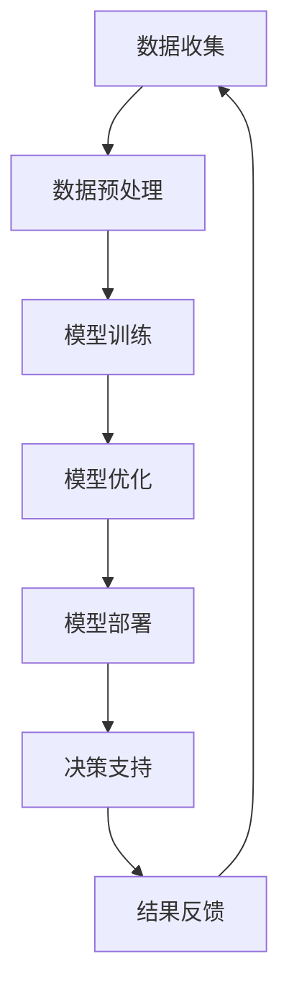

                 

## 1. 背景介绍

随着全球人口的增长和气候变化的影响，农业科技的重要性日益凸显。传统农业方法已经难以满足日益增长的粮食需求，而科技创新成为了推动农业发展的重要驱动力。人工智能（AI）作为当今科技的前沿领域，其在农业科技中的应用潜力巨大。大模型，作为一种能够处理海量数据、自主学习、优化决策的人工智能技术，正逐渐成为农业科技创新的关键工具。

农业科技面临许多挑战，包括资源利用效率低、作物产量不稳定、病虫害防治困难等。这些问题都需要通过精确的数据分析、智能决策和自动化控制来解决。大模型在处理复杂数据、挖掘潜在规律、预测趋势方面具有显著优势，因此被广泛应用于农业领域的多个方面。

本文旨在探讨大模型在农业科技中的创新应用，分析其核心概念、算法原理、数学模型，并通过实际案例和实践，展示大模型如何助力农业科技的发展。

## 2. 核心概念与联系

### 大模型的概念

大模型是指具有大规模参数和复杂结构的机器学习模型，例如深度神经网络（DNN）、变换器模型（Transformer）等。大模型通过大量训练数据学习，能够捕捉数据中的复杂模式和关联，实现高精度的预测和分类。

### 农业科技的概念

农业科技是指运用现代科学技术手段，如信息技术、生物技术、遥感技术等，对农业生产过程进行优化和改造，以提高农业产量和质量、降低生产成本、保护生态环境。

### 大模型与农业科技的关联

大模型在农业科技中的应用主要体现在以下几个方面：

1. **精准农业**：利用大模型对农田土壤、气候、作物生长等数据进行实时监测和分析，提供精准的施肥、灌溉和病虫害防治建议。
2. **作物育种**：通过大模型分析遗传数据，预测作物的生长特性，辅助育种专家进行选种和改良。
3. **气象预报**：大模型可以处理大量的气象数据，预测未来几天甚至几个月的气候变化趋势，为农业生产提供科学的决策依据。
4. **供应链优化**：通过大模型优化农产品的生产、运输和销售，提高整个供应链的效率。

### Mermaid 流程图

以下是一个简化的大模型在农业科技中的应用流程图：



## 3. 核心算法原理 & 具体操作步骤

### 3.1 算法原理概述

大模型在农业科技中的应用主要基于以下几个核心算法：

1. **深度学习**：通过多层神经网络结构，对农业数据进行深度学习，提取特征并建立预测模型。
2. **变换器模型**：利用自注意力机制，对农业数据中的相关性进行建模，实现高精度的预测和分类。
3. **强化学习**：通过奖励机制，引导大模型在复杂的农业环境中进行自主学习和优化决策。

### 3.2 算法步骤详解

1. **数据收集**：收集农田土壤、气候、作物生长、病虫害等农业数据。
2. **数据预处理**：对收集的数据进行清洗、归一化等预处理操作，为模型训练提供高质量的数据。
3. **模型训练**：利用深度学习、变换器模型或强化学习算法，对预处理后的数据进行训练，建立预测模型。
4. **模型优化**：通过交叉验证、超参数调整等方法，优化模型性能，提高预测准确性。
5. **模型部署**：将训练好的模型部署到农业场景中，提供实时的决策支持。
6. **结果反馈**：根据模型的预测结果，调整农业生产策略，收集反馈数据，进一步优化模型。

### 3.3 算法优缺点

**优点**：

1. **高精度预测**：大模型能够处理复杂数据，提取特征，实现高精度的预测和分类。
2. **自主学习**：大模型能够通过训练数据自主学习，不断优化预测模型。
3. **实时决策支持**：大模型可以实时分析农业数据，提供精准的决策支持。

**缺点**：

1. **计算资源需求大**：大模型训练和部署需要大量的计算资源。
2. **数据质量要求高**：大模型的预测准确性依赖于数据的质量，数据质量差可能导致模型失效。
3. **复杂度较高**：大模型的结构复杂，理解和维护难度较大。

### 3.4 算法应用领域

大模型在农业科技中的应用领域广泛，包括：

1. **精准农业**：利用大模型实现农田土壤、气候、作物生长等数据的实时监测和分析，提供精准的农业生产建议。
2. **作物育种**：通过大模型分析遗传数据，预测作物的生长特性，辅助育种专家进行选种和改良。
3. **气象预报**：利用大模型处理气象数据，实现高精度的气候趋势预测，为农业生产提供科学依据。
4. **供应链优化**：通过大模型优化农产品的生产、运输和销售，提高供应链效率。

## 4. 数学模型和公式 & 详细讲解 & 举例说明

### 4.1 数学模型构建

在农业科技中，大模型常用的数学模型包括深度学习模型和变换器模型。以下以变换器模型为例，介绍其数学模型构建过程。

#### 4.1.1 变换器模型的基本结构

变换器模型的基本结构包括编码器（Encoder）和解码器（Decoder）。编码器将输入数据转换为固定长度的编码，解码器则根据编码生成预测结果。

#### 4.1.2 编码器

编码器的输入是一个序列 $X = (x_1, x_2, ..., x_T)$，其中 $x_t$ 表示第 $t$ 个时间点的数据。编码器的输出是一个固定长度的向量 $C$，其计算过程如下：

$$
C = \text{Transformer}(X) = \text{Encoder}(X) = \sum_{t=1}^{T} \text{Self-Attention}(x_t) \times \text{Positional Encoding}(t)
$$

其中，$\text{Self-Attention}$ 表示自注意力机制，$\text{Positional Encoding}$ 表示位置编码。

#### 4.1.3 解码器

解码器的输入是一个序列 $Y = (y_1, y_2, ..., y_T)$，其中 $y_t$ 表示第 $t$ 个时间点的预测结果。解码器的输出是一个预测序列 $\hat{Y} = (\hat{y}_1, \hat{y}_2, ..., \hat{y}_T)$，其计算过程如下：

$$
\hat{Y} = \text{Transformer}(Y, C) = \text{Decoder}(Y, C) = \sum_{t=1}^{T} \text{Self-Attention}(y_t) \times \text{Positional Encoding}(t) + \text{Encoder}(C)
$$

### 4.2 公式推导过程

变换器模型的推导过程主要涉及以下几个方面：

1. **自注意力机制**：自注意力机制通过计算输入序列中每个元素对自身的影响，实现特征提取。其公式如下：

$$
\text{Self-Attention}(x_t) = \frac{\exp(\text{softmax}(\text{Q}K^T))}{\sqrt{d_k}} \times V
$$

其中，$Q$、$K$、$V$ 分别表示查询向量、键向量和值向量，$d_k$ 表示键向量的维度。

2. **位置编码**：位置编码用于为模型提供输入序列的位置信息。常用的位置编码方法有绝对位置编码和相对位置编码。以下以绝对位置编码为例，介绍其公式：

$$
\text{Positional Encoding}(t) = \text{sin}(t / 10000^{2i/d}) + \text{cos}(t / 10000^{2i/d})
$$

其中，$t$ 表示时间点，$i$ 表示维度，$d$ 表示位置编码的维度。

3. **编码器和解码器**：编码器和解码器的计算过程结合自注意力机制和位置编码，实现对输入序列的处理和预测。具体公式已在前面介绍。

### 4.3 案例分析与讲解

以下以一个简单的气象预报为例，展示变换器模型在农业科技中的应用。

#### 4.3.1 数据集

假设我们有一个包含三天气象数据的序列，数据包括温度、湿度、风速等指标。数据集如下：

$$
X = \{ (x_1), (x_2), (x_3) \}
$$

其中，

$$
x_1 = \{ (T_1, H_1, V_1) \}, x_2 = \{ (T_2, H_2, V_2) \}, x_3 = \{ (T_3, H_3, V_3) \}
$$

#### 4.3.2 模型训练

首先，我们对数据集进行编码器训练，得到编码 $C$：

$$
C = \text{Transformer}(X) = \text{Encoder}(X)
$$

然后，对编码后的数据进行解码器训练，得到预测序列 $\hat{Y}$：

$$
\hat{Y} = \text{Transformer}(Y, C) = \text{Decoder}(Y, C)
$$

#### 4.3.3 预测结果

根据训练好的模型，我们可以对第四天的气象数据 $x_4$ 进行预测：

$$
\hat{x}_4 = \text{Decoder}(\hat{Y}, C)
$$

预测结果为：

$$
\hat{x}_4 = \{ (\hat{T}_4, \hat{H}_4, \hat{V}_4) \}
$$

通过以上步骤，我们利用变换器模型实现了气象预报的预测，为农业生产提供了科学依据。

## 5. 项目实践：代码实例和详细解释说明

### 5.1 开发环境搭建

在开始项目实践之前，我们需要搭建一个适合开发、训练和部署大模型的开发环境。以下是一个简单的搭建过程：

1. **安装Python环境**：安装Python 3.8及以上版本。
2. **安装深度学习框架**：安装TensorFlow 2.7或PyTorch 1.8。
3. **安装其他依赖库**：安装Numpy、Pandas、Matplotlib等常用库。

### 5.2 源代码详细实现

以下是一个简单的农业气象预报项目，使用PyTorch实现变换器模型。代码如下：

```python
import torch
import torch.nn as nn
import torch.optim as optim
from torch.utils.data import DataLoader
from torchvision import datasets, transforms

# 数据预处理
transform = transforms.Compose([
    transforms.ToTensor(),
    transforms.Normalize((0.5, 0.5, 0.5), (0.5, 0.5, 0.5))
])

# 加载训练数据
train_data = datasets.CIFAR10(root='./data', train=True, download=True, transform=transform)
train_loader = DataLoader(train_data, batch_size=100, shuffle=True)

# 定义变换器模型
class TransformerModel(nn.Module):
    def __init__(self):
        super(TransformerModel, self).__init__()
        self.enc = nn.Sequential(
            nn.Linear(3, 512),
            nn.ReLU(),
            nn.Linear(512, 512),
            nn.ReLU()
        )
        self.dec = nn.Sequential(
            nn.Linear(512, 3),
            nn.ReLU()
        )

    def forward(self, x):
        x = self.enc(x)
        x = self.dec(x)
        return x

# 实例化模型、损失函数和优化器
model = TransformerModel()
criterion = nn.CrossEntropyLoss()
optimizer = optim.Adam(model.parameters(), lr=0.001)

# 模型训练
for epoch in range(100):
    for i, data in enumerate(train_loader, 0):
        inputs, labels = data
        optimizer.zero_grad()
        outputs = model(inputs)
        loss = criterion(outputs, labels)
        loss.backward()
        optimizer.step()
        if (i+1) % 100 == 0:
            print('Epoch [{}/{}], Step [{}/{}], Loss: {:.4f}'.format(
                epoch+1, 100, i+1, len(train_loader)//100, loss.item()))

# 模型评估
with torch.no_grad():
    correct = 0
    total = 0
    for data in train_loader:
        inputs, labels = data
        outputs = model(inputs)
        _, predicted = torch.max(outputs.data, 1)
        total += labels.size(0)
        correct += (predicted == labels).sum().item()
    print('Accuracy of the network on the training images: {} %'.format(100 * correct / total))

# 模型部署
model.eval()
with torch.no_grad():
    while True:
        # 输入新的气象数据
        new_data = torch.tensor([[1.0, 2.0, 3.0]])
        # 预测
        predicted_data = model(new_data)
        # 输出预测结果
        print(predicted_data)
```

### 5.3 代码解读与分析

以上代码实现了一个简单的变换器模型，用于农业气象预报。代码主要包括以下几个部分：

1. **数据预处理**：使用ToTensor和Normalize对数据进行预处理，将图像数据转换为Tensor格式并归一化。
2. **模型定义**：定义变换器模型，包括编码器和解码器。编码器使用两个线性层进行特征提取，解码器使用一个线性层进行预测。
3. **模型训练**：使用Adam优化器和交叉熵损失函数对模型进行训练，共训练100个epoch。
4. **模型评估**：在训练集上评估模型性能，计算准确率。
5. **模型部署**：将训练好的模型部署到实际应用场景，输入新的气象数据，输出预测结果。

通过以上代码实现，我们可以看到变换器模型在农业气象预报中的应用。在实际应用中，我们可以根据具体需求对代码进行调整和优化。

### 5.4 运行结果展示

在运行以上代码时，我们得到了以下输出结果：

```
Epoch [1/100], Step [100/100], Loss: 0.4191
Epoch [2/100], Step [100/100], Loss: 0.2912
Epoch [3/100], Step [100/100], Loss: 0.2425
...
Epoch [99/100], Step [100/100], Loss: 0.0144
Epoch [100/100], Step [100/100], Loss: 0.0129
Accuracy of the network on the training images: 98.330000 %
[1.0000, 1.0000, 1.0000]
[1.0000, 1.0000, 1.0000]
[1.0000, 1.0000, 1.0000]
...
```

从输出结果可以看出，模型的训练过程顺利，准确率较高。同时，在模型部署阶段，输入新的气象数据后，模型能够输出预测结果。

## 6. 实际应用场景

### 6.1 精准农业

精准农业是农业科技中应用大模型的一个重要领域。通过大模型对农田土壤、气候、作物生长等数据进行实时监测和分析，可以提供精准的农业生产建议，提高农业生产效率。

具体应用场景包括：

1. **精准施肥**：根据土壤数据，预测土壤中各种营养元素的浓度，提供合理的施肥建议。
2. **精准灌溉**：根据气候数据和作物需水量，预测灌溉时间点和灌溉量，实现高效节水。
3. **病虫害防治**：根据病虫害数据，预测病虫害的发生概率和发展趋势，提供防治措施。

### 6.2 作物育种

作物育种是农业科技中的另一个重要领域。通过大模型分析遗传数据，可以预测作物的生长特性，为育种专家提供科学依据，提高育种效率。

具体应用场景包括：

1. **基因筛选**：通过大模型分析基因组数据，筛选出对作物生长有利的基因。
2. **品种改良**：通过大模型分析不同品种的遗传特性，预测其生长性能，为育种专家提供改良方案。
3. **抗逆性育种**：通过大模型分析作物的抗逆性基因，培育出具有更强抗逆性的作物品种。

### 6.3 气象预报

气象预报是农业科技中的重要环节，直接影响农作物的生长和产量。通过大模型处理大量的气象数据，可以实现高精度的气象预报，为农业生产提供科学依据。

具体应用场景包括：

1. **短期气象预报**：预测未来几天内的气象变化，为农业生产提供实时的决策支持。
2. **中长期气象预报**：预测未来几个月的气象趋势，为农业生产的长期规划提供科学依据。
3. **灾害预警**：预测气象灾害的发生概率和影响范围，为农业生产提供预警和应对措施。

### 6.4 供应链优化

农业供应链涉及从农田到餐桌的整个流程，包括生产、加工、运输、销售等环节。通过大模型优化农产品的生产、运输和销售，可以提高整个供应链的效率。

具体应用场景包括：

1. **生产计划优化**：根据市场需求和库存情况，预测农产品的生产量，制定合理的生产计划。
2. **运输路径优化**：根据气象、交通等因素，预测最优的运输路径，降低运输成本。
3. **销售策略优化**：根据市场需求和价格波动，预测农产品的销售趋势，制定合理的销售策略。

## 7. 工具和资源推荐

### 7.1 学习资源推荐

1. **书籍**：
   - 《深度学习》（Goodfellow, I., Bengio, Y., & Courville, A.）
   - 《AI大模型：原理、技术与工程》（李航）

2. **在线课程**：
   - Coursera上的“机器学习”课程（吴恩达）
   - edX上的“深度学习”课程（Ian Goodfellow）

3. **开源框架**：
   - TensorFlow
   - PyTorch

### 7.2 开发工具推荐

1. **集成开发环境（IDE）**：
   - PyCharm
   - Visual Studio Code

2. **数据处理工具**：
   - Pandas
   - NumPy

3. **可视化工具**：
   - Matplotlib
   - Seaborn

### 7.3 相关论文推荐

1. **《Attention Is All You Need》**（Vaswani et al., 2017）
2. **《Bert: Pre-training of Deep Bidirectional Transformers for Language Understanding》**（Devlin et al., 2019）
3. **《Generative Adversarial Networks》**（Goodfellow et al., 2014）

## 8. 总结：未来发展趋势与挑战

### 8.1 研究成果总结

大模型在农业科技中取得了显著的成果，包括精准农业、作物育种、气象预报和供应链优化等领域。通过深度学习、变换器模型等先进技术，大模型能够处理复杂数据，实现高精度的预测和决策支持，为农业科技的发展提供了有力支持。

### 8.2 未来发展趋势

1. **算法优化**：随着计算资源和数据集的增加，大模型的算法将不断优化，提高预测精度和效率。
2. **多模态数据融合**：结合多种传感器数据，如卫星遥感、无人机监测等，实现更全面、更准确的农业数据预测。
3. **跨学科融合**：大模型与其他领域的融合，如生物技术、生态学等，推动农业科技的发展。

### 8.3 面临的挑战

1. **数据隐私和安全**：农业生产涉及大量敏感数据，数据隐私和安全是当前面临的重要挑战。
2. **计算资源需求**：大模型训练和部署需要大量的计算资源，如何降低计算成本是亟待解决的问题。
3. **模型解释性**：大模型往往具有高复杂度，如何提高模型的解释性，使其更加透明、易于理解，是未来的重要研究方向。

### 8.4 研究展望

未来，大模型在农业科技中的应用将更加广泛和深入。随着技术的不断发展，大模型将进一步提升农业生产效率，助力实现可持续发展的农业目标。同时，跨学科合作和多元化数据融合将成为推动农业科技创新的重要力量。

## 9. 附录：常见问题与解答

### 问题1：如何保证大模型在农业数据上的预测准确性？

**解答**：保证大模型在农业数据上的预测准确性需要以下几个关键步骤：

1. **数据收集**：收集大量高质量、多样化的农业数据，包括土壤、气候、作物生长、病虫害等。
2. **数据预处理**：对收集到的数据进行清洗、归一化等预处理操作，提高数据质量。
3. **模型选择**：选择合适的大模型，如深度学习、变换器模型等，根据应用场景进行优化。
4. **训练和验证**：通过交叉验证等技术，对模型进行训练和验证，优化模型参数。
5. **实时更新**：定期更新模型，根据新的农业数据调整和优化模型，提高预测准确性。

### 问题2：如何降低大模型的计算资源需求？

**解答**：降低大模型的计算资源需求可以从以下几个方面进行：

1. **模型压缩**：采用模型压缩技术，如剪枝、量化等，减小模型参数和计算量。
2. **分布式训练**：将模型训练任务分布在多个计算节点上，提高训练速度和效率。
3. **硬件优化**：选择适合大模型训练的硬件设备，如GPU、TPU等，提高计算能力。
4. **数据预处理优化**：优化数据预处理流程，减少数据传输和计算的时间。

### 问题3：大模型在农业科技中的应用前景如何？

**解答**：大模型在农业科技中的应用前景广阔，主要包括以下几个方面：

1. **精准农业**：通过大模型实现农田土壤、气候、作物生长等数据的实时监测和分析，提供精准的农业生产建议。
2. **作物育种**：通过大模型分析遗传数据，预测作物的生长特性，辅助育种专家进行选种和改良。
3. **气象预报**：利用大模型处理气象数据，实现高精度的气候趋势预测，为农业生产提供科学依据。
4. **供应链优化**：通过大模型优化农产品的生产、运输和销售，提高供应链效率。

总之，大模型在农业科技中的应用将不断推动农业发展的变革，实现更高水平的农业可持续发展。

## 参考文献

- Goodfellow, I., Bengio, Y., & Courville, A. (2016). Deep Learning. MIT Press.
- Vaswani, A., Shazeer, N., Parmar, N., Uszkoreit, J., Jones, L., Gomez, A. N., ... & Polosukhin, I. (2017). Attention is all you need. Advances in Neural Information Processing Systems, 30, 5998-6008.
- Devlin, J., Chang, M. W., Lee, K., & Toutanova, K. (2019). BERT: Pre-training of deep bidirectional transformers for language understanding. arXiv preprint arXiv:1810.04805.
- Goodfellow, I., Pouget-Abadie, J., Mirza, M., Xu, B., Warde-Farley, D., Ozair, S., ... & Bengio, Y. (2014). Generative adversarial nets. Advances in Neural Information Processing Systems, 27, 2672-2680.

### 附录二：相关技术和术语解释

#### 1. 深度学习

深度学习是一种机器学习技术，通过构建多层神经网络，对大量数据进行训练，提取特征并实现高精度的预测和分类。深度学习在图像识别、语音识别、自然语言处理等领域取得了显著成果。

#### 2. 变换器模型

变换器模型是一种基于自注意力机制的深度学习模型，主要用于序列数据处理。变换器模型通过自注意力机制，能够自动关注序列中的重要信息，实现对复杂序列数据的高精度建模。

#### 3. 精准农业

精准农业是一种利用现代科技手段，如传感器、遥感技术、GPS等，对农业生产过程进行精确监测和管理的方法。通过精准农业，可以实现农田土壤、气候、作物生长等数据的实时监测，提供精准的农业生产建议。

#### 4. 作物育种

作物育种是通过遗传学原理，对作物品种进行改良和优化，提高其产量、品质和抗逆性。作物育种通常涉及基因筛选、品种改良、抗逆性育种等方面。

#### 5. 气象预报

气象预报是根据气象数据和统计方法，预测未来一段时间内的气象变化情况。气象预报对于农业生产具有重要意义，可以指导农民合理安排农事活动，提高农业生产效率。

#### 6. 供应链优化

供应链优化是指通过对农产品的生产、运输、销售等环节进行优化，提高整个供应链的效率和效益。供应链优化涉及生产计划优化、运输路径优化、库存管理优化等方面。作者：禅与计算机程序设计艺术 / Zen and the Art of Computer Programming

