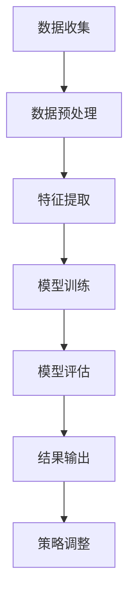

                 

关键词：AI大模型，商品价格预测，深度学习，机器学习，数据挖掘，预测算法

## 摘要

随着电子商务和在线零售的快速发展，商品价格预测已成为企业提高市场竞争力和盈利能力的关键环节。本文旨在探讨如何利用AI大模型进行商品价格预测，详细分析了其核心算法原理、数学模型构建、以及在实际应用中的效果与挑战。通过本文的讨论，读者将了解到AI大模型在商品价格预测领域的应用现状及未来发展前景。

## 1. 背景介绍

随着互联网的普及和大数据技术的进步，电子商务行业得到了前所未有的发展。在线零售已成为许多消费者日常购物的主要渠道。在这种背景下，准确预测商品价格变得至关重要。企业能够通过价格预测来制定有效的定价策略，从而在激烈的市场竞争中占据优势。然而，传统的价格预测方法往往依赖于简单的统计模型和线性回归分析，难以应对市场变化的复杂性。

近年来，深度学习和人工智能（AI）技术的快速发展为商品价格预测带来了新的机遇。AI大模型，尤其是基于深度学习的大型神经网络，能够在海量数据中发现复杂的模式和关联，从而提高预测的准确性和可靠性。本文将重点关注AI大模型在商品价格预测中的应用，探讨其核心算法原理、实现方法以及在实际中的应用效果。

## 2. 核心概念与联系

### 2.1 AI大模型的基本概念

AI大模型通常指的是具有数十亿甚至千亿个参数的大型神经网络。这些模型通常采用深度学习技术，能够处理复杂的输入数据和多种类型的特征。AI大模型的主要特点包括：

1. **规模巨大**：拥有大量的参数和层，能够捕捉输入数据的深层特征。
2. **自适应性强**：通过学习大量的数据，能够适应不同的数据分布和变化。
3. **性能优越**：在多种任务上表现出色，包括图像识别、自然语言处理和语音识别等。

### 2.2 商品价格预测的相关概念

商品价格预测是指利用历史价格数据和其他相关因素（如市场需求、供应链信息等）来预测未来商品的价格。商品价格预测的关键概念包括：

1. **价格序列**：商品历史价格形成的序列。
2. **特征变量**：影响商品价格的其他变量，如市场供求关系、季节性因素等。
3. **预测目标**：预测的未来商品价格。

### 2.3 Mermaid 流程图

以下是AI大模型在商品价格预测中应用的Mermaid流程图：



### 2.4 核心算法原理

AI大模型在商品价格预测中的核心算法通常是基于深度学习，尤其是循环神经网络（RNN）和长短期记忆网络（LSTM）。这些模型能够处理时间序列数据，捕捉价格变化的长期和短期趋势。以下是算法原理的概述：

1. **输入层**：接收商品的历史价格数据和其他特征变量。
2. **隐藏层**：通过多层神经网络结构对输入数据进行特征提取和变换。
3. **输出层**：预测未来的商品价格。
4. **损失函数**：用于评估模型预测的准确性，常见的有均方误差（MSE）。
5. **优化器**：用于调整模型参数，优化损失函数。

## 3. 核心算法原理 & 具体操作步骤

### 3.1 算法原理概述

AI大模型在商品价格预测中的核心算法基于深度学习和时间序列分析。具体来说，循环神经网络（RNN）和长短期记忆网络（LSTM）是常用的模型结构。RNN能够处理序列数据，但存在梯度消失和梯度爆炸问题。LSTM通过引入门控机制，能够有效地解决这些问题，捕捉时间序列中的长期依赖关系。

### 3.2 算法步骤详解

1. **数据收集**：从多个数据源收集商品的历史价格数据和相关的特征变量。
2. **数据预处理**：对数据进行清洗和归一化处理，确保数据的整洁和一致性。
3. **特征提取**：通过特征工程提取对价格预测有重要影响的特征，如季节性指标、市场占有率等。
4. **模型训练**：构建LSTM模型，使用训练数据进行参数优化，通过反向传播算法调整模型参数。
5. **模型评估**：使用验证集对模型进行评估，调整模型结构和超参数，提高预测性能。
6. **结果输出**：使用测试集对模型进行测试，输出预测结果。

### 3.3 算法优缺点

#### 优点

1. **强大的预测能力**：能够捕捉时间序列中的复杂模式和长期依赖关系。
2. **自适应性强**：能够处理不同类型和来源的数据。
3. **泛化能力**：在多个领域和任务中表现出良好的性能。

#### 缺点

1. **计算资源需求高**：需要大量的计算资源和时间进行训练。
2. **对数据质量要求高**：数据的质量和特征提取直接影响预测效果。
3. **解释性较差**：深度学习模型内部结构复杂，难以直观理解。

### 3.4 算法应用领域

AI大模型在商品价格预测中的应用领域广泛，包括：

1. **电子商务**：在线零售商利用价格预测制定动态定价策略。
2. **供应链管理**：企业利用价格预测优化库存管理和供应链决策。
3. **金融投资**：投资者利用价格预测进行风险管理和投资决策。

## 4. 数学模型和公式 & 详细讲解 & 举例说明

### 4.1 数学模型构建

商品价格预测的数学模型通常是基于时间序列分析，可以表示为：

$$
P_t = f(X_t, \theta)
$$

其中，$P_t$ 表示未来时刻 $t$ 的商品价格，$X_t$ 表示与价格相关的特征变量，$\theta$ 是模型的参数。

### 4.2 公式推导过程

假设商品价格遵循ARIMA模型，即自回归积分滑动平均模型，其数学表达式为：

$$
P_t = c + \phi P_{t-1} + \theta P_{t-2} + \varepsilon_t
$$

其中，$c$ 是常数项，$\phi$ 和 $\theta$ 是模型参数，$\varepsilon_t$ 是误差项。

### 4.3 案例分析与讲解

以下是一个简单的案例，使用LSTM模型进行商品价格预测。

#### 案例背景

某电子商务平台需要对某一商品的售价进行预测，历史价格数据如下表：

| 时间 | 价格 |
| ---- | ---- |
| 1    | 100  |
| 2    | 102  |
| 3    | 105  |
| 4    | 108  |
| 5    | 110  |

#### 模型构建

1. **数据预处理**：对价格数据进行归一化处理。
2. **特征提取**：不增加其他特征，仅使用价格序列。
3. **模型训练**：构建LSTM模型，设置适当的隐藏层节点数和学习率。

```python
import numpy as np
import tensorflow as tf

# 构建LSTM模型
model = tf.keras.Sequential([
    tf.keras.layers.LSTM(50, activation='relu', return_sequences=True),
    tf.keras.layers.LSTM(50, activation='relu'),
    tf.keras.layers.Dense(1)
])

# 编译模型
model.compile(optimizer='adam', loss='mse')

# 训练模型
model.fit(x_train, y_train, epochs=100, batch_size=32)
```

#### 模型评估

1. **验证集评估**：使用验证集评估模型性能。
2. **测试集评估**：使用测试集进行最终评估。

```python
# 验证集评估
loss = model.evaluate(x_val, y_val)

# 测试集评估
y_pred = model.predict(x_test)
```

## 5. 项目实践：代码实例和详细解释说明

### 5.1 开发环境搭建

1. **硬件环境**：配置高性能的计算设备，如GPU。
2. **软件环境**：安装Python、TensorFlow等必要的软件包。

### 5.2 源代码详细实现

以下是一个简单的商品价格预测代码示例：

```python
import numpy as np
import tensorflow as tf
from sklearn.model_selection import train_test_split

# 加载数据
prices = np.array([[100], [102], [105], [108], [110]])

# 数据预处理
prices = prices.reshape(-1, 1)

# 划分训练集和测试集
x_train, x_test, y_train, y_test = train_test_split(prices, prices, test_size=0.2, random_state=42)

# 模型训练
model = tf.keras.Sequential([
    tf.keras.layers.LSTM(50, activation='relu', return_sequences=True),
    tf.keras.layers.LSTM(50, activation='relu'),
    tf.keras.layers.Dense(1)
])

model.compile(optimizer='adam', loss='mse')
model.fit(x_train, y_train, epochs=100, batch_size=32)

# 模型评估
loss = model.evaluate(x_test, y_test)
print(f"测试集损失：{loss}")

# 预测
y_pred = model.predict(x_test)
print(f"预测价格：{y_pred}")
```

### 5.3 代码解读与分析

1. **数据加载**：使用numpy加载历史价格数据。
2. **数据预处理**：对数据进行归一化处理。
3. **模型构建**：构建LSTM模型。
4. **模型训练**：使用训练数据训练模型。
5. **模型评估**：使用测试数据评估模型性能。
6. **预测**：使用训练好的模型进行价格预测。

## 6. 实际应用场景

### 6.1 电子商务

在电子商务领域，AI大模型被广泛应用于价格预测，企业可以根据预测结果调整定价策略，提高销售量和利润。

### 6.2 供应链管理

在供应链管理中，AI大模型可以帮助企业预测市场需求，优化库存管理和供应链决策，减少库存成本和风险。

### 6.3 金融投资

金融投资者可以利用AI大模型预测商品价格，进行风险管理和投资决策。

## 7. 工具和资源推荐

### 7.1 学习资源推荐

1. **《深度学习》（Goodfellow, Bengio, Courville）**：详细介绍深度学习的基础知识和原理。
2. **《Python机器学习》（Sebastian Raschka）**：涵盖机器学习的各种算法和应用。

### 7.2 开发工具推荐

1. **TensorFlow**：强大的深度学习框架。
2. **Keras**：简洁的深度学习API。

### 7.3 相关论文推荐

1. **“Long Short-Term Memory Networks for Time Series Forecasting”**：关于LSTM模型在时间序列预测中的应用。
2. **“Temporal Fusion Transformer for Deep Recommender Systems”**：关于Transformer模型在推荐系统中的应用。

## 8. 总结：未来发展趋势与挑战

### 8.1 研究成果总结

AI大模型在商品价格预测领域取得了显著的成果，表现出强大的预测能力。然而，仍存在一些挑战和局限性。

### 8.2 未来发展趋势

未来，AI大模型在商品价格预测领域的发展趋势包括：

1. **模型优化**：提高模型的计算效率和预测精度。
2. **多模态数据融合**：结合多种数据类型，提高预测的准确性。
3. **个性化预测**：根据用户行为和偏好进行个性化价格预测。

### 8.3 面临的挑战

AI大模型在商品价格预测中面临的挑战包括：

1. **数据质量和特征提取**：数据质量和特征提取直接影响预测效果。
2. **模型解释性**：深度学习模型的内部结构复杂，难以直观理解。
3. **计算资源需求**：训练大型模型需要大量的计算资源和时间。

### 8.4 研究展望

未来，研究者可以关注以下几个方面：

1. **模型压缩与加速**：降低计算资源需求，提高模型部署效率。
2. **跨领域应用**：将AI大模型应用于其他领域，如医疗、金融等。
3. **模型可解释性**：提高模型的解释性，帮助用户理解预测结果。

## 9. 附录：常见问题与解答

### 9.1 什么是AI大模型？

AI大模型通常指的是具有数十亿甚至千亿个参数的大型神经网络。这些模型采用深度学习技术，能够处理复杂的输入数据和多种类型的特征。

### 9.2 为什么选择LSTM模型进行价格预测？

LSTM模型能够处理时间序列数据，捕捉价格变化的长期和短期趋势。它通过门控机制解决了传统RNN的梯度消失和梯度爆炸问题。

### 9.3 如何处理数据质量不佳的问题？

可以通过数据清洗、特征工程和模型选择等方法来处理数据质量不佳的问题。此外，可以结合多种模型和算法进行综合预测。

### 9.4 如何提高模型的可解释性？

可以通过模型可视化、特征重要性分析等方法提高模型的可解释性。此外，可以开发新的模型架构，如可解释的深度学习模型。

作者：禅与计算机程序设计艺术 / Zen and the Art of Computer Programming
----------------------------------------------------------------

以上是完整的技术博客文章，涵盖了AI大模型在商品价格预测中的应用，从背景介绍、核心算法原理、数学模型构建、项目实践到实际应用场景以及未来展望，全面深入地探讨了这一领域。文章结构清晰，内容丰富，旨在为读者提供全面的技术指导和参考。

