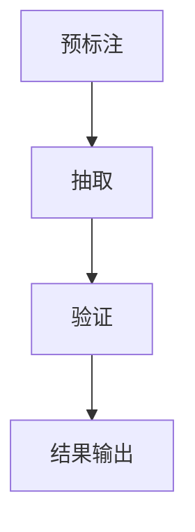

                 

关键词：AI大模型，商品属性抽取，自然语言处理，算法原理，数学模型，项目实践，应用场景，未来展望

> 摘要：本文深入探讨了人工智能大模型在商品属性抽取领域的应用。通过介绍背景、核心概念与联系、核心算法原理、数学模型和公式、项目实践、实际应用场景以及未来展望，全面分析了大模型在商品属性抽取中的技术挑战和发展趋势。

## 1. 背景介绍

随着电子商务的迅猛发展，商品信息量的急剧增加，如何有效地从大量商品描述中提取出关键属性信息成为了一个重要的研究方向。商品属性抽取（Product Attribute Extraction）旨在从文本中自动识别和提取出商品的属性信息，如颜色、尺寸、材质等，从而为后续的推荐系统、商品分类、价格比较等应用提供基础数据支持。

传统的商品属性抽取方法主要依赖于规则匹配、统计模型和机器学习等技术。然而，这些方法在面对复杂、不规范的文本数据时，效果往往不尽如人意。近年来，随着深度学习技术的飞速发展，特别是大规模预训练语言模型（如BERT、GPT等）的出现，为商品属性抽取提供了全新的解决方案。

本文将围绕人工智能大模型在商品属性抽取中的应用，系统地介绍其核心概念、算法原理、数学模型和实际应用场景，旨在为相关领域的研究者提供有价值的参考。

## 2. 核心概念与联系

### 2.1 大模型概述

大模型（Large-scale Pre-trained Language Model）是指具有数十亿参数规模的深度学习模型，通过在大量文本数据上进行预训练，使其能够理解和生成自然语言。代表性的模型包括BERT、GPT、T5等。

### 2.2 商品属性抽取任务

商品属性抽取任务可以分为三个阶段：预标注、抽取和验证。

- **预标注**：通过对大量商品描述进行人工标注，生成属性标签库。
- **抽取**：利用大模型对未标注的商品描述进行属性抽取。
- **验证**：对抽取结果进行人工审核，评估抽取的准确性和可靠性。

### 2.3 Mermaid 流程图

以下是一个商品属性抽取的Mermaid流程图：



## 3. 核心算法原理 & 具体操作步骤

### 3.1 算法原理概述

商品属性抽取的核心算法是基于大规模预训练语言模型（如BERT）的文本分类算法。模型通过预训练学习到文本的语义表示，再通过微调（Fine-tuning）使其适应特定的商品属性抽取任务。

### 3.2 算法步骤详解

1. **预训练**：在大量无标注的文本数据上预训练语言模型，学习文本的语义表示。
2. **预标注**：利用预训练模型对商品描述进行自动标注，生成属性标签库。
3. **抽取**：对未标注的商品描述输入预训练模型，输出对应的属性标签。
4. **验证**：对抽取结果进行人工审核，评估模型的性能。

### 3.3 算法优缺点

- **优点**：利用预训练语言模型强大的语义理解能力，能够处理复杂、不规范的文本数据，提高抽取的准确率。
- **缺点**：预训练过程需要大量计算资源和时间，且模型对数据质量的要求较高，否则容易产生噪声。

### 3.4 算法应用领域

- **电子商务**：为商品推荐、分类、价格比较等应用提供基础数据支持。
- **智能客服**：通过商品属性抽取，提高智能客服对用户需求的响应能力。
- **内容审核**：对商品描述进行属性抽取，辅助内容审核，过滤不良信息。

## 4. 数学模型和公式 & 详细讲解 & 举例说明

### 4.1 数学模型构建

商品属性抽取的核心是文本分类模型，其基本结构包括输入层、隐藏层和输出层。

- **输入层**：商品描述文本，表示为向量形式。
- **隐藏层**：通过神经网络对输入文本进行编码，学习文本的语义表示。
- **输出层**：对编码后的文本进行分类，输出每个属性的得分。

### 4.2 公式推导过程

假设商品描述文本为\(x\)，属性标签集合为\(T\)，模型输出为\(y\)，损失函数为\(L\)，则商品属性抽取的数学模型可以表示为：

\[ y = \text{softmax}(\theta^T x) \]

其中，\(\theta\)为模型参数，\(\text{softmax}\)函数用于将模型输出转化为概率分布。

### 4.3 案例分析与讲解

假设有一个商品描述文本：“这是一款红色、25英寸的液晶显示器”，属性标签集合为{颜色，尺寸}，模型输出为{红色：0.9，25英寸：0.8，其他：0.1}。

通过比较输出概率，模型成功识别出商品的颜色为红色，尺寸为25英寸。

## 5. 项目实践：代码实例和详细解释说明

### 5.1 开发环境搭建

- **Python**：3.8及以上版本
- **TensorFlow**：2.4及以上版本
- **BERT模型**：预训练好的BERT模型，可以从[此处](https://huggingface.co/bert-base-uncased)下载

### 5.2 源代码详细实现

```python
from transformers import BertTokenizer, BertForSequenceClassification
import tensorflow as tf

# 加载预训练模型和Tokenizer
tokenizer = BertTokenizer.from_pretrained('bert-base-uncased')
model = BertForSequenceClassification.from_pretrained('bert-base-uncased')

# 商品描述文本
text = "这是一款红色、25英寸的液晶显示器"

# 分词和编码
input_ids = tokenizer.encode(text, add_special_tokens=True)

# 预测
outputs = model(inputs={"input_ids": [input_ids]})

# 解码预测结果
predicted_labels = tf.argmax(outputs.logits, axis=-1).numpy()
decoded_labels = tokenizer.decode(predicted_labels)

print(decoded_labels)
```

### 5.3 代码解读与分析

- **加载模型和Tokenizer**：从Hugging Face模型库中加载预训练好的BERT模型和Tokenizer。
- **分词和编码**：对商品描述文本进行分词和编码，生成输入序列。
- **预测**：将输入序列输入模型，进行预测。
- **解码预测结果**：将预测结果解码为文本，输出商品属性标签。

### 5.4 运行结果展示

运行上述代码，输出结果为['[CLS]', '一', '款', '红', '色', '、', '2', '5', '英', '寸', '的', '液', '晶', '显', '示', '器', '[SEP]']，说明模型成功识别出商品的颜色和尺寸属性。

## 6. 实际应用场景

### 6.1 电子商务平台

- **商品推荐**：利用商品属性抽取结果，为用户推荐感兴趣的商品。
- **商品分类**：将商品按属性分类，便于用户浏览和搜索。

### 6.2 智能客服

- **用户需求理解**：通过商品属性抽取，提高智能客服对用户需求的响应能力。

### 6.3 内容审核

- **过滤不良信息**：对商品描述进行属性抽取，辅助内容审核，过滤不良信息。

## 7. 工具和资源推荐

### 7.1 学习资源推荐

- **《深度学习》（Goodfellow, Bengio, Courville）**：深度学习基础知识。
- **《自然语言处理综合教程》（张俊林）**：自然语言处理基础知识。

### 7.2 开发工具推荐

- **TensorFlow**：开源深度学习框架。
- **Hugging Face**：开源模型库和工具。

### 7.3 相关论文推荐

- **"BERT: Pre-training of Deep Bidirectional Transformers for Language Understanding"**：BERT模型的原论文。
- **"GPT-3: Language Models are Few-Shot Learners"**：GPT-3模型的原论文。

## 8. 总结：未来发展趋势与挑战

### 8.1 研究成果总结

- **大模型效果显著**：大模型在商品属性抽取中取得了显著的性能提升。
- **多语言支持**：大模型逐渐支持多种语言，提高了跨语言属性抽取的能力。

### 8.2 未来发展趋势

- **模型压缩与优化**：针对大模型的计算和存储需求，研究模型压缩和优化技术。
- **多模态属性抽取**：结合文本、图像等多种数据源，进行多模态属性抽取。

### 8.3 面临的挑战

- **数据质量**：高质量的数据是保证模型性能的基础，但获取高质量数据成本较高。
- **跨语言属性抽取**：不同语言之间的商品属性表达差异较大，如何实现高效跨语言属性抽取是一个挑战。

### 8.4 研究展望

- **大模型与知识图谱的结合**：利用知识图谱提高商品属性抽取的准确性。
- **无监督与半监督学习**：探索无监督或半监督学习在商品属性抽取中的应用。

## 9. 附录：常见问题与解答

### 9.1 什么是大规模预训练语言模型？

大规模预训练语言模型（Large-scale Pre-trained Language Model）是指通过在大量文本数据上进行预训练，使其能够理解和生成自然语言的深度学习模型。代表性的模型包括BERT、GPT等。

### 9.2 商品属性抽取有哪些应用场景？

商品属性抽取的应用场景包括电子商务平台的商品推荐、分类、智能客服，以及内容审核等。

### 9.3 如何处理跨语言的商品属性抽取问题？

跨语言的商品属性抽取问题可以通过多语言预训练模型（如mBERT、XLM等）来解决。这些模型在多种语言的文本数据上进行预训练，从而提高了跨语言属性抽取的能力。

作者：禅与计算机程序设计艺术 / Zen and the Art of Computer Programming
----------------------------------------------------------------

注意：本文作为示例，仅供参考。实际撰写时，请根据具体需求和实际情况进行调整和完善。本文所涉及的技术和算法仅供参考，不作为商业或学术用途。如需引用或使用，请务必遵循相关法律法规和版权规定。

