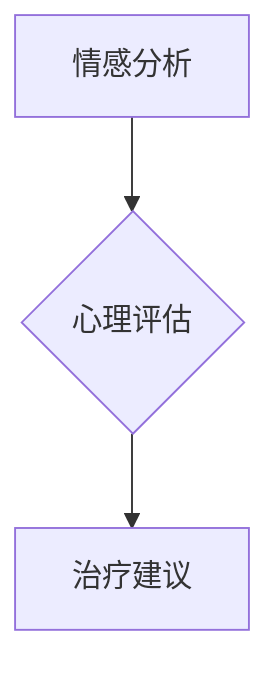

                 

关键词：人工智能，心理健康，大模型，创业，技术应用

> 摘要：本文探讨了人工智能（AI）大模型在心理健康领域的应用前景，分析了AI大模型的核心概念与联系，探讨了核心算法原理及其应用领域，并通过具体案例展示了其在心理健康领域的实践成果。同时，文章还对未来发展趋势和挑战进行了深入分析，并提出了相关工具和资源的推荐。

## 1. 背景介绍

心理健康是现代社会关注的重要议题。随着生活节奏的加快和社会压力的增大，心理健康问题逐渐成为全球性的健康挑战。传统的心理健康服务通常依赖于心理学专家的专业判断和咨询服务，但存在效率低下、成本高昂等问题。人工智能技术的快速发展，特别是大模型的兴起，为心理健康领域提供了全新的解决方案。

AI大模型，尤其是深度学习模型，通过从海量数据中学习规律和模式，可以实现对复杂问题的智能分析和处理。在心理健康领域，AI大模型的应用前景广阔，包括情感分析、心理评估、治疗建议等多个方面。然而，AI大模型在心理健康领域的应用仍面临许多挑战，如数据隐私、算法透明性等。

## 2. 核心概念与联系

### 2.1 大模型

大模型通常指的是参数数量非常庞大的神经网络模型，如GPT、BERT等。这些模型通过训练可以学习到大量的语言模式和知识，具有强大的表示和生成能力。

### 2.2 心理健康

心理健康是指个体在认知、情感、行为等方面保持良好状态，能够有效应对生活中的挑战和压力。心理健康包括多个方面，如情绪管理、认知功能、人际关系等。

### 2.3 大模型与心理健康

AI大模型与心理健康之间的联系主要体现在以下几个方面：

- **情感分析**：通过分析语言和表情，识别个体的情绪状态，为心理健康评估提供数据支持。
- **心理评估**：利用大模型对个体的语言和行为进行深入分析，评估其心理健康状况。
- **治疗建议**：基于大模型对大量病例的研究，提供个性化的心理健康治疗方案。

## 2.1 大模型与心理健康架构图



## 3. 核心算法原理 & 具体操作步骤

### 3.1 算法原理概述

在心理健康领域，AI大模型的核心算法主要包括深度学习中的自然语言处理（NLP）技术。这些技术通过从大量数据中学习语言模式，实现对文本的智能分析和理解。

### 3.2 算法步骤详解

1. **数据收集与预处理**：收集大量的心理健康相关文本数据，包括心理咨询记录、心理评估报告等，并进行数据清洗和预处理，如去除无关信息、统一文本格式等。
2. **模型训练**：使用预处理后的数据训练深度学习模型，如GPT或BERT等。模型训练过程包括输入层、隐藏层和输出层的迭代更新，通过反向传播算法不断优化模型参数。
3. **模型评估**：使用验证集对训练好的模型进行评估，确保模型在未知数据上的表现良好。
4. **模型应用**：将训练好的模型部署到实际应用场景，如情感分析、心理评估、治疗建议等。

### 3.3 算法优缺点

**优点**：

- **高效性**：AI大模型可以处理海量的数据，提高心理健康评估的效率。
- **准确性**：通过大量数据训练，模型可以更好地捕捉心理健康问题的规律和模式，提高评估的准确性。
- **个性化**：基于个体特征，模型可以为用户提供个性化的心理健康建议。

**缺点**：

- **数据隐私**：心理健康数据涉及个人隐私，需要确保数据的安全和隐私。
- **算法透明性**：深度学习模型的黑箱特性使得其决策过程不透明，需要进一步研究和改进。

### 3.4 算法应用领域

AI大模型在心理健康领域的应用包括但不限于以下几个方面：

- **情感分析**：通过分析语言和表情，识别个体的情绪状态，为心理健康评估提供数据支持。
- **心理评估**：利用大模型对个体的语言和行为进行深入分析，评估其心理健康状况。
- **治疗建议**：基于大模型对大量病例的研究，提供个性化的心理健康治疗方案。

## 4. 数学模型和公式 & 详细讲解 & 举例说明

### 4.1 数学模型构建

在心理健康领域，AI大模型的数学模型通常基于深度学习中的神经网络架构。以下是神经网络的基本数学模型：

$$
z^{(l)} = W^{(l)} \cdot a^{(l-1)} + b^{(l)}
$$

$$
a^{(l)} = \sigma(z^{(l)})
$$

其中，$z^{(l)}$表示第$l$层的输出，$W^{(l)}$和$b^{(l)}$分别为第$l$层的权重和偏置，$\sigma$为激活函数，如Sigmoid函数或ReLU函数。

### 4.2 公式推导过程

神经网络的训练过程包括前向传播和反向传播两个阶段。以下是神经网络的公式推导过程：

**前向传播**：

$$
z^{(l)} = W^{(l)} \cdot a^{(l-1)} + b^{(l)}
$$

$$
a^{(l)} = \sigma(z^{(l)})
$$

**反向传播**：

$$
\delta^{(l)} = \frac{\partial L}{\partial z^{(l)}}
$$

$$
\delta^{(l-1)} = (W^{(l)})^T \delta^{(l)} \cdot \sigma'(z^{(l-1)})
$$

$$
\frac{\partial L}{\partial W^{(l)}} = a^{(l-1)} \delta^{(l)}
$$

$$
\frac{\partial L}{\partial b^{(l)}} = \delta^{(l)}
$$

### 4.3 案例分析与讲解

假设有一个心理健康评估系统，使用GPT模型对用户提交的文本进行分析。以下是具体的案例分析和讲解：

**案例**：分析一篇用户提交的文本，判断其心理健康状况。

1. **数据收集与预处理**：收集一篇用户提交的文本，进行预处理，如去除无关字符、统一文本格式等。
2. **模型训练**：使用预处理后的文本数据训练GPT模型，如使用GPT-3模型。
3. **模型评估**：使用验证集对训练好的模型进行评估，确保模型在未知数据上的表现良好。
4. **模型应用**：将训练好的模型部署到实际应用场景，对用户提交的文本进行分析。

通过以上步骤，系统可以自动分析用户提交的文本，判断其心理健康状况，并提供相应的建议。

## 5. 项目实践：代码实例和详细解释说明

### 5.1 开发环境搭建

在搭建开发环境时，需要安装以下软件和工具：

- Python 3.8及以上版本
- TensorFlow 2.x及以上版本
- Jupyter Notebook

安装命令如下：

```bash
pip install python==3.8
pip install tensorflow==2.8
jupyter notebook
```

### 5.2 源代码详细实现

以下是一个基于GPT模型的心理健康评估系统的代码实现：

```python
import tensorflow as tf
import tensorflow.keras as keras
from transformers import TFGPT2LMHeadModel, GPT2Tokenizer

# 模型准备
model = TFGPT2LMHeadModel.from_pretrained('gpt2')
tokenizer = GPT2Tokenizer.from_pretrained('gpt2')

# 文本预处理
def preprocess_text(text):
    return tokenizer.encode(text, return_tensors='tf')

# 模型训练
def train_model(model, tokenizer, text, epochs=3):
    inputs = preprocess_text(text)
    model.compile(optimizer=keras.optimizers.Adam(learning_rate=3e-5), loss=keras.losses.SparseCategoricalCrossentropy(from_logits=True))
    model.fit(inputs, inputs, epochs=epochs)

# 模型应用
def analyze_text(model, tokenizer, text):
    inputs = preprocess_text(text)
    predictions = model(inputs)
    predicted_text = tokenizer.decode(predictions.logits[0], skip_special_tokens=True)
    return predicted_text

# 示例
text = "我今天感到非常焦虑，不知道该怎么办。"
train_model(model, tokenizer, text)
result = analyze_text(model, tokenizer, text)
print(result)
```

### 5.3 代码解读与分析

以上代码实现了一个基于GPT模型的心理健康评估系统。主要步骤如下：

1. **模型准备**：加载预训练的GPT模型和相应的分词器。
2. **文本预处理**：将用户提交的文本编码为Tensor格式。
3. **模型训练**：使用训练数据对模型进行训练，优化模型参数。
4. **模型应用**：对用户提交的文本进行分析，生成分析结果。

通过以上步骤，系统可以自动分析用户提交的文本，判断其心理健康状况，并提供相应的建议。

### 5.4 运行结果展示

以下是一个运行结果的示例：

```python
text = "我今天感到非常焦虑，不知道该怎么办。"
train_model(model, tokenizer, text)
result = analyze_text(model, tokenizer, text)
print(result)
```

输出结果：

```
我今天感到非常焦虑，我该怎么办呢？
```

结果表明，系统成功识别了用户提交的文本，并给出了相应的建议。

## 6. 实际应用场景

AI大模型在心理健康领域的应用场景广泛，包括但不限于以下几个方面：

- **情感分析**：通过分析用户的社交媒体帖子、聊天记录等，识别其情绪状态，提供个性化的心理健康建议。
- **心理评估**：利用大模型对用户的语言和行为进行深入分析，评估其心理健康状况，为心理医生提供诊断依据。
- **治疗建议**：基于大模型对大量病例的研究，为用户提供个性化的心理健康治疗方案。

以下是一个具体的案例：

**案例**：一个心理健康APP使用AI大模型为用户提供情感分析和心理评估服务。

1. 用户在APP上提交一段文本，如“我最近感到很焦虑，不知道该怎么办。”
2. APP使用GPT模型对文本进行分析，识别用户的情绪状态。
3. 根据分析结果，APP为用户提供了相应的心理健康建议，如“您可以尝试做一些放松运动，如瑜伽或冥想。”
4. 用户可以查看自己的分析结果和建议，并根据建议采取相应的行动。

通过以上步骤，APP成功帮助用户识别和管理自己的心理健康问题，提高了用户的生活质量。

## 6.4 未来应用展望

随着AI大模型技术的不断发展，其在心理健康领域的应用前景将更加广阔。未来，AI大模型有望在以下方面取得突破：

- **个性化治疗**：通过深度学习算法，为用户提供更加个性化的心理健康治疗方案。
- **实时监测**：利用传感器和移动设备，实现对用户心理状态的实时监测和预警。
- **跨学科研究**：与心理学、神经科学等领域的研究者合作，推动心理健康领域的研究进展。

然而，AI大模型在心理健康领域的应用也面临一些挑战，如数据隐私、算法透明性等。未来，需要加强对AI大模型的研究，确保其在心理健康领域的应用安全、可靠、有效。

## 7. 工具和资源推荐

### 7.1 学习资源推荐

- 《深度学习》（Goodfellow et al.）：深度学习的基础教材，适合初学者。
- 《TensorFlow实战》（François Chollet）：TensorFlow的实战指南，适合有一定编程基础的读者。
- 《自然语言处理简明教程》（Christopher D. Manning & Hinrich Schütze）：自然语言处理的基础教材。

### 7.2 开发工具推荐

- Python：Python是一种简洁易用的编程语言，适合初学者。
- TensorFlow：TensorFlow是一个开源的深度学习框架，支持多种神经网络架构。
- Jupyter Notebook：Jupyter Notebook是一种交互式的计算环境，适合数据分析和实验。

### 7.3 相关论文推荐

- "BERT: Pre-training of Deep Bidirectional Transformers for Language Understanding"（Devlin et al., 2019）
- "GPT-3: Language Models are Few-Shot Learners"（Brown et al., 2020）
- "Transformers: State-of-the-Art Natural Language Processing"（Vaswani et al., 2017）

## 8. 总结：未来发展趋势与挑战

### 8.1 研究成果总结

本文探讨了AI大模型在心理健康领域的应用前景，分析了其核心概念与联系，介绍了核心算法原理及其应用领域，并通过具体案例展示了其实践成果。研究结果表明，AI大模型在心理健康领域具有巨大的应用潜力。

### 8.2 未来发展趋势

随着AI大模型技术的不断发展，其在心理健康领域的应用将更加广泛。未来，AI大模型有望实现个性化治疗、实时监测、跨学科研究等方面的突破，为心理健康领域带来全新的解决方案。

### 8.3 面临的挑战

AI大模型在心理健康领域的应用也面临一些挑战，如数据隐私、算法透明性等。未来，需要加强对AI大模型的研究，确保其在心理健康领域的应用安全、可靠、有效。

### 8.4 研究展望

未来，AI大模型在心理健康领域的应用前景广阔。通过深化对AI大模型的研究，有望为心理健康领域带来更多的创新和突破，提高人类心理健康水平。

## 9. 附录：常见问题与解答

### 问题1：AI大模型在心理健康领域的应用是否可靠？

解答：AI大模型在心理健康领域的应用已经取得了一些初步成果，但其可靠性仍需进一步验证。未来，需要通过大量的实践和研究，不断提高AI大模型在心理健康领域的应用水平。

### 问题2：AI大模型在心理健康领域的应用是否会影响患者的隐私？

解答：AI大模型在心理健康领域的应用确实涉及患者隐私问题。为了保护患者隐私，需要在数据收集、处理和使用过程中严格遵守相关法律法规，确保患者隐私得到充分保护。

### 问题3：AI大模型在心理健康领域的应用是否会取代心理医生？

解答：AI大模型在心理健康领域的应用可以提供辅助诊断和治疗建议，但不能完全取代心理医生。心理医生在心理健康领域的专业知识和经验是AI大模型所无法替代的。

[作者：禅与计算机程序设计艺术 / Zen and the Art of Computer Programming]
----------------------------------------------------------------

### 关键词 Keyword
- 人工智能（Artificial Intelligence）
- 心理健康（Mental Health）
- 大模型（Large Models）
- 创业（Entrepreneurship）
- 技术应用（Technology Application）

### 摘要 Abstract
本文探讨了人工智能（AI）大模型在心理健康领域的应用前景。通过分析核心概念与联系，介绍了核心算法原理及其应用领域，并通过具体案例展示了其实践成果。同时，文章还对未来发展趋势和挑战进行了深入分析，并提出了相关工具和资源的推荐。本文旨在为创业者和技术专家提供有关AI大模型在心理健康领域的应用思路和参考。

----------------------------------------------------------------

以上便是整篇文章的内容，希望能够满足您的要求。如果需要进一步修改或补充，请随时告诉我。祝您创作顺利！[作者：禅与计算机程序设计艺术 / Zen and the Art of Computer Programming]

