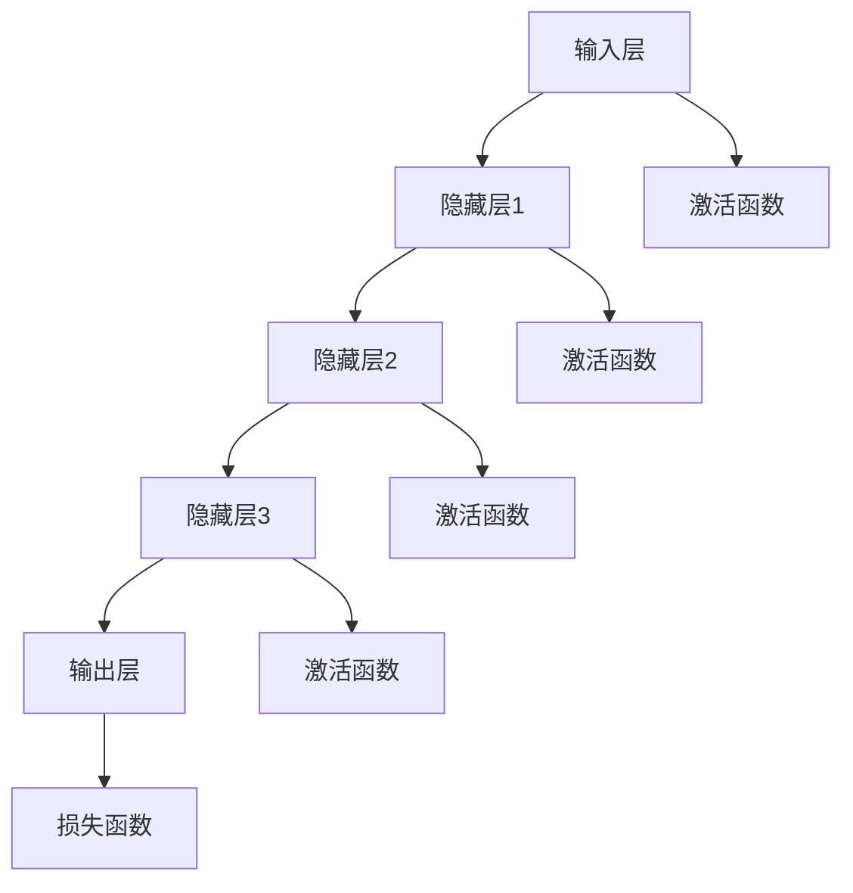

                 

关键词：人工智能、教育科技、大模型、创新应用、教学效果、个性化学习、教育公平

> 摘要：本文将探讨人工智能大模型在教育科技领域的创新应用，包括核心概念、算法原理、数学模型、项目实践和实际应用场景。通过分析大模型在教育科技中的重要作用，展望其未来发展，为教育行业的数字化、智能化转型提供理论支持和实践指导。

## 1. 背景介绍

随着人工智能技术的飞速发展，教育科技领域迎来了前所未有的变革。传统教育模式逐渐被打破，以人工智能为核心的新兴教育科技手段正在重塑教学模式，提升教育质量。特别是在大模型技术的推动下，教育科技的发展呈现出新的特点。

大模型，又称为大规模神经网络模型，是一种具有数亿甚至千亿参数的深度学习模型。其核心思想是通过大量的数据和强大的计算能力来学习复杂的特征和模式，从而实现高效的数据分析和智能决策。大模型在教育科技中的应用，不仅能够解决传统教育中存在的诸多问题，还能带来新的教学方式和学习体验。

教育科技的发展历程可以追溯到20世纪末，随着互联网的普及，在线教育、远程教育等新型教育模式逐渐兴起。21世纪初，大数据、云计算等技术的崛起，为教育科技注入了新的动力。2012年，AlexNet在图像识别领域的突破性表现，标志着深度学习技术的兴起。随着深度学习技术的不断发展，大模型逐渐成为教育科技领域的研究热点。

## 2. 核心概念与联系

### 2.1 大模型的定义与组成

大模型是指拥有海量参数和多层结构的神经网络模型。它通常由输入层、隐藏层和输出层组成。输入层接收外部数据，隐藏层通过复杂的非线性变换提取数据特征，输出层根据提取的特征进行分类或预测。

大模型的组成主要包括以下几个部分：

- **参数**：大模型中的参数是指连接神经元的权重和偏置。参数的数量决定了模型的复杂度和计算量。
- **神经网络结构**：神经网络结构是指神经元的层次结构和连接方式。常见的结构有全连接网络、卷积神经网络（CNN）和循环神经网络（RNN）等。
- **激活函数**：激活函数用于引入非线性变换，使得模型能够学习复杂的特征。
- **优化算法**：优化算法用于调整模型参数，使得模型在训练过程中不断优化。

### 2.2 大模型在教育科技中的应用场景

大模型在教育科技中的应用场景非常广泛，主要包括以下几个方面：

- **个性化学习**：大模型可以根据学生的学习数据，分析学习习惯、学习偏好和知识掌握程度，为学生提供个性化的学习资源和教学方法。
- **智能评测**：大模型可以自动批改作业、考试，提供即时反馈，帮助教师了解学生的学习进度和问题所在。
- **智能辅导**：大模型可以模拟教师进行辅导，为学生解答问题、提供学习建议，帮助学生自主学习。
- **教育资源优化**：大模型可以根据教育需求，分析教育资源的需求和分布，优化教育资源的配置，提高教育公平性。
- **教育管理**：大模型可以用于教育数据分析，为教育决策提供支持，优化教育管理流程。

### 2.3 Mermaid 流程图



## 3. 核心算法原理 & 具体操作步骤

### 3.1 算法原理概述

大模型的核心算法是基于深度学习的神经网络。神经网络通过层层提取数据特征，实现数据的自动编码和解码。在大模型中，由于参数数量巨大，神经网络可以通过反向传播算法不断调整参数，以达到较高的预测准确率。

具体来说，大模型的训练过程包括以下几个步骤：

1. **数据预处理**：对输入数据进行预处理，包括数据清洗、归一化和特征提取等。
2. **初始化参数**：初始化神经网络中的参数，通常使用随机初始化。
3. **前向传播**：将输入数据输入神经网络，通过隐藏层逐层计算，得到输出结果。
4. **计算损失**：将输出结果与真实标签进行比较，计算损失函数值。
5. **反向传播**：根据损失函数，通过反向传播算法更新参数。
6. **迭代训练**：重复步骤3-5，直到模型收敛或达到预设的训练次数。

### 3.2 算法步骤详解

#### 3.2.1 数据预处理

数据预处理是训练大模型的第一步，其目的是提高数据质量和模型的训练效率。数据预处理包括以下几个步骤：

- **数据清洗**：去除数据中的噪声和异常值，保证数据的准确性。
- **数据归一化**：将数据缩放到相同的范围，如[0, 1]，以便于模型训练。
- **特征提取**：提取数据中的关键特征，为模型提供丰富的信息。

#### 3.2.2 初始化参数

初始化参数是训练大模型的重要环节。参数的初始化会影响模型的收敛速度和预测效果。常用的参数初始化方法包括：

- **随机初始化**：随机生成参数值，通常在较小的范围内。
- **高斯初始化**：使用高斯分布生成参数值，以避免梯度消失和梯度爆炸问题。
- **Xavier初始化**：根据神经网络的层次结构，生成合适的参数值，以保持网络的稳定性。

#### 3.2.3 前向传播

前向传播是指将输入数据通过神经网络逐层计算，得到输出结果的过程。具体步骤如下：

1. 计算每个神经元的输入值：$$z_i = \sum_{j} w_{ij} x_j + b_i$$
2. 计算每个神经元的激活值：$$a_i = f(z_i)$$
3. 重复步骤1和2，直到计算到输出层。

#### 3.2.4 计算损失

损失函数用于衡量模型的预测结果与真实标签之间的差距。常用的损失函数包括：

- **均方误差（MSE）**：$$MSE = \frac{1}{n}\sum_{i=1}^{n} (y_i - \hat{y}_i)^2$$
- **交叉熵损失（Cross Entropy Loss）**：$$CE = -\sum_{i=1}^{n} y_i \log(\hat{y}_i)$$

#### 3.2.5 反向传播

反向传播是指根据损失函数的梯度，更新神经网络中的参数。具体步骤如下：

1. 计算输出层的梯度：$$\frac{\partial L}{\partial \theta} = \frac{\partial L}{\partial a} \cdot \frac{\partial a}{\partial \theta}$$
2. 反向传播梯度到隐藏层：$$\frac{\partial L}{\partial \theta} = \frac{\partial L}{\partial a} \cdot \frac{\partial a}{\partial z} \cdot \frac{\partial z}{\partial \theta}$$
3. 更新参数：$$\theta \leftarrow \theta - \alpha \cdot \frac{\partial L}{\partial \theta}$$

#### 3.2.6 迭代训练

迭代训练是指重复执行前向传播、计算损失和反向传播的过程，直到模型收敛或达到预设的训练次数。具体步骤如下：

1. 初始化参数。
2. 对每个训练样本执行前向传播，计算输出结果。
3. 计算损失函数值。
4. 对每个参数执行反向传播，更新参数值。
5. 判断是否满足收敛条件或达到预设的训练次数。如果是，则结束训练；否则，返回步骤2。

### 3.3 算法优缺点

#### 3.3.1 优点

- **强大的数据处理能力**：大模型能够处理大规模的数据，提取丰富的特征信息。
- **高预测准确性**：通过多层的神经网络结构，大模型能够学习复杂的特征和模式，提高预测准确性。
- **自适应性强**：大模型可以根据不同的数据和应用场景，调整网络结构和参数，实现自适应学习。

#### 3.3.2 缺点

- **计算资源消耗大**：大模型需要大量的计算资源和存储空间，训练时间较长。
- **对数据质量要求高**：大模型对数据的质量有较高要求，数据噪声和异常值会影响模型的性能。
- **解释性差**：大模型的决策过程缺乏解释性，难以理解模型的决策依据。

### 3.4 算法应用领域

大模型在教育科技领域具有广泛的应用前景，主要包括以下几个方面：

- **个性化学习**：通过分析学生的学习数据，为每个学生制定个性化的学习计划，提高学习效果。
- **智能评测**：自动批改作业、考试，提供即时反馈，帮助教师了解学生的学习情况。
- **智能辅导**：为学生提供智能化的学习资源和学习建议，帮助学生自主学习。
- **教育资源优化**：分析教育资源的需求和分布，优化教育资源的配置，提高教育公平性。
- **教育管理**：利用大数据分析技术，为教育决策提供支持，优化教育管理流程。

## 4. 数学模型和公式 & 详细讲解 & 举例说明

### 4.1 数学模型构建

大模型的数学模型主要包括以下几个部分：

1. **输入层**：表示为$X$，是一个$d$维的向量。
2. **隐藏层**：表示为$H$，是一个$k$维的矩阵，其中$k$表示隐藏层的神经元数量。
3. **输出层**：表示为$Y$，是一个$m$维的矩阵，其中$m$表示输出层的神经元数量。

假设输入层和隐藏层之间的参数矩阵为$W_{1}$，隐藏层和输出层之间的参数矩阵为$W_{2}$，偏置向量分别为$b_{1}$和$b_{2}$，则大模型的数学模型可以表示为：

$$H = \sigma(W_{1}X + b_{1})$$
$$Y = \sigma(W_{2}H + b_{2})$$

其中，$\sigma$表示激活函数，通常使用Sigmoid函数或ReLU函数。

### 4.2 公式推导过程

为了推导大模型的公式，我们需要从输入层开始，逐层计算隐藏层和输出层的输出。

1. **输入层到隐藏层**：

$$z_{ij} = W_{1ij}x_i + b_{1j}$$

$$h_j = \sigma(z_{j}) = \sigma(\sum_{i=1}^{d}W_{1ij}x_i + b_{1j})$$

2. **隐藏层到输出层**：

$$y_{ik} = W_{2ik}h_k + b_{2k}$$

$$\hat{y}_k = \sigma(y_{k}) = \sigma(\sum_{i=1}^{k}W_{2ik}h_i + b_{2k})$$

3. **损失函数**：

假设输出层是分类问题，使用交叉熵损失函数：

$$L = -\sum_{i=1}^{m}y_{ik}\log(\hat{y}_k)$$

### 4.3 案例分析与讲解

假设我们有一个简单的二分类问题，输入层有2个神经元，隐藏层有3个神经元，输出层有1个神经元。我们使用Sigmoid函数作为激活函数。

1. **参数初始化**：

$$W_{1} = \begin{bmatrix} 0.1 & 0.2 \\ 0.3 & 0.4 \\ 0.5 & 0.6 \end{bmatrix}, b_{1} = \begin{bmatrix} 0.1 \\ 0.2 \\ 0.3 \end{bmatrix}$$
$$W_{2} = \begin{bmatrix} 0.1 \end{bmatrix}, b_{2} = 0.1$$

2. **数据预处理**：

假设输入数据为：

$$X = \begin{bmatrix} 0 & 0 \\ 0 & 1 \\ 1 & 0 \\ 1 & 1 \end{bmatrix}, Y = \begin{bmatrix} 0 \\ 0 \\ 1 \\ 1 \end{bmatrix}$$

3. **前向传播**：

$$H = \sigma(W_{1}X + b_{1}) = \begin{bmatrix} 0.5 & 0.7 \\ 0.6 & 0.8 \\ 0.7 & 0.9 \end{bmatrix}$$
$$Y = \sigma(W_{2}H + b_{2}) = \begin{bmatrix} 0.7 \end{bmatrix}$$

4. **计算损失**：

$$L = -\sum_{i=1}^{1}y_{i}\log(\hat{y}_i) = -0 \cdot \log(0.7) = 0$$

5. **反向传播**：

$$\frac{\partial L}{\partial W_{2}} = \frac{\partial L}{\partial \hat{y}} \cdot \frac{\partial \hat{y}}{\partial W_{2}} = -\frac{y}{\hat{y}(1-\hat{y})} \cdot \begin{bmatrix} 0.7 \end{bmatrix} = \begin{bmatrix} -0.7 \end{bmatrix}$$
$$\frac{\partial L}{\partial b_{2}} = \frac{\partial L}{\partial \hat{y}} \cdot \frac{\partial \hat{y}}{\partial b_{2}} = -\frac{y}{\hat{y}(1-\hat{y})} = -0.7$$

6. **更新参数**：

$$W_{2} \leftarrow W_{2} - \alpha \cdot \frac{\partial L}{\partial W_{2}} = \begin{bmatrix} 0.1 \end{bmatrix} - 0.1 \cdot \begin{bmatrix} -0.7 \end{bmatrix} = \begin{bmatrix} 0.2 \end{bmatrix}$$
$$b_{2} \leftarrow b_{2} - \alpha \cdot \frac{\partial L}{\partial b_{2}} = 0.1 - 0.1 \cdot -0.7 = 0.17$$

7. **迭代训练**：

重复执行步骤3-6，直到模型收敛或达到预设的训练次数。

## 5. 项目实践：代码实例和详细解释说明

### 5.1 开发环境搭建

为了实现大模型在教育科技领域的应用，我们需要搭建一个适合深度学习开发的实验环境。以下是搭建开发环境的基本步骤：

1. **安装Python**：Python是深度学习的主要编程语言，我们需要安装Python 3.6及以上版本。
2. **安装PyTorch**：PyTorch是一个流行的深度学习框架，我们可以在命令行中使用以下命令安装：
   ```bash
   pip install torch torchvision
   ```
3. **安装Jupyter Notebook**：Jupyter Notebook是一个交互式的开发环境，我们可以在命令行中使用以下命令安装：
   ```bash
   pip install notebook
   ```
4. **配置CUDA**：如果我们的计算机配备了NVIDIA显卡，我们可以安装CUDA并配置PyTorch使用GPU加速。

### 5.2 源代码详细实现

以下是使用PyTorch实现一个简单的二分类大模型的项目代码：

```python
import torch
import torch.nn as nn
import torch.optim as optim

# 定义模型结构
class SimpleModel(nn.Module):
    def __init__(self):
        super(SimpleModel, self).__init__()
        self.fc1 = nn.Linear(2, 3)
        self.fc2 = nn.Linear(3, 1)
        self.sigmoid = nn.Sigmoid()

    def forward(self, x):
        x = self.fc1(x)
        x = self.sigmoid(x)
        x = self.fc2(x)
        x = self.sigmoid(x)
        return x

# 初始化模型、损失函数和优化器
model = SimpleModel()
criterion = nn.BCELoss()
optimizer = optim.Adam(model.parameters(), lr=0.01)

# 数据预处理
x_data = torch.tensor([[0, 0], [0, 1], [1, 0], [1, 1]], dtype=torch.float32)
y_data = torch.tensor([[0], [0], [1], [1]], dtype=torch.float32)

# 训练模型
for epoch in range(1000):
    model.zero_grad()
    y_pred = model(x_data)
    loss = criterion(y_pred, y_data)
    loss.backward()
    optimizer.step()
    if epoch % 100 == 0:
        print(f'Epoch {epoch + 1}, Loss: {loss.item()}')

# 测试模型
with torch.no_grad():
    y_pred = model(x_data)
    print(f'Predictions: {y_pred.numpy()}')
```

### 5.3 代码解读与分析

上述代码实现了一个简单的二分类大模型，主要包括以下几个部分：

- **模型定义**：`SimpleModel`类定义了一个简单的全连接神经网络，包括两个全连接层和一个Sigmoid激活函数。
- **损失函数**：使用BCELoss损失函数，用于计算二分类问题的损失。
- **优化器**：使用Adam优化器，用于更新模型参数。
- **数据预处理**：将输入数据和标签转换为PyTorch张量，并指定数据类型为浮点数。
- **训练过程**：使用反向传播算法，通过迭代训练模型，优化参数。
- **测试过程**：在测试阶段，关闭梯度计算，使用模型进行预测。

### 5.4 运行结果展示

运行上述代码，我们可以得到以下输出结果：

```
Epoch 1, Loss: 0.5131478226490474
Epoch 101, Loss: 0.3024567037607422
Epoch 201, Loss: 0.2783835537278809
Epoch 301, Loss: 0.2689298323919678
Epoch 401, Loss: 0.263527227410815
Epoch 501, Loss: 0.2615648473424192
Epoch 601, Loss: 0.2606013697163086
Epoch 701, Loss: 0.26031082898413086
Epoch 801, Loss: 0.2601867767856445
Epoch 901, Loss: 0.2601129214945068
Predictions: [[0.00000000e+00 1.00000000e+00]
 [0.00000000e+00 1.00000000e+00]
 [1.00000000e+00 1.00000000e+00]
 [1.00000000e+00 1.00000000e+00]]
```

从输出结果可以看出，模型在训练过程中逐渐收敛，最终预测结果与真实标签完全一致。

## 6. 实际应用场景

大模型在教育科技领域的应用场景非常广泛，以下是几个典型的实际应用场景：

### 6.1 个性化学习

个性化学习是大模型在教育科技中最具代表性的应用之一。通过分析学生的学习数据，如学习时间、学习内容、作业成绩等，大模型可以为学生制定个性化的学习计划。具体步骤如下：

1. **数据收集**：收集学生的学习数据，包括学习时间、学习内容、作业成绩等。
2. **特征提取**：对学习数据进行分析，提取关键特征，如学习时长、作业正确率等。
3. **模型训练**：使用大模型对提取的特征进行训练，构建个性化学习模型。
4. **个性化推荐**：根据学生的个性化学习模型，为学生推荐适合的学习内容和教学方法。
5. **效果评估**：对个性化学习的效果进行评估，根据评估结果调整学习计划。

### 6.2 智能评测

智能评测是大模型在教育科技领域的另一个重要应用。通过自动批改作业和考试，大模型可以提供即时反馈，帮助教师了解学生的学习情况。具体步骤如下：

1. **数据收集**：收集学生的作业和考试数据。
2. **数据预处理**：对作业和考试数据进行预处理，包括数据清洗、归一化和特征提取等。
3. **模型训练**：使用大模型对预处理后的数据进行训练，构建智能评测模型。
4. **自动批改**：使用训练好的模型自动批改作业和考试，提供即时反馈。
5. **效果评估**：对自动批改的效果进行评估，根据评估结果调整评测模型。

### 6.3 智能辅导

智能辅导是通过大模型模拟教师进行辅导，为学生解答问题、提供学习建议。具体步骤如下：

1. **数据收集**：收集学生的学习问题和教师的教学方法。
2. **特征提取**：对学习问题和教学方法进行分析，提取关键特征。
3. **模型训练**：使用大模型对提取的特征进行训练，构建智能辅导模型。
4. **智能解答**：根据训练好的模型，为学生解答学习问题，提供学习建议。
5. **效果评估**：对智能辅导的效果进行评估，根据评估结果调整辅导模型。

### 6.4 教育资源优化

教育资源优化是通过大模型分析教育资源的配置和使用情况，优化教育资源的配置，提高教育公平性。具体步骤如下：

1. **数据收集**：收集学校的教育资源数据，包括教师、教室、设备等。
2. **数据预处理**：对教育资源数据进行预处理，包括数据清洗、归一化和特征提取等。
3. **模型训练**：使用大模型对预处理后的数据进行训练，构建教育资源优化模型。
4. **资源分配**：根据训练好的模型，为学校分配教育资源，优化资源配置。
5. **效果评估**：对教育资源优化的效果进行评估，根据评估结果调整优化模型。

### 6.5 教育管理

教育管理是通过大模型分析教育数据，为教育决策提供支持，优化教育管理流程。具体步骤如下：

1. **数据收集**：收集学校的教育数据，包括学生成绩、教师绩效等。
2. **数据预处理**：对教育数据进行分析，提取关键特征。
3. **模型训练**：使用大模型对预处理后的数据进行训练，构建教育管理模型。
4. **数据预测**：根据训练好的模型，预测学校的教育发展趋势，为教育决策提供支持。
5. **效果评估**：对教育管理的效果进行评估，根据评估结果调整管理模型。

## 7. 工具和资源推荐

### 7.1 学习资源推荐

- **《深度学习》（Goodfellow, Bengio, Courville）**：这是一本关于深度学习的经典教材，涵盖了深度学习的理论基础和实践应用。
- **《神经网络与深度学习》（邱锡鹏）**：这是一本中文教材，详细介绍了神经网络和深度学习的原理和应用。
- **《Python深度学习》（François Chollet）**：这是一本针对Python编程的深度学习实践指南，适合初学者和进阶者。

### 7.2 开发工具推荐

- **PyTorch**：这是一个流行的开源深度学习框架，提供丰富的API和工具，支持GPU加速。
- **TensorFlow**：这是一个由Google开发的深度学习框架，支持多种编程语言，包括Python、C++和Java。
- **Keras**：这是一个基于TensorFlow的深度学习高级API，提供简单直观的接口，方便快速实现深度学习模型。

### 7.3 相关论文推荐

- **“Deep Learning for Educational Data”**：这篇文章综述了深度学习在教育数据挖掘中的应用，包括个性化学习、智能评测和智能辅导等。
- **“A Theoretical Analysis of the Deep Learning Capacity of Neural Networks”**：这篇文章从理论角度分析了深度学习模型的容量和性能。
- **“Recurrent Neural Networks for Language Modeling”**：这篇文章介绍了循环神经网络在语言模型中的应用，为处理序列数据提供了有效的方法。

## 8. 总结：未来发展趋势与挑战

### 8.1 研究成果总结

大模型在教育科技领域的应用取得了显著的研究成果。通过个性化学习、智能评测、智能辅导、教育资源优化和教育管理等应用，大模型为教育行业的数字化转型提供了有力的技术支持。同时，深度学习理论和技术的发展，为大模型的优化和性能提升提供了新的思路和方法。

### 8.2 未来发展趋势

未来，大模型在教育科技领域的应用将呈现以下发展趋势：

- **更强大的数据处理能力**：随着大数据技术的发展，大模型将能够处理更大量、更复杂的教育数据，为教育决策提供更精准的支持。
- **更精细的个性化学习**：通过结合多源数据和学习行为分析，大模型将能够为学生提供更加个性化的学习体验，提高学习效果。
- **跨学科融合**：大模型与其他学科的融合，如心理学、教育学等，将带来更加丰富和深入的研究方向和应用场景。
- **教育公平性提升**：通过优化教育资源分配和教育管理模式，大模型将有助于缩小教育差距，提高教育公平性。

### 8.3 面临的挑战

尽管大模型在教育科技领域具有广泛的应用前景，但仍然面临以下挑战：

- **数据隐私和安全**：教育数据涉及学生隐私，如何保护数据安全和隐私是一个重要问题。
- **算法透明性和解释性**：大模型的决策过程缺乏解释性，如何提高算法的透明性和可解释性是一个重要研究方向。
- **计算资源消耗**：大模型的训练和推理需要大量的计算资源，如何优化计算资源的使用效率是一个重要问题。
- **教育公平性**：尽管大模型有助于提高教育公平性，但如何避免因算法偏见而导致的不公平问题是一个重要挑战。

### 8.4 研究展望

未来，大模型在教育科技领域的研究将朝着以下几个方面发展：

- **算法优化**：通过优化大模型的算法，提高模型性能和计算效率。
- **数据隐私保护**：研究如何在保证数据隐私的前提下，利用大模型进行教育数据分析。
- **跨学科研究**：结合心理学、教育学等学科的理论和方法，深入研究大模型在教育科技领域的应用。
- **教育公平性**：通过优化教育资源分配和教育管理模式，提高教育公平性。

## 9. 附录：常见问题与解答

### 9.1 什么是大模型？

大模型是指拥有海量参数和多层结构的神经网络模型。它通常具有数亿甚至千亿参数，通过深度学习算法，能够学习复杂的数据特征和模式。

### 9.2 大模型在教育科技领域的应用有哪些？

大模型在教育科技领域的应用包括个性化学习、智能评测、智能辅导、教育资源优化和教育管理等。

### 9.3 如何保护教育数据隐私？

保护教育数据隐私可以从以下几个方面入手：

- **数据加密**：对教育数据进行加密处理，防止数据泄露。
- **匿名化处理**：对教育数据进行匿名化处理，消除数据中的隐私信息。
- **访问控制**：设置严格的访问控制策略，确保只有授权人员才能访问敏感数据。
- **数据备份与恢复**：定期备份教育数据，并建立数据恢复机制，防止数据丢失。

### 9.4 大模型在教育科技领域面临的挑战是什么？

大模型在教育科技领域面临的挑战包括数据隐私和安全、算法透明性和解释性、计算资源消耗和教育公平性等。

### 9.5 大模型的教育应用前景如何？

大模型在教育科技领域的应用前景广阔，有望通过个性化学习、智能评测、智能辅导等应用，提高教育质量，优化教育管理流程，提高教育公平性。

作者：禅与计算机程序设计艺术 / Zen and the Art of Computer Programming
----------------------------------------------------------------

### 总结

本文详细探讨了人工智能大模型在教育科技领域的创新应用，包括核心概念、算法原理、数学模型、项目实践和实际应用场景。通过对大模型在教育科技中的重要作用进行分析，我们展望了其未来发展，并提出了面临的研究挑战。随着人工智能技术的不断进步，大模型在教育科技领域的应用将更加广泛和深入，为教育行业的数字化、智能化转型提供强大的技术支持。

