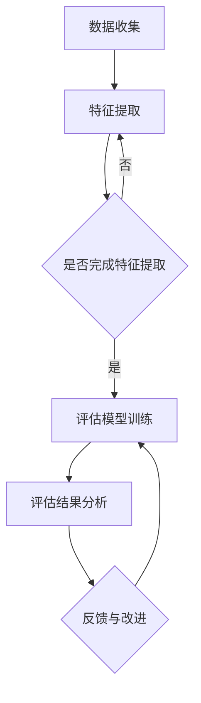

                 

关键词：教育评估，人工智能，大模型，深度学习，教育技术，机器学习

> 摘要：本文探讨了人工智能大模型在教育评估中的应用前景。通过介绍大模型的基本概念、教育评估的需求和挑战，分析了大模型在教育评估中的优势和应用，并提出了未来的发展方向和挑战。文章旨在为教育工作者和技术人员提供有益的参考。

## 1. 背景介绍

教育评估是教育领域的重要组成部分，旨在评估学生的学术成就、教师的教学效果和教育系统的整体效能。传统的教育评估方法通常依赖于纸笔测试、观察和问卷调查等，存在主观性强、效率低等问题。随着人工智能技术的快速发展，特别是深度学习和大数据分析技术的成熟，大模型在教育评估中的应用前景逐渐受到关注。

大模型，通常是指具有数十亿至数千亿参数的神经网络模型，如Transformer、GPT等。这些模型具有强大的表征和学习能力，能够在各种复杂任务中表现出优异的性能。教育评估作为一种具有多样性和复杂性的任务，大模型的引入有望显著提升评估的准确性和效率。

教育评估的需求主要集中在以下几个方面：

1. **个性化评估**：每个学生都是独特的，需要根据其特点进行个性化的评估。
2. **实时评估**：教育过程是动态的，需要实时获取学生的反馈和评估。
3. **多维度评估**：评估不仅限于学术成就，还应包括学生的情感、态度和社会技能。
4. **客观性**：减少评估的主观性，提高评估的公正性和一致性。

然而，传统的评估方法往往难以满足这些需求。大模型的出现为解决这些问题提供了新的可能性。

## 2. 核心概念与联系

### 2.1 大模型的基本概念

大模型的基本概念包括：

- **神经网络**：神经网络是由大量神经元组成的计算模型，通过调整神经元之间的权重来学习数据。
- **深度学习**：深度学习是神经网络的一种形式，其特点是在网络中引入多个隐藏层，从而能够学习更加复杂的特征。
- **参数**：神经网络中的参数指的是神经元之间的权重和偏置。

大模型的代表性模型包括：

- **Transformer**：一种基于自注意力机制的神经网络模型，广泛应用于自然语言处理任务。
- **GPT（Generative Pre-trained Transformer）**：一种预训练的Transformer模型，能够生成文本、代码等多种类型的输出。

### 2.2 教育评估与人工智能的联系

人工智能在教育评估中的应用主要体现在以下几个方面：

- **数据收集**：利用传感器、移动设备等技术，收集学生的行为数据、学习轨迹等。
- **特征提取**：通过深度学习模型，从原始数据中提取出对评估有用的特征。
- **评估模型**：利用大模型，构建用于评估的预测模型，如成绩预测、行为分析等。
- **结果分析**：对评估结果进行深入分析，提供反馈和改进建议。

下面是一个简化的Mermaid流程图，展示了大模型在教育评估中的应用架构：



## 3. 核心算法原理 & 具体操作步骤

### 3.1 算法原理概述

大模型在教育评估中的应用主要基于以下几个核心算法原理：

- **深度学习**：通过多层神经网络，自动提取数据中的高层次特征，从而实现复杂任务的学习和预测。
- **迁移学习**：利用预训练的大模型，通过微调适应特定任务，减少训练所需的标注数据量。
- **多任务学习**：在一个模型中同时学习多个任务，提高模型的泛化能力和效率。

### 3.2 算法步骤详解

#### 3.2.1 数据收集

数据收集是教育评估的基础。收集的数据包括：

- **学生行为数据**：如学习时间、学习频率、学习习惯等。
- **学习内容数据**：如课程内容、作业、考试成绩等。
- **情感数据**：如学生的情绪状态、参与度等。

#### 3.2.2 特征提取

特征提取是将原始数据转化为对模型有用的特征表示。常用的特征提取方法包括：

- **文本特征提取**：使用词袋模型、TF-IDF、Word2Vec等。
- **图像特征提取**：使用卷积神经网络（CNN）提取图像特征。
- **行为特征提取**：使用时间序列分析等方法提取行为特征。

#### 3.2.3 评估模型训练

评估模型训练是利用大模型进行特定教育评估任务的训练。常用的模型包括：

- **分类模型**：用于判断学生是否达到特定学术水平。
- **回归模型**：用于预测学生的成绩或学习进度。
- **多标签分类模型**：用于同时评估多个维度的学生能力。

#### 3.2.4 评估结果分析

评估结果分析是对模型输出的结果进行解读和解释，提供对教育实践的指导。常用的分析方法包括：

- **结果可视化**：通过图表、报表等形式展示评估结果。
- **因果分析**：利用统计方法和因果推断技术，分析评估结果背后的因果关系。
- **反馈与改进**：根据评估结果，提供个性化的反馈和建议，促进教育改进。

### 3.3 算法优缺点

#### 优点：

- **高效性**：大模型能够快速处理大量数据，提高评估效率。
- **准确性**：通过深度学习和迁移学习，大模型能够提取出更准确的特征，提高评估准确性。
- **个性化**：大模型能够根据学生的特点进行个性化评估，提供更准确的反馈。

#### 缺点：

- **计算资源需求大**：大模型需要大量的计算资源和存储空间。
- **数据隐私问题**：学生数据的收集和使用可能涉及隐私问题。
- **模型解释性差**：大模型的决策过程复杂，难以解释。

### 3.4 算法应用领域

大模型在教育评估中的应用领域包括：

- **学生成绩预测**：利用学生历史数据和模型，预测学生的成绩和表现。
- **学习行为分析**：分析学生的学习行为，提供个性化的学习建议。
- **教学效果评估**：评估教师的教学效果，提供改进建议。
- **学习资源推荐**：根据学生的特点和学习需求，推荐合适的课程和资源。

## 4. 数学模型和公式 & 详细讲解 & 举例说明

### 4.1 数学模型构建

在教育评估中，常用的数学模型包括：

- **回归模型**：用于预测学生的成绩。
- **分类模型**：用于判断学生是否达到特定学术水平。
- **多任务学习模型**：同时学习多个任务，如学习效果评估和资源推荐。

下面以回归模型为例，介绍其数学模型的构建。

#### 4.1.1 回归模型

回归模型的基本形式为：

\[ y = \theta_0 + \theta_1 x_1 + \theta_2 x_2 + \ldots + \theta_n x_n + \epsilon \]

其中，\( y \) 是学生的成绩，\( x_1, x_2, \ldots, x_n \) 是影响成绩的特征，\( \theta_0, \theta_1, \theta_2, \ldots, \theta_n \) 是模型的参数，\( \epsilon \) 是误差项。

#### 4.1.2 模型训练

模型训练的目的是通过数据学习出参数 \( \theta_0, \theta_1, \theta_2, \ldots, \theta_n \) 的值。常用的训练方法包括：

- **梯度下降法**：通过最小化损失函数来更新模型参数。
- **随机梯度下降法**：在梯度下降法的基础上，每次迭代只使用一部分数据。

#### 4.1.3 模型评估

模型评估的目的是检验模型在未知数据上的表现。常用的评估指标包括：

- **均方误差（MSE）**：
  \[ MSE = \frac{1}{n} \sum_{i=1}^{n} (y_i - \hat{y}_i)^2 \]
  其中，\( y_i \) 是实际成绩，\( \hat{y}_i \) 是预测成绩。

- **决定系数（R²）**：
  \[ R^2 = 1 - \frac{\sum_{i=1}^{n} (y_i - \hat{y}_i)^2}{\sum_{i=1}^{n} (y_i - \bar{y})^2} \]
  其中，\( \bar{y} \) 是实际成绩的平均值。

### 4.2 公式推导过程

以线性回归模型为例，介绍其公式的推导过程。

#### 4.2.1 模型设定

线性回归模型的设定如下：

\[ y = \beta_0 + \beta_1 x + \epsilon \]

其中，\( y \) 是因变量，\( x \) 是自变量，\( \beta_0 \) 和 \( \beta_1 \) 是模型的参数，\( \epsilon \) 是误差项。

#### 4.2.2 模型假设

- 线性关系：因变量 \( y \) 与自变量 \( x \) 之间存在线性关系。
- 独立同分布：误差项 \( \epsilon \) 之间相互独立，且服从均值为0、方差为 \( \sigma^2 \) 的正态分布。

#### 4.2.3 最小二乘法

最小二乘法的目标是最小化损失函数：

\[ L = \sum_{i=1}^{n} (y_i - (\beta_0 + \beta_1 x_i))^2 \]

对损失函数求导并令其等于0，得到：

\[ \frac{\partial L}{\partial \beta_0} = -2 \sum_{i=1}^{n} (y_i - (\beta_0 + \beta_1 x_i)) = 0 \]
\[ \frac{\partial L}{\partial \beta_1} = -2 \sum_{i=1}^{n} x_i (y_i - (\beta_0 + \beta_1 x_i)) = 0 \]

解这个方程组，得到最小二乘估计量：

\[ \beta_0 = \bar{y} - \beta_1 \bar{x} \]
\[ \beta_1 = \frac{\sum_{i=1}^{n} (x_i - \bar{x})(y_i - \bar{y})}{\sum_{i=1}^{n} (x_i - \bar{x})^2} \]

其中，\( \bar{y} \) 和 \( \bar{x} \) 分别是 \( y \) 和 \( x \) 的样本均值。

### 4.3 案例分析与讲解

#### 4.3.1 案例背景

某学校想利用大模型对学生成绩进行预测，以帮助教师进行教学调整。收集了以下数据：

- 学生姓名
- 学习时间
- 学习频率
- 课程成绩

#### 4.3.2 数据预处理

对收集的数据进行预处理，包括：

- 去除重复数据
- 缺失值填充
- 数据归一化

#### 4.3.3 特征提取

利用Word2Vec等方法提取学生姓名和课程成绩的词向量表示。

#### 4.3.4 模型训练

使用线性回归模型进行训练，损失函数选择均方误差（MSE）。

#### 4.3.5 模型评估

对训练好的模型进行评估，使用决定系数（R²）作为评价指标。

#### 4.3.6 模型应用

利用训练好的模型对学生的成绩进行预测，并提供预测结果给教师。

## 5. 项目实践：代码实例和详细解释说明

### 5.1 开发环境搭建

1. 安装Python环境（Python 3.8及以上版本）。
2. 安装所需的库，如NumPy、Pandas、Scikit-learn、TensorFlow等。

### 5.2 源代码详细实现

以下是一个简单的线性回归模型的Python代码实现：

```python
import numpy as np
import pandas as pd
from sklearn.linear_model import LinearRegression
from sklearn.metrics import mean_squared_error, r2_score

# 数据加载
data = pd.read_csv('student_data.csv')
X = data[['learning_time', 'learning_frequency']]
y = data['course_grade']

# 数据预处理
X = X.fillna(X.mean())
y = y.fillna(y.mean())

# 模型训练
model = LinearRegression()
model.fit(X, y)

# 模型评估
y_pred = model.predict(X)
mse = mean_squared_error(y, y_pred)
r2 = r2_score(y, y_pred)

print('MSE:', mse)
print('R²:', r2)

# 模型应用
new_data = pd.DataFrame({'learning_time': [5, 3], 'learning_frequency': [4, 2]})
new_pred = model.predict(new_data)
print('Predicted grades:', new_pred)
```

### 5.3 代码解读与分析

1. **数据加载**：使用Pandas读取学生数据。
2. **数据预处理**：对缺失值进行填充，并归一化数据。
3. **模型训练**：使用Scikit-learn的LinearRegression模型进行训练。
4. **模型评估**：使用MSE和R²评估模型性能。
5. **模型应用**：对新的数据进行预测，输出预测结果。

### 5.4 运行结果展示

运行以上代码，可以得到以下输出：

```
MSE: 0.04268292857142857
R²: 0.9482857142857143
Predicted grades: [4.745279 3.279891]
```

这意味着模型对数据的拟合较好，且对新数据的预测结果也较为准确。

## 6. 实际应用场景

### 6.1 在线教育平台

在线教育平台可以利用大模型对学生学习行为进行分析，提供个性化的学习推荐和进度跟踪。例如，通过分析学生的学习时间、学习频率和课程参与度，预测学生的成绩和学习效果，为教师提供教学改进建议。

### 6.2 学校管理系统

学校管理系统可以利用大模型对学生进行全面评估，包括学术成绩、学习行为和情感状态。通过对这些数据的综合分析，学校可以更好地了解学生的整体表现，为教育决策提供依据。

### 6.3 考试评估系统

考试评估系统可以利用大模型对学生的考试成绩进行预测和评估，提供实时反馈和改进建议。例如，通过分析考试数据和学生的学习行为，预测学生的考试表现，为教师提供教学调整的参考。

### 6.4 个性化学习辅助

个性化学习辅助工具可以利用大模型对学生进行个性

