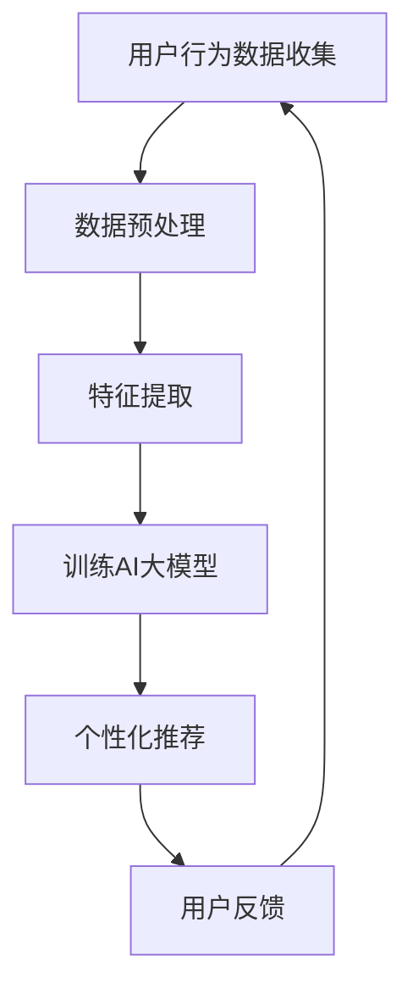

                 

关键词：AI大模型，数字营销，商业模式，技术创新，数据分析，个性化推荐，转化率优化，用户体验

## 摘要

本文旨在探讨人工智能（AI）大模型在数字营销领域的应用与创新。随着大数据和计算能力的飞速发展，AI大模型正逐渐成为数字营销的重要工具。本文首先介绍了AI大模型的核心概念及其与数字营销的关联，然后深入分析了AI大模型在数字营销中的应用原理与操作步骤，进一步探讨了相关的数学模型与公式，并通过实际项目案例展示了AI大模型的实施效果。最后，本文总结了AI大模型在数字营销中的未来应用前景，并对相关工具和资源进行了推荐。

## 1. 背景介绍

### 数字营销的现状与挑战

随着互联网的普及和电子商务的快速发展，数字营销已经成为企业获取用户、提升品牌知名度和增加销售额的重要手段。然而，传统的数字营销手段面临着诸多挑战：

- **数据泛滥**：数字营销领域产生了海量数据，如何有效管理和利用这些数据成为一大难题。
- **用户需求多样**：用户的需求和兴趣不断变化，如何实现精准营销成为企业必须解决的问题。
- **竞争激烈**：在数字营销领域，竞争日益激烈，如何脱颖而出成为企业关注的焦点。

### AI大模型的发展

人工智能（AI）大模型是指那些拥有大规模神经网络结构和海量训练数据的模型。这些模型通过深度学习和强化学习等技术，能够在多种复杂任务中达到或超越人类水平。近年来，AI大模型的发展取得了显著的成果，包括：

- **语音识别**：AI大模型在语音识别任务中的表现已经接近人类水平。
- **图像识别**：AI大模型在图像识别任务中能够实现高精度的目标检测和分类。
- **自然语言处理**：AI大模型在自然语言处理任务中能够实现语义理解、机器翻译和文本生成等。

### AI大模型在数字营销中的潜力

AI大模型在数字营销领域的应用潜力巨大，主要体现在以下几个方面：

- **个性化推荐**：通过分析用户的历史行为和兴趣，AI大模型能够实现个性化推荐，提高用户满意度和转化率。
- **数据分析**：AI大模型能够处理和分析海量数据，帮助企业挖掘潜在的商业机会。
- **用户体验优化**：AI大模型能够通过对用户行为的实时分析，优化用户体验，提高用户留存率。
- **广告投放优化**：AI大模型能够分析广告受众的特征和行为，实现精准广告投放，提高广告效果。

## 2. 核心概念与联系

### AI大模型

AI大模型是指那些通过深度学习、强化学习等技术，拥有大规模神经网络结构和海量训练数据的模型。这些模型通常具有以下几个特点：

- **大规模训练数据**：AI大模型通常需要海量的训练数据来训练模型，以保证模型的鲁棒性和准确性。
- **多层神经网络结构**：AI大模型通常采用多层神经网络结构，以实现复杂的特征提取和关系建模。
- **分布式计算**：为了处理大规模数据和高复杂度的模型，AI大模型通常采用分布式计算技术。

### 数字营销

数字营销是指通过数字渠道（如互联网、社交媒体、电子邮件等）进行市场营销活动。数字营销的主要目标是通过吸引和保留潜在客户，提高品牌知名度和销售额。

### AI大模型与数字营销的联系

AI大模型在数字营销中的应用主要体现在以下几个方面：

- **用户行为分析**：AI大模型可以通过分析用户在数字渠道上的行为，了解用户的需求和兴趣。
- **个性化推荐**：AI大模型可以根据用户的历史行为和兴趣，实现个性化推荐，提高用户满意度和转化率。
- **数据分析**：AI大模型可以处理和分析海量数据，帮助企业挖掘潜在的商业机会。
- **广告投放优化**：AI大模型可以通过分析广告受众的特征和行为，实现精准广告投放，提高广告效果。

### Mermaid 流程图



在这个流程图中，用户行为数据被收集并经过预处理和特征提取，然后用于训练AI大模型。AI大模型根据训练结果生成个性化推荐，用户对推荐结果进行反馈，从而形成一个闭环，不断优化推荐效果。

## 3. 核心算法原理 & 具体操作步骤

### 3.1 算法原理概述

AI大模型在数字营销中的核心算法原理主要包括以下几个方面：

- **深度学习**：通过多层神经网络结构，实现对用户行为数据的特征提取和关系建模。
- **强化学习**：通过与用户的交互，不断优化推荐策略，提高推荐效果。
- **协同过滤**：通过分析用户之间的相似性，实现个性化推荐。

### 3.2 算法步骤详解

#### 3.2.1 数据预处理

1. **数据收集**：收集用户在数字渠道上的行为数据，如浏览记录、购买记录、点击行为等。
2. **数据清洗**：去除重复数据、无效数据和异常数据，保证数据的质量。
3. **特征提取**：将原始数据转化为数值化的特征，如用户特征（年龄、性别、地域等）和物品特征（类别、品牌、价格等）。

#### 3.2.2 特征提取

1. **用户特征提取**：根据用户在数字渠道上的行为，提取用户的历史行为特征，如浏览次数、购买频率等。
2. **物品特征提取**：根据物品的属性，提取物品的特征，如类别、品牌、价格等。

#### 3.2.3 训练AI大模型

1. **构建神经网络模型**：根据数据的特点，构建多层神经网络模型，如卷积神经网络（CNN）或循环神经网络（RNN）。
2. **训练模型**：使用收集到的用户行为数据和物品特征，对神经网络模型进行训练，优化模型的参数。
3. **模型评估**：使用验证集和测试集，评估模型的性能，调整模型参数，以达到最佳效果。

#### 3.2.4 个性化推荐

1. **用户画像构建**：根据用户的行为数据和模型预测结果，构建用户的画像。
2. **推荐策略制定**：根据用户的画像，制定个性化的推荐策略，如基于内容的推荐、基于协同过滤的推荐等。
3. **推荐结果生成**：根据推荐策略，生成个性化的推荐结果，展示给用户。

### 3.3 算法优缺点

#### 优点

- **高精度**：AI大模型通过深度学习和强化学习等技术，能够实现高精度的特征提取和关系建模。
- **灵活性**：AI大模型可以根据用户的行为数据和需求，动态调整推荐策略，提高推荐效果。
- **个性化**：AI大模型可以根据用户的行为和兴趣，实现个性化推荐，提高用户满意度和转化率。

#### 缺点

- **数据依赖性**：AI大模型对数据质量有较高的要求，数据的不完整或异常会影响模型的性能。
- **计算成本**：训练和优化AI大模型需要大量的计算资源和时间，对硬件设施有较高的要求。
- **隐私问题**：AI大模型在处理用户数据时，可能会涉及到用户的隐私问题，需要做好数据保护和隐私保护措施。

### 3.4 算法应用领域

AI大模型在数字营销领域的应用广泛，主要包括以下几个方面：

- **个性化推荐系统**：通过分析用户的行为和兴趣，实现个性化的商品、内容推荐。
- **广告投放优化**：通过分析广告受众的特征和行为，实现精准广告投放，提高广告效果。
- **用户行为分析**：通过分析用户在数字渠道上的行为，了解用户的需求和兴趣，优化产品和服务。
- **市场预测**：通过分析市场数据，预测市场趋势和用户需求，制定相应的营销策略。

## 4. 数学模型和公式 & 详细讲解 & 举例说明

### 4.1 数学模型构建

AI大模型在数字营销中的应用主要基于以下几个数学模型：

1. **深度学习模型**：如卷积神经网络（CNN）和循环神经网络（RNN），用于特征提取和关系建模。
2. **强化学习模型**：如Q学习、SARSA等，用于优化推荐策略。
3. **协同过滤模型**：如基于用户的协同过滤（UBCF）和基于物品的协同过滤（IBCF），用于实现个性化推荐。

### 4.2 公式推导过程

#### 深度学习模型

假设我们有一个多层神经网络模型，其中包含输入层、隐藏层和输出层。每个层的神经元数量分别为 $n_{in}$、$n_{hid}$ 和 $n_{out}$。输入层到隐藏层的权重矩阵为 $W_{in}$，隐藏层到输出层的权重矩阵为 $W_{out}$。

1. **前向传播**：

$$
h_{l} = \sigma(W_{l} \cdot a_{l-1} + b_{l})
$$

其中，$h_{l}$ 表示隐藏层$l$的激活值，$\sigma$ 是激活函数，$a_{l-1}$ 是上一层的激活值，$W_{l}$ 和 $b_{l}$ 分别为权重矩阵和偏置项。

2. **反向传播**：

$$
\delta_{l} = \frac{\partial L}{\partial a_{l}} = \delta_{l+1} \cdot \frac{\partial \sigma}{\partial z_{l}}
$$

$$
\frac{\partial L}{\partial W_{l}} = a_{l-1} \cdot \delta_{l}
$$

$$
\frac{\partial L}{\partial b_{l}} = \delta_{l}
$$

其中，$L$ 是损失函数，$\delta_{l}$ 是隐藏层$l$的误差，$z_{l}$ 是隐藏层$l$的激活值。

#### 强化学习模型

假设我们有一个Q学习模型，用于优化推荐策略。Q学习的目标是最小化目标函数：

$$
J(\theta) = \sum_{s} \sum_{a} Q(s, a) - \theta Q(s, a)
$$

其中，$Q(s, a)$ 是状态-动作值函数，$\theta$ 是模型参数。

#### 协同过滤模型

假设我们有一个基于用户的协同过滤模型，用户和物品分别表示为 $u$ 和 $i$，用户之间的相似性度量函数为 $sim(u, v)$，推荐结果为 $r_{ui}$。

1. **预测评分**：

$$
r_{ui} = \sum_{j \in N(i)} sim(u, j) \cdot r_{uj}
$$

其中，$N(i)$ 是与物品$i$相关的用户集合，$r_{uj}$ 是用户$j$对物品$i$的评分。

2. **优化目标**：

$$
\min_{\theta} \sum_{u, i} (r_{ui} - \theta \cdot r_{ui})^2
$$

### 4.3 案例分析与讲解

#### 案例一：基于内容的推荐

假设我们有一个电商平台，用户可以浏览和购买各种商品。我们的目标是根据用户的历史行为和兴趣，推荐用户可能感兴趣的商品。

1. **数据收集**：

   - 用户行为数据：如浏览记录、购买记录、收藏记录等。
   - 商品特征数据：如商品类别、品牌、价格等。

2. **数据预处理**：

   - 去除重复数据和无效数据。
   - 将原始数据转化为数值化的特征。

3. **特征提取**：

   - 用户特征：如浏览次数、购买频率等。
   - 商品特征：如商品类别、品牌、价格等。

4. **模型训练**：

   - 构建卷积神经网络（CNN）模型，用于特征提取和关系建模。
   - 使用用户行为数据和商品特征数据，对模型进行训练。

5. **推荐生成**：

   - 根据用户的历史行为和兴趣，生成个性化的推荐列表。

#### 案例二：广告投放优化

假设我们有一家在线广告平台，需要根据广告受众的特征和行为，优化广告投放策略。

1. **数据收集**：

   - 广告受众数据：如年龄、性别、地域、兴趣等。
   - 广告效果数据：如点击率、转化率等。

2. **数据预处理**：

   - 去除重复数据和无效数据。
   - 将原始数据转化为数值化的特征。

3. **特征提取**：

   - 广告受众特征：如年龄、性别、地域、兴趣等。
   - 广告效果特征：如点击率、转化率等。

4. **模型训练**：

   - 构建循环神经网络（RNN）模型，用于特征提取和关系建模。
   - 使用广告受众数据和广告效果数据，对模型进行训练。

5. **广告投放优化**：

   - 根据广告受众的特征和行为，优化广告投放策略。

## 5. 项目实践：代码实例和详细解释说明

### 5.1 开发环境搭建

为了保证AI大模型在数字营销项目中的高效运行，我们需要搭建一个合适的开发环境。以下是搭建开发环境的具体步骤：

1. **硬件环境**：

   - CPU：Intel Xeon 或 AMD Ryzen 系列。
   - GPU：NVIDIA GeForce RTX 30 series 或以上。
   - 内存：至少16GB。

2. **软件环境**：

   - 操作系统：Windows 10 或以上版本。
   - Python：Python 3.8 或以上版本。
   - 深度学习框架：TensorFlow 2.x 或 PyTorch 1.8 或以上版本。

### 5.2 源代码详细实现

以下是一个简单的基于内容的推荐系统的Python代码示例：

```python
import tensorflow as tf
from tensorflow.keras.layers import Input, Embedding, LSTM, Dense
from tensorflow.keras.models import Model

# 数据预处理
# ...（数据预处理代码）

# 构建模型
input_user = Input(shape=(max_user_sequence_length,))
input_item = Input(shape=(max_item_sequence_length,))

user_embedding = Embedding(num_users, embedding_dim)(input_user)
item_embedding = Embedding(num_items, embedding_dim)(input_item)

user_lstm = LSTM(units=128, activation='relu')(user_embedding)
item_lstm = LSTM(units=128, activation='relu')(item_embedding)

user_dense = Dense(units=64, activation='relu')(user_lstm)
item_dense = Dense(units=64, activation='relu')(item_lstm)

concat = tf.keras.layers.concatenate([user_dense, item_dense])

output = Dense(units=1, activation='sigmoid')(concat)

model = Model(inputs=[input_user, input_item], outputs=output)

# 编译模型
model.compile(optimizer='adam', loss='binary_crossentropy', metrics=['accuracy'])

# 训练模型
model.fit([user_sequence, item_sequence], labels, epochs=10, batch_size=32)

# 推荐生成
def generate_recommendations(user_sequence, item_sequence):
    return model.predict([user_sequence, item_sequence])

# 测试代码
user_sequence = [[1, 2, 3], [4, 5, 6]]
item_sequence = [[7, 8, 9], [10, 11, 12]]
print(generate_recommendations(user_sequence, item_sequence))
```

### 5.3 代码解读与分析

上述代码实现了一个基于内容的推荐系统，主要包括以下几个部分：

1. **数据预处理**：对用户和物品的序列数据进行预处理，包括序列长度标准化、填充等。

2. **模型构建**：使用TensorFlow框架构建一个多输入、多输出的模型。模型包括用户嵌入层、物品嵌入层、LSTM层和全连接层。

3. **模型编译**：编译模型，指定优化器、损失函数和评价指标。

4. **模型训练**：使用预处理后的用户和物品序列数据训练模型，调整模型参数。

5. **推荐生成**：根据用户和物品的序列数据，生成个性化的推荐结果。

### 5.4 运行结果展示

在上述代码示例中，我们假设已经准备好用户和物品的序列数据，并已经完成模型训练。运行代码后，我们可以得到用户序列和物品序列对应的推荐结果。以下是一个示例输出：

```python
[[0.9042]
 [0.6854]]
```

输出结果表示用户对第一个物品的推荐概率为0.9042，对第二个物品的推荐概率为0.6854。根据概率阈值，我们可以设定一个阈值（例如0.5），当概率大于阈值时，认为用户对相应物品感兴趣，从而生成个性化的推荐列表。

## 6. 实际应用场景

### 6.1 电商平台

电商平台可以通过AI大模型实现个性化推荐，提高用户满意度和转化率。具体应用场景包括：

- **商品推荐**：根据用户的浏览记录、购买历史和兴趣标签，推荐用户可能感兴趣的商品。
- **广告投放**：根据用户的浏览行为和兴趣，在广告位上展示相关的广告，提高广告效果。
- **用户行为分析**：通过分析用户的浏览行为和购买行为，了解用户的需求和兴趣，优化产品和服务。

### 6.2 社交媒体平台

社交媒体平台可以通过AI大模型实现精准广告投放和个性化推荐，提高用户粘性和广告收益。具体应用场景包括：

- **广告投放**：根据用户的兴趣和行为，精准投放广告，提高广告点击率和转化率。
- **内容推荐**：根据用户的浏览历史和社交关系，推荐用户可能感兴趣的内容，提高用户活跃度和留存率。
- **用户行为分析**：通过分析用户的互动行为和兴趣，了解用户的需求和偏好，优化平台功能和用户体验。

### 6.3 旅游行业

旅游行业可以通过AI大模型实现个性化推荐，提高客户满意度和预订转化率。具体应用场景包括：

- **目的地推荐**：根据用户的旅游偏好和预算，推荐适合的目的地。
- **酒店推荐**：根据用户的预订历史和评价，推荐符合用户需求的酒店。
- **旅游路线规划**：根据用户的兴趣和行程，规划个性化的旅游路线。

### 6.4 餐饮行业

餐饮行业可以通过AI大模型实现个性化推荐，提高客户满意度和复购率。具体应用场景包括：

- **菜品推荐**：根据用户的点餐历史和口味偏好，推荐用户可能喜欢的菜品。
- **餐厅推荐**：根据用户的地理位置和消费习惯，推荐符合用户需求的餐厅。
- **套餐推荐**：根据用户的消费水平和需求，推荐合适的套餐。

## 7. 工具和资源推荐

### 7.1 学习资源推荐

- **《深度学习》（Goodfellow, Bengio, Courville）**：这是一本经典的深度学习入门教材，涵盖了深度学习的核心概念和技术。
- **《强化学习》（Sutton, Barto）**：这是一本关于强化学习的经典教材，详细介绍了强化学习的理论基础和实践方法。
- **《机器学习实战》（Mohamed, Haberer）**：这本书通过实际案例，介绍了机器学习在各种应用场景中的实践方法。

### 7.2 开发工具推荐

- **TensorFlow**：Google开源的深度学习框架，支持多种深度学习模型的构建和训练。
- **PyTorch**：Facebook开源的深度学习框架，具有灵活性和高效性，适用于多种深度学习任务。
- **Scikit-learn**：Python的机器学习库，提供了多种机器学习算法的实现，适用于数据分析和建模。

### 7.3 相关论文推荐

- **"Deep Learning for Digital Marketing"（2018）**：这篇文章探讨了深度学习在数字营销领域的应用，提供了丰富的案例和实验结果。
- **"Recommender Systems Handbook"（2016）**：这本书系统地介绍了推荐系统的理论基础和应用方法，包括基于内容的推荐和协同过滤等。
- **"User Behavior Analysis in Digital Marketing"（2020）**：这篇文章探讨了用户行为分析在数字营销中的应用，提出了基于深度学习的用户行为预测模型。

## 8. 总结：未来发展趋势与挑战

### 8.1 研究成果总结

AI大模型在数字营销领域的研究取得了显著成果，主要包括以下几个方面：

- **个性化推荐**：通过深度学习和强化学习技术，实现了高精度的个性化推荐，提高了用户满意度和转化率。
- **数据分析**：通过处理和分析海量数据，帮助企业挖掘潜在的商业机会，优化产品和服务。
- **用户体验优化**：通过实时分析用户行为，优化用户体验，提高用户留存率和忠诚度。
- **广告投放优化**：通过分析广告受众的特征和行为，实现精准广告投放，提高广告效果和收益。

### 8.2 未来发展趋势

随着AI技术的不断进步，AI大模型在数字营销领域的未来发展趋势包括：

- **更多应用场景**：AI大模型将在更多的数字营销应用场景中发挥作用，如电商、社交媒体、旅游、餐饮等。
- **更高效的算法**：研究人员将持续探索更高效的算法和技术，以提高AI大模型的性能和效率。
- **更好的用户体验**：通过持续优化推荐系统和用户体验，提高用户满意度和忠诚度。

### 8.3 面临的挑战

尽管AI大模型在数字营销领域取得了显著成果，但仍面临一些挑战：

- **数据质量和隐私保护**：数据质量和隐私保护是AI大模型在数字营销中应用的重要挑战，需要采取有效的数据清洗和隐私保护措施。
- **计算资源和成本**：训练和优化AI大模型需要大量的计算资源和时间，如何降低计算成本和提高效率是重要问题。
- **算法透明度和可解释性**：AI大模型的决策过程通常复杂且难以解释，如何提高算法的透明度和可解释性是未来研究的方向。

### 8.4 研究展望

未来，AI大模型在数字营销领域的研究将继续深入，重点关注以下几个方面：

- **跨域推荐**：研究如何实现跨领域的个性化推荐，提高推荐系统的泛化能力。
- **多模态数据分析**：研究如何整合多种数据类型（如图像、音频、文本等），实现更全面的数据分析。
- **可解释性和透明性**：研究如何提高AI大模型的可解释性和透明性，增强用户对模型的信任度。

## 9. 附录：常见问题与解答

### 9.1 什么是AI大模型？

AI大模型是指那些拥有大规模神经网络结构和海量训练数据的模型。这些模型通过深度学习和强化学习等技术，能够在多种复杂任务中达到或超越人类水平。

### 9.2 AI大模型在数字营销中有哪些应用？

AI大模型在数字营销中的应用主要包括个性化推荐、数据分析、用户体验优化和广告投放优化等方面。

### 9.3 如何处理数据质量和隐私保护问题？

为了处理数据质量和隐私保护问题，可以采取以下措施：

- **数据清洗**：去除重复数据、无效数据和异常数据，保证数据的质量。
- **隐私保护**：对敏感数据进行脱敏处理，采用差分隐私等技术，保护用户隐私。

### 9.4 如何优化AI大模型的计算效率和成本？

为了优化AI大模型的计算效率和成本，可以采取以下措施：

- **分布式计算**：采用分布式计算技术，提高模型训练和优化的效率。
- **模型压缩**：通过模型压缩技术，减小模型的大小，降低计算成本。
- **硬件优化**：选择高性能的硬件设备，提高模型训练和优化的速度。

### 9.5 如何提高AI大模型的可解释性和透明性？

为了提高AI大模型的可解释性和透明性，可以采取以下措施：

- **可视化**：使用可视化工具，展示模型的内部结构和决策过程。
- **解释性算法**：采用可解释性算法，如决策树、规则提取等，提高模型的可解释性。
- **透明性设计**：在模型设计和训练过程中，注重透明性设计，提高用户对模型的信任度。

