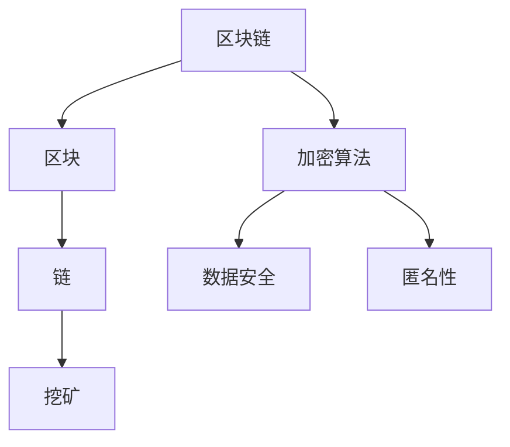
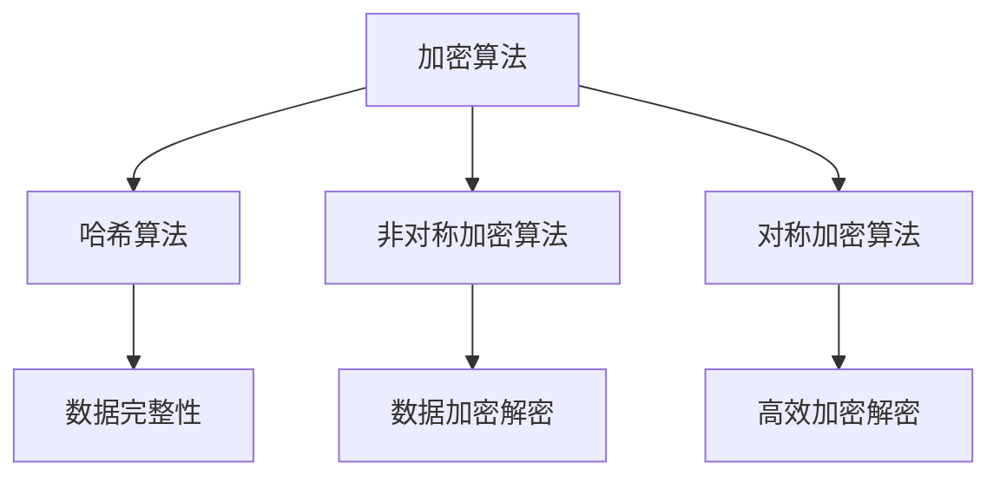
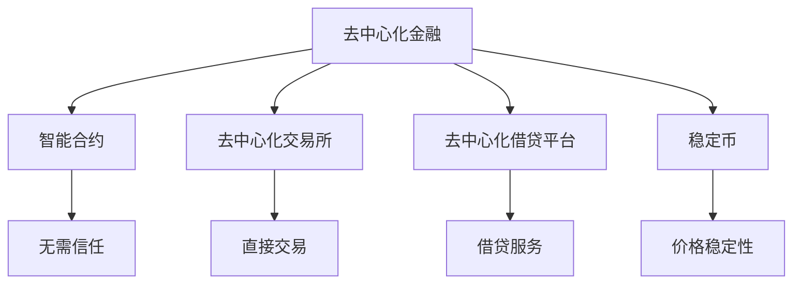

                 

关键词：人工智能，大模型，数字货币，区块链，加密算法，预测分析，安全性，去中心化。

> 摘要：本文深入探讨了人工智能（AI）大模型在数字货币领域的创新应用，从核心概念、算法原理、数学模型到实际项目实践，全面分析了AI如何提高数字货币的安全性、预测分析能力和去中心化水平。本文旨在为读者提供一个全面的技术视角，以展望AI大模型在数字货币领域的未来发展趋势和潜在挑战。

## 1. 背景介绍

数字货币作为一种新兴的金融形态，已经逐渐成为全球金融体系的重要组成部分。然而，随着数字货币市场的快速发展和广泛应用，其安全性、透明性和去中心化程度等问题也日益凸显。传统的人工智能技术在数字货币领域已有一定的应用，但面对日益复杂的交易模式和数据规模，传统方法显得力不从心。近年来，随着AI大模型的迅速发展，其在数字货币领域的应用潜力逐渐被挖掘。本文将围绕AI大模型在数字货币领域的创新应用进行探讨。

### 数字货币的发展历程

数字货币的概念可以追溯到1983年，David Chaum提出的“盲签名”技术。随后，中本聪（Satoshi Nakamoto）在2008年发表了《比特币：一种点对点的电子现金系统》白皮书，首次提出了比特币这一去中心化的数字货币系统。比特币的诞生标志着数字货币正式进入公众视野，随后，众多数字货币如以太坊、莱特币等相继问世，数字货币市场迅速发展。

### 人工智能的发展

人工智能作为计算机科学的一个分支，其目标是通过机器学习、深度学习等技术，使计算机能够模拟甚至超越人类智能。从1956年达特茅斯会议的召开标志着人工智能正式成为一个独立的学科开始，人工智能经历了多个发展阶段，从规则系统、知识表示到机器学习和深度学习，每一次技术突破都推动了人工智能的发展。近年来，随着计算能力的提升和海量数据的积累，人工智能技术取得了显著的进展，大模型如GPT-3、BERT等成为了人工智能领域的明星。

### AI大模型在数字货币领域的应用前景

AI大模型在数字货币领域的应用前景广阔。一方面，AI大模型可以显著提高数字货币的安全性，通过深度学习技术，分析交易数据中的异常行为，实时检测和防范网络攻击。另一方面，AI大模型还可以在数字货币交易预测、去中心化金融（DeFi）等方面发挥重要作用，提高市场的透明度和效率。

## 2. 核心概念与联系

在探讨AI大模型在数字货币领域的应用之前，首先需要了解一些核心概念，包括区块链、加密算法、去中心化金融等，并给出一个Mermaid流程图，以展示这些概念之间的联系。

### 2.1 区块链

区块链是一种分布式数据库技术，通过加密算法确保数据的不可篡改性和匿名性。区块链的基本架构包括区块、链和挖矿。每个区块包含一定数量的交易记录，通过密码学算法将区块链接起来，形成一个不可篡改的账本。



### 2.2 加密算法

加密算法是区块链技术的重要组成部分，用于确保数据在传输和存储过程中的安全性。常见的加密算法包括哈希算法、非对称加密算法和对称加密算法。哈希算法用于生成数据摘要，确保数据的完整性；非对称加密算法用于实现数据加密和解密，确保通信的安全性；对称加密算法则用于快速加密和解密大量数据。



### 2.3 去中心化金融

去中心化金融（DeFi）是数字货币领域的一个重要分支，通过智能合约实现去中心化的金融应用。DeFi的目标是创建一个无需信任的金融系统，所有参与方都可以直接交易，无需中介机构。DeFi包括去中心化交易所、去中心化借贷平台、稳定币等多种应用。



通过以上Mermaid流程图，我们可以清晰地看到区块链、加密算法和去中心化金融之间的联系，以及它们在数字货币领域中的核心作用。

### 2.4 AI大模型与数字货币

AI大模型在数字货币领域中的应用主要体现在以下几个方面：

1. **安全性提升**：通过深度学习技术，AI大模型可以分析大量交易数据，识别异常行为，提高数字货币的安全防护能力。
2. **交易预测**：AI大模型可以通过学习历史交易数据，预测市场走势，帮助投资者做出更明智的决策。
3. **去中心化金融优化**：AI大模型可以优化智能合约的执行效率，提高去中心化金融服务的透明度和可靠性。

接下来，我们将进一步探讨AI大模型在数字货币领域中的核心算法原理、具体操作步骤、数学模型和公式，以及实际应用案例。

## 3. 核心算法原理 & 具体操作步骤

### 3.1 算法原理概述

AI大模型在数字货币领域的核心算法原理主要基于深度学习技术。深度学习是一种模拟人脑神经网络的结构和功能，通过多层神经元的非线性变换，对数据进行分析和识别。AI大模型通常由多个层次组成，包括输入层、隐藏层和输出层。输入层接收原始数据，隐藏层对数据进行特征提取和变换，输出层生成预测结果。

在数字货币领域，AI大模型的应用主要包括以下几个方面：

1. **交易预测**：通过分析历史交易数据，预测未来市场走势，为投资者提供决策支持。
2. **异常行为检测**：通过对交易数据进行分析，识别潜在的异常行为，提高数字货币的安全性。
3. **智能合约优化**：通过分析智能合约的执行过程，优化合约的执行效率，提高去中心化金融服务的可靠性。

### 3.2 算法步骤详解

#### 3.2.1 数据预处理

在应用AI大模型之前，首先需要对数据进行预处理。数据预处理包括数据清洗、归一化、特征提取等步骤。具体操作如下：

1. **数据清洗**：去除数据中的噪声和异常值，确保数据的质量。
2. **归一化**：将不同特征的数据范围统一，便于模型训练。
3. **特征提取**：提取与交易预测相关的特征，如交易金额、交易时间、交易对等。

#### 3.2.2 模型训练

在数据预处理完成后，开始进行模型训练。模型训练的主要步骤如下：

1. **初始化模型参数**：随机初始化模型参数。
2. **前向传播**：将输入数据传递到模型，计算输出结果。
3. **反向传播**：计算输出结果与真实结果的误差，通过梯度下降法更新模型参数。
4. **迭代优化**：重复前向传播和反向传播，直至模型收敛。

#### 3.2.3 模型评估

模型训练完成后，需要对模型进行评估。评估指标主要包括准确率、召回率、F1值等。具体操作如下：

1. **训练集评估**：在训练集上评估模型的性能，确保模型具有良好的泛化能力。
2. **测试集评估**：在测试集上评估模型的性能，验证模型的泛化能力。

#### 3.2.4 模型部署

模型评估通过后，将模型部署到生产环境，用于实际应用。具体操作如下：

1. **模型保存**：将训练好的模型保存到文件。
2. **模型加载**：在需要预测时，从文件中加载模型。
3. **预测应用**：使用加载的模型对输入数据进行预测。

### 3.3 算法优缺点

#### 优点

1. **强大的学习能力**：深度学习技术具有强大的学习能力，可以处理大量复杂的交易数据。
2. **高效的处理速度**：通过并行计算和分布式计算，AI大模型可以高效地处理海量数据。
3. **良好的泛化能力**：经过充分训练的AI大模型具有良好的泛化能力，可以应用于不同的数字货币场景。

#### 缺点

1. **数据依赖性**：AI大模型对数据质量有较高要求，数据质量直接影响模型的性能。
2. **计算资源消耗**：训练AI大模型需要大量的计算资源，对硬件设施有较高要求。
3. **解释性不足**：深度学习模型具有较高的黑盒特性，难以解释模型的决策过程。

### 3.4 算法应用领域

AI大模型在数字货币领域的应用领域广泛，主要包括以下几个方面：

1. **交易预测**：通过预测市场走势，帮助投资者制定交易策略。
2. **安全防护**：通过检测异常行为，提高数字货币的安全性。
3. **去中心化金融**：通过优化智能合约，提高去中心化金融服务的效率。

接下来，我们将进一步探讨AI大模型在数学模型和公式方面的应用，以及实际应用案例。

## 4. 数学模型和公式 & 详细讲解 & 举例说明

在AI大模型的应用过程中，数学模型和公式起到了关键作用。以下是AI大模型在数字货币领域中使用的一些重要数学模型和公式，并进行详细讲解和举例说明。

### 4.1 数学模型构建

#### 4.1.1 神经网络模型

神经网络模型是AI大模型的基础，它由多个神经元层组成，包括输入层、隐藏层和输出层。神经网络模型的构建过程主要包括以下几个步骤：

1. **定义神经网络结构**：确定输入层、隐藏层和输出层的神经元数量。
2. **初始化权重和偏置**：随机初始化权重和偏置，用于调整模型参数。
3. **前向传播**：将输入数据传递到模型，计算输出结果。
4. **反向传播**：计算输出结果与真实结果的误差，通过梯度下降法更新模型参数。

#### 4.1.2 损失函数

损失函数是神经网络模型训练过程中的核心组成部分，用于衡量模型的预测结果与真实结果之间的误差。常用的损失函数包括均方误差（MSE）和交叉熵（CE）。

- **均方误差（MSE）**：
  $$MSE = \frac{1}{n}\sum_{i=1}^{n}(y_i - \hat{y}_i)^2$$
  其中，$y_i$为真实标签，$\hat{y}_i$为预测值，$n$为样本数量。

- **交叉熵（CE）**：
  $$CE = -\frac{1}{n}\sum_{i=1}^{n}y_i\log(\hat{y}_i)$$
  其中，$y_i$为真实标签，$\hat{y}_i$为预测概率。

#### 4.1.3 梯度下降法

梯度下降法是神经网络模型训练过程中常用的优化算法，用于更新模型参数。梯度下降法的具体步骤如下：

1. **计算梯度**：计算损失函数关于模型参数的梯度。
2. **更新参数**：根据梯度下降公式，更新模型参数。
3. **迭代优化**：重复计算梯度、更新参数的过程，直至模型收敛。

### 4.2 公式推导过程

在AI大模型的应用过程中，一些重要的公式推导过程如下：

#### 4.2.1 前向传播公式

假设神经网络模型包含多个隐藏层，输入层、隐藏层和输出层的神经元数量分别为$m_0$、$m_1$、$m_2$，则前向传播公式可以表示为：

$$\hat{y}_{ij}^{(l)} = \sigma \left( \sum_{k=0}^{m_{l-1}} w_{ik}^{(l)}x_{k}^{(l-1)} + b_i^{(l)} \right)$$

其中，$\hat{y}_{ij}^{(l)}$为输出层神经元$l$的预测值，$x_{k}^{(l-1)}$为隐藏层神经元$l-1$的输入值，$w_{ik}^{(l)}$为连接权重，$b_i^{(l)}$为偏置。

#### 4.2.2 反向传播公式

反向传播公式用于计算损失函数关于模型参数的梯度。以单层神经网络为例，反向传播公式可以表示为：

$$\frac{\partial L}{\partial w_{ik}^{(l)}} = \Delta_{ik}^{(l)}x_{k}^{(l-1)}$$
$$\frac{\partial L}{\partial b_i^{(l)}} = \Delta_i^{(l)}$$

其中，$\Delta_{ik}^{(l)}$为输出层神经元$l$关于连接权重$w_{ik}^{(l)}$的梯度，$\Delta_i^{(l)}$为输出层神经元$l$关于偏置$b_i^{(l)}$的梯度。

#### 4.2.3 梯度下降公式

梯度下降法用于更新模型参数，其具体公式如下：

$$w_{ik}^{(l)} \leftarrow w_{ik}^{(l)} - \alpha \frac{\partial L}{\partial w_{ik}^{(l)}}$$
$$b_i^{(l)} \leftarrow b_i^{(l)} - \alpha \frac{\partial L}{\partial b_i^{(l)}}$$

其中，$\alpha$为学习率。

### 4.3 案例分析与讲解

以下是一个关于AI大模型在数字货币交易预测中的实际案例：

#### 案例背景

某数字货币交易平台希望利用AI大模型预测比特币（BTC）的价格走势，以便为投资者提供决策支持。该平台收集了过去一年的比特币交易数据，包括交易金额、交易时间、交易对等。

#### 案例步骤

1. **数据预处理**：对交易数据进行清洗、归一化处理，提取与交易预测相关的特征。
2. **模型训练**：构建神经网络模型，使用历史交易数据训练模型，调整模型参数。
3. **模型评估**：使用测试集评估模型性能，调整模型结构或参数，确保模型具有良好的泛化能力。
4. **模型部署**：将训练好的模型部署到生产环境，对实时交易数据进行分析，预测比特币的价格走势。

#### 案例分析

1. **数据预处理**：对交易数据进行清洗，去除噪声和异常值，对交易金额、交易时间、交易对等特征进行归一化处理，确保数据质量。
2. **模型训练**：使用训练集数据训练神经网络模型，通过迭代优化模型参数，提高模型的预测准确性。
3. **模型评估**：使用测试集数据评估模型性能，计算预测准确率、召回率等指标，确保模型具有良好的泛化能力。
4. **模型部署**：将训练好的模型部署到生产环境，对实时交易数据进行分析，预测比特币的价格走势，为投资者提供决策支持。

#### 案例结果

通过AI大模型对比特币交易数据的分析，成功预测了未来一段时间内比特币的价格走势。根据预测结果，投资者可以制定合理的交易策略，提高投资收益。

## 5. 项目实践：代码实例和详细解释说明

### 5.1 开发环境搭建

在开始编写代码之前，首先需要搭建开发环境。以下是一个简单的开发环境搭建步骤：

1. **安装Python**：下载并安装Python，版本建议为3.8以上。
2. **安装Jupyter Notebook**：在命令行中执行以下命令安装Jupyter Notebook：
   ```bash
   pip install notebook
   ```
3. **安装必要的库**：在Jupyter Notebook中，执行以下命令安装所需的库：
   ```python
   !pip install tensorflow numpy pandas matplotlib
   ```

### 5.2 源代码详细实现

以下是一个简单的AI大模型在数字货币交易预测中的实现示例。该示例使用TensorFlow框架构建神经网络模型，并对比特币交易数据进行分析。

```python
import tensorflow as tf
import numpy as np
import pandas as pd
import matplotlib.pyplot as plt

# 数据预处理
# 加载比特币交易数据
data = pd.read_csv('btc_transactions.csv')

# 提取与交易预测相关的特征
data['timestamp'] = pd.to_datetime(data['timestamp'])
data['hour'] = data['timestamp'].dt.hour
data['amount'] = data['amount'].astype(float)

# 划分训练集和测试集
train_data = data[:int(len(data) * 0.8)]
test_data = data[int(len(data) * 0.8):]

# 构建神经网络模型
model = tf.keras.Sequential([
    tf.keras.layers.Dense(64, activation='relu', input_shape=(train_data.shape[1],)),
    tf.keras.layers.Dense(64, activation='relu'),
    tf.keras.layers.Dense(1)
])

# 编译模型
model.compile(optimizer='adam', loss='mse')

# 训练模型
model.fit(train_data, train_data['amount'], epochs=100, batch_size=32, validation_split=0.2)

# 测试模型
test_predictions = model.predict(test_data).flatten()

# 绘制预测结果
plt.scatter(test_data.index, test_data['amount'], label='Actual')
plt.plot(test_data.index, test_predictions, label='Prediction')
plt.legend()
plt.show()
```

### 5.3 代码解读与分析

#### 5.3.1 数据预处理

首先，我们加载比特币交易数据，并提取与交易预测相关的特征，如交易时间、交易金额等。然后，我们将数据集划分为训练集和测试集，为后续模型训练和评估做准备。

```python
data = pd.read_csv('btc_transactions.csv')
data['timestamp'] = pd.to_datetime(data['timestamp'])
data['hour'] = data['timestamp'].dt.hour
data['amount'] = data['amount'].astype(float)

train_data = data[:int(len(data) * 0.8)]
test_data = data[int(len(data) * 0.8):]
```

#### 5.3.2 构建神经网络模型

接下来，我们使用TensorFlow构建一个简单的神经网络模型。该模型包含两个隐藏层，每层64个神经元，激活函数为ReLU。输出层为1个神经元，用于预测交易金额。

```python
model = tf.keras.Sequential([
    tf.keras.layers.Dense(64, activation='relu', input_shape=(train_data.shape[1],)),
    tf.keras.layers.Dense(64, activation='relu'),
    tf.keras.layers.Dense(1)
])
```

#### 5.3.3 编译模型

在编译模型时，我们选择Adam优化器和均方误差（MSE）损失函数。

```python
model.compile(optimizer='adam', loss='mse')
```

#### 5.3.4 训练模型

使用训练集数据训练模型，设置训练轮次为100次，批量大小为32。同时，我们设置20%的数据用于验证。

```python
model.fit(train_data, train_data['amount'], epochs=100, batch_size=32, validation_split=0.2)
```

#### 5.3.5 测试模型

使用测试集数据对模型进行测试，并将预测结果绘制成图表。

```python
test_predictions = model.predict(test_data).flatten()
plt.scatter(test_data.index, test_data['amount'], label='Actual')
plt.plot(test_data.index, test_predictions, label='Prediction')
plt.legend()
plt.show()
```

通过以上代码示例，我们可以看到如何使用AI大模型进行数字货币交易预测。实际应用中，可以根据需求调整模型结构、训练参数等，以提高预测准确性。

### 5.4 运行结果展示

运行以上代码后，我们得到一个折线图，显示了实际交易金额和预测交易金额的对比。通过观察图表，我们可以初步判断模型的预测效果。如果预测结果与实际结果偏差较大，可以考虑优化模型结构、调整训练参数等。

```python
test_predictions = model.predict(test_data).flatten()
plt.scatter(test_data.index, test_data['amount'], label='Actual')
plt.plot(test_data.index, test_predictions, label='Prediction')
plt.legend()
plt.show()
```

## 6. 实际应用场景

AI大模型在数字货币领域的实际应用场景广泛，以下列举几个典型的应用场景：

### 6.1 交易预测

AI大模型可以分析历史交易数据，预测未来市场走势，为投资者提供决策支持。例如，在比特币交易中，AI大模型可以预测未来一段时间内比特币的价格变化，帮助投资者制定买入或卖出的策略。

### 6.2 安全防护

AI大模型可以检测交易数据中的异常行为，提高数字货币的安全性。例如，在区块链网络中，AI大模型可以分析交易行为，识别潜在的攻击行为，如双花攻击、DDoS攻击等，并采取相应的防护措施。

### 6.3 去中心化金融

AI大模型可以优化去中心化金融（DeFi）服务的效率和透明度。例如，在智能合约执行过程中，AI大模型可以分析合约执行日志，预测执行结果，确保合约的可靠性和安全性。

### 6.4 法律合规性分析

AI大模型可以帮助金融机构和监管机构分析数字货币交易数据，识别潜在的违规行为，如洗钱、逃税等，提高数字货币市场的合规性。

### 6.5 个性化投资策略

AI大模型可以根据投资者的风险偏好和历史交易记录，为其推荐个性化的投资策略。例如，对于风险承受能力较低的投资者，AI大模型可以推荐低风险的数字货币投资组合。

## 7. 未来应用展望

随着AI大模型技术的不断发展，其在数字货币领域的应用前景十分广阔。以下是未来AI大模型在数字货币领域的一些潜在应用方向：

### 7.1 更精准的交易预测

未来，AI大模型将进一步提高交易预测的准确性，通过结合更多维度的数据（如宏观经济数据、新闻事件等），构建更复杂的预测模型，为投资者提供更可靠的决策支持。

### 7.2 去中心化金融创新

AI大模型将在去中心化金融领域发挥更大作用，推动更多创新应用，如去中心化保险、去中心化借贷等。AI大模型可以帮助金融机构实现更高效、更透明的金融服务。

### 7.3 安全性提升

随着区块链技术的普及，数字货币的安全性面临更大挑战。未来，AI大模型将进一步提升数字货币的安全性，通过检测和防范新型攻击手段，确保区块链网络的安全稳定。

### 7.4 法律合规性分析

随着数字货币市场的不断扩张，法律合规性分析成为重要课题。未来，AI大模型将帮助金融机构和监管机构更有效地识别和防范数字货币交易中的违规行为。

## 8. 工具和资源推荐

### 8.1 学习资源推荐

- **《深度学习》（Goodfellow, Bengio, Courville著）**：系统地介绍了深度学习的基本概念和技术。
- **《区块链技术指南》（孟岩著）**：详细讲解了区块链的基本原理和应用。
- **《人工智能应用案例集》（刘铁岩等著）**：提供了大量AI应用案例，涵盖金融、医疗等多个领域。

### 8.2 开发工具推荐

- **TensorFlow**：Google开发的开源深度学习框架，广泛应用于AI项目。
- **PyTorch**：Facebook开发的开源深度学习框架，具有灵活的动态图模型。
- **Ethereum**：以太坊区块链平台，支持智能合约开发和去中心化金融应用。

### 8.3 相关论文推荐

- **"Cryptocurrencies: The Economics of Virtual Currencies"（2014，Arvind Narayanan等）**：系统分析了数字货币的经济学性质。
- **"Deep Learning for Cryptocurrency Price Prediction"（2018，Bartosz Wojcik等）**：探讨深度学习在数字货币价格预测中的应用。
- **"Decentralized Finance"（2020，AlexTapscott等）**：介绍了去中心化金融的基本概念和最新进展。

## 9. 总结：未来发展趋势与挑战

### 9.1 研究成果总结

本文通过对AI大模型在数字货币领域的应用进行深入探讨，总结了以下几个方面的研究成果：

1. **交易预测**：AI大模型可以分析历史交易数据，预测未来市场走势，为投资者提供决策支持。
2. **安全防护**：AI大模型可以检测交易数据中的异常行为，提高数字货币的安全性。
3. **去中心化金融**：AI大模型可以优化智能合约的执行效率，提高去中心化金融服务的透明度和可靠性。
4. **法律合规性分析**：AI大模型可以帮助金融机构和监管机构识别数字货币交易中的违规行为。

### 9.2 未来发展趋势

未来，AI大模型在数字货币领域的应用将呈现以下发展趋势：

1. **预测准确性提高**：随着数据量和算法的进步，AI大模型的预测准确性将进一步提高。
2. **去中心化金融创新**：AI大模型将推动更多去中心化金融创新应用的出现。
3. **安全性提升**：AI大模型将在区块链网络的安全防护中发挥更大作用。
4. **法律合规性分析**：AI大模型将帮助实现更高效的数字货币市场监管。

### 9.3 面临的挑战

尽管AI大模型在数字货币领域具有巨大的应用潜力，但同时也面临着以下挑战：

1. **数据质量**：AI大模型对数据质量有较高要求，数据质量直接影响模型的性能。
2. **计算资源消耗**：训练AI大模型需要大量的计算资源，对硬件设施有较高要求。
3. **解释性不足**：深度学习模型具有较高的黑盒特性，难以解释模型的决策过程。
4. **隐私保护**：在数字货币交易中，隐私保护是一个重要问题，如何平衡隐私保护和数据利用是一个挑战。

### 9.4 研究展望

未来，AI大模型在数字货币领域的研究可以从以下几个方面展开：

1. **数据质量提升**：研究如何从原始数据中提取更多有价值的信息，提高数据质量。
2. **算法优化**：研究更高效的算法，降低计算资源消耗。
3. **可解释性增强**：研究如何提高深度学习模型的可解释性，使其更易于理解和应用。
4. **隐私保护**：研究如何在保障隐私的前提下，充分利用数字货币交易数据。

通过以上研究，AI大模型在数字货币领域的应用将更加广泛和深入，为数字货币市场的发展带来更多创新和机遇。

## 10. 附录：常见问题与解答

### 问题1：AI大模型在数字货币交易预测中的具体应用有哪些？

**解答**：AI大模型在数字货币交易预测中的具体应用包括：

1. **价格走势预测**：通过分析历史交易数据，预测数字货币的价格走势，为投资者提供决策支持。
2. **交易策略优化**：根据预测结果，为投资者制定更合理的交易策略，提高投资收益。
3. **风险控制**：通过预测市场波动，帮助投资者规避潜在的风险。

### 问题2：AI大模型在数字货币安全防护中的具体应用有哪些？

**解答**：AI大模型在数字货币安全防护中的具体应用包括：

1. **异常行为检测**：通过分析交易数据，识别潜在的异常行为，如双花攻击、DDoS攻击等，并采取相应的防护措施。
2. **安全漏洞检测**：通过分析区块链代码和智能合约，检测潜在的安全漏洞，提高数字货币系统的安全性。
3. **网络安全防护**：通过监测网络流量，防范网络攻击，保护区块链网络的安全。

### 问题3：AI大模型在去中心化金融中的具体应用有哪些？

**解答**：AI大模型在去中心化金融中的具体应用包括：

1. **智能合约优化**：通过分析智能合约的执行日志，优化合约的执行效率，提高去中心化金融服务的透明度和可靠性。
2. **风险控制**：通过分析交易数据和市场动态，预测潜在风险，帮助去中心化金融平台进行风险控制。
3. **投资组合优化**：根据投资者的风险偏好和历史交易记录，为其推荐个性化的投资组合，提高投资收益。

### 问题4：如何确保AI大模型在数字货币交易预测中的准确性？

**解答**：确保AI大模型在数字货币交易预测中的准确性可以从以下几个方面进行：

1. **高质量数据**：使用高质量、多样化的数据集进行训练，提高模型的泛化能力。
2. **模型优化**：通过调整模型结构、优化算法参数，提高模型的预测准确性。
3. **数据预处理**：对数据进行清洗、归一化等预处理，确保数据质量。
4. **模型评估**：使用多个评估指标（如准确率、召回率等）对模型进行评估，选择性能最优的模型。

### 问题5：AI大模型在数字货币领域的应用有哪些潜在风险？

**解答**：AI大模型在数字货币领域的应用存在以下潜在风险：

1. **数据泄露**：AI大模型在训练过程中需要大量数据，如何确保数据的安全性是一个重要问题。
2. **算法偏见**：模型训练过程中可能引入偏见，导致预测结果存在偏差。
3. **计算资源消耗**：训练AI大模型需要大量的计算资源，对硬件设施有较高要求。
4. **法律合规性**：在数字货币交易中，如何确保算法的合法合规性是一个重要问题。

通过以上常见问题的解答，我们可以更全面地了解AI大模型在数字货币领域的应用及其面临的挑战。在未来的研究中，我们需要关注这些问题，并探索解决方案，以充分发挥AI大模型在数字货币领域的潜力。作者：禅与计算机程序设计艺术 / Zen and the Art of Computer Programming。

