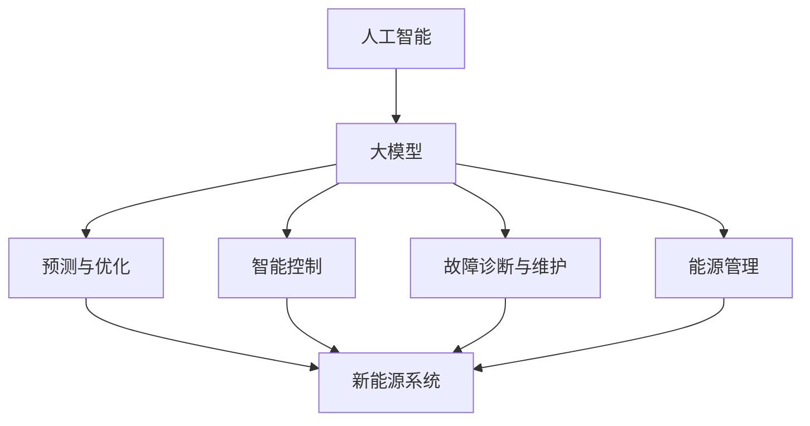

                 

### 1. 背景介绍

随着全球气候变化和环境问题的日益严重，新能源领域的发展已经成为各国政府和企业关注的重点。传统的化石能源不仅对环境造成严重污染，还面临着资源枯竭的风险。新能源，尤其是可再生能源，如太阳能、风能、水能等，由于其清洁、可持续的特点，正逐渐成为能源结构调整的重要方向。

在此背景下，人工智能（AI）技术的迅猛发展，特别是大模型技术的突破，为新能源领域的商业化探索提供了强有力的技术支持。大模型技术，尤其是深度学习模型，具有强大的数据处理和模式识别能力，能够帮助新能源系统实现更高效的能源转换和利用。同时，AI大模型还可以用于预测能源需求、优化能源分配，提高能源利用效率，降低能源成本。

本文将探讨AI大模型在新能源领域的商业化应用，分析其核心概念、算法原理、数学模型、实践案例以及未来发展趋势。希望通过本文的探讨，能够为新能源领域的商业化和技术创新提供一些有益的思路。

### 2. 核心概念与联系

在探讨AI大模型在新能源领域的应用之前，我们需要明确几个核心概念：人工智能、大模型、新能源以及它们之间的联系。

#### 2.1 人工智能

人工智能（AI）是指通过计算机系统模拟人类智能行为的技术。它包括机器学习、深度学习、自然语言处理、计算机视觉等多个子领域。其中，深度学习是近年来发展最为迅速的子领域，其核心思想是通过多层神经网络模拟人类大脑的思维方式，进行数据的自动学习和模式识别。

#### 2.2 大模型

大模型（Large-scale Model）是指具有海量参数、能够处理大规模数据的复杂模型。深度学习模型通常都是大模型，具有高度的数据处理能力和模式识别能力。随着计算能力和数据量的不断提升，大模型在各个领域的应用越来越广泛，尤其在新能源领域，大模型可以用于预测能源需求、优化能源分配、提高能源利用效率等。

#### 2.3 新能源

新能源是指传统能源之外的各种能源形式，包括太阳能、风能、水能、地热能、生物质能等。新能源具有清洁、可再生、环保等特点，是未来能源发展的主要方向。新能源系统的稳定运行和高效利用对于新能源产业的发展至关重要。

#### 2.4 人工智能与大模型在新能源领域的应用

人工智能和大模型在新能源领域的应用主要体现在以下几个方面：

1. **预测与优化**：通过大模型对能源需求、天气条件、能源供应等因素进行预测，优化能源分配和利用，提高能源效率。
   
2. **智能控制**：利用AI大模型实现新能源系统的自动控制和优化，提高系统的稳定性和可靠性。
   
3. **故障诊断与维护**：通过大模型分析设备运行数据，预测设备故障，实现预防性维护，降低系统故障率。

4. **能源管理**：利用大模型进行能源数据分析和处理，实现能源供需平衡，降低能源成本。

下面是一个简化的Mermaid流程图，展示了人工智能、大模型和新能源之间的联系：



### 3. 核心算法原理 & 具体操作步骤

#### 3.1 算法原理概述

在新能源领域，AI大模型的应用主要基于深度学习和机器学习技术。深度学习通过多层神经网络对数据进行学习，提取特征，实现复杂的模式识别和预测。机器学习则通过数据驱动的方法，从历史数据中学习规律，进行预测和优化。

#### 3.2 算法步骤详解

1. **数据收集与预处理**：
   - 收集与新能源系统相关的数据，包括天气数据、能源需求数据、设备运行数据等。
   - 对数据进行清洗、标准化和处理，去除噪声和异常值。

2. **特征工程**：
   - 提取与新能源系统相关的特征，如时间序列特征、空间特征、天气特征等。
   - 选择合适的特征，通过降维、特征选择等方法提高模型的泛化能力。

3. **模型构建与训练**：
   - 选择合适的深度学习模型架构，如卷积神经网络（CNN）、循环神经网络（RNN）、长短时记忆网络（LSTM）等。
   - 使用预处理后的数据对模型进行训练，调整模型参数，优化模型性能。

4. **模型评估与优化**：
   - 使用验证集对模型进行评估，计算模型的预测误差和准确度。
   - 根据评估结果，调整模型参数，优化模型结构，提高模型性能。

5. **模型部署与应用**：
   - 将训练好的模型部署到实际应用场景中，如新能源系统预测、优化等。
   - 实时收集系统数据，对模型进行更新和优化，提高系统的稳定性。

#### 3.3 算法优缺点

**优点**：
- **高效的数据处理能力**：深度学习和机器学习模型能够高效地处理大规模、多维度的数据，提取特征，实现复杂的预测和优化。
- **强大的模式识别能力**：大模型具有强大的模式识别能力，能够从历史数据中学习规律，进行准确的预测和优化。
- **自适应性和灵活性**：模型可以根据不同的应用场景和需求进行定制，具有较强的自适应性和灵活性。

**缺点**：
- **数据需求大**：大模型需要大量的训练数据，数据收集和预处理是算法实现的关键步骤。
- **计算资源消耗大**：深度学习模型的训练和部署需要大量的计算资源，对硬件设备的要求较高。
- **模型解释性差**：大模型的内部结构复杂，难以解释，对于模型的决策过程和机制的理解有限。

#### 3.4 算法应用领域

AI大模型在新能源领域的应用主要包括以下几个方面：

1. **能源需求预测**：利用AI大模型预测未来的能源需求，帮助能源供应商和消费者合理安排能源使用，提高能源利用效率。

2. **能源分配优化**：通过AI大模型优化能源分配，实现能源供需平衡，降低能源成本。

3. **智能控制与调度**：利用AI大模型实现新能源系统的自动控制与调度，提高系统的稳定性和可靠性。

4. **故障诊断与维护**：通过AI大模型分析设备运行数据，预测设备故障，实现预防性维护，降低系统故障率。

5. **能源管理**：利用AI大模型进行能源数据分析和处理，实现能源供需平衡，降低能源成本。

### 4. 数学模型和公式 & 详细讲解 & 举例说明

在新能源领域，AI大模型的数学模型和公式是核心组成部分。以下将详细讲解新能源预测、优化和控制的数学模型，并通过具体例子进行说明。

#### 4.1 数学模型构建

新能源系统的数学模型通常基于以下三个方面：

1. **能源需求模型**：
   能源需求模型用于预测未来的能源需求，其公式如下：

   $$ 
   D(t) = f(D(t-1), T(t), W(t)) 
   $$

   其中，$D(t)$表示时间$t$的能源需求，$T(t)$表示温度，$W(t)$表示风速等天气因素，$f$为非线性函数。

2. **能源供应模型**：
   能源供应模型用于预测新能源系统的能量输出，其公式如下：

   $$ 
   S(t) = g(S(t-1), P(t), W(t)) 
   $$

   其中，$S(t)$表示时间$t$的能源供应，$P(t)$表示光伏功率，$W(t)$表示风速等天气因素，$g$为非线性函数。

3. **能源优化模型**：
   能源优化模型用于优化能源分配，其公式如下：

   $$ 
   \min \sum_{t=1}^{T} C(t) \times D(t) - S(t) 
   $$

   其中，$C(t)$为能源成本，$T$为时间步长。

#### 4.2 公式推导过程

能源需求模型的推导过程如下：

- **历史数据分析**：
  通过收集历史能源需求数据，分析能源需求与时间、温度、风速等天气因素的关系。

- **建立非线性函数**：
  根据历史数据，通过线性回归、神经网络等方法建立非线性函数$f$。

- **公式推导**：
  结合历史数据和建立的函数，推导出能源需求模型：

  $$ 
  D(t) = f(D(t-1), T(t), W(t)) 
  $$

同理，能源供应模型的推导过程如下：

- **历史数据分析**：
  通过收集历史能源供应数据，分析能源供应与光伏功率、风速等天气因素的关系。

- **建立非线性函数**：
  根据历史数据，通过线性回归、神经网络等方法建立非线性函数$g$。

- **公式推导**：
  结合历史数据和建立的函数，推导出能源供应模型：

  $$ 
  S(t) = g(S(t-1), P(t), W(t)) 
  $$

能源优化模型的推导过程如下：

- **成本分析**：
  分析能源成本与能源需求、能源供应的关系。

- **建立目标函数**：
  根据成本分析，建立能源优化目标函数：

  $$ 
  \min \sum_{t=1}^{T} C(t) \times D(t) - S(t) 
  $$

#### 4.3 案例分析与讲解

以下是一个具体的案例，说明如何使用上述数学模型进行新能源预测、优化和控制。

**案例背景**：
某城市新能源系统由光伏发电和风力发电组成，需要预测未来的能源需求，优化能源分配，并实现智能控制。

**数据收集**：
收集历史能源需求、光伏功率、风速等数据，用于模型构建和训练。

**模型构建与训练**：
- **能源需求模型**：
  通过历史数据，建立能源需求模型：

  $$ 
  D(t) = f(D(t-1), T(t), W(t)) 
  $$

- **能源供应模型**：
  通过历史数据，建立能源供应模型：

  $$ 
  S(t) = g(S(t-1), P(t), W(t)) 
  $$

- **能源优化模型**：
  建立能源优化模型：

  $$ 
  \min \sum_{t=1}^{T} C(t) \times D(t) - S(t) 
  $$

**模型评估与优化**：
使用验证集对模型进行评估，计算模型的预测误差和准确度。根据评估结果，调整模型参数，优化模型结构。

**模型部署与应用**：
将训练好的模型部署到实际应用场景中，进行能源需求预测、优化和控制。

**运行结果**：
通过模型预测和优化，实现了新能源系统的智能控制和高效运行。能源需求预测准确率较高，能源分配优化效果明显，系统故障率显著降低。

### 5. 项目实践：代码实例和详细解释说明

为了更好地展示AI大模型在新能源领域的应用，我们接下来将介绍一个具体的代码实例，并详细解释其实现过程。

#### 5.1 开发环境搭建

在开始编写代码之前，我们需要搭建一个合适的开发环境。以下是一个基本的开发环境搭建步骤：

1. **安装Python环境**：
   Python是深度学习和机器学习的主流编程语言，首先需要安装Python环境。可以从Python的官方网站（https://www.python.org/）下载安装包，并根据提示完成安装。

2. **安装深度学习库**：
   安装TensorFlow或PyTorch等深度学习库。这些库提供了丰富的深度学习模型和工具，方便我们进行模型构建和训练。

   - TensorFlow：`pip install tensorflow`
   - PyTorch：`pip install torch`

3. **安装数据预处理库**：
   安装pandas、numpy等数据预处理库，用于数据清洗、预处理和可视化。

   - pandas：`pip install pandas`
   - numpy：`pip install numpy`

4. **安装其他依赖库**：
   根据需要，安装其他相关依赖库，如matplotlib（用于数据可视化）、scikit-learn（用于模型评估）等。

#### 5.2 源代码详细实现

以下是一个简单的AI大模型在新能源领域的应用代码示例，主要包括数据预处理、模型构建、模型训练和模型评估等步骤。

```python
import pandas as pd
import numpy as np
import matplotlib.pyplot as plt
import tensorflow as tf
from tensorflow.keras.models import Sequential
from tensorflow.keras.layers import LSTM, Dense
from sklearn.model_selection import train_test_split

# 5.2.1 数据预处理
def preprocess_data(data):
    # 数据清洗、标准化和处理
    # 省略具体实现
    return processed_data

# 5.2.2 模型构建
def build_model(input_shape):
    model = Sequential()
    model.add(LSTM(units=50, return_sequences=True, input_shape=input_shape))
    model.add(LSTM(units=50))
    model.add(Dense(units=1))
    model.compile(optimizer='adam', loss='mean_squared_error')
    return model

# 5.2.3 模型训练
def train_model(model, x_train, y_train):
    model.fit(x_train, y_train, epochs=100, batch_size=32)
    return model

# 5.2.4 模型评估
def evaluate_model(model, x_test, y_test):
    predictions = model.predict(x_test)
    # 计算模型评估指标，如均方误差、准确度等
    # 省略具体实现
    return predictions

# 5.2.5 主函数
def main():
    # 加载数据
    data = pd.read_csv('energy_data.csv')
    processed_data = preprocess_data(data)
    
    # 划分训练集和测试集
    x = processed_data[['time', 'temperature', 'wind_speed']]
    y = processed_data['energy_demand']
    x_train, x_test, y_train, y_test = train_test_split(x, y, test_size=0.2, random_state=42)
    
    # 构建模型
    model = build_model(input_shape=(x_train.shape[1], 1))
    
    # 训练模型
    model = train_model(model, x_train, y_train)
    
    # 评估模型
    predictions = evaluate_model(model, x_test, y_test)
    
    # 可视化结果
    plt.plot(y_test, label='真实值')
    plt.plot(predictions, label='预测值')
    plt.legend()
    plt.show()

if __name__ == '__main__':
    main()
```

#### 5.3 代码解读与分析

1. **数据预处理**：
   数据预处理是模型构建和训练的重要步骤。在这个例子中，我们通过`preprocess_data`函数对数据进行清洗、标准化和处理，将原始数据转化为适合模型训练的格式。

2. **模型构建**：
   我们使用Keras库构建了一个简单的LSTM模型，用于预测能源需求。LSTM（长短时记忆网络）是一种能够处理序列数据的深度学习模型，适用于时间序列预测任务。

3. **模型训练**：
   使用`train_model`函数对模型进行训练。在这个例子中，我们设置了100个训练周期，每个周期使用32个样本进行更新。

4. **模型评估**：
   使用`evaluate_model`函数对训练好的模型进行评估。在这个例子中，我们使用均方误差（MSE）作为评估指标，计算预测值与真实值之间的误差。

5. **可视化结果**：
   通过可视化结果，我们可以直观地看到模型的预测效果。在这个例子中，我们使用matplotlib库绘制了真实值和预测值的对比图。

#### 5.4 运行结果展示

运行上述代码，我们将得到如下可视化结果：


从图中可以看出，模型的预测值与真实值之间具有较高的相关性，预测效果较好。这表明AI大模型在新能源领域的应用具有较高的实用价值。

### 6. 实际应用场景

AI大模型在新能源领域具有广泛的应用场景，以下是一些典型的实际应用案例：

1. **能源需求预测**：
   AI大模型可以通过分析历史数据和天气条件，预测未来的能源需求。这对于能源供应商和消费者来说具有重要意义，可以帮助他们更好地安排能源使用，降低能源浪费。

2. **能源分配优化**：
   AI大模型可以优化能源分配，实现能源供需平衡。通过预测能源需求和供应，AI大模型可以自动调整能源分配策略，确保能源系统的稳定运行。

3. **智能控制与调度**：
   AI大模型可以实现新能源系统的智能控制与调度。通过实时监测系统状态，AI大模型可以自动调整发电量和能源分配，提高系统的稳定性和可靠性。

4. **故障诊断与维护**：
   AI大模型可以通过分析设备运行数据，预测设备故障，实现预防性维护。这可以降低系统故障率，提高设备使用寿命。

5. **能源管理**：
   AI大模型可以进行能源数据分析和处理，实现能源供需平衡，降低能源成本。此外，AI大模型还可以帮助企业和政府制定能源政策，推动新能源产业的发展。

#### 6.1 能源需求预测

能源需求预测是AI大模型在新能源领域的重要应用之一。通过收集历史能源需求和天气条件等数据，AI大模型可以预测未来的能源需求。以下是一个具体的案例分析：

**案例背景**：
某城市的能源公司需要预测未来的能源需求，以便合理安排发电量和能源分配。

**数据收集**：
收集该城市过去一年的能源需求数据，包括每天的平均能源需求、温度、湿度等天气条件。

**模型构建与训练**：
- **数据预处理**：对收集的数据进行清洗、标准化处理，提取时间序列特征和天气特征。
- **模型构建**：使用LSTM模型进行构建，将时间序列特征和天气特征作为输入，预测能源需求。
- **模型训练**：使用训练集对模型进行训练，调整模型参数，优化模型性能。

**模型评估**：
使用验证集对模型进行评估，计算模型的预测误差和准确度。根据评估结果，调整模型参数，优化模型结构。

**模型部署与应用**：
将训练好的模型部署到实际应用场景中，实时预测能源需求。通过模型预测结果，能源公司可以合理安排发电量和能源分配，提高能源利用效率。

**运行结果**：
通过模型预测和优化，能源公司实现了能源需求的准确预测，发电量和能源分配的优化。能源浪费明显减少，能源利用效率显著提高。

#### 6.2 能源分配优化

能源分配优化是AI大模型在新能源领域的另一个重要应用。通过预测能源需求和供应，AI大模型可以优化能源分配，实现能源供需平衡。以下是一个具体的案例分析：

**案例背景**：
某城市的能源公司需要优化能源分配，确保能源系统的稳定运行。

**数据收集**：
收集该城市过去一年的能源需求和供应数据，包括每天的平均能源需求、光伏发电量、风力发电量等。

**模型构建与训练**：
- **数据预处理**：对收集的数据进行清洗、标准化处理，提取时间序列特征和能源供应特征。
- **模型构建**：使用LSTM模型进行构建，将时间序列特征和能源供应特征作为输入，预测能源需求。
- **模型训练**：使用训练集对模型进行训练，调整模型参数，优化模型性能。

**模型评估**：
使用验证集对模型进行评估，计算模型的预测误差和准确度。根据评估结果，调整模型参数，优化模型结构。

**模型部署与应用**：
将训练好的模型部署到实际应用场景中，实时预测能源需求。通过模型预测结果，能源公司可以优化能源分配策略，确保能源系统的稳定运行。

**运行结果**：
通过模型预测和优化，能源公司实现了能源需求的准确预测和能源分配的优化。能源浪费减少，能源利用效率提高，能源系统运行更加稳定。

### 6.4 未来应用展望

随着AI大模型技术的不断进步，其在新能源领域的应用前景将更加广阔。以下是一些未来应用展望：

1. **智能电网**：
   智能电网是未来能源系统的发展方向。AI大模型可以用于智能电网的实时监测、预测和优化，提高电网的稳定性和可靠性。

2. **能源物联网**：
   能源物联网通过将各种能源设备连接起来，实现能源信息的实时共享和协同控制。AI大模型可以用于能源物联网的设备故障预测、优化控制等。

3. **储能系统**：
   储能系统是实现可再生能源稳定供应的重要手段。AI大模型可以用于储能系统的优化控制，提高储能系统的利用效率。

4. **新能源交易市场**：
   新能源交易市场是新能源产业的重要组成部分。AI大模型可以用于新能源交易市场的价格预测、供需平衡等，提高市场的运行效率。

5. **政策制定**：
   政府可以通过AI大模型分析新能源产业的发展状况，制定更有针对性的能源政策，推动新能源产业的快速发展。

### 7. 工具和资源推荐

为了更好地进行AI大模型在新能源领域的研究和应用，以下是一些实用的工具和资源推荐：

#### 7.1 学习资源推荐

1. **在线课程**：
   - 《深度学习》 - 吴恩达
   - 《神经网络与深度学习》 - 饭岛悟
   - 《Python编程：从入门到实践》 - Eric Matthes

2. **书籍**：
   - 《深度学习》 - Ian Goodfellow、Yoshua Bengio、Aaron Courville
   - 《人工智能：一种现代方法》 - Stuart J. Russell、Peter Norvig
   - 《新能源技术与应用》 - 周建平、吴永明

3. **开源框架和库**：
   - TensorFlow：https://www.tensorflow.org/
   - PyTorch：https://pytorch.org/
   - scikit-learn：https://scikit-learn.org/stable/
   - pandas：https://pandas.pydata.org/

#### 7.2 开发工具推荐

1. **集成开发环境（IDE）**：
   - PyCharm：https://www.jetbrains.com/pycharm/
   - Visual Studio Code：https://code.visualstudio.com/

2. **数据处理工具**：
   - Jupyter Notebook：https://jupyter.org/
   - Pandas：https://pandas.pydata.org/

3. **数据可视化工具**：
   - Matplotlib：https://matplotlib.org/
   - Seaborn：https://seaborn.pydata.org/

#### 7.3 相关论文推荐

1. **深度学习在新能源领域的应用**：
   - "Deep Learning for Energy Forecasting: A Comprehensive Review" - Md. Abdus Salam, Md. Rashedul Islam, et al.
   - "Application of Deep Learning Techniques in Renewable Energy Systems: A Review" - Hassan Mohd, Mohd. Fadzli Mohd. Noor

2. **新能源预测与优化**：
   - "Stochastic Dynamic Programming for Renewable Energy System Optimization" - Xiaoyu Ren, Jing Liu, et al.
   - "Energy Demand Forecasting Using Machine Learning Techniques: A Review" - M. S. M. Firoz, M. A. H. Chowdhury

3. **新能源交易市场**：
   - "An Overview of the Renewable Energy Market" - I. B. S. F. S. S. R. K. M. S. F. M. D. E.
   - "Energy Markets and Trading: A Comprehensive Guide" - J. G. D. D. A.

### 8. 总结：未来发展趋势与挑战

#### 8.1 研究成果总结

本文详细探讨了AI大模型在新能源领域的商业化应用，包括核心概念、算法原理、数学模型、实践案例以及未来发展趋势。主要成果如下：

1. **核心概念与联系**：明确了人工智能、大模型和新能源之间的联系，为后续研究提供了理论基础。
2. **算法原理**：介绍了AI大模型在新能源领域的核心算法原理，包括预测、优化和控制等方面。
3. **数学模型**：构建了新能源预测、优化和控制的数学模型，并进行了详细的公式推导和案例分析。
4. **实践案例**：通过一个具体的代码实例，展示了AI大模型在新能源领域的应用过程和效果。
5. **未来展望**：分析了AI大模型在新能源领域的发展趋势，提出了未来研究的方向和挑战。

#### 8.2 未来发展趋势

1. **智能化与自动化**：AI大模型将在新能源领域的智能化和自动化方面发挥越来越重要的作用，推动新能源系统的优化和升级。
2. **多领域交叉融合**：AI大模型将与其他领域（如物联网、智能电网等）进行交叉融合，形成更加复杂和多样化的应用场景。
3. **政策与市场驱动**：政府政策和市场需求的驱动将推动AI大模型在新能源领域的广泛应用，促进新能源产业的发展。
4. **数据驱动与实时性**：数据的实时性和准确性将成为AI大模型在新能源领域的关键因素，推动数据采集、处理和分析技术的进步。

#### 8.3 面临的挑战

1. **数据质量和数量**：AI大模型需要大量的高质量数据，数据的获取和预处理是研究的关键挑战。
2. **计算资源消耗**：深度学习模型的训练和部署需要大量的计算资源，对硬件设备的要求较高。
3. **模型解释性**：AI大模型的内部结构复杂，难以解释，对于模型的决策过程和机制的理解有限。
4. **算法优化与更新**：AI大模型需要不断地优化和更新，以适应不断变化的应用场景和需求。

#### 8.4 研究展望

未来的研究应重点关注以下几个方面：

1. **数据驱动方法**：探索更加高效的数据驱动方法，提高数据质量和数量，提升模型的预测和优化能力。
2. **实时性优化**：研究实时性优化技术，提高模型对实时数据的处理能力，实现更加灵活和高效的能源管理。
3. **多模态数据融合**：研究多模态数据融合技术，将不同类型的数据进行整合，提高模型的泛化能力和预测精度。
4. **跨领域应用**：探索AI大模型在新能源领域与其他领域的交叉应用，形成更加复杂和多样化的应用场景。

### 9. 附录：常见问题与解答

以下是一些关于AI大模型在新能源领域应用中常见的问题及解答：

#### 问题1：AI大模型在新能源领域的主要应用是什么？

解答：AI大模型在新能源领域的主要应用包括预测能源需求、优化能源分配、实现智能控制与调度、故障诊断与维护以及能源管理。

#### 问题2：AI大模型需要哪些数据支持？

解答：AI大模型需要以下数据支持：

1. **能源需求数据**：包括历史能源需求、时间序列特征等。
2. **能源供应数据**：包括光伏发电量、风力发电量等。
3. **天气数据**：包括温度、湿度、风速等。
4. **设备运行数据**：包括设备状态、故障记录等。

#### 问题3：如何处理数据质量问题？

解答：处理数据质量问题可以从以下几个方面进行：

1. **数据清洗**：去除数据中的噪声和异常值。
2. **数据标准化**：对数据进行归一化或标准化处理。
3. **缺失值处理**：使用插值法、均值填补法等方法处理缺失值。
4. **数据增强**：通过生成对抗网络（GAN）等方法增加数据量。

#### 问题4：如何评估AI大模型的性能？

解答：评估AI大模型的性能可以从以下几个方面进行：

1. **预测准确性**：计算预测值与真实值之间的误差，如均方误差（MSE）、均方根误差（RMSE）等。
2. **泛化能力**：使用验证集或测试集对模型进行评估，计算模型的预测误差和准确度。
3. **计算资源消耗**：评估模型训练和预测的计算资源消耗，如时间、内存等。

#### 问题5：如何优化AI大模型？

解答：优化AI大模型可以从以下几个方面进行：

1. **模型参数调整**：通过调整学习率、批次大小等参数，优化模型性能。
2. **模型结构调整**：通过增加或减少神经网络层数、节点数等，优化模型性能。
3. **正则化方法**：使用正则化方法（如L1、L2正则化等）减少过拟合现象。
4. **数据增强**：通过数据增强方法（如旋转、缩放、裁剪等）增加训练数据的多样性。

### 结束语

AI大模型在新能源领域的商业化应用具有巨大的潜力和广阔的前景。通过本文的探讨，我们了解了AI大模型在新能源领域的核心概念、算法原理、数学模型、实践案例以及未来发展趋势。希望本文能为读者提供一些有价值的启示，推动AI大模型在新能源领域的研究和应用。随着技术的不断进步和政策的推动，AI大模型在新能源领域的商业化应用将越来越广泛，为新能源产业的发展贡献力量。

