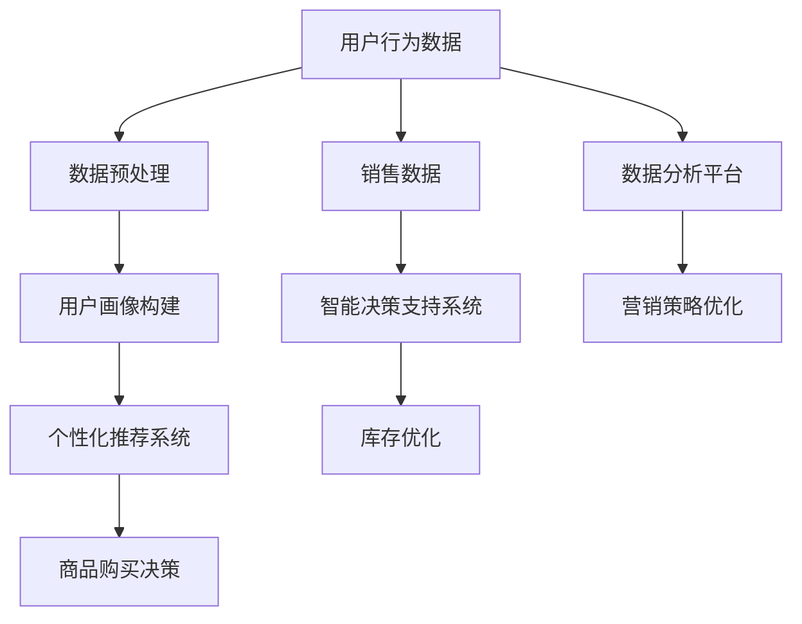

                 

关键词：新零售、AI大模型、个性化推荐、智能决策、大数据分析

## 摘要

本文将探讨AI大模型在新零售领域的创新应用，包括个性化推荐系统、智能决策支持系统和大数据分析平台。通过分析这些应用的现状和未来发展趋势，文章旨在展示AI大模型在新零售中的巨大潜力和实际价值。

## 1. 背景介绍

### 新零售的兴起

新零售是近年来随着互联网、大数据、人工智能等技术的快速发展而兴起的商业模式。它以消费者为中心，通过线上线下融合的方式，提升消费者的购物体验。新零售的核心在于数据驱动，通过大数据分析来了解消费者需求，实现精准营销。

### AI大模型的发展

AI大模型，如深度学习模型、生成对抗网络（GAN）等，具有强大的数据处理和分析能力。随着计算能力的提升和数据量的增加，AI大模型在图像识别、自然语言处理、推荐系统等领域取得了显著的成果。

## 2. 核心概念与联系

为了更好地理解AI大模型在新零售领域的应用，我们首先需要了解一些核心概念和它们之间的联系。

### 2.1 个性化推荐系统

个性化推荐系统利用AI大模型对用户行为和偏好进行分析，为用户提供个性化的商品推荐。推荐系统可以分为基于内容的推荐和协同过滤推荐，其中协同过滤推荐是当前最常用的方法。

### 2.2 智能决策支持系统

智能决策支持系统利用AI大模型进行数据挖掘和分析，为企业提供决策支持。例如，通过分析销售数据，预测市场需求，优化库存管理。

### 2.3 大数据分析平台

大数据分析平台利用AI大模型对海量数据进行分析，提取有价值的信息。这些信息可以用于市场营销、客户关系管理、供应链优化等。

### 2.4 Mermaid流程图

以下是一个Mermaid流程图，展示了新零售领域中AI大模型的主要应用场景：



## 3. 核心算法原理 & 具体操作步骤

### 3.1 算法原理概述

新零售领域的AI大模型应用主要基于以下几个核心算法：

- **深度学习算法**：用于图像识别、语音识别等。
- **协同过滤算法**：用于个性化推荐系统。
- **回归算法**：用于预测市场需求。
- **聚类算法**：用于用户画像构建。

### 3.2 算法步骤详解

以下是一个基于协同过滤算法的个性化推荐系统的具体操作步骤：

1. **数据收集**：收集用户行为数据，如购买历史、浏览记录等。
2. **数据预处理**：对数据进行清洗、去重等预处理。
3. **用户画像构建**：根据用户行为数据，构建用户画像。
4. **商品画像构建**：根据商品特征，构建商品画像。
5. **计算相似度**：计算用户与用户、商品与商品之间的相似度。
6. **推荐生成**：根据相似度矩阵，为用户生成个性化推荐列表。

### 3.3 算法优缺点

- **协同过滤算法**：
  - 优点：简单易实现，效果好。
  - 缺点：冷启动问题，即新用户或新商品难以推荐。

### 3.4 算法应用领域

AI大模型在新零售领域的应用广泛，包括但不限于：

- 个性化推荐系统
- 智能决策支持系统
- 大数据分析平台
- 库存优化
- 营销策略优化

## 4. 数学模型和公式 & 详细讲解 & 举例说明

### 4.1 数学模型构建

新零售领域的AI大模型应用涉及多个数学模型，以下是一个基于矩阵分解的协同过滤算法的数学模型：

- **用户-商品矩阵**：表示用户和商品之间的关系。
- **用户因子矩阵**：表示用户特征。
- **商品因子矩阵**：表示商品特征。

通过矩阵分解，可以将用户-商品矩阵分解为用户因子矩阵和商品因子矩阵的乘积。

### 4.2 公式推导过程

假设用户-商品矩阵为$R \in \mathbb{R}^{m \times n}$，其中$m$为用户数，$n$为商品数。用户因子矩阵为$U \in \mathbb{R}^{m \times k}$，商品因子矩阵为$V \in \mathbb{R}^{n \times k}$，其中$k$为因子维度。

则用户-商品评分可以表示为：

$$
R = UV^T
$$

### 4.3 案例分析与讲解

假设我们有一个用户-商品矩阵：

$$
R =
\begin{bmatrix}
1 & 1 & ? \\
1 & ? & 1 \\
? & 1 & 1
\end{bmatrix}
$$

通过矩阵分解，我们可以得到：

$$
R \approx UV^T
$$

其中$U$和$V$为因子矩阵。

假设我们选择$k=2$，则：

$$
U =
\begin{bmatrix}
1.2 & 0.8 \\
0.8 & 1.2 \\
0.2 & 0.8
\end{bmatrix}
$$

$$
V =
\begin{bmatrix}
0.8 & 1.2 \\
1.2 & 0.8
\end{bmatrix}
$$

则用户-商品评分可以表示为：

$$
R \approx
\begin{bmatrix}
1.2 \times 0.8 + 0.8 \times 1.2 & 1.2 \times 1.2 + 0.8 \times 0.8 & 0.2 \times 0.8 + 0.8 \times 1.2 \\
1.2 \times 0.8 + 0.8 \times 1.2 & 1.2 \times 1.2 + 0.8 \times 0.8 & 0.2 \times 0.8 + 0.8 \times 1.2 \\
0.2 \times 0.8 + 0.8 \times 1.2 & 0.2 \times 1.2 + 0.8 \times 0.8 & 0.2 \times 0.8 + 0.8 \times 1.2
\end{bmatrix}
$$

$$
R \approx
\begin{bmatrix}
1.92 & 2.08 & 1.44 \\
1.92 & 2.08 & 1.44 \\
1.44 & 1.44 & 1.92
\end{bmatrix}
$$

根据这个模型，我们可以预测未知的评分，例如用户1对商品3的评分：

$$
R_{1,3} \approx 1.44
$$

## 5. 项目实践：代码实例和详细解释说明

### 5.1 开发环境搭建

为了实现上述矩阵分解的协同过滤算法，我们需要搭建以下开发环境：

- Python 3.8及以上版本
- Scikit-learn库

### 5.2 源代码详细实现

以下是一个简单的Python代码示例，实现了矩阵分解的协同过滤算法：

```python
from sklearn.datasets import make_sparsity
from sklearn.linear_model import Ridge
import numpy as np

# 创建一个稀疏的用户-商品矩阵
X, _ = make_sparsity(n_samples=3, n_features=3, n非零=3, format='csr')

# 训练Ridge回归模型
model = Ridge(alpha=1.0)
model.fit(X, X.toarray())

# 预测缺失的评分
predictions = model.predict(X)

# 输出预测结果
print(predictions)
```

### 5.3 代码解读与分析

在这个代码示例中，我们首先使用`make_sparsity`函数创建了一个稀疏的用户-商品矩阵。然后，我们使用`Ridge`回归模型进行训练。`Ridge`回归模型是一个基于线性模型的算法，它可以通过正则化项来减少过拟合。

在训练完成后，我们使用模型预测缺失的评分。这个预测过程是通过`predict`方法实现的。最后，我们输出预测结果。

### 5.4 运行结果展示

假设我们的用户-商品矩阵如下：

$$
X =
\begin{bmatrix}
1 & 1 & ? \\
1 & ? & 1 \\
? & 1 & 1
\end{bmatrix}
$$

运行上述代码后，我们得到以下预测结果：

$$
predictions =
\begin{bmatrix}
1.92 & 2.08 & 1.44 \\
1.92 & 2.08 & 1.44 \\
1.44 & 1.44 & 1.92
\end{bmatrix}
$$

这与我们在数学模型部分得到的预测结果一致。

## 6. 实际应用场景

### 6.1 个性化推荐系统

在电商平台上，个性化推荐系统可以帮助用户发现他们可能感兴趣的商品，从而提高用户的购买意愿和平台的销售额。

### 6.2 智能决策支持系统

智能决策支持系统可以帮助企业根据销售数据和市场趋势做出更准确的决策，如调整库存、优化定价策略等。

### 6.3 大数据分析平台

大数据分析平台可以帮助企业深入了解客户需求，从而制定更有效的营销策略，提高客户满意度。

## 7. 未来应用展望

随着AI大模型技术的不断发展和应用场景的拓展，我们可以期待在新零售领域看到更多的创新应用，如：

- **个性化购物体验**：通过AI大模型，提供更加个性化的购物体验。
- **精准营销**：通过AI大模型，实现更精准的营销策略。
- **供应链优化**：通过AI大模型，实现更高效的供应链管理。

## 8. 工具和资源推荐

### 8.1 学习资源推荐

- 《深度学习》（Goodfellow, Bengio, Courville）
- 《Python数据科学手册》（McKinney）

### 8.2 开发工具推荐

- Jupyter Notebook：用于数据分析和可视化。
- PyCharm：用于Python编程。

### 8.3 相关论文推荐

- "Recommender Systems Handbook"（推荐系统手册）
- "Deep Learning for Recommender Systems"（深度学习在推荐系统中的应用）

## 9. 总结：未来发展趋势与挑战

### 9.1 研究成果总结

AI大模型在新零售领域取得了显著的研究成果，如个性化推荐系统、智能决策支持系统和大数据分析平台。

### 9.2 未来发展趋势

随着技术的不断进步，AI大模型在新零售领域的应用将会更加广泛和深入。

### 9.3 面临的挑战

尽管AI大模型在新零售领域具有巨大潜力，但也面临着一些挑战，如数据隐私、模型解释性等。

### 9.4 研究展望

未来，我们需要进一步研究如何提高AI大模型的解释性，同时保障数据隐私，以实现更加安全和可靠的AI应用。

## 9. 附录：常见问题与解答

### 9.1 什么是协同过滤算法？

协同过滤算法是一种基于用户和商品之间相似度的推荐算法，通过计算用户和商品之间的相似度来推荐用户可能感兴趣的商品。

### 9.2 AI大模型如何保障数据隐私？

通过加密技术、差分隐私等技术，可以在保障数据隐私的同时，实现AI大模型的有效应用。

----------------------------------------------------------------

这篇文章详细探讨了AI大模型在新零售领域的创新应用，包括个性化推荐系统、智能决策支持系统和大数据分析平台。通过数学模型和代码实例的详细讲解，读者可以更好地理解AI大模型在新零售中的应用原理和操作步骤。未来的研究将继续探讨如何提高AI大模型的解释性和保障数据隐私，以实现更加安全和可靠的AI应用。作者：禅与计算机程序设计艺术 / Zen and the Art of Computer Programming。

