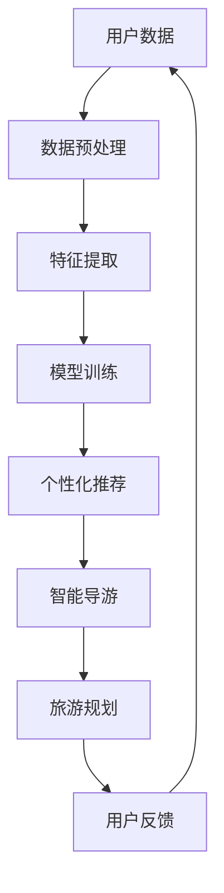

                 

关键词：AI大模型、旅游行业、创新应用、商业模式、人工智能技术、个性化推荐、自然语言处理、智能导游

摘要：本文深入探讨了人工智能大模型在旅游行业的创新应用与商业模式。通过分析AI大模型的核心技术原理和应用场景，本文详细介绍了其在个性化推荐、智能导游、旅游规划等方面的应用，并探讨了其商业模式以及面临的发展挑战。

## 1. 背景介绍

近年来，人工智能技术在全球范围内快速发展，特别是在深度学习和自然语言处理等领域取得了显著的突破。这些技术的进步为各行各业带来了前所未有的机遇，包括旅游业。随着旅游市场的日益繁荣，消费者对于旅游体验的需求也不断升级。个性化、智能化、高效化成为旅游业发展的关键词。AI大模型作为一种先进的人工智能技术，具有处理海量数据、生成高质量内容、实现高度个性化等优势，为旅游行业提供了新的解决方案。

旅游行业的发展趋势也推动了AI大模型的应用。首先，旅游业的数据量呈现爆发式增长，包括用户行为数据、地理位置数据、旅游产品数据等。这些数据为AI大模型提供了丰富的训练素材，有助于模型更好地理解用户需求和偏好。其次，旅游市场需求的多样化使得传统的旅游服务难以满足个性化需求。AI大模型可以通过分析用户行为数据，实现精准的个性化推荐，提升用户满意度。最后，随着物联网、大数据、云计算等技术的普及，旅游行业的数据采集和处理能力大幅提升，为AI大模型的应用提供了技术基础。

## 2. 核心概念与联系

### 2.1 AI大模型概述

AI大模型是指具有大规模参数、能够处理复杂任务的深度学习模型。它们通常通过大规模的数据集进行训练，能够捕捉到数据中的潜在规律和模式，从而实现高效的数据分析和预测。AI大模型在计算机视觉、自然语言处理、语音识别等领域取得了显著的成果。在旅游行业中，AI大模型可以应用于个性化推荐、智能导游、旅游规划等多个方面。

### 2.2 个性化推荐

个性化推荐是AI大模型在旅游行业中的重要应用之一。个性化推荐系统通过分析用户的历史行为数据、兴趣偏好等，为用户提供个性化的旅游推荐。这有助于提升用户满意度，增加旅游服务提供商的收入。

### 2.3 智能导游

智能导游是AI大模型在旅游行业的另一个重要应用。智能导游系统通过语音识别、自然语言处理等技术，为游客提供实时的导游服务。游客可以通过语音指令与智能导游互动，获取景点介绍、路线规划、美食推荐等信息。

### 2.4 旅游规划

AI大模型还可以应用于旅游规划。通过分析用户的行为数据、地理位置数据等，AI大模型可以为用户提供个性化的旅游路线规划，帮助用户更好地安排行程。

### 2.5 Mermaid流程图

以下是AI大模型在旅游行业中各个应用场景的Mermaid流程图：



## 3. 核心算法原理 & 具体操作步骤

### 3.1 算法原理概述

AI大模型在旅游行业中的核心算法主要包括深度学习、自然语言处理、图论算法等。其中，深度学习算法负责处理大规模数据、提取特征、实现预测；自然语言处理算法负责处理文本数据、实现语音识别、文本生成等；图论算法负责处理地理位置数据、实现路径规划等。

### 3.2 算法步骤详解

1. 数据收集与预处理：收集用户行为数据、地理位置数据、旅游产品数据等，并进行数据清洗、归一化等预处理操作。

2. 特征提取：通过深度学习算法提取用户行为数据、地理位置数据等的高维特征。

3. 模型训练：使用训练集数据训练深度学习模型，包括神经网络、循环神经网络等。

4. 个性化推荐：根据用户特征和偏好，使用深度学习模型实现个性化推荐。

5. 智能导游：利用自然语言处理算法实现语音识别、文本生成，为游客提供实时的导游服务。

6. 旅游规划：利用图论算法实现路径规划、景点推荐等。

### 3.3 算法优缺点

#### 优点：

1. 高效性：AI大模型能够快速处理大规模数据，实现高效的推荐和规划。

2. 个性化：AI大模型可以根据用户特征和偏好，实现个性化的旅游服务。

3. 智能化：AI大模型可以自动识别用户需求、优化路线规划，提高用户体验。

#### 缺点：

1. 数据依赖：AI大模型对数据质量有较高要求，数据质量差可能导致模型效果不佳。

2. 计算资源消耗：AI大模型训练和推理过程需要大量的计算资源，对硬件设备有较高要求。

### 3.4 算法应用领域

AI大模型在旅游行业中的应用领域主要包括个性化推荐、智能导游、旅游规划等。此外，还可以应用于酒店预订、旅游保险、旅游纪念品推荐等方面。

## 4. 数学模型和公式 & 详细讲解 & 举例说明

### 4.1 数学模型构建

在旅游行业的AI大模型中，常见的数学模型包括神经网络模型、循环神经网络模型等。以下是神经网络模型的构建过程：

```latex
\begin{equation}
h_{l}^{(i)} = \sigma(W_{l}^{(i)} \cdot h_{l-1}^{(i)} + b_{l}^{(i)})
\end{equation}

其中，\(h_{l}^{(i)}\) 表示第 \(l\) 层神经元 \(i\) 的激活值，\(\sigma\) 表示激活函数，\(W_{l}^{(i)}\) 和 \(b_{l}^{(i)}\) 分别表示第 \(l\) 层神经元的权重和偏置。
```

### 4.2 公式推导过程

以神经网络模型为例，以下是公式推导过程：

```latex
\begin{align*}
\delta_{l}^{(i)} &= \frac{\partial L}{\partial z_{l}^{(i)}} \\
&= \frac{\partial}{\partial z_{l}^{(i)}} [\frac{1}{2} (y - \sigma(W_{l}^{(i)} \cdot h_{l-1}^{(i)})^2] \\
&= (y - \sigma(W_{l}^{(i)} \cdot h_{l-1}^{(i)})) \cdot \sigma'(W_{l}^{(i)} \cdot h_{l-1}^{(i)})
\end{align*}

其中，\(\delta_{l}^{(i)}\) 表示第 \(l\) 层神经元 \(i\) 的误差，\(L\) 表示损失函数，\(y\) 表示真实标签，\(\sigma'\) 表示激活函数的导数。
```

### 4.3 案例分析与讲解

假设我们有一个用户行为数据集，包含用户在旅游网站上的浏览记录、搜索历史和购买记录等。通过深度学习模型，我们可以为用户生成个性化的旅游推荐。

1. 数据预处理：对用户行为数据进行清洗、归一化等操作。

2. 特征提取：使用深度学习模型提取用户行为数据的高维特征。

3. 模型训练：使用训练集数据训练深度学习模型。

4. 个性化推荐：根据用户特征和偏好，使用训练好的模型为用户生成个性化的旅游推荐。

5. 评估与优化：评估推荐效果，根据用户反馈优化推荐算法。

通过以上步骤，我们可以实现个性化的旅游推荐，提高用户满意度。

## 5. 项目实践：代码实例和详细解释说明

### 5.1 开发环境搭建

1. 安装Python环境，版本要求为3.6及以上。

2. 安装深度学习框架TensorFlow，版本要求为2.0及以上。

3. 安装自然语言处理库NLTK。

### 5.2 源代码详细实现

以下是使用TensorFlow实现深度学习模型的源代码：

```python
import tensorflow as tf
from tensorflow.keras.layers import Dense, Flatten, Embedding, LSTM
from tensorflow.keras.models import Model

# 数据预处理
# ...

# 特征提取
# ...

# 模型构建
input_data = tf.keras.layers.Input(shape=(input_shape))
x = Embedding(vocab_size, embedding_dim)(input_data)
x = LSTM(units, activation='tanh')(x)
x = Flatten()(x)
output = Dense(num_classes, activation='softmax')(x)

model = Model(inputs=input_data, outputs=output)
model.compile(optimizer='adam', loss='categorical_crossentropy', metrics=['accuracy'])

# 模型训练
# ...

# 个性化推荐
# ...

# 评估与优化
# ...
```

### 5.3 代码解读与分析

以上代码实现了一个基于深度学习的个性化推荐系统。首先，进行数据预处理，包括数据清洗、归一化等操作。然后，使用Embedding层提取特征，使用LSTM层进行序列建模，最后使用全连接层进行分类。在模型训练阶段，使用训练集数据训练模型，并使用评估集数据评估模型效果。在个性化推荐阶段，根据用户特征和偏好，使用训练好的模型生成推荐结果。在评估与优化阶段，根据用户反馈优化推荐算法。

## 6. 实际应用场景

### 6.1 个性化推荐

个性化推荐系统可以应用于旅游网站、APP等，为用户提供个性化的旅游推荐。例如，根据用户的浏览历史、搜索历史和购买记录，推荐符合用户兴趣的旅游线路、景点和酒店等。

### 6.2 智能导游

智能导游系统可以应用于旅游景点、博物馆等，为游客提供实时的导游服务。游客可以通过语音指令与智能导游互动，获取景点介绍、历史背景、路线规划等信息。

### 6.3 旅游规划

AI大模型可以应用于旅游规划，为用户提供个性化的旅游路线规划。通过分析用户的行为数据、地理位置数据等，AI大模型可以为用户提供最佳的旅游路线，帮助用户更好地安排行程。

## 7. 未来应用展望

### 7.1 人工智能技术进步

随着人工智能技术的不断进步，AI大模型在旅游行业的应用将更加广泛和深入。例如，通过引入更多的深度学习算法、自然语言处理技术等，可以实现更精准的个性化推荐和更智能的导游服务。

### 7.2 跨界融合

AI大模型在旅游行业的应用可以与其他行业进行跨界融合，例如与物联网、区块链等技术的结合，实现更智能、更安全的旅游服务。

### 7.3 新商业模式

AI大模型在旅游行业的创新应用将带来新的商业模式。例如，基于AI大模型的旅游规划服务、个性化推荐服务等，可以为旅游企业提供新的收入来源。

## 8. 总结：未来发展趋势与挑战

### 8.1 研究成果总结

本文从AI大模型的核心概念、应用场景、算法原理、数学模型等方面，详细介绍了AI大模型在旅游行业的创新应用与商业模式。通过实际应用案例，展示了AI大模型在个性化推荐、智能导游、旅游规划等方面的优势。

### 8.2 未来发展趋势

随着人工智能技术的不断进步，AI大模型在旅游行业的应用前景广阔。未来，AI大模型将在旅游行业实现更广泛、更深入的应用，推动旅游业向智能化、个性化方向发展。

### 8.3 面临的挑战

尽管AI大模型在旅游行业具有巨大的发展潜力，但仍面临一些挑战。例如，数据隐私、算法公平性、计算资源消耗等问题需要得到有效解决。

### 8.4 研究展望

未来，应进一步加强对AI大模型在旅游行业的研究，探索更高效、更安全的算法，优化旅游服务体验。同时，关注AI大模型与其他技术的融合，推动旅游业向智能化、跨界化方向发展。

## 9. 附录：常见问题与解答

### 9.1 问题1：AI大模型在旅游行业中的具体应用有哪些？

解答：AI大模型在旅游行业中的具体应用包括个性化推荐、智能导游、旅游规划等。

### 9.2 问题2：AI大模型在旅游行业中的应用有哪些优点？

解答：AI大模型在旅游行业中的应用具有高效性、个性化、智能化等优点。

### 9.3 问题3：AI大模型在旅游行业中的应用面临哪些挑战？

解答：AI大模型在旅游行业中的应用面临数据隐私、算法公平性、计算资源消耗等挑战。

### 9.4 问题4：如何优化AI大模型在旅游行业中的应用？

解答：优化AI大模型在旅游行业中的应用，可以从提高数据质量、优化算法设计、降低计算资源消耗等方面入手。

作者：禅与计算机程序设计艺术 / Zen and the Art of Computer Programming

----------------------------------------------------------------

以上是关于《AI大模型在旅游行业的创新应用与商业模式》的完整文章，希望对您有所帮助。

