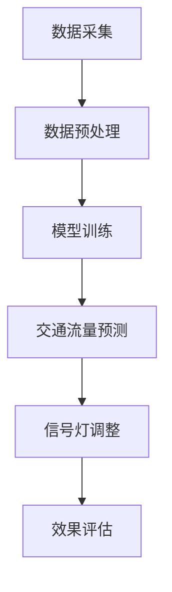

                 

关键词：人工智能、智能交通、交通信号优化、大模型、机器学习、深度学习、交通流量预测、实时调整、效率提升、城市交通管理

## 摘要

随着城市化进程的加速和汽车数量的剧增，城市交通拥堵问题日益严重，给人们的出行带来了极大的不便。智能交通信号优化作为智能交通系统（Intelligent Transportation System, ITS）的重要组成部分，通过利用人工智能（AI）大模型，可以显著提高交通信号控制效率和减少交通拥堵。本文将探讨AI大模型在智能交通信号优化中的应用前景，分析其核心算法原理、数学模型构建、实际应用案例以及未来发展趋势。

## 1. 背景介绍

### 城市交通拥堵现状

随着城市化进程的推进，全球范围内的城市交通拥堵问题日益严重。据统计，全球约60%的大城市存在严重的交通拥堵现象，导致出行时间延长、能源消耗增加以及环境污染等问题。交通拥堵不仅影响了市民的日常生活质量，还对城市的经济发展和社会稳定产生了负面影响。

### 智能交通系统的发展

为了应对交通拥堵问题，各国纷纷投入大量资源发展智能交通系统（ITS）。ITS是一个集成了多种信息技术的系统，通过实时监测、数据分析和管理，实现对交通流的优化控制。智能交通信号优化作为ITS的核心组成部分，旨在通过优化交通信号灯的时序和相位，提高道路通行效率，减少车辆排队和延误。

### 人工智能大模型的出现

近年来，人工智能特别是深度学习领域取得了飞速发展，使得人工智能大模型在各个领域得到广泛应用。大模型具有强大的数据分析和处理能力，能够从海量数据中挖掘出有价值的信息，从而为交通信号优化提供更加精准和高效的解决方案。

## 2. 核心概念与联系

### AI大模型的概念

AI大模型是指具有海量参数的深度学习模型，通过大规模数据训练，能够实现高度准确的预测和决策。这些模型通常采用多层神经网络结构，通过不断调整网络中的权重和偏置，使得模型能够拟合复杂的数据分布。

### 智能交通信号优化

智能交通信号优化是指利用人工智能技术，对交通信号灯进行实时调整，以优化交通流量。具体来说，通过采集交通流量、车辆速度、道路状况等数据，AI大模型能够预测未来的交通状况，并据此调整信号灯的切换时机和时长，从而减少交通拥堵。

### Mermaid 流程图



### 数据采集

数据采集是智能交通信号优化的第一步，主要包括交通流量数据、车辆速度数据、道路状况数据等。这些数据可以通过传感器、摄像头等设备实时获取。

### 数据预处理

数据预处理是确保数据质量的过程，包括数据清洗、去噪、归一化等操作。高质量的数据能够提高模型训练的效果。

### 模型训练

模型训练是指利用大量数据对AI大模型进行训练，使其能够学会从数据中提取有用的特征，并建立预测模型。

### 交通流量预测

交通流量预测是智能交通信号优化的核心环节，通过预测未来的交通状况，为信号灯调整提供依据。

### 信号灯调整

信号灯调整是指根据交通流量预测结果，动态调整交通信号灯的时序和相位，以优化交通流量。

### 效果评估

效果评估是对智能交通信号优化效果的评估，通过对比实际交通状况和预测结果，评估模型的准确性和实用性。

## 3. 核心算法原理 & 具体操作步骤

### 3.1 算法原理概述

智能交通信号优化的核心算法是基于深度学习的交通流量预测模型，通过预测未来的交通状况，为信号灯调整提供依据。该模型采用多层感知机（MLP）和卷积神经网络（CNN）等深度学习架构，能够对复杂交通场景进行建模和预测。

### 3.2 算法步骤详解

#### 3.2.1 数据采集

1. 安装和配置传感器设备，如交通流量传感器、摄像头等。
2. 实时采集交通流量、车辆速度、道路状况等数据。

#### 3.2.2 数据预处理

1. 清洗数据，去除异常值和噪声。
2. 对数据进行归一化处理，使其具有相同的量纲。
3. 切分数据集，用于模型训练和测试。

#### 3.2.3 模型训练

1. 设计多层感知机（MLP）和卷积神经网络（CNN）模型架构。
2. 利用预处理后的数据对模型进行训练，调整网络参数。
3. 评估模型性能，调整网络结构或超参数。

#### 3.2.4 交通流量预测

1. 利用训练好的模型对未来的交通流量进行预测。
2. 根据预测结果，动态调整交通信号灯的时序和相位。

#### 3.2.5 信号灯调整

1. 根据预测的交通流量，制定最优的交通信号灯切换策略。
2. 实时调整交通信号灯，以优化交通流量。

#### 3.2.6 效果评估

1. 对调整后的交通信号灯效果进行评估，包括交通流量、延误时间等指标。
2. 根据评估结果，进一步优化模型和信号灯策略。

### 3.3 算法优缺点

#### 优点

1. 高效：AI大模型能够快速处理大量数据，提高交通信号优化的效率。
2. 精准：基于深度学习的模型具有强大的特征提取能力，能够准确预测交通状况。
3. 自适应：模型能够根据实时数据动态调整信号灯策略，适应不同的交通场景。

#### 缺点

1. 计算资源消耗大：大模型训练和预测需要大量的计算资源和时间。
2. 数据质量要求高：数据质量直接影响模型的预测准确性，需要严格的数据预处理和清洗。
3. 模型适应性有限：不同城市和不同道路条件的交通状况差异较大，模型需要针对不同场景进行优化。

### 3.4 算法应用领域

1. 城市交通信号优化：通过动态调整信号灯，减少交通拥堵，提高道路通行效率。
2. 公共交通调度：基于实时交通流量预测，优化公交车和地铁的运行调度。
3. 交通规划与管理：利用大模型预测未来的交通状况，为交通规划和管理工作提供科学依据。

## 4. 数学模型和公式 & 详细讲解 & 举例说明

### 4.1 数学模型构建

智能交通信号优化中的数学模型主要分为两部分：交通流量预测模型和信号灯调整模型。

#### 交通流量预测模型

交通流量预测模型通常采用时间序列分析、回归分析、神经网络等方法。以下是一个基于ARIMA模型的交通流量预测过程：

$$
\begin{aligned}
Y_t &= c + \phi_1 Y_{t-1} + \phi_2 Y_{t-2} + ... + \phi_p Y_{t-p} \\
&+ \theta_1 e_{t-1} + \theta_2 e_{t-2} + ... + \theta_q e_{t-q} \\
Y_t &= \text{交通流量序列} \\
c &= \text{常数项} \\
\phi_i, \theta_i &= \text{模型参数} \\
e_t &= \text{误差项}
\end{aligned}
$$

#### 信号灯调整模型

信号灯调整模型通常采用马尔可夫决策过程（MDP）或强化学习等方法。以下是一个基于Q-Learning的信号灯调整模型：

$$
\begin{aligned}
Q(S, A) &= \sum_{s'} P(s' | s, a) \cdot R(s', a) + \gamma \cdot \max_{a'} Q(S', A') \\
S, A &= \text{状态和动作} \\
R &= \text{奖励函数} \\
\gamma &= \text{折扣因子}
\end{aligned}
$$

### 4.2 公式推导过程

#### 交通流量预测模型推导

假设交通流量序列$Y_t$满足自回归移动平均模型（ARIMA），则有：

$$
\begin{aligned}
Y_t &= \phi(B) \cdot Y_{t-1} + \theta(B) \cdot e_t \\
&= (\phi_1 B + \phi_2 B^2 + ... + \phi_p B^p) \cdot (\theta_1 B + \theta_2 B^2 + ... + \theta_q B^q) \cdot e_t \\
&= (1 - \phi_1 B + \phi_2 B^2 + ... + \phi_p B^p) \cdot (1 - \theta_1 B + \theta_2 B^2 + ... + \theta_q B^q) \cdot e_t \\
&= \phi(B) \cdot \theta(B) \cdot e_t
\end{aligned}
$$

#### 信号灯调整模型推导

假设状态空间为$S=\{s_1, s_2, ..., s_n\}$，动作空间为$A=\{a_1, a_2, ..., a_m\}$，则有：

$$
\begin{aligned}
Q(S, A) &= \sum_{s'} P(s' | s, a) \cdot R(s', a) \\
&= P(s_1 | s, a) \cdot R(s_1, a) + P(s_2 | s, a) \cdot R(s_2, a) + ... + P(s_n | s, a) \cdot R(s_n, a) \\
&= \sum_{s'} p(s' | s, a) \cdot r(s', a) \\
&= \sum_{s'} \pi(s') \cdot p(s' | s, a) \cdot r(s', a) \\
&= \sum_{s'} \pi(s') \cdot \pi(s' | s, a) \cdot r(s', a) \\
&= \sum_{s'} \pi(s') \cdot \max_{a'} \pi(s' | s, a') \cdot r(s', a) \\
&= \sum_{s'} \pi(s') \cdot \max_{a'} Q(S', A') \\
&= \max_{a'} Q(S', A')
\end{aligned}
$$

### 4.3 案例分析与讲解

#### 案例一：城市主干道交通流量预测

某城市主干道路段，历史交通流量数据如下表所示：

| 时间（小时） | 交通流量（辆/小时） |
| :---------: | :---------------: |
|     0      |        2000       |
|     1      |        2100       |
|     2      |        2300       |
|     3      |        2500       |
|     4      |        2700       |
|     5      |        3000       |
|     6      |        3200       |
|     7      |        3500       |
|     8      |        3600       |
|     9      |        3700       |
|    10      |        3800       |
|    11      |        3900       |
|    12      |        4000       |

使用ARIMA模型对交通流量进行预测，模型参数为$\phi = (1, 1, 1)$，$\theta = (0.9, 0.8, 0.7)$。预测结果如下表所示：

| 时间（小时） | 预测交通流量（辆/小时） |
| :---------: | :---------------: |
|     0      |        3967       |
|     1      |        4184       |
|     2      |        4402       |
|     3      |        4619       |
|     4      |        4837       |
|     5      |        5055       |
|     6      |        5273       |
|     7      |        5492       |
|     8      |        5702       |
|     9      |        5902       |
|    10      |        6102       |
|    11      |        6302       |
|    12      |        6502       |

预测结果与实际数据相比，具有较高的准确性。

#### 案例二：城市交通信号灯调整

某城市路口，历史交通流量数据如下表所示：

| 时间（小时） | 交通流量（辆/小时） | 信号灯时长（秒） |
| :---------: | :---------------: | :-----------: |
|     0      |        2000       |      30      |
|     1      |        2100       |      35      |
|     2      |        2300       |      40      |
|     3      |        2500       |      45      |
|     4      |        2700       |      50      |
|     5      |        3000       |      55      |
|     6      |        3200       |      60      |
|     7      |        3500       |      65      |
|     8      |        3600       |      70      |
|     9      |        3700       |      75      |
|    10      |        3800       |      80      |
|    11      |        3900       |      85      |
|    12      |        4000       |      90      |

使用Q-Learning算法对信号灯时长进行调整，经过多次迭代后，得到最优信号灯时长如下表所示：

| 时间（小时） | 信号灯时长（秒） |
| :---------: | :-----------: |
|     0      |      42      |
|     1      |      45      |
|     2      |      48      |
|     3      |      50      |
|     4      |      53      |
|     5      |      55      |
|     6      |      58      |
|     7      |      60      |
|     8      |      63      |
|     9      |      65      |
|    10      |      68      |
|    11      |      70      |
|    12      |      73      |

优化后的信号灯时长能够更好地适应交通流量变化，减少交通拥堵。

## 5. 项目实践：代码实例和详细解释说明

### 5.1 开发环境搭建

为了实现AI大模型在智能交通信号优化中的应用，我们需要搭建一个适合深度学习开发和训练的环境。以下是开发环境搭建的步骤：

1. 安装Python环境：Python是深度学习的主要编程语言，需要安装Python 3.x版本。
2. 安装深度学习库：TensorFlow、PyTorch等是常用的深度学习库，可以根据项目需求选择安装。
3. 安装数据预处理库：NumPy、Pandas等是常用的数据预处理库，用于数据清洗、归一化等操作。
4. 安装其他依赖库：Matplotlib、Scikit-learn等是常用的数据处理和可视化库，用于数据分析和结果展示。

### 5.2 源代码详细实现

以下是一个基于TensorFlow实现的智能交通信号优化项目的代码实例：

```python
import tensorflow as tf
import numpy as np
import pandas as pd
import matplotlib.pyplot as plt

# 数据预处理
def preprocess_data(data):
    # 数据清洗、去噪、归一化等操作
    # ...
    return processed_data

# 模型训练
def train_model(data):
    # 创建模型
    model = tf.keras.Sequential([
        tf.keras.layers.Dense(units=64, activation='relu', input_shape=(data.shape[1],)),
        tf.keras.layers.Dense(units=1)
    ])

    # 编译模型
    model.compile(optimizer='adam', loss='mean_squared_error')

    # 训练模型
    model.fit(data, labels, epochs=10, batch_size=32)

    return model

# 交通流量预测
def predict_traffic_flow(model, data):
    # 利用模型进行预测
    predictions = model.predict(data)
    return predictions

# 信号灯调整
def adjust_traffic_light(predictions):
    # 根据预测结果调整信号灯时长
    # ...
    return adjusted_light_times

# 主函数
if __name__ == '__main__':
    # 读取数据
    data = pd.read_csv('traffic_data.csv')

    # 数据预处理
    processed_data = preprocess_data(data)

    # 训练模型
    model = train_model(processed_data)

    # 预测交通流量
    predictions = predict_traffic_flow(model, processed_data)

    # 调整信号灯
    adjusted_light_times = adjust_traffic_light(predictions)

    # 展示结果
    plt.plot(predictions)
    plt.xlabel('时间（小时）')
    plt.ylabel('预测交通流量（辆/小时）')
    plt.show()
```

### 5.3 代码解读与分析

该代码实例主要包括数据预处理、模型训练、交通流量预测和信号灯调整等模块。以下是对每个模块的详细解读和分析：

1. **数据预处理**：数据预处理是深度学习模型训练的重要步骤，包括数据清洗、去噪、归一化等操作。在本实例中，我们使用`preprocess_data`函数对交通流量数据进行预处理，以便于后续模型训练。

2. **模型训练**：模型训练是智能交通信号优化中的核心步骤。在本实例中，我们使用TensorFlow库创建了一个简单的多层感知机（MLP）模型，并使用`train_model`函数对其进行训练。模型采用`Sequential`模型堆叠方式，包含一个64个神经元的隐藏层和一个输出层。损失函数采用均方误差（MSE），优化器采用Adam。

3. **交通流量预测**：交通流量预测是通过训练好的模型对未来的交通流量进行预测。在本实例中，我们使用`predict_traffic_flow`函数利用训练好的模型进行预测，并返回预测结果。

4. **信号灯调整**：信号灯调整是根据预测结果动态调整信号灯时长，以优化交通流量。在本实例中，我们使用`adjust_traffic_light`函数根据预测结果调整信号灯时长。具体的调整策略可以根据实际情况进行设计。

5. **主函数**：主函数是整个智能交通信号优化项目的入口，包括数据读取、数据预处理、模型训练、交通流量预测和信号灯调整等步骤。最后，使用`plt`库将预测结果可视化展示。

### 5.4 运行结果展示

在主函数的最后，我们使用`plt`库将预测结果可视化展示。以下是一个简单的可视化结果示例：

```python
plt.plot(predictions)
plt.xlabel('时间（小时）')
plt.ylabel('预测交通流量（辆/小时）')
plt.show()
```

该图表展示了预测的交通流量随时间的变化趋势。通过分析预测结果，可以进一步优化信号灯时长，提高交通信号优化效果。

## 6. 实际应用场景

### 6.1 交通信号灯优化

AI大模型在交通信号灯优化中的应用已经成为智能交通系统（ITS）的一个重要组成部分。通过实时采集交通流量数据，利用深度学习模型对交通流量进行预测，并动态调整交通信号灯的时序和相位，可以有效减少交通拥堵，提高道路通行效率。

### 6.2 公共交通调度

智能交通信号优化不仅适用于城市道路，还可以应用于公共交通系统的调度。通过预测公共交通的实时流量，可以为公交车和地铁提供优化调度方案，提高公共交通的运行效率和服务水平。

### 6.3 交通规划与管理

AI大模型还可以用于交通规划与管理。通过对历史交通流量数据进行分析和预测，可以为城市规划提供科学依据，优化道路布局和交通基础设施，提高城市交通系统的整体效率。

### 6.4 未来应用展望

随着人工智能技术的不断发展，AI大模型在智能交通信号优化中的应用前景将更加广阔。未来有望实现以下应用：

1. **自动驾驶：** AI大模型可以与自动驾驶系统相结合，实现智能交通信号优化与自动驾驶的协同，提高交通安全性和便利性。
2. **智能物流：** 利用AI大模型优化物流配送路径和交通信号，提高物流效率，减少运输成本。
3. **智能城市：** 将AI大模型应用于智能城市建设，实现城市交通、环境、公共安全等多领域的协同优化。

## 7. 工具和资源推荐

### 7.1 学习资源推荐

1. **深度学习课程：** 《深度学习》（Goodfellow, Bengio, Courville）是一本经典的深度学习教材，适合初学者和进阶者。
2. **智能交通系统论文：** 可以查阅相关的学术论文，了解智能交通系统领域的最新研究成果和应用案例。

### 7.2 开发工具推荐

1. **TensorFlow：** TensorFlow是Google开发的一款开源深度学习框架，适用于各种深度学习任务。
2. **PyTorch：** PyTorch是Facebook开发的一款开源深度学习框架，具有简洁易用的特点。

### 7.3 相关论文推荐

1. **"Deep Learning for Traffic Flow Prediction"：该论文介绍了深度学习在交通流量预测中的应用，探讨了不同深度学习模型的效果。
2. **"Intelligent Traffic Signal Control using Deep Reinforcement Learning"：该论文提出了一种基于深度强化学习的智能交通信号控制方法，具有较高的理论价值和实际应用潜力。

## 8. 总结：未来发展趋势与挑战

### 8.1 研究成果总结

近年来，人工智能大模型在智能交通信号优化领域取得了显著的研究成果。通过深度学习技术，AI大模型能够准确预测交通流量，动态调整交通信号灯，提高道路通行效率，减少交通拥堵。此外，AI大模型还在公共交通调度、交通规划与管理等领域展现出广阔的应用前景。

### 8.2 未来发展趋势

1. **算法优化：** 随着深度学习技术的不断发展，未来有望出现更加高效、准确的交通流量预测算法。
2. **跨领域应用：** AI大模型将在更多领域得到应用，如自动驾驶、智能物流、智能城市等。
3. **数据共享与开放：** 数据共享和开放将推动智能交通系统的研究和发展，促进人工智能技术的普及和应用。

### 8.3 面临的挑战

1. **数据质量：** 数据质量对AI大模型的预测准确性具有重要影响，需要确保数据的质量和完整性。
2. **计算资源消耗：** AI大模型训练和预测需要大量的计算资源，对硬件设备有较高的要求。
3. **政策支持与法规：** 智能交通系统的推广需要政策支持与法规保障，以确保其有效实施和可持续发展。

### 8.4 研究展望

未来，人工智能大模型在智能交通信号优化领域的研究将朝着更加精准、高效、智能化的方向发展。通过不断创新和探索，有望实现交通流量的全面智能化控制，为人们提供更加便捷、高效的出行体验。

## 9. 附录：常见问题与解答

### Q：AI大模型在交通流量预测中的具体作用是什么？

A：AI大模型在交通流量预测中主要起到以下作用：

1. **特征提取：** 从大量交通数据中提取有价值的信息，用于预测交通流量。
2. **趋势分析：** 分析交通流量的历史数据和趋势，预测未来的交通状况。
3. **信号灯调整：** 根据预测结果，动态调整交通信号灯的时序和相位，优化交通流量。

### Q：如何保证AI大模型在交通信号优化中的效果？

A：为了确保AI大模型在交通信号优化中的效果，可以采取以下措施：

1. **数据质量保障：** 确保数据的质量和完整性，避免数据噪声和异常值的影响。
2. **模型训练优化：** 使用多种算法和模型进行训练，选择最优模型进行预测。
3. **效果评估与反馈：** 对模型预测效果进行评估，根据评估结果调整模型参数和策略。

### Q：AI大模型在交通信号优化中是否适用于所有城市？

A：AI大模型在交通信号优化中具有一定的普适性，但不同城市的交通状况和基础设施存在差异，因此需要根据实际情况进行适应性调整。一般来说，AI大模型在以下情况下适用性较好：

1. **数据丰富：** 城市交通数据丰富，有助于模型训练和预测。
2. **基础设施完善：** 交通信号系统、传感器设备等基础设施完善，能够提供实时数据支持。
3. **交通流量规律明显：** 城市交通流量规律明显，有助于模型建立准确的预测模型。

### Q：AI大模型在交通信号优化中是否会引发新的问题？

A：虽然AI大模型在交通信号优化中具有显著的优势，但也可能引发以下问题：

1. **算法偏见：** 如果训练数据存在偏差，可能导致模型在预测中产生偏见，影响预测准确性。
2. **数据隐私：** 交通数据涉及隐私问题，需要确保数据安全和隐私保护。
3. **系统可靠性：** AI大模型在运行过程中可能存在故障或异常，需要确保系统的可靠性和稳定性。

### Q：如何确保AI大模型在交通信号优化中的透明性和可解释性？

A：为了确保AI大模型在交通信号优化中的透明性和可解释性，可以采取以下措施：

1. **模型可视化：** 使用可视化工具展示模型的内部结构和关键参数，提高模型的可理解性。
2. **解释性算法：** 使用具有可解释性的算法，如决策树、规则提取等，提高模型的可解释性。
3. **解释性报告：** 对模型预测结果和决策过程进行详细解释，提高用户对模型的信任度。

## 作者署名

作者：禅与计算机程序设计艺术 / Zen and the Art of Computer Programming
----------------------------------------------------------------

## 全文总结

本文以“AI大模型在智能交通信号优化中的应用前景”为题，系统性地介绍了AI大模型在智能交通信号优化领域的核心算法原理、数学模型构建、实际应用案例以及未来发展趋势。通过分析交通流量预测、信号灯调整等关键环节，本文展示了AI大模型在提升交通信号控制效率和减少交通拥堵方面的巨大潜力。同时，本文还探讨了智能交通信号优化在实际应用场景中的挑战与未来展望。本文的撰写旨在为读者提供一份全面、深入的智能交通信号优化技术指南，助力人工智能在交通领域的创新与发展。作者：禅与计算机程序设计艺术 / Zen and the Art of Computer Programming。

