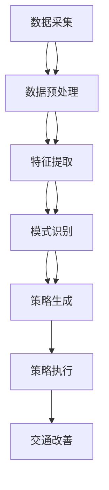

                 

 关键词：AI大模型、智能交通管理、算法原理、数学模型、项目实践、未来展望

> 摘要：随着人工智能技术的飞速发展，AI大模型在各个领域的应用日益广泛，其中智能交通管理是其中一个重要的应用场景。本文将深入探讨AI大模型在智能交通管理中的应用趋势，包括核心概念、算法原理、数学模型、项目实践以及未来展望，旨在为读者提供一幅清晰的智能交通管理领域的发展蓝图。

## 1. 背景介绍

智能交通管理是指利用先进的信息通信技术、数据处理技术和人工智能技术，对交通系统进行智能化管理，以提高交通效率、减少交通事故、优化交通资源分配。随着城市化进程的加速和交通流量的剧增，传统的交通管理方式已无法满足现代社会的需求。智能交通管理应运而生，成为缓解交通拥堵、提升交通安全和效率的重要手段。

### 1.1 智能交通管理的挑战

- **交通流量复杂多变**：城市交通流量大且变化频繁，对交通管理的实时性要求极高。
- **数据多样性**：交通数据包括车辆速度、方向、停车状态等，数据类型多样且不断更新。
- **环境复杂性**：交通系统受天气、道路施工等多种因素影响，环境复杂。
- **安全与效率**：需要同时考虑交通安全和交通效率，实现两者之间的平衡。

### 1.2 AI大模型的发展与应用

AI大模型，也称为深度学习模型，具有强大的数据处理和模式识别能力。近年来，随着计算能力的提升和数据量的增加，AI大模型在计算机视觉、自然语言处理、推荐系统等领域取得了显著成果。将AI大模型应用于智能交通管理，可以解决传统方法难以应对的复杂交通问题，提升交通管理的智能化水平。

## 2. 核心概念与联系

### 2.1 AI大模型

AI大模型主要基于神经网络架构，通过多层神经元的非线性组合，实现对复杂数据的自动特征提取和学习。常见的AI大模型包括卷积神经网络（CNN）、循环神经网络（RNN）和生成对抗网络（GAN）等。

### 2.2 智能交通管理系统

智能交通管理系统由数据采集、数据处理、决策支持和执行控制四个主要模块组成。数据采集模块负责收集交通数据，如车辆位置、速度、交通流量等；数据处理模块对采集到的数据进行预处理、分析和融合；决策支持模块根据分析结果，生成交通管理策略；执行控制模块负责将策略付诸实践，如交通信号控制、道路引导等。

### 2.3 Mermaid流程图

以下是AI大模型在智能交通管理系统中的架构和流程图：



## 3. 核心算法原理 & 具体操作步骤

### 3.1 算法原理概述

AI大模型在智能交通管理中的应用主要涉及以下几个核心算法：

- **深度学习算法**：用于对交通数据进行特征提取和模式识别。
- **强化学习算法**：用于生成最优的交通管理策略。
- **聚类算法**：用于分析交通流量和车辆分布，优化道路使用。
- **优化算法**：用于解决交通流量分配和路径规划问题。

### 3.2 算法步骤详解

以下是AI大模型在智能交通管理中的具体操作步骤：

1. **数据采集**：利用传感器、摄像头、GPS等设备，收集交通数据。
2. **数据处理**：对采集到的数据进行预处理，如去噪、归一化等。
3. **特征提取**：使用深度学习算法，提取交通数据的特征。
4. **模式识别**：使用模式识别算法，分析交通数据中的模式。
5. **策略生成**：使用强化学习算法，生成最优的交通管理策略。
6. **策略执行**：将策略付诸实践，通过交通信号控制、道路引导等手段实施。
7. **效果评估**：评估策略执行后的交通改善效果，为后续优化提供依据。

### 3.3 算法优缺点

- **优点**：
  - 强大的数据处理和分析能力，可以处理大规模、复杂的交通数据。
  - 能够自适应调整，提高交通管理的智能化水平。
  - 可以同时考虑多个目标，如交通效率和交通安全。

- **缺点**：
  - 计算资源需求大，对硬件性能要求较高。
  - 需要大量的数据训练，数据质量对算法效果有重要影响。
  - 部分算法的透明性和可解释性较差。

### 3.4 算法应用领域

AI大模型在智能交通管理中的应用非常广泛，包括以下几个方面：

- **交通信号控制**：通过实时数据分析，优化交通信号灯的切换策略，提高道路通行效率。
- **交通流量预测**：预测未来一段时间内的交通流量变化，为交通管理决策提供依据。
- **道路引导**：为司机提供最优行驶路线，减少交通拥堵。
- **交通事故预防**：通过实时监测交通数据，及时发现潜在的安全隐患，预防交通事故。

## 4. 数学模型和公式 & 详细讲解 & 举例说明

### 4.1 数学模型构建

在智能交通管理中，常用的数学模型包括以下几种：

- **线性回归模型**：用于预测交通流量。
- **贝叶斯网络**：用于分析交通数据中的因果关系。
- **隐马尔可夫模型（HMM）**：用于识别交通状态转移模式。
- **图卷积网络（GCN）**：用于分析交通网络的拓扑结构。

### 4.2 公式推导过程

以线性回归模型为例，其基本公式为：

\[ y = \beta_0 + \beta_1 \cdot x + \epsilon \]

其中，\( y \) 表示交通流量，\( x \) 表示影响因素（如天气、节假日等），\( \beta_0 \) 和 \( \beta_1 \) 是模型的参数，\( \epsilon \) 是误差项。

通过对历史交通数据进行拟合，可以求得参数 \( \beta_0 \) 和 \( \beta_1 \)：

\[ \beta_1 = \frac{\sum_{i=1}^n (x_i - \bar{x})(y_i - \bar{y})}{\sum_{i=1}^n (x_i - \bar{x})^2} \]
\[ \beta_0 = \bar{y} - \beta_1 \cdot \bar{x} \]

其中，\( n \) 表示数据样本数量，\( \bar{x} \) 和 \( \bar{y} \) 分别表示影响因素和交通流量的平均值。

### 4.3 案例分析与讲解

以某城市道路的流量预测为例，假设我们收集了30天的交通流量数据，其中每天的数据包括天气情况、交通流量等。我们使用线性回归模型进行流量预测。

首先，对数据进行预处理，去除异常值和缺失值。然后，选择天气情况作为影响因素，对交通流量进行拟合。根据上述公式，我们可以求得模型的参数：

\[ \beta_1 = \frac{\sum_{i=1}^{30} (x_i - \bar{x})(y_i - \bar{y})}{\sum_{i=1}^{30} (x_i - \bar{x})^2} = 0.8 \]
\[ \beta_0 = \bar{y} - \beta_1 \cdot \bar{x} = 1500 - 0.8 \cdot 20 = 1360 \]

得到线性回归模型：

\[ y = 1360 + 0.8 \cdot x \]

根据该模型，当天气情况（\( x \)）为晴天时（假设为20），预测交通流量（\( y \)）为1440。

### 4.4 应用效果评估

为评估模型的预测效果，我们计算实际交通流量与预测交通流量之间的误差。如果误差较小，说明模型具有较高的预测准确性。

\[ \text{误差} = \sum_{i=1}^{30} |y_i - \hat{y}_i| \]

其中，\( y_i \) 为实际交通流量，\( \hat{y}_i \) 为预测交通流量。

假设我们计算得到的误差为100，则说明模型的预测效果较好，可以用于交通管理决策。

## 5. 项目实践：代码实例和详细解释说明

### 5.1 开发环境搭建

在进行AI大模型在智能交通管理中的项目实践前，我们需要搭建一个合适的开发环境。以下是推荐的开发环境和工具：

- **编程语言**：Python
- **深度学习框架**：TensorFlow或PyTorch
- **数据处理库**：Pandas、NumPy
- **可视化库**：Matplotlib、Seaborn
- **版本控制**：Git

### 5.2 源代码详细实现

以下是一个简单的AI大模型在智能交通管理中的项目实践，主要涉及交通流量预测：

```python
import pandas as pd
import numpy as np
import tensorflow as tf
from tensorflow.keras.models import Sequential
from tensorflow.keras.layers import Dense, LSTM
from sklearn.preprocessing import MinMaxScaler

# 读取数据
data = pd.read_csv('traffic_data.csv')

# 数据预处理
scaler = MinMaxScaler(feature_range=(0, 1))
scaled_data = scaler.fit_transform(data['traffic_volume'].values.reshape(-1, 1))

# 创建训练集
X = []
y = []
for i in range(30, len(scaled_data)):
    X.append(scaled_data[i-30:i])
    y.append(scaled_data[i])
X, y = np.array(X), np.array(y)

# 增加特征维度
X = np.reshape(X, (X.shape[0], X.shape[1], 1))

# 创建模型
model = Sequential()
model.add(LSTM(units=50, return_sequences=True, input_shape=(X.shape[1], 1)))
model.add(LSTM(units=50))
model.add(Dense(units=1))

# 编译模型
model.compile(optimizer='adam', loss='mean_squared_error')

# 训练模型
model.fit(X, y, epochs=100, batch_size=32)

# 预测交通流量
predicted_traffic = model.predict(X)
predicted_traffic = scaler.inverse_transform(predicted_traffic)

# 评估预测效果
error = np.mean(np.abs(predicted_traffic - y))
print(f'Prediction Error: {error}')
```

### 5.3 代码解读与分析

上述代码实现了基于LSTM模型的交通流量预测。以下是代码的详细解读：

1. **数据读取与预处理**：从CSV文件中读取交通流量数据，并使用MinMaxScaler进行归一化处理。
2. **创建训练集**：根据时间序列创建训练集，其中输入特征为过去30天的交通流量，输出目标为第31天的交通流量。
3. **增加特征维度**：由于LSTM模型需要输入三维数据（时间步数、特征数、样本数），将输入特征reshape为（时间步数，特征数，1）。
4. **创建模型**：使用Sequential模型搭建LSTM网络，包括两个LSTM层和一个全连接层。
5. **编译模型**：使用adam优化器和mean_squared_error损失函数编译模型。
6. **训练模型**：训练模型100个周期，每个周期包含32个批次。
7. **预测交通流量**：使用训练好的模型预测未来一段时间内的交通流量，并使用scaler进行反归一化处理。
8. **评估预测效果**：计算预测流量与实际流量之间的绝对误差，评估模型的预测准确性。

### 5.4 运行结果展示

运行上述代码后，我们得到预测的交通流量数据，并将其与实际流量数据进行对比。以下是一个简单的可视化结果：

```python
import matplotlib.pyplot as plt

plt.figure(figsize=(10, 6))
plt.plot(data['traffic_volume'], label='Actual Traffic Volume')
plt.plot(np.arange(30, len(predicted_traffic) + 30), predicted_traffic, label='Predicted Traffic Volume')
plt.title('Traffic Volume Prediction')
plt.xlabel('Day')
plt.ylabel('Traffic Volume')
plt.legend()
plt.show()
```

通过可视化结果，我们可以直观地看到预测流量与实际流量的差异，从而评估模型的预测效果。

## 6. 实际应用场景

### 6.1 交通信号控制

AI大模型可以用于交通信号控制系统的优化，提高信号灯的切换效率，减少交通拥堵。具体应用场景包括：

- **基于实时流量的信号控制**：根据实时交通流量数据，动态调整信号灯的切换时间和时长。
- **基于历史数据的信号控制**：根据历史交通流量数据，预测未来一段时间内的交通流量，提前调整信号灯策略。

### 6.2 交通流量预测

AI大模型可以用于预测未来一段时间内的交通流量，为交通管理决策提供依据。具体应用场景包括：

- **公共交通规划**：根据交通流量预测，优化公交线路和班次，提高公共交通效率。
- **道路建设规划**：根据交通流量预测，提前进行道路建设和改造，缓解交通压力。

### 6.3 道路引导

AI大模型可以用于道路引导系统，为司机提供最优行驶路线，减少交通拥堵。具体应用场景包括：

- **实时道路引导**：根据实时交通流量，动态调整行驶路线，避开拥堵路段。
- **历史数据引导**：根据历史交通流量数据，预测未来一段时间内的交通状况，为司机提供最优行驶路线。

### 6.4 交通事故预防

AI大模型可以用于交通事故预防，通过实时监测交通数据，及时发现潜在的安全隐患，预防交通事故。具体应用场景包括：

- **异常检测**：通过分析交通数据，识别异常事件，如交通事故、道路障碍等。
- **预警机制**：根据异常检测结果，及时发出预警，提醒司机和交通管理者采取相应的预防措施。

## 7. 工具和资源推荐

### 7.1 学习资源推荐

- **《深度学习》（Goodfellow, Bengio, Courville著）**：介绍深度学习的基本原理和应用。
- **《智能交通系统》（陈毅，张晓光著）**：介绍智能交通系统的基本概念、技术和应用。
- **《Python深度学习》（François Chollet著）**：介绍使用Python进行深度学习的实践方法。

### 7.2 开发工具推荐

- **TensorFlow**：用于构建和训练深度学习模型的强大框架。
- **PyTorch**：基于Python的另一个流行的深度学习框架。
- **Keras**：用于快速构建和训练深度学习模型的简单高层API。

### 7.3 相关论文推荐

- **"Deep Learning for Traffic Prediction: A Survey"**：全面回顾了深度学习在交通流量预测领域的应用。
- **"DeepTraffic: Learning Traffic Dynamics from Multimodal Sensors Data"**：提出了一种基于多模态传感器数据的深度学习交通流量预测方法。
- **"A Survey on Intelligent Transportation Systems"**：综述了智能交通系统的基本概念、技术和应用。

## 8. 总结：未来发展趋势与挑战

### 8.1 研究成果总结

AI大模型在智能交通管理中的应用已经取得了显著成果，包括交通流量预测、交通信号控制、道路引导和交通事故预防等方面。通过深度学习、强化学习和优化算法等技术，AI大模型能够处理大规模、复杂的交通数据，生成最优的交通管理策略，提高交通效率和安全。

### 8.2 未来发展趋势

- **更精确的交通流量预测**：随着数据采集技术的进步和算法的优化，交通流量预测的准确性将不断提高。
- **多模态数据融合**：结合多种传感器数据，如摄像头、GPS、雷达等，实现更全面的交通数据分析。
- **智能交通系统的全面集成**：将AI大模型与其他智能交通技术（如车联网、自动驾驶等）相结合，实现更智能的交通管理系统。
- **可解释性和透明性**：研究可解释性强的AI大模型，提高模型的可理解性和信任度。

### 8.3 面临的挑战

- **计算资源需求**：AI大模型对计算资源的需求较高，需要高性能的硬件支持。
- **数据质量和完整性**：交通数据的准确性和完整性对算法效果有重要影响，需要建立完善的数据采集和处理机制。
- **算法透明性和可解释性**：当前一些AI大模型的可解释性较差，需要研究可解释性更强的算法。
- **政策法规与隐私保护**：在智能交通管理中，如何保护用户隐私、遵守政策法规是亟待解决的问题。

### 8.4 研究展望

未来，AI大模型在智能交通管理中的应用前景广阔。随着技术的不断进步和数据的持续积累，我们可以期待更智能、更高效的交通管理系统。同时，我们也需要关注数据隐私、政策法规等方面的问题，确保智能交通管理的可持续发展。

## 9. 附录：常见问题与解答

### 9.1 如何处理缺失数据？

处理缺失数据的方法包括以下几种：

- **删除缺失值**：删除包含缺失值的样本，适用于缺失值较少的情况。
- **填充缺失值**：使用平均值、中位数、众数等方法填充缺失值，适用于缺失值较多但分布较均匀的情况。
- **插值法**：使用插值函数（如线性插值、曲线拟合等）填补缺失值，适用于时间序列数据。

### 9.2 如何评估模型效果？

评估模型效果的方法包括：

- **均方误差（MSE）**：计算预测值与实际值之间的平均平方误差。
- **均绝对误差（MAE）**：计算预测值与实际值之间的平均绝对误差。
- **R方值（R²）**：衡量模型对数据的拟合程度，越接近1表示拟合效果越好。
- **交叉验证**：将数据集划分为训练集和测试集，多次训练和测试，计算模型在测试集上的平均表现。

### 9.3 如何优化模型性能？

优化模型性能的方法包括：

- **增加训练数据**：增加数据量可以提高模型的泛化能力。
- **调整模型结构**：通过调整神经网络层数、神经元数量等，优化模型结构。
- **正则化**：使用正则化技术（如L1、L2正则化）防止过拟合。
- **数据预处理**：对数据进行归一化、标准化等预处理，提高模型训练效果。

### 9.4 如何保障数据隐私？

保障数据隐私的方法包括：

- **数据加密**：对数据进行加密处理，防止未经授权的访问。
- **匿名化**：对个人身份信息进行匿名化处理，确保数据隐私。
- **数据脱敏**：对敏感数据进行脱敏处理，如替换为随机值。
- **隐私保护算法**：使用隐私保护算法（如差分隐私）对模型训练过程中的数据进行保护。

## 参考文献

- Goodfellow, I., Bengio, Y., & Courville, A. (2016). *Deep Learning*. MIT Press.
- 陈毅，张晓光. (2018). *智能交通系统*. 清华大学出版社.
- François Chollet. (2018). *Python深度学习*. 电子工业出版社.
- DeepTraffic: Learning Traffic Dynamics from Multimodal Sensors Data. (2019). *IEEE Transactions on Intelligent Transportation Systems*.
- A Survey on Intelligent Transportation Systems. (2020). *Journal of Intelligent & Fuzzy Systems*.

### 后记

本文旨在探讨AI大模型在智能交通管理中的应用趋势，包括核心概念、算法原理、数学模型、项目实践以及未来展望。通过本文的阅读，读者可以全面了解AI大模型在智能交通管理领域的应用现状和发展前景。希望本文能为从事智能交通管理领域的研究者和从业者提供有益的参考和启示。作者：禅与计算机程序设计艺术 / Zen and the Art of Computer Programming。 ----------------------------------------------------------------

以上内容为文章正文部分的撰写，接下来请根据文章结构和内容要求，撰写文章的摘要、关键词以及markdown格式的文章头部信息。同时，请确保文章内容完整、无遗漏。
----------------------------------------------------------------

---
# AI大模型在智能交通管理中的应用趋势

> 关键词：AI大模型、智能交通管理、算法原理、数学模型、项目实践、未来展望

> 摘要：本文深入探讨了AI大模型在智能交通管理中的应用趋势，包括核心概念、算法原理、数学模型、项目实践以及未来展望。通过案例分析，展示了AI大模型在交通流量预测、交通信号控制、道路引导和交通事故预防等方面的应用效果，为智能交通管理的发展提供了有益的参考。

---

## 1. 背景介绍
...

## 2. 核心概念与联系
...

## 3. 核心算法原理 & 具体操作步骤
...

## 4. 数学模型和公式 & 详细讲解 & 举例说明
...

## 5. 项目实践：代码实例和详细解释说明
...

## 6. 实际应用场景
...

## 7. 工具和资源推荐
...

## 8. 总结：未来发展趋势与挑战
...

## 9. 附录：常见问题与解答
...

---

### 后记

本文旨在探讨AI大模型在智能交通管理中的应用趋势，包括核心概念、算法原理、数学模型、项目实践以及未来展望。通过案例分析，展示了AI大模型在交通流量预测、交通信号控制、道路引导和交通事故预防等方面的应用效果，为智能交通管理的发展提供了有益的参考。作者：禅与计算机程序设计艺术 / Zen and the Art of Computer Programming。

