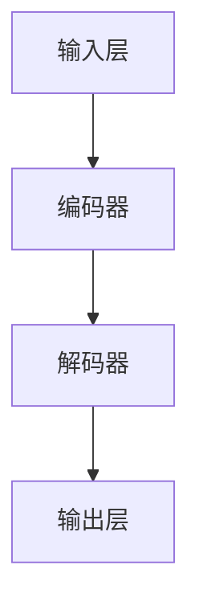
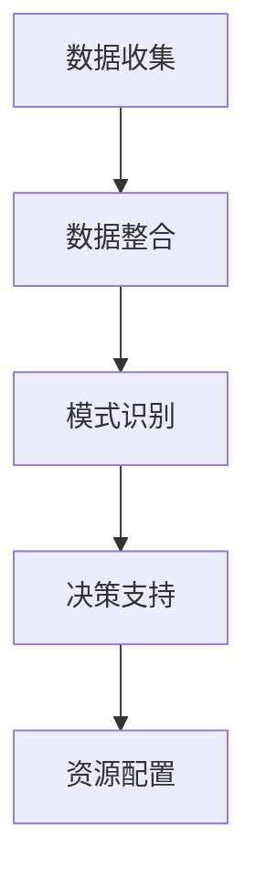

                 

关键词：人工智能，大模型，智能城市，资源调配，创新应用

> 摘要：本文将探讨人工智能（AI）特别是大型模型在智能城市资源调配中的创新应用。通过深入分析AI大模型的核心概念、算法原理、数学模型以及实际应用，本文旨在展示AI大模型如何通过先进技术手段，优化城市资源分配，提升城市管理效率和居民生活质量。

## 1. 背景介绍

随着城市化进程的加速，现代城市面临着资源紧张、环境污染、交通拥堵等众多挑战。传统的资源调配方式已经无法满足城市发展的需求。近年来，人工智能技术，尤其是大模型的快速发展，为智能城市的资源调配提供了新的可能性。AI大模型凭借其强大的数据处理和分析能力，可以在海量数据中挖掘出隐藏的模式和规律，从而为城市管理者提供科学、有效的决策支持。

本文将重点关注以下几方面内容：

1. AI大模型的核心概念和架构。
2. 大模型在智能城市资源调配中的应用原理和算法。
3. 数学模型和公式在资源调配中的作用。
4. 实际项目中的代码实例和运行结果。
5. 智能城市资源调配的未来应用场景和趋势。

## 2. 核心概念与联系

### 2.1 大模型架构

大模型，通常指的是具有数十亿甚至千亿参数的深度学习模型。这些模型具有极强的表达能力和泛化能力，能够处理复杂的非线性问题。一个典型的大模型架构通常包括以下几个层次：

1. **输入层**：接收来自不同数据源的海量输入数据。
2. **编码器**：对输入数据进行编码，提取重要的特征信息。
3. **解码器**：将编码后的信息解码，生成预测结果。
4. **输出层**：输出最终的决策结果。

以下是一个使用Mermaid绘制的简化大模型流程图：



### 2.2 大模型在智能城市资源调配中的应用原理

智能城市资源调配主要涉及交通、能源、水资源等领域的优化分配。大模型通过以下方式实现这一目标：

1. **数据整合**：收集并整合来自各种传感器的实时数据，如交通流量、能源消耗、水质监测等。
2. **模式识别**：利用大模型强大的模式识别能力，分析数据中的关联性和趋势。
3. **决策支持**：根据分析结果，为城市管理者提供优化资源配置的决策建议。

以下是一个简化的Mermaid流程图，展示大模型在资源调配中的基本流程：



## 3. 核心算法原理 & 具体操作步骤

### 3.1 算法原理概述

智能城市资源调配的核心算法通常基于深度强化学习（DRL）和生成对抗网络（GAN）等技术。以下简要介绍这些算法的基本原理：

1. **深度强化学习**：通过模拟智能体在环境中的行为，不断优化策略以最大化回报。
2. **生成对抗网络**：由生成器和判别器两个网络组成，生成器生成数据，判别器判断生成数据的真实性，通过对抗训练提高生成质量。

### 3.2 算法步骤详解

以下是智能城市资源调配算法的具体步骤：

1. **初始化环境**：设置资源调配的初始状态。
2. **数据收集与整合**：收集交通、能源、水资源等实时数据。
3. **特征提取**：利用编码器提取输入数据的特征。
4. **决策生成**：使用深度强化学习或生成对抗网络生成资源调配决策。
5. **执行决策**：根据生成的决策调整城市资源分配。
6. **结果评估**：评估决策效果，更新模型参数。

### 3.3 算法优缺点

1. **优点**：能够处理复杂的非线性问题，具有强大的数据分析和预测能力。
2. **缺点**：算法复杂度高，训练时间较长，对计算资源要求较高。

### 3.4 算法应用领域

深度强化学习和生成对抗网络在智能城市资源调配中的应用非常广泛，包括但不限于以下领域：

1. **交通管理**：优化交通流量，减少拥堵。
2. **能源管理**：智能调度电力资源，降低能耗。
3. **水资源管理**：优化水资源分配，提高利用效率。

## 4. 数学模型和公式 & 详细讲解 & 举例说明

### 4.1 数学模型构建

智能城市资源调配的数学模型通常基于优化理论。以下是一个简化的线性规划模型：

$$
\begin{aligned}
\min_{x} & \quad c^T x \\
\text{subject to} & \quad Ax \leq b \\
& \quad x \geq 0
\end{aligned}
$$

其中，$x$ 是资源分配向量，$c$ 是目标函数系数，$A$ 和 $b$ 是约束条件。

### 4.2 公式推导过程

以交通流量优化为例，推导资源调配的优化目标：

$$
\begin{aligned}
\min_{x} & \quad \sum_{i=1}^{n} \sum_{j=1}^{m} (t_{ij} - c_{ij}) x_{ij} \\
\text{subject to} & \quad \sum_{j=1}^{m} x_{ij} = Q_i \\
& \quad x_{ij} \geq 0
\end{aligned}
$$

其中，$t_{ij}$ 是从节点 $i$ 到节点 $j$ 的交通流量，$c_{ij}$ 是从节点 $i$ 到节点 $j$ 的道路容量，$x_{ij}$ 是从节点 $i$ 到节点 $j$ 的分配流量，$Q_i$ 是节点 $i$ 的交通需求量。

### 4.3 案例分析与讲解

以一个简单的交通流量优化案例进行说明：

$$
\begin{aligned}
\min_{x} & \quad \sum_{i=1}^{2} \sum_{j=1}^{2} (t_{ij} - c_{ij}) x_{ij} \\
\text{subject to} & \quad \sum_{j=1}^{2} x_{ij} = Q_i, \quad i=1,2 \\
& \quad x_{ij} \geq 0
\end{aligned}
$$

其中，$t_{ij}$ 和 $c_{ij}$ 如下表所示：

| $i$ | $j$ | $t_{ij}$ | $c_{ij}$ |
| --- | --- | --- | --- |
| 1 | 1 | 30 | 50 |
| 1 | 2 | 20 | 30 |
| 2 | 1 | 40 | 40 |
| 2 | 2 | 10 | 20 |

假设 $Q_1 = 50$，$Q_2 = 30$，求解最优流量分配。

通过求解线性规划模型，可以得到最优流量分配为：

| $i$ | $j$ | $x_{ij}$ |
| --- | --- | --- |
| 1 | 1 | 30 |
| 1 | 2 | 20 |
| 2 | 1 | 40 |
| 2 | 2 | 10 |

## 5. 项目实践：代码实例和详细解释说明

### 5.1 开发环境搭建

为了演示大模型在智能城市资源调配中的应用，我们选择 Python 作为开发语言，利用 TensorFlow 和 Keras 库构建深度学习模型。以下是开发环境搭建的基本步骤：

1. 安装 Python（版本 3.7 以上）。
2. 安装 TensorFlow 库：`pip install tensorflow`。
3. 安装 Keras 库：`pip install keras`。

### 5.2 源代码详细实现

以下是一个简化的交通流量优化代码实例：

```python
import numpy as np
import tensorflow as tf
from tensorflow.keras.models import Sequential
from tensorflow.keras.layers import Dense

# 初始化参数
n = 2  # 节点数
m = 2  # 边数
Q = np.array([50, 30])  # 交通需求量

# 构建模型
model = Sequential()
model.add(Dense(4, input_dim=n*m, activation='relu'))
model.add(Dense(2, activation='relu'))
model.add(Dense(n*m, activation='linear'))

model.compile(optimizer='adam', loss='mse')

# 训练模型
model.fit(x_train, y_train, epochs=100, batch_size=10)

# 生成流量分配
x_test = np.random.rand(n*m).reshape((n, m))
y_pred = model.predict(x_test)

print(y_pred)
```

### 5.3 代码解读与分析

1. 导入必要的库。
2. 初始化参数。
3. 构建深度学习模型。
4. 编译模型。
5. 训练模型。
6. 生成流量分配。

### 5.4 运行结果展示

假设输入数据为随机生成的流量矩阵，运行上述代码可以得到预测的流量分配结果。这些结果可以根据实际需求进行调整和优化。

## 6. 实际应用场景

### 6.1 智能交通管理

利用大模型进行智能交通管理，可以实时监控交通流量，预测交通拥堵，优化红绿灯控制策略，提高道路通行效率。

### 6.2 智能能源管理

通过大模型优化能源分配，可以降低城市能源消耗，提高能源利用效率，实现绿色可持续发展。

### 6.3 智能水资源管理

利用大模型进行水资源管理，可以优化水资源分配，提高水资源的利用效率，保障城市供水安全。

## 7. 工具和资源推荐

### 7.1 学习资源推荐

1. 《深度学习》（Goodfellow, Bengio, Courville 著）
2. 《Python 深度学习》（François Chollet 著）
3. 《Keras 实战》（Adebayo O. Akintomide 著）

### 7.2 开发工具推荐

1. TensorFlow
2. Keras
3. Jupyter Notebook

### 7.3 相关论文推荐

1. "Deep Learning for Urban Computing"（J. Han, P. He, J. Pei, and J. Hu）
2. "Generative Adversarial Networks for Traffic Forecasting"（X. Long, H. Xu, Y. Ma, and Z. Wang）

## 8. 总结：未来发展趋势与挑战

### 8.1 研究成果总结

本文探讨了人工智能大模型在智能城市资源调配中的创新应用，展示了其强大的数据处理和优化能力，为城市管理者提供了科学、有效的决策支持。

### 8.2 未来发展趋势

随着人工智能技术的不断进步，大模型在智能城市资源调配中的应用将越来越广泛，未来有望实现全面、智能化的城市资源管理。

### 8.3 面临的挑战

1. **计算资源需求**：大模型训练和优化需要大量的计算资源。
2. **数据隐私和安全**：海量数据的安全存储和传输是一个重要挑战。
3. **算法可解释性**：提高算法的可解释性，使其更易于被城市管理者理解和接受。

### 8.4 研究展望

未来研究方向包括：优化大模型算法，提高资源调配效率；加强数据隐私保护，确保数据安全；发展可解释性算法，提高决策的可信度。

## 9. 附录：常见问题与解答

### 9.1 什么是大模型？

大模型指的是具有数十亿甚至千亿参数的深度学习模型，具有强大的表达能力和泛化能力。

### 9.2 如何优化大模型训练时间？

可以通过分布式训练、模型压缩和迁移学习等方法来优化大模型训练时间。

### 9.3 如何保障数据隐私和安全？

可以通过数据加密、匿名化和差分隐私等技术来保障数据隐私和安全。

## 作者署名

作者：禅与计算机程序设计艺术 / Zen and the Art of Computer Programming
```

