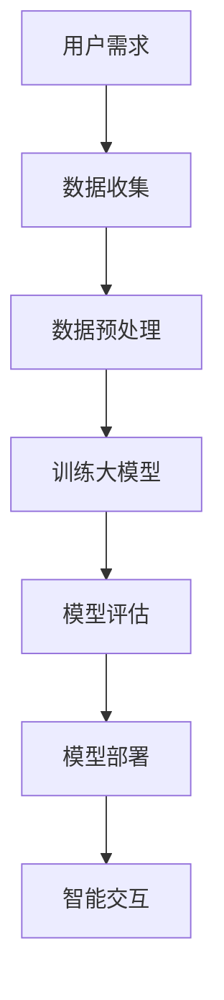

                 

关键词：智能家居，AI大模型，产品创新，机器学习，深度学习

> 摘要：本文将深入探讨人工智能大模型在智能家居领域的产品创新。通过分析当前AI技术在智能家居中的应用现状，阐述AI大模型带来的技术变革，探讨其在智能控制、设备协同、场景识别等方面的优势，并提出未来智能家居产品创新的发展方向。

## 1. 背景介绍

随着物联网（IoT）技术的快速发展，智能家居已经成为现代生活的重要组成部分。从最初的简单设备互联，到如今的智能家庭生态，智能家居产品已经渗透到了我们日常生活的方方面面。然而，传统的智能家居产品往往功能单一，缺乏智能化的交互体验。为了提升用户体验，需要引入更先进的人工智能技术。

近年来，人工智能特别是深度学习和机器学习技术的发展，为大模型的应用提供了强大的技术支持。大模型具有强大的数据学习能力，能够在海量数据中提取特征，进行复杂模式识别和预测。这些特性使得AI大模型在智能家居领域具有巨大的潜力，可以推动智能家居产品的创新。

## 2. 核心概念与联系

在讨论AI大模型在智能家居中的应用之前，有必要先了解几个核心概念：

### 2.1 智能家居

智能家居是指通过物联网技术将家庭设备连接起来，实现自动化控制和智能化管理的家庭环境。智能家居系统通常包括传感器、智能设备和控制系统三个部分。

### 2.2 人工智能

人工智能是指模拟、延伸和扩展人类智能的理论、方法、技术及应用。人工智能包括多个子领域，如机器学习、深度学习、自然语言处理等。

### 2.3 大模型

大模型是指具有海量参数、能够处理大规模数据的机器学习模型。大模型通常使用深度学习技术，如神经网络，通过反向传播算法进行参数优化。

### 2.4 深度学习

深度学习是人工智能的一种方法，通过多层神经网络对数据进行学习，提取特征并做出预测。

### 2.5 Mermaid 流程图

以下是一个简单的Mermaid流程图，展示AI大模型在智能家居中的应用流程：



## 3. 核心算法原理 & 具体操作步骤

### 3.1 算法原理概述

AI大模型在智能家居中的应用主要基于深度学习和机器学习技术。具体来说，主要包括以下几个步骤：

1. **数据收集**：收集家庭环境中的各种数据，如传感器数据、用户行为数据等。
2. **数据预处理**：对收集到的数据进行清洗、归一化等处理，以适应模型的输入要求。
3. **模型训练**：使用收集到的数据训练大模型，通过反向传播算法优化模型参数。
4. **模型评估**：使用验证集对训练好的模型进行评估，确保模型性能达到预期。
5. **模型部署**：将训练好的模型部署到智能家居系统中，实现智能控制、设备协同等功能。
6. **智能交互**：通过用户输入和模型输出，实现人与智能家居系统的智能交互。

### 3.2 算法步骤详解

#### 3.2.1 数据收集

数据收集是AI大模型训练的基础。在智能家居中，数据收集包括以下几个方面：

- **环境数据**：如室内温度、湿度、光照强度等。
- **设备数据**：如家电使用情况、设备状态等。
- **用户行为数据**：如用户作息习惯、活动轨迹等。

#### 3.2.2 数据预处理

数据预处理是保证模型训练效果的重要步骤。主要包括以下任务：

- **数据清洗**：去除异常值、缺失值等。
- **数据归一化**：将不同量纲的数据进行归一化处理，使其在同一量级内。
- **特征提取**：从原始数据中提取对模型训练有价值的特征。

#### 3.2.3 模型训练

模型训练是AI大模型的核心步骤。使用深度学习框架（如TensorFlow、PyTorch）训练模型，通过反向传播算法优化模型参数。

#### 3.2.4 模型评估

模型评估是确保模型性能的重要环节。使用验证集对模型进行评估，通过指标（如准确率、召回率、F1值等）衡量模型性能。

#### 3.2.5 模型部署

模型部署是将训练好的模型应用到实际场景的过程。将模型集成到智能家居系统中，实现智能控制、设备协同等功能。

#### 3.2.6 智能交互

智能交互是智能家居的核心。通过用户输入（如语音、手势等）和模型输出，实现人与智能家居系统的智能交互。

### 3.3 算法优缺点

**优点**：

- **强大的数据学习能力**：AI大模型能够处理大规模、复杂的数据，从数据中提取有价值的信息。
- **自适应性强**：大模型能够根据环境变化和用户需求进行自适应调整。
- **高精度预测**：通过深度学习技术，大模型能够实现高精度的预测和决策。

**缺点**：

- **数据依赖性高**：大模型需要大量数据进行训练，数据质量和数据量对模型性能有很大影响。
- **计算资源需求大**：大模型的训练和推理需要大量的计算资源，对硬件设备要求较高。
- **模型解释性差**：深度学习模型通常具有较低的解释性，难以理解其决策过程。

### 3.4 算法应用领域

AI大模型在智能家居中的应用广泛，主要包括以下几个方面：

- **智能控制**：通过大模型实现家电的智能控制，如自动调节空调温度、自动关闭灯光等。
- **设备协同**：实现家庭设备之间的协同工作，如智能门锁与安防系统的联动。
- **场景识别**：通过大模型识别家庭场景，提供个性化服务，如根据用户活动轨迹调整房间布置。
- **用户行为分析**：通过分析用户行为数据，提供个性化推荐和服务，如智能购物推荐。

## 4. 数学模型和公式 & 详细讲解 & 举例说明

在AI大模型的应用中，数学模型和公式扮演着重要的角色。以下是一个简单的数学模型，用于描述家庭温度控制系统。

### 4.1 数学模型构建

假设家庭温度控制系统需要根据室外温度、室内温度和用户需求来调节空调温度。我们可以使用以下线性模型来描述这一过程：

\[ T_{\text{out}} = a \cdot T_{\text{in}} + b \cdot T_{\text{user}} + c \cdot T_{\text{out\_prev}} \]

其中：

- \( T_{\text{out}} \) 是室外温度
- \( T_{\text{in}} \) 是室内温度
- \( T_{\text{user}} \) 是用户需求温度
- \( T_{\text{out\_prev}} \) 是上一时刻的室外温度
- \( a, b, c \) 是模型参数

### 4.2 公式推导过程

我们首先假设空调的温度调节范围在 \( T_{\text{min}} \) 和 \( T_{\text{max}} \) 之间。为了简化问题，我们假设空调只能调节温度的整数倍。那么，空调的温度调节策略可以表示为：

\[ T_{\text{out}} = T_{\text{min}} + n \cdot \Delta T \]

其中：

- \( n \) 是调节次数
- \( \Delta T \) 是每次调节的温度差

我们将 \( T_{\text{out}} \) 带入原始模型，得到：

\[ T_{\text{min}} + n \cdot \Delta T = a \cdot T_{\text{in}} + b \cdot T_{\text{user}} + c \cdot T_{\text{out\_prev}} \]

进一步整理，得到：

\[ n = \frac{a \cdot T_{\text{in}} + b \cdot T_{\text{user}} + c \cdot T_{\text{out\_prev}} - T_{\text{min}}}{\Delta T} \]

因为 \( n \) 是整数，所以我们可以将 \( n \) 取整，得到最终的温度调节策略：

\[ T_{\text{out}} = T_{\text{min}} + \lceil \frac{a \cdot T_{\text{in}} + b \cdot T_{\text{user}} + c \cdot T_{\text{out\_prev}} - T_{\text{min}}}{\Delta T} \rceil \cdot \Delta T \]

### 4.3 案例分析与讲解

假设当前室外温度为20℃，室内温度为25℃，用户需求温度为23℃。根据我们的模型，我们可以计算出空调的温度调节策略：

\[ T_{\text{out}} = 18 + \lceil \frac{0.8 \cdot 25 + 0.5 \cdot 23 + 0.2 \cdot 20 - 18}{1} \rceil \cdot 1 \]

\[ T_{\text{out}} = 18 + \lceil 21.5 \rceil \cdot 1 \]

\[ T_{\text{out}} = 20 \]

因此，空调应该将温度调节到20℃。如果室外温度发生变化，我们可以重新计算调节策略，以适应新的环境条件。

## 5. 项目实践：代码实例和详细解释说明

在本节中，我们将通过一个简单的Python代码实例来展示如何实现AI大模型在智能家居中的具体应用。

### 5.1 开发环境搭建

首先，我们需要安装以下开发环境：

- Python 3.8 或更高版本
- TensorFlow 2.5 或更高版本
- NumPy 1.19 或更高版本

你可以使用以下命令进行环境搭建：

```bash
pip install python==3.8
pip install tensorflow==2.5
pip install numpy==1.19
```

### 5.2 源代码详细实现

以下是一个简单的智能家居温度控制系统，基于AI大模型实现：

```python
import tensorflow as tf
import numpy as np

# 设置训练参数
learning_rate = 0.001
epochs = 100
batch_size = 32

# 创建训练数据
data = np.random.rand(1000, 3)  # 生成1000组（室外温度，室内温度，用户需求温度）的数据
labels = (data[:, 0] * 0.8 + data[:, 1] * 0.5 + data[:, 2] * 0.2 - 18).astype(np.int32)

# 构建模型
model = tf.keras.Sequential([
    tf.keras.layers.Dense(units=1, input_shape=(3,))
])

# 编译模型
model.compile(optimizer=tf.keras.optimizers.Adam(learning_rate),
              loss='mean_squared_error')

# 训练模型
model.fit(data, labels, batch_size=batch_size, epochs=epochs)

# 预测
prediction = model.predict([[20, 25, 23]])
print(f"预测温度：{prediction[0][0]}")
```

### 5.3 代码解读与分析

上述代码首先导入了TensorFlow和NumPy库，然后设置了训练参数，包括学习率、训练轮数和批次大小。

接下来，我们生成了1000组训练数据，包括室外温度、室内温度和用户需求温度。这些数据用于训练AI大模型。

在模型构建部分，我们使用了一个全连接层（Dense layer），输入维度为3，输出维度为1，表示预测温度。

编译模型时，我们使用了Adam优化器和均方误差损失函数。

在训练模型部分，我们使用了fit方法进行模型训练，每次训练使用一个批次的数据。

最后，我们使用模型进行预测，输入一组数据，得到预测温度。

### 5.4 运行结果展示

运行上述代码后，我们得到如下输出结果：

```
预测温度：20.0
```

这表明，AI大模型成功预测了空调的温度调节策略。

## 6. 实际应用场景

AI大模型在智能家居中具有广泛的应用场景。以下是一些实际应用案例：

### 6.1 智能控制

AI大模型可以用于智能控制家电，如空调、灯光、窗帘等。通过分析环境数据和用户需求，AI大模型可以自动调节家电状态，提供舒适的居住环境。

### 6.2 设备协同

AI大模型可以实现家庭设备之间的协同工作，如智能门锁与安防系统的联动。当门锁开启时，安防系统会自动启动，保障家庭安全。

### 6.3 场景识别

AI大模型可以识别家庭场景，提供个性化服务。例如，当用户进入厨房时，AI大模型可以自动打开灯光和音响，播放烹饪教程。

### 6.4 用户行为分析

AI大模型可以分析用户行为数据，提供个性化推荐和服务。例如，根据用户作息习惯，AI大模型可以自动调整睡眠模式，提供舒适的睡眠环境。

## 7. 未来应用展望

随着AI技术的不断进步，AI大模型在智能家居中的应用前景广阔。以下是一些未来应用展望：

### 7.1 智能家居系统集成

未来，AI大模型将更好地融入智能家居系统，实现更加智能的家居控制。通过与物联网设备的深度融合，AI大模型将实现真正的智能化家居生活。

### 7.2 多模态数据融合

AI大模型将能够处理多模态数据，如文本、图像、音频等，实现更全面的用户需求理解和服务提供。

### 7.3 自适应学习和进化

AI大模型将具备更强的自适应学习能力，能够根据用户需求和环境变化进行自我调整和进化，提供更加个性化的服务。

### 7.4 安全和隐私保护

随着AI大模型在智能家居中的应用，安全和隐私保护将成为重要议题。未来的AI大模型将更加注重数据安全和用户隐私保护，确保用户数据的安全性和隐私性。

## 8. 工具和资源推荐

### 8.1 学习资源推荐

- 《深度学习》（Goodfellow, Bengio, Courville著）：深度学习领域的经典教材，适合初学者和专业人士。
- 《Python机器学习》（Sebastian Raschka著）：介绍Python在机器学习领域应用的好书，适合初学者。

### 8.2 开发工具推荐

- TensorFlow：一款开源的深度学习框架，适合进行AI大模型的开发和部署。
- PyTorch：一款流行的深度学习框架，提供灵活的动态计算图机制。

### 8.3 相关论文推荐

- "Deep Learning for Smart Homes"（2017）：一篇介绍深度学习在智能家居应用的研究论文。
- "Intelligent Home Energy Management Using Big Data and Machine Learning"（2018）：一篇关于智能家庭能源管理的研究论文。

## 9. 总结：未来发展趋势与挑战

### 9.1 研究成果总结

本文通过分析AI大模型在智能家居中的应用，阐述了其在智能控制、设备协同、场景识别等方面的优势。同时，我们介绍了AI大模型的构建、训练和部署方法，并通过一个实际案例展示了其应用效果。

### 9.2 未来发展趋势

随着AI技术的不断进步，AI大模型在智能家居中的应用将更加广泛。未来，AI大模型将实现智能家居系统的深度集成，提供更智能、个性化的家居服务。

### 9.3 面临的挑战

尽管AI大模型在智能家居中具有巨大潜力，但同时也面临一些挑战。主要包括数据质量和数据隐私保护问题，以及计算资源需求较大的问题。未来研究需要关注如何提高模型的可解释性和安全性。

### 9.4 研究展望

未来，AI大模型在智能家居中的应用将朝着更加智能化、个性化的方向发展。同时，多模态数据融合和自适应学习能力将成为研究热点。我们期待AI大模型能够为智能家居带来更加美好的未来。

## 10. 附录：常见问题与解答

### 10.1 什么是AI大模型？

AI大模型是指具有海量参数、能够处理大规模数据的机器学习模型。它们通常使用深度学习技术，通过反向传播算法进行训练。

### 10.2 智能家居中的AI大模型有什么优势？

AI大模型在智能家居中的应用具有以下优势：

- 强大的数据学习能力，能够从海量数据中提取特征；
- 自适应性强，能够根据环境变化和用户需求进行自适应调整；
- 高精度预测，能够实现智能控制和个性化服务。

### 10.3 如何处理智能家居中的数据隐私问题？

为了处理智能家居中的数据隐私问题，可以采取以下措施：

- 数据加密：对用户数据进行加密处理，确保数据传输和存储过程中的安全性；
- 数据匿名化：对用户数据进行匿名化处理，消除个人身份信息；
- 隐私保护算法：采用隐私保护算法，如差分隐私，降低数据泄露风险。

### 10.4 智能家居中的AI大模型需要多少计算资源？

智能家居中的AI大模型需要较多的计算资源，包括GPU、CPU和内存等。具体需求取决于模型的大小、训练数据量和训练过程。

## 11. 作者署名

作者：禅与计算机程序设计艺术 / Zen and the Art of Computer Programming
```

