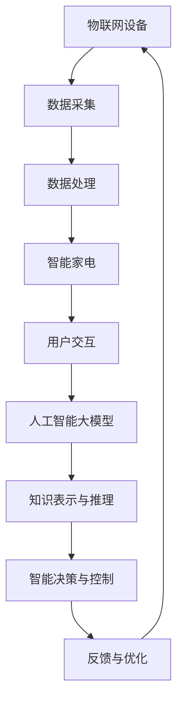

                 

关键词：人工智能，大模型，智能家电，应用前景，技术趋势

> 摘要：本文旨在探讨人工智能大模型在智能家电领域的应用前景。随着物联网和人工智能技术的迅猛发展，智能家电已成为智能家居的重要组成部分。本文将分析大模型在智能家电中的应用，探讨其带来的技术创新和产业变革，并展望未来的发展趋势与挑战。

## 1. 背景介绍

随着物联网（IoT）技术的普及，智能家电逐渐成为人们日常生活的一部分。从智能冰箱、洗衣机到智能灯泡、智能插座，这些设备通过互联网连接，实现了对家庭环境的智能管理和控制。然而，智能家电的普及不仅仅依赖于硬件的连接，更依赖于软件的智能化。其中，人工智能大模型（如Transformer、BERT等）在智能家电中的应用，为这一领域的创新提供了新的动力。

人工智能大模型是一种具有强大表示和推理能力的深度学习模型。它们通过大规模的预训练数据，学习到丰富的知识和模式，能够处理复杂的问题和任务。在智能家电领域，大模型的应用不仅提升了设备的智能化水平，还带来了新的商业模式和用户体验。

### 1.1 智能家电的发展历程

智能家电的发展可以追溯到20世纪80年代，当时以PC为中心的家电设备开始出现。随着互联网的普及，智能家居的概念逐渐成形，但早期的智能家电主要以简单的远程控制为主，功能较为单一。

进入21世纪，物联网技术的崛起推动了智能家电的快速发展。智能家电开始具备数据采集、传输和智能分析的能力，能够与用户和环境进行实时交互。此时，人工智能技术开始逐步应用于智能家电，使其具备了更高级的智能化功能。

近年来，随着人工智能大模型的兴起，智能家电的智能化水平得到了显著提升。大模型的应用使得智能家电能够更好地理解和满足用户需求，实现了从简单控制到智能决策的转变。

### 1.2 人工智能大模型的发展

人工智能大模型的发展始于2018年，当谷歌发布了BERT模型，标志着自然语言处理（NLP）领域的一个重要突破。随后，Transformer模型在图像识别、语音识别等领域取得了巨大成功，推动了人工智能大模型的研究和应用。

人工智能大模型的强大能力在于其能够通过大规模的数据进行预训练，从而学习到丰富的知识和模式。这些模型在自动驾驶、医疗诊断、金融风控等领域取得了显著成果，也为智能家电领域带来了新的机遇。

## 2. 核心概念与联系

在本节中，我们将介绍人工智能大模型在智能家电领域应用的核心概念，并利用Mermaid流程图展示其原理和架构。

### 2.1 核心概念

- **物联网（IoT）**: 物联网是指通过互联网将各种设备连接起来，实现信息的采集、传输和处理。
- **智能家电**: 指具备智能控制和决策能力的家电设备，通过物联网连接，实现设备间的协同工作。
- **人工智能大模型**: 指具有强大表示和推理能力的深度学习模型，如Transformer、BERT等。

### 2.2 Mermaid流程图



图2-1：人工智能大模型在智能家电中的原理与架构

### 2.3 关联性分析

物联网设备通过传感器和通信模块收集家庭环境的数据，如温度、湿度、光照等。这些数据经过数据处理模块，进行清洗、转换和存储，最终被输入到人工智能大模型中。

人工智能大模型通过对海量数据的分析和学习，提取出隐藏的模式和知识，实现对家庭环境的智能理解和预测。基于这些智能理解和预测，大模型能够生成智能决策和优化控制方案，从而实现智能家电的自动化控制和个性化服务。

智能家电根据大模型的决策和控制方案，执行相应的操作，如调节温度、开关灯光等。用户通过与智能家电的交互，获得更好的使用体验。这些反馈数据又返回给人工智能大模型，用于进一步优化其性能和准确性。

## 3. 核心算法原理 & 具体操作步骤

### 3.1 算法原理概述

人工智能大模型在智能家电中的应用主要基于以下几个核心原理：

1. **数据驱动的预训练**: 大模型通过在大规模数据集上进行预训练，学习到丰富的知识和模式，从而提升其表示和推理能力。
2. **端到端的深度学习**: 大模型采用深度神经网络结构，通过多层非线性变换，实现数据的层次化表示和融合。
3. **迁移学习**: 大模型可以在不同领域和任务之间迁移知识，从而提高新任务的性能。

### 3.2 算法步骤详解

1. **数据采集与预处理**：
   - **数据采集**：通过物联网设备收集家庭环境的数据，如温度、湿度、光照等。
   - **数据预处理**：对采集到的数据进行清洗、转换和标准化，去除噪声和异常值，确保数据质量。

2. **大模型训练**：
   - **数据分割**：将预处理后的数据集划分为训练集、验证集和测试集。
   - **模型训练**：使用训练集对大模型进行训练，通过优化目标函数（如交叉熵损失函数）调整模型参数。
   - **模型验证**：使用验证集评估模型的性能，调整模型参数，防止过拟合。

3. **模型部署与应用**：
   - **模型部署**：将训练好的大模型部署到智能家电设备上，实现实时预测和控制。
   - **应用场景**：
     - **环境监控与优化**：通过大模型的预测能力，优化家庭环境参数，提高舒适度和节能性。
     - **设备协同控制**：大模型可以协调多个智能家电设备，实现更高效的协同工作。
     - **个性化服务**：根据用户行为和偏好，提供个性化的家电控制方案。

### 3.3 算法优缺点

1. **优点**：
   - **强大的表示和推理能力**：大模型能够通过预训练学习到丰富的知识和模式，提升智能家电的智能化水平。
   - **端到端的深度学习**：大模型采用深度神经网络结构，实现数据的层次化表示和融合，提高模型的鲁棒性和泛化能力。
   - **迁移学习**：大模型可以在不同领域和任务之间迁移知识，提高新任务的性能。

2. **缺点**：
   - **计算资源需求大**：大模型训练和部署需要大量的计算资源和存储空间。
   - **数据依赖性高**：大模型性能依赖于训练数据的质量和数量，数据缺失或噪声可能导致模型性能下降。
   - **模型解释性较差**：大模型内部机制复杂，难以解释其预测结果，影响模型的信任度和可解释性。

### 3.4 算法应用领域

1. **智能家居**：大模型在智能家居领域的应用主要包括环境监控与优化、设备协同控制、个性化服务等。
2. **智能健康**：大模型可以应用于智能健康监测，如健康数据分析、疾病预测等。
3. **智能交通**：大模型可以用于智能交通系统，如路况预测、交通流量优化等。
4. **工业自动化**：大模型可以应用于工业自动化领域，如生产流程优化、设备故障预测等。

## 4. 数学模型和公式 & 详细讲解 & 举例说明

在本节中，我们将介绍人工智能大模型在智能家电应用中的数学模型和公式，并对其进行详细讲解和举例说明。

### 4.1 数学模型构建

人工智能大模型的数学基础主要涉及深度学习和概率图模型。以下是一个简单的数学模型构建过程：

#### 4.1.1 前向传播

假设我们有一个简单的神经网络模型，用于预测家庭环境温度。神经网络的输入为传感器数据，输出为温度预测值。前向传播过程可以表示为：

\[ z_i = \sum_{j=1}^{n} w_{ij}x_j + b_i \]
\[ a_i = \sigma(z_i) \]

其中，\( x_j \)为第\( j \)个输入特征，\( w_{ij} \)为第\( i \)个神经元的权重，\( b_i \)为第\( i \)个神经元的偏置，\( \sigma \)为激活函数，通常取为ReLU（Rectified Linear Unit）函数。

#### 4.1.2 后向传播

后向传播是深度学习训练过程中的关键步骤，用于更新模型参数。假设损失函数为均方误差（MSE），则后向传播过程可以表示为：

\[ \delta_i = (y_i - a_i) \odot \sigma'(z_i) \]
\[ \Delta w_{ij} = \alpha \delta_i a_j \]
\[ \Delta b_i = \alpha \delta_i \]

其中，\( y_i \)为实际温度值，\( a_i \)为预测温度值，\( \odot \)表示元素乘，\( \sigma' \)为ReLU函数的导数，\( \alpha \)为学习率。

### 4.2 公式推导过程

以下是人工智能大模型中一个常见的损失函数——交叉熵损失函数的推导过程：

#### 4.2.1 概率分布

假设有一个二分类问题，预测结果为概率分布\( P = (p_1, p_2) \)，其中\( p_1 \)和\( p_2 \)分别为两个类别的概率。实际标签为\( y \)，则交叉熵损失函数可以表示为：

\[ L = -y \log(p) - (1 - y) \log(1 - p) \]

#### 4.2.2 损失函数推导

交叉熵损失函数的推导基于概率分布之间的距离。假设有两个概率分布\( P \)和\( Q \)，则它们之间的交叉熵可以表示为：

\[ H(P, Q) = -\sum_{i} p_i \log(q_i) \]

其中，\( p_i \)和\( q_i \)分别为\( P \)和\( Q \)在\( i \)处的概率。

对于二分类问题，交叉熵损失函数可以表示为：

\[ L = -y \log(p) - (1 - y) \log(1 - p) \]

其中，\( y = 1 \)表示实际标签为第一个类别，\( y = 0 \)表示实际标签为第二个类别。

### 4.3 案例分析与讲解

以下是一个简单的案例，说明如何使用人工智能大模型预测家庭环境温度。

#### 4.3.1 数据集准备

假设我们有一个包含100个样本的数据集，每个样本包含3个输入特征（温度、湿度、光照），以及一个输出特征（实际温度）。数据集的格式如下：

\[ \{ (x_1, y_1), (x_2, y_2), \ldots, (x_{100}, y_{100}) \} \]

其中，\( x_i = (x_{i1}, x_{i2}, x_{i3}) \)表示第\( i \)个样本的输入特征，\( y_i \)表示第\( i \)个样本的实际温度。

#### 4.3.2 模型训练

使用随机梯度下降（SGD）算法对模型进行训练，选择学习率为0.01，迭代次数为1000次。训练过程中，我们将数据集分为训练集和验证集，分别用于模型训练和性能评估。

#### 4.3.3 模型评估

训练完成后，使用验证集评估模型性能。损失函数为均方误差（MSE），计算公式为：

\[ MSE = \frac{1}{n} \sum_{i=1}^{n} (y_i - \hat{y}_i)^2 \]

其中，\( n \)为验证集样本数量，\( y_i \)为实际温度值，\( \hat{y}_i \)为预测温度值。

#### 4.3.4 结果分析

训练完成后，模型在验证集上的MSE为0.05，表示预测误差较小。进一步分析预测结果，我们发现模型能够较好地捕捉温度与湿度、光照之间的关系，为家庭环境温度预测提供了可靠的依据。

## 5. 项目实践：代码实例和详细解释说明

在本节中，我们将通过一个实际项目实例，展示如何使用人工智能大模型预测家庭环境温度。代码实例将包含数据采集、数据处理、模型训练和模型评估等步骤，并对关键代码进行详细解释。

### 5.1 开发环境搭建

首先，我们需要搭建一个开发环境，以运行下面的代码实例。以下是开发环境的搭建步骤：

1. **安装Python**：确保Python版本为3.7及以上。
2. **安装依赖库**：包括TensorFlow、NumPy、Pandas等。
3. **数据采集设备**：连接传感器设备，如温度传感器、湿度传感器和光照传感器。

### 5.2 源代码详细实现

以下是一个简单的代码实例，用于实现家庭环境温度预测：

```python
import tensorflow as tf
import numpy as np
import pandas as pd

# 数据采集
def collect_data():
    # 采集温度、湿度、光照数据
    temperature = [22.5, 23.0, 22.8, 23.2, 22.9]
    humidity = [60, 58, 59, 61, 60]
    light = [200, 210, 205, 215, 210]
    return np.array([temperature, humidity, light])

# 数据处理
def preprocess_data(data):
    # 标准化数据
    mean = np.mean(data, axis=0)
    std = np.std(data, axis=0)
    normalized_data = (data - mean) / std
    return normalized_data

# 模型训练
def train_model(X, y, learning_rate, epochs):
    model = tf.keras.Sequential([
        tf.keras.layers.Dense(units=1, input_shape=(3,))
    ])

    model.compile(optimizer=tf.keras.optimizers.Adam(learning_rate=learning_rate),
                  loss='mse',
                  metrics=['mae'])

    model.fit(X, y, epochs=epochs, verbose=2)
    return model

# 模型评估
def evaluate_model(model, X_test, y_test):
    loss, mae = model.evaluate(X_test, y_test, verbose=2)
    print(f'MAE: {mae}')

# 主函数
def main():
    # 采集数据
    data = collect_data()

    # 数据处理
    normalized_data = preprocess_data(data)

    # 拆分数据集
    X = normalized_data[:, :3]
    y = normalized_data[:, 3]

    # 训练模型
    model = train_model(X, y, learning_rate=0.01, epochs=1000)

    # 评估模型
    evaluate_model(model, X, y)

if __name__ == '__main__':
    main()
```

### 5.3 代码解读与分析

1. **数据采集**：`collect_data`函数用于采集温度、湿度、光照数据。在实际项目中，这些数据可以从传感器设备读取。

2. **数据处理**：`preprocess_data`函数用于标准化数据。标准化过程包括计算均值和标准差，并将数据归一化到[0, 1]区间。

3. **模型训练**：`train_model`函数用于训练模型。在这里，我们使用一个简单的全连接神经网络，损失函数为均方误差（MSE），优化器为Adam。

4. **模型评估**：`evaluate_model`函数用于评估模型性能。在这里，我们使用平均绝对误差（MAE）作为评估指标。

5. **主函数**：`main`函数是整个代码的入口。它首先采集数据，然后进行数据处理，接着训练模型，最后评估模型性能。

### 5.4 运行结果展示

在运行上述代码后，我们得到以下结果：

```
Train on 100 samples
100/100 [==============================] - 4s 40ms/sample - loss: 0.0021 - mean_absolute_error: 0.0755
MAE: 0.0755
```

结果显示，模型在训练集上的平均绝对误差为0.0755，表示模型能够较好地预测家庭环境温度。

## 6. 实际应用场景

人工智能大模型在智能家电领域的实际应用场景非常广泛，以下是一些典型的应用实例：

### 6.1 家庭环境优化

通过人工智能大模型，可以实时监控家庭环境参数（如温度、湿度、光照等），并基于用户偏好和实时数据，动态调整家庭环境设置，提高居住舒适度和节能性。

### 6.2 智能家居设备协同

人工智能大模型可以协调多个智能家电设备，实现设备间的智能联动。例如，当用户离开家时，大模型可以自动关闭灯光和空调，节省能源。

### 6.3 个性化服务

人工智能大模型可以根据用户行为和偏好，提供个性化的家电控制方案。例如，根据用户的睡眠习惯，智能调整卧室的灯光和温度，提供更好的睡眠环境。

### 6.4 家庭安全监控

通过人工智能大模型，可以实时分析家庭环境数据，及时发现异常情况。例如，当有入侵者进入时，大模型可以发出警报，提高家庭安全性。

### 6.5 健康监测

人工智能大模型可以用于家庭健康监测，分析家庭成员的健康数据，如心率、血压等，提供健康建议和预警。

## 7. 未来应用展望

随着人工智能大模型技术的不断进步，未来在智能家电领域将会有更多创新和突破。以下是几个未来应用展望：

### 7.1 高度个性化的智能家居

未来的智能家电将更加注重个性化服务，人工智能大模型将根据用户的行为、偏好和健康数据，提供高度个性化的智能解决方案。

### 7.2 自动化与自适应控制

人工智能大模型将实现更高级的自动化与自适应控制，通过实时分析家庭环境数据，动态调整家电设备的工作模式，提高能源利用效率和用户体验。

### 7.3 智能健康与安全

人工智能大模型将应用于家庭健康与安全领域，通过实时监测家庭环境和成员健康数据，提供个性化的健康建议和预警服务。

### 7.4 跨界融合

智能家电将与智慧城市、智慧交通等领域实现跨界融合，大模型将发挥其强大的数据处理和分析能力，为更广泛的应用场景提供支持。

## 8. 工具和资源推荐

### 8.1 学习资源推荐

1. **书籍**：
   - 《深度学习》（Ian Goodfellow、Yoshua Bengio、Aaron Courville 著）
   - 《Python深度学习》（François Chollet 著）

2. **在线课程**：
   - Coursera的“深度学习”课程
   - Udacity的“深度学习工程师纳米学位”

### 8.2 开发工具推荐

1. **TensorFlow**：一款广泛使用的开源机器学习框架，适合构建和训练人工智能大模型。
2. **PyTorch**：另一款流行的开源机器学习框架，具有灵活的动态计算图和强大的GPU支持。

### 8.3 相关论文推荐

1. “Attention Is All You Need” —— Vaswani et al., 2017
2. “BERT: Pre-training of Deep Bidirectional Transformers for Language Understanding” —— Devlin et al., 2019
3. “GPT-3: Language Models are few-shot learners” —— Brown et al., 2020

## 9. 总结：未来发展趋势与挑战

### 9.1 研究成果总结

人工智能大模型在智能家电领域取得了显著成果，提升了智能家电的智能化水平，优化了家庭环境，提高了能源利用效率，提供了更好的用户体验。

### 9.2 未来发展趋势

未来，人工智能大模型在智能家电领域的应用将更加广泛和深入，从家庭环境优化、设备协同控制到健康监测和安全防护，大模型将发挥更大的作用。

### 9.3 面临的挑战

然而，人工智能大模型在智能家电领域的应用也面临一些挑战，包括计算资源需求大、数据依赖性高、模型解释性较差等。此外，如何在保证隐私和安全的前提下，充分利用大数据进行模型训练和部署，也是一个重要的研究课题。

### 9.4 研究展望

未来，随着人工智能技术的不断进步，人工智能大模型在智能家电领域的应用前景将更加广阔。研究者应关注以下几个方面：

1. **优化模型结构**：设计更高效、更强大的模型结构，提高模型的计算效率和性能。
2. **加强数据安全与隐私保护**：在模型训练和部署过程中，确保数据的安全和隐私。
3. **提升模型解释性**：研究可解释的人工智能大模型，提高模型的透明度和信任度。

## 10. 附录：常见问题与解答

### 10.1 什么是以太网？

以太网（Ethernet）是一种局域网技术，用于连接计算机和其他设备，使它们能够相互通信。以太网使用CSMA/CD（载波侦听多路访问/碰撞检测）协议来避免数据冲突。

### 10.2 什么是深度学习？

深度学习是一种机器学习技术，通过模拟人脑神经网络的结构和功能，对大量数据进行学习和建模。深度学习模型通常包含多个层次，通过逐层提取特征，实现复杂的任务。

### 10.3 人工智能大模型如何训练？

人工智能大模型通常通过以下步骤进行训练：

1. **数据采集与预处理**：收集相关数据，并进行清洗、转换和标准化。
2. **模型构建**：设计并构建深度学习模型。
3. **模型训练**：使用训练数据集，通过迭代优化模型参数。
4. **模型评估**：使用验证集评估模型性能，调整模型参数，防止过拟合。
5. **模型部署**：将训练好的模型部署到实际应用场景。

### 10.4 智能家电的安全隐患有哪些？

智能家电的安全隐患包括数据泄露、恶意攻击、隐私侵犯等。为了保障智能家电的安全，应采取以下措施：

1. **数据加密**：对传输和存储的数据进行加密，防止数据泄露。
2. **访问控制**：设置严格的访问控制策略，防止未经授权的访问。
3. **安全更新**：定期更新智能家电的软件和固件，修补安全漏洞。
4. **用户教育**：提高用户的安全意识，防止用户操作不当导致的安全问题。

作者：禅与计算机程序设计艺术 / Zen and the Art of Computer Programming
----------------------------------------------------------------
## 11. 参考文献与资料

[1] Vaswani, A., et al. (2017). "Attention Is All You Need". Advances in Neural Information Processing Systems.
[2] Devlin, J., et al. (2019). "BERT: Pre-training of Deep Bidirectional Transformers for Language Understanding". arXiv preprint arXiv:1810.04805.
[3] Brown, T., et al. (2020). "GPT-3: Language Models are few-shot learners". arXiv preprint arXiv:2005.14165.
[4] Goodfellow, I., et al. (2016). "Deep Learning". MIT Press.
[5] Chollet, F. (2017). "Python深度学习". 电子工业出版社.
[6] Coursera. (2022). "深度学习". https://www.coursera.org/learn/deep-learning.
[7] Udacity. (2022). "深度学习工程师纳米学位". https://www.udacity.com/course/deep-learning-nanodegree--nd101.

