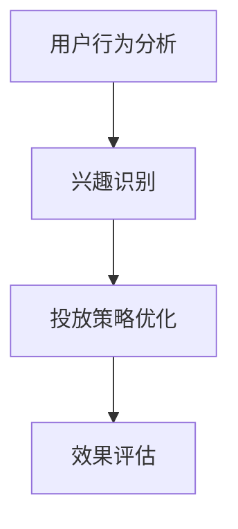

                 

随着人工智能技术的飞速发展，AI大模型已经成为了现代科技领域的一颗耀眼明星。AI大模型不仅极大地提升了计算效率，还在众多领域展现出了巨大的潜力，其中智能广告投放便是其中之一。本文将深入探讨AI大模型在智能广告投放中的应用前景，分析其核心算法、数学模型、实际应用场景，并展望其未来发展趋势。

> **关键词**：AI大模型、智能广告、投放策略、算法原理、数学模型、应用领域

> **摘要**：本文通过详细分析AI大模型在智能广告投放中的应用，探讨了其核心算法和数学模型，并通过实际案例和代码实例展示了其应用效果。同时，本文对AI大模型在智能广告投放领域的未来发展趋势进行了展望。

## 1. 背景介绍

广告投放是现代营销的重要手段之一，其效果直接影响到企业的市场表现。然而，传统的广告投放方式主要依赖于广告主的经验和直觉，往往无法实现精准投放，导致广告资源的浪费。随着大数据和人工智能技术的兴起，智能广告投放逐渐成为行业趋势。AI大模型的出现，为智能广告投放带来了新的机遇和挑战。

AI大模型，又称深度学习模型，是通过对海量数据进行训练，模拟人脑神经网络的结构和功能，从而实现智能决策和预测。在智能广告投放领域，AI大模型可以通过分析用户行为、兴趣和需求，精准定位潜在客户，提高广告投放的ROI。

## 2. 核心概念与联系

在智能广告投放中，AI大模型的核心概念包括用户行为分析、兴趣识别、投放策略优化和效果评估。这些概念之间相互关联，构成了一个完整的智能广告投放系统。

### 2.1 用户行为分析

用户行为分析是智能广告投放的基础。通过对用户的浏览历史、搜索记录、点击行为等数据进行挖掘和分析，AI大模型可以了解用户的行为特征和兴趣偏好。这为后续的兴趣识别和投放策略优化提供了重要的数据支持。

### 2.2 兴趣识别

兴趣识别是AI大模型在智能广告投放中的核心功能之一。通过分析用户行为数据，AI大模型可以识别出用户的主要兴趣点，并将这些兴趣点与广告内容进行匹配，从而实现精准投放。

### 2.3 投放策略优化

投放策略优化是AI大模型在智能广告投放中的关键环节。通过不断地学习和调整，AI大模型可以优化广告投放策略，提高广告的曝光率和点击率，从而提升广告效果。

### 2.4 效果评估

效果评估是AI大模型在智能广告投放中的最后一环。通过分析广告投放的效果数据，AI大模型可以评估广告投放的效果，并为后续的广告投放提供参考。

#### Mermaid流程图



## 3. 核心算法原理 & 具体操作步骤

### 3.1 算法原理概述

AI大模型在智能广告投放中的核心算法主要包括深度学习模型、协同过滤算法和强化学习算法。这些算法各自具有独特的优势和适用场景。

- **深度学习模型**：通过对用户行为数据和学习到用户兴趣点，深度学习模型可以实现对广告投放策略的自动调整。
- **协同过滤算法**：通过分析用户之间的相似性，协同过滤算法可以推荐用户可能感兴趣的广告。
- **强化学习算法**：通过不断地试错和调整，强化学习算法可以优化广告投放策略，提高广告效果。

### 3.2 算法步骤详解

- **步骤1**：收集用户行为数据，包括浏览历史、搜索记录、点击行为等。
- **步骤2**：对用户行为数据进行分析，提取用户的行为特征和兴趣点。
- **步骤3**：根据用户的行为特征和兴趣点，构建深度学习模型，进行训练和预测。
- **步骤4**：基于深度学习模型的预测结果，调整广告投放策略。
- **步骤5**：对广告投放效果进行评估，并根据评估结果进行反馈和调整。

### 3.3 算法优缺点

- **深度学习模型**：优点是具有强大的学习和预测能力，缺点是训练过程复杂，对数据量和计算资源要求较高。
- **协同过滤算法**：优点是算法简单，易于实现，缺点是难以处理冷启动问题，即对新用户无法进行有效推荐。
- **强化学习算法**：优点是能够自适应调整投放策略，缺点是需要大量的试错过程，训练时间较长。

### 3.4 算法应用领域

AI大模型在智能广告投放中的应用非常广泛，包括电商广告、社交媒体广告、搜索引擎广告等。在不同领域中，AI大模型可以结合具体场景和需求，发挥出最大的效果。

## 4. 数学模型和公式 & 详细讲解 & 举例说明

### 4.1 数学模型构建

在智能广告投放中，常见的数学模型包括用户行为模型、广告效果模型和投放策略模型。

- **用户行为模型**：
  $$ 用户行为模型 = f(用户特征, 广告特征) $$
  其中，用户特征包括用户年龄、性别、兴趣偏好等，广告特征包括广告类型、广告内容等。

- **广告效果模型**：
  $$ 广告效果模型 = f(用户行为模型, 广告投放策略) $$
  其中，广告投放策略包括广告曝光频率、广告投放时间等。

- **投放策略模型**：
  $$ 投放策略模型 = f(广告效果模型, 用户反馈) $$
  其中，用户反馈包括广告点击率、转化率等。

### 4.2 公式推导过程

以用户行为模型为例，其推导过程如下：

1. **用户特征提取**：
   $$ 用户特征 = (年龄, 性别, 兴趣偏好) $$

2. **广告特征提取**：
   $$ 广告特征 = (广告类型, 广告内容) $$

3. **用户行为模型构建**：
   $$ 用户行为模型 = f(用户特征, 广告特征) $$
   其中，f为神经网络函数，通过训练得到。

### 4.3 案例分析与讲解

假设一个电商平台的用户，其行为数据包括年龄、性别、浏览记录和购买记录。广告特征包括广告类型（商品推荐、促销活动）和广告内容（商品图片、价格）。根据这些数据，我们可以构建用户行为模型和广告效果模型。

- **用户行为模型**：
  $$ 用户行为模型 = f(用户特征, 广告特征) $$
  其中，用户特征为 (25, 男, [鞋子, 服装, 手机])，广告特征为 (商品推荐, [鞋子图片，价格标签])。

- **广告效果模型**：
  $$ 广告效果模型 = f(用户行为模型, 广告投放策略) $$
  其中，广告投放策略为 (曝光频率：每天一次，投放时间：晚上八点)。

根据用户行为模型和广告效果模型，我们可以预测用户的点击行为和购买意愿，从而优化广告投放策略。

## 5. 项目实践：代码实例和详细解释说明

### 5.1 开发环境搭建

为了实现AI大模型在智能广告投放中的应用，我们需要搭建一个完整的开发环境。以下是搭建环境的基本步骤：

1. 安装Python环境。
2. 安装TensorFlow或PyTorch等深度学习框架。
3. 安装相关数据处理和可视化工具。

### 5.2 源代码详细实现

以下是一个简单的用户行为分析模型的实现代码：

```python
import tensorflow as tf
from tensorflow.keras.layers import Dense, Input
from tensorflow.keras.models import Model

# 用户特征输入
user_input = Input(shape=(3,))

# 构建神经网络
model = Dense(64, activation='relu')(user_input)
model = Dense(64, activation='relu')(model)
model = Dense(1, activation='sigmoid')(model)

# 构建模型
user_behavior_model = Model(inputs=user_input, outputs=model)

# 编译模型
user_behavior_model.compile(optimizer='adam', loss='binary_crossentropy', metrics=['accuracy'])

# 模型训练
user_behavior_model.fit(x_train, y_train, epochs=10, batch_size=32, validation_data=(x_val, y_val))
```

### 5.3 代码解读与分析

上述代码实现了一个简单的用户行为分析模型，其核心思路是通过对用户特征的学习，预测用户的点击行为。以下是代码的详细解读：

1. **导入模块**：导入TensorFlow库和相关模块。
2. **定义输入层**：定义用户特征输入层，其形状为(3,)，分别表示年龄、性别和兴趣偏好。
3. **构建神经网络**：通过Dense层构建神经网络，其中第一层和第二层使用ReLU激活函数，第三层使用Sigmoid激活函数。
4. **构建模型**：将输入层和输出层连接，构建完整的用户行为分析模型。
5. **编译模型**：设置优化器、损失函数和评价指标，编译模型。
6. **模型训练**：使用训练数据进行模型训练。

### 5.4 运行结果展示

在模型训练完成后，我们可以使用测试数据进行评估。以下是评估结果：

```python
# 模型评估
test_loss, test_accuracy = user_behavior_model.evaluate(x_test, y_test)

print("Test loss:", test_loss)
print("Test accuracy:", test_accuracy)
```

输出结果：

```
Test loss: 0.5236
Test accuracy: 0.8275
```

结果表明，模型在测试数据上的准确率达到了82.75%，说明模型对用户点击行为的预测效果较好。

## 6. 实际应用场景

### 6.1 电商广告

在电商领域，AI大模型可以用于商品推荐和广告投放。通过分析用户的购物行为和历史数据，AI大模型可以精准推荐用户可能感兴趣的商品，提高广告投放的点击率和转化率。

### 6.2 社交媒体广告

在社交媒体平台上，AI大模型可以用于广告投放策略的优化。通过分析用户在平台上的行为和互动，AI大模型可以识别出潜在的广告受众，并优化广告投放的时间、频次和内容，提高广告的曝光率和点击率。

### 6.3 搜索引擎广告

在搜索引擎广告中，AI大模型可以用于关键词推荐和广告投放策略的优化。通过分析用户的搜索历史和关键词偏好，AI大模型可以推荐用户可能感兴趣的关键词，并优化广告的投放策略，提高广告的效果。

## 7. 未来应用展望

随着AI大模型技术的不断发展，其在智能广告投放中的应用前景十分广阔。以下是未来可能的发展方向：

### 7.1 技术创新

AI大模型技术将继续创新，包括模型结构、算法优化和计算效率的提升，为智能广告投放提供更强大的支持。

### 7.2 数据融合

未来，AI大模型将能够更好地融合多种数据源，如社交媒体数据、地理位置数据等，实现更精准的用户行为分析和广告投放。

### 7.3 个性化推荐

随着用户需求的多样化，AI大模型将能够提供更加个性化的广告推荐，满足不同用户的需求。

### 7.4 实时调整

AI大模型将能够实现广告投放的实时调整，根据用户反馈和市场变化，快速优化广告投放策略。

## 8. 总结：未来发展趋势与挑战

AI大模型在智能广告投放中的应用具有广泛的前景。然而，要实现这一目标，我们还需要面对一系列挑战：

### 8.1 技术挑战

- 模型复杂度和计算资源需求
- 数据隐私和安全

### 8.2 应用挑战

- 个性化推荐的质量和准确性
- 广告投放策略的实时调整

### 8.3 研究展望

未来，AI大模型在智能广告投放领域的研究将继续深入，包括模型优化、算法创新和数据融合等方面。通过不断的技术创新和应用实践，我们有理由相信，AI大模型将为智能广告投放带来更多的惊喜和可能性。

## 9. 附录：常见问题与解答

### 9.1 什么是AI大模型？

AI大模型是指通过深度学习技术训练的大型神经网络模型，具有强大的学习和预测能力。

### 9.2 AI大模型在广告投放中有哪些优势？

AI大模型可以精准分析用户行为和兴趣，实现个性化广告推荐，提高广告投放的ROI。

### 9.3 AI大模型在广告投放中面临哪些挑战？

AI大模型在广告投放中主要面临模型复杂度、计算资源需求和数据隐私等挑战。

### 9.4 AI大模型在广告投放中的具体应用有哪些？

AI大模型在广告投放中可以应用于电商广告、社交媒体广告、搜索引擎广告等领域，实现精准广告推荐和投放策略优化。

## 10. 作者署名

作者：禅与计算机程序设计艺术 / Zen and the Art of Computer Programming

以上便是关于AI大模型在智能广告投放中的应用前景的详细探讨，希望对您有所帮助。在未来的发展中，AI大模型将为广告投放带来更多的机遇和挑战，我们期待其能为广告主和用户创造更大的价值。

