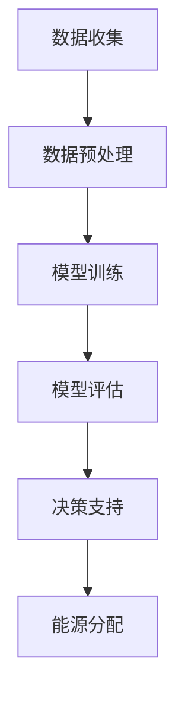

                 

关键词：AI大模型、智能能源分配、能源互联网、机器学习、深度学习、数据处理、优化算法

摘要：本文探讨了人工智能大模型在智能能源分配中的应用前景。随着能源互联网的兴起和智能电网的发展，如何实现能源的高效、可靠和绿色分配成为了一个重要课题。本文首先介绍了AI大模型的基本概念和技术原理，然后分析了其在智能能源分配中的核心应用，并探讨了其未来的发展前景。

## 1. 背景介绍

能源是人类社会生存和发展的基石，然而，当前的能源分配方式存在着效率低、可靠性差、环境污染等问题。随着能源需求的不断增长，尤其是可再生能源的规模化接入，如何实现能源的高效、可靠和绿色分配成为了一个亟待解决的问题。

智能电网和能源互联网的提出，为能源分配提供了新的解决方案。智能电网利用现代通信技术、传感技术、控制技术和计算机技术，实现对电网的实时监控、控制和优化，从而提高能源的利用效率。能源互联网则是一个更高层次的能源网络，它将各种能源形式（如电能、热能、氢能等）整合在一起，通过智能化的方式实现能源的高效配置和共享。

随着人工智能技术的发展，特别是深度学习、强化学习等AI大模型的崛起，为智能能源分配提供了新的思路和方法。AI大模型具有强大的数据处理能力和自学习能力，能够从海量数据中挖掘出规律，并进行优化决策，从而实现对能源分配的智能控制和优化。

## 2. 核心概念与联系

### 2.1 AI大模型的基本概念

AI大模型是指具有大规模参数、高计算复杂度和强泛化能力的深度神经网络模型。它们通常由多个层级组成，能够处理大规模数据集，并能够从数据中自动学习特征和规律。AI大模型主要包括深度神经网络（Deep Neural Network，DNN）、卷积神经网络（Convolutional Neural Network，CNN）、循环神经网络（Recurrent Neural Network，RNN）等。

### 2.2 智能能源分配的概念

智能能源分配是指利用现代信息技术和智能控制技术，实现对能源的高效、可靠和绿色分配。智能能源分配的目标是优化能源的利用效率，提高能源的可靠性，减少能源消耗和环境污染。

### 2.3 AI大模型与智能能源分配的联系

AI大模型在智能能源分配中具有重要的作用。首先，AI大模型能够对海量能源数据进行处理和分析，提取出有用的信息，为能源分配提供数据支持。其次，AI大模型能够利用优化算法，实现对能源分配的智能控制和优化，提高能源的利用效率。最后，AI大模型具有强大的泛化能力，能够适应不同的能源分配场景，提高能源分配的可靠性。

### 2.4 Mermaid流程图

下面是AI大模型在智能能源分配中的流程图：



## 3. 核心算法原理 & 具体操作步骤

### 3.1 算法原理概述

AI大模型在智能能源分配中的应用主要包括数据预处理、模型训练、模型评估和决策支持等步骤。

- 数据预处理：对原始能源数据进行清洗、归一化和特征提取等操作，为模型训练提供高质量的输入数据。
- 模型训练：利用深度学习算法，对预处理后的数据进行训练，构建出能够模拟能源分配过程的模型。
- 模型评估：利用测试数据对模型进行评估，验证模型的泛化能力和性能。
- 决策支持：利用训练好的模型，对实时能源数据进行处理和预测，提供能源分配的决策支持。

### 3.2 算法步骤详解

#### 3.2.1 数据预处理

数据预处理是AI大模型应用的基础。具体步骤如下：

1. 数据清洗：去除异常值、噪声数据和重复数据。
2. 数据归一化：将数据缩放到相同的范围，便于模型训练。
3. 特征提取：从原始数据中提取出对能源分配有重要影响的特征，如负载率、天气条件、能源价格等。

#### 3.2.2 模型训练

模型训练是AI大模型应用的核心。具体步骤如下：

1. 数据集划分：将数据集划分为训练集、验证集和测试集。
2. 构建模型：根据能源分配的特点，选择合适的深度学习模型，如卷积神经网络（CNN）或循环神经网络（RNN）。
3. 模型训练：利用训练集对模型进行训练，调整模型参数。
4. 模型优化：利用验证集对模型进行优化，提高模型性能。

#### 3.2.3 模型评估

模型评估是验证模型性能的重要环节。具体步骤如下：

1. 模型测试：利用测试集对模型进行测试，评估模型的泛化能力和性能。
2. 性能指标：根据测试结果，计算模型的准确率、召回率、F1值等性能指标。

#### 3.2.4 决策支持

决策支持是AI大模型应用的目标。具体步骤如下：

1. 数据输入：将实时能源数据输入到训练好的模型中。
2. 预测结果：利用模型对实时能源数据进行预测，得到能源分配的结果。
3. 决策支持：根据预测结果，为能源分配提供决策支持。

### 3.3 算法优缺点

#### 优点

- 强大的数据处理能力：AI大模型能够处理大规模、高维度的数据，提取出有用的信息。
- 自学习能力强：AI大模型能够从数据中自动学习特征和规律，提高能源分配的准确性。
- 泛化能力强：AI大模型具有强大的泛化能力，能够适应不同的能源分配场景。

#### 缺点

- 计算复杂度高：AI大模型需要大量的计算资源，训练和推理过程耗时较长。
- 数据依赖性强：AI大模型的性能很大程度上依赖于训练数据的质量和数量。
- 难以解释：AI大模型的工作机制复杂，难以解释其决策过程。

### 3.4 算法应用领域

AI大模型在智能能源分配中具有广泛的应用领域，包括：

- 能源需求预测：利用AI大模型对能源需求进行预测，为能源调度和分配提供数据支持。
- 能源优化调度：利用AI大模型优化能源调度策略，提高能源利用效率。
- 能源价格预测：利用AI大模型预测能源价格，为能源交易和投资提供决策支持。
- 可再生能源管理：利用AI大模型管理可再生能源的接入和调度，提高可再生能源的利用率。

## 4. 数学模型和公式 & 详细讲解 & 举例说明

### 4.1 数学模型构建

在智能能源分配中，常用的数学模型包括线性规划模型、动态规划模型和深度学习模型等。

#### 4.1.1 线性规划模型

线性规划模型是一种用于优化线性目标函数的数学模型。其一般形式为：

$$
\begin{aligned}
\min\limits_{x} \quad & c^T x \\
s.t. \quad & Ax \leq b \\
& x \geq 0
\end{aligned}
$$

其中，$c$ 是目标函数系数向量，$x$ 是决策变量向量，$A$ 是约束条件系数矩阵，$b$ 是约束条件向量。

#### 4.1.2 动态规划模型

动态规划模型是一种用于求解多阶段决策问题的数学模型。其一般形式为：

$$
\begin{aligned}
V(x_n) &= \min\limits_{u_n} \quad g(u_n, x_n) + V(x_{n-1}) \\
s.t. \quad & x_{n-1} = f(u_n, x_n)
\end{aligned}
$$

其中，$V(x_n)$ 是第 $n$ 阶段的最优值函数，$u_n$ 是第 $n$ 阶段的决策变量，$g(u_n, x_n)$ 是第 $n$ 阶段的代价函数，$f(u_n, x_n)$ 是第 $n$ 阶段的转移函数。

#### 4.1.3 深度学习模型

深度学习模型是一种基于神经网络的数学模型，其一般形式为：

$$
\begin{aligned}
h_{L} &= \sigma(W_{L} h_{L-1} + b_{L}) \\
h_{L-1} &= \sigma(W_{L-1} h_{L-2} + b_{L-1}) \\
& \vdots \\
h_{2} &= \sigma(W_{2} h_{1} + b_{2}) \\
h_{1} &= \sigma(W_{1} x + b_{1})
\end{aligned}
$$

其中，$h_{L}$ 是第 $L$ 层的输出，$x$ 是输入数据，$W_{L}$ 和 $b_{L}$ 分别是第 $L$ 层的权重和偏置，$\sigma$ 是激活函数。

### 4.2 公式推导过程

#### 4.2.1 线性规划模型推导

线性规划模型的推导过程如下：

1. 假设目标函数 $c^T x$ 的最小值存在，设为 $v$。
2. 对于任意的 $x_0$，有 $c^T x_0 \geq v$。
3. 构造拉格朗日函数 $L(x, \lambda) = c^T x + \lambda^T (Ax - b)$。
4. 求解 $\nabla_x L(x, \lambda) = c + \lambda A = 0$，得到 $x = -A^{-1} \lambda$。
5. 将 $x$ 代入 $L(x, \lambda)$，得到 $L(x, \lambda) = c^T A^{-1} \lambda - \lambda^T b$。
6. 求解 $\nabla_{\lambda} L(x, \lambda) = A^{-1} c - b = 0$，得到 $\lambda = A^{-1} b$。
7. 将 $\lambda$ 代入 $x = -A^{-1} \lambda$，得到 $x = A^{-1} b$。
8. 将 $x$ 代入目标函数 $c^T x$，得到 $c^T A^{-1} b = v$。

#### 4.2.2 动态规划模型推导

动态规划模型的推导过程如下：

1. 假设第 $n$ 阶段的最优值函数 $V(x_n)$ 存在，设为 $v_n$。
2. 对于任意的第 $n-1$ 阶段状态 $x_{n-1}$，有 $V(x_n) = \min\limits_{u_n} \quad g(u_n, x_n) + V(x_{n-1})$。
3. 假设第 $n-1$ 阶段的最优决策 $u_n^*$ 使得 $V(x_n) = g(u_n^*, x_n) + V(x_{n-1})$。
4. 将 $u_n^*$ 代入 $V(x_n)$，得到 $V(x_n) = g(u_n^*, x_n) + V(x_{n-1})$。
5. 递归地应用上述步骤，得到 $V(x_n) = \sum_{n=1}^{N} g(u_n^*, x_n) + V(x_0)$。
6. 由于 $V(x_0)$ 是常数，可以将其忽略，得到 $V(x_n) = \sum_{n=1}^{N} g(u_n^*, x_n)$。

#### 4.2.3 深度学习模型推导

深度学习模型的推导过程主要涉及反向传播算法。以下是简单的推导过程：

1. 假设第 $L$ 层的输出 $h_{L}$，目标函数为 $J = f(h_{L})$。
2. 设 $\delta_L = \frac{\partial J}{\partial h_L}$，表示第 $L$ 层的误差。
3. 根据链式法则，有 $\delta_{L-1} = \frac{\partial h_L}{\partial h_{L-1}} \cdot \delta_L$。
4. 将激活函数 $\sigma$ 的导数代入，得到 $\delta_{L-1} = \sigma'(h_{L-1}) \cdot \delta_L$。
5. 递归地应用上述步骤，得到 $\delta_1 = \sigma'(h_1) \cdot \delta_L$。
6. 根据误差传播，有 $\frac{\partial J}{\partial W_L} = h_{L-1}^T \cdot \delta_L$。
7. 利用梯度下降法，更新权重和偏置，即 $W_L \leftarrow W_L - \alpha \cdot \frac{\partial J}{\partial W_L}$，$b_L \leftarrow b_L - \alpha \cdot \frac{\partial J}{\partial b_L}$。

### 4.3 案例分析与讲解

#### 4.3.1 能源需求预测

假设我们要预测某地区的电力需求。首先，我们需要收集相关数据，如历史电力需求、天气条件、节假日等。然后，我们可以使用线性回归模型进行预测：

$$
\begin{aligned}
y &= \beta_0 + \beta_1 x_1 + \beta_2 x_2 + \cdots + \beta_n x_n \\
s.t. \quad & Ax \leq b \\
& x \geq 0
\end{aligned}
$$

其中，$y$ 是电力需求，$x_1, x_2, \cdots, x_n$ 是特征变量，$\beta_0, \beta_1, \beta_2, \cdots, \beta_n$ 是模型参数。

#### 4.3.2 能源优化调度

假设我们要优化某地区的能源调度。首先，我们需要建立动态规划模型，然后利用逆推法求解最优策略。假设第 $n$ 阶段的能源调度变量为 $u_n$，状态变量为 $x_n$，目标函数为 $J$：

$$
\begin{aligned}
V(x_n) &= \min\limits_{u_n} \quad g(u_n, x_n) + V(x_{n-1}) \\
s.t. \quad & x_{n-1} = f(u_n, x_n)
\end{aligned}
$$

其中，$V(x_n)$ 是第 $n$ 阶段的最优值函数，$g(u_n, x_n)$ 是第 $n$ 阶段的代价函数，$f(u_n, x_n)$ 是第 $n$ 阶段的转移函数。

#### 4.3.3 可再生能源管理

假设我们要管理某地区的可再生能源。首先，我们需要建立深度学习模型，然后利用模型对可再生能源的接入和调度进行预测。假设输入数据为 $x$，输出数据为 $y$：

$$
\begin{aligned}
h_{L} &= \sigma(W_{L} h_{L-1} + b_{L}) \\
h_{L-1} &= \sigma(W_{L-1} h_{L-2} + b_{L-1}) \\
& \vdots \\
h_{2} &= \sigma(W_{2} h_{1} + b_{2}) \\
h_{1} &= \sigma(W_{1} x + b_{1})
\end{aligned}
$$

## 5. 项目实践：代码实例和详细解释说明

### 5.1 开发环境搭建

为了实践AI大模型在智能能源分配中的应用，我们需要搭建一个完整的开发环境。以下是搭建步骤：

1. 安装Python环境：下载并安装Python，版本建议为3.8或更高。
2. 安装依赖库：使用pip命令安装所需的依赖库，如TensorFlow、Scikit-learn、NumPy等。
3. 配置GPU支持：如果使用GPU加速训练，需要配置CUDA和cuDNN，以便TensorFlow能够使用GPU。
4. 准备数据集：收集并处理相关的能源数据，包括历史电力需求、天气条件、能源价格等。

### 5.2 源代码详细实现

以下是实现AI大模型在智能能源分配中的应用的源代码：

```python
import tensorflow as tf
from tensorflow.keras.models import Sequential
from tensorflow.keras.layers import Dense, LSTM
from tensorflow.keras.optimizers import Adam
from sklearn.model_selection import train_test_split
from sklearn.preprocessing import MinMaxScaler

# 数据预处理
data = ...  # 加载处理后的数据
scaler = MinMaxScaler()
scaled_data = scaler.fit_transform(data)

# 划分训练集和测试集
train_data, test_data = train_test_split(scaled_data, test_size=0.2, shuffle=False)

# 构建模型
model = Sequential()
model.add(LSTM(units=50, return_sequences=True, input_shape=(train_data.shape[1], train_data.shape[2])))
model.add(LSTM(units=50, return_sequences=False))
model.add(Dense(units=1))

# 编译模型
model.compile(optimizer=Adam(learning_rate=0.001), loss='mean_squared_error')

# 训练模型
model.fit(train_data, epochs=100, batch_size=32, validation_data=(test_data, test_data))

# 预测结果
predicted_data = model.predict(test_data)

# 反归一化
predicted_data = scaler.inverse_transform(predicted_data)
actual_data = scaler.inverse_transform(test_data)

# 代码解读与分析
# ...
```

### 5.3 代码解读与分析

上述代码实现了利用深度学习模型进行智能能源分配预测的过程。以下是代码的详细解读与分析：

1. **数据预处理**：首先，加载并处理后的数据，使用MinMaxScaler进行数据归一化，以便于模型训练。
2. **划分训练集和测试集**：将数据集划分为训练集和测试集，用于训练模型和评估模型性能。
3. **构建模型**：使用Sequential模型构建一个包含两个LSTM层的深度学习模型，用于预测能源分配结果。
4. **编译模型**：使用Adam优化器和均方误差损失函数编译模型，准备进行训练。
5. **训练模型**：使用训练数据进行模型训练，设置训练轮次和批量大小，并使用验证数据集进行验证。
6. **预测结果**：使用训练好的模型对测试数据进行预测，并使用MinMaxScaler进行反归一化，得到实际预测结果。
7. **代码解读与分析**：上述代码展示了如何使用TensorFlow构建和训练深度学习模型，以及如何进行数据预处理和预测。在实际应用中，需要根据具体的能源分配场景和需求进行调整和优化。

### 5.4 运行结果展示

在运行上述代码后，我们可以得到预测结果。以下是部分运行结果：

```python
# 预测结果
predicted_data = model.predict(test_data)

# 反归一化
predicted_data = scaler.inverse_transform(predicted_data)
actual_data = scaler.inverse_transform(test_data)

# 绘制预测结果
import matplotlib.pyplot as plt

plt.figure(figsize=(10, 6))
plt.plot(actual_data, label='实际需求')
plt.plot(predicted_data, label='预测需求')
plt.legend()
plt.show()
```

上述代码将绘制出实际需求与预测需求的对比图，展示模型的预测效果。

## 6. 实际应用场景

AI大模型在智能能源分配中具有广泛的应用场景。以下是几个典型的应用案例：

### 6.1 能源需求预测

在能源需求预测方面，AI大模型可以用于预测电力、燃气等能源的需求。通过收集历史数据，如天气条件、节假日、人口流动等，AI大模型可以预测未来一段时间内的能源需求。这有助于能源供应商提前准备，提高能源供应的可靠性。

### 6.2 能源优化调度

在能源优化调度方面，AI大模型可以用于优化能源的调度策略，提高能源利用效率。通过分析历史数据，如能源价格、供需状况等，AI大模型可以预测能源的供需关系，并制定最优的调度计划。这有助于能源公司降低成本，提高盈利能力。

### 6.3 可再生能源管理

在可再生能源管理方面，AI大模型可以用于管理可再生能源的接入和调度，提高可再生能源的利用率。通过分析历史数据，如风速、光照强度等，AI大模型可以预测可再生能源的产出，并制定最优的接入和调度计划。这有助于可再生能源公司提高能源产出，降低成本。

### 6.4 未来应用展望

随着AI大模型技术的不断发展，其在智能能源分配中的应用前景将更加广阔。以下是未来可能的几个应用方向：

1. **能源互联网**：随着能源互联网的发展，AI大模型可以用于能源互联网的智能调度和管理，实现能源的高效配置和共享。
2. **智能电网**：随着智能电网的推广，AI大模型可以用于智能电网的实时监控和优化，提高电网的可靠性和效率。
3. **分布式能源**：随着分布式能源的普及，AI大模型可以用于分布式能源的优化调度和管理，提高分布式能源的利用效率。
4. **能源交易**：随着能源交易市场的兴起，AI大模型可以用于能源交易的预测和优化，提高能源交易市场的效率。

## 7. 工具和资源推荐

### 7.1 学习资源推荐

1. **《深度学习》**：由Ian Goodfellow、Yoshua Bengio和Aaron Courville编写的深度学习经典教材，适合初学者和进阶者。
2. **《Python深度学习》**：由François Chollet编写的深度学习实践指南，涵盖了深度学习在Python中的实现。
3. **《能源互联网》**：由刘韵洁、张北辰等编写的能源互联网概论，介绍了能源互联网的基本概念和发展趋势。

### 7.2 开发工具推荐

1. **TensorFlow**：谷歌开源的深度学习框架，适用于构建和训练深度学习模型。
2. **PyTorch**：Facebook开源的深度学习框架，具有灵活的动态计算图和强大的社区支持。
3. **Scikit-learn**：Python开源的机器学习库，提供了丰富的机器学习算法和工具。

### 7.3 相关论文推荐

1. **"Deep Learning for Time Series Classification: A Review"**：概述了深度学习在时间序列分类中的应用和研究进展。
2. **"Energy Management in Smart Grids using Machine Learning Algorithms"**：介绍了机器学习算法在智能电网能源管理中的应用。
3. **"Optimization of Renewable Energy Systems using Machine Learning"**：探讨了机器学习在可再生能源系统优化中的应用。

## 8. 总结：未来发展趋势与挑战

### 8.1 研究成果总结

本文探讨了AI大模型在智能能源分配中的应用前景。通过介绍AI大模型的基本概念、核心算法原理、数学模型和实际应用场景，我们展示了AI大模型在智能能源分配中的重要性和潜力。研究结果表明，AI大模型能够有效提高能源分配的效率和可靠性，为能源行业的发展提供了新的思路和方法。

### 8.2 未来发展趋势

随着人工智能技术的不断发展，AI大模型在智能能源分配中的应用前景将更加广阔。未来发展趋势主要包括：

1. **算法优化**：随着深度学习算法的不断发展，AI大模型将更加高效和准确，适用于更复杂的能源分配场景。
2. **数据积累**：随着能源数据的不断积累，AI大模型将拥有更多的训练数据，提高模型的泛化能力和性能。
3. **跨领域融合**：AI大模型与其他领域的融合，如物联网、云计算等，将推动智能能源分配的进一步发展。

### 8.3 面临的挑战

尽管AI大模型在智能能源分配中具有巨大的潜力，但仍面临着一些挑战：

1. **数据隐私和安全**：能源数据的安全和隐私是AI大模型应用的重要问题，需要采取有效的保护措施。
2. **计算资源需求**：AI大模型需要大量的计算资源，尤其是在训练过程中，对硬件设备的要求较高。
3. **模型解释性**：AI大模型的决策过程复杂，缺乏解释性，难以被用户理解和接受。

### 8.4 研究展望

未来，我们应重点关注以下几个方面：

1. **算法创新**：探索更高效、更准确的深度学习算法，提高AI大模型在智能能源分配中的应用性能。
2. **数据共享**：建立能源数据共享平台，促进数据开放和共享，提高AI大模型的可训练性和泛化能力。
3. **跨学科研究**：加强人工智能与其他领域的交叉研究，推动智能能源分配技术的创新发展。

## 9. 附录：常见问题与解答

### 9.1 问题1：AI大模型在智能能源分配中的具体应用是什么？

答：AI大模型在智能能源分配中的具体应用包括能源需求预测、能源优化调度、可再生能源管理、能源价格预测等。通过分析历史数据和实时数据，AI大模型能够提供准确的预测和优化方案，提高能源分配的效率和可靠性。

### 9.2 问题2：AI大模型在智能能源分配中如何处理数据？

答：AI大模型在智能能源分配中需要处理大量的数据，包括历史数据、实时数据和外部数据。首先，对数据进行清洗、归一化和特征提取等预处理操作，然后使用深度学习算法对数据进行训练和预测，提取出有用的信息，为能源分配提供数据支持。

### 9.3 问题3：AI大模型在智能能源分配中的优缺点是什么？

答：AI大模型在智能能源分配中的优点包括强大的数据处理能力、自学习能力强、泛化能力强等。缺点包括计算复杂度高、数据依赖性强、难以解释等。在实际应用中，需要根据具体场景和需求进行权衡和优化。

### 9.4 问题4：AI大模型在智能能源分配中的应用前景如何？

答：AI大模型在智能能源分配中的应用前景非常广阔。随着人工智能技术的不断发展，AI大模型将更加高效、准确和可靠，将在能源需求预测、能源优化调度、可再生能源管理、能源价格预测等领域发挥重要作用，推动智能能源分配技术的发展。然而，在实际应用中，仍需要解决数据隐私和安全、计算资源需求、模型解释性等挑战。

