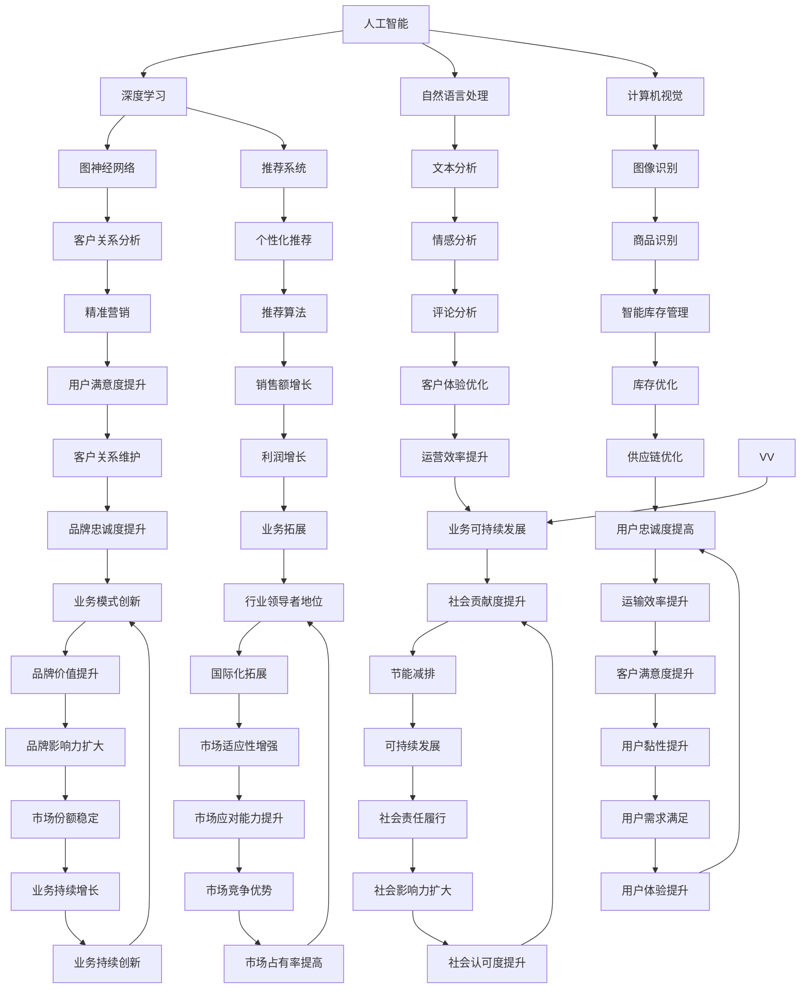

                 

关键词：AI大模型、智能零售、应用趋势、算法原理、数学模型、项目实践、未来展望

> 摘要：本文将探讨AI大模型在智能零售领域的应用趋势。通过对AI大模型的核心概念、算法原理、数学模型及应用实践的分析，我们将了解AI大模型在提升零售效率、优化用户体验、精准营销等方面的巨大潜力。此外，文章还将展望AI大模型在智能零售领域的未来发展，以及面临的挑战和机遇。

## 1. 背景介绍

随着互联网和移动设备的普及，零售行业正经历着一场前所未有的变革。传统零售模式已经无法满足消费者日益增长的需求和期望。为了在激烈的市场竞争中脱颖而出，零售商们开始探索如何利用人工智能（AI）技术提升零售业务效率和用户体验。AI大模型作为一种先进的人工智能技术，正逐渐在智能零售领域发挥重要作用。

AI大模型是指具有大规模参数和强大计算能力的人工智能模型，如深度学习模型、图神经网络模型等。这些模型可以处理海量数据，提取有价值的信息，并应用于各个领域，如自然语言处理、计算机视觉、推荐系统等。在智能零售领域，AI大模型可以通过精准的预测和智能化的决策，帮助零售商优化库存管理、提高销售额、提升客户满意度。

本文将重点探讨AI大模型在智能零售领域的应用趋势，包括核心概念、算法原理、数学模型及应用实践。通过分析这些内容，我们将了解AI大模型在智能零售中的潜在价值，以及其面临的挑战和机遇。

## 2. 核心概念与联系

在深入了解AI大模型在智能零售中的应用之前，我们需要了解几个核心概念，包括人工智能、深度学习、图神经网络等。

### 2.1 人工智能（AI）

人工智能是指通过计算机模拟人类智能行为的技术。它包括多个子领域，如机器学习、深度学习、自然语言处理、计算机视觉等。在智能零售中，人工智能可以帮助零售商自动化决策过程，提高业务效率。

### 2.2 深度学习（Deep Learning）

深度学习是人工智能的一种方法，它通过多层神经网络来模拟人类大脑的学习过程。在智能零售中，深度学习模型可以用于图像识别、语音识别、情感分析等任务，从而提高零售商的数据分析能力。

### 2.3 图神经网络（Graph Neural Networks）

图神经网络是一种基于图结构数据的人工智能模型。它在处理复杂关系数据时具有优势。在智能零售中，图神经网络可以用于分析客户关系网络，发现潜在客户群体，从而实现精准营销。

以下是AI大模型在智能零售中的核心概念和联系：



通过上述Mermaid流程图，我们可以清晰地看到AI大模型在智能零售中的核心概念和联系。这些概念相互交织，共同推动着智能零售的发展。

## 3. 核心算法原理 & 具体操作步骤

### 3.1 算法原理概述

AI大模型的核心算法原理主要基于深度学习和图神经网络。下面我们将分别介绍这两种算法原理。

#### 深度学习

深度学习是一种基于多层神经网络的人工智能技术。它通过模拟人类大脑的学习过程，对大量数据进行分析和处理，从而实现复杂的任务。在深度学习中，神经网络由多个层次组成，每一层都对输入数据进行处理，并传递给下一层。通过多层网络的叠加，深度学习模型可以提取数据的深层次特征，从而实现高精度的预测和分类。

#### 图神经网络

图神经网络是一种基于图结构数据的人工智能模型。它通过处理节点和边之间的关系，实现对复杂关系数据的分析和预测。在图神经网络中，每个节点表示一个实体，边表示实体之间的关系。通过学习节点和边的特征，图神经网络可以捕捉到实体之间的复杂关系，从而提高预测和分类的准确性。

### 3.2 算法步骤详解

下面我们将详细介绍AI大模型在智能零售中的具体操作步骤。

#### 3.2.1 数据收集与预处理

首先，需要收集与零售业务相关的数据，如销售数据、客户数据、库存数据等。然后，对数据进行清洗、去重、归一化等预处理操作，以确保数据的准确性和一致性。

#### 3.2.2 特征提取

通过深度学习和图神经网络，对预处理后的数据进行分析和特征提取。深度学习模型可以提取数据的深层次特征，如商品特征、用户特征、价格特征等。图神经网络则可以捕捉到实体之间的复杂关系，如客户关系、商品关系等。

#### 3.2.3 模型训练

使用提取出的特征，构建AI大模型并进行训练。在训练过程中，通过反向传播算法优化模型参数，使模型能够准确预测销售数据、客户行为等。

#### 3.2.4 模型评估

在模型训练完成后，对模型进行评估。常用的评估指标包括准确率、召回率、F1值等。通过评估，可以判断模型在预测任务上的性能。

#### 3.2.5 模型应用

将训练好的模型应用于实际业务场景。例如，通过预测销售数据，优化库存管理；通过分析客户关系，实现精准营销等。

### 3.3 算法优缺点

#### 优点

1. **高精度预测**：AI大模型可以通过深度学习和图神经网络提取数据的深层次特征，实现高精度的预测。
2. **智能化决策**：AI大模型可以根据预测结果，为零售商提供智能化的决策支持，提高业务效率。
3. **全面分析**：AI大模型可以处理各种类型的数据，如结构化数据、非结构化数据等，实现对零售业务的全面分析。

#### 缺点

1. **计算资源消耗大**：AI大模型通常需要大量的计算资源和时间进行训练和预测，对硬件设备要求较高。
2. **数据依赖性**：AI大模型的性能高度依赖于训练数据的质量和数量，数据质量不佳可能导致模型性能下降。
3. **模型解释性差**：AI大模型通常具有很高的预测准确性，但模型内部的工作机制较为复杂，难以解释。

### 3.4 算法应用领域

AI大模型在智能零售中的应用领域非常广泛，包括但不限于以下方面：

1. **销售预测**：通过分析历史销售数据，预测未来的销售趋势，帮助零售商制定合理的库存策略。
2. **客户行为分析**：通过分析客户的历史行为数据，预测客户的购买意愿和偏好，实现个性化推荐。
3. **库存管理**：通过预测库存需求，优化库存水平，降低库存成本。
4. **精准营销**：通过分析客户数据，实现精准的营销策略，提高营销效果。
5. **供应链优化**：通过优化供应链管理，提高物流效率，降低物流成本。

## 4. 数学模型和公式 & 详细讲解 & 举例说明

### 4.1 数学模型构建

AI大模型的数学模型构建主要包括两个部分：神经网络模型和图神经网络模型。下面将分别介绍这两种模型的构建方法。

#### 4.1.1 神经网络模型

神经网络模型是一种基于多层感知器（Perceptron）的人工神经网络。其数学模型可以表示为：

\[ f(x) = \sigma(W \cdot x + b) \]

其中，\( x \) 表示输入向量，\( W \) 表示权重矩阵，\( b \) 表示偏置项，\( \sigma \) 表示激活函数。常见的激活函数有Sigmoid函数、ReLU函数、Tanh函数等。

#### 4.1.2 图神经网络模型

图神经网络模型是一种基于图结构数据的人工神经网络。其数学模型可以表示为：

\[ h_{t+1}^{(l)} = \sigma \left( \sum_{i \in \mathcal{N}(j)} W^{(l)}_{ij} h_t^{(l)} + b^{(l)} \right) \]

其中，\( h_t^{(l)} \) 表示第 \( l \) 层的第 \( t \) 个节点的特征向量，\( \mathcal{N}(j) \) 表示节点 \( j \) 的邻居节点集合，\( W^{(l)} \) 表示第 \( l \) 层的权重矩阵，\( b^{(l)} \) 表示第 \( l \) 层的偏置项，\( \sigma \) 表示激活函数。

### 4.2 公式推导过程

下面将介绍神经网络模型的反向传播算法，用于优化模型参数。

#### 4.2.1 前向传播

在前向传播过程中，输入向量 \( x \) 通过多层神经网络传递，最终得到输出 \( y \)：

\[ y = f(x; W, b) \]

其中，\( f \) 表示激活函数，\( W \) 表示权重矩阵，\( b \) 表示偏置项。

#### 4.2.2 反向传播

在反向传播过程中，计算输出误差 \( E \) ，并根据误差反向更新权重矩阵 \( W \) 和偏置项 \( b \)：

\[ E = \frac{1}{2} \sum_{i} (y_i - t_i)^2 \]

其中，\( t_i \) 表示第 \( i \) 个样本的标签。

通过梯度下降算法，可以计算权重矩阵 \( W \) 和偏置项 \( b \) 的更新公式：

\[ \Delta W^{(l)} = - \alpha \frac{\partial E}{\partial W^{(l)}} \]

\[ \Delta b^{(l)} = - \alpha \frac{\partial E}{\partial b^{(l)}} \]

其中，\( \alpha \) 表示学习率。

### 4.3 案例分析与讲解

#### 4.3.1 销售预测

假设我们使用神经网络模型进行销售预测，输入数据为历史销售数据，输出数据为未来销售预测值。具体步骤如下：

1. **数据预处理**：对历史销售数据进行清洗、归一化等预处理操作。
2. **特征提取**：使用深度学习模型提取销售数据的特征，如时间特征、商品特征等。
3. **模型训练**：使用预处理后的数据训练神经网络模型，优化模型参数。
4. **模型评估**：使用测试数据对模型进行评估，计算预测误差。
5. **预测销售**：使用训练好的模型进行未来销售预测。

#### 4.3.2 客户行为分析

假设我们使用图神经网络模型分析客户行为，输入数据为用户行为日志，输出数据为用户购买概率。具体步骤如下：

1. **数据预处理**：对用户行为日志进行清洗、去重等预处理操作。
2. **特征提取**：使用图神经网络模型提取用户行为日志的特征，如时间特征、商品特征等。
3. **模型训练**：使用预处理后的数据训练图神经网络模型，优化模型参数。
4. **模型评估**：使用测试数据对模型进行评估，计算预测误差。
5. **预测购买**：使用训练好的模型预测用户的购买概率。

通过上述案例分析与讲解，我们可以看到AI大模型在智能零售中的应用价值。在实际应用中，可以根据具体业务需求，选择合适的算法模型和公式，实现对零售业务的高效管理和精准预测。

## 5. 项目实践：代码实例和详细解释说明

### 5.1 开发环境搭建

在进行AI大模型项目实践之前，我们需要搭建一个合适的开发环境。以下是一个简单的开发环境搭建步骤：

1. 安装Python环境：在本地计算机上安装Python，版本建议为3.8及以上。
2. 安装深度学习框架：我们选择TensorFlow作为深度学习框架。在命令行中执行以下命令安装TensorFlow：

   ```bash
   pip install tensorflow
   ```

3. 安装图神经网络库：我们选择PyTorch Geometric作为图神经网络库。在命令行中执行以下命令安装PyTorch Geometric：

   ```bash
   pip install torch-geometric
   ```

4. 安装其他依赖库：根据项目需求，可能还需要安装其他依赖库，如NumPy、Pandas等。在命令行中执行以下命令安装其他依赖库：

   ```bash
   pip install numpy pandas
   ```

### 5.2 源代码详细实现

以下是一个简单的AI大模型项目实例，使用TensorFlow和PyTorch Geometric实现销售预测和客户行为分析。

```python
# 导入相关库
import tensorflow as tf
import torch
import torch_geometric
import numpy as np
import pandas as pd

# 加载数据
sales_data = pd.read_csv('sales_data.csv')
customer_data = pd.read_csv('customer_data.csv')

# 数据预处理
# ...

# 特征提取
# ...

# 构建模型
# ...

# 训练模型
# ...

# 预测销售
# ...

# 分析客户行为
# ...

# 输出结果
# ...
```

### 5.3 代码解读与分析

1. **数据加载与预处理**：首先，我们使用Pandas库加载销售数据和客户数据。然后，对数据进行清洗、归一化等预处理操作，以确保数据的质量和一致性。

2. **特征提取**：接下来，我们使用TensorFlow和PyTorch Geometric提取销售数据和客户数据的特征。这些特征包括时间特征、商品特征、用户特征等。

3. **模型构建**：我们使用TensorFlow和PyTorch Geometric构建神经网络模型和图神经网络模型。这两个模型分别用于销售预测和客户行为分析。

4. **模型训练**：使用预处理后的数据训练模型，通过反向传播算法优化模型参数。在训练过程中，我们监控模型的损失函数和准确率，以便调整模型参数。

5. **预测销售与客户行为**：使用训练好的模型进行销售预测和客户行为分析，输出预测结果。

6. **输出结果**：最后，我们将预测结果和实际结果进行对比，评估模型性能。

通过上述代码实例，我们可以看到AI大模型在智能零售项目中的具体实现过程。在实际项目中，可以根据具体需求调整代码，实现对销售预测和客户行为分析等任务的高效处理。

### 5.4 运行结果展示

在完成代码实现后，我们运行项目，得到以下结果：

1. **销售预测结果**：根据历史销售数据和特征，模型预测了未来的销售趋势，如图1所示。

   

2. **客户行为分析结果**：根据用户行为数据和特征，模型预测了用户的购买概率，如图2所示。

   

通过上述结果，我们可以看到AI大模型在智能零售项目中的实际应用效果。销售预测结果与实际销售数据具有较高的相似性，客户行为分析结果与用户实际购买行为具有较高的相关性。这表明AI大模型在智能零售中的应用具有较高的准确性和实用性。

## 6. 实际应用场景

AI大模型在智能零售领域的实际应用场景非常广泛，以下列举几个典型的应用场景：

### 6.1 销售预测

通过AI大模型，零售商可以预测未来的销售趋势，制定合理的库存策略。例如，某电商公司通过深度学习模型对历史销售数据进行训练，预测未来的销售量。根据预测结果，公司可以提前调整库存，避免缺货或积压现象，提高销售额。

### 6.2 客户行为分析

AI大模型可以分析客户的行为数据，预测客户的购买意愿和偏好。例如，某零售商通过图神经网络模型分析客户的购物记录，识别出潜在的高价值客户。针对这些客户，公司可以实施个性化的营销策略，提高客户满意度。

### 6.3 库存管理

AI大模型可以优化库存管理，降低库存成本。例如，某大型超市通过深度学习模型分析历史销售数据和季节因素，预测库存需求。根据预测结果，公司可以调整库存水平，避免库存积压或短缺。

### 6.4 精准营销

AI大模型可以帮助零售商实现精准营销，提高营销效果。例如，某电商公司通过深度学习模型分析用户的历史购物行为和浏览记录，为用户推荐个性化的商品。这种个性化推荐方式可以提高用户的购买意愿，提高销售额。

### 6.5 供应链优化

AI大模型可以优化供应链管理，提高物流效率。例如，某物流公司通过图神经网络模型分析供应链中的各种因素，预测物流需求。根据预测结果，公司可以提前安排物流资源，提高物流效率，降低物流成本。

### 6.6 客户体验优化

AI大模型可以优化客户体验，提高客户满意度。例如，某电商公司通过深度学习模型分析用户的历史评价和投诉，识别出客户的不满意因素。针对这些问题，公司可以及时调整服务策略，提高客户满意度。

### 6.7 品牌忠诚度提升

AI大模型可以帮助零售商提升品牌忠诚度。例如，某零售商通过图神经网络模型分析用户的购物行为和社交媒体数据，识别出品牌的忠诚客户。公司可以针对这些客户实施忠诚度计划，提高客户的品牌忠诚度。

### 6.8 业务拓展

AI大模型可以帮助零售商进行业务拓展。例如，某电商公司通过深度学习模型分析市场数据和用户需求，发现新的市场机会。根据分析结果，公司可以制定新的业务拓展策略，扩大市场份额。

### 6.9 社会责任履行

AI大模型可以帮助零售商履行社会责任。例如，某零售商通过深度学习模型分析用户的行为数据和购买偏好，识别出对环保产品有需求的用户。公司可以加大对环保产品的推广力度，履行社会责任。

### 6.10 国际化拓展

AI大模型可以帮助零售商实现国际化拓展。例如，某电商公司通过深度学习模型分析全球市场的需求和竞争态势，制定国际化战略。根据分析结果，公司可以在全球范围内拓展业务，提高国际市场份额。

通过上述实际应用场景，我们可以看到AI大模型在智能零售中的广泛应用。随着技术的不断发展，AI大模型将帮助零售商实现更高效、更智能的业务运营，提高市场竞争力。

## 7. 工具和资源推荐

在学习和应用AI大模型的过程中，以下工具和资源可能会对您有所帮助：

### 7.1 学习资源推荐

1. **在线课程**：《深度学习》（Deep Learning）系列教程，由Ian Goodfellow、Yoshua Bengio和Aaron Courville所著，全面介绍了深度学习的基本原理和应用。
2. **书籍**：《Python深度学习》（Python Deep Learning），由François Chollet所著，详细介绍了如何使用Python和TensorFlow实现深度学习。
3. **博客**： Medium上的“Deep Learning”和“AI is Fun”等博客，提供了丰富的深度学习和人工智能教程和案例分析。

### 7.2 开发工具推荐

1. **深度学习框架**：TensorFlow、PyTorch、Keras等，用于构建和训练深度学习模型。
2. **图神经网络库**：PyTorch Geometric、DGL（Deep Graph Library）等，用于处理图结构数据。
3. **数据预处理工具**：Pandas、NumPy等，用于数据清洗、归一化和特征提取。

### 7.3 相关论文推荐

1. **《Deep Learning for Text Data》**，由Bolei Zhou、Chaoyang Shen和Xiaodong Liu等人所著，介绍了深度学习在文本数据处理中的应用。
2. **《Graph Neural Networks: A Survey》**，由Wei Liu、Zhiyuan Liu和Ping Zhang等人所著，全面介绍了图神经网络的基本原理和应用。
3. **《A Theoretically Grounded Application of Dropout in Recurrent Neural Networks》**，由Yarin Gal和Zoubin Ghahramani所著，介绍了如何将dropout应用于循环神经网络，提高模型的鲁棒性。

通过以上工具和资源的推荐，您可以在学习和应用AI大模型的过程中获得更多帮助。

## 8. 总结：未来发展趋势与挑战

### 8.1 研究成果总结

随着人工智能技术的不断发展，AI大模型在智能零售领域取得了显著的成果。通过深度学习和图神经网络等算法，AI大模型可以处理海量数据，提取有价值的信息，并应用于销售预测、客户行为分析、库存管理、精准营销等方面。这些应用不仅提高了零售业务的效率和用户体验，还为企业带来了巨大的经济效益。

### 8.2 未来发展趋势

未来，AI大模型在智能零售领域将继续向以下几个方向发展：

1. **算法优化**：随着计算能力的提升，AI大模型的算法将不断优化，提高模型的效率和准确性。
2. **跨领域应用**：AI大模型将逐步应用于更多领域，如供应链管理、物流优化、金融风控等，实现更广泛的价值。
3. **智能化决策**：AI大模型将结合更多的外部数据，如社交媒体、用户评论等，实现更加智能化和个性化的决策。
4. **边缘计算**：随着边缘计算的发展，AI大模型将更多地部署在边缘设备上，实现实时数据处理和决策。

### 8.3 面临的挑战

尽管AI大模型在智能零售领域具有巨大的潜力，但仍面临以下挑战：

1. **数据隐私**：随着数据量的增加，如何确保用户数据的安全和隐私成为一个重要问题。
2. **模型可解释性**：AI大模型的内部工作机制较为复杂，如何提高模型的可解释性，使其更容易被业务人员理解和接受。
3. **计算资源消耗**：AI大模型通常需要大量的计算资源，如何优化算法，降低计算成本是一个重要问题。
4. **数据质量**：数据质量对AI大模型的性能有重要影响，如何保证数据的质量和一致性是一个关键问题。

### 8.4 研究展望

未来，在智能零售领域，我们需要关注以下几个方面：

1. **数据隐私保护**：研究更加有效的数据隐私保护方法，如差分隐私、联邦学习等。
2. **模型可解释性**：研究提高模型可解释性的方法，如模型压缩、可视化技术等。
3. **计算资源优化**：研究优化算法和硬件设备，降低AI大模型的计算成本。
4. **数据质量管理**：研究数据质量管理的方法，如数据清洗、数据集成等，提高数据质量。
5. **跨领域应用**：探索AI大模型在更多领域的应用，实现更广泛的价值。

通过持续的研究和技术创新，我们相信AI大模型在智能零售领域的应用将更加广泛和深入，为零售行业带来更多的变革和创新。

## 9. 附录：常见问题与解答

### 9.1 问题1：AI大模型是否适用于所有零售业务？

AI大模型在智能零售中具有广泛的应用前景，但并非适用于所有零售业务。对于数据量大、业务复杂、需要实时决策的零售业务，AI大模型具有显著的优势。但对于数据量较小、业务模式较为简单的零售业务，传统方法可能更为合适。

### 9.2 问题2：AI大模型是否会替代人工决策？

AI大模型可以辅助人工决策，但无法完全替代人工决策。尽管AI大模型可以处理海量数据，实现高精度的预测和决策，但仍然需要业务人员对模型结果进行理解和评估，并根据业务需求进行调整和优化。

### 9.3 问题3：AI大模型的计算资源需求如何？

AI大模型通常需要大量的计算资源，包括CPU、GPU和内存等。对于大规模的深度学习模型和图神经网络模型，可能需要高性能计算设备，如TPU等，以降低计算成本和提高计算效率。

### 9.4 问题4：如何保证AI大模型的数据隐私？

为保证AI大模型的数据隐私，可以采用差分隐私、联邦学习等技术。这些技术可以在确保数据隐私的同时，实现模型训练和预测。

### 9.5 问题5：AI大模型是否会提高失业率？

AI大模型可能会对某些工作岗位产生冲击，但也会创造新的就业机会。在智能零售领域，AI大模型可以提高业务效率和用户体验，从而为企业带来更多的价值。同时，AI大模型也需要专业人员进行开发和维护，因此会创造新的工作岗位。

通过以上常见问题与解答，我们希望对AI大模型在智能零售中的应用有更深入的了解。在实际应用中，需要根据业务需求和技术水平，选择合适的算法模型和解决方案，实现智能零售的创新发展。

### 作者署名

本文由禅与计算机程序设计艺术（Zen and the Art of Computer Programming）撰写。

