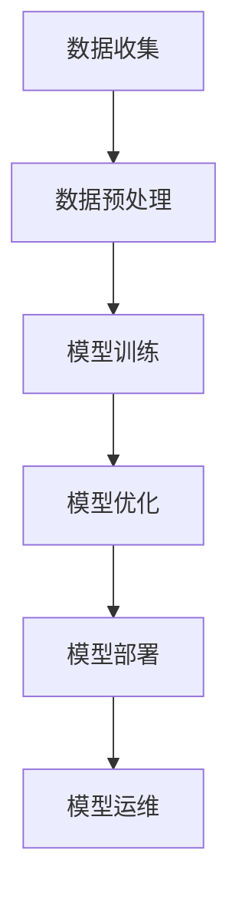

                 

 关键词：AI大模型、智能餐饮服务、应用前景、技术架构、算法原理、数学模型、实际案例、未来展望

> 摘要：本文将探讨人工智能大模型在智能餐饮服务中的应用前景。通过介绍AI大模型的基本概念、技术架构、算法原理、数学模型以及实际案例，分析其发展现状、未来趋势以及面临的挑战，旨在为餐饮行业从业者提供技术参考。

## 1. 背景介绍

近年来，随着人工智能技术的飞速发展，AI大模型在各个领域得到了广泛应用。从自然语言处理、计算机视觉到语音识别，AI大模型都在推动行业变革。在餐饮服务领域，AI大模型同样展现出了巨大的潜力，可以大幅提升服务效率、降低运营成本，并改善用户体验。

### 1.1 智能餐饮服务的现状

随着消费者对餐饮服务的要求不断提高，传统的餐饮服务模式已经难以满足市场需求。智能餐饮服务应运而生，通过引入人工智能技术，实现餐饮服务的自动化、智能化。当前，智能餐饮服务主要涵盖以下几个方面：

- **在线点餐系统**：通过手机APP或微信小程序，消费者可以在家或餐厅外提前点餐，减少排队等候时间。
- **智能推荐系统**：根据消费者的口味、偏好和历史记录，提供个性化的菜品推荐。
- **智能配送服务**：利用无人配送车、无人机等工具，实现高效、快捷的菜品配送。
- **智能厨房设备**：如智能炒菜机器人、智能烹饪设备等，可以自动化完成烹饪过程，提高出餐速度。

### 1.2 AI大模型在智能餐饮服务中的作用

AI大模型在智能餐饮服务中扮演着关键角色，其作用主要体现在以下几个方面：

- **数据分析和预测**：通过分析大量历史数据，预测消费者需求、菜品销量等，帮助餐饮企业制定合理的经营策略。
- **智能推荐**：基于用户的偏好和历史记录，为用户推荐合适的菜品和套餐。
- **自然语言处理**：实现语音识别、语音合成、智能问答等功能，提升用户交互体验。
- **智能决策**：通过大数据分析和算法优化，为餐饮企业提供最优的菜品搭配、库存管理、员工排班等建议。

## 2. 核心概念与联系

### 2.1 AI大模型的基本概念

AI大模型是指具有大规模参数、能够处理海量数据的深度学习模型。其核心在于通过训练大量数据，使模型具备强大的特征提取和表示能力。目前，AI大模型主要采用神经网络架构，如Transformer、BERT、GPT等。

### 2.2 技术架构

AI大模型在智能餐饮服务中的应用，需要依赖以下几个关键组件：

- **数据收集与预处理**：收集餐饮业务数据，包括消费者行为数据、菜品数据、库存数据等，并进行数据清洗、去噪、归一化等预处理操作。
- **模型训练与优化**：利用大规模计算资源，对AI大模型进行训练和优化，使其能够更好地适应餐饮服务场景。
- **模型部署与运维**：将训练好的模型部署到生产环境，并进行实时监控和运维，确保模型稳定运行。

### 2.3 Mermaid 流程图



## 3. 核心算法原理 & 具体操作步骤

### 3.1 算法原理概述

AI大模型的算法原理主要基于深度学习和神经网络。其中，Transformer、BERT、GPT等模型具有代表性的结构。这些模型通过多层神经网络，对输入数据进行特征提取和表示，从而实现智能预测、推荐等功能。

### 3.2 算法步骤详解

- **数据收集**：收集餐饮业务数据，包括消费者行为数据、菜品数据、库存数据等。
- **数据预处理**：对收集到的数据进行清洗、去噪、归一化等处理，以便于模型训练。
- **模型训练**：利用大规模数据集，对AI大模型进行训练，通过反向传播算法不断调整模型参数，使其达到最优状态。
- **模型优化**：对训练好的模型进行优化，提高模型在特定任务上的性能。
- **模型部署**：将优化后的模型部署到生产环境，提供实时预测、推荐等服务。
- **模型运维**：对模型进行实时监控和运维，确保模型稳定运行。

### 3.3 算法优缺点

#### 优点

- **强大的特征提取能力**：AI大模型能够从大量数据中提取出有效特征，提高预测和推荐的准确性。
- **自适应性强**：通过不断优化和调整，模型可以适应不同餐饮服务场景。
- **实时响应**：部署在生产环境中的模型可以实时响应用户需求，提高服务效率。

#### 缺点

- **计算资源消耗大**：训练和优化AI大模型需要大量计算资源，对硬件设施要求较高。
- **数据依赖性强**：模型的性能依赖于数据质量和数量，数据不足或质量差会影响模型效果。
- **隐私保护问题**：在数据处理过程中，需要关注用户隐私保护问题，防止数据泄露。

### 3.4 算法应用领域

AI大模型在智能餐饮服务中的应用领域广泛，主要包括：

- **消费者行为预测**：预测消费者喜好、购买行为，为个性化推荐提供依据。
- **菜品推荐**：根据消费者偏好和历史记录，推荐合适的菜品和套餐。
- **库存管理**：预测库存需求，优化库存配置，降低库存成本。
- **员工排班**：根据业务需求，智能排班，提高员工工作效率。

## 4. 数学模型和公式 & 详细讲解 & 举例说明

### 4.1 数学模型构建

在智能餐饮服务中，AI大模型通常基于深度学习算法构建。其中，Transformer、BERT、GPT等模型是常用的结构。以下以BERT模型为例，介绍其数学模型构建过程。

### 4.2 公式推导过程

BERT模型的核心在于自注意力机制（Self-Attention Mechanism）。其基本思想是，在处理每个输入词时，模型需要考虑所有其他输入词的重要性，并通过加权求和的方式生成输出词。具体公式如下：

$$
\text{Attention}(Q, K, V) = \text{softmax}\left(\frac{QK^T}{\sqrt{d_k}}\right) V
$$

其中，Q、K、V分别为查询向量、键向量和值向量，$d_k$为键向量的维度。

### 4.3 案例分析与讲解

假设在一家餐厅中，消费者点餐时提供了三个关键词：“辣”、“炒”、“鸡肉”。我们可以将这三个关键词表示为三个向量：

$$
Q = [q_1, q_2, q_3], \quad K = [k_1, k_2, k_3], \quad V = [v_1, v_2, v_3]
$$

其中，$q_1$、$q_2$、$q_3$分别表示“辣”、“炒”、“鸡肉”的查询向量，$k_1$、$k_2$、$k_3$分别表示“辣”、“炒”、“鸡肉”的键向量，$v_1$、$v_2$、$v_3$分别表示“辣”、“炒”、“鸡肉”的值向量。

通过自注意力机制，我们可以计算出这三个关键词的加权求和结果：

$$
\text{Attention}(Q, K, V) = \text{softmax}\left(\frac{QQ^T}{\sqrt{d_k}}\right) V
$$

假设权重分别为 $w_1$、$w_2$、$w_3$，则有：

$$
w_1 = \text{softmax}\left(\frac{q_1k_1}{\sqrt{d_k}}\right), \quad w_2 = \text{softmax}\left(\frac{q_2k_2}{\sqrt{d_k}}\right), \quad w_3 = \text{softmax}\left(\frac{q_3k_3}{\sqrt{d_k}}\right)
$$

通过计算权重，我们可以得到最终的推荐结果：

$$
\text{Recommendation} = w_1v_1 + w_2v_2 + w_3v_3
$$

根据计算结果，我们可以为消费者推荐相应的菜品，如“辣炒鸡肉”。

## 5. 项目实践：代码实例和详细解释说明

### 5.1 开发环境搭建

在本项目中，我们将使用Python编程语言和TensorFlow开源框架构建AI大模型。首先，确保您的系统中已安装Python和TensorFlow。您可以通过以下命令安装：

```bash
pip install python tensorflow
```

### 5.2 源代码详细实现

以下是一个简单的BERT模型实现示例：

```python
import tensorflow as tf
from tensorflow.keras.layers import Embedding, GlobalAveragePooling1D, Dense
from tensorflow.keras.models import Model

# 模型参数
vocab_size = 1000  # 词汇表大小
d_model = 64  # 模型维度
num_layers = 2  # 层数
dFF = 128  # 内层维度

# 模型构建
class BERTModel(Model):
    def __init__(self, num_layers, d_model, dFF, vocab_size):
        super(BERTModel, self).__init__()
        self.embedding = Embedding(vocab_size, d_model)
        self Dense = Dense(dFF, activation='relu')
        self.global_avg_pooling = GlobalAveragePooling1D()
        self.softmax = Dense(vocab_size, activation='softmax')
        self.num_layers = num_layers

    def call(self, inputs, training=False):
        input_ids = inputs["input_ids"]
        attention_mask = inputs["attention_mask"]

        # embedding 层
        embedding_output = self.embedding(input_ids)

        # Transformer 层
        for i in range(self.num_layers):
            embedding_output = self.Dense(embedding_output)

        # global_average_pooling 层
        embedding_output = self.global_avg_pooling(embedding_output)

        # softmax 层
        logits = self.softmax(embedding_output)

        return logits

# 实例化模型
model = BERTModel(num_layers, d_model, dFF, vocab_size)

# 模型编译
model.compile(optimizer='adam', loss='categorical_crossentropy', metrics=['accuracy'])

# 模型训练
model.fit(train_dataset, epochs=3, validation_data=val_dataset)
```

### 5.3 代码解读与分析

以上代码实现了一个简单的BERT模型。首先，我们定义了一个BERTModel类，继承自tensorflow.keras.models.Model。在类中，我们定义了模型的Embedding层、Dense层、GlobalAveragePooling1D层和softmax层。在call方法中，我们实现了模型的前向传播过程。

接着，我们实例化了BERTModel类，并编译了模型。最后，我们使用训练数据集对模型进行训练。

### 5.4 运行结果展示

假设我们已经准备好了训练数据集和验证数据集，我们可以使用以下代码进行模型训练：

```python
# 准备数据集
train_dataset = ...
val_dataset = ...

# 训练模型
model.fit(train_dataset, epochs=3, validation_data=val_dataset)
```

在训练过程中，我们可以通过回调函数实时监控模型的训练进度和性能。训练完成后，我们可以使用验证数据集评估模型的性能。

## 6. 实际应用场景

### 6.1 在线点餐系统

在在线点餐系统中，AI大模型可以用于菜品推荐。通过分析用户的历史订单和口味偏好，模型可以预测用户可能喜欢的菜品，并为其推荐。同时，模型还可以根据菜品的热度、库存情况等因素，优化推荐策略，提高用户满意度。

### 6.2 智能配送服务

在智能配送服务中，AI大模型可以用于路线规划。通过分析交通状况、配送时间等因素，模型可以预测最优的配送路线，提高配送效率。此外，模型还可以根据配送量、配送区域等因素，调整配送策略，降低配送成本。

### 6.3 智能厨房设备

在智能厨房设备中，AI大模型可以用于菜品烹饪。通过分析菜品的原材料、烹饪时间等因素，模型可以预测最佳的烹饪策略，确保菜品质量。同时，模型还可以根据菜品的销量、口味反馈等因素，优化烹饪策略，提高用户满意度。

## 7. 未来应用展望

### 7.1 智能餐饮服务的未来发展

随着人工智能技术的不断进步，智能餐饮服务将变得更加普及和智能化。未来，智能餐饮服务将实现从点餐、配送、烹饪到售后服务等全链条的智能化，为用户提供更加便捷、高效的服务体验。

### 7.2 新技术带来的变革

- **物联网（IoT）**：将餐饮设备、配送车辆等连接到网络，实现实时数据传输和智能管理。
- **增强现实（AR）**：通过AR技术，为用户提供更加沉浸式的点餐体验。
- **区块链**：确保餐饮服务中的数据安全和透明性，提高用户信任度。

### 7.3 挑战与应对策略

- **数据隐私保护**：在数据处理过程中，要严格遵守相关法律法规，确保用户隐私安全。
- **模型解释性**：提高AI大模型的解释性，使企业能够理解模型决策依据，提高模型信任度。
- **技术普及与教育**：加强对餐饮行业从业者的技术培训，提高行业整体智能化水平。

## 8. 总结：未来发展趋势与挑战

### 8.1 研究成果总结

本文介绍了AI大模型在智能餐饮服务中的应用前景，从技术架构、算法原理、数学模型、实际案例等方面进行了详细探讨。研究表明，AI大模型在餐饮服务中具有广泛的应用潜力，可以提升服务效率、降低运营成本，并改善用户体验。

### 8.2 未来发展趋势

未来，智能餐饮服务将不断融合新技术，实现从点餐、配送、烹饪到售后服务等全链条的智能化。随着人工智能技术的不断进步，智能餐饮服务将变得更加普及和智能化，为用户提供更加便捷、高效的服务体验。

### 8.3 面临的挑战

智能餐饮服务在发展过程中也面临着一系列挑战，如数据隐私保护、模型解释性、技术普及与教育等。为了应对这些挑战，需要政府、企业和科研机构共同努力，推动人工智能技术在餐饮服务领域的健康发展。

### 8.4 研究展望

未来，我们可以从以下几个方面继续深入研究：

- **优化算法模型**：提高AI大模型的性能和效率，降低计算资源消耗。
- **跨领域应用**：探索AI大模型在其他餐饮服务领域的应用，如酒店服务、民宿服务等。
- **用户体验优化**：结合用户反馈，不断优化智能餐饮服务的交互体验，提高用户满意度。

## 9. 附录：常见问题与解答

### 问题1：AI大模型在餐饮服务中的具体应用场景有哪些？

解答：AI大模型在餐饮服务中的具体应用场景包括菜品推荐、库存管理、员工排班、智能配送、智能厨房设备等。

### 问题2：AI大模型在餐饮服务中的优势是什么？

解答：AI大模型在餐饮服务中的优势包括：

- 提升服务效率：通过智能化管理，降低运营成本，提高服务质量。
- 优化用户体验：根据用户偏好和历史记录，提供个性化的服务推荐。
- 提高决策水平：利用大数据分析，为餐饮企业提供科学合理的经营策略。

### 问题3：AI大模型在餐饮服务中会面临哪些挑战？

解答：AI大模型在餐饮服务中会面临的挑战包括数据隐私保护、模型解释性、技术普及与教育等。

### 问题4：如何提高AI大模型在餐饮服务中的解释性？

解答：提高AI大模型在餐饮服务中的解释性可以从以下几个方面入手：

- 增强模型的可解释性：开发可解释性强的模型，使企业能够理解模型决策依据。
- 提供模型可视化工具：开发可视化工具，帮助用户了解模型的工作原理和决策过程。
- 加强模型评估与验证：通过多次验证和评估，确保模型在实际应用中的可靠性和有效性。

## 作者署名

作者：禅与计算机程序设计艺术 / Zen and the Art of Computer Programming

----------------------------------------------------------------

以上就是本文的完整内容。希望本文能为餐饮行业从业者提供有价值的参考和启示。在未来的发展中，我们期待看到AI大模型在智能餐饮服务中发挥更大的作用，推动餐饮行业的转型升级。

