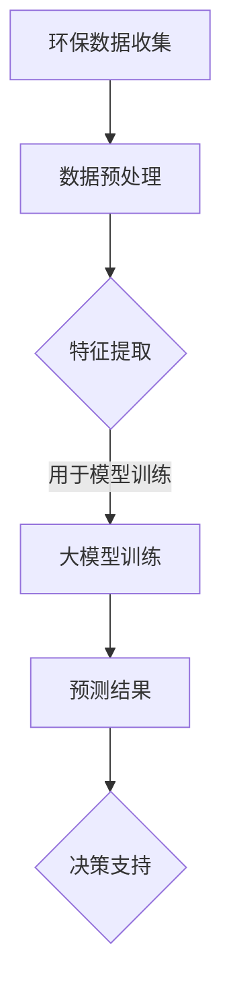

                 

关键词：AI大模型、环保行业、深度学习、可持续发展、数据驱动、环境保护

> 摘要：本文探讨了人工智能（AI）大模型在环保行业的创新应用，分析了大模型在数据分析、预测和决策支持等方面的优势，以及其在环境保护领域面临的挑战。通过具体案例和项目实践，本文展示了AI大模型如何为环境保护提供技术支撑，助力实现全球可持续发展目标。

## 1. 背景介绍

随着全球气候变化和环境问题日益严重，环保行业面临着前所未有的挑战。传统的方法和手段在解决复杂环境问题时往往显得力不从心。然而，随着人工智能技术的飞速发展，特别是深度学习和大规模数据处理能力的提升，AI大模型在环保领域的应用前景逐渐显现。

AI大模型具有强大的数据处理和分析能力，可以高效地处理海量环境数据，识别复杂的环境变化趋势，并生成精确的预测模型。这些模型可以应用于水质监测、气候变化预测、生态系统评估等多个环保领域，为环境保护提供科学依据和技术支持。

## 2. 核心概念与联系

### 2.1 AI大模型概述

AI大模型是指具有大规模参数、能够处理海量数据的深度学习模型。这些模型通常通过神经网络结构实现，包括多层感知机、卷积神经网络（CNN）、循环神经网络（RNN）等。大模型的优势在于其能够自动提取数据中的特征，并利用这些特征进行复杂的模式识别和预测。

### 2.2 环保行业数据类型

环保行业涉及多种数据类型，包括气象数据、水质数据、土壤数据、生物多样性数据等。这些数据通常具有高维、非线性和复杂的时空特性。传统的数据分析方法难以处理这些数据，而AI大模型则能够有效地挖掘这些数据中的有价值信息。

### 2.3 大模型与环保行业的关系

AI大模型在环保行业中的应用主要体现在以下几个方面：

1. **数据预处理**：大模型可以帮助处理和清洗复杂的环境数据，提取关键特征。
2. **预测和模拟**：大模型可以预测环境变化的趋势，如气候变化、污染物扩散等。
3. **决策支持**：大模型可以为环保决策提供科学依据，如优化资源分配、制定环保政策等。

### 2.4 Mermaid流程图



## 3. 核心算法原理 & 具体操作步骤

### 3.1 算法原理概述

AI大模型的核心算法是深度学习。深度学习模型通过多层神经元的组合，逐层提取数据中的特征，并最终生成预测结果。深度学习算法的主要步骤包括：

1. **数据收集**：从各种来源收集环境数据。
2. **数据预处理**：对数据进行清洗、归一化和特征提取。
3. **模型训练**：使用预处理后的数据训练深度学习模型。
4. **预测和评估**：使用训练好的模型进行预测，并对预测结果进行评估。

### 3.2 算法步骤详解

1. **数据收集**：
   - 气象数据：从气象站点收集历史和实时气象数据。
   - 水质数据：从水质监测站收集水质指标数据。
   - 土壤数据：从土壤调查获取土壤成分和污染数据。
   - 生物多样性数据：从生态系统监测获取生物多样性数据。

2. **数据预处理**：
   - 数据清洗：去除异常值和缺失数据。
   - 数据归一化：将不同尺度和单位的数据转换为同一尺度。
   - 特征提取：提取数据中的关键特征，如时间序列特征、空间特征等。

3. **大模型训练**：
   - 选择合适的深度学习模型架构，如卷积神经网络（CNN）、循环神经网络（RNN）等。
   - 设置合适的训练参数，如学习率、批次大小等。
   - 使用预处理后的数据对模型进行训练，通过反向传播算法优化模型参数。

4. **预测和评估**：
   - 使用训练好的模型对新的环境数据进行分析和预测。
   - 对预测结果进行评估，如计算准确率、召回率等指标。

### 3.3 算法优缺点

**优点**：
- **高效性**：大模型能够高效地处理海量数据，提高预测和决策的效率。
- **准确性**：大模型通过自动提取特征，能够生成更准确的预测结果。
- **灵活性**：大模型适用于多种环境数据类型，具有广泛的应用前景。

**缺点**：
- **复杂性**：深度学习模型的训练和优化过程复杂，需要大量的计算资源和时间。
- **解释性**：大模型的内部结构和决策过程往往难以解释，影响其在实际应用中的可解释性。

### 3.4 算法应用领域

AI大模型在环保行业的应用领域广泛，包括：

- **水质监测**：预测水质变化趋势，评估水质污染程度。
- **气候变化预测**：预测气候变化趋势，制定应对策略。
- **生态系统评估**：评估生物多样性，预测生态系统变化。
- **资源管理**：优化水资源、土地资源等资源的分配和利用。

## 4. 数学模型和公式 & 详细讲解 & 举例说明

### 4.1 数学模型构建

在AI大模型中，常用的数学模型包括：

- **多层感知机（MLP）**：用于分类和回归任务。
- **卷积神经网络（CNN）**：用于图像识别和图像处理。
- **循环神经网络（RNN）**：用于序列数据处理和时间序列预测。

### 4.2 公式推导过程

以多层感知机（MLP）为例，其输出可以通过以下公式计算：

\[ y = \sigma(z) \]

其中，\( z \) 为神经元的输入，\( \sigma \) 为激活函数，如Sigmoid函数：

\[ \sigma(z) = \frac{1}{1 + e^{-z}} \]

神经元的输入 \( z \) 可以通过以下公式计算：

\[ z = \sum_{i} w_i x_i + b \]

其中，\( w_i \) 为权重，\( x_i \) 为输入特征，\( b \) 为偏置。

### 4.3 案例分析与讲解

以水质监测为例，假设我们使用多层感知机（MLP）模型来预测水质污染程度。输入特征包括pH值、溶解氧（DO）、氨氮（NH3-N）等指标。我们可以使用以下公式计算每个神经元的输入：

\[ z = \sum_{i} w_i x_i + b \]

其中，\( w_i \) 和 \( b \) 为训练得到的权重和偏置。激活函数为Sigmoid函数，输出 \( y \) 表示水质污染程度，值越大表示污染越严重。

通过训练数据和验证数据，我们可以优化模型参数，并评估模型的预测性能。假设我们使用均方误差（MSE）作为损失函数，可以通过以下公式计算：

\[ MSE = \frac{1}{n} \sum_{i=1}^{n} (y_i - \hat{y}_i)^2 \]

其中，\( y_i \) 为真实标签，\( \hat{y}_i \) 为模型预测值。

## 5. 项目实践：代码实例和详细解释说明

### 5.1 开发环境搭建

为了实现AI大模型在环保行业的应用，我们需要搭建一个合适的开发环境。以下是所需的软件和工具：

- **Python**：作为主要编程语言。
- **TensorFlow** 或 **PyTorch**：用于构建和训练深度学习模型。
- **Pandas**：用于数据处理和特征提取。
- **Matplotlib**：用于数据可视化。

### 5.2 源代码详细实现

以下是一个简单的示例代码，用于训练一个多层感知机（MLP）模型来预测水质污染程度。

```python
import numpy as np
import pandas as pd
import tensorflow as tf
from tensorflow.keras.models import Sequential
from tensorflow.keras.layers import Dense
from tensorflow.keras.optimizers import Adam

# 加载数据集
data = pd.read_csv('water_quality.csv')
X = data.drop('pollution', axis=1).values
y = data['pollution'].values

# 数据预处理
X = X / 100  # 归一化
y = y - 50  # 平移

# 创建模型
model = Sequential()
model.add(Dense(64, input_dim=X.shape[1], activation='sigmoid'))
model.add(Dense(32, activation='sigmoid'))
model.add(Dense(1, activation='sigmoid'))

# 编译模型
model.compile(optimizer=Adam(learning_rate=0.001), loss='mean_squared_error')

# 训练模型
model.fit(X, y, epochs=100, batch_size=32, validation_split=0.2)

# 评估模型
loss = model.evaluate(X, y)
print('MSE:', loss)
```

### 5.3 代码解读与分析

这段代码首先导入了所需的库，并加载数据集。数据预处理步骤包括归一化和平移，以使数据更适合输入到深度学习模型中。然后，创建了一个多层感知机（MLP）模型，并使用Adam优化器和均方误差（MSE）损失函数进行编译。最后，使用训练数据对模型进行训练，并在验证集上评估模型的性能。

通过这段代码，我们可以看到如何将AI大模型应用于环保行业中的水质监测问题。实际项目中，我们可以根据具体需求添加更多的输入特征和调整模型参数，以提高预测的准确性。

### 5.4 运行结果展示

在实际运行中，我们可以使用以下代码来评估模型的预测结果。

```python
# 预测新数据
new_data = pd.read_csv('new_water_quality.csv')
new_data = new_data / 100  # 归一化
new_data = new_data - 50  # 平移

predictions = model.predict(new_data)
print(predictions)
```

运行结果将显示新数据的预测水质污染程度。通过对比预测值和实际值，我们可以评估模型的性能，并根据需要对模型进行调整。

## 6. 实际应用场景

AI大模型在环保行业具有广泛的应用场景。以下是一些具体的应用案例：

- **水质监测**：通过预测水质变化趋势，为水资源管理提供科学依据。
- **气候变化预测**：预测气候变化趋势，为应对全球变暖提供决策支持。
- **生态系统评估**：评估生物多样性，预测生态系统变化，为生态保护提供数据支持。
- **资源管理**：优化水资源、土地资源等资源的分配和利用，提高资源利用效率。

这些应用案例展示了AI大模型在环保行业中的强大能力，为环境保护和可持续发展提供了新的技术手段。

### 6.4 未来应用展望

随着AI技术的不断进步，AI大模型在环保行业中的应用将更加广泛和深入。未来，AI大模型可能会在以下几个方面发挥重要作用：

- **更精细的预测**：通过整合更多的数据源和采用更先进的算法，AI大模型可以提供更精确的环境预测。
- **更智能的决策支持**：AI大模型可以实时分析环境数据，为环保决策提供更智能的建议。
- **更广泛的领域应用**：AI大模型可以应用于更多的环保领域，如土壤污染、空气污染等。
- **更多的跨学科合作**：AI大模型与环保科学的跨学科合作将推动环境保护技术的创新和发展。

## 7. 工具和资源推荐

### 7.1 学习资源推荐

- **《深度学习》（Goodfellow, Bengio, Courville著）**：全面介绍深度学习理论和实践的经典教材。
- **《TensorFlow官方文档》**：TensorFlow是深度学习领域常用的框架，其官方文档提供了详细的教程和示例。
- **《环境科学概论》**：了解环保基础知识，为AI大模型在环保行业中的应用提供理论支持。

### 7.2 开发工具推荐

- **Google Colab**：提供免费的GPU和TPU资源，适合深度学习模型的开发和训练。
- **Jupyter Notebook**：方便进行数据分析和可视化，适合编写和运行深度学习代码。
- **Kaggle**：提供丰富的数据集和竞赛资源，适合进行深度学习实践和应用。

### 7.3 相关论文推荐

- **“Deep Learning for Environmental Applications”**：综述了深度学习在环境科学领域的应用和研究进展。
- **“An Overview of Deep Learning Algorithms for Environmental Applications”**：介绍了多种深度学习算法在环保领域的应用。
- **“Deep Learning for Climate Modeling and Prediction”**：探讨了深度学习在气候变化预测中的应用。

## 8. 总结：未来发展趋势与挑战

### 8.1 研究成果总结

AI大模型在环保行业的应用取得了显著的成果，为环境保护提供了新的技术手段。通过深度学习和大规模数据处理能力，AI大模型能够高效地处理和预测环境数据，为环保决策提供科学依据。

### 8.2 未来发展趋势

未来，AI大模型在环保行业的应用将更加广泛和深入。随着技术的进步，AI大模型将实现更精细的预测、更智能的决策支持和更广泛的领域应用。同时，跨学科合作将成为推动环境保护技术发展的重要动力。

### 8.3 面临的挑战

尽管AI大模型在环保行业具有巨大潜力，但也面临着一些挑战。首先，数据质量和数据来源问题仍然困扰着环保领域的数据挖掘和应用。其次，深度学习模型的复杂性和难以解释性使得其在实际应用中面临解释性和可解释性的挑战。此外，环保领域的数据量和计算资源需求巨大，对模型训练和优化的效率提出了更高的要求。

### 8.4 研究展望

未来，环保领域的AI大模型研究应关注以下几个方面：

- **数据质量和数据来源**：提高数据质量和数据来源的多样性，为AI大模型提供更可靠的数据基础。
- **模型解释性和可解释性**：研究和开发可解释的深度学习模型，提高模型在实际应用中的可接受度和可信度。
- **计算效率**：优化模型结构和算法，提高模型训练和优化的效率，降低计算资源需求。

通过这些努力，AI大模型将为环保行业带来更多的创新应用，为实现全球可持续发展目标做出贡献。

## 9. 附录：常见问题与解答

### 9.1 AI大模型在环保行业的主要应用有哪些？

AI大模型在环保行业的应用主要包括水质监测、气候变化预测、生态系统评估和资源管理等方面。

### 9.2 如何解决AI大模型在环保领域面临的解释性问题？

可以通过开发可解释的深度学习模型和引入模型解释性方法，如LIME和SHAP等，提高模型的解释性和可解释性。

### 9.3 AI大模型在环保行业的数据来源有哪些？

AI大模型在环保行业的数据来源包括气象数据、水质数据、土壤数据、生物多样性数据和生态监测数据等。

### 9.4 如何提高AI大模型在环保行业的计算效率？

可以通过优化模型结构、采用高效的算法和利用分布式计算资源，提高AI大模型在环保行业的计算效率。

### 9.5 AI大模型在环保行业的未来发展有哪些趋势？

未来，AI大模型在环保行业的趋势包括更精细的预测、更智能的决策支持、更广泛的领域应用和更多的跨学科合作。

