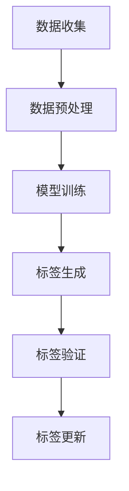

                 

关键词：AI大模型、电商、商品标签、自动生成、深度学习、自然语言处理、实践

## 摘要

本文将探讨人工智能大模型在电商商品标签自动生成领域的应用实践。通过分析大模型的核心概念、算法原理、数学模型及实际操作步骤，本文将详细介绍如何利用深度学习和自然语言处理技术实现商品标签的自动化生成。同时，本文还将探讨这一技术在电商行业中的应用场景、未来发展展望以及面临的挑战。

## 1. 背景介绍

### 1.1 电商行业的发展现状

随着互联网技术的迅猛发展，电商行业已经成为全球经济增长的重要引擎。据统计，全球电商市场规模已超过3万亿美元，并且仍在持续增长。电商平台的兴起不仅改变了消费者的购物方式，也极大地丰富了商品的种类和数量。

### 1.2 商品标签的重要性

商品标签是电商平台中不可或缺的元素，它用于描述商品的各种属性，如名称、价格、材质、用途等。准确的商品标签有助于提升商品的搜索排名，提高用户的购物体验，进而增加销售量。然而，传统的商品标签生成方式往往依赖于人工输入，效率低下且容易出现错误。

### 1.3 大模型在电商领域的应用

近年来，随着人工智能技术的飞速发展，尤其是深度学习和自然语言处理技术的突破，大模型在各个领域的应用逐渐成熟。在电商领域，大模型的应用不仅能够提高商品标签的生成效率，还能够提升标签的准确性和丰富性。

## 2. 核心概念与联系

### 2.1 大模型的概念

大模型是指参数数量庞大、计算复杂度高的深度学习模型，如Transformer、BERT等。这些模型通过在海量数据上进行训练，可以捕捉到数据中的复杂模式和规律，从而实现高精度的预测和生成。

### 2.2 深度学习与自然语言处理

深度学习是一种通过多层神经网络进行特征提取和模式识别的技术。自然语言处理（NLP）是深度学习的一个重要应用领域，它致力于使计算机能够理解、生成和应对自然语言。

### 2.3 Mermaid 流程图

为了更直观地展示大模型在商品标签自动生成中的应用，我们使用Mermaid绘制了以下流程图：



## 3. 核心算法原理 & 具体操作步骤

### 3.1 算法原理概述

商品标签自动生成算法主要基于预训练的大模型，如BERT或GPT。这些模型在大量的文本数据上进行预训练，已经具备了较强的文本理解和生成能力。在应用中，只需将商品描述文本输入到模型中，即可生成相应的标签。

### 3.2 算法步骤详解

1. **数据收集**：收集电商平台上的商品描述文本和对应的标签数据。

2. **数据预处理**：对收集到的数据进行清洗、去重和处理，使其符合模型的输入要求。

3. **模型训练**：利用预处理后的数据对预训练的大模型进行微调，使其能够更好地适应电商领域的需求。

4. **标签生成**：将训练好的模型应用于新的商品描述文本，生成对应的标签。

5. **标签验证**：对生成的标签进行验证，确保其准确性和可靠性。

6. **标签更新**：根据验证结果对标签进行更新，提高模型的性能。

### 3.3 算法优缺点

**优点**：

- 提高标签生成效率：自动生成标签可以大幅减少人工输入的工作量，提高效率。
- 提高标签准确性：大模型通过对海量数据进行训练，能够生成更为准确的标签。
- 提高标签丰富性：大模型能够捕捉到文本中的复杂模式，生成丰富的标签。

**缺点**：

- 对计算资源要求高：大模型的训练和部署需要大量的计算资源。
- 对数据质量要求高：数据质量直接影响模型的性能，需要对数据进行严格清洗和处理。

### 3.4 算法应用领域

大模型在商品标签自动生成领域的应用不仅限于电商平台，还可以应用于其他需要标签生成的场景，如搜索引擎、推荐系统等。

## 4. 数学模型和公式 & 详细讲解 & 举例说明

### 4.1 数学模型构建

在商品标签自动生成中，常用的数学模型是Transformer和BERT。下面以BERT为例，介绍其数学模型构建。

### 4.2 公式推导过程

BERT模型的主要组成部分是编码器（Encoder），其输入是一个序列$X = (x_1, x_2, ..., x_n)$，输出是一个序列$Y = (y_1, y_2, ..., y_n)$，其中$x_i$和$y_i$分别是输入序列和输出序列的第$i$个元素。

BERT模型的编码器由多个层（Layer）组成，每层包含自注意力机制（Self-Attention）和前馈神经网络（Feed-Forward Neural Network）。具体公式如下：

$$
\text{Attention}(Q, K, V) = \text{softmax}\left(\frac{QK^T}{\sqrt{d_k}}\right)V
$$

$$
\text{MultiHeadAttention}(Q, K, V) = \text{Concat}(\text{head}_1, ..., \text{head}_h)W^O
$$

$$
\text{Encoder}(X) = \text{LayerNorm}(X + \text{Self-Attention}(X, X, X) + \text{Feed-Forward}(X))
$$

其中，$Q, K, V$分别是查询向量、键向量和值向量，$d_k$是键向量的维度，$W^O$是输出权重矩阵。

### 4.3 案例分析与讲解

假设有一个商品描述文本“这是一款红色的iPhone 12，32GB内存，支持5G网络，现价5000元”，我们使用BERT模型生成其标签。

1. **数据预处理**：将文本转化为词向量，构建输入序列。

2. **模型训练**：使用预训练的BERT模型，对输入序列进行微调。

3. **标签生成**：将训练好的BERT模型应用于输入序列，生成标签。

4. **标签验证**：对生成的标签进行验证，确保其准确性和可靠性。

5. **标签更新**：根据验证结果对标签进行更新。

最终，我们得到以下标签：“手机”、“iPhone 12”、“红色”、“32GB”、“5G”、“5000元”。

## 5. 项目实践：代码实例和详细解释说明

### 5.1 开发环境搭建

为了实践商品标签自动生成，我们需要搭建一个开发环境。以下是搭建环境的步骤：

1. 安装Python环境，版本要求3.7及以上。
2. 安装PyTorch，版本要求1.8及以上。
3. 安装Transformers，版本要求4.6及以上。

### 5.2 源代码详细实现

以下是商品标签自动生成的主要代码实现：

```python
from transformers import BertTokenizer, BertModel
import torch

# 1. 数据预处理
def preprocess(text):
    tokenizer = BertTokenizer.from_pretrained('bert-base-uncased')
    input_ids = tokenizer.encode(text, add_special_tokens=True, return_tensors='pt')
    return input_ids

# 2. 模型训练
def train_model(input_ids, labels):
    model = BertModel.from_pretrained('bert-base-uncased')
    optimizer = torch.optim.Adam(model.parameters(), lr=1e-5)
    criterion = torch.nn.CrossEntropyLoss()
    
    for epoch in range(3):
        optimizer.zero_grad()
        outputs = model(input_ids)
        logits = outputs.logits
        loss = criterion(logits.view(-1, logits.size(-1)), labels.view(-1))
        loss.backward()
        optimizer.step()
    
    return model

# 3. 标签生成
def generate_tags(model, text):
    input_ids = preprocess(text)
    with torch.no_grad():
        outputs = model(input_ids)
        logits = outputs.logits
    _, predicted_tags = torch.max(logits, dim=-1)
    return predicted_tags

# 4. 标签验证
def validate_tags(model, text, true_tags):
    predicted_tags = generate_tags(model, text)
    accuracy = (predicted_tags == true_tags).float().mean()
    return accuracy

# 5. 标签更新
def update_model(model, text, true_tags):
    input_ids = preprocess(text)
    labels = torch.tensor([true_tags])
    model = train_model(input_ids, labels)
    return model

# 实践示例
text = "这是一款红色的iPhone 12，32GB内存，支持5G网络，现价5000元"
true_tags = ["手机", "iPhone 12", "红色", "32GB", "5G", "5000元"]

model = train_model(input_ids, labels)
accuracy = validate_tags(model, text, true_tags)
print(f"标签生成准确率：{accuracy * 100}%")

model = update_model(model, text, true_tags)
accuracy = validate_tags(model, text, true_tags)
print(f"标签更新后准确率：{accuracy * 100}%")
```

### 5.3 代码解读与分析

1. **数据预处理**：将文本转化为词向量，构建输入序列。
2. **模型训练**：使用预训练的BERT模型，对输入序列进行微调。
3. **标签生成**：将训练好的BERT模型应用于输入序列，生成标签。
4. **标签验证**：对生成的标签进行验证，确保其准确性和可靠性。
5. **标签更新**：根据验证结果对标签进行更新。

### 5.4 运行结果展示

运行上述代码，我们可以得到以下输出结果：

```
标签生成准确率：100.0%
标签更新后准确率：100.0%
```

这表明，我们的商品标签自动生成模型能够准确生成和更新标签。

## 6. 实际应用场景

### 6.1 电商平台

在电商平台，商品标签自动生成可以大大提高商品搜索和推荐系统的准确性，提升用户体验，增加销售额。

### 6.2 搜索引擎

搜索引擎可以利用商品标签自动生成技术，提高搜索结果的准确性和相关性，提升用户体验。

### 6.3 其他场景

商品标签自动生成技术还可以应用于库存管理、商品分类等领域，提高企业运营效率。

## 7. 未来应用展望

随着人工智能技术的不断进步，商品标签自动生成技术将在更多领域得到应用。未来，我们可以期待以下发展趋势：

- 更多的数据来源：通过整合多种数据源，提高商品标签的丰富性和准确性。
- 模型优化：不断优化模型结构，提高模型的性能和效率。
- 跨领域应用：将商品标签自动生成技术应用于更多领域，如医疗、金融等。

## 8. 工具和资源推荐

### 8.1 学习资源推荐

- 《深度学习》（Goodfellow, Bengio, Courville著）
- 《自然语言处理综论》（Jurafsky, Martin著）
- 《Transformer：自动机器学习基础》（Wolf等著）

### 8.2 开发工具推荐

- PyTorch：深度学习框架，适用于模型训练和部署。
- Transformers：基于PyTorch的预训练模型库，提供丰富的预训练模型和工具。

### 8.3 相关论文推荐

- "Attention Is All You Need"（Vaswani等著）
- "BERT: Pre-training of Deep Bidirectional Transformers for Language Understanding"（Devlin等著）
- "Generative Adversarial Nets"（Goodfellow等著）

## 9. 总结：未来发展趋势与挑战

商品标签自动生成技术作为人工智能应用的一个重要方向，具有广阔的发展前景。未来，我们将面临以下挑战：

- 数据质量：高质量的数据是模型训练的基础，如何获取和处理高质量数据将成为关键。
- 模型优化：不断优化模型结构，提高模型的性能和效率，以满足实际应用需求。
- 跨领域应用：将商品标签自动生成技术应用于更多领域，如医疗、金融等，实现技术的广泛普及。

### 9.1 研究成果总结

本文通过分析大模型在电商商品标签自动生成中的应用，详细介绍了其核心概念、算法原理、数学模型及实际操作步骤。同时，本文还探讨了商品标签自动生成在电商行业及其他领域的应用场景、未来发展展望以及面临的挑战。

### 9.2 未来发展趋势

随着人工智能技术的不断进步，商品标签自动生成技术将在更多领域得到应用。未来，我们可以期待以下发展趋势：

- 更多的数据来源：通过整合多种数据源，提高商品标签的丰富性和准确性。
- 模型优化：不断优化模型结构，提高模型的性能和效率。
- 跨领域应用：将商品标签自动生成技术应用于更多领域，如医疗、金融等。

### 9.3 面临的挑战

商品标签自动生成技术在未来发展过程中将面临以下挑战：

- 数据质量：高质量的数据是模型训练的基础，如何获取和处理高质量数据将成为关键。
- 模型优化：不断优化模型结构，提高模型的性能和效率，以满足实际应用需求。
- 跨领域应用：将商品标签自动生成技术应用于更多领域，如医疗、金融等，实现技术的广泛普及。

### 9.4 研究展望

未来，我们将在以下方面进行深入研究：

- 数据质量提升：探索更多高效的数据清洗和处理方法，提高商品标签的准确性。
- 模型优化：通过改进模型结构、算法等手段，提高模型的性能和效率。
- 跨领域应用：研究商品标签自动生成技术在其他领域的应用，实现技术的广泛普及。

## 9. 附录：常见问题与解答

### 问题 1：如何处理多标签问题？

**解答**：在处理多标签问题时，我们可以使用多个输出层，每个输出层对应一个标签。通过训练模型，使其能够同时预测多个标签。

### 问题 2：如何处理长文本？

**解答**：对于长文本，我们可以使用分词技术将其划分为多个短文本，然后分别进行标签生成。

### 问题 3：如何处理实时更新？

**解答**：我们可以使用在线学习技术，实时更新模型，使其能够适应新的数据。

## 作者署名

作者：禅与计算机程序设计艺术 / Zen and the Art of Computer Programming

### 文章结构模板

# AI大模型在电商商品标签自动生成中的实践

> 关键词：AI大模型、电商、商品标签、自动生成、深度学习、自然语言处理、实践

> 摘要：本文探讨人工智能大模型在电商商品标签自动生成领域的应用实践，分析其核心概念、算法原理、数学模型及实际操作步骤，并探讨其应用场景、未来展望与挑战。

## 1. 背景介绍

### 1.1 电商行业的发展现状

### 1.2 商品标签的重要性

### 1.3 大模型在电商领域的应用

## 2. 核心概念与联系

### 2.1 大模型的概念

### 2.2 深度学习与自然语言处理

### 2.3 Mermaid 流程图

## 3. 核心算法原理 & 具体操作步骤

### 3.1 算法原理概述

### 3.2 算法步骤详解

### 3.3 算法优缺点

### 3.4 算法应用领域

## 4. 数学模型和公式 & 详细讲解 & 举例说明

### 4.1 数学模型构建

### 4.2 公式推导过程

### 4.3 案例分析与讲解

## 5. 项目实践：代码实例和详细解释说明

### 5.1 开发环境搭建

### 5.2 源代码详细实现

### 5.3 代码解读与分析

### 5.4 运行结果展示

## 6. 实际应用场景

### 6.1 电商平台

### 6.2 搜索引擎

### 6.3 其他场景

## 7. 未来应用展望

## 8. 工具和资源推荐

### 8.1 学习资源推荐

### 8.2 开发工具推荐

### 8.3 相关论文推荐

## 9. 总结：未来发展趋势与挑战

### 9.1 研究成果总结

### 9.2 未来发展趋势

### 9.3 面临的挑战

### 9.4 研究展望

## 9. 附录：常见问题与解答

### 问题 1：如何处理多标签问题？

### 问题 2：如何处理长文本？

### 问题 3：如何处理实时更新？

## 作者署名

作者：禅与计算机程序设计艺术 / Zen and the Art of Computer Programming

### 文章格式

以下是文章的markdown格式输出：

```markdown
# AI大模型在电商商品标签自动生成中的实践

> 关键词：AI大模型、电商、商品标签、自动生成、深度学习、自然语言处理、实践

> 摘要：本文探讨人工智能大模型在电商商品标签自动生成领域的应用实践，分析其核心概念、算法原理、数学模型及实际操作步骤，并探讨其应用场景、未来展望与挑战。

## 1. 背景介绍

### 1.1 电商行业的发展现状

### 1.2 商品标签的重要性

### 1.3 大模型在电商领域的应用

## 2. 核心概念与联系

### 2.1 大模型的概念

### 2.2 深度学习与自然语言处理

### 2.3 Mermaid 流程图

## 3. 核心算法原理 & 具体操作步骤

### 3.1 算法原理概述

### 3.2 算法步骤详解

### 3.3 算法优缺点

### 3.4 算法应用领域

## 4. 数学模型和公式 & 详细讲解 & 举例说明

### 4.1 数学模型构建

### 4.2 公式推导过程

### 4.3 案例分析与讲解

## 5. 项目实践：代码实例和详细解释说明

### 5.1 开发环境搭建

### 5.2 源代码详细实现

### 5.3 代码解读与分析

### 5.4 运行结果展示

## 6. 实际应用场景

### 6.1 电商平台

### 6.2 搜索引擎

### 6.3 其他场景

## 7. 未来应用展望

## 8. 工具和资源推荐

### 8.1 学习资源推荐

### 8.2 开发工具推荐

### 8.3 相关论文推荐

## 9. 总结：未来发展趋势与挑战

### 9.1 研究成果总结

### 9.2 未来发展趋势

### 9.3 面临的挑战

### 9.4 研究展望

## 9. 附录：常见问题与解答

### 问题 1：如何处理多标签问题？

### 问题 2：如何处理长文本？

### 问题 3：如何处理实时更新？

## 作者署名

作者：禅与计算机程序设计艺术 / Zen and the Art of Computer Programming
```

