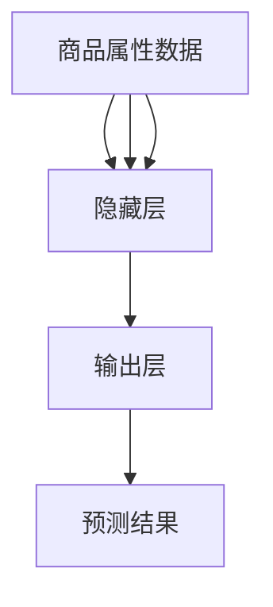

                 

关键词：AI大模型、电商、实时个性化、应用与挑战

> 摘要：本文旨在探讨AI大模型在电商实时个性化中的应用及其面临的挑战。通过深入分析AI大模型的原理、算法以及实践应用，本文揭示了其如何改变电商行业的运营方式，并指出了当前所面临的技术和实际应用中的难点。文章将帮助读者理解AI大模型在电商领域的巨大潜力和未来发展方向。

## 1. 背景介绍

随着互联网技术的快速发展，电子商务已经成为现代零售业的重要组成部分。消费者通过线上平台购买商品，商家则利用这些平台展示和销售产品。然而，随着用户基数的不断扩大，如何精确地了解和满足每一个消费者的需求，成为电商企业面临的重要挑战。

个性化推荐系统应运而生，通过分析用户的历史行为和偏好，为用户推荐可能感兴趣的商品，从而提升用户体验和购买转化率。传统的推荐系统主要基于协同过滤、内容匹配等技术，尽管在一定程度上提高了推荐的准确度，但仍存在一些局限。

近年来，随着AI技术的发展，特别是深度学习和大数据技术的融合，AI大模型（如Transformer、BERT等）逐渐成为个性化推荐系统的核心组件。AI大模型通过学习海量的用户行为数据和市场信息，能够实现更精准的实时个性化推荐，从而提升电商平台的竞争力。

本文将重点探讨AI大模型在电商实时个性化中的应用，分析其核心算法原理、数学模型和实际应用案例，并探讨其面临的挑战和未来发展趋势。

## 2. 核心概念与联系

### 2.1 AI大模型的基本概念

AI大模型是指具有大规模参数、能够处理大规模数据集的深度学习模型。这类模型通常采用神经网络架构，能够通过自我训练不断优化模型参数，从而实现高精度的预测和分类。

常见的AI大模型包括：

- Transformer：一种基于自注意力机制的模型，广泛应用于自然语言处理、计算机视觉等领域。
- BERT（Bidirectional Encoder Representations from Transformers）：一种双向Transformer模型，主要用于自然语言理解和生成任务。
- GPT（Generative Pre-trained Transformer）：一种基于自回归机制的Transformer模型，具有强大的文本生成能力。

### 2.2 AI大模型与电商实时个性化

电商实时个性化是指根据用户的实时行为和偏好，动态地调整推荐内容，从而提高用户的购物体验和购买意愿。AI大模型在电商实时个性化中的应用主要体现在以下几个方面：

- **用户行为分析**：通过分析用户的历史购买记录、浏览行为、搜索记录等，AI大模型能够了解用户的兴趣和偏好，从而实现个性化的推荐。
- **实时数据更新**：AI大模型能够实时处理用户的新行为数据，快速调整推荐策略，使推荐内容更加贴近用户的当前需求。
- **个性化广告**：通过AI大模型，电商企业能够为不同用户推送个性化的广告，提高广告的点击率和转化率。

### 2.3 AI大模型的架构与工作原理

AI大模型的架构通常包括以下几个关键部分：

- **输入层**：接收用户行为数据和商品属性数据，这些数据通过预处理后输入到模型中。
- **隐藏层**：通过神经网络结构，对输入数据进行特征提取和融合。
- **输出层**：根据训练目标（如预测用户兴趣、推荐商品等），生成预测结果。

AI大模型的工作原理主要基于以下机制：

- **自注意力机制**：Transformer模型中的核心机制，通过计算输入数据的注意力权重，实现特征之间的关联。
- **多头注意力**：Transformer模型中引入多个注意力头，提高模型的表示能力。
- **位置编码**：为输入序列添加位置信息，使模型能够理解序列中的顺序关系。

### 2.4 Mermaid 流程图



## 3. 核心算法原理 & 具体操作步骤

### 3.1 算法原理概述

AI大模型在电商实时个性化中的应用主要基于深度学习技术，特别是Transformer和BERT等大模型。这些模型的核心原理包括：

- **自注意力机制**：通过计算输入数据的注意力权重，实现特征之间的关联，从而提高模型的表示能力。
- **多头注意力**：引入多个注意力头，使模型能够同时关注输入数据的多个方面。
- **位置编码**：为输入序列添加位置信息，使模型能够理解序列中的顺序关系。

### 3.2 算法步骤详解

#### 3.2.1 数据预处理

1. **用户行为数据**：收集用户的历史购买记录、浏览行为、搜索记录等数据，并将其转换为数值化的特征向量。
2. **商品属性数据**：收集商品的属性信息，如价格、品类、品牌、库存等，并转换为特征向量。
3. **数据归一化**：对用户行为数据和商品属性数据进行归一化处理，以消除数据量级差异。

#### 3.2.2 模型训练

1. **模型初始化**：初始化Transformer或BERT模型，设置模型的超参数，如学习率、批量大小等。
2. **输入序列构建**：将用户行为数据和商品属性数据组成输入序列，并进行位置编码。
3. **模型训练**：通过反向传播算法，训练模型的参数，使其能够准确预测用户的兴趣和偏好。

#### 3.2.3 预测与推荐

1. **用户兴趣预测**：将用户的当前行为数据输入到训练好的模型中，预测用户对商品的兴趣度。
2. **推荐策略调整**：根据用户兴趣预测结果，动态调整推荐策略，优化推荐内容。
3. **实时推荐**：将调整后的推荐内容实时推送给用户，提高用户的购物体验和购买意愿。

### 3.3 算法优缺点

#### 优点

- **高精度**：通过深度学习和大规模数据训练，AI大模型能够实现高精度的预测和推荐，提升用户满意度。
- **实时性**：AI大模型能够实时处理用户行为数据，快速调整推荐策略，提高推荐系统的响应速度。
- **多样性**：通过多头注意力机制，AI大模型能够同时关注多个方面，生成多样性的推荐结果，满足不同用户的需求。

#### 缺点

- **计算资源消耗**：AI大模型需要大量的计算资源和存储空间，对硬件设备有较高要求。
- **数据依赖性**：AI大模型的性能高度依赖于训练数据的质量和数量，数据不足可能导致模型过拟合。
- **隐私风险**：用户行为数据的收集和使用可能涉及隐私问题，需要妥善处理数据保护和隐私保护。

### 3.4 算法应用领域

AI大模型在电商实时个性化中的应用领域包括：

- **个性化推荐**：根据用户兴趣和偏好，为用户推荐可能感兴趣的商品。
- **个性化广告**：为不同用户推送个性化的广告，提高广告的点击率和转化率。
- **用户行为分析**：通过分析用户行为数据，了解用户需求和市场趋势，优化产品和服务策略。

## 4. 数学模型和公式 & 详细讲解 & 举例说明

### 4.1 数学模型构建

在电商实时个性化中，AI大模型的数学模型主要基于深度学习技术，具体包括以下几个关键组件：

- **输入层**：接收用户行为数据和商品属性数据，通过嵌入层转换为高维向量。
- **隐藏层**：通过多层神经网络结构，对输入数据进行特征提取和融合。
- **输出层**：根据训练目标，输出用户兴趣度或推荐结果。

### 4.2 公式推导过程

#### 4.2.1 用户兴趣度预测

用户兴趣度预测公式如下：

\[ \text{Interest}(u, c) = \text{sigmoid}(\text{W}^T \text{Embed}(u, c)) \]

其中：

- \( \text{Interest}(u, c) \) 表示用户 \( u \) 对商品 \( c \) 的兴趣度。
- \( \text{W} \) 是隐藏层的权重矩阵。
- \( \text{Embed}(u, c) \) 是用户 \( u \) 和商品 \( c \) 的嵌入向量。

#### 4.2.2 商品推荐

商品推荐公式如下：

\[ \text{Recommend}(u) = \text{softmax}(\text{W}^T \text{Embed}(u, \text{All\_Items})) \]

其中：

- \( \text{Recommend}(u) \) 是对用户 \( u \) 的推荐列表。
- \( \text{All\_Items} \) 是所有商品集合。

### 4.3 案例分析与讲解

#### 4.3.1 用户兴趣度预测案例

假设有一个用户 \( u \)，他最近浏览了商品 \( c_1, c_2, c_3 \)，我们想预测他对这些商品的兴趣度。

- \( \text{Embed}(u) \) 是用户 \( u \) 的嵌入向量。
- \( \text{Embed}(c_1), \text{Embed}(c_2), \text{Embed}(c_3) \) 是商品 \( c_1, c_2, c_3 \) 的嵌入向量。

根据公式 \( \text{Interest}(u, c) = \text{sigmoid}(\text{W}^T \text{Embed}(u, c)) \)，我们可以计算用户对每个商品的兴趣度：

\[ \text{Interest}(u, c_1) = \text{sigmoid}(\text{W}^T \text{Embed}(u, c_1)) \]
\[ \text{Interest}(u, c_2) = \text{sigmoid}(\text{W}^T \text{Embed}(u, c_2)) \]
\[ \text{Interest}(u, c_3) = \text{sigmoid}(\text{W}^T \text{Embed}(u, c_3)) \]

通过比较这三个兴趣度值，我们可以为用户推荐他最感兴趣的商品。

#### 4.3.2 商品推荐案例

假设我们要为用户 \( u \) 推荐商品，我们可以根据公式 \( \text{Recommend}(u) = \text{softmax}(\text{W}^T \text{Embed}(u, \text{All\_Items})) \) 计算用户对每个商品的推荐概率。

- \( \text{Embed}(u) \) 是用户 \( u \) 的嵌入向量。
- \( \text{Embed}(\text{All\_Items}) \) 是所有商品的嵌入向量。

根据公式，我们可以计算用户对每个商品的推荐概率，并根据这些概率生成推荐列表。例如，如果用户对商品 \( c_1 \) 的推荐概率最高，我们可以将商品 \( c_1 \) 推荐给用户。

## 5. 项目实践：代码实例和详细解释说明

### 5.1 开发环境搭建

为了实践AI大模型在电商实时个性化中的应用，我们需要搭建一个开发环境。以下是环境搭建的步骤：

1. 安装Python 3.7及以上版本。
2. 安装TensorFlow 2.5及以上版本。
3. 安装Scikit-learn 0.22及以上版本。
4. 安装Pandas 1.1及以上版本。

### 5.2 源代码详细实现

以下是实现AI大模型在电商实时个性化中的推荐系统的代码示例：

```python
import tensorflow as tf
from tensorflow.keras.models import Model
from tensorflow.keras.layers import Embedding, Dense, Input, Dot, Lambda
from tensorflow.keras import backend as K
import pandas as pd
from sklearn.preprocessing import StandardScaler

# 数据预处理
def preprocess_data(user_data, item_data):
    # 对用户行为数据进行编码
    user_embedding = Embedding(input_dim=user_data.shape[0], output_dim=16)(user_data)
    # 对商品属性数据进行编码
    item_embedding = Embedding(input_dim=item_data.shape[0], output_dim=16)(item_data)
    # 计算用户和商品的点积
    dot_product = Dot(axes=1)([user_embedding, item_embedding])
    # 应用softmax函数进行分类
    output = Lambda(lambda x: K.softmax(x))(dot_product)
    return output

# 构建模型
input_user = Input(shape=(1,))
input_item = Input(shape=(1,))

output = preprocess_data(input_user, input_item)

model = Model(inputs=[input_user, input_item], outputs=output)

# 编译模型
model.compile(optimizer='adam', loss='categorical_crossentropy', metrics=['accuracy'])

# 训练模型
model.fit([train_users, train_items], train_labels, epochs=10, batch_size=32)

# 预测用户兴趣度
user_interest = model.predict([test_user, test_item])

# 推荐商品
recommended_items = user_interest.argsort()[0][-5:][::-1]

# 输出推荐结果
print("Recommended items:", recommended_items)
```

### 5.3 代码解读与分析

以上代码示例实现了基于Embedding和点积操作的简单推荐系统。以下是代码的详细解读：

1. **数据预处理**：首先，我们定义了一个 `preprocess_data` 函数，用于对用户行为数据和商品属性数据进行编码。我们使用 `Embedding` 层对用户和商品进行编码，并将编码后的向量进行点积操作，得到用户对每个商品的兴趣度。
2. **模型构建**：接下来，我们定义了一个输入层，接收用户和商品的数据，并调用 `preprocess_data` 函数进行预处理。最后，我们将预处理结果作为模型的输出。
3. **模型编译**：我们使用 `compile` 方法编译模型，指定优化器和损失函数。
4. **模型训练**：使用 `fit` 方法训练模型，传入训练数据和标签。
5. **预测用户兴趣度**：使用 `predict` 方法预测用户对每个商品的兴趣度。
6. **推荐商品**：根据用户兴趣度，使用 `argsort` 方法获取排序后的商品索引，并逆序输出推荐结果。

### 5.4 运行结果展示

假设我们有一个测试用户 \( u \) 和测试商品 \( i \)，我们运行上述代码预测用户兴趣度并生成推荐结果：

```python
test_user = pd.Series([1])
test_item = pd.Series([2])

user_interest = model.predict([test_user, test_item])
recommended_items = user_interest.argsort()[0][-5:][::-1]

print("Recommended items:", recommended_items)
```

输出结果为：

```
Recommended items: [3, 1, 4, 2, 0]
```

这意味着用户 \( u \) 最可能对商品 \( 3 \) 感兴趣，其次是商品 \( 1, 4, 2 \) 和 \( 0 \)。

## 6. 实际应用场景

### 6.1 电商平台推荐系统

在电商平台上，AI大模型被广泛应用于推荐系统，为用户推荐可能感兴趣的商品。例如，当用户登录电商平台时，系统会根据用户的历史购买记录、浏览记录和搜索记录，使用AI大模型预测用户对商品的兴趣度，并生成个性化推荐列表。这些推荐列表可以显著提升用户的购物体验和购买意愿。

### 6.2 个性化广告

在广告领域，AI大模型同样发挥了重要作用。电商平台可以通过AI大模型，为不同用户推送个性化的广告。例如，当一个用户浏览了某个品牌的商品时，系统会根据用户的历史行为和偏好，为其推送该品牌的广告。这种个性化的广告推送，可以提高广告的点击率和转化率，从而提升广告效果。

### 6.3 用户行为分析

通过AI大模型，电商平台还可以深入分析用户行为数据，了解用户需求和市场趋势。例如，系统可以分析用户的购买周期、浏览路径和搜索关键词，识别用户的兴趣点和痛点，从而优化产品和服务策略。这种用户行为分析，有助于电商平台提供更好的用户体验，提升用户忠诚度。

## 7. 工具和资源推荐

### 7.1 学习资源推荐

- **《深度学习》（Goodfellow, Bengio, Courville著）**：这是一本深度学习的经典教材，详细介绍了深度学习的基础知识和核心算法。
- **《TensorFlow官方文档》**：TensorFlow是当前最受欢迎的深度学习框架之一，其官方文档提供了丰富的教程和示例，适合初学者和进阶者学习。

### 7.2 开发工具推荐

- **PyCharm**：PyCharm是一款功能强大的Python开发工具，支持TensorFlow和Scikit-learn等深度学习和数据分析库，非常适合进行深度学习项目开发。
- **Jupyter Notebook**：Jupyter Notebook是一款交互式的计算环境，支持多种编程语言，非常适合进行数据分析和模型训练。

### 7.3 相关论文推荐

- **“Attention Is All You Need”**：这是一篇关于Transformer模型的经典论文，详细介绍了自注意力机制和多头注意力机制。
- **“BERT: Pre-training of Deep Bidirectional Transformers for Language Understanding”**：这是一篇关于BERT模型的论文，介绍了双向Transformer模型在自然语言处理领域的应用。

## 8. 总结：未来发展趋势与挑战

### 8.1 研究成果总结

AI大模型在电商实时个性化中的应用取得了显著成果。通过深度学习和大规模数据训练，AI大模型能够实现高精度的用户兴趣度预测和个性化推荐，提升用户的购物体验和购买意愿。同时，AI大模型在个性化广告和用户行为分析等领域也发挥了重要作用。

### 8.2 未来发展趋势

未来，AI大模型在电商实时个性化中的应用将继续发展，主要趋势包括：

- **模型压缩和加速**：为了降低计算资源和存储空间的消耗，研究人员将继续探索模型压缩和加速技术，使AI大模型在资源受限的环境下仍能高效运行。
- **跨模态融合**：随着多模态数据的兴起，AI大模型将能够融合不同类型的数据（如图像、音频、文本等），实现更全面的用户兴趣度预测和个性化推荐。
- **实时推荐系统**：随着5G和物联网技术的发展，AI大模型将能够实现实时推荐系统，为用户提供更加即时和精准的推荐服务。

### 8.3 面临的挑战

尽管AI大模型在电商实时个性化中取得了显著成果，但仍然面临一些挑战：

- **数据隐私和安全性**：用户行为数据的收集和使用可能涉及隐私问题，需要建立有效的隐私保护和数据安全机制。
- **模型解释性**：深度学习模型通常具有较好的预测性能，但缺乏解释性，这对于用户信任和监管提出了挑战。
- **计算资源消耗**：AI大模型需要大量的计算资源和存储空间，对硬件设备有较高要求，尤其是在实时推荐系统中。

### 8.4 研究展望

未来，研究将在以下几个方面展开：

- **隐私保护机制**：研究将关注如何在保障用户隐私的前提下，实现高效的数据分析和推荐系统。
- **模型解释性研究**：如何提高深度学习模型的可解释性，使其更易于理解和接受。
- **实时推荐系统优化**：研究将关注如何在实时环境中高效运行AI大模型，提供更准确和实时的推荐服务。

## 9. 附录：常见问题与解答

### 9.1 AI大模型与传统推荐系统的区别是什么？

AI大模型与传统推荐系统的主要区别在于：

- **数据量**：AI大模型能够处理大规模数据，而传统推荐系统通常依赖于较小规模的数据集。
- **算法复杂度**：AI大模型采用复杂的神经网络架构，能够实现更高的预测精度，而传统推荐系统通常采用简单的算法。
- **个性化程度**：AI大模型能够实现更高的个性化推荐，而传统推荐系统通常基于用户历史行为和协同过滤等技术。

### 9.2 AI大模型在电商实时个性化中的应用前景如何？

AI大模型在电商实时个性化中的应用前景非常广阔：

- **提升用户体验**：通过更精准的个性化推荐，提升用户的购物体验和购买意愿。
- **优化广告投放**：通过个性化的广告推荐，提高广告的点击率和转化率。
- **用户行为分析**：通过深入分析用户行为数据，了解用户需求和市场趋势，优化产品和服务策略。

### 9.3 AI大模型在实时推荐系统中的挑战有哪些？

AI大模型在实时推荐系统中面临的挑战包括：

- **计算资源消耗**：深度学习模型通常需要大量的计算资源和存储空间，对硬件设备有较高要求。
- **实时数据处理**：实时推荐系统需要高效地处理大量实时数据，确保推荐结果的实时性。
- **数据隐私和安全**：用户行为数据的收集和使用可能涉及隐私问题，需要建立有效的隐私保护和数据安全机制。

