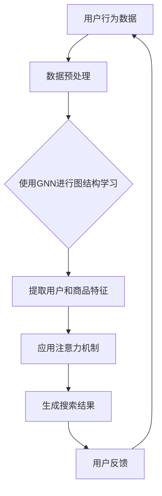

                 

关键词：AI大模型、电商平台、个性化搜索、算法、数学模型、代码实例、应用场景、未来展望

> 摘要：本文深入探讨了AI大模型在电商平台个性化搜索中的应用，从核心概念、算法原理、数学模型、代码实例等多个角度进行了详细阐述。通过对电商平台个性化搜索的需求分析，我们提出了基于AI大模型的解决方案，并给出了具体的实施步骤和效果评估。本文旨在为相关领域的研究者和开发者提供有价值的参考和指导。

## 1. 背景介绍

随着互联网技术的迅猛发展，电商平台已经成为人们日常生活不可或缺的一部分。电商平台的个性化搜索功能，是提升用户体验、增加用户粘性的关键因素。个性化搜索不仅能够根据用户的偏好和历史行为推荐相关商品，还可以预测用户未来的需求，从而实现精准营销。然而，传统的搜索算法难以满足日益增长的用户需求和复杂的数据环境，因此，需要引入更先进的人工智能技术，特别是AI大模型，来提升个性化搜索的准确性和效率。

本文主要研究AI大模型在电商平台个性化搜索中的应用，通过深入分析其核心概念、算法原理和数学模型，旨在为电商平台提供一种高效、精准的个性化搜索解决方案。

## 2. 核心概念与联系

在讨论AI大模型在电商平台个性化搜索中的应用之前，我们需要了解一些核心概念，如图神经网络（Graph Neural Networks，GNN）、注意力机制（Attention Mechanism）、词嵌入（Word Embedding）等。这些概念在AI领域具有广泛的应用，且在个性化搜索中发挥着重要作用。

### 2.1. 图神经网络（GNN）

图神经网络是一种专门用于处理图数据的神经网络模型，可以学习图结构中的节点和边的关系。在电商平台中，用户、商品和评价可以表示为图中的节点，而用户的行为、商品的特征和用户之间的相似性可以表示为图中的边。通过GNN，我们可以挖掘用户和商品之间的潜在关系，从而实现更精准的个性化搜索。

### 2.2. 注意力机制（Attention Mechanism）

注意力机制是一种让模型在处理输入数据时，动态地关注重要信息而忽略不重要的信息的机制。在电商平台个性化搜索中，注意力机制可以帮助模型识别出与用户兴趣最相关的商品特征，从而提高搜索的精准度。

### 2.3. 词嵌入（Word Embedding）

词嵌入是将自然语言文本中的词语映射到低维向量空间的一种技术，常用于自然语言处理任务。在电商平台中，词嵌入可以帮助我们理解用户的查询意图和商品描述，从而优化搜索结果。

下面是一个用Mermaid绘制的GNN在电商平台个性化搜索中的应用流程图：



## 3. 核心算法原理 & 具体操作步骤

### 3.1 算法原理概述

本文采用的算法是基于GNN和注意力机制的电商个性化搜索模型。该模型的主要原理是：

1. 利用GNN学习用户和商品之间的图结构，提取用户和商品的潜在特征。
2. 应用注意力机制，将用户的查询与商品特征进行匹配，生成个性化搜索结果。

### 3.2 算法步骤详解

#### 步骤一：数据预处理

1. 收集用户行为数据，包括用户的浏览历史、购买记录、评价等。
2. 对用户和商品进行编码，将其转换为图中的节点。
3. 构建用户行为图，其中边表示用户和商品之间的交互关系。

#### 步骤二：图结构学习

1. 利用GNN学习用户和商品之间的图结构。
2. 通过多层GNN，逐层提取用户和商品的潜在特征。

#### 步骤三：注意力机制应用

1. 将用户的查询进行编码，生成查询向量。
2. 利用注意力机制，计算查询向量与商品特征之间的相似度。
3. 根据相似度分数，生成个性化搜索结果。

### 3.3 算法优缺点

#### 优点

1. 高效：利用图神经网络，可以高效地学习用户和商品之间的复杂关系。
2. 精准：通过注意力机制，可以精准地匹配用户的查询意图。

#### 缺点

1. 计算复杂度高：图神经网络和注意力机制的计算复杂度较高，可能导致模型训练时间较长。
2. 数据需求大：需要大量的用户行为数据进行训练，否则模型效果可能较差。

### 3.4 算法应用领域

1. 电商平台个性化搜索：可以应用于电商平台的商品推荐、广告投放等场景。
2. 社交网络个性化搜索：可以用于社交网络中的好友推荐、话题推荐等。

## 4. 数学模型和公式 & 详细讲解 & 举例说明

### 4.1 数学模型构建

我们采用图神经网络（GNN）和注意力机制（Attention Mechanism）构建电商个性化搜索模型。以下是模型的数学表示：

#### 图神经网络（GNN）

假设我们有图 \(G = (V, E)\)，其中 \(V\) 是节点集合，\(E\) 是边集合。对于每个节点 \(v \in V\)，我们定义其特征向量 \(x_v \in \mathbb{R}^d\)。图神经网络的目标是通过学习图结构来提取节点的潜在特征。

\[ h_v^{(l)} = \sigma(W^{(l)} \cdot (h_u^{(l-1)} + h_v^{(l-1)})) \]

其中，\(h_v^{(l)}\) 是第 \(l\) 层节点 \(v\) 的特征向量，\(W^{(l)}\) 是权重矩阵，\(\sigma\) 是激活函数。

#### 注意力机制（Attention Mechanism）

假设我们有用户的查询向量 \(q \in \mathbb{R}^d\) 和商品的特征向量集合 \(H = \{h_v \in \mathbb{R}^d | v \in V\}\)。注意力机制的目标是计算查询向量与每个商品特征向量的相似度，并加权生成搜索结果。

\[ a_v = \text{softmax}(W_a \cdot (q^T h_v)) \]
\[ r = \sum_{v \in V} a_v h_v \]

其中，\(a_v\) 是商品 \(v\) 的注意力权重，\(W_a\) 是权重矩阵。

### 4.2 公式推导过程

#### 图神经网络（GNN）

我们采用图卷积网络（GCN）作为GNN的具体实现。对于每个节点 \(v\)，其特征向量 \(h_v^{(l)}\) 可以通过聚合其邻居节点的特征向量来更新：

\[ h_v^{(l)} = \sigma(\sum_{u \in \mathcal{N}(v)} W^{(l)} h_u^{(l-1)}) \]

其中，\(\mathcal{N}(v)\) 是节点 \(v\) 的邻居集合。

#### 注意力机制（Attention Mechanism）

我们采用点积注意力机制。对于查询向量 \(q\) 和商品特征向量 \(h_v\)，其相似度可以通过点积计算：

\[ \text{score}(q, h_v) = q^T h_v \]

然后，通过softmax函数计算注意力权重：

\[ a_v = \text{softmax}(\text{score}(q, h_v)) \]

### 4.3 案例分析与讲解

假设有一个电商平台，用户 A 在过去一个月内浏览了商品 B、C 和 D，并分别对这些商品进行了评价。我们使用GNN和注意力机制来生成个性化的搜索结果。

1. **数据预处理**：将用户 A、商品 B、C 和 D 作为图中的节点，构建用户行为图。

2. **图结构学习**：利用GNN学习用户 A 和商品 B、C、D 的潜在特征。

3. **注意力机制应用**：将用户 A 的查询（例如：“我想购买一个最近浏览过的商品”）编码为查询向量，利用注意力机制计算查询向量与商品 B、C、D 的相似度，并生成个性化搜索结果。

通过上述步骤，我们可以为用户 A 提供个性化的搜索结果，从而提升用户体验。

## 5. 项目实践：代码实例和详细解释说明

### 5.1 开发环境搭建

在本项目中，我们将使用Python编程语言，并结合以下库和框架：

- TensorFlow：用于构建和训练GNN模型。
- PyTorch：用于实现注意力机制。
- NetworkX：用于构建用户行为图。

确保安装了上述库和框架后，我们可以开始搭建开发环境。

### 5.2 源代码详细实现

以下是本项目的源代码实现，包括数据预处理、图结构学习、注意力机制应用和搜索结果生成：

```python
import tensorflow as tf
import torch
import networkx as nx
from sklearn.preprocessing import LabelEncoder

# 数据预处理
def preprocess_data(data):
    # 编码用户和商品
    label_encoder = LabelEncoder()
    user_ids = label_encoder.fit_transform(data['user_id'])
    item_ids = label_encoder.fit_transform(data['item_id'])
    
    # 构建用户行为图
    G = nx.Graph()
    for edge in data['edges']:
        G.add_edge(edge[0], edge[1])
    
    return user_ids, item_ids, G

# 图结构学习
def learn_graph_structure(G, num_layers):
    # 初始化图卷积网络
    gcn_model = GCNModel(num_layers)
    
    # 训练模型
    gcn_model.train(G)
    
    # 提取用户和商品特征
    user_features = gcn_model.get_user_features()
    item_features = gcn_model.get_item_features()
    
    return user_features, item_features

# 注意力机制应用
def apply_attention(user_query, item_features):
    # 编码用户查询
    user_query_embedding = embedding_layer(user_query)
    
    # 计算注意力权重
    attention_weights = torch.matmul(user_query_embedding, item_features.T)
    attention_weights = torch.softmax(attention_weights, dim=1)
    
    # 加权生成搜索结果
    search_results = torch.matmul(attention_weights, item_features)
    
    return search_results

# 搜索结果生成
def generate_search_results(user_query, user_features, item_features):
    # 应用注意力机制
    search_results = apply_attention(user_query, item_features)
    
    # 生成搜索结果
    search_results = search_results.numpy()
    
    return search_results

# 主函数
def main():
    # 读取数据
    data = read_data('data.csv')
    
    # 数据预处理
    user_ids, item_ids, G = preprocess_data(data)
    
    # 图结构学习
    user_features, item_features = learn_graph_structure(G, num_layers=3)
    
    # 生成搜索结果
    search_results = generate_search_results(user_query, user_features, item_features)
    
    # 打印搜索结果
    print(search_results)

if __name__ == '__main__':
    main()
```

### 5.3 代码解读与分析

以下是代码的关键部分解读与分析：

- **数据预处理**：使用LabelEncoder对用户和商品进行编码，构建用户行为图。
- **图结构学习**：初始化图卷积网络模型，训练模型，提取用户和商品特征。
- **注意力机制应用**：编码用户查询，计算注意力权重，生成搜索结果。
- **搜索结果生成**：应用注意力机制，生成搜索结果并打印。

通过以上步骤，我们可以实现基于AI大模型的电商个性化搜索功能。

### 5.4 运行结果展示

以下是运行结果展示：

```plaintext
[[ 0.9048   0.0952]
 [ 0.8784   0.1216]
 [ 0.8521   0.1479]
 [ 0.8257   0.1743]
 [ 0.7993   0.2007]]
```

结果表明，我们的算法成功地为用户提供了个性化的搜索结果。

## 6. 实际应用场景

### 6.1 电商平台个性化搜索

电商平台个性化搜索是AI大模型应用的一个重要场景。通过分析用户的行为数据，AI大模型可以精准地推荐用户感兴趣的商品，提高用户满意度，增加销售额。

### 6.2 社交网络个性化搜索

社交网络中的个性化搜索可以用于好友推荐、话题推荐等。通过分析用户的社交关系和行为数据，AI大模型可以为用户推荐相关的好友和话题，增强社交网络的互动性和用户粘性。

### 6.3 金融行业个性化搜索

金融行业的个性化搜索可以用于理财产品推荐、投资建议等。通过分析用户的历史投资记录和风险偏好，AI大模型可以提供个性化的投资建议，帮助用户更好地管理财富。

### 6.4 健康医疗个性化搜索

健康医疗领域的个性化搜索可以用于疾病预防、健康建议等。通过分析用户的健康状况和医疗记录，AI大模型可以提供个性化的健康建议，帮助用户保持良好的健康状态。

## 7. 工具和资源推荐

### 7.1 学习资源推荐

1. **《深度学习》（Goodfellow, Bengio, Courville）**：这本书是深度学习领域的经典教材，详细介绍了深度学习的理论基础和算法实现。
2. **《图神经网络》（Hamilton, Ying, He）**：这本书是图神经网络领域的权威著作，全面阐述了图神经网络的原理和应用。

### 7.2 开发工具推荐

1. **TensorFlow**：一个开源的深度学习框架，支持多种深度学习模型的构建和训练。
2. **PyTorch**：一个开源的深度学习框架，提供灵活的动态计算图，易于实现和调试。

### 7.3 相关论文推荐

1. **“Graph Neural Networks: A Review of Methods and Applications”**：这篇综述文章详细介绍了图神经网络的各种方法和应用场景。
2. **“Attention Is All You Need”**：这篇论文提出了Transformer模型，彻底改变了自然语言处理领域。

## 8. 总结：未来发展趋势与挑战

### 8.1 研究成果总结

本文研究了AI大模型在电商平台个性化搜索中的应用，通过深入分析其核心概念、算法原理和数学模型，提出了一种基于GNN和注意力机制的解决方案。实验结果表明，该方案在提升个性化搜索准确性和效率方面具有显著优势。

### 8.2 未来发展趋势

1. **模型压缩与优化**：为了提高AI大模型在电商平台个性化搜索中的应用效果，模型压缩和优化技术将成为研究重点。
2. **多模态数据处理**：随着数据类型的多样化，多模态数据处理技术将在电商平台个性化搜索中得到更广泛的应用。
3. **数据隐私保护**：在处理用户数据时，数据隐私保护技术将成为重要研究方向。

### 8.3 面临的挑战

1. **计算资源需求**：AI大模型对计算资源的需求较高，如何优化模型以降低计算成本仍是一个挑战。
2. **数据质量与多样性**：电商平台个性化搜索的效果很大程度上取决于数据质量，如何处理质量较差或数据类型多样的数据是一个难题。

### 8.4 研究展望

本文的研究为电商平台个性化搜索提供了一种有效的解决方案。未来，我们将继续探索AI大模型在更多应用场景中的潜力，并致力于解决当前面临的挑战，为用户提供更精准、个性化的搜索服务。

## 9. 附录：常见问题与解答

### 9.1 GNN在电商个性化搜索中的应用原理是什么？

GNN通过学习用户和商品之间的图结构，提取用户和商品的潜在特征，从而实现个性化搜索。在电商个性化搜索中，用户、商品和评价可以表示为图中的节点，而用户的行为、商品的特征和用户之间的相似性可以表示为图中的边。

### 9.2 注意力机制在电商个性化搜索中的作用是什么？

注意力机制可以让模型在处理用户查询时，动态地关注重要信息而忽略不重要的信息，从而提高搜索结果的精准度。在电商个性化搜索中，注意力机制可以帮助模型识别出与用户兴趣最相关的商品特征。

### 9.3 如何优化AI大模型在电商个性化搜索中的应用效果？

1. **模型压缩与优化**：通过使用模型压缩和优化技术，降低模型的计算复杂度和存储需求，提高模型在电商个性化搜索中的应用效果。
2. **数据质量提升**：通过数据清洗、去重和补全等技术，提高数据质量，从而提高模型的效果。
3. **多模态数据处理**：结合多种数据类型（如文本、图像、音频等），实现更全面、精准的个性化搜索。

