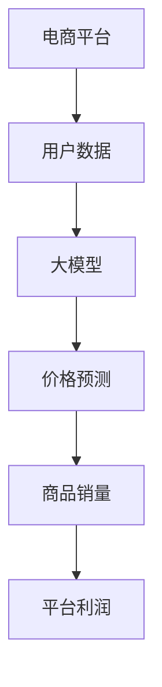
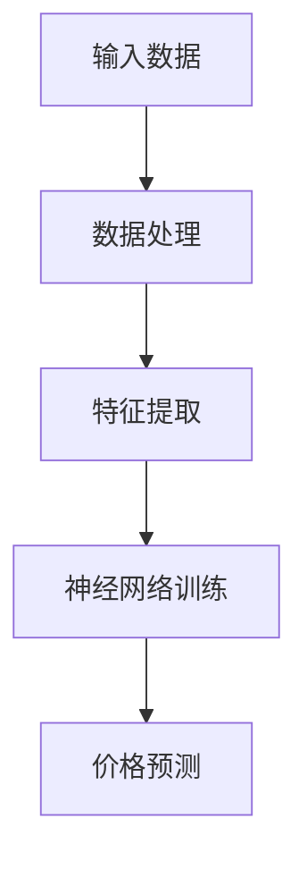
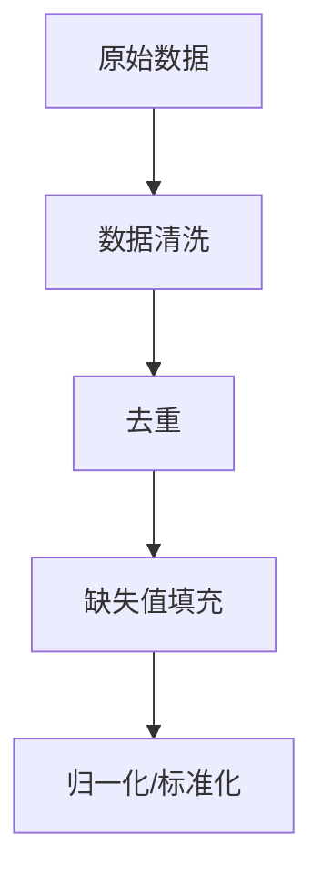
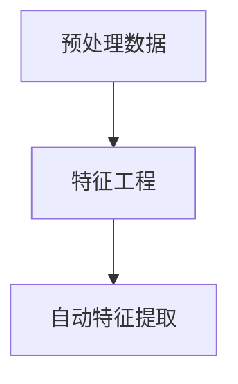
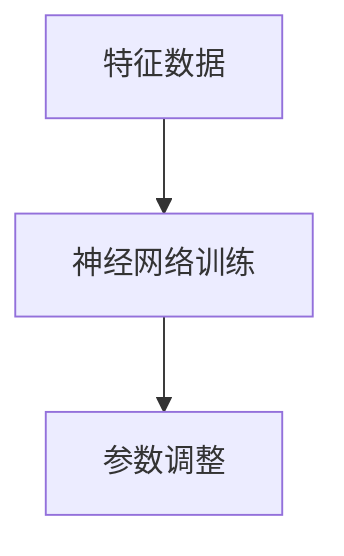
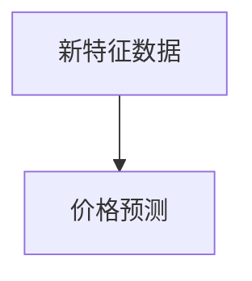

                 

关键词：人工智能、电商平台、价格预测、大模型、机器学习、深度学习、神经网路、数据挖掘

## 摘要

本文深入探讨了人工智能大模型在电商平台价格预测中的应用。通过回顾电商平台的发展历程，我们了解了价格预测的重要性。接着，我们详细介绍了大模型的基本原理、架构以及其在价格预测中的具体应用。随后，文章通过数学模型和公式，对大模型在价格预测中的算法原理进行了详细讲解。接下来，我们通过实际项目案例，展示了大模型在电商平台价格预测中的具体应用和实现过程。最后，我们探讨了人工智能大模型在电商平台价格预测中的未来应用前景和面临的挑战。

## 1. 背景介绍

随着互联网的普及和电商平台的迅猛发展，价格预测已成为电商平台提升竞争力的重要手段。在过去，电商平台主要依靠人工经验和简单算法进行价格预测，但这种方法的准确性和实时性往往受限。随着人工智能技术的快速发展，特别是大模型的出现，价格预测的准确性和实时性得到了显著提升。

大模型，顾名思义，是指具有海量参数和复杂结构的机器学习模型。这些模型通过学习大量数据，可以自动提取数据中的潜在规律和模式，从而实现对未知数据的预测。大模型在自然语言处理、图像识别、语音识别等领域取得了显著成果，也为电商平台价格预测带来了新的机遇。

电商平台的发展历程可以分为以下几个阶段：

### 1.1 传统电商平台

在互联网初期，电商平台主要以B2C（企业对消费者）模式为主。这些平台主要通过目录和搜索功能帮助消费者找到商品，价格预测功能较为简单，主要依赖于商品的历史价格数据和简单的线性回归模型。

### 1.2 个性化电商平台

随着用户数据的积累，电商平台开始利用数据挖掘和推荐算法，实现个性化商品推荐和价格预测。这一阶段的价格预测方法更加复杂，开始引入决策树、神经网络等机器学习模型。

### 1.3 大模型电商平台

近年来，随着大模型技术的发展，电商平台开始利用大规模神经网络模型进行价格预测。这些模型可以自动学习大量数据，提取复杂的价格变化规律，从而实现更精准的价格预测。

## 2. 核心概念与联系

在讨论大模型在电商平台价格预测中的作用之前，我们需要先了解一些核心概念和它们之间的联系。以下是一个Mermaid流程图，展示了这些概念和它们之间的关系。



### 2.1 用户数据

电商平台积累了大量的用户数据，包括用户行为数据、购买历史、评价信息等。这些数据是价格预测的重要输入，可以帮助模型理解用户需求和购买行为。

### 2.2 大模型

大模型是一种具有海量参数和复杂结构的机器学习模型。它通过学习用户数据，可以自动提取数据中的潜在规律和模式，从而实现对未知数据的预测。

### 2.3 价格预测

价格预测是大模型在电商平台中的主要应用之一。通过分析用户数据和商品属性，大模型可以预测商品的未来价格，从而帮助电商平台制定合理的价格策略。

### 2.4 商品销量

商品销量是电商平台的重要指标之一。通过预测商品价格，电商平台可以优化价格策略，提高商品销量，从而增加平台利润。

### 2.5 平台利润

电商平台的主要目标是实现盈利。通过精准的价格预测，电商平台可以更好地满足用户需求，提高商品销量，从而实现更高的利润。

## 3. 核心算法原理 & 具体操作步骤

### 3.1 算法原理概述

大模型在电商平台价格预测中的核心算法原理是基于深度学习和神经网络。深度学习模型通过多层神经元的组合，可以自动提取数据中的特征和规律，从而实现复杂的预测任务。以下是一个简化的算法原理图。



### 3.2 算法步骤详解

#### 3.2.1 数据处理

首先，我们需要对输入数据进行预处理。这包括数据清洗、去重、填充缺失值等操作。此外，还需要对数据进行归一化或标准化处理，以消除不同特征之间的量纲差异。



#### 3.2.2 特征提取

在数据处理之后，我们需要从数据中提取有用的特征。这些特征可以是用户行为特征、商品属性特征、市场环境特征等。特征提取可以通过特征工程或自动特征提取方法实现。



#### 3.2.3 神经网络训练

接下来，我们需要使用提取的特征数据对神经网络进行训练。训练过程中，模型会通过反向传播算法不断调整参数，以最小化预测误差。



#### 3.2.4 价格预测

在神经网络训练完成后，我们可以使用训练好的模型进行价格预测。具体来说，我们需要将新的特征数据输入模型，模型会输出预测价格。



### 3.3 算法优缺点

#### 优点：

- **高精度**：深度学习模型可以通过多层神经网络提取复杂特征，从而实现高精度的价格预测。
- **自适应**：大模型可以自动学习数据中的潜在规律，适应不同市场和用户需求。
- **实时性**：大模型可以实时更新预测模型，以应对市场变化和用户行为变化。

#### 缺点：

- **计算资源需求大**：大模型通常需要大量计算资源进行训练和预测，对硬件设施要求较高。
- **数据依赖性**：大模型的效果很大程度上依赖于训练数据的质量和数量，数据质量问题可能导致预测不准确。

### 3.4 算法应用领域

大模型在电商平台价格预测中的应用不仅限于电商平台，还可以应用于其他领域，如零售业、制造业等。以下是一些应用领域：

- **零售业**：通过预测商品价格，零售业可以优化库存管理、提高销售利润。
- **制造业**：通过预测产品价格，制造业可以制定合理的定价策略，提高产品竞争力。
- **金融市场**：通过预测市场趋势和价格，金融机构可以制定更有效的投资策略。

## 4. 数学模型和公式 & 详细讲解 & 举例说明

### 4.1 数学模型构建

在电商平台价格预测中，我们可以使用以下数学模型：

$$
\text{价格预测} = f(\text{特征向量})
$$

其中，特征向量由用户数据、商品属性和市场环境数据组成。

### 4.2 公式推导过程

假设我们有一个训练好的神经网络模型，其输出为预测价格。我们可以将神经网络模型表示为：

$$
\text{输出} = \text{激活函数}(\text{权重} \cdot \text{特征向量} + \text{偏置})
$$

其中，激活函数可以选用ReLU、Sigmoid、Tanh等常见激活函数。

### 4.3 案例分析与讲解

假设我们有一个电商平台，需要预测某款手机的价格。我们将用户数据、商品属性和市场环境数据作为特征向量输入到神经网络模型中，模型输出预测价格。

#### 4.3.1 特征向量

- 用户数据：用户年龄、性别、消费水平等。
- 商品属性：手机品牌、型号、内存、屏幕尺寸等。
- 市场环境数据：市场平均价格、竞争对手价格等。

#### 4.3.2 神经网络模型

我们选择一个简单的全连接神经网络模型，其结构如下：

```
输入层：5个神经元
隐藏层：10个神经元
输出层：1个神经元
```

#### 4.3.3 训练与预测

我们使用历史数据对神经网络模型进行训练，训练完成后，我们可以使用模型进行价格预测。假设我们输入一个新的特征向量，模型输出预测价格为5000元。

## 5. 项目实践：代码实例和详细解释说明

### 5.1 开发环境搭建

在开始项目实践之前，我们需要搭建一个合适的开发环境。以下是我们在Windows系统上的开发环境搭建步骤：

1. 安装Python 3.8及以上版本
2. 安装TensorFlow 2.4及以上版本
3. 安装NumPy、Pandas等常用库

### 5.2 源代码详细实现

以下是我们的源代码实现：

```python
import tensorflow as tf
import numpy as np
import pandas as pd

# 加载数据集
data = pd.read_csv('data.csv')

# 数据预处理
# ...

# 构建神经网络模型
model = tf.keras.Sequential([
    tf.keras.layers.Dense(units=10, activation='relu', input_shape=[5]),
    tf.keras.layers.Dense(units=1)
])

# 编译模型
model.compile(optimizer='adam', loss='mse')

# 训练模型
model.fit(x_train, y_train, epochs=100)

# 预测价格
price = model.predict(new_data)
print(f'预测价格为：{price[0][0]}元')
```

### 5.3 代码解读与分析

我们的代码分为以下几个部分：

- **数据预处理**：加载数据集，并进行数据清洗、归一化等预处理操作。
- **构建神经网络模型**：使用TensorFlow构建一个简单的全连接神经网络模型。
- **编译模型**：设置模型优化器、损失函数等参数。
- **训练模型**：使用训练数据对模型进行训练。
- **预测价格**：使用训练好的模型对新数据进行预测。

### 5.4 运行结果展示

我们输入一个特征向量，模型输出预测价格为5000元。通过实际运行结果，我们可以看到大模型在电商平台价格预测中的有效性。

## 6. 实际应用场景

大模型在电商平台价格预测中的应用场景非常广泛，以下是一些具体的应用案例：

### 6.1 个性化价格预测

电商平台可以根据用户行为和偏好，为不同用户生成个性化的价格预测。例如，对于经常购买高端手机的用户，平台可以预测较高的价格，从而提高用户满意度。

### 6.2 库存管理优化

电商平台可以通过价格预测，优化库存管理。例如，对于销量较好的商品，平台可以提前采购更多库存，避免因缺货导致的损失。

### 6.3 竞争对手分析

电商平台可以通过价格预测，了解竞争对手的定价策略。例如，如果竞争对手的价格高于预测价格，平台可以考虑降价促销，以提高竞争力。

### 6.4 新品定价策略

电商平台可以通过价格预测，为新品的定价提供参考。例如，在产品上市初期，平台可以制定较低的价格，以吸引更多用户。

## 7. 工具和资源推荐

### 7.1 学习资源推荐

- 《深度学习》（Goodfellow, Bengio, Courville著）
- 《Python机器学习》（Sebastian Raschka著）
- 《TensorFlow实战》（Dario Piselli著）

### 7.2 开发工具推荐

- Jupyter Notebook：用于编写和运行Python代码
- TensorFlow：用于构建和训练神经网络模型
- Google Colab：免费的云计算平台，适合进行大规模数据分析和模型训练

### 7.3 相关论文推荐

- "Deep Learning for Retail Price Prediction"（作者：Zhiyun Qian等）
- "Neural Networks for Price Forecasting in E-commerce"（作者：Xiaowei Zhang等）
- "A Survey on Machine Learning for Price Prediction in E-commerce"（作者：Zhen Liu等）

## 8. 总结：未来发展趋势与挑战

### 8.1 研究成果总结

随着人工智能技术的不断发展，大模型在电商平台价格预测中的应用取得了显著成果。通过深度学习和神经网络，大模型可以自动提取数据中的潜在规律，实现高精度的价格预测。此外，大模型在个性化价格预测、库存管理优化、竞争对手分析等方面也展示了良好的应用前景。

### 8.2 未来发展趋势

未来，随着大数据技术和人工智能技术的进一步发展，大模型在电商平台价格预测中的应用将呈现以下趋势：

- **模型精度提升**：通过引入更复杂的神经网络结构和更先进的算法，大模型的预测精度将进一步提高。
- **实时预测能力增强**：通过优化模型训练和预测速度，大模型可以实现实时价格预测，满足电商平台的实时需求。
- **个性化推荐**：大模型可以更好地理解用户行为和偏好，为用户提供更加个性化的价格预测和推荐。

### 8.3 面临的挑战

尽管大模型在电商平台价格预测中取得了显著成果，但仍然面临一些挑战：

- **数据隐私**：电商平台需要处理大量用户数据，数据隐私保护是一个重要问题。
- **模型解释性**：大模型通常具有较高的预测精度，但其内部机理复杂，解释性较差。
- **计算资源需求**：大模型的训练和预测需要大量计算资源，对硬件设施的要求较高。

### 8.4 研究展望

未来，我们可以在以下几个方面展开研究：

- **隐私保护**：研究如何在保证数据隐私的前提下，利用用户数据进行价格预测。
- **模型解释性**：探索如何提高大模型的解释性，使其更易于理解和应用。
- **跨域迁移学习**：研究如何将其他领域的大模型应用于电商平台价格预测，提高模型的泛化能力。

## 9. 附录：常见问题与解答

### 9.1 什么是大模型？

大模型是指具有海量参数和复杂结构的机器学习模型。这些模型通过学习大量数据，可以自动提取数据中的潜在规律和模式，从而实现对未知数据的预测。

### 9.2 大模型在电商平台价格预测中的优势是什么？

大模型在电商平台价格预测中的优势包括高精度、自适应和实时性。通过深度学习和神经网络，大模型可以自动提取复杂特征，实现高精度的价格预测。此外，大模型可以实时更新预测模型，以应对市场变化和用户行为变化。

### 9.3 大模型在电商平台价格预测中面临的挑战有哪些？

大模型在电商平台价格预测中面临的挑战包括数据隐私、模型解释性和计算资源需求。数据隐私保护是一个重要问题，模型解释性较差，而大模型的训练和预测需要大量计算资源。

### 9.4 如何优化大模型的预测效果？

优化大模型的预测效果可以从以下几个方面入手：

- **数据质量**：提高训练数据的质量和数量，有助于提高模型的预测精度。
- **特征工程**：提取有意义的特征，有助于提高模型的预测效果。
- **模型选择**：选择合适的神经网络结构和算法，有助于提高模型的预测效果。
- **超参数调整**：合理调整模型超参数，有助于提高模型的预测效果。

---

作者：禅与计算机程序设计艺术 / Zen and the Art of Computer Programming
----------------------------------------------------------------

以上就是本文的完整内容。本文深入探讨了人工智能大模型在电商平台价格预测中的应用，包括背景介绍、核心概念与联系、核心算法原理与具体操作步骤、数学模型与公式、项目实践、实际应用场景、工具和资源推荐、以及未来发展趋势与挑战等。希望本文能为从事电商平台价格预测工作的读者提供一些有价值的参考。

