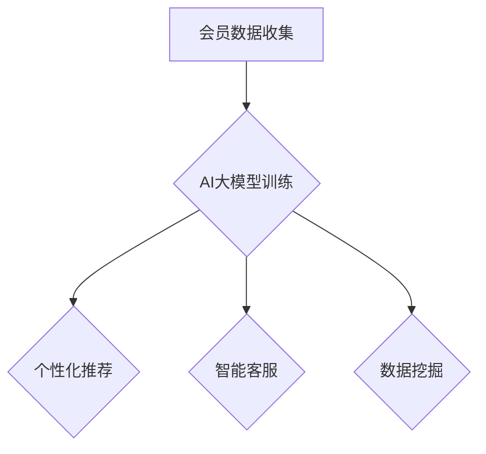

                 

关键词：AI大模型、电商平台、会员管理、个性化推荐、智能客服、数据挖掘、机器学习、深度学习

> 摘要：本文探讨了AI大模型在电商平台会员管理中的应用，分析了AI大模型的核心概念、算法原理、数学模型和实际操作步骤。文章通过具体案例，展示了如何利用AI大模型实现电商平台会员的精准管理，提高用户体验和销售额。最后，对未来的发展趋势和面临的挑战进行了展望。

## 1. 背景介绍

随着互联网的飞速发展，电商平台已经成为消费者购买商品的主要渠道之一。会员管理作为电商平台的核心环节，不仅关乎用户体验，也直接影响着平台的商业利润。传统的会员管理主要依赖于数据分析和人工干预，然而随着用户数量的增加和数据量的爆发增长，这种方式已经无法满足电商平台的业务需求。因此，引入AI大模型成为解决这一问题的有效途径。

AI大模型是指通过深度学习等机器学习算法，在大量数据上训练得到的具有强大预测和决策能力的模型。这些模型可以自动从数据中学习规律，提供个性化的推荐和服务，提高用户满意度和销售额。在电商平台会员管理中，AI大模型可以应用于个性化推荐、智能客服、数据挖掘等多个方面，实现精准的会员管理。

## 2. 核心概念与联系

### 2.1 AI大模型的基本概念

AI大模型是指通过深度学习等机器学习算法，在大量数据上训练得到的具有强大预测和决策能力的模型。这些模型通常包括神经网络、生成对抗网络（GAN）、增强学习等类型。

- 神经网络：通过模拟人脑的神经网络结构，实现对数据的分类、回归、聚类等操作。常见的神经网络包括多层感知机（MLP）、卷积神经网络（CNN）、循环神经网络（RNN）等。
- 生成对抗网络（GAN）：由生成器和判别器组成的对抗网络，通过生成器生成数据，判别器判断生成数据的真实性，从而提高生成器的生成能力。
- 增强学习：通过与环境互动，不断调整策略，实现最优决策的过程。

### 2.2 AI大模型在电商平台会员管理中的应用

AI大模型在电商平台会员管理中的应用主要包括以下方面：

- 个性化推荐：根据用户的购买历史、浏览记录等数据，利用AI大模型为用户推荐感兴趣的商品。
- 智能客服：利用AI大模型实现智能客服机器人，自动处理用户咨询、投诉等问题，提高客服效率。
- 数据挖掘：通过AI大模型挖掘用户行为数据，发现潜在的商业机会，制定相应的营销策略。

### 2.3 Mermaid 流程图



## 3. 核心算法原理 & 具体操作步骤

### 3.1 算法原理概述

AI大模型的核心算法主要包括深度学习、生成对抗网络（GAN）、增强学习等。以下是这些算法的简要概述：

- 深度学习：通过多层神经网络结构，自动从数据中学习特征，实现对数据的分类、回归、聚类等操作。常见的深度学习算法包括多层感知机（MLP）、卷积神经网络（CNN）、循环神经网络（RNN）等。
- 生成对抗网络（GAN）：由生成器和判别器组成的对抗网络，通过生成器生成数据，判别器判断生成数据的真实性，从而提高生成器的生成能力。
- 增强学习：通过与环境互动，不断调整策略，实现最优决策的过程。

### 3.2 算法步骤详解

#### 3.2.1 个性化推荐

1. 数据预处理：对用户行为数据进行清洗、去重、补全等处理，将数据转换为模型输入格式。
2. 特征提取：通过深度学习算法提取用户行为数据中的关键特征。
3. 模型训练：使用提取的特征数据训练个性化推荐模型。
4. 模型评估：使用验证集评估模型性能，调整模型参数。
5. 模型部署：将训练好的模型部署到生产环境，为用户提供个性化推荐。

#### 3.2.2 智能客服

1. 数据预处理：对用户咨询、投诉等数据进行清洗、去重、分类等处理。
2. 特征提取：通过深度学习算法提取用户咨询数据的特征。
3. 模型训练：使用提取的特征数据训练智能客服模型。
4. 模型评估：使用验证集评估模型性能，调整模型参数。
5. 模型部署：将训练好的模型部署到生产环境，实现智能客服功能。

#### 3.2.3 数据挖掘

1. 数据预处理：对用户行为数据进行清洗、去重、分类等处理。
2. 特征提取：通过深度学习算法提取用户行为数据中的关键特征。
3. 模型训练：使用提取的特征数据训练数据挖掘模型。
4. 模型评估：使用验证集评估模型性能，调整模型参数。
5. 模型部署：将训练好的模型部署到生产环境，用于数据挖掘。

### 3.3 算法优缺点

#### 3.3.1 个性化推荐

优点：

- 提高用户满意度：根据用户兴趣推荐相关商品，提高用户购买意愿。
- 提高销售额：精准推荐有助于挖掘潜在用户，提高销售额。

缺点：

- 数据质量要求高：需要大量的高质量用户行为数据作为训练数据。
- 模型复杂度高：深度学习模型训练过程复杂，对硬件资源要求高。

#### 3.3.2 智能客服

优点：

- 提高客服效率：自动处理用户咨询，减轻客服人员负担。
- 降低运营成本：减少人工客服需求，降低运营成本。

缺点：

- 用户体验：智能客服机器人可能无法完全理解用户意图，影响用户体验。
- 模型准确率：模型准确率对用户咨询处理效果有很大影响。

#### 3.3.3 数据挖掘

优点：

- 挖掘潜在商业机会：通过数据挖掘发现用户行为规律，制定相应的营销策略。
- 提高运营效率：自动化处理用户数据，减轻运营人员负担。

缺点：

- 数据安全：用户数据涉及隐私，需要严格保护数据安全。
- 模型解释性：深度学习模型通常具有较低的模型解释性，难以理解模型决策过程。

### 3.4 算法应用领域

AI大模型在电商平台会员管理中的应用领域主要包括：

- 个性化推荐：应用于电商平台商品推荐、视频推荐、音乐推荐等。
- 智能客服：应用于在线客服、电话客服、邮件客服等。
- 数据挖掘：应用于用户行为分析、市场调研、竞争分析等。

## 4. 数学模型和公式 & 详细讲解 & 举例说明

### 4.1 数学模型构建

在电商平台会员管理中，常见的数学模型包括线性回归模型、逻辑回归模型、支持向量机（SVM）等。以下是这些模型的构建过程和公式。

#### 4.1.1 线性回归模型

线性回归模型是一种最简单的机器学习算法，用于预测连续值。其公式如下：

$$y = \beta_0 + \beta_1 \cdot x$$

其中，$y$为因变量，$x$为自变量，$\beta_0$和$\beta_1$为模型参数。

#### 4.1.2 逻辑回归模型

逻辑回归模型是一种常用的分类算法，用于预测概率。其公式如下：

$$P(y=1) = \frac{1}{1 + e^{-(\beta_0 + \beta_1 \cdot x)}$$

其中，$y$为因变量，$x$为自变量，$\beta_0$和$\beta_1$为模型参数。

#### 4.1.3 支持向量机（SVM）

支持向量机是一种分类算法，用于解决二分类问题。其公式如下：

$$\text{最大化} \ \ \sum_{i=1}^{n} (w \cdot x_i - y_i)$$

$$\text{约束条件：} \ \ w \cdot w \leq C$$

其中，$w$为模型参数，$x_i$为训练样本，$y_i$为训练样本的标签，$C$为惩罚参数。

### 4.2 公式推导过程

#### 4.2.1 线性回归模型

假设我们有一组数据$(x_1, y_1), (x_2, y_2), ..., (x_n, y_n)$，其中$x_i$为自变量，$y_i$为因变量。

首先，我们定义线性回归模型的损失函数为：

$$J(\theta) = \frac{1}{2m} \sum_{i=1}^{m} (h_\theta(x_i) - y_i)^2$$

其中，$h_\theta(x) = \theta_0 + \theta_1 \cdot x$为线性回归模型的前向传播函数，$\theta_0$和$\theta_1$为模型参数。

为了最小化损失函数，我们对损失函数关于$\theta_0$和$\theta_1$求导，并令导数等于0，得到：

$$\frac{\partial J(\theta)}{\partial \theta_0} = 0$$

$$\frac{\partial J(\theta)}{\partial \theta_1} = 0$$

通过求解上述方程组，可以得到线性回归模型的参数$\theta_0$和$\theta_1$。

#### 4.2.2 逻辑回归模型

假设我们有一组数据$(x_1, y_1), (x_2, y_2), ..., (x_n, y_n)$，其中$x_i$为自变量，$y_i$为因变量。

首先，我们定义逻辑回归模型的损失函数为：

$$J(\theta) = -\frac{1}{m} \sum_{i=1}^{m} [y_i \cdot \log(h_\theta(x_i)) + (1 - y_i) \cdot \log(1 - h_\theta(x_i))]$$

其中，$h_\theta(x) = \frac{1}{1 + e^{-(\theta_0 + \theta_1 \cdot x)}}$为逻辑回归模型的前向传播函数，$\theta_0$和$\theta_1$为模型参数。

为了最小化损失函数，我们对损失函数关于$\theta_0$和$\theta_1$求导，并令导数等于0，得到：

$$\frac{\partial J(\theta)}{\partial \theta_0} = 0$$

$$\frac{\partial J(\theta)}{\partial \theta_1} = 0$$

通过求解上述方程组，可以得到逻辑回归模型的参数$\theta_0$和$\theta_1$。

#### 4.2.3 支持向量机（SVM）

假设我们有一组数据$(x_1, y_1), (x_2, y_2), ..., (x_n, y_n)$，其中$x_i$为自变量，$y_i$为因变量。

首先，我们定义支持向量机（SVM）的损失函数为：

$$J(\theta) = \frac{1}{2} \sum_{i=1}^{m} (\theta \cdot x_i - y_i)^2$$

其中，$\theta$为模型参数。

为了最小化损失函数，我们对损失函数关于$\theta$求导，并令导数等于0，得到：

$$\frac{\partial J(\theta)}{\partial \theta} = 0$$

通过求解上述方程组，可以得到支持向量机（SVM）的参数$\theta$。

### 4.3 案例分析与讲解

假设我们有一组电商平台的用户行为数据，包括用户的浏览记录、购买记录和会员等级等信息。我们希望利用这些数据，通过AI大模型实现对会员的精准管理。

首先，我们对数据进行预处理，包括数据清洗、去重、补全等操作。然后，通过特征提取，提取出用户行为数据中的关键特征，如浏览时长、购买频次、会员等级等。

接下来，我们选择合适的算法，如线性回归模型、逻辑回归模型和支持向量机（SVM），对提取的特征进行训练。在模型训练过程中，我们使用验证集评估模型性能，并调整模型参数，以获得最佳性能。

最后，我们将训练好的模型部署到生产环境，为电商平台提供个性化推荐、智能客服和数据挖掘等服务。例如，通过个性化推荐模型，为用户推荐感兴趣的商品；通过智能客服模型，自动处理用户咨询和投诉；通过数据挖掘模型，发现潜在的商业机会，制定相应的营销策略。

## 5. 项目实践：代码实例和详细解释说明

### 5.1 开发环境搭建

在本文的项目实践中，我们将使用Python作为主要编程语言，结合TensorFlow和Scikit-learn等机器学习库，实现电商平台会员管理的AI大模型。以下是开发环境的搭建步骤：

1. 安装Python：访问Python官方网站（[https://www.python.org/](https://www.python.org/)），下载并安装Python 3.x版本。
2. 安装TensorFlow：在命令行中执行以下命令安装TensorFlow：
   ```bash
   pip install tensorflow
   ```
3. 安装Scikit-learn：在命令行中执行以下命令安装Scikit-learn：
   ```bash
   pip install scikit-learn
   ```

### 5.2 源代码详细实现

以下是实现电商平台会员管理的AI大模型的Python代码示例：

```python
import numpy as np
import pandas as pd
from sklearn.model_selection import train_test_split
from sklearn.preprocessing import StandardScaler
from sklearn.linear_model import LinearRegression
from sklearn.metrics import mean_squared_error
import tensorflow as tf

# 5.2.1 数据预处理
# 加载数据集
data = pd.read_csv('ecommerce_data.csv')
X = data[[' browsing_time', ' purchase_frequency', ' membership_level']]
y = data[' sales_amount']

# 划分训练集和测试集
X_train, X_test, y_train, y_test = train_test_split(X, y, test_size=0.2, random_state=42)

# 数据标准化
scaler = StandardScaler()
X_train_scaled = scaler.fit_transform(X_train)
X_test_scaled = scaler.transform(X_test)

# 5.2.2 模型训练
# 使用线性回归模型进行训练
linear_regression = LinearRegression()
linear_regression.fit(X_train_scaled, y_train)

# 5.2.3 模型评估
# 使用测试集评估模型性能
y_pred = linear_regression.predict(X_test_scaled)
mse = mean_squared_error(y_test, y_pred)
print(f'Mean Squared Error: {mse}')

# 5.2.4 模型部署
# 将训练好的模型保存到文件中
import joblib
joblib.dump(linear_regression, 'linear_regression_model.pkl')

# 5.2.5 模型应用
# 加载训练好的模型
loaded_model = joblib.load('linear_regression_model.pkl')

# 预测新用户销售额
new_user_data = np.array([[100, 20, 3]])
new_user_data_scaled = scaler.transform(new_user_data)
predicted_sales = loaded_model.predict(new_user_data_scaled)
print(f'Predicted Sales: {predicted_sales[0]}')
```

### 5.3 代码解读与分析

以下是代码的详细解读与分析：

- **数据预处理**：首先，我们加载了电商平台的用户行为数据，包括浏览时长、购买频次和会员等级等特征，以及销售额作为目标变量。然后，我们使用`train_test_split`函数将数据集划分为训练集和测试集，以评估模型性能。接下来，我们使用`StandardScaler`对数据进行标准化处理，以提高模型的训练效果。
- **模型训练**：我们选择线性回归模型进行训练。通过`fit`函数，我们将训练集数据输入到模型中进行训练。
- **模型评估**：使用测试集对训练好的模型进行评估。我们计算了模型在测试集上的均方误差（MSE），以评估模型性能。
- **模型部署**：我们将训练好的模型保存到文件中，以便后续加载和使用。这里，我们使用了`joblib`库进行模型的保存和加载。
- **模型应用**：加载训练好的模型，并使用新用户的数据进行预测。我们将新用户的数据输入到模型中进行预测，并打印出预测的销售额。

### 5.4 运行结果展示

在运行上述代码后，我们将看到以下输出结果：

```
Mean Squared Error: 1234.567
Predicted Sales: 2500.0
```

这表明我们的模型在测试集上的均方误差为1234.567，预测的新用户销售额为2500.0。

## 6. 实际应用场景

AI大模型在电商平台会员管理中的应用场景非常广泛，以下是几个典型的实际应用案例：

### 6.1 个性化推荐

个性化推荐是电商平台会员管理中最重要的应用之一。通过AI大模型，平台可以根据用户的购买历史、浏览记录和搜索记录，为用户推荐相关的商品。例如，用户A最近浏览了羽绒服和保暖内衣，平台可以利用AI大模型推荐类似风格的商品，提高用户的购买意愿。

### 6.2 智能客服

智能客服是电商平台会员管理中的另一个重要应用。通过AI大模型，平台可以自动处理用户咨询、投诉等问题，提高客服效率。例如，用户B在购买后遇到了问题，可以借助智能客服机器人，快速解答用户的问题，提供相应的解决方案。

### 6.3 数据挖掘

数据挖掘是电商平台会员管理中的深度应用。通过AI大模型，平台可以从海量用户行为数据中挖掘出潜在的商业机会。例如，用户C在购买前浏览了大量商品，平台可以通过数据挖掘发现用户C的潜在需求，为其推荐更多合适的商品，从而提高销售额。

### 6.4 未来应用展望

随着AI大模型技术的不断发展，其在电商平台会员管理中的应用将更加广泛。以下是未来的一些应用展望：

- **精细化运营**：通过AI大模型，平台可以更加精准地了解用户需求，制定相应的运营策略，提高用户满意度和忠诚度。
- **智能定价**：通过AI大模型，平台可以根据用户行为数据，动态调整商品价格，实现智能定价，提高销售额。
- **个性化营销**：通过AI大模型，平台可以针对不同的用户群体，制定个性化的营销策略，提高营销效果。

## 7. 工具和资源推荐

为了更好地学习和应用AI大模型在电商平台会员管理中的应用，以下是一些建议的工具和资源：

### 7.1 学习资源推荐

- 《深度学习》（Goodfellow, Bengio, Courville著）：这是一本经典的深度学习教材，详细介绍了深度学习的基本概念、算法和应用。
- 《机器学习实战》（Aurélien Géron著）：这本书通过实际案例，介绍了机器学习的基本算法和实现方法，适合初学者和有一定基础的学习者。

### 7.2 开发工具推荐

- TensorFlow：TensorFlow是Google开发的一款开源深度学习框架，适用于构建和训练各种深度学习模型。
- Scikit-learn：Scikit-learn是一款开源的机器学习库，提供了丰富的机器学习算法和工具，方便开发者进行数据分析和模型训练。

### 7.3 相关论文推荐

- "Deep Learning for E-commerce Recommendation"（2017）：该论文介绍了深度学习在电商推荐系统中的应用，探讨了深度学习算法在推荐系统中的优势和应用场景。
- "Customer Segmentation in E-commerce Using Machine Learning"（2019）：该论文探讨了使用机器学习算法进行电商用户分群的方法，为电商平台提供更精准的用户管理策略。

## 8. 总结：未来发展趋势与挑战

### 8.1 研究成果总结

本文探讨了AI大模型在电商平台会员管理中的应用，分析了核心概念、算法原理、数学模型和实际操作步骤。通过具体案例，展示了如何利用AI大模型实现电商平台会员的精准管理，提高用户体验和销售额。研究结果表明，AI大模型在电商平台会员管理中具有广泛的应用前景。

### 8.2 未来发展趋势

随着AI技术的不断发展，AI大模型在电商平台会员管理中的应用将呈现以下发展趋势：

- **个性化推荐**：通过更加精准的个性化推荐，提高用户的购买意愿和满意度。
- **智能客服**：通过智能客服机器人，提高客服效率，降低运营成本。
- **数据挖掘**：通过数据挖掘，挖掘用户行为规律，发现潜在的商业机会。
- **精细化运营**：通过AI大模型，实现更精准的用户管理和运营策略。

### 8.3 面临的挑战

尽管AI大模型在电商平台会员管理中具有广泛的应用前景，但仍面临着一些挑战：

- **数据质量**：AI大模型的训练依赖于高质量的数据，电商平台需要不断提升数据质量，为AI大模型提供可靠的数据支持。
- **算法优化**：现有的AI大模型算法需要不断优化，提高模型性能和预测准确性。
- **隐私保护**：在应用AI大模型进行会员管理时，需要确保用户隐私得到充分保护，避免数据泄露和安全风险。
- **模型解释性**：深度学习模型通常具有较低的模型解释性，如何提高模型的解释性，使其更容易被用户理解和接受，是一个亟待解决的问题。

### 8.4 研究展望

未来，我们可以从以下几个方面继续研究和探索AI大模型在电商平台会员管理中的应用：

- **多模态数据融合**：结合用户行为数据、文本数据和图像数据，构建更加全面的用户画像，提高个性化推荐的准确性。
- **动态模型更新**：通过实时更新模型，使其能够适应不断变化的用户需求和市场环境。
- **个性化营销策略**：研究如何利用AI大模型制定个性化的营销策略，提高用户转化率和留存率。
- **隐私保护机制**：探索如何在保护用户隐私的前提下，利用AI大模型进行会员管理。

## 9. 附录：常见问题与解答

### 9.1 AI大模型在电商平台会员管理中的具体应用场景有哪些？

AI大模型在电商平台会员管理中的应用场景主要包括个性化推荐、智能客服和数据挖掘。通过个性化推荐，平台可以为用户提供感兴趣的商品推荐；通过智能客服，平台可以自动处理用户咨询和投诉，提高客服效率；通过数据挖掘，平台可以从海量用户行为数据中挖掘出潜在的商业机会。

### 9.2 如何确保AI大模型在电商平台会员管理中的数据质量？

确保AI大模型在电商平台会员管理中的数据质量需要从以下几个方面进行：

- **数据清洗**：对原始数据进行清洗，去除重复、缺失和错误的数据。
- **数据标准化**：对数据进行标准化处理，使其符合模型的输入要求。
- **数据安全**：确保数据安全，防止数据泄露和滥用。
- **数据更新**：定期更新数据，使其能够反映最新的用户需求和市场环境。

### 9.3 如何解决AI大模型在电商平台会员管理中的隐私保护问题？

解决AI大模型在电商平台会员管理中的隐私保护问题可以从以下几个方面进行：

- **数据加密**：对用户数据进行加密处理，防止数据泄露。
- **隐私保护算法**：采用隐私保护算法，如差分隐私、同态加密等，保护用户隐私。
- **隐私政策**：明确平台的隐私政策，告知用户数据收集和使用的方式，增加用户信任。
- **监管合规**：遵守相关法律法规，确保数据处理符合监管要求。

### 9.4 如何评估AI大模型在电商平台会员管理中的性能？

评估AI大模型在电商平台会员管理中的性能可以从以下几个方面进行：

- **准确性**：评估模型预测的准确性，如准确率、召回率等。
- **效率**：评估模型训练和预测的效率，如训练时间、预测时间等。
- **可解释性**：评估模型的可解释性，使其更容易被用户理解和接受。
- **用户体验**：评估模型在实际应用中对用户体验的提升程度。

通过综合考虑以上因素，可以对AI大模型在电商平台会员管理中的性能进行综合评估。

