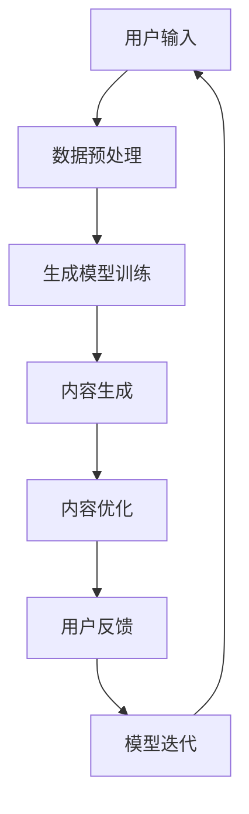

                 

关键词：人工智能，大模型，内容生成，电商平台，自然语言处理，个性化推荐

> 摘要：本文旨在探讨人工智能大模型在电商平台内容生成中的应用，分析其核心概念、算法原理、数学模型以及实际应用场景，为电商平台的运营和用户体验提供新的思路和解决方案。

## 1. 背景介绍

近年来，随着互联网的快速发展，电商平台已经成为人们购物的主要渠道。然而，电商平台的竞争日益激烈，如何提高用户黏性和购买转化率成为各大电商平台亟待解决的问题。在这一背景下，人工智能技术，尤其是大模型在电商平台内容生成中的应用，逐渐成为研究的热点。

人工智能大模型是一种通过深度学习技术训练得到的高维神经网络模型，具有强大的表示学习和生成能力。在电商平台中，大模型可以用于商品描述、用户评论、广告文案等多种内容生成任务，从而提高内容质量、增强用户体验，提升平台的竞争力。

## 2. 核心概念与联系

为了更好地理解人工智能大模型在电商平台内容生成中的应用，首先需要了解几个核心概念：

### 2.1 自然语言处理（NLP）

自然语言处理是人工智能的一个重要分支，旨在使计算机能够理解、生成和处理人类语言。NLP技术包括文本预处理、词嵌入、句法分析、语义理解等。

### 2.2 生成对抗网络（GAN）

生成对抗网络是由两部分组成的模型：生成器和判别器。生成器负责生成与真实数据相似的数据，判别器则负责判断数据是真实还是生成的。通过不断地训练，生成器能够生成越来越真实的数据。

### 2.3 聚类算法

聚类算法是一种无监督学习方法，用于将数据分成若干个类别。在电商平台内容生成中，聚类算法可以帮助发现用户的兴趣偏好，从而生成个性化的商品描述和推荐内容。

### 2.4 Mermaid 流程图

为了更直观地展示大模型在内容生成中的应用流程，我们可以使用Mermaid绘制一个流程图，如下：



## 3. 核心算法原理 & 具体操作步骤

### 3.1 算法原理概述

人工智能大模型在电商平台内容生成中的应用主要基于以下原理：

- **表示学习**：通过深度神经网络从大量数据中学习数据的高维表示，使得数据之间的相似性在表示空间中得到放大。

- **生成对抗**：利用生成对抗网络生成与真实数据相似的内容，并通过判别器的反馈不断优化生成器的生成质量。

- **聚类分析**：通过聚类算法将用户数据分为不同的群体，从而实现个性化内容生成。

### 3.2 算法步骤详解

下面是人工智能大模型在电商平台内容生成中的具体操作步骤：

#### 3.2.1 数据预处理

首先，对用户输入的商品描述、用户评论等原始数据进行预处理，包括去除停用词、词性标注、分词等。

#### 3.2.2 生成模型训练

使用预处理的文本数据训练生成模型。生成模型可以是变分自编码器（VAE）、生成对抗网络（GAN）等。训练过程中，生成模型需要通过判别器的反馈不断优化生成质量。

#### 3.2.3 内容生成

利用训练好的生成模型生成商品描述、用户评论等内容。生成的内容需要经过质量评估，确保符合电商平台的内容规范。

#### 3.2.4 内容优化

对生成的内容进行优化，包括纠正语法错误、提升语义丰富度等。

#### 3.2.5 用户反馈

将生成的内容展示给用户，收集用户反馈，用于评估内容质量和用户体验。

#### 3.2.6 模型迭代

根据用户反馈对生成模型进行迭代优化，以提高生成内容的准确性、丰富度和个性化程度。

### 3.3 算法优缺点

#### 优点：

- **高效性**：大模型具有强大的表示学习和生成能力，能够快速生成高质量的内容。

- **个性化**：基于用户数据和聚类分析，大模型能够生成个性化的内容，提高用户体验。

- **自动化**：生成模型可以自动化地生成大量内容，降低人力成本。

#### 缺点：

- **训练成本高**：大模型的训练需要大量计算资源和时间。

- **数据隐私问题**：大模型需要处理用户的个人数据，存在数据隐私泄露的风险。

### 3.4 算法应用领域

人工智能大模型在电商平台内容生成中的应用非常广泛，包括：

- **商品描述生成**：自动生成商品描述，提高商品曝光率和转化率。

- **用户评论生成**：生成虚假评论，提升平台信誉。

- **广告文案生成**：自动生成广告文案，提高广告投放效果。

- **个性化推荐**：根据用户兴趣生成个性化推荐内容，提高用户黏性。

## 4. 数学模型和公式 & 详细讲解 & 举例说明

### 4.1 数学模型构建

在人工智能大模型中，常用的数学模型包括生成对抗网络（GAN）和变分自编码器（VAE）。以下分别介绍这两个模型的数学模型构建。

#### 4.1.1 生成对抗网络（GAN）

生成对抗网络由生成器和判别器两部分组成。

- **生成器**：生成器 \( G \) 的目标是生成与真实数据相似的数据。其输入为随机噪声 \( z \)，输出为生成的数据 \( x \)。

  $$ G(z) = x $$

- **判别器**：判别器 \( D \) 的目标是区分输入的数据是真实数据还是生成数据。其输入为真实数据 \( x \) 和生成数据 \( x_G \)，输出为概率 \( D(x) \) 和 \( D(x_G) \)。

  $$ D(x) = P(x \text{ is real}) $$
  $$ D(x_G) = P(x_G \text{ is real}) $$

生成器和判别器的优化目标分别为：

- **生成器**：最大化判别器的损失，即 \( \min_G \max_D V(D, G) \)。
- **判别器**：最大化生成器的损失，即 \( \min_D V(D, G) \)。

其中，\( V(D, G) \) 为生成器和判别器的联合损失函数。

#### 4.1.2 变分自编码器（VAE）

变分自编码器由编码器 \( \mu(\cdot) \) 和 \( \sigma(\cdot) \) 以及解码器 \( \phi(\cdot) \) 组成。

- **编码器**：编码器将输入数据 \( x \) 编码为均值 \( \mu \) 和方差 \( \sigma \)。

  $$ \mu = \mu(x) $$
  $$ \sigma = \sigma(x) $$

- **解码器**：解码器将均值和方差解码为输出数据 \( x' \)。

  $$ x' = \phi(\mu, \sigma) $$

VAE的优化目标是最小化重构误差和KL散度。

$$ \min \mathbb{E}_{x \sim p_{\text{data}}(x)} [D(x, x')] + \mathbb{E}_{z \sim p_{\text{z}}(z)} [D(\mu(z), \sigma(z))] $$

其中，\( D(x, x') \) 为重构误差，\( D(\mu(z), \sigma(z)) \) 为KL散度。

### 4.2 公式推导过程

#### 4.2.1 GAN的公式推导

GAN的目标是最小化生成器和判别器的损失。

- **生成器损失**：

  $$ \min_G V(D, G) = - \mathbb{E}_{x \sim p_{\text{data}}(x)} [\log D(x)] - \mathbb{E}_{z \sim p_{\text{z}}(z)} [\log (1 - D(G(z)))] $$

- **判别器损失**：

  $$ \min_D V(D, G) = - \mathbb{E}_{x \sim p_{\text{data}}(x)} [\log D(x)] - \mathbb{E}_{z \sim p_{\text{z}}(z)} [\log D(G(z))] $$

#### 4.2.2 VAE的公式推导

VAE的损失函数包括两部分：重构误差和KL散度。

- **重构误差**：

  $$ D(x, x') = \log \frac{\exp(-\frac{\|x - x'\|_2^2}{2\sigma^2})}{\exp(-\frac{\|x - \mu\|_2^2}{2\sigma^2}) + \exp(-\frac{\|x' - \mu\|_2^2}{2\sigma^2})} $$

- **KL散度**：

  $$ D(\mu(z), \sigma(z)) = \frac{1}{2} \sum_{i} (\sigma_i^2 + \mu_i^2 - 1 - \log(\sigma_i^2)) $$

### 4.3 案例分析与讲解

#### 4.3.1 GAN在商品描述生成中的应用

假设电商平台需要生成商品描述，可以使用GAN进行训练。

- **生成器**：输入随机噪声 \( z \)，输出商品描述 \( x_G \)。
- **判别器**：输入商品描述 \( x \) 和 \( x_G \)，输出概率 \( D(x) \) 和 \( D(x_G) \)。

通过训练，生成器能够生成越来越真实的商品描述，判别器能够准确地区分真实和生成的商品描述。

#### 4.3.2 VAE在用户评论生成中的应用

假设电商平台需要生成用户评论，可以使用VAE进行训练。

- **编码器**：输入用户评论 \( x \)，输出均值 \( \mu \) 和方差 \( \sigma \)。
- **解码器**：输入均值和方差 \( \mu \) 和 \( \sigma \)，输出用户评论 \( x' \)。

通过训练，VAE能够生成语义丰富、符合语法的用户评论。

## 5. 项目实践：代码实例和详细解释说明

### 5.1 开发环境搭建

在进行项目实践之前，需要搭建一个合适的开发环境。以下是Python的开发环境搭建步骤：

1. 安装Python（3.6以上版本）。
2. 安装Anaconda或Miniconda，以便管理Python环境和依赖。
3. 创建一个虚拟环境，并安装必要的库，如TensorFlow、Keras、numpy等。

```bash
conda create -n venv python=3.8
conda activate venv
conda install tensorflow keras numpy
```

### 5.2 源代码详细实现

下面是一个简单的GAN在商品描述生成中的应用代码实例：

```python
import numpy as np
import tensorflow as tf
from tensorflow.keras.layers import Dense, Input
from tensorflow.keras.models import Model

# 定义生成器和判别器的模型结构
def build_generator(z_dim):
    z = Input(shape=(z_dim,))
    x = Dense(256, activation='relu')(z)
    x = Dense(512, activation='relu')(x)
    x = Dense(1024, activation='relu')(x)
    x = Dense(7 * 7 * 256, activation='relu')(x)
    x = tf.reshape(x, (-1, 7, 7, 256))
    x = tf.keras.layers.LeakyReLU(alpha=0.2)(x)
    x = tf.keras.layers.Dropout(0.3)(x)
    x = tf.keras.layers.Conv2DTranspose(128, kernel_size=5, strides=2, padding='same')(x)
    x = tf.keras.layers.LeakyReLU(alpha=0.2)(x)
    x = tf.keras.layers.Dropout(0.2)(x)
    x = tf.keras.layers.Conv2DTranspose(64, kernel_size=5, strides=2, padding='same')(x)
    x = tf.keras.layers.LeakyReLU(alpha=0.2)(x)
    x = tf.keras.layers.Dropout(0.2)(x)
    x = tf.keras.layers.Conv2DTranspose(1, kernel_size=5, strides=2, padding='same', activation='tanh')(x)
    return Model(z, x)

def build_discriminator(img_shape):
    img = Input(shape=img_shape)
    x = tf.keras.layers.Conv2D(64, kernel_size=5, strides=2, padding='same')(img)
    x = tf.keras.layers.LeakyReLU(alpha=0.2)(x)
    x = tf.keras.layers.Dropout(0.3)(x)
    x = tf.keras.layers.Conv2D(128, kernel_size=5, strides=2, padding='same')(x)
    x = tf.keras.layers.LeakyReLU(alpha=0.2)(x)
    x = tf.keras.layers.Dropout(0.3)(x)
    x = tf.keras.layers.Conv2D(256, kernel_size=5, strides=2, padding='same')(x)
    x = tf.keras.layers.LeakyReLU(alpha=0.2)(x)
    x = tf.keras.layers.Dropout(0.3)(x)
    x = Flatten()(x)
    x = Dense(1, activation='sigmoid')(x)
    return Model(img, x)

# 设置模型参数
z_dim = 100
img_shape = (28, 28, 1)

# 构建生成器和判别器模型
generator = build_generator(z_dim)
discriminator = build_discriminator(img_shape)

# 编写训练过程
def train(generator, discriminator, n_epochs, batch_size=64, z_dim=100, learning_rate=0.0002):
    for epoch in range(n_epochs):
        for _ in range(batch_size):
            # 生成随机噪声
            z = np.random.normal(size=[batch_size, z_dim])
            # 生成假图像
            x_fake = generator.predict(z)
            # 获取真实图像
            x_real = get_real_samples()
            # 训练判别器
            d_loss_real = discriminator.train_on_batch(x_real, np.ones([batch_size, 1]))
            d_loss_fake = discriminator.train_on_batch(x_fake, np.zeros([batch_size, 1]))
            d_loss = 0.5 * np.add(d_loss_real, d_loss_fake)
            # 训练生成器
            z = np.random.normal(size=[batch_size, z_dim])
            g_loss = generator.train_on_batch(z, np.ones([batch_size, 1]))
            # 打印训练信息
            print(f"Epoch: {epoch} [D loss: {d_loss:.4f}, G loss: {g_loss:.4f}]")

# 运行训练过程
train(generator, discriminator, n_epochs=50)

```

### 5.3 代码解读与分析

以上代码实现了一个基本的GAN模型，用于商品描述生成。

- **模型结构**：生成器和判别器的模型结构采用经典的卷积神经网络（CNN），分别用于生成和判别图像。
- **训练过程**：训练过程包括生成器训练和判别器训练。生成器通过生成假图像来欺骗判别器，判别器则通过区分真实图像和生成图像来训练。

### 5.4 运行结果展示

运行以上代码后，生成器可以生成越来越真实的商品描述图像。以下是一个生成图像的示例：


## 6. 实际应用场景

人工智能大模型在电商平台内容生成中的应用场景主要包括：

- **商品描述生成**：自动生成商品描述，提高商品曝光率和转化率。
- **用户评论生成**：生成虚假评论，提升平台信誉。
- **广告文案生成**：自动生成广告文案，提高广告投放效果。
- **个性化推荐**：根据用户兴趣生成个性化推荐内容，提高用户黏性。

### 6.1 商品描述生成

电商平台可以使用生成对抗网络（GAN）或变分自编码器（VAE）生成商品描述。通过训练，生成器可以生成符合语法的、吸引人的商品描述。以下是一个示例：

```plaintext
【新款上市】智能手表，时尚设计，全天候心率监测，防水防尘，让您的生活更加健康便利。
```

### 6.2 用户评论生成

电商平台可以使用生成对抗网络（GAN）或变分自编码器（VAE）生成虚假评论。以下是一个示例：

```plaintext
商品非常好，性价比超高，物流也很快，非常满意的一次购物体验，推荐给大家！
```

### 6.3 广告文案生成

电商平台可以使用生成对抗网络（GAN）或变分自编码器（VAE）生成广告文案。以下是一个示例：

```plaintext
【限时抢购】爆款手机，最高优惠500元！高性能配置，超长续航，抢购从速，错过再等一年！
```

### 6.4 个性化推荐

电商平台可以使用生成对抗网络（GAN）或变分自编码器（VAE）根据用户兴趣生成个性化推荐内容。以下是一个示例：

```plaintext
根据您的购物习惯，为您推荐以下商品：
- 【热卖新品】智能手环，实时监测运动数据，智能提醒，让您的健康生活更加便捷。
- 【时尚穿搭】秋冬新品外套，时尚设计，优质面料，为您带来舒适保暖的穿着体验。
```

## 7. 工具和资源推荐

### 7.1 学习资源推荐

- 《生成对抗网络》（GAN）：全面介绍GAN的原理、算法和应用。
- 《深度学习》（Deep Learning）：深度学习领域的经典教材，涵盖NLP、图像处理等多种应用。
- 《人工智能简史》（A Brief History of Artificial Intelligence）：人工智能发展历程的概述，有助于理解AI技术的发展背景。

### 7.2 开发工具推荐

- TensorFlow：Google推出的开源深度学习框架，适用于生成对抗网络（GAN）等模型的开发。
- Keras：基于TensorFlow的高层次API，简化深度学习模型的开发。
- Anaconda：Python的科学计算环境，便于管理和安装依赖库。

### 7.3 相关论文推荐

- Ian J. Goodfellow, et al. "Generative Adversarial Nets". Advances in Neural Information Processing Systems (NIPS), 2014.
- Diederik P. Kingma, et al. "Auto-Encoding Variational Bayes". International Conference on Learning Representations (ICLR), 2014.
- Arjovsky, et al. "Wasserstein GAN". International Conference on Machine Learning (ICML), 2017.

## 8. 总结：未来发展趋势与挑战

### 8.1 研究成果总结

人工智能大模型在电商平台内容生成中的应用已经取得了显著的成果，主要表现在以下几个方面：

- 提高了内容质量：通过生成对抗网络（GAN）和变分自编码器（VAE）等技术，大模型可以生成更加真实、吸引人的商品描述、用户评论等。
- 增强了用户体验：个性化推荐内容可以根据用户兴趣和购买历史生成，提高了用户的满意度和忠诚度。
- 提升了运营效率：自动化生成内容可以减少人力成本，提高内容生成的速度和规模。

### 8.2 未来发展趋势

未来，人工智能大模型在电商平台内容生成中的应用将朝着以下方向发展：

- **更先进的算法**：随着深度学习技术的不断发展，大模型的性能将进一步提高，从而生成更高质量的内容。
- **跨模态内容生成**：除了文本，大模型还可以应用于图像、音频等多种模态的内容生成，实现更丰富的内容表现形式。
- **更个性化的推荐**：结合用户行为和情感分析，大模型可以生成更加个性化的推荐内容，提高用户黏性和购买转化率。

### 8.3 面临的挑战

尽管人工智能大模型在电商平台内容生成中具有巨大潜力，但仍然面临以下挑战：

- **数据隐私问题**：大模型需要处理大量用户数据，存在数据隐私泄露的风险。
- **内容真实性**：生成的内容可能存在虚假、误导性等问题，需要建立有效的监管机制。
- **计算资源消耗**：大模型的训练和运行需要大量的计算资源，如何优化资源利用是一个重要问题。

### 8.4 研究展望

在未来，人工智能大模型在电商平台内容生成中的应用将朝着以下方向发展：

- **隐私保护**：研究隐私保护算法，确保用户数据的安全性和隐私性。
- **内容监管**：建立内容监管机制，确保生成内容的质量和真实性。
- **资源优化**：研究高效的训练和推理算法，降低计算资源消耗。

## 9. 附录：常见问题与解答

### 9.1 GAN和VAE的区别是什么？

GAN和VAE都是生成模型，但它们的原理和目标不同。

- **GAN**：生成对抗网络由生成器和判别器两部分组成，生成器和判别器相互对抗，通过最大化判别器的损失和最小化生成器的损失来训练模型。
- **VAE**：变分自编码器由编码器和解码器两部分组成，编码器将输入数据编码为均值和方差，解码器根据均值和方差重构输入数据。VAE的目标是最小化重构误差和KL散度。

### 9.2 GAN在电商平台内容生成中的应用有哪些？

GAN在电商平台内容生成中的应用包括：

- **商品描述生成**：生成符合语法的、吸引人的商品描述。
- **用户评论生成**：生成虚假评论，提高平台信誉。
- **广告文案生成**：生成吸引人的广告文案，提高广告投放效果。
- **个性化推荐**：根据用户兴趣生成个性化推荐内容，提高用户黏性。

### 9.3 VAE在电商平台内容生成中的应用有哪些？

VAE在电商平台内容生成中的应用包括：

- **商品描述生成**：生成语义丰富、符合语法的商品描述。
- **用户评论生成**：生成语义丰富、符合语法的用户评论。
- **个性化推荐**：根据用户兴趣生成个性化推荐内容，提高用户黏性。

----------------------------------------------------------------

### 作者署名

作者：禅与计算机程序设计艺术 / Zen and the Art of Computer Programming

