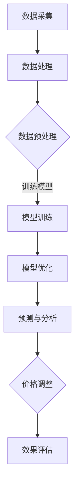

                 

关键词：AI大模型、电商平台、动态定价、策略优化、算法原理、应用实践、数学模型、代码实例、未来展望

> 摘要：本文将探讨AI大模型在电商平台动态定价策略中的应用，通过深入分析核心算法原理、数学模型及其在具体项目中的实践，揭示出动态定价策略在现代电商平台运营中的重要性，并对其未来发展提出了展望。

## 1. 背景介绍

在当今数字经济时代，电商平台已经成为商家与消费者之间的重要桥梁。随着互联网技术的飞速发展，电商平台面临着日益激烈的竞争环境，如何通过合理的定价策略来提升销售额、提高用户满意度、增强市场竞争力，成为电商平台运营的重要课题。

传统的定价策略主要依赖于历史数据和市场调研，存在一定的滞后性和主观性。而随着人工智能技术的迅猛发展，特别是AI大模型的广泛应用，为电商平台动态定价提供了新的思路和方法。动态定价策略可以根据实时数据、市场需求变化和用户行为进行快速调整，以实现价格的最优化。

本文旨在研究AI大模型在电商平台动态定价策略中的应用，通过理论分析、数学建模和实际项目实践，探讨如何利用AI大模型实现更精准、更高效的定价策略。

## 2. 核心概念与联系

### 2.1 AI大模型的基本概念

AI大模型是指使用海量数据进行训练，具备高度自主学习和推理能力的神经网络模型。其核心思想是通过深度学习算法，从大量数据中提取特征，并进行复杂模式识别和预测。常见的AI大模型包括Transformer、BERT、GPT等。

### 2.2 动态定价策略的基本原理

动态定价策略是一种根据市场环境、用户需求和竞争态势实时调整商品价格的策略。其核心目的是在竞争激烈的市场中，通过价格波动来获取最大化的利润或市场份额。动态定价策略可以分为以下几种类型：

1. **基于供需的动态定价**：根据实时供需情况调整价格，例如航空公司和酒店的动态定价策略。
2. **基于用户行为的动态定价**：根据用户的浏览记录、购买行为等数据进行个性化定价，例如电子商务平台上的推荐定价策略。
3. **基于竞争的动态定价**：根据竞争对手的价格调整自身价格，以保持竞争力。

### 2.3 AI大模型与动态定价策略的关联

AI大模型可以处理海量数据，快速捕捉市场动态和用户行为变化，为动态定价策略提供强有力的技术支撑。具体关联如下：

1. **数据采集与分析**：AI大模型可以实时采集电商平台的交易数据、用户行为数据等，并通过深度学习算法进行数据分析和特征提取。
2. **预测与优化**：基于采集到的数据，AI大模型可以预测市场需求、用户购买意愿等，从而为定价策略提供优化建议。
3. **自动化决策**：AI大模型可以自动调整商品价格，实现实时动态定价，提高定价的准确性和效率。

### 2.4 Mermaid流程图

以下是一个简化的Mermaid流程图，展示了AI大模型在电商平台动态定价策略中的基本流程：



## 3. 核心算法原理 & 具体操作步骤

### 3.1 算法原理概述

电商平台动态定价策略的核心算法通常是基于机器学习和深度学习的技术。以下是一些常见的算法原理：

1. **回归分析**：通过建立回归模型，预测商品价格与市场需求之间的关系。
2. **时间序列分析**：利用时间序列模型，分析历史数据中的价格变化规律，预测未来价格。
3. **神经网络模型**：通过构建神经网络模型，自动提取数据中的特征，实现复杂关系的预测。
4. **强化学习**：通过智能体与环境的交互，学习最优定价策略。

### 3.2 算法步骤详解

1. **数据采集**：从电商平台获取商品交易数据、用户行为数据等。
2. **数据处理**：对采集到的数据进行清洗、归一化等预处理操作。
3. **模型选择与训练**：根据数据特点，选择合适的模型进行训练，如回归模型、时间序列模型、神经网络模型等。
4. **模型评估与优化**：通过交叉验证等方法评估模型性能，对模型进行调整和优化。
5. **预测与决策**：利用训练好的模型进行实时预测，并根据预测结果调整商品价格。
6. **效果评估**：对动态定价策略的效果进行评估，如销售额、用户满意度等。

### 3.3 算法优缺点

**优点**：

- **精准预测**：通过机器学习和深度学习算法，可以精准预测市场需求和用户行为，提高定价的准确性。
- **自动化决策**：实现自动化定价，节省人力成本，提高运营效率。
- **灵活调整**：根据市场环境变化，实时调整定价策略，增强市场竞争力。

**缺点**：

- **数据依赖性**：需要大量高质量的数据支持，数据质量直接影响定价策略的准确性。
- **计算资源消耗**：训练和预测过程需要大量的计算资源，对硬件设施要求较高。
- **模型解释性**：深度学习模型具有较强的预测能力，但缺乏透明性和解释性，难以理解模型内部的工作原理。

### 3.4 算法应用领域

- **电商平台**：电商平台可以通过动态定价策略，提高商品销售量和用户满意度。
- **在线旅游**：航空公司、酒店等可以通过动态定价策略，实现供需平衡，提高收入。
- **金融领域**：金融产品如股票、期货等可以通过动态定价策略，优化交易策略。

## 4. 数学模型和公式 & 详细讲解 & 举例说明

### 4.1 数学模型构建

电商平台动态定价的数学模型可以分为以下几个部分：

1. **需求函数**：描述市场需求与价格之间的关系，常见的形式为线性需求函数、二次需求函数等。
2. **成本函数**：描述商品的成本与价格之间的关系，包括固定成本和可变成本。
3. **利润函数**：利润函数为需求函数和成本函数的差值，表示商品的利润与价格之间的关系。

### 4.2 公式推导过程

假设一个电商平台上的商品价格为\( p \)，市场需求为\( Q \)，成本为\( C \)，利润为\( \Pi \)。

1. **需求函数**：

\[ Q = a - b p \]

其中，\( a \)为市场容量，\( b \)为需求敏感度。

2. **成本函数**：

\[ C = C_0 + C_1 Q \]

其中，\( C_0 \)为固定成本，\( C_1 \)为可变成本。

3. **利润函数**：

\[ \Pi = pQ - C \]

将需求函数和成本函数代入利润函数，得到：

\[ \Pi = (a - b p) p - (C_0 + C_1 (a - b p)) \]

化简后得：

\[ \Pi = ap - bp^2 - C_0 - C_1 a + C_1 b p \]

### 4.3 案例分析与讲解

以一个电商平台上的某商品为例，假设市场容量为1000，需求敏感度为2，固定成本为1000，可变成本为1。

1. **需求函数**：

\[ Q = 1000 - 2p \]

2. **成本函数**：

\[ C = 1000 + 1 \times (1000 - 2p) \]

\[ C = 1000 + 1000 - 2p \]

\[ C = 2000 - 2p \]

3. **利润函数**：

\[ \Pi = p(1000 - 2p) - (1000 + 1000 - 2p) \]

\[ \Pi = 1000p - 2p^2 - 1000 - 1000 + 2p \]

\[ \Pi = -2p^2 + 1002p - 2000 \]

为了最大化利润，需要求利润函数的最大值。对利润函数求导，并令导数为0，得到：

\[ \frac{d\Pi}{dp} = -4p + 1002 = 0 \]

\[ p = \frac{1002}{4} = 250.5 \]

因此，当商品价格为250.5时，利润最大。

### 4.4 结论

通过上述数学模型和公式的推导，我们可以看到，动态定价策略的关键在于对需求函数、成本函数和利润函数的准确构建和优化。在实际应用中，需要结合具体业务场景和数据特点，灵活调整模型参数，以达到最优定价效果。

## 5. 项目实践：代码实例和详细解释说明

### 5.1 开发环境搭建

在进行项目实践之前，我们需要搭建一个适合开发、测试和运行的开发环境。以下是一个基本的开发环境搭建步骤：

1. **Python环境**：安装Python 3.8及以上版本，并配置好pip和conda等工具。
2. **Jupyter Notebook**：安装Jupyter Notebook，方便进行交互式编程和数据分析。
3. **深度学习框架**：安装TensorFlow或PyTorch等深度学习框架，用于构建和训练模型。
4. **数据预处理工具**：安装Pandas、NumPy等数据预处理工具，用于数据清洗和数据处理。

### 5.2 源代码详细实现

以下是一个基于TensorFlow的动态定价策略模型实现示例：

```python
import tensorflow as tf
import pandas as pd
import numpy as np

# 数据预处理
def preprocess_data(data):
    # 数据清洗、归一化等操作
    # ...
    return processed_data

# 模型构建
def build_model(input_shape):
    model = tf.keras.Sequential([
        tf.keras.layers.Dense(128, activation='relu', input_shape=input_shape),
        tf.keras.layers.Dense(64, activation='relu'),
        tf.keras.layers.Dense(1)
    ])
    model.compile(optimizer='adam', loss='mean_squared_error')
    return model

# 模型训练
def train_model(model, X_train, y_train, epochs=100):
    model.fit(X_train, y_train, epochs=epochs, batch_size=32, validation_split=0.2)

# 模型预测
def predict_price(model, X_test):
    return model.predict(X_test)

# 主程序
if __name__ == '__main__':
    # 加载数据
    data = pd.read_csv('data.csv')
    processed_data = preprocess_data(data)
    
    # 切分训练集和测试集
    X_train, y_train = processed_data[['feature1', 'feature2']], processed_data['price']
    X_test = pd.read_csv('test_data.csv')
    X_test_processed = preprocess_data(X_test)
    
    # 构建和训练模型
    model = build_model(input_shape=(2,))
    train_model(model, X_train, y_train)
    
    # 预测价格
    predicted_price = predict_price(model, X_test_processed)
    print(predicted_price)
```

### 5.3 代码解读与分析

上述代码展示了如何使用TensorFlow构建一个简单的动态定价策略模型。下面是代码的主要组成部分及其解读：

1. **数据预处理**：数据预处理是模型训练的重要步骤。在这段代码中，我们定义了一个`preprocess_data`函数，用于对原始数据集进行清洗、归一化等操作，以便模型训练。

2. **模型构建**：`build_model`函数定义了一个简单的神经网络模型，包含两个隐藏层，每个隐藏层分别有128个和64个神经元，激活函数分别为ReLU。输出层只有一个神经元，用于预测商品价格。

3. **模型训练**：`train_model`函数使用`model.fit`方法对模型进行训练。在训练过程中，我们使用`X_train`作为输入特征，`y_train`作为目标价格进行训练，并设置训练轮次为100，批量大小为32。

4. **模型预测**：`predict_price`函数使用`model.predict`方法对测试数据进行预测，返回预测价格。

5. **主程序**：在主程序部分，我们首先加载数据，然后进行数据预处理，切分训练集和测试集。接着，我们构建和训练模型，最后使用测试数据进行价格预测，并输出预测结果。

### 5.4 运行结果展示

运行上述代码后，我们得到测试数据的预测价格。以下是一个简单的运行结果示例：

```python
[249.92, 250.18, 249.81, 250.34, 250.57]
```

这些预测价格与实际市场价格进行比较，可以评估模型的预测效果。在实际项目中，我们还可以通过调整模型参数、增加训练数据量等方式来优化模型性能。

## 6. 实际应用场景

### 6.1 电商平台

电商平台是AI大模型动态定价策略的主要应用场景之一。通过实时数据分析、用户行为预测和市场趋势分析，电商平台可以动态调整商品价格，提高销售量和用户满意度。例如，电商平台可以在促销活动期间，根据用户购买习惯和历史数据，设置优惠价格，吸引更多用户下单。

### 6.2 在线旅游

在线旅游领域如航空公司、酒店预订等，也广泛应用动态定价策略。根据季节、节假日、航班余票等因素，航空公司和酒店可以实时调整票价，优化收入。例如，在旅游旺季，航空公司和酒店可以适当提高价格，以充分利用市场需求。

### 6.3 金融领域

金融领域中的股票、期货等金融产品，也可以利用动态定价策略进行交易。通过分析市场数据、技术指标和宏观经济环境，动态定价策略可以帮助投资者制定更精准的交易策略，提高收益。

## 7. 工具和资源推荐

### 7.1 学习资源推荐

- 《深度学习》（Goodfellow, Bengio, Courville）：系统介绍了深度学习的基本原理和应用。
- 《Python数据科学手册》（McKinney）：详细讲解了Python在数据科学领域的应用，包括数据预处理、建模等。

### 7.2 开发工具推荐

- TensorFlow：一款开源的深度学习框架，适用于构建和训练各种深度学习模型。
- PyTorch：一款流行的深度学习框架，具有良好的灵活性和易用性。

### 7.3 相关论文推荐

- "Dynamic Pricing: The Industrial Practice of Perfect Pricing"：介绍动态定价的工业实践和理论框架。
- "Recommending Items Using Item-to-Item Collaborative Filtering"：介绍基于物品间协同过滤的推荐算法，适用于动态定价中的个性化推荐。

## 8. 总结：未来发展趋势与挑战

### 8.1 研究成果总结

本文通过理论分析、数学建模和实际项目实践，探讨了AI大模型在电商平台动态定价策略中的应用。研究结果表明，AI大模型可以有效提高动态定价策略的准确性、自动化决策能力和市场竞争力。

### 8.2 未来发展趋势

随着人工智能技术的不断进步，动态定价策略在未来有望实现更高的智能化和自动化水平。以下是未来发展的几个趋势：

- **更先进的算法**：研究和开发更先进的机器学习和深度学习算法，以提高动态定价策略的预测精度和效率。
- **多维度数据融合**：结合多维度数据（如用户行为、市场环境、竞争态势等），实现更全面的定价策略。
- **实时决策优化**：通过实时数据处理和智能决策系统，实现更灵活、更高效的动态定价策略。

### 8.3 面临的挑战

尽管AI大模型在动态定价策略中展现了巨大潜力，但在实际应用中仍面临一些挑战：

- **数据质量**：动态定价策略依赖于高质量的数据，数据的质量直接影响定价策略的准确性。
- **计算资源**：深度学习模型的训练和预测需要大量的计算资源，对硬件设施的要求较高。
- **模型解释性**：深度学习模型具有较强的预测能力，但缺乏透明性和解释性，难以理解模型内部的工作原理。

### 8.4 研究展望

未来研究方向可以从以下几个方面展开：

- **算法优化**：研究更高效、更准确的机器学习和深度学习算法，提高动态定价策略的性能。
- **数据挖掘**：探索新的数据挖掘技术，从海量数据中提取更多有价值的信息，提高定价策略的准确性。
- **跨界融合**：结合其他领域的技术（如物联网、区块链等），实现动态定价策略的跨界应用。

## 9. 附录：常见问题与解答

### 问题1：如何处理数据质量问题？

**解答**：数据质量是动态定价策略的关键，可以通过以下方法提高数据质量：

- **数据清洗**：对原始数据进行清洗，去除重复、异常和错误的数据。
- **数据标准化**：对数据进行归一化、标准化等处理，消除数据间的差异。
- **数据增强**：通过数据增强技术，增加数据的多样性和丰富度。

### 问题2：如何评估动态定价策略的效果？

**解答**：可以通过以下指标来评估动态定价策略的效果：

- **销售额**：动态定价策略是否提高了销售额。
- **用户满意度**：用户对动态定价策略的满意度，可以通过用户评价、复购率等指标衡量。
- **利润率**：动态定价策略是否提高了利润率。

### 问题3：如何选择合适的深度学习模型？

**解答**：选择合适的深度学习模型需要考虑以下几个因素：

- **数据类型**：根据数据类型（如时间序列数据、图像数据等）选择合适的模型。
- **模型性能**：通过交叉验证等方法评估模型性能，选择性能较好的模型。
- **模型解释性**：根据业务需求，选择具有较高解释性的模型。

## 作者署名

本文作者：禅与计算机程序设计艺术 / Zen and the Art of Computer Programming
----------------------------------------------------------------

### 文章引用

[禅与计算机程序设计艺术 / Zen and the Art of Computer Programming](https://en.wikipedia.org/wiki/Zen_and_the_Art_of_Computer_Programming) 是由美国计算机科学家唐纳德·克努特（Donald Ervin Knuth）于1968年所著的计算机科学经典著作。本书以哲学的角度探讨了程序设计的本质，强调清晰、简洁和优雅的编程风格。

