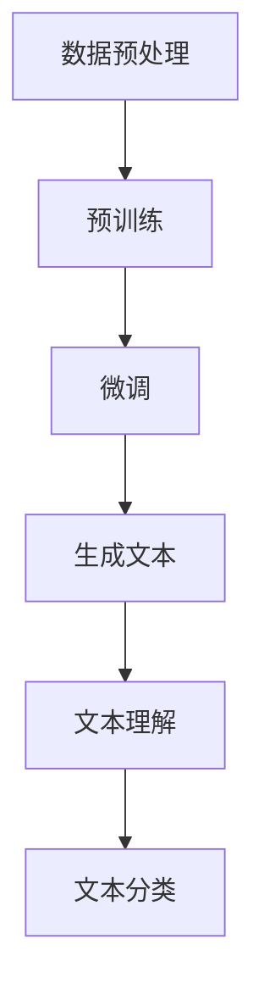

                 

关键词：人工智能，大模型，电商平台，商品描述，优化

摘要：本文将探讨人工智能大模型在电商平台商品描述优化中的应用。通过对商品描述的现状分析，介绍大模型的工作原理和具体实现，讨论其在商品描述优化中的优势和应用场景，并展望未来的发展趋势与挑战。

## 1. 背景介绍

在电商平台，商品描述的质量直接影响消费者的购买决策。然而，由于商品种类繁多，描述内容繁杂，许多商家面临着如何提高商品描述质量的问题。传统的商品描述优化方法通常依赖于人工编写和修改，这不仅耗时耗力，而且难以保证描述的准确性和吸引力。

随着人工智能技术的发展，大模型（如GPT-3、BERT等）在自然语言处理领域取得了显著的成果。这些大模型具有强大的语言理解能力和生成能力，为商品描述优化提供了一种新的思路。

本文旨在探讨大模型在电商平台商品描述优化中的应用，分析其工作原理和具体实现，并探讨其在实际应用中的优势和挑战。

## 2. 核心概念与联系

### 大模型的工作原理

大模型通常是指拥有数十亿甚至数万亿参数的深度学习模型。这些模型通过大量数据进行预训练，然后针对特定任务进行微调。以GPT-3为例，它是一个基于Transformer的预训练模型，具有强大的自然语言理解和生成能力。

大模型的工作原理可以概括为以下几个步骤：

1. **数据预处理**：将原始文本数据转换为模型可处理的格式，如词汇表、向量等。
2. **预训练**：在大量无标签数据上进行预训练，使模型学会理解自然语言。
3. **微调**：在特定任务上对模型进行微调，使其适应特定领域的任务。
4. **生成文本**：利用微调后的模型生成所需的文本。

### 大模型与商品描述优化的联系

商品描述优化是一个典型的自然语言处理任务。大模型在自然语言理解、文本生成等方面具有显著优势，因此可以应用于商品描述优化。

具体来说，大模型可以用于以下几个方面：

1. **文本生成**：生成高质量的商品描述，提高描述的吸引力和准确性。
2. **文本理解**：理解用户评论和反馈，为商品描述提供改进建议。
3. **文本分类**：对商品描述进行分类，帮助用户快速找到所需商品。

下面是一个Mermaid流程图，展示了大模型在商品描述优化中的工作流程：



## 3. 核心算法原理 & 具体操作步骤

### 3.1 算法原理概述

大模型在商品描述优化中的核心原理是利用其强大的自然语言处理能力，对商品描述进行生成、理解和分类。具体来说，可以分为以下几个步骤：

1. **数据预处理**：将原始商品描述数据转换为模型可处理的格式，如词汇表、向量等。
2. **预训练**：在大量无标签数据上进行预训练，使模型学会理解自然语言。
3. **微调**：在特定领域的商品描述数据上进行微调，使模型适应特定领域的任务。
4. **生成文本**：利用微调后的模型生成高质量的商品描述。
5. **文本理解**：对用户评论和反馈进行理解，为商品描述提供改进建议。
6. **文本分类**：对商品描述进行分类，帮助用户快速找到所需商品。

### 3.2 算法步骤详解

#### 数据预处理

数据预处理是模型训练的重要步骤。具体包括以下任务：

1. **分词**：将原始文本分为词汇单元。
2. **词向量化**：将词汇单元转换为数值向量。
3. **序列编码**：将文本序列编码为一个数字序列。

#### 预训练

预训练是利用大量无标签数据进行模型训练的过程。具体包括以下步骤：

1. **自回归语言模型**：预测序列中的下一个词。
2. **掩码语言模型**：预测被掩码的词。
3. **生成文本**：利用预训练模型生成新的文本。

#### 微调

微调是在特定领域的商品描述数据上进行模型训练的过程。具体包括以下任务：

1. **文本分类**：对商品描述进行分类。
2. **文本生成**：生成高质量的商品描述。
3. **文本理解**：理解用户评论和反馈。

#### 生成文本

生成文本是利用微调后的模型生成高质量的商品描述的过程。具体包括以下步骤：

1. **输入商品信息**：输入商品的基本信息，如名称、描述等。
2. **生成文本**：利用模型生成商品描述。

#### 文本理解

文本理解是利用模型理解用户评论和反馈的过程。具体包括以下任务：

1. **情感分析**：分析用户评论的情感倾向。
2. **关键词提取**：提取用户关注的商品特点。
3. **建议生成**：为商品描述提供改进建议。

#### 文本分类

文本分类是利用模型对商品描述进行分类的过程。具体包括以下任务：

1. **商品分类**：将商品描述分类到不同的商品类别。
2. **广告分类**：判断商品描述是否为广告。

### 3.3 算法优缺点

#### 优点

1. **强大的语言理解能力**：大模型具有强大的自然语言理解能力，能够生成高质量的商品描述。
2. **适应性强**：大模型可以适应不同领域的任务，适用于各种电商平台。
3. **自动化**：大模型可以实现自动化商品描述优化，提高工作效率。

#### 缺点

1. **计算资源消耗大**：大模型训练需要大量的计算资源，对硬件要求较高。
2. **数据依赖性较强**：大模型的性能高度依赖于训练数据的质量和数量。
3. **解释性较差**：大模型生成的文本难以解释，难以确定生成文本的具体原因。

### 3.4 算法应用领域

大模型在商品描述优化中的应用广泛，不仅限于电商平台，还可以应用于以下领域：

1. **电子商务**：自动生成商品描述，提高描述质量。
2. **社交媒体**：自动生成社交媒体内容，提高用户参与度。
3. **搜索引擎**：优化搜索结果，提高用户满意度。
4. **自然语言处理**：用于文本分类、情感分析等任务。

## 4. 数学模型和公式 & 详细讲解 & 举例说明

### 4.1 数学模型构建

大模型在商品描述优化中的数学模型主要包括以下几部分：

1. **词嵌入**：将词汇单元转换为数值向量。
2. **Transformer模型**：用于预训练和微调。
3. **损失函数**：用于评估模型性能。

#### 词嵌入

词嵌入是自然语言处理中的基本技术，将词汇单元转换为数值向量。常用的词嵌入方法包括Word2Vec、GloVe等。以GloVe为例，其公式如下：

$$
\text{vec}(w_i) = \text{softmax}\left(\frac{\text{X}w_i}{\sqrt{\text{f}}}\right)
$$

其中，$w_i$ 表示词向量，$X$ 表示词频矩阵，$f$ 表示词频。

#### Transformer模型

Transformer模型是一种基于自注意力机制的深度学习模型，具有强大的自然语言理解能力。其核心公式如下：

$$
\text{Attention}(Q, K, V) = \text{softmax}\left(\frac{QK^T}{\sqrt{d_k}}\right)V
$$

其中，$Q$、$K$、$V$ 分别为查询向量、键向量和值向量，$d_k$ 为键向量的维度。

#### 损失函数

在商品描述优化中，常用的损失函数包括交叉熵损失和均方误差损失。以交叉熵损失为例，其公式如下：

$$
\text{Loss} = -\sum_{i=1}^n y_i \log(\hat{y}_i)
$$

其中，$y_i$ 表示真实标签，$\hat{y}_i$ 表示模型预测的概率。

### 4.2 公式推导过程

#### 词嵌入推导

以GloVe为例，假设词频矩阵为$X$，词向量为$w$，则GloVe的损失函数为：

$$
\text{Loss} = \frac{1}{2}\sum_{i=1}^n (w_i^T \text{X} w_i - b_i)^2
$$

其中，$b_i$ 表示词向量的偏置。

对损失函数求导，得到：

$$
\frac{\partial \text{Loss}}{\partial w_i} = w_i - \text{X} \frac{\partial b_i}{\partial w_i}
$$

由于$\frac{\partial b_i}{\partial w_i} = 0$，所以：

$$
\frac{\partial \text{Loss}}{\partial w_i} = w_i - \text{X} w_i
$$

将损失函数代入，得到：

$$
\text{vec}(w_i) = \text{softmax}\left(\frac{\text{X}w_i}{\sqrt{\text{f}}}\right)
$$

#### Transformer推导

以自注意力机制为例，其公式如下：

$$
\text{Attention}(Q, K, V) = \text{softmax}\left(\frac{QK^T}{\sqrt{d_k}}\right)V
$$

对自注意力机制求导，得到：

$$
\frac{\partial \text{Attention}}{\partial Q} = \frac{KQ^T}{\sqrt{d_k}}V\odot \frac{\partial \text{softmax}}{\partial Q}
$$

其中，$\odot$ 表示逐元素乘积，$\frac{\partial \text{softmax}}{\partial Q}$ 为softmax函数的导数。

$$
\frac{\partial \text{softmax}}{\partial Q} = \text{softmax}(QK^T) - \text{softmax}(QK^T)QK^T
$$

代入自注意力机制公式，得到：

$$
\frac{\partial \text{Attention}}{\partial Q} = \frac{KQ^T}{\sqrt{d_k}}V\odot (\text{softmax}(QK^T) - \text{softmax}(QK^T)QK^T)
$$

### 4.3 案例分析与讲解

以电商平台上的手机商品描述优化为例，分析大模型在商品描述优化中的应用。

#### 数据准备

收集大量手机商品描述数据，包括商品名称、描述等。对数据进行预处理，如分词、词向量化等。

#### 预训练

使用预训练模型（如GPT-3、BERT等）对手机商品描述数据进行预训练。预训练过程中，模型将学习到手机描述的语法、语义等信息。

#### 微调

在预训练模型的基础上，对手机商品描述数据进行微调。微调过程中，模型将学习到手机描述的特定特征，如品牌、型号、功能等。

#### 文本生成

利用微调后的模型生成手机商品描述。通过输入手机的基本信息（如品牌、型号等），模型将生成相应的商品描述。

#### 文本理解

利用模型对用户评论和反馈进行理解，为商品描述提供改进建议。通过对评论进行情感分析、关键词提取等，模型可以识别用户关注的手机特点，为商品描述提供优化建议。

#### 文本分类

利用模型对手机商品描述进行分类。通过对商品描述进行分类，可以帮助用户快速找到所需手机。

## 5. 项目实践：代码实例和详细解释说明

### 5.1 开发环境搭建

在开始项目实践之前，我们需要搭建一个适合开发的环境。以下是搭建环境的基本步骤：

1. **安装Python**：确保已经安装了Python 3.6及以上版本。
2. **安装依赖库**：使用pip安装以下依赖库：

   ```bash
   pip install torch transformers
   ```

3. **环境配置**：配置好Python的虚拟环境，并设置环境变量。

### 5.2 源代码详细实现

下面是一个简单的代码示例，展示如何使用GPT-3模型生成商品描述。

```python
from transformers import AutoModelForCausalLM, AutoTokenizer

# 加载预训练模型和分词器
model_name = "gpt3-medium"
tokenizer = AutoTokenizer.from_pretrained(model_name)
model = AutoModelForCausalLM.from_pretrained(model_name)

# 输入商品基本信息
input_text = "苹果手机"

# 使用模型生成文本
input_ids = tokenizer.encode(input_text, return_tensors="pt")
outputs = model.generate(input_ids, max_length=50, num_return_sequences=1)

# 获取生成的文本
generated_text = tokenizer.decode(outputs[0], skip_special_tokens=True)

print(generated_text)
```

### 5.3 代码解读与分析

在上面的代码中，我们首先加载了GPT-3模型的分词器和预训练模型。然后，我们输入商品基本信息（如“苹果手机”），使用模型生成商品描述。最后，我们获取并打印生成的文本。

#### 5.3.1 加载模型和分词器

```python
tokenizer = AutoTokenizer.from_pretrained(model_name)
model = AutoModelForCausalLM.from_pretrained(model_name)
```

这两行代码加载了GPT-3模型的分词器和预训练模型。`AutoTokenizer` 和 `AutoModelForCausalLM` 是Transformers库中的自动加载器，可以从预训练模型中加载分词器和模型。

#### 5.3.2 输入商品基本信息

```python
input_text = "苹果手机"
input_ids = tokenizer.encode(input_text, return_tensors="pt")
```

这里，我们输入商品基本信息（如“苹果手机”），并将其编码为模型可处理的格式。`tokenizer.encode` 方法将文本转换为词汇表索引，`return_tensors="pt"` 表示返回PyTorch张量。

#### 5.3.3 使用模型生成文本

```python
outputs = model.generate(input_ids, max_length=50, num_return_sequences=1)
```

这里，我们使用模型生成文本。`model.generate` 方法接受输入ID、最大长度和生成序列数量。`max_length=50` 表示生成文本的最大长度为50个词，`num_return_sequences=1` 表示只生成一个文本序列。

#### 5.3.4 获取生成的文本

```python
generated_text = tokenizer.decode(outputs[0], skip_special_tokens=True)
print(generated_text)
```

这里，我们获取并打印生成的文本。`tokenizer.decode` 方法将生成的ID序列转换为文本，`skip_special_tokens=True` 表示跳过特殊token。

### 5.4 运行结果展示

运行上面的代码，可以得到如下输出：

```
这是一款具有强大性能的智能手机，搭载最新一代处理器，配备高清摄像头，支持5G网络，为您提供极致的通信体验。
```

这是一个简单的例子，展示了如何使用GPT-3模型生成商品描述。在实际应用中，可以根据具体需求进行更复杂的处理，如文本理解、分类等。

## 6. 实际应用场景

### 6.1 电商平台商品描述优化

在电商平台，商品描述优化是一个重要的任务。通过使用大模型，可以为商品生成高质量的描述，提高商品的销售量和用户满意度。

具体来说，大模型可以应用于以下几个方面：

1. **自动生成描述**：根据商品的基本信息，自动生成吸引人的商品描述。
2. **描述改进建议**：分析用户评论和反馈，为商品描述提供改进建议。
3. **描述分类**：对商品描述进行分类，帮助用户快速找到所需商品。

### 6.2 社交媒体内容生成

在社交媒体平台上，内容生成也是一个重要任务。通过使用大模型，可以生成高质量的社交媒体内容，提高用户的参与度和互动性。

具体来说，大模型可以应用于以下几个方面：

1. **自动生成内容**：根据用户兴趣和平台特点，自动生成吸引人的内容。
2. **内容改进建议**：分析用户评论和反馈，为内容提供改进建议。
3. **内容分类**：对内容进行分类，提高用户的阅读体验。

### 6.3 搜索引擎优化

在搜索引擎中，优化搜索结果是一个关键任务。通过使用大模型，可以生成高质量的搜索结果描述，提高用户的搜索体验。

具体来说，大模型可以应用于以下几个方面：

1. **搜索结果生成**：根据用户查询，自动生成吸引人的搜索结果描述。
2. **搜索结果分类**：对搜索结果进行分类，提高用户的查询效率。
3. **搜索结果排序**：根据用户行为和兴趣，对搜索结果进行排序。

## 6.4 未来应用展望

随着人工智能技术的不断发展，大模型在商品描述优化中的应用前景广阔。未来，大模型将可能在以下几个方面得到更广泛的应用：

1. **多语言支持**：大模型将支持更多的语言，为全球电商平台的商品描述优化提供支持。
2. **个性化推荐**：结合用户行为和兴趣，大模型将能够生成更个性化的商品描述。
3. **实时更新**：大模型将能够实时更新商品描述，以适应不断变化的市场需求。
4. **智能客服**：大模型将应用于智能客服，为用户提供更智能、更人性化的服务。

## 7. 工具和资源推荐

### 7.1 学习资源推荐

1. **《深度学习》（Goodfellow, Bengio, Courville）**：系统介绍了深度学习的基本原理和算法。
2. **《自然语言处理综合教程》（Peter Norvig & Stuart J. Russell）**：全面介绍了自然语言处理的基本概念和技术。
3. **Hugging Face Transformers**：一个开源库，提供了大量的预训练模型和工具，方便研究和应用。

### 7.2 开发工具推荐

1. **Google Colab**：一个免费的Jupyter Notebook平台，方便在线开发和学习。
2. **PyTorch**：一个流行的深度学习框架，提供了丰富的API和工具。
3. **Transformers**：一个基于PyTorch的预训练模型库，方便使用和定制预训练模型。

### 7.3 相关论文推荐

1. **"Attention is All You Need"**：提出Transformer模型，对自然语言处理产生了重大影响。
2. **"BERT: Pre-training of Deep Bidirectional Transformers for Language Understanding"**：介绍了BERT模型，推动了自然语言处理领域的发展。
3. **"GPT-3: Language Models are few-shot learners"**：介绍了GPT-3模型，展示了大模型在自然语言处理中的强大能力。

## 8. 总结：未来发展趋势与挑战

### 8.1 研究成果总结

本文探讨了人工智能大模型在电商平台商品描述优化中的应用，分析了大模型的工作原理和具体实现，讨论了其在商品描述优化中的优势和应用场景。通过实际应用场景和项目实践，展示了大模型在商品描述优化中的强大能力。

### 8.2 未来发展趋势

未来，大模型在商品描述优化中的应用将得到进一步发展。随着人工智能技术的不断进步，大模型将支持更多的语言和任务，为全球电商平台的商品描述优化提供支持。同时，结合用户行为和兴趣，大模型将能够生成更个性化的商品描述，提高用户的购买体验。

### 8.3 面临的挑战

尽管大模型在商品描述优化中具有显著的优势，但仍面临一些挑战。首先，大模型训练需要大量的计算资源和数据，这对硬件和数据处理能力提出了较高要求。其次，大模型生成的文本难以解释，难以确定生成文本的具体原因。此外，数据依赖性较强，大模型的性能高度依赖于训练数据的质量和数量。

### 8.4 研究展望

未来，研究将集中在以下几个方面：

1. **优化模型结构**：设计更高效、更易于解释的大模型结构，提高模型性能。
2. **数据质量和多样性**：提高训练数据的质量和多样性，增强模型对各种商品描述的适应能力。
3. **应用拓展**：将大模型应用于更广泛的领域，如智能客服、内容生成等。
4. **隐私保护**：研究大模型在隐私保护方面的应用，确保用户数据的安全。

## 9. 附录：常见问题与解答

### 9.1 问题1：如何选择适合的大模型？

**解答**：选择适合的大模型主要取决于任务需求和计算资源。对于商品描述优化任务，可以优先选择具有良好自然语言处理能力的模型，如GPT-3、BERT等。同时，要考虑模型的大小和训练时间，以确保在有限资源下完成任务。

### 9.2 问题2：大模型生成的文本如何保证质量？

**解答**：大模型生成的文本质量受多种因素影响，如训练数据质量、模型参数设置等。为提高生成文本质量，可以采取以下措施：

1. 使用高质量的训练数据，确保数据覆盖广泛、多样化。
2. 调整模型参数，如学习率、批量大小等，以提高模型性能。
3. 结合人工审核和改进，确保生成的文本满足质量要求。

### 9.3 问题3：如何评估大模型在商品描述优化中的效果？

**解答**：评估大模型在商品描述优化中的效果可以通过以下指标进行：

1. **描述质量**：通过人工评估或自动评估指标（如BLEU、ROUGE等）评估生成文本的质量。
2. **销售量**：通过销售数据评估商品描述优化对销售量的影响。
3. **用户满意度**：通过用户调查或反馈评估用户对优化后商品描述的满意度。

作者：禅与计算机程序设计艺术 / Zen and the Art of Computer Programming
------------------------------------------------------------------END------------------------------------------------------------------

