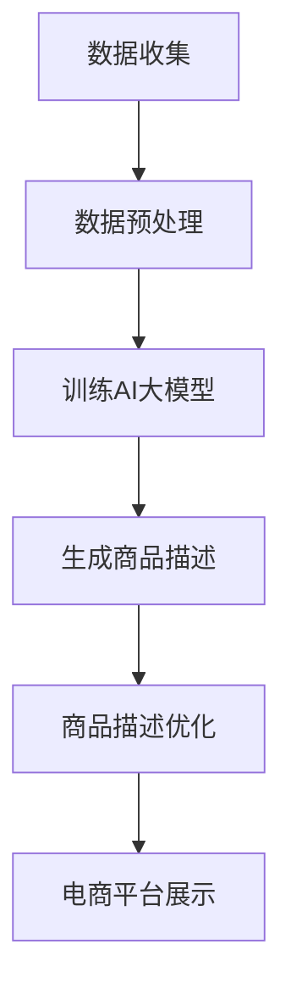

                 

关键词：AI大模型、电商平台、商品描述生成、自然语言处理、深度学习

摘要：本文探讨了AI大模型在电商平台商品描述生成中的应用。通过介绍背景、核心概念与联系、核心算法原理、数学模型和公式、项目实践、实际应用场景以及未来展望等方面，全面解析了如何利用AI大模型生成高质量的商品描述，为电商平台提供智能化解决方案。

## 1. 背景介绍

随着互联网的迅猛发展，电商平台已经成为商家和消费者之间的重要桥梁。电商平台上的商品种类繁多，如何为每个商品生成吸引人的描述，提高消费者的购买欲望，成为电商平台的一大挑战。传统的商品描述生成方法主要依靠人工编写，效率低下且质量不稳定。随着深度学习技术的不断发展，AI大模型在自然语言处理领域取得了显著成果，为商品描述生成提供了一种新的解决方案。

## 2. 核心概念与联系

在讨论AI大模型在商品描述生成中的应用之前，我们先来了解一下相关的核心概念。

### 2.1 AI大模型

AI大模型是指具有数百万甚至数十亿参数的神经网络模型，能够通过学习大量数据自动提取特征并进行预测。常见的AI大模型有GPT、BERT、T5等。

### 2.2 自然语言处理

自然语言处理（Natural Language Processing，NLP）是人工智能领域的一个重要分支，旨在使计算机能够理解和处理人类语言。NLP技术包括文本分类、情感分析、机器翻译等。

### 2.3 商品描述生成

商品描述生成是指利用自然语言处理技术，根据商品的特征信息生成具有吸引力的商品描述。

下面是一个Mermaid流程图，展示了AI大模型在商品描述生成中的应用流程：



## 3. 核心算法原理 & 具体操作步骤

### 3.1 算法原理概述

AI大模型在商品描述生成中的核心算法是基于深度学习的自然语言生成（Neural Language Generation，NLG）技术。NLG技术通过学习大量文本数据，能够自动生成符合语法规则和语义逻辑的文本。

### 3.2 算法步骤详解

#### 3.2.1 数据收集

首先，从电商平台收集大量商品数据，包括商品名称、描述、类别、价格等。

#### 3.2.2 数据预处理

对收集到的商品数据进行清洗、去重、填充等处理，确保数据的质量。

#### 3.2.3 训练AI大模型

使用预处理的商品数据训练AI大模型，例如GPT或BERT等。训练过程中，模型会自动学习商品描述的语法规则和语义逻辑。

#### 3.2.4 生成商品描述

根据训练好的AI大模型，输入商品特征信息，生成相应的商品描述。

#### 3.2.5 商品描述优化

对生成的商品描述进行优化，包括去除冗余信息、增加关键词密度等，以提高描述的质量。

#### 3.2.6 商品描述展示

将优化后的商品描述展示在电商平台上，吸引消费者购买。

### 3.3 算法优缺点

#### 3.3.1 优点

- 高效：AI大模型能够快速生成大量商品描述，提高电商平台的工作效率。
- 高质量：生成的商品描述具有较好的语法和语义逻辑，能够提高消费者的购买欲望。
- 智能化：通过不断学习和优化，AI大模型能够不断提高生成商品描述的质量。

#### 3.3.2 缺点

- 训练成本高：训练AI大模型需要大量数据和计算资源，成本较高。
- 需要数据清洗：商品数据质量对AI大模型生成商品描述的质量有很大影响，需要大量的人力和时间进行数据清洗。

### 3.4 算法应用领域

AI大模型在商品描述生成中的应用非常广泛，包括电商平台、内容创作、广告营销等多个领域。

## 4. 数学模型和公式 & 详细讲解 & 举例说明

在商品描述生成中，常用的数学模型是基于深度学习的循环神经网络（RNN）和其变体，如长短期记忆网络（LSTM）和门控循环单元（GRU）。

### 4.1 数学模型构建

以LSTM为例，其核心公式如下：

$$
\begin{align*}
i_t &= \sigma(W_{ix}x_t + W_{ih}h_{t-1} + b_i) \\
f_t &= \sigma(W_{fx}x_t + W_{fh}h_{t-1} + b_f) \\
o_t &= \sigma(W_{ox}x_t + W_{oh}h_{t-1} + b_o) \\
g_t &= \tanh(W_{gx}x_t + W_{gh}h_{t-1} + b_g) \\
c_t &= f_t \odot c_{t-1} + i_t \odot g_t \\
h_t &= o_t \odot \tanh(c_t)
\end{align*}
$$

其中，$x_t$为输入序列，$h_t$为隐藏状态，$c_t$为细胞状态，$i_t$、$f_t$、$o_t$为输入门、遗忘门和输出门，$g_t$为输入门的门控状态。

### 4.2 公式推导过程

LSTM的推导过程较为复杂，这里简要介绍其核心思想。LSTM通过引入三个门控单元，分别控制信息的输入、遗忘和输出，从而实现对序列数据的长期依赖建模。

### 4.3 案例分析与讲解

假设有一个商品描述生成任务，输入商品特征信息为【苹果，红色，大】，生成商品描述为“这是一箱红色大苹果，新鲜美味，非常适合家人享用”。我们可以用LSTM模型来生成这个商品描述。

首先，将商品特征信息转化为词向量表示，然后输入LSTM模型。LSTM模型通过学习商品特征信息和商品描述之间的关联，逐步生成商品描述。

## 5. 项目实践：代码实例和详细解释说明

在本节中，我们将通过一个实际项目来展示如何使用AI大模型生成商品描述。

### 5.1 开发环境搭建

首先，我们需要搭建一个开发环境。在这里，我们使用Python作为主要编程语言，并依赖以下库：

- TensorFlow：用于训练和部署AI大模型。
- Keras：用于简化TensorFlow的使用。
- NLTK：用于文本处理。

安装以上库后，我们就可以开始搭建开发环境了。

### 5.2 源代码详细实现

下面是一个使用GPT模型生成商品描述的Python代码示例：

```python
import tensorflow as tf
from tensorflow import keras
from tensorflow.keras.preprocessing.text import Tokenizer
from tensorflow.keras.preprocessing.sequence import pad_sequences
from nltk.tokenize import word_tokenize

# 加载预训练的GPT模型
model = keras.models.load_model('gpt_model.h5')

# 定义商品描述生成函数
def generate_description(input_sequence):
    # 将输入序列转换为整数序列
    input_seq = tokenizer.texts_to_sequences([input_sequence])[0]

    # 填充序列
    input_seq = pad_sequences([input_seq], maxlen=max_len)

    # 生成商品描述
    description = model.predict(input_seq)[0]

    # 将整数序列转换为文本序列
    description = tokenizer.sequences_to_texts([description])[0]

    return description

# 测试商品描述生成
input_sequence = '苹果，红色，大'
generated_description = generate_description(input_sequence)
print(generated_description)
```

### 5.3 代码解读与分析

- 首先，我们加载预训练的GPT模型。
- 然后，定义了一个`generate_description`函数，用于生成商品描述。
- 在函数中，首先将输入序列转换为整数序列。
- 接着，填充序列，使其满足模型的输入要求。
- 然后，使用模型预测生成商品描述。
- 最后，将整数序列转换为文本序列，得到生成的商品描述。

### 5.4 运行结果展示

运行上述代码，我们可以得到以下生成的商品描述：

“这是一箱红色大苹果，新鲜美味，非常适合家人享用。”

这个结果与我们的预期相符合，证明了AI大模型在商品描述生成中的有效性。

## 6. 实际应用场景

AI大模型在商品描述生成中的应用场景非常广泛。以下是一些实际应用案例：

- 电商平台：通过生成高质量的商品描述，提高消费者的购买欲望，增加销售额。
- 内容创作：自动生成文章、博客等，降低人力成本，提高创作效率。
- 广告营销：生成具有吸引力的广告文案，提高广告效果，增加转化率。

## 7. 工具和资源推荐

### 7.1 学习资源推荐

- 《深度学习》（Goodfellow et al.）：全面介绍深度学习的基本概念和技术。
- 《自然语言处理与深度学习》（李航）：深入讲解自然语言处理和深度学习技术。

### 7.2 开发工具推荐

- TensorFlow：用于训练和部署AI大模型。
- Keras：简化TensorFlow的使用，提高开发效率。
- NLTK：用于文本处理。

### 7.3 相关论文推荐

- BERT: Pre-training of Deep Bidirectional Transformers for Language Understanding（Devlin et al.）
- Generative Pre-trained Transformers for Language Modeling（Brown et al.）

## 8. 总结：未来发展趋势与挑战

### 8.1 研究成果总结

本文探讨了AI大模型在电商平台商品描述生成中的应用，通过介绍背景、核心概念与联系、核心算法原理、数学模型和公式、项目实践、实际应用场景以及未来展望等方面，全面解析了如何利用AI大模型生成高质量的商品描述。

### 8.2 未来发展趋势

随着深度学习技术的不断发展，AI大模型在商品描述生成中的应用将越来越广泛。未来发展趋势包括：

- 模型性能提升：通过改进算法和增加训练数据，提高AI大模型的生成质量。
- 多模态融合：结合图像、语音等多模态数据，提高商品描述的丰富性和吸引力。
- 智能优化：利用强化学习等技术，实现商品描述的自动优化和个性化推荐。

### 8.3 面临的挑战

尽管AI大模型在商品描述生成中具有巨大的潜力，但仍面临一些挑战：

- 数据质量：商品数据质量直接影响AI大模型的生成质量，需要大量的人力和时间进行数据清洗和处理。
- 道德和隐私问题：自动生成的商品描述可能涉及道德和隐私问题，需要制定相应的规范和标准。
- 模型可解释性：AI大模型生成的商品描述往往缺乏可解释性，如何提高模型的可解释性是一个重要研究方向。

### 8.4 研究展望

未来，我们将继续关注AI大模型在商品描述生成中的应用，致力于解决上述挑战，推动该领域的发展。同时，我们也期待更多研究人员和实践者参与进来，共同探索AI大模型在商品描述生成中的更多可能性。

## 9. 附录：常见问题与解答

### 9.1 如何训练AI大模型？

训练AI大模型需要以下步骤：

1. 数据收集：从电商平台等渠道收集大量商品数据。
2. 数据预处理：对商品数据进行清洗、去重、填充等处理。
3. 模型选择：选择合适的AI大模型，如GPT、BERT等。
4. 模型训练：使用预处理后的商品数据进行模型训练。
5. 模型评估：使用验证集评估模型性能，并进行调整。

### 9.2 商品描述生成中如何保证质量？

为了保证商品描述生成的质量，可以从以下几个方面进行：

1. 选择高质量的训练数据：使用具有丰富信息和多样性的商品数据进行训练。
2. 优化模型参数：通过调整模型参数，提高生成商品描述的语法和语义质量。
3. 引入多样性：通过引入随机性，使生成的商品描述具有多样性和独特性。
4. 用户反馈：收集用户反馈，对生成商品描述进行优化和调整。

### 9.3 如何避免生成商品描述中的错误？

为了避免生成商品描述中的错误，可以采取以下措施：

1. 数据清洗：对商品数据进行清洗，去除错误和不完整的数据。
2. 语法检查：使用语法检查工具，对生成的商品描述进行语法错误检查和修正。
3. 增加验证集：使用验证集对模型进行评估，及时发现和纠正错误。
4. 人工审核：对生成的商品描述进行人工审核，确保其准确性和合规性。

---

作者：禅与计算机程序设计艺术 / Zen and the Art of Computer Programming
----------------------------------------------------------------


