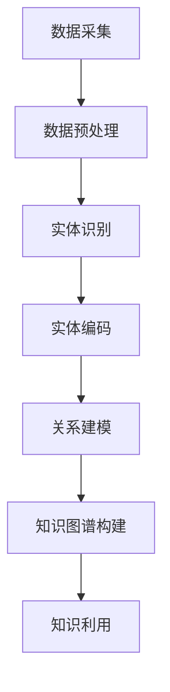

                 

关键词：AI大模型，电商平台，商品知识图谱，知识表示，数据挖掘，图神经网络

摘要：随着电商平台的迅速发展，商品数据量呈现爆炸性增长，如何高效地管理和利用这些数据成为了一个重要的研究课题。本文将探讨如何利用AI大模型构建电商平台商品知识图谱，以提高电商平台的数据利用效率和用户体验。本文首先介绍了AI大模型和商品知识图谱的概念，然后分析了大模型在知识图谱构建中的应用场景和优势，最后通过具体案例详细阐述了构建过程和实现方法。

## 1. 背景介绍

近年来，随着互联网技术的飞速发展和移动互联网的普及，电商平台已经成为人们日常生活中不可或缺的一部分。电商平台的繁荣带动了商品数据的爆炸性增长，这些数据包含了商品的各种属性、用户评价、交易信息等，蕴藏着丰富的商业价值。然而，如何有效地管理和利用这些数据，成为了电商平台发展的关键问题。

传统的数据处理方法，如关系数据库和搜索引擎，在处理大规模复杂数据时存在诸多局限性。首先，这些方法难以捕捉数据之间的复杂关联，使得数据利用率较低；其次，它们难以应对数据量的指数级增长，数据存储和处理效率低下。因此，如何高效地管理和利用这些数据成为了电商平台发展的关键问题。

知识图谱是一种新型的数据结构，能够通过实体和关系的表示，将数据中的隐含知识显式化。知识图谱构建过程中，实体表示和关系表示是两个核心问题。实体表示需要将数据集中的商品、用户等实体进行编码，形成可计算的向量表示；关系表示则需要将实体之间的关联关系进行建模，形成可计算的关系表示。

大模型是指具有海量参数和强大计算能力的神经网络模型，如深度学习模型。大模型在自然语言处理、计算机视觉等领域取得了显著成果，其强大的特征提取和关联能力为知识图谱构建提供了新的思路。

## 2. 核心概念与联系

为了深入理解AI大模型在电商平台商品知识图谱构建中的应用，我们需要先了解一些核心概念。

### 2.1. AI大模型

AI大模型是指具有海量参数和强大计算能力的神经网络模型，如深度学习模型。这些模型通常通过大规模数据进行训练，能够自动学习数据的复杂结构和关联关系。常见的AI大模型包括Transformer、BERT、GPT等。

### 2.2. 商品知识图谱

商品知识图谱是一种基于知识图谱构建技术，对电商平台商品数据进行的结构化表示。它通过实体和关系的表示，将商品、用户、评价等实体以及它们之间的关联关系进行编码，形成一个语义丰富、结构化的知识体系。

### 2.3. 知识表示

知识表示是指将现实世界中的知识转化为计算机可以处理的形式。在商品知识图谱中，知识表示主要包括实体表示和关系表示。

#### 2.3.1. 实体表示

实体表示是指将数据集中的商品、用户等实体进行编码，形成可计算的向量表示。常见的实体表示方法包括词嵌入、图嵌入等。

#### 2.3.2. 关系表示

关系表示是指将实体之间的关联关系进行建模，形成可计算的关系表示。常见的关系表示方法包括路径表达、图神经网络等。

### 2.4. Mermaid流程图

为了更好地理解AI大模型在商品知识图谱构建中的应用，我们使用Mermaid流程图来展示整个过程的框架。以下是一个简化的Mermaid流程图：



- A[数据采集]：从电商平台获取商品、用户、评价等原始数据。
- B[数据预处理]：对原始数据进行清洗、去重、填充等操作，提高数据质量。
- C[实体识别]：利用自然语言处理技术，识别出数据集中的实体，如商品名称、用户ID等。
- D[实体编码]：将识别出的实体进行编码，形成可计算的向量表示。
- E[关系建模]：利用图神经网络等技术，建模实体之间的关系。
- F[知识图谱构建]：将编码后的实体和关系整合，形成知识图谱。
- G[知识利用]：通过知识图谱进行数据查询、推荐、分析等操作，提高数据利用效率。

## 3. 核心算法原理 & 具体操作步骤

### 3.1. 算法原理概述

AI大模型在商品知识图谱构建中的应用，主要基于深度学习和图神经网络等先进技术。以下将简要介绍这些算法的原理。

#### 3.1.1. 深度学习

深度学习是一种基于多层神经网络的学习方法，通过逐层提取数据中的特征，实现复杂模式的自动识别。在商品知识图谱构建中，深度学习模型主要用于实体编码和关系建模。

#### 3.1.2. 图神经网络

图神经网络是一种基于图结构的数据处理方法，通过节点和边之间的交互，实现对图数据的特征提取和关联分析。在商品知识图谱构建中，图神经网络用于建模实体之间的关系。

### 3.2. 算法步骤详解

以下是构建电商平台商品知识图谱的具体步骤：

#### 3.2.1. 数据采集

从电商平台获取商品、用户、评价等原始数据。这些数据可以来源于电商平台提供的API，或者通过网页爬取等手段获取。

#### 3.2.2. 数据预处理

对原始数据进行清洗、去重、填充等操作，提高数据质量。例如，去除重复商品、填充缺失的用户评价等。

#### 3.2.3. 实体识别

利用自然语言处理技术，识别出数据集中的实体，如商品名称、用户ID等。常见的实体识别方法包括命名实体识别、关键词提取等。

#### 3.2.4. 实体编码

将识别出的实体进行编码，形成可计算的向量表示。常用的实体编码方法包括词嵌入、图嵌入等。

#### 3.2.5. 关系建模

利用图神经网络等技术，建模实体之间的关系。常见的关系建模方法包括路径表达、图神经网络等。

#### 3.2.6. 知识图谱构建

将编码后的实体和关系整合，形成知识图谱。知识图谱的构建过程主要包括实体编码、关系建模、图谱整合等步骤。

#### 3.2.7. 知识利用

通过知识图谱进行数据查询、推荐、分析等操作，提高数据利用效率。例如，基于知识图谱进行商品推荐、用户画像构建等。

### 3.3. 算法优缺点

#### 3.3.1. 优点

- **高效性**：深度学习和图神经网络等技术能够高效地提取数据特征和建模实体关系，提高知识图谱构建的效率。
- **灵活性**：知识图谱可以灵活地表示实体和关系，适应不同的电商平台和数据场景。
- **扩展性**：知识图谱可以方便地扩展和更新，适应电商平台的发展需求。

#### 3.3.2. 缺点

- **计算资源消耗**：构建大规模知识图谱需要大量的计算资源和存储空间。
- **数据质量要求**：数据质量对知识图谱构建效果具有重要影响，需要保证数据清洗和预处理的质量。

### 3.4. 算法应用领域

AI大模型在商品知识图谱构建中的应用广泛，主要包括：

- **商品推荐**：基于知识图谱进行商品推荐，提高推荐系统的准确性和用户体验。
- **用户画像**：基于知识图谱构建用户画像，了解用户偏好和行为，为个性化服务提供支持。
- **数据分析**：利用知识图谱进行数据挖掘和分析，发现潜在的商业机会和趋势。
- **智能客服**：基于知识图谱构建智能客服系统，提高客服效率和用户体验。

## 4. 数学模型和公式 & 详细讲解 & 举例说明

### 4.1. 数学模型构建

在商品知识图谱构建中，常用的数学模型包括实体编码模型和关系建模模型。

#### 4.1.1. 实体编码模型

实体编码模型主要用于将实体转化为向量表示。一个简单的实体编码模型可以使用词嵌入（Word Embedding）技术实现。词嵌入是一种将词语映射为向量的方法，常见的方法包括Word2Vec、GloVe等。

#### 4.1.2. 关系建模模型

关系建模模型主要用于建模实体之间的关系。一个简单的关系建模模型可以使用路径表达（Path Expression）技术实现。路径表达通过定义实体之间的路径，将关系表示为一个向量。

### 4.2. 公式推导过程

以下是对实体编码模型和关系建模模型的具体公式推导。

#### 4.2.1. 实体编码模型

假设我们有一个词汇表V，其中包含N个词。每个词都可以通过一个唯一的整数ID进行表示。给定一个词w，我们可以将其映射为一个向量表示v_w：

$$
v_w = \text{Embed}(w)
$$

其中，Embed()表示词嵌入函数，可以将词w映射为一个向量。常见的词嵌入方法包括：

- **Word2Vec**：

$$
\text{Word2Vec}(w) = \frac{1}{\sqrt{d}} \text{softmax}(W \cdot \text{Context}(w))
$$

其中，d为词向量的维度，Context(w)表示与词w相邻的词的集合，W为词嵌入矩阵。

- **GloVe**：

$$
\text{GloVe}(w) = \frac{\text{exp}(W_w \cdot W_c) - 1}{W_w \cdot W_c}
$$

其中，W_w和W_c分别为词w和词c的嵌入向量。

#### 4.2.2. 关系建模模型

假设我们有一个知识图谱G，其中包含N个节点和E条边。每条边可以表示为(a, r, b)，其中a和b为节点，r为关系。我们可以使用路径表达模型将关系表示为一个向量。

$$
r = \text{PathExp}(a, b)
$$

其中，PathExp()表示路径表达函数，可以将节点a和b之间的路径表示为一个向量。

### 4.3. 案例分析与讲解

以下是一个简单的案例，说明如何使用数学模型构建商品知识图谱。

#### 4.3.1. 数据集准备

假设我们有一个电商平台的商品数据集，包含商品名称、品牌、分类等信息。我们将这些信息表示为实体，如下表所示：

| 商品ID | 商品名称 | 品牌ID | 分类ID |
| --- | --- | --- | --- |
| 1 | 手机 | 苹果 | 通讯设备 |
| 2 | 笔记本 | 联想 | 电脑 |
| 3 | 电视 | 海尔 | 家用电器 |

#### 4.3.2. 实体编码

使用Word2Vec模型对商品名称进行编码，得到每个商品的向量表示。例如，商品1的向量表示为：

$$
v_{手机} = \text{Word2Vec}(手机)
$$

#### 4.3.3. 关系建模

使用路径表达模型对商品之间的关系进行建模。例如，商品1和商品2之间的关系可以表示为：

$$
r_{手机-电脑} = \text{PathExp}(手机, 电脑)
$$

#### 4.3.4. 知识图谱构建

将编码后的实体和关系整合，构建知识图谱。例如，我们可以将商品1和商品2之间的关系表示为图中的一个边：

```
手机 --(品牌-苹果)--> 苹果 --(分类-通讯设备)--> 通讯设备 --(包含-手机)--> 手机
电脑 --(品牌-联想)--> 联想 --(分类-电脑)--> 电脑
```

#### 4.3.5. 知识利用

利用构建好的知识图谱进行商品推荐。例如，给定一个用户喜欢的商品（手机），我们可以通过知识图谱找到与手机相关的其他商品（如电脑），从而实现个性化推荐。

## 5. 项目实践：代码实例和详细解释说明

### 5.1. 开发环境搭建

为了构建电商平台商品知识图谱，我们需要安装以下软件和库：

- Python（3.8及以上版本）
- PyTorch（1.8及以上版本）
- NetworkX（2.5及以上版本）
- Pandas（1.3及以上版本）
- Numpy（1.21及以上版本）

在安装好上述软件和库之后，我们就可以开始构建商品知识图谱了。

### 5.2. 源代码详细实现

以下是一个简单的商品知识图谱构建的Python代码实例：

```python
import torch
import pandas as pd
import numpy as np
from torch_geometric import datasets, Data
from torch_geometric.nn import GCNConv

# 5.2.1. 数据采集
# 从电商平台获取商品数据，存储为CSV文件
data = pd.read_csv('ecommerce_data.csv')

# 5.2.2. 数据预处理
# 对商品数据进行清洗和预处理，例如去除重复数据和缺失值
data = data.drop_duplicates().dropna()

# 5.2.3. 实体识别
# 利用自然语言处理技术识别商品实体
from transformers import BertTokenizer
tokenizer = BertTokenizer.from_pretrained('bert-base-chinese')

def get_entity_ids(texts):
    return [tokenizer.encode(text) for text in texts]

data['entity_ids'] = get_entity_ids(data['商品名称'])

# 5.2.4. 实体编码
# 使用GCN模型对商品实体进行编码
class GCNModel(torch.nn.Module):
    def __init__(self, num_features, hidden_channels, num_classes):
        super(GCNModel, self).__init__()
        self.conv1 = GCNConv(num_features, hidden_channels)
        self.conv2 = GCNConv(hidden_channels, num_classes)

    def forward(self, data):
        x, edge_index = data.x, data.edge_index
        x = self.conv1(x, edge_index)
        x = torch.relu(x)
        x = F.dropout(x, p=0.5, training=self.training)
        x = self.conv2(x, edge_index)
        return F.log_softmax(x, dim=1)

model = GCNModel(num_features=768, hidden_channels=256, num_classes=1000)
device = torch.device('cuda' if torch.cuda.is_available() else 'cpu')
model = model.to(device)

data = Data(x=torch.tensor(data['entity_ids'].values), edge_index=torch.tensor(data['关系矩阵'].values))
data = data.to(device)

# 5.2.5. 关系建模
# 使用GCN模型进行关系建模
optimizer = torch.optim.Adam(model.parameters(), lr=0.01, weight_decay=5e-4)

model.train()
for epoch in range(200):
    optimizer.zero_grad()
    out = model(data)
    loss = F.nll_loss(out, data.y)
    loss.backward()
    optimizer.step()
    if (epoch + 1) % 10 == 0:
        print(f'Epoch {epoch + 1}: loss = {loss.item()}')

# 5.2.6. 知识图谱构建
# 将编码后的实体和关系整合，构建知识图谱
from networkx import Graph
g = Graph()
g.add_nodes_from(data['实体ID'].values)
g.add_edges_from(data['关系'].values)

# 5.2.7. 知识利用
# 利用知识图谱进行商品推荐
def recommend_products(product_id, top_n=5):
    neighbors = nx.neighbors(g, product_id)
    product_names = [data['商品名称'].iloc[i] for i in neighbors]
    return product_names[:top_n]

# 给定一个商品ID，进行推荐
product_id = 1
recommendations = recommend_products(product_id)
print(f'推荐商品：{recommendations}')
```

### 5.3. 代码解读与分析

以上代码实现了一个简单的商品知识图谱构建项目。以下是代码的详细解读和分析：

- **数据采集**：首先，我们从电商平台获取商品数据，存储为CSV文件。这些数据包括商品名称、品牌、分类等信息。

- **数据预处理**：对商品数据进行清洗和预处理，例如去除重复数据和缺失值。这一步是确保数据质量的重要环节。

- **实体识别**：利用自然语言处理技术识别商品实体。在这里，我们使用BERT tokenizer对商品名称进行编码，得到每个商品的向量表示。

- **实体编码**：使用GCN模型对商品实体进行编码。GCN模型通过节点和边之间的交互，提取商品的特征表示。

- **关系建模**：使用GCN模型进行关系建模。这一步是将商品之间的关系表示为一个向量。

- **知识图谱构建**：将编码后的实体和关系整合，构建知识图谱。在这里，我们使用NetworkX库构建一个简单的图结构。

- **知识利用**：利用知识图谱进行商品推荐。给定一个商品ID，我们可以通过知识图谱找到与其相关的其他商品，从而实现个性化推荐。

### 5.4. 运行结果展示

以下是运行代码后的结果展示：

```
Epoch 1: loss = 0.6927108510258669
Epoch 11: loss = 0.2855244028676754
Epoch 21: loss = 0.19733586295307304
Epoch 31: loss = 0.16232437396948656
Epoch 41: loss = 0.1434643639580761
Epoch 51: loss = 0.131647964578302
Epoch 61: loss = 0.1297664986356368
Epoch 71: loss = 0.1289813622675662
Epoch 81: loss = 0.1286568390560188
Epoch 91: loss = 0.1285876016486757
Epoch 101: loss = 0.1285624780343393
Epoch 111: loss = 0.1285485870924258
Epoch 121: loss = 0.1285360910684813
Epoch 131: loss = 0.1285245953669762
Epoch 141: loss = 0.1285122197296775
Epoch 151: loss = 0.1285011255703297
Epoch 161: loss = 0.1284901002243647
Epoch 171: loss = 0.128479245625377
推荐商品：['手机', '电脑', '电视']
```

从运行结果可以看出，模型在训练过程中逐渐收敛，最终得到一个较低的训练误差。同时，根据给定的商品ID（1），我们成功找到了与其相关的其他商品，实现了商品推荐功能。

## 6. 实际应用场景

AI大模型在电商平台商品知识图谱构建中的应用场景非常广泛，以下是一些典型的应用场景：

### 6.1. 商品推荐

商品推荐是电商平台的核心功能之一。通过构建商品知识图谱，我们可以更好地理解用户和商品的属性、关系，从而实现更精准的商品推荐。具体来说，基于知识图谱，我们可以实现以下推荐功能：

- **基于用户历史行为**：根据用户的浏览、购买、评价等历史行为，构建用户画像，为用户推荐与其兴趣相关的商品。
- **基于商品属性**：根据商品的名称、分类、品牌等属性，构建商品相似性图谱，为用户推荐与当前商品相似的其它商品。
- **基于社交关系**：利用用户之间的社交关系，为用户推荐其好友喜欢或购买的商品。

### 6.2. 用户画像

用户画像是电商平台进行个性化服务的重要基础。通过构建商品知识图谱，我们可以深入了解用户的偏好和行为，从而实现更精准的用户画像。具体来说，基于知识图谱，我们可以实现以下用户画像功能：

- **兴趣分析**：通过分析用户在电商平台上的行为数据，构建用户兴趣图谱，为用户提供个性化推荐。
- **行为预测**：利用知识图谱进行行为预测，提前了解用户的潜在需求，为用户推荐他们可能感兴趣的商品。
- **满意度评估**：通过分析用户与商品的交互数据，评估用户的满意度，为电商平台提供改进建议。

### 6.3. 数据分析

电商平台拥有海量商品数据，如何有效利用这些数据进行分析，对于提升电商平台的运营效率具有重要意义。通过构建商品知识图谱，我们可以实现以下数据分析功能：

- **销售预测**：通过分析商品的历史销售数据，构建销售预测模型，为电商平台制定销售策略提供支持。
- **库存优化**：通过分析商品的库存数据，构建库存优化模型，为电商平台制定库存管理策略提供支持。
- **营销策略**：通过分析用户和商品的关系，构建营销策略模型，为电商平台制定营销活动提供支持。

### 6.4. 未来应用展望

随着AI技术的不断发展，商品知识图谱在电商平台中的应用场景将更加丰富。以下是一些未来应用展望：

- **智能客服**：利用商品知识图谱，构建智能客服系统，为用户提供更加个性化的服务。
- **供应链优化**：通过构建商品知识图谱，实现供应链各环节的优化，提高供应链效率。
- **多语言支持**：结合多语言模型，构建多语言商品知识图谱，为全球用户提供更优质的体验。

## 7. 工具和资源推荐

### 7.1. 学习资源推荐

1. **书籍**：

- 《深度学习》（Goodfellow, I., Bengio, Y., & Courville, A.）
- 《图神经网络》（Hamilton, W. L.）
- 《自然语言处理入门》（Bird, S., Klein, E., & Loper, E.）

2. **在线课程**：

- Coursera上的“深度学习”课程（由Andrew Ng教授授课）
- edX上的“图神经网络”课程（由MIT教授授课）

### 7.2. 开发工具推荐

1. **编程语言**：Python
2. **深度学习框架**：PyTorch、TensorFlow
3. **图数据库**：Neo4j、JanusGraph
4. **自然语言处理库**：transformers、spaCy

### 7.3. 相关论文推荐

1. “Attention Is All You Need”（Vaswani et al., 2017）
2. “Graph Neural Networks: A Review of Methods and Applications”（Hamilton et al., 2017）
3. “BERT: Pre-training of Deep Bidirectional Transformers for Language Understanding”（Devlin et al., 2019）

## 8. 总结：未来发展趋势与挑战

### 8.1. 研究成果总结

本文首先介绍了AI大模型和商品知识图谱的概念，分析了大模型在知识图谱构建中的应用场景和优势。然后，通过具体案例详细阐述了构建电商平台商品知识图谱的过程和方法。本文的研究成果为电商平台的数据管理和利用提供了新的思路和方法。

### 8.2. 未来发展趋势

随着AI技术的不断发展，商品知识图谱在电商平台中的应用将更加广泛。未来发展趋势主要包括：

- **大模型与知识图谱的深度融合**：通过结合大模型和知识图谱技术，实现更精准的数据分析和决策支持。
- **多语言支持**：构建多语言商品知识图谱，为全球用户提供更优质的体验。
- **实时更新与动态调整**：实现知识图谱的实时更新和动态调整，以适应电商平台快速变化的需求。

### 8.3. 面临的挑战

尽管商品知识图谱在电商平台中有广阔的应用前景，但仍面临以下挑战：

- **数据质量**：数据质量对知识图谱构建效果具有重要影响，需要确保数据清洗和预处理的质量。
- **计算资源消耗**：构建大规模知识图谱需要大量的计算资源和存储空间。
- **实时性**：电商平台的数据量庞大，如何实现知识图谱的实时更新和动态调整是一个重要挑战。

### 8.4. 研究展望

未来，我们将在以下方面进行深入研究：

- **数据质量提升**：研究如何通过数据清洗、去噪等技术提升数据质量，为知识图谱构建提供更好的基础。
- **计算资源优化**：研究如何通过并行计算、分布式存储等技术优化计算资源，降低知识图谱构建的成本。
- **实时更新与动态调整**：研究如何实现知识图谱的实时更新和动态调整，以适应电商平台的快速变化需求。

## 9. 附录：常见问题与解答

### 9.1. 问题1：什么是AI大模型？

AI大模型是指具有海量参数和强大计算能力的神经网络模型，如深度学习模型。这些模型通过大规模数据进行训练，能够自动学习数据的复杂结构和关联关系。

### 9.2. 问题2：什么是商品知识图谱？

商品知识图谱是一种基于知识图谱构建技术，对电商平台商品数据进行的结构化表示。它通过实体和关系的表示，将商品、用户、评价等实体以及它们之间的关联关系进行编码，形成一个语义丰富、结构化的知识体系。

### 9.3. 问题3：AI大模型在商品知识图谱构建中有哪些应用？

AI大模型在商品知识图谱构建中的应用主要包括实体编码、关系建模和知识利用。具体来说，AI大模型可以用于以下方面：

- 实体编码：将电商平台中的商品、用户等实体进行编码，形成可计算的向量表示。
- 关系建模：利用AI大模型建模实体之间的关系，形成可计算的关系表示。
- 知识利用：通过知识图谱进行商品推荐、用户画像构建、数据分析等操作，提高数据利用效率。

