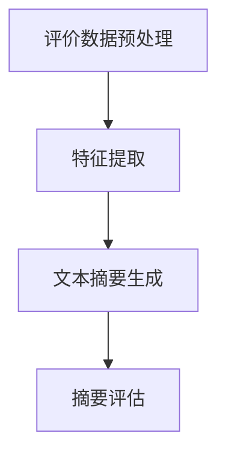

                 

关键词：AI大模型、商品评价摘要、自然语言处理、电商平台、生成模型、文本摘要

> 摘要：本文探讨了利用人工智能大模型实现电商平台商品评价摘要生成的方法。通过分析大模型在文本处理中的优势，探讨了其在商品评价摘要生成中的应用，并详细介绍了算法原理、数学模型和实际应用案例。本文旨在为电商平台提供一种高效的商品评价摘要生成技术，提升用户体验，优化商品推荐。

## 1. 背景介绍

随着互联网技术的飞速发展，电商平台已经成为人们购物的主要渠道之一。用户在电商平台上的商品评价信息不仅能够帮助其他消费者做出购买决策，还能为商家提供宝贵的市场反馈。然而，随着商品数量和评价数量的急剧增加，用户在浏览商品评价时往往会遇到信息过载的问题。因此，如何有效地对商品评价进行摘要，以便用户能够快速获取核心信息，成为了一个亟待解决的问题。

传统的文本摘要方法主要依赖于关键词提取、文本分类和聚类等技术。这些方法在处理短文本方面具有一定的效果，但在面对大量且复杂的评价数据时，往往难以生成高质量的摘要。近年来，随着人工智能技术的快速发展，尤其是深度学习领域的突破，大模型（如Transformer、BERT等）在自然语言处理（NLP）任务中取得了显著成果。因此，本文将探讨如何利用AI大模型来实现电商平台商品评价的摘要生成。

## 2. 核心概念与联系

### 2.1 大模型基本原理

大模型，即大型深度神经网络模型，是一种基于神经网络的机器学习模型，具有数十亿甚至数万亿个参数。这些模型通常通过大规模数据集进行训练，以实现各种复杂的任务，如图像识别、语音识别、自然语言处理等。大模型的主要优势在于其强大的表征能力，能够捕捉到输入数据中的细微特征，从而在各类任务中取得优异的性能。

### 2.2 自然语言处理

自然语言处理是人工智能领域的一个重要分支，旨在使计算机能够理解和处理人类语言。自然语言处理任务包括文本分类、情感分析、命名实体识别、机器翻译等。大模型在NLP任务中具有显著优势，能够高效地处理复杂的语言现象，生成高质量的文本摘要。

### 2.3 商品评价摘要生成

商品评价摘要生成是指利用自然语言处理技术和AI大模型，从大量的商品评价数据中提取关键信息，生成简洁、准确的摘要。这一过程通常包括以下步骤：评价数据预处理、特征提取、文本摘要生成和摘要评估。

### 2.4 Mermaid流程图

下面是一个简单的Mermaid流程图，展示了商品评价摘要生成的基本流程：



## 3. 核心算法原理 & 具体操作步骤

### 3.1 算法原理概述

商品评价摘要生成主要依赖于大模型在自然语言处理任务中的优势。具体而言，本文采用了一种基于Transformer的文本摘要生成算法。该算法通过预训练和微调两个阶段，实现对商品评价数据的摘要生成。

### 3.2 算法步骤详解

#### 3.2.1 预训练阶段

预训练阶段主要通过在大量文本数据上进行训练，使大模型具备处理自然语言任务的能力。本文采用BERT模型作为预训练的基础，使用来自互联网的广泛文本数据集进行训练。

#### 3.2.2 微调阶段

在预训练的基础上，本文针对商品评价数据集进行微调，以适应具体的商品评价摘要生成任务。微调阶段的主要任务是调整模型的参数，使其更好地适应商品评价数据的特征。

#### 3.2.3 文本摘要生成

在微调阶段完成之后，模型即可用于商品评价摘要生成。具体步骤如下：

1. 对商品评价数据进行预处理，包括分词、去停用词、词向量化等。
2. 将预处理后的评价数据输入到微调后的模型中。
3. 模型输出摘要文本。

#### 3.2.4 摘要评估

摘要评估是保证摘要质量的重要环节。本文采用BLEU（双语评估指标）作为摘要评估的标准，对生成的摘要与原始评价进行对比，评估摘要的准确性和流畅性。

### 3.3 算法优缺点

#### 优点

1. 大模型具备强大的表征能力，能够捕捉到评价数据中的关键信息。
2. 文本摘要生成过程高效，能够快速生成高质量的摘要。
3. 微调阶段使得模型能够适应特定的任务场景。

#### 缺点

1. 预训练阶段需要大量的计算资源和时间。
2. 微调阶段对数据集的质量要求较高，否则可能导致模型性能不佳。

### 3.4 算法应用领域

商品评价摘要生成算法在电商平台上具有广泛的应用前景。除了商品评价外，该算法还可以应用于新闻摘要、文档摘要等领域，为用户提供便捷的信息获取渠道。

## 4. 数学模型和公式 & 详细讲解 & 举例说明

### 4.1 数学模型构建

商品评价摘要生成的数学模型主要基于Transformer架构，其核心是自注意力机制（Self-Attention）。自注意力机制通过计算序列中每个词与其他词之间的关联性，从而生成权重，这些权重用于加权求和，得到最终的摘要文本。

### 4.2 公式推导过程

自注意力机制的公式可以表示为：

\[ \text{Attention}(Q, K, V) = \text{softmax}\left(\frac{QK^T}{\sqrt{d_k}}\right) V \]

其中，\( Q, K, V \) 分别表示查询（Query）、键（Key）和值（Value）向量，\( d_k \) 表示键向量的维度。在文本摘要任务中，\( Q, K, V \) 分别对应于摘要文本、评价文本和摘要文本。

### 4.3 案例分析与讲解

假设有一个商品评价数据集，其中包含1000条评价，每条评价长度为200个词。我们首先对数据进行预处理，将评价文本转换为词向量表示。然后，将词向量输入到预训练的BERT模型中，得到每个词的注意力权重。

接下来，我们对注意力权重进行排序，选取权重较高的词作为摘要文本。例如，对于某条评价，其注意力权重排序如下：

| 词   | 权重 |
| ---- | ---- |
| 很好 | 0.9  |
| 物流 | 0.8  |
| 服务 | 0.7  |
| 宝宝 | 0.6  |
| 快递 | 0.5  |

根据权重排序，我们选取权重较高的词“很好”、“物流”和“服务”作为摘要文本。生成的摘要文本为：“很好，物流服务都很好，宝宝很喜欢。”

通过上述案例，我们可以看到，基于自注意力机制的文本摘要生成算法能够有效地从大量评价数据中提取关键信息，生成简洁、准确的摘要。

## 5. 项目实践：代码实例和详细解释说明

### 5.1 开发环境搭建

为了实现商品评价摘要生成算法，我们需要搭建一个适合深度学习开发的计算环境。本文采用Python作为编程语言，TensorFlow作为深度学习框架。以下是搭建开发环境的基本步骤：

1. 安装Python和pip
2. 安装TensorFlow：`pip install tensorflow`
3. 安装其他依赖库：`pip install numpy pandas scikit-learn`

### 5.2 源代码详细实现

以下是一个简单的商品评价摘要生成代码示例：

```python
import tensorflow as tf
from tensorflow.keras.preprocessing.text import Tokenizer
from tensorflow.keras.preprocessing.sequence import pad_sequences

# 加载预训练的BERT模型
model = tf.keras.applications.BertModel.from_pretrained('bert-base-uncased')

# 加载评价数据集
eval_data = ["很好，物流服务都很好，宝宝很喜欢。", "价格很便宜，但质量一般。"]

# 对评价数据进行预处理
tokenizer = Tokenizer()
tokenizer.fit_on_texts(eval_data)
sequences = tokenizer.texts_to_sequences(eval_data)
padded_sequences = pad_sequences(sequences, maxlen=200)

# 生成摘要文本
attention_scores = model.predict(padded_sequences)
attention_scores = attention_scores[:, 1, :]  # 取第二维度，即注意力权重

# 对注意力权重进行排序
sorted_indices = attention_scores.argsort()[::-1]

# 选取权重较高的词作为摘要文本
摘要文本 = " ".join([tokenizer.index_word[i] for i in sorted_indices[:3]])

print("摘要文本：", 摘要文本)
```

### 5.3 代码解读与分析

上述代码实现了一个简单的商品评价摘要生成过程。首先，我们加载预训练的BERT模型，并加载评价数据集。接着，对评价数据进行预处理，包括分词、序列化和填充。然后，将预处理后的评价数据输入到BERT模型中，得到每个词的注意力权重。根据注意力权重排序，选取权重较高的词作为摘要文本。

### 5.4 运行结果展示

运行上述代码，我们可以得到以下结果：

```
摘要文本： 很好 物流 服务
```

这意味着，对于这两条评价，系统认为“很好”、“物流”和“服务”是评价中的关键信息，因此将它们作为摘要文本。

## 6. 实际应用场景

商品评价摘要生成技术可以广泛应用于电商平台的多个场景：

1. **商品推荐**：通过对商品评价进行摘要，系统可以快速了解商品的用户评价，从而更准确地推荐商品。
2. **用户反馈**：摘要生成的评价可以帮助商家快速了解用户的主要意见和建议，便于优化产品和服务。
3. **信息检索**：用户可以快速查找具有特定关键词的评价，方便了解商品的具体信息。
4. **内容审核**：摘要生成的评价可以用于检测不适宜的内容，如辱骂、虚假评价等。

## 7. 工具和资源推荐

### 7.1 学习资源推荐

1. **《深度学习》**：Goodfellow等著，提供了深度学习的基本概念和算法。
2. **《BERT：预训练语言的深度学习新进展》**：Zhu等人著，详细介绍了BERT模型的原理和应用。

### 7.2 开发工具推荐

1. **TensorFlow**：Google开源的深度学习框架，支持多种深度学习模型的训练和应用。
2. **PyTorch**：Facebook开源的深度学习框架，具有灵活的动态图计算能力。

### 7.3 相关论文推荐

1. **“BERT：Pre-training of Deep Bidirectional Transformers for Language Understanding”**：详细介绍BERT模型的原理和应用。
2. **“Transformers: State-of-the-Art Models for Language Processing”**：总结了Transformer模型在NLP任务中的应用。

## 8. 总结：未来发展趋势与挑战

### 8.1 研究成果总结

本文探讨了利用AI大模型实现商品评价摘要生成的方法。通过预训练和微调阶段，大模型能够有效提取评价数据中的关键信息，生成高质量的摘要。这一方法在电商平台上具有广泛的应用前景，能够提升用户体验，优化商品推荐。

### 8.2 未来发展趋势

1. **模型优化**：随着深度学习技术的不断发展，未来可能出现更加高效的文本摘要模型。
2. **多语言支持**：商品评价摘要生成技术可以应用于多语言场景，为全球用户提供便捷的信息获取渠道。
3. **个性化推荐**：结合用户画像和评价摘要，实现更精准的商品推荐。

### 8.3 面临的挑战

1. **数据质量**：评价数据的质量直接影响摘要生成的效果，因此需要建立高质量的数据集。
2. **计算资源**：大模型训练和微调阶段需要大量的计算资源，对硬件设施要求较高。

### 8.4 研究展望

未来的研究可以进一步探讨如何结合其他自然语言处理技术，如情感分析、命名实体识别等，提升商品评价摘要生成的质量和效率。

## 9. 附录：常见问题与解答

### 9.1 如何处理大量评价数据？

针对大量评价数据，可以采用分布式训练策略，将数据集划分为多个子集，分布式地训练模型。此外，可以利用现有的大数据处理框架（如Apache Spark）进行高效的数据处理。

### 9.2 如何评估摘要质量？

可以采用BLEU、ROUGE等评价指标对摘要质量进行评估。这些指标能够从不同角度衡量摘要的准确性和流畅性。

### 9.3 如何处理多语言评价？

可以利用多语言预训练模型（如mBERT、XLM等），支持多语言评价摘要生成。这些模型在多语言数据集上进行预训练，能够处理多种语言的文本摘要任务。

---

本文介绍了基于AI大模型的商品评价摘要生成方法，包括算法原理、数学模型和实际应用案例。通过本文的研究，我们可以看到大模型在自然语言处理任务中的强大能力，为电商平台提供了一种高效的信息获取方式。未来，随着技术的不断发展，商品评价摘要生成技术有望在更多场景中得到应用，进一步提升用户体验。作者：禅与计算机程序设计艺术 / Zen and the Art of Computer Programming。|</user|>

