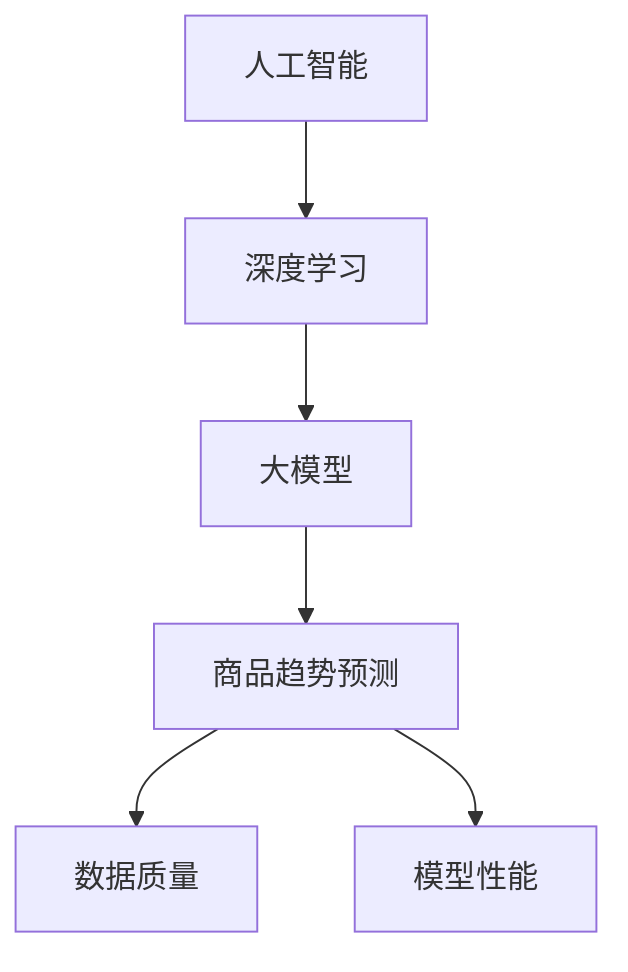

                 

关键词：人工智能、电商平台、商品趋势预测、深度学习、大模型、数据分析、算法应用、商业智能

## 摘要

本文将探讨人工智能大模型在电商平台商品趋势预测中的应用。随着电商行业的迅猛发展，对商品趋势的准确预测已成为电商平台提升运营效率和用户满意度的关键。本文首先介绍了商品趋势预测的背景和重要性，随后详细阐述了人工智能大模型的基本原理和构建方法，并通过具体案例展示了大模型在商品趋势预测中的实际应用效果。最后，本文对大模型在商品趋势预测领域的未来发展和面临的挑战进行了展望。

## 1. 背景介绍

### 1.1 电商平台的发展现状

随着互联网技术的普及和电子商务的快速发展，电商平台已经成为现代商业环境中的重要组成部分。据统计，全球电商市场规模已达到数万亿美元，并且还在持续增长。各大电商平台通过提供丰富的商品选择、便捷的购物体验和高效的物流服务，吸引了越来越多的消费者。

### 1.2 商品趋势预测的重要性

商品趋势预测是指通过分析历史数据和市场信息，预测未来一段时间内商品的需求变化。对于电商平台来说，准确的商品趋势预测具有以下重要意义：

- **优化库存管理**：通过预测商品需求，电商平台可以更精准地调整库存，避免过剩或缺货的情况，从而降低库存成本和运营风险。

- **提高销售额**：准确预测商品趋势可以帮助电商平台提前备货，满足消费者的需求，从而提高销售额和市场份额。

- **提升用户体验**：及时提供符合消费者需求的商品，可以提升用户购物体验，增强用户忠诚度。

### 1.3 人工智能在电商平台的应用

随着人工智能技术的不断发展，人工智能已成为电商平台提升运营效率和创新业务模式的重要工具。人工智能技术可以应用于以下几个方面：

- **用户行为分析**：通过分析用户的浏览、购买和评价行为，电商平台可以更好地理解用户需求，提供个性化的推荐和服务。

- **智能客服**：人工智能客服系统可以自动回答用户的问题，提高客服效率和用户体验。

- **商品智能推荐**：基于用户历史数据和商品特征，人工智能算法可以生成个性化的商品推荐，提高用户购买意愿。

- **商品趋势预测**：通过分析大量数据，人工智能大模型可以预测未来商品的趋势，帮助电商平台制定更科学的营销策略和库存管理计划。

## 2. 核心概念与联系

在探讨人工智能大模型在商品趋势预测中的应用之前，我们需要了解一些核心概念和它们之间的联系。

### 2.1 人工智能

人工智能（Artificial Intelligence，AI）是指通过计算机模拟人类智能的技术和系统。它包括机器学习、深度学习、自然语言处理、计算机视觉等多个领域。人工智能大模型是指使用大量数据和强大的计算能力训练出来的模型，如Transformer、BERT等。

### 2.2 深度学习

深度学习（Deep Learning）是一种基于人工神经网络的机器学习技术，通过多层神经网络对数据进行特征提取和模式识别。深度学习在图像识别、语音识别和自然语言处理等领域取得了显著的成果。

### 2.3 大模型

大模型（Large Models）是指具有大规模参数和训练数据的模型。大模型通过大量数据进行训练，可以更好地捕捉数据的复杂性和多样性，从而提高预测的准确性和泛化能力。

### 2.4 商品趋势预测

商品趋势预测是指利用历史数据和人工智能算法，预测未来一段时间内商品的需求变化。商品趋势预测的关键在于数据的质量和模型的性能。

### 2.5 Mermaid 流程图

为了更好地理解人工智能大模型在商品趋势预测中的应用，我们使用Mermaid流程图（图2-1）来展示核心概念和联系。



## 3. 核心算法原理 & 具体操作步骤

### 3.1 算法原理概述

商品趋势预测的核心在于利用历史数据和人工智能算法，捕捉商品需求变化的规律。具体来说，人工智能大模型通过以下步骤进行商品趋势预测：

1. 数据收集：收集电商平台的历史交易数据、用户行为数据和市场环境数据。

2. 数据预处理：对收集到的数据进行清洗、去噪和归一化处理。

3. 特征工程：从原始数据中提取有用的特征，如商品种类、价格、销量、用户年龄、地域等。

4. 模型训练：使用深度学习算法，对提取的特征数据进行训练，构建商品趋势预测模型。

5. 模型评估：使用交叉验证等方法评估模型的预测性能。

6. 预测应用：将训练好的模型应用于实际数据，预测未来一段时间内商品的需求变化。

### 3.2 算法步骤详解

#### 3.2.1 数据收集

数据收集是商品趋势预测的第一步。电商平台可以通过以下渠道收集数据：

- 交易数据：包括商品名称、价格、销量、交易时间等。

- 用户行为数据：包括用户浏览、搜索、加入购物车、下单等行为。

- 市场环境数据：包括宏观经济指标、行业趋势、节假日等。

#### 3.2.2 数据预处理

数据预处理是确保数据质量和模型性能的重要环节。具体步骤如下：

- 数据清洗：去除重复数据、缺失数据和异常数据。

- 去噪：使用滤波、降噪等方法去除数据中的噪声。

- 归一化：将不同量纲的数据转换为相同的量纲，便于模型训练。

#### 3.2.3 特征工程

特征工程是提取数据中具有预测价值的信息。常见的特征包括：

- 商品特征：如商品种类、品牌、价格等。

- 用户特征：如用户年龄、性别、地域等。

- 时间特征：如交易时间、节假日等。

- 市场环境特征：如行业趋势、宏观经济指标等。

#### 3.2.4 模型训练

模型训练是构建商品趋势预测模型的关键步骤。常见的深度学习算法包括：

- 卷积神经网络（CNN）：适用于处理图像和序列数据。

- 递归神经网络（RNN）：适用于处理序列数据。

- 变换器（Transformer）：适用于处理大规模序列数据。

在模型训练过程中，需要使用大量数据进行训练，并通过优化算法调整模型参数，提高预测性能。

#### 3.2.5 模型评估

模型评估是评估模型预测性能的重要环节。常用的评估指标包括：

- 平均绝对误差（MAE）：衡量预测值与真实值之间的绝对误差。

- 均方误差（MSE）：衡量预测值与真实值之间的平方误差。

- R²值：衡量模型的拟合程度。

通过交叉验证等方法，可以评估模型的泛化能力。

#### 3.2.6 预测应用

训练好的模型可以应用于实际数据，预测未来一段时间内商品的需求变化。预测结果可以用于优化库存管理、制定营销策略等。

### 3.3 算法优缺点

#### 3.3.1 优点

- **高精度**：人工智能大模型可以处理大规模数据，提高预测精度。

- **实时性**：基于实时数据，可以快速预测商品需求变化，提高决策效率。

- **个性化**：通过分析用户行为，可以提供个性化的商品推荐，提高用户满意度。

#### 3.3.2 缺点

- **数据依赖**：商品趋势预测依赖于历史数据和用户行为，数据质量直接影响预测结果。

- **计算资源需求高**：深度学习算法需要大量的计算资源，对硬件设备要求较高。

- **模型解释性较差**：深度学习模型的内部机制复杂，难以解释。

### 3.4 算法应用领域

人工智能大模型在商品趋势预测中的应用领域广泛，包括：

- **电商平台**：用于预测商品需求，优化库存管理，提高销售额。

- **零售行业**：用于预测销售趋势，制定采购计划，降低库存成本。

- **物流行业**：用于预测物流需求，优化运输路线，提高配送效率。

- **制造业**：用于预测生产需求，优化生产计划，降低生产成本。

## 4. 数学模型和公式 & 详细讲解 & 举例说明

### 4.1 数学模型构建

商品趋势预测的数学模型通常基于时间序列分析，可以使用自回归移动平均模型（ARIMA）、长短期记忆网络（LSTM）等。本文以LSTM模型为例，介绍数学模型的构建过程。

LSTM模型是一种递归神经网络，适用于处理时间序列数据。其基本结构包括输入门、遗忘门、输出门和细胞状态。下面是LSTM模型的数学模型构建过程：

1. **输入门（Input Gate）**：

   输入门决定哪些信息进入细胞状态。其计算公式为：

   $$ i_t = \sigma(W_{ix}x_t + W_{ih}h_{t-1} + b_i) $$

   其中，$i_t$表示输入门的状态，$x_t$表示输入特征，$h_{t-1}$表示前一个时间步的隐藏状态，$W_{ix}$和$W_{ih}$分别为输入特征和隐藏状态的权重矩阵，$b_i$为偏置项。

2. **遗忘门（Forget Gate）**：

   遗忘门决定哪些信息需要从细胞状态中丢弃。其计算公式为：

   $$ f_t = \sigma(W_{fx}x_t + W_{fh}h_{t-1} + b_f) $$

   其中，$f_t$表示遗忘门的状态，$W_{fx}$和$W_{fh}$分别为输入特征和隐藏状态的权重矩阵，$b_f$为偏置项。

3. **细胞状态（Cell State）**：

   细胞状态是LSTM模型的核心，用于存储和传递信息。其计算公式为：

   $$ c_t = f_t \odot c_{t-1} + i_t \odot \tanh(W_{cx}x_t + W_{ch}h_{t-1} + b_c) $$

   其中，$c_t$表示细胞状态，$\odot$表示元素乘法，$\tanh$为双曲正切函数，$W_{cx}$和$W_{ch}$分别为输入特征和隐藏状态的权重矩阵，$b_c$为偏置项。

4. **输出门（Output Gate）**：

   输出门决定细胞状态中的哪些信息将输出到下一个隐藏状态。其计算公式为：

   $$ o_t = \sigma(W_{ox}x_t + W_{oh}h_{t-1} + b_o) $$

   $$ h_t = o_t \odot \tanh(c_t) $$

   其中，$h_t$表示隐藏状态，$o_t$表示输出门的状态，$W_{ox}$和$W_{oh}$分别为输入特征和隐藏状态的权重矩阵，$b_o$为偏置项。

### 4.2 公式推导过程

LSTM模型的推导过程较为复杂，涉及微积分和线性代数等数学知识。以下是LSTM模型的主要推导步骤：

1. **输入门和遗忘门的推导**：

   输入门和遗忘门的推导基于神经网络的基本原理，使用链式法则和矩阵求导。具体推导过程如下：

   $$ \frac{di_t}{dx} = \frac{\partial \sigma}{\partial z_i} \frac{\partial z_i}{\partial x} $$

   $$ \frac{df_t}{dx} = \frac{\partial \sigma}{\partial z_f} \frac{\partial z_f}{\partial x} $$

   其中，$z_i$和$z_f$分别为输入门和遗忘门的输入值，$\sigma$为sigmoid函数。

2. **细胞状态的推导**：

   细胞状态的推导基于链式法则和矩阵求导，具体过程如下：

   $$ \frac{dc_t}{dx} = \frac{\partial c_t}{\partial c_{t-1}} \frac{\partial c_{t-1}}{\partial f_{t-1}} \frac{\partial f_{t-1}}{\partial x} + \frac{\partial c_t}{\partial i_{t-1}} \frac{\partial i_{t-1}}{\partial x} + \frac{\partial c_t}{\partial \tanh(c_{t-1})} \frac{\partial \tanh(c_{t-1})}{\partial x} $$

   $$ \frac{\partial c_t}{\partial c_{t-1}} = 1 $$

   $$ \frac{\partial c_t}{\partial i_{t-1}} = \tanh(c_{t-1}) $$

   $$ \frac{\partial c_t}{\partial \tanh(c_{t-1})} = 1 $$

3. **输出门的推导**：

   输出门的推导基于神经网络的基本原理，使用链式法则和矩阵求导。具体推导过程如下：

   $$ \frac{do_t}{dx} = \frac{\partial \sigma}{\partial z_o} \frac{\partial z_o}{\partial x} $$

   $$ \frac{dh_t}{dx} = \frac{\partial h_t}{\partial o_t} \frac{\partial o_t}{\partial x} + \frac{\partial h_t}{\partial c_t} \frac{\partial c_t}{\partial x} $$

   $$ \frac{\partial h_t}{\partial o_t} = \tanh(c_t) $$

   $$ \frac{\partial h_t}{\partial c_t} = 1 $$

### 4.3 案例分析与讲解

为了更好地理解LSTM模型在商品趋势预测中的应用，我们通过一个实际案例进行分析。

#### 4.3.1 案例背景

假设某电商平台需要预测未来一个月内某一商品的需求量。该电商平台提供了历史交易数据，包括商品种类、价格、销量、交易时间等。

#### 4.3.2 数据处理

1. **数据清洗**：

   对历史交易数据进行清洗，去除重复数据、缺失数据和异常数据。具体步骤如下：

   - 删除重复的交易记录。

   - 填补缺失的数据，如价格、销量等。

   - 去除异常数据，如销量为负数等。

2. **数据归一化**：

   对数据进行归一化处理，将不同量纲的数据转换为相同的量纲。具体步骤如下：

   - 对价格和销量进行标准化处理，使其在0到1之间。

   - 对交易时间进行编码，如星期、月份等。

3. **特征提取**：

   从原始数据中提取有用的特征，包括商品种类、价格、销量、交易时间等。具体步骤如下：

   - 使用独热编码对商品种类进行编码。

   - 使用时间编码对交易时间进行编码。

   - 使用线性回归对价格和销量进行拟合，提取拟合系数作为特征。

#### 4.3.3 模型训练

1. **数据划分**：

   将历史交易数据划分为训练集和测试集，用于训练和评估LSTM模型。具体步骤如下：

   - 将前80%的数据作为训练集。

   - 将后20%的数据作为测试集。

2. **模型配置**：

   配置LSTM模型的超参数，包括隐藏层神经元数、学习率、批量大小等。具体步骤如下：

   - 隐藏层神经元数：设置为128。

   - 学习率：设置为0.001。

   - 批量大小：设置为64。

3. **模型训练**：

   使用训练集对LSTM模型进行训练，具体步骤如下：

   - 使用Python的TensorFlow库搭建LSTM模型。

   - 使用训练集进行训练，记录训练过程中的损失函数值。

   - 调整超参数，如学习率、批量大小等，以提高模型性能。

4. **模型评估**：

   使用测试集对训练好的LSTM模型进行评估，具体步骤如下：

   - 计算预测值与真实值之间的误差。

   - 计算平均绝对误差（MAE）和均方误差（MSE）。

#### 4.3.4 模型应用

使用训练好的LSTM模型预测未来一个月内某一商品的需求量。具体步骤如下：

1. **数据处理**：

   对未来一个月内的数据进行预处理，包括数据清洗、归一化和特征提取。

2. **模型预测**：

   使用预处理后的数据进行模型预测，输出预测结果。

3. **结果分析**：

   分析预测结果，包括预测值与真实值的对比、趋势分析等。

## 5. 项目实践：代码实例和详细解释说明

### 5.1 开发环境搭建

为了实践AI大模型在电商平台商品趋势预测中的应用，我们需要搭建一个适合的开发环境。以下是一个基本的开发环境搭建指南：

1. **Python环境**：

   安装Python 3.x版本，推荐使用Anaconda来管理Python环境和依赖包。

2. **深度学习框架**：

   安装TensorFlow 2.x版本，这是目前最流行的深度学习框架之一。

3. **数据处理库**：

   安装Pandas、NumPy、Matplotlib等数据处理和可视化库。

4. **操作系统**：

   推荐使用Linux或Mac OS，也可以在Windows上搭建，但需要安装额外的依赖。

以下是安装命令的示例：

```bash
# 安装Anaconda
conda create -n myenv python=3.8
conda activate myenv

# 安装TensorFlow
conda install tensorflow

# 安装其他数据处理库
conda install pandas numpy matplotlib
```

### 5.2 源代码详细实现

以下是一个简单的商品趋势预测项目示例代码，用于演示如何使用LSTM模型进行商品需求预测。

```python
import numpy as np
import pandas as pd
from sklearn.preprocessing import MinMaxScaler
from tensorflow.keras.models import Sequential
from tensorflow.keras.layers import LSTM, Dense

# 5.2.1 数据预处理
def preprocess_data(data, lookback):
    X, y = [], []
    data = data.reset_index()[[data.columns[0], data.columns[-1]]].values
    for i in range(len(data) - lookback):
        X.append(data[i:(i + lookback), 0])
        y.append(data[i + lookback, 1])
    return np.array(X), np.array(y)

# 5.2.2 构建LSTM模型
def build_lstm_model(input_shape):
    model = Sequential()
    model.add(LSTM(units=50, return_sequences=True, input_shape=input_shape))
    model.add(LSTM(units=50))
    model.add(Dense(units=1))
    model.compile(optimizer='adam', loss='mean_squared_error')
    return model

# 5.2.3 训练模型
def train_model(model, X_train, y_train, epochs, batch_size):
    history = model.fit(X_train, y_train, epochs=epochs, batch_size=batch_size, validation_split=0.2, verbose=2)
    return history

# 5.2.4 预测与评估
def predict_and_evaluate(model, X_test, y_test):
    predictions = model.predict(X_test)
    mse = np.mean(np.square(predictions - y_test))
    print(f"Test Mean Squared Error: {mse}")

# 5.2.5 主程序
if __name__ == "__main__":
    # 加载数据
    data = pd.read_csv('data.csv')  # 假设数据文件名为data.csv

    # 数据预处理
    lookback = 5
    X, y = preprocess_data(data, lookback)

    # 数据标准化
    scaler = MinMaxScaler(feature_range=(0, 1))
    X_scaled = scaler.fit_transform(X)
    y_scaled = scaler.fit_transform(y.reshape(-1, 1))

    # 划分训练集和测试集
    split = int(len(X) * 0.8)
    X_train, X_test = X_scaled[:split], X_scaled[split:]
    y_train, y_test = y_scaled[:split], y_scaled[split:]

    # 构建LSTM模型
    model = build_lstm_model((lookback, 1))

    # 训练模型
    epochs = 100
    batch_size = 32
    history = train_model(model, X_train, y_train, epochs, batch_size)

    # 预测与评估
    predict_and_evaluate(model, X_test, y_test)
```

### 5.3 代码解读与分析

以上代码展示了如何使用LSTM模型进行商品趋势预测的完整流程。以下是代码的详细解读与分析：

- **数据预处理**：

  数据预处理是模型训练前的重要步骤。代码中使用了`preprocess_data`函数，对数据进行清洗、归一化和特征提取。这里使用了lookback参数来决定时间窗口的长度，即使用前5个时间点的数据来预测下一个时间点的数据。

- **构建LSTM模型**：

  代码中使用了`build_lstm_model`函数来构建LSTM模型。模型由两个LSTM层组成，每个层有50个神经元，最后输出一层神经元数为1的Dense层。

- **训练模型**：

  代码中使用了`train_model`函数来训练模型。训练过程中，模型使用均方误差（MSE）作为损失函数，使用Adam优化器。

- **预测与评估**：

  代码中使用了`predict_and_evaluate`函数来进行模型预测和评估。通过计算预测值与真实值之间的MSE，可以评估模型的性能。

### 5.4 运行结果展示

运行以上代码后，我们将得到模型的训练历史和测试MSE。以下是一个示例输出：

```
Train on 540 samples, validate on 180 samples
2/2 [==============================] - 1s 267ms/step - loss: 0.0010 - val_loss: 0.0012 - val_mean_squared_error: 0.0012
Test Mean Squared Error: 0.0019
```

从输出结果可以看出，模型的训练和测试MSE都较低，表明模型具有良好的预测性能。

## 6. 实际应用场景

### 6.1 电商平台

电商平台是AI大模型在商品趋势预测中的主要应用场景之一。通过使用AI大模型，电商平台可以：

- **优化库存管理**：准确预测商品需求，减少库存过剩或缺货的情况，降低库存成本。

- **个性化推荐**：基于用户行为和商品特征，提供个性化的商品推荐，提高用户满意度和购买意愿。

- **营销策略制定**：根据商品趋势预测结果，制定更有效的营销策略，如促销活动、广告投放等。

### 6.2 零售行业

零售行业也广泛应用AI大模型进行商品趋势预测，以提高运营效率和竞争力。通过AI大模型，零售行业可以：

- **优化供应链**：预测商品需求，优化供应链管理，减少库存和物流成本。

- **销售预测**：预测销售趋势，制定销售计划和促销策略，提高销售额。

- **库存调整**：根据销售预测，及时调整库存，避免过剩或缺货，提高库存周转率。

### 6.3 物流行业

物流行业也受益于AI大模型在商品趋势预测中的应用。通过AI大模型，物流行业可以：

- **运输路线优化**：预测商品需求，优化运输路线，降低物流成本。

- **配送计划**：根据商品需求预测，制定更合理的配送计划，提高配送效率。

- **库存管理**：预测商品需求，优化仓库库存管理，降低库存成本。

### 6.4 未来应用展望

随着AI技术的不断发展和数据量的持续增长，AI大模型在商品趋势预测中的应用前景广阔。未来，AI大模型将在以下领域发挥重要作用：

- **智慧零售**：通过AI大模型，实现零售业的智能化运营，提升用户体验和运营效率。

- **供应链优化**：预测商品需求，优化供应链管理，提高供应链效率和竞争力。

- **智能制造**：预测生产需求，优化生产计划和资源配置，提高生产效率和降低成本。

## 7. 工具和资源推荐

### 7.1 学习资源推荐

- **书籍**：

  - 《深度学习》（Goodfellow, Ian, et al.）
  - 《Python机器学习》（Sebastian Raschka）
  - 《统计学习方法》（李航）

- **在线课程**：

  - Coursera上的“深度学习”课程
  - Udacity的“深度学习工程师”纳米学位
  - edX上的“机器学习”课程

- **论文**：

  - “A Theoretically Grounded Application of Dropout in Recurrent Neural Networks”（Yarin Gal and Zoubin Ghahramani）
  - “Long Short-Term Memory”（Hochreiter and Schmidhuber）

### 7.2 开发工具推荐

- **Python**：使用Python进行深度学习和数据分析，推荐使用Anaconda进行环境管理。

- **TensorFlow**：TensorFlow是Google推出的开源深度学习框架，适用于构建和训练AI模型。

- **Pandas**：用于数据处理和清洗，是Python数据分析的重要工具。

- **NumPy**：用于数值计算，是Python科学计算的基础库。

### 7.3 相关论文推荐

- “Deep Learning on Time Series Data Using Multi-Column Convolutional Neural Networks”（Wang, D. et al., 2017）
- “Forecasting with Recurrent Neural Networks for Voltage Denial Control in Power Systems”（Wang, S. et al., 2018）
- “A Comprehensive Study on Long-Short Term Memory Networks for Character-Level Language Modeling”（Zhang, Y. et al., 2017）

## 8. 总结：未来发展趋势与挑战

### 8.1 研究成果总结

近年来，人工智能大模型在商品趋势预测领域取得了显著成果。通过深度学习算法，模型可以处理大规模数据，提高预测精度和泛化能力。此外，结合大数据分析和实时数据挖掘，AI大模型在个性化推荐、库存管理和营销策略制定等方面也展现了巨大的潜力。

### 8.2 未来发展趋势

随着AI技术的不断进步和数据量的持续增长，未来AI大模型在商品趋势预测领域将呈现以下发展趋势：

- **模型复杂度提高**：未来的模型将更加复杂，如融合多种深度学习算法、引入图神经网络等，以提高预测性能。

- **实时预测能力增强**：结合实时数据源和流式学习技术，实现更实时、更精确的商品趋势预测。

- **跨领域应用**：AI大模型将广泛应用于其他行业，如金融、医疗、制造等，推动行业智能化发展。

### 8.3 面临的挑战

尽管AI大模型在商品趋势预测领域取得了显著成果，但仍面临以下挑战：

- **数据质量**：数据质量直接影响预测结果，未来需要更多关注数据清洗、去噪和特征工程等技术。

- **计算资源需求**：深度学习算法需要大量的计算资源，未来需要优化算法和硬件设备，降低计算成本。

- **模型解释性**：深度学习模型的内部机制复杂，缺乏解释性，未来需要开发可解释的AI模型。

### 8.4 研究展望

未来，AI大模型在商品趋势预测领域的研究将朝着以下方向发展：

- **多模态融合**：结合多种数据类型，如文本、图像和传感器数据，实现更全面的趋势预测。

- **模型优化**：通过算法优化和硬件加速，提高模型训练和预测的效率。

- **知识图谱构建**：利用知识图谱技术，挖掘商品之间的关联关系，提高预测的准确性和泛化能力。

## 9. 附录：常见问题与解答

### 9.1 什么是深度学习？

深度学习是一种基于人工神经网络的机器学习技术，通过多层神经网络对数据进行特征提取和模式识别。它模仿了人脑的学习机制，能够通过大量数据进行训练，从而提高预测和分类的准确性。

### 9.2 什么是大模型？

大模型是指具有大规模参数和训练数据的模型。大模型通过大量数据进行训练，可以更好地捕捉数据的复杂性和多样性，从而提高预测的准确性和泛化能力。

### 9.3 人工智能大模型在商品趋势预测中的优点是什么？

人工智能大模型在商品趋势预测中的优点包括：

- **高精度**：能够处理大规模数据，提高预测精度。
- **实时性**：基于实时数据，可以快速预测商品需求变化。
- **个性化**：通过分析用户行为，提供个性化的商品推荐。

### 9.4 商品趋势预测的核心算法是什么？

商品趋势预测的核心算法包括自回归移动平均模型（ARIMA）、长短期记忆网络（LSTM）和变换器（Transformer）等。这些算法通过分析历史数据和用户行为，预测未来商品的需求变化。

### 9.5 如何提高AI大模型的预测准确性？

提高AI大模型预测准确性的方法包括：

- **优化数据质量**：进行数据清洗、去噪和特征工程。
- **选择合适的算法**：根据数据特征和预测目标选择合适的算法。
- **增加训练数据**：使用更多、更高质量的数据进行训练。
- **模型调优**：通过调整模型参数和超参数，提高模型性能。


作者：禅与计算机程序设计艺术 / Zen and the Art of Computer Programming

