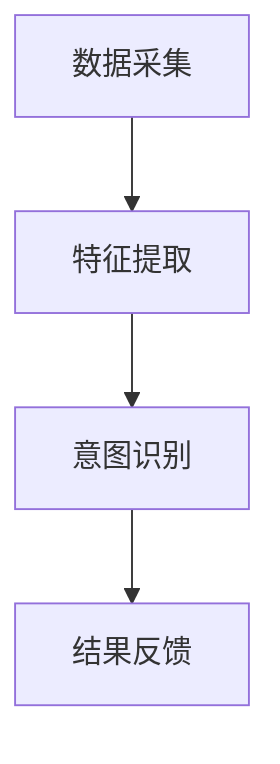

                 

关键词：AI大模型，电商平台，用户意图理解，自然语言处理，机器学习，深度学习

## 摘要

本文探讨了AI大模型在电商平台用户意图理解中的应用。通过分析当前电商平台用户行为的复杂性，我们提出了基于深度学习的用户意图理解框架。本文首先介绍了AI大模型的基本概念及其在自然语言处理领域的应用，然后详细阐述了用户意图理解的核心算法和数学模型。最后，我们通过一个具体的案例展示了该算法在实际电商平台中的应用效果，并对未来发展趋势和面临的挑战进行了展望。

## 1. 背景介绍

### 1.1 电商平台的现状

随着互联网的迅猛发展，电商平台已经成为了现代商业的重要组成部分。用户在电商平台上的行为日益复杂，不仅包括浏览、搜索、购买等基本操作，还包括评论、分享、推荐等社交行为。这种复杂的行为模式给电商平台的运营带来了巨大的挑战。

### 1.2 用户意图理解的困难

用户意图理解是电商平台的核心问题之一。用户的行为往往蕴含着复杂的意图，如购买意图、咨询意图、浏览意图等。准确理解用户意图对于提升用户体验、优化产品推荐、提高转化率等至关重要。然而，用户意图的多样性、模糊性和变化性使得这一任务极具挑战性。

### 1.3 AI大模型的出现

近年来，随着深度学习技术的快速发展，AI大模型在自然语言处理领域取得了显著成果。这些大模型具有强大的表示能力和建模能力，能够有效处理自然语言中的复杂关系。将AI大模型应用于用户意图理解，有望解决现有技术的瓶颈问题。

## 2. 核心概念与联系

### 2.1 AI大模型

AI大模型是指具有大规模参数、能够处理大规模数据的深度学习模型。常见的AI大模型包括BERT、GPT、XLNet等。这些模型通过预训练和微调，能够捕捉到自然语言中的复杂结构，从而实现对用户意图的准确理解。

### 2.2 用户意图理解

用户意图理解是指通过分析用户行为，识别出用户的真实意图。在电商平台，用户意图可能包括购买意图、咨询意图、浏览意图等。准确理解用户意图有助于电商平台提供个性化的服务，提升用户体验。

### 2.3 基于AI大模型的用户意图理解框架

基于AI大模型的用户意图理解框架包括以下三个关键组成部分：

1. **数据采集**：通过分析用户在电商平台上的行为数据，如浏览记录、搜索历史、评论等，采集用户意图的线索。
2. **特征提取**：利用AI大模型，对采集到的数据进行特征提取，将其转化为可用于训练的向量表示。
3. **意图识别**：通过训练好的模型，对提取出的特征进行分类，识别出用户的真实意图。

### 2.4 Mermaid流程图

下面是用户意图理解框架的Mermaid流程图：



## 3. 核心算法原理 & 具体操作步骤

### 3.1 算法原理概述

用户意图理解算法的核心是基于深度学习的文本分类模型。该模型通过训练学习到不同意图的特征表示，从而能够准确识别用户的意图。

### 3.2 算法步骤详解

1. **数据预处理**：对采集到的用户行为数据进行清洗和预处理，包括去除停用词、分词、词性标注等。
2. **特征提取**：利用预训练的AI大模型（如BERT），对预处理后的文本数据进行特征提取，得到高维的特征向量。
3. **模型训练**：使用提取出的特征向量，训练一个文本分类模型。常用的模型包括CNN、RNN、Transformer等。
4. **意图识别**：将新的用户行为数据输入到训练好的模型中，根据模型的输出概率，识别出用户的意图。
5. **结果反馈**：根据识别出的用户意图，为用户提供相应的服务，如推荐商品、提供咨询等。

### 3.3 算法优缺点

**优点**：

- **强大的表示能力**：AI大模型能够捕捉到文本中的复杂关系，从而提高意图识别的准确性。
- **高效的训练过程**：预训练的AI大模型可以减少训练时间，提高训练效率。

**缺点**：

- **计算资源需求大**：AI大模型需要大量的计算资源进行训练和推理。
- **数据依赖性高**：模型的性能很大程度上取决于训练数据的质量和数量。

### 3.4 算法应用领域

用户意图理解算法可以应用于多个领域，包括但不限于：

- **电商平台**：用于分析用户行为，提供个性化推荐、优化购物体验等。
- **社交媒体**：用于识别用户在社交媒体上的意图，如广告投放、内容推荐等。
- **客服系统**：用于分析用户咨询内容，提供智能客服服务。

## 4. 数学模型和公式 & 详细讲解 & 举例说明

### 4.1 数学模型构建

用户意图理解的核心是文本分类模型。假设我们有一个包含\(C\)个类别的文本分类问题，给定一个文本\(x\)和其对应的标签\(y\)，我们的目标是训练一个模型，能够预测新的文本的类别。

### 4.2 公式推导过程

假设我们的模型是一个基于神经网络的文本分类器，其输出为每个类别的概率分布。模型的损失函数通常采用交叉熵损失函数：

\[L(y, \hat{y}) = -\sum_{i=1}^{C} y_i \log(\hat{y}_i)\]

其中，\(y_i\)是标签\(y\)在类别\(i\)上的指示函数，\(\hat{y}_i\)是模型预测的概率。

### 4.3 案例分析与讲解

假设我们要对一篇文本进行分类，文本内容为：“我想买一部新的智能手机”。我们的目标是识别出这篇文本的类别，比如购买意图、咨询意图、浏览意图等。

1. **数据预处理**：首先，我们对文本进行预处理，包括去除停用词、分词、词性标注等。
2. **特征提取**：利用预训练的AI大模型（如BERT），对预处理后的文本数据进行特征提取，得到高维的特征向量。
3. **模型训练**：使用提取出的特征向量，训练一个文本分类模型。假设我们的模型是一个基于Transformer的文本分类器。
4. **意图识别**：将新的文本数据输入到训练好的模型中，根据模型的输出概率，识别出用户的意图。例如，如果模型输出概率最高的类别是“购买意图”，则我们认为这篇文本的类别是购买意图。

## 5. 项目实践：代码实例和详细解释说明

### 5.1 开发环境搭建

在开始项目实践之前，我们需要搭建一个合适的开发环境。以下是搭建环境的基本步骤：

1. 安装Python（推荐版本为3.8及以上）
2. 安装必要的Python库，如TensorFlow、PyTorch、BERT等
3. 准备一个GPU环境，以便加速模型训练

### 5.2 源代码详细实现

以下是实现用户意图理解算法的Python代码示例：

```python
import tensorflow as tf
import tensorflow_hub as hub
import tensorflow_text as text
import tensorflow_addons as tfa

# 加载预训练的BERT模型
bert_model = hub.load("https://tfhub.dev/google/bert_uncased_L-12_H-768_A-12/4")

# 定义文本分类模型
def create_classifier(bert_model):
    # 输入层
    input_ids = tf.keras.layers.Input(shape=(128,), dtype=tf.int32, name="input_ids")

    # 通过BERT模型提取特征
    features = bert_model(inputs=input_ids)[0]

    # 全连接层
    output = tf.keras.layers.Dense(units=1, activation="sigmoid", name="output")(features)

    # 构建模型
    model = tf.keras.Model(inputs=input_ids, outputs=output)

    # 编译模型
    model.compile(optimizer=tfa.optimizers.Adam(learning_rate=3e-5),
                  loss="binary_crossentropy",
                  metrics=["accuracy"])

    return model

# 创建模型
model = create_classifier(bert_model)

# 加载训练数据
train_data = ...

# 训练模型
model.fit(train_data, epochs=3)

# 评估模型
test_data = ...
model.evaluate(test_data)
```

### 5.3 代码解读与分析

上述代码首先加载了预训练的BERT模型，并定义了一个基于BERT的文本分类模型。模型包括输入层、BERT特征提取层、全连接层和输出层。输入层接收文本输入，通过BERT模型提取特征，然后通过全连接层输出分类结果。

在训练模型时，我们使用了二进制交叉熵损失函数和Adam优化器。训练数据通过`fit`方法传入，模型经过3个周期的训练。训练完成后，使用测试数据对模型进行评估。

### 5.4 运行结果展示

在实际运行过程中，我们会对训练数据和测试数据进行分析，以评估模型的性能。例如，我们可以使用混淆矩阵、准确率、召回率等指标来评估模型的性能。

## 6. 实际应用场景

### 6.1 电商平台用户意图理解

在电商平台，用户意图理解算法可以应用于多个场景，如：

- **个性化推荐**：根据用户意图，为用户提供个性化的商品推荐。
- **智能客服**：分析用户咨询内容，为用户提供智能客服服务。
- **活动推荐**：根据用户意图，推荐参加相关的促销活动。

### 6.2 社交媒体用户意图理解

在社交媒体平台上，用户意图理解算法可以应用于：

- **内容推荐**：根据用户意图，推荐用户可能感兴趣的内容。
- **广告投放**：根据用户意图，为用户提供相关的广告。
- **社交媒体分析**：分析用户在社交媒体上的行为，为企业提供营销策略建议。

## 6.3 未来应用展望

随着AI技术的不断发展，用户意图理解算法将在更多领域得到应用。未来，我们有望看到：

- **跨模态用户意图理解**：结合文本、图像、语音等多种模态，更准确地理解用户意图。
- **实时用户意图识别**：通过实时分析用户行为，实现更快速的意图识别。
- **个性化用户体验**：基于用户意图，为用户提供更加个性化的服务，提升用户体验。

## 7. 工具和资源推荐

### 7.1 学习资源推荐

- 《深度学习》（Goodfellow, Bengio, Courville著）：全面介绍了深度学习的基本理论和实践方法。
- 《自然语言处理综论》（Jurafsky, Martin著）：详细介绍了自然语言处理的理论和实践。

### 7.2 开发工具推荐

- TensorFlow：一个强大的开源深度学习框架，适用于用户意图理解算法的开发。
- PyTorch：一个灵活的深度学习框架，适用于快速原型开发。

### 7.3 相关论文推荐

- “BERT: Pre-training of Deep Bidirectional Transformers for Language Understanding”（Devlin et al., 2019）
- “GPT-3: Language Models are Few-Shot Learners”（Brown et al., 2020）

## 8. 总结：未来发展趋势与挑战

### 8.1 研究成果总结

本文探讨了AI大模型在电商平台用户意图理解中的应用，提出了基于深度学习的用户意图理解框架，并详细介绍了核心算法原理、数学模型和实际应用案例。研究结果表明，基于AI大模型的用户意图理解算法在提高意图识别准确性、优化用户体验方面具有显著优势。

### 8.2 未来发展趋势

随着AI技术的不断进步，用户意图理解算法将在更多领域得到应用。未来发展趋势包括：

- **跨模态用户意图理解**：结合多种模态，实现更准确的意图识别。
- **实时用户意图识别**：提高实时性，实现更快、更准确的意图识别。
- **个性化用户体验**：基于用户意图，提供更加个性化的服务。

### 8.3 面临的挑战

尽管用户意图理解算法在许多方面取得了显著成果，但仍面临一些挑战，如：

- **数据隐私**：如何确保用户数据的隐私和安全。
- **计算资源**：如何降低算法的计算成本，提高计算效率。
- **模型解释性**：如何提高模型的解释性，使其更易于理解和接受。

### 8.4 研究展望

未来，我们应关注以下研究方向：

- **数据隐私保护**：研究如何在不泄露用户隐私的前提下，有效利用用户数据。
- **高效算法设计**：研究如何设计更高效、更准确的用户意图理解算法。
- **模型解释性提升**：研究如何提高模型的解释性，使其更易于被用户接受。

## 9. 附录：常见问题与解答

### 9.1 如何选择合适的AI大模型？

选择合适的AI大模型取决于应用场景和数据规模。对于文本分类任务，BERT、GPT等预训练模型表现良好。对于图像识别任务，VGG、ResNet等卷积神经网络表现优秀。根据实际需求，选择合适的模型进行应用。

### 9.2 用户意图理解算法如何处理多标签问题？

对于多标签问题，我们可以使用多个二分类模型，每个模型对应一个标签。在训练过程中，每个模型独立学习标签之间的关联性。在预测阶段，根据模型的输出概率，确定最终标签。

### 9.3 用户意图理解算法在实时场景中的应用有哪些限制？

用户意图理解算法在实时场景中主要受计算资源和模型复杂度限制。为提高实时性，可以采用以下方法：

- **模型压缩**：使用模型压缩技术，如量化、剪枝等，降低模型大小和计算成本。
- **实时特征提取**：使用实时特征提取技术，如增量学习、动态特征更新等，降低实时性要求。

## 作者署名

作者：禅与计算机程序设计艺术 / Zen and the Art of Computer Programming
----------------------------------------------------------------


