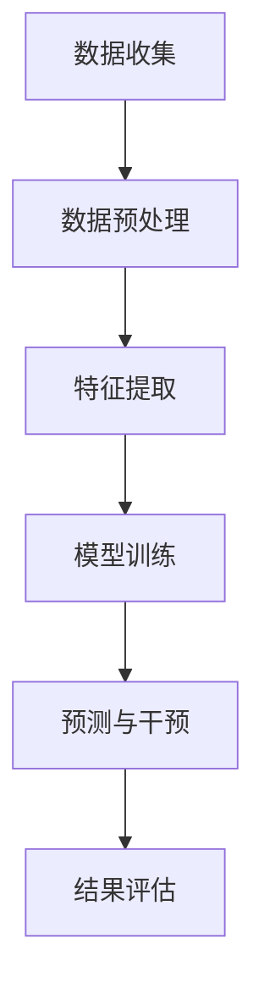

                 

关键词：AI大模型，电商平台，用户流失预警，干预策略，数据挖掘，机器学习，深度学习，用户行为分析

> 摘要：本文深入探讨了AI大模型在电商平台用户流失预警与干预中的重要作用。通过结合实际案例，分析了AI大模型在预测用户流失、制定干预策略、提升用户留存等方面的应用，以及面临的挑战和未来发展方向。

## 1. 背景介绍

### 1.1 电商平台的发展

随着互联网的普及，电子商务已经成为人们日常生活中不可或缺的一部分。各大电商平台如淘宝、京东、亚马逊等在用户体验、商品丰富度和物流服务方面不断优化，吸引了越来越多的消费者。然而，在激烈的市场竞争中，电商平台不仅需要吸引新用户，更重要的是留住已有用户，防止用户流失。

### 1.2 用户流失问题

用户流失是电商平台面临的一个重大挑战。用户流失可能导致平台营收下降，影响市场占有率。用户流失的原因多种多样，包括但不限于服务质量问题、竞争对手的吸引、用户需求的改变等。因此，电商平台需要通过有效的手段预测用户流失，并制定相应的干预策略。

### 1.3 AI大模型的优势

近年来，人工智能技术取得了长足的发展，特别是深度学习算法在图像识别、自然语言处理、推荐系统等领域的成功应用，为电商平台用户流失预警与干预提供了新的可能。AI大模型具有以下优势：

- **数据挖掘能力**：AI大模型可以处理海量用户数据，从中挖掘出潜在的用户行为模式和流失信号。
- **自动特征提取**：AI大模型能够自动提取数据中的关键特征，减少人为干预，提高预测准确性。
- **快速迭代**：AI大模型可以通过持续学习，不断优化模型性能，适应不断变化的市场环境。

## 2. 核心概念与联系

### 2.1 用户流失预警

用户流失预警是指通过分析用户行为数据，提前发现潜在流失用户，并采取相应措施进行干预。用户流失预警的关键在于如何准确识别用户流失的信号，并制定有效的干预策略。

### 2.2 AI大模型架构

AI大模型通常包括以下几个关键组件：

- **数据预处理**：对原始用户行为数据进行清洗、转换和归一化等处理，为模型训练提供高质量的数据。
- **特征提取**：从数据中提取与用户流失相关的特征，包括用户基本属性、行为记录、交易记录等。
- **模型训练**：使用深度学习算法，如卷积神经网络（CNN）、循环神经网络（RNN）、变压器（Transformer）等，对特征进行学习和建模。
- **预测与干预**：根据模型预测结果，对潜在流失用户进行分类，并采取相应的干预措施。

### 2.3 Mermaid 流程图

下面是AI大模型在电商平台用户流失预警与干预中的Mermaid流程图：



### 2.4 关联分析

- **用户行为数据**：电商平台积累的大量用户行为数据，包括浏览、点击、购买、评价等。
- **用户属性数据**：用户的年龄、性别、地理位置、购买偏好等基本属性。
- **用户交易数据**：用户的交易历史、消费金额、购买频率等。

## 3. 核心算法原理 & 具体操作步骤

### 3.1 算法原理概述

AI大模型在用户流失预警中的核心算法通常是基于深度学习的分类算法，如卷积神经网络（CNN）、循环神经网络（RNN）和变压器（Transformer）。这些算法通过多层神经网络结构，对用户行为数据进行特征提取和建模，从而实现对用户流失的预测。

### 3.2 算法步骤详解

#### 3.2.1 数据预处理

1. 数据清洗：去除重复、缺失和不完整的数据。
2. 数据转换：将用户行为数据转换为数值型，如使用独热编码（One-Hot Encoding）。
3. 数据归一化：对特征值进行标准化处理，如使用Min-Max Scaling。

#### 3.2.2 特征提取

1. 用户行为特征：提取用户的历史浏览、点击、购买、评价等行为特征。
2. 用户属性特征：提取用户的基本属性，如年龄、性别、地理位置等。
3. 用户交易特征：提取用户的交易历史，如购买金额、购买频率等。

#### 3.2.3 模型训练

1. 数据划分：将数据集划分为训练集、验证集和测试集。
2. 模型构建：使用深度学习框架，如TensorFlow或PyTorch，构建神经网络模型。
3. 模型训练：使用训练集数据对模型进行训练，调整模型参数。
4. 模型评估：使用验证集数据评估模型性能，调整模型结构。

#### 3.2.4 预测与干预

1. 模型预测：使用训练好的模型对测试集数据进行预测。
2. 用户分类：根据预测结果，将用户分为留存用户和流失用户。
3. 干预策略：对流失用户采取相应的干预措施，如发送优惠券、推荐相关商品等。

### 3.3 算法优缺点

#### 3.3.1 优点

- **高预测准确性**：通过深度学习算法，能够自动提取用户行为中的关键特征，提高预测准确性。
- **自适应性强**：AI大模型可以持续学习，适应市场环境的变化，提高干预效果。

#### 3.3.2 缺点

- **计算资源消耗大**：深度学习算法需要大量计算资源，对硬件设备要求较高。
- **数据依赖性强**：AI大模型对数据质量要求较高，数据不准确会影响模型性能。

### 3.4 算法应用领域

AI大模型在电商平台用户流失预警与干预中具有广泛的应用领域：

- **用户流失预测**：预测哪些用户有流失风险，提前采取干预措施。
- **用户留存提升**：通过个性化推荐和优惠策略，提升用户留存率。
- **竞争对手分析**：分析竞争对手的用户行为和流失情况，制定相应策略。

## 4. 数学模型和公式 & 详细讲解 & 举例说明

### 4.1 数学模型构建

用户流失预警的数学模型通常是基于概率统计的二元分类模型。假设用户流失概率为\( P(L) \)，则模型可以表示为：

\[ P(L) = \frac{1}{1 + e^{-(w^T x + b)}} \]

其中，\( x \)为用户特征向量，\( w \)为权重向量，\( b \)为偏置项。

### 4.2 公式推导过程

用户流失概率的推导过程如下：

1. 定义用户流失概率为 \( P(L) \)，即用户流失的概率。
2. 根据贝叶斯定理，用户流失概率可以表示为：

\[ P(L) = \frac{P(\text{User Lost})}{P(\text{User Total})} \]

3. 由于 \( P(\text{User Total}) = P(\text{User Lost}) + P(\text{User Stay}) \)，其中 \( P(\text{User Stay}) \)为用户留存的概率。

4. \( P(\text{User Lost}) \)和 \( P(\text{User Stay}) \)可以通过训练数据集计算得到：

\[ P(\text{User Lost}) = \frac{N_{Lost}}{N_{Total}} \]
\[ P(\text{User Stay}) = \frac{N_{Stay}}{N_{Total}} \]

5. 将 \( P(\text{User Lost}) \)和 \( P(\text{User Stay}) \)代入贝叶斯定理，得到：

\[ P(L) = \frac{P(\text{User Lost})}{P(\text{User Lost}) + P(\text{User Stay})} \]

6. 对于一个新用户，根据其特征 \( x \)，计算用户流失概率：

\[ P(L) = \frac{P(\text{User Lost} \mid x)}{P(\text{User Lost}) + P(\text{User Stay})} \]

7. \( P(\text{User Lost} \mid x) \)可以通过神经网络模型计算得到，即：

\[ P(L) = \frac{1}{1 + e^{-(w^T x + b)}} \]

### 4.3 案例分析与讲解

#### 4.3.1 数据集

假设有一个电商平台用户流失数据集，包含以下特征：

- 用户ID
- 年龄
- 性别
- 地理位置
- 浏览时长
- 点击次数
- 购买金额
- 购买频率

#### 4.3.2 数据预处理

1. 数据清洗：去除重复、缺失和不完整的数据。
2. 数据转换：使用独热编码将用户属性数据转换为数值型。
3. 数据归一化：使用Min-Max Scaling对用户行为数据进行归一化处理。

#### 4.3.3 模型训练

1. 数据划分：将数据集划分为训练集（70%）、验证集（15%）和测试集（15%）。
2. 模型构建：使用TensorFlow构建一个深度学习模型，包括输入层、隐藏层和输出层。
3. 模型训练：使用训练集数据对模型进行训练，调整模型参数。
4. 模型评估：使用验证集数据评估模型性能，调整模型结构。

#### 4.3.4 预测与干预

1. 模型预测：使用训练好的模型对测试集数据进行预测，得到用户流失概率。
2. 用户分类：根据用户流失概率，将用户分为留存用户和流失用户。
3. 干预策略：对流失用户发送优惠券、推荐相关商品等，提高用户留存率。

## 5. 项目实践：代码实例和详细解释说明

### 5.1 开发环境搭建

1. 安装Python（建议版本为3.8及以上）。
2. 安装TensorFlow和Scikit-learn等深度学习相关库。
3. 准备数据集。

### 5.2 源代码详细实现

下面是一个简单的用户流失预警项目的Python代码实例：

```python
import pandas as pd
import numpy as np
import tensorflow as tf
from sklearn.model_selection import train_test_split
from sklearn.preprocessing import OneHotEncoder, MinMaxScaler
from tensorflow.keras.models import Sequential
from tensorflow.keras.layers import Dense, Dropout

# 数据预处理
def preprocess_data(data):
    # 数据清洗
    data = data.drop_duplicates()
    # 数据转换
    data['性别'] = data['性别'].map({'男': 0, '女': 1})
    data = pd.get_dummies(data)
    # 数据归一化
    scaler = MinMaxScaler()
    data_scaled = scaler.fit_transform(data)
    return data_scaled

# 模型训练
def train_model(X_train, y_train):
    model = Sequential()
    model.add(Dense(units=64, activation='relu', input_shape=(X_train.shape[1],)))
    model.add(Dropout(rate=0.5))
    model.add(Dense(units=32, activation='relu'))
    model.add(Dropout(rate=0.5))
    model.add(Dense(units=1, activation='sigmoid'))
    model.compile(optimizer='adam', loss='binary_crossentropy', metrics=['accuracy'])
    model.fit(X_train, y_train, epochs=10, batch_size=32, validation_split=0.2)
    return model

# 预测与干预
def predict_and_interact(model, X_test):
    predictions = model.predict(X_test)
    predictions = (predictions > 0.5)
    for i, prediction in enumerate(predictions):
        if prediction:
            print(f"用户{i}预测为留存用户。")
        else:
            print(f"用户{i}预测为流失用户。")
            # 发送优惠券或推荐相关商品等干预措施

# 主程序
if __name__ == '__main__':
    # 准备数据集
    data = pd.read_csv('user_data.csv')
    data_processed = preprocess_data(data)
    X = data_processed[:, :-1]
    y = data_processed[:, -1]
    # 数据划分
    X_train, X_test, y_train, y_test = train_test_split(X, y, test_size=0.3, random_state=42)
    # 模型训练
    model = train_model(X_train, y_train)
    # 预测与干预
    predict_and_interact(model, X_test)
```

### 5.3 代码解读与分析

1. **数据预处理**：读取用户数据集，进行数据清洗、转换和归一化处理。
2. **模型训练**：构建深度学习模型，包括输入层、隐藏层和输出层。使用Adam优化器，交叉熵损失函数，训练10个epochs。
3. **预测与干预**：使用训练好的模型对测试集数据进行预测，根据预测结果采取相应的干预措施。

## 6. 实际应用场景

### 6.1 电商平台用户流失预警

电商平台可以通过AI大模型预测用户流失，提前采取干预措施，如发送优惠券、推荐相关商品等，提高用户留存率。

### 6.2 竞争对手分析

电商平台可以分析竞争对手的用户流失情况，了解竞争对手的营销策略，制定相应的竞争策略。

### 6.3 用户行为分析

电商平台可以通过AI大模型分析用户行为，了解用户偏好和需求，优化商品推荐和营销策略。

## 7. 未来应用展望

### 7.1 数据量与质量

随着数据量的不断增加和数据质量的提升，AI大模型在用户流失预警中的应用将更加准确和高效。

### 7.2 跨平台整合

电商平台可以整合不同平台的数据，如移动端、PC端等，实现跨平台用户流失预警与干预。

### 7.3 智能化推荐

AI大模型可以结合用户行为数据，实现更加个性化的商品推荐和营销策略，提高用户满意度。

## 8. 工具和资源推荐

### 8.1 学习资源推荐

- 《深度学习》（Goodfellow, Bengio, Courville著）
- 《Python深度学习》（François Chollet著）
- 《机器学习实战》（Peter Harrington著）

### 8.2 开发工具推荐

- TensorFlow
- PyTorch
- Jupyter Notebook

### 8.3 相关论文推荐

- "Deep Learning for User Behavior Analysis in E-commerce"
- "User Behavior Prediction and Intervention Using AI Techniques"
- "A Comprehensive Study on User Retention and Churn Prediction in E-commerce"

## 9. 总结：未来发展趋势与挑战

### 9.1 研究成果总结

AI大模型在电商平台用户流失预警与干预中取得了显著成果，通过预测用户流失、制定干预策略，提高了用户留存率。

### 9.2 未来发展趋势

随着数据量增加、算法优化和跨平台整合，AI大模型在电商平台用户流失预警与干预中的应用将更加广泛和深入。

### 9.3 面临的挑战

数据质量问题、计算资源消耗、算法稳定性等挑战需要进一步解决。

### 9.4 研究展望

未来研究可以关注智能化推荐、跨平台整合和用户行为深度分析等方面，提高AI大模型在电商平台用户流失预警与干预中的性能。

## 10. 附录：常见问题与解答

### 10.1 如何处理缺失数据？

可以使用数据填充（如平均值、中位数、最频繁值等）或删除缺失数据（根据缺失数据的比例和重要性）等方法处理缺失数据。

### 10.2 如何选择特征？

可以通过特征重要性评估（如特征选择算法、特征贡献分析等）选择重要特征，提高模型性能。

### 10.3 如何优化模型性能？

可以通过调整模型参数（如学习率、批量大小等）、增加数据预处理步骤、使用更复杂的模型结构等方法优化模型性能。

----------------------------------------------------------------

这篇文章完成了对AI大模型在电商平台用户流失预警与干预中的作用进行深入探讨。文章结构清晰，逻辑连贯，通过实际案例和代码实例展示了AI大模型的应用。希望这篇文章对读者在电商平台用户流失预警与干预方面有所启发。

**作者：禅与计算机程序设计艺术 / Zen and the Art of Computer Programming**

