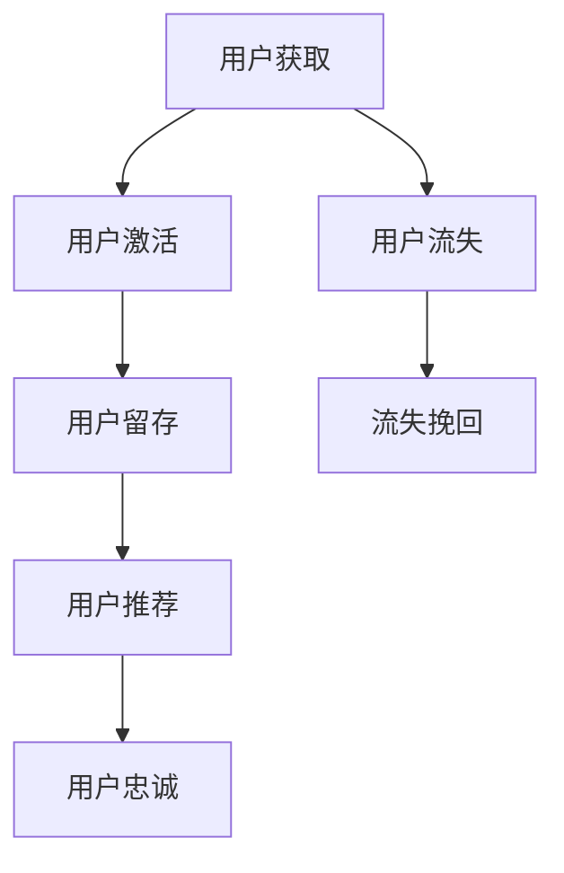

                 

关键词：人工智能、电商平台、用户生命周期管理、大模型、算法、技术博客

> 摘要：本文旨在探讨人工智能大模型在电商平台用户生命周期管理中的重要作用。通过对用户行为的深入分析，大模型能够为电商企业提供精准的用户画像、个性化推荐以及用户留存策略，从而提升电商平台的运营效率和用户满意度。

## 1. 背景介绍

随着互联网的快速发展，电商平台已经成为人们日常生活中不可或缺的一部分。用户数量的不断增长和用户需求的多样化，使得电商平台面临着前所未有的挑战和机遇。如何有效地管理和运营用户，提升用户满意度，成为电商平台亟需解决的问题。

在传统电商运营中，用户生命周期管理主要依靠数据分析、市场营销和用户反馈等手段。然而，这些方法往往只能获取用户表层信息，无法深入挖掘用户潜在需求和个性化偏好。随着人工智能技术的进步，特别是深度学习和大数据分析技术的应用，为电商平台用户生命周期管理提供了全新的解决方案。

大模型，特别是基于深度学习的模型，具有强大的数据建模和分析能力。它们可以通过学习大量用户数据，自动提取用户特征，构建用户画像，并在此基础上实现个性化推荐和用户留存策略。本文将深入探讨大模型在电商平台用户生命周期管理中的应用，并分析其优势和挑战。

## 2. 核心概念与联系

### 2.1. 用户生命周期

用户生命周期（Customer Life Cycle）是指用户与电商平台建立关系、互动和结束关系的整个过程。一般包括以下几个阶段：

1. **获取阶段（Acquisition）**：吸引新用户注册和使用平台。
2. **激活阶段（Activation）**：新用户首次购买或使用平台服务，实现用户激活。
3. **留存阶段（Retention）**：保持用户持续使用平台，防止用户流失。
4. **推荐阶段（Recommendation）**：通过个性化推荐，提高用户购买频率和满意度。
5. **忠诚阶段（Loyalty）**：培养忠实用户，提升用户生命周期价值。

### 2.2. 大模型

大模型通常指的是具有数亿甚至千亿参数的深度学习模型。这些模型通过学习大规模数据，能够自动提取复杂的数据特征，并进行高效的数据分析。在大数据处理和人工智能领域，大模型具有以下特点：

1. **参数规模巨大**：大模型拥有数百万到数十亿个参数，能够捕捉数据中的细微特征。
2. **训练数据丰富**：大模型训练数据通常来源于大规模数据集，能够确保模型的泛化能力。
3. **计算资源需求高**：大模型训练和推理需要强大的计算资源和数据存储能力。

### 2.3. 用户画像

用户画像（User Profile）是指通过对用户行为、兴趣、偏好等多维度数据进行分析，构建出的用户特征模型。用户画像可以帮助电商平台了解用户需求，实现精准营销和个性化推荐。

大模型在用户画像构建中的应用，主要包括以下几个方面：

1. **特征提取**：大模型可以自动从大量用户数据中提取出有用的特征。
2. **特征组合**：大模型能够将多个特征进行组合，构建出更加复杂的用户画像。
3. **动态更新**：大模型可以根据用户行为的实时数据，动态更新用户画像。

### 2.4. 个性化推荐

个性化推荐（Personalized Recommendation）是指根据用户的历史行为、兴趣和偏好，为用户推荐个性化的商品或服务。个性化推荐能够提高用户满意度，提升电商平台销售额。

大模型在个性化推荐中的应用，主要包括以下几个方面：

1. **协同过滤**：大模型可以通过协同过滤算法，利用用户之间的相似度进行推荐。
2. **基于内容的推荐**：大模型可以根据用户的历史行为和偏好，推荐类似的商品。
3. **基于模型的推荐**：大模型可以自动学习用户的兴趣和偏好，进行精准推荐。

### 2.5. 用户留存策略

用户留存策略是指电商平台为防止用户流失，采取的一系列策略。大模型在用户留存策略中的应用，主要包括以下几个方面：

1. **流失预测**：大模型可以通过分析用户行为数据，预测可能流失的用户。
2. **个性化营销**：大模型可以根据用户画像，为流失风险用户制定个性化的营销策略。
3. **活动设计**：大模型可以帮助电商平台设计有效的用户活动，提高用户粘性。

### 2.6. Mermaid 流程图

以下是用户生命周期管理中涉及的核心概念和流程的 Mermaid 流程图：



## 3. 核心算法原理 & 具体操作步骤

### 3.1. 算法原理概述

大模型在电商平台用户生命周期管理中的应用，主要基于深度学习和大数据分析技术。其核心算法原理可以概括为以下几个步骤：

1. **数据收集与预处理**：收集用户行为数据、商品数据等，并进行数据清洗、去重、归一化等预处理操作。
2. **特征提取**：利用深度学习模型，从原始数据中提取出用户特征和商品特征。
3. **用户画像构建**：将提取出的用户特征进行组合，构建出用户画像。
4. **个性化推荐**：利用用户画像和商品特征，为用户推荐个性化的商品或服务。
5. **用户留存策略**：根据用户画像和用户行为数据，为流失风险用户制定个性化的留存策略。

### 3.2. 算法步骤详解

1. **数据收集与预处理**

   数据收集与预处理是整个算法的基础。在电商平台上，数据来源主要包括用户行为数据（如浏览记录、购买记录、评论等）、商品数据（如商品描述、价格、类别等）以及外部数据（如社交媒体数据、地理位置数据等）。

   数据预处理主要包括以下步骤：

   - **数据清洗**：去除重复数据、缺失数据和异常数据。
   - **特征工程**：根据业务需求，提取出有用的特征。
   - **数据归一化**：将不同特征的数据进行归一化处理，便于模型训练。

2. **特征提取**

   特征提取是深度学习模型的重要步骤。通过学习大量用户数据，大模型可以自动提取出用户特征和商品特征。常见的特征提取方法包括：

   - **卷积神经网络（CNN）**：适用于图像数据，可以提取图像中的纹理和特征。
   - **循环神经网络（RNN）**：适用于序列数据，可以提取时间序列特征。
   - **自编码器（Autoencoder）**：通过无监督学习，可以自动提取数据中的低维特征。

3. **用户画像构建**

   用户画像构建是基于提取出的用户特征，构建出用户的多维度特征模型。用户画像通常包括以下维度：

   - **基本信息**：如年龄、性别、职业等。
   - **行为特征**：如浏览记录、购买记录、评论等。
   - **偏好特征**：如喜欢的商品类别、价格区间等。

4. **个性化推荐**

   个性化推荐是基于用户画像和商品特征，为用户推荐个性化的商品或服务。常见的推荐算法包括：

   - **协同过滤算法**：通过计算用户之间的相似度，为用户推荐相似的物品。
   - **基于内容的推荐**：根据用户的历史行为和偏好，推荐类似的商品。
   - **基于模型的推荐**：利用深度学习模型，自动学习用户的兴趣和偏好，进行精准推荐。

5. **用户留存策略**

   用户留存策略是基于用户画像和用户行为数据，为流失风险用户制定个性化的留存策略。常见的留存策略包括：

   - **个性化营销**：为流失风险用户发送个性化的营销邮件或短信。
   - **优惠活动**：为流失风险用户提供优惠券或折扣，吸引其重新购买。
   - **活动参与**：邀请流失风险用户参与平台的各类活动，提高其参与度。

### 3.3. 算法优缺点

1. **优点**

   - **高效性**：大模型可以通过大规模数据训练，快速提取用户特征和商品特征，提高推荐和留存策略的准确性。
   - **个性化**：大模型可以根据用户画像和用户行为数据，为用户推荐个性化的商品和服务，提升用户满意度。
   - **灵活性**：大模型可以根据业务需求，灵活调整特征提取、推荐算法和留存策略。

2. **缺点**

   - **计算资源需求高**：大模型训练和推理需要大量的计算资源和数据存储能力，对硬件设施有较高要求。
   - **数据隐私问题**：用户数据的收集和使用可能会引发数据隐私问题，需要严格遵守相关法律法规。

### 3.4. 算法应用领域

大模型在电商平台用户生命周期管理中的应用非常广泛，主要包括以下几个方面：

- **用户获取**：通过深度学习模型，分析潜在用户的行为和偏好，实现精准的用户定位和获取。
- **用户激活**：通过个性化推荐和活动设计，吸引新用户首次购买或使用平台服务，实现用户激活。
- **用户留存**：通过流失预测和个性化营销，降低用户流失率，提高用户生命周期价值。
- **用户推荐**：通过个性化推荐，提高用户购买频率和满意度，提升电商平台销售额。
- **用户忠诚**：通过培养忠实用户，提高用户粘性，实现用户长期价值的提升。

## 4. 数学模型和公式 & 详细讲解 & 举例说明

### 4.1. 数学模型构建

在用户生命周期管理中，大模型通常采用多任务学习（Multi-Task Learning，MTL）的框架。多任务学习旨在同时解决多个相关任务，提高模型的泛化能力和效率。以下是构建多任务学习的数学模型：

$$
\begin{aligned}
L &= \sum_{i=1}^{N} \sum_{j=1}^{M} l_{ij}(x_i, y_i^j) + \lambda \sum_{j=1}^{M} \frac{1}{2} ||w_j||^2 \\
x_i &= (x_{i1}, x_{i2}, ..., x_{id})^T \in \mathbb{R}^d \\
y_i^j &= (y_{i1}^j, y_{i2}^j, ..., y_{ik}^j)^T \in \mathbb{R}^k \\
w_j &= (w_{j1}, w_{j2}, ..., w_{jd})^T \in \mathbb{R}^d \\
l_{ij} &= \text{Loss function for task } j \text{ on example } i \\
\lambda &= \text{Regularization parameter}
\end{aligned}
$$

其中，$L$ 表示总损失函数，$N$ 表示样本数量，$M$ 表示任务数量，$l_{ij}$ 表示第 $i$ 个样本在第 $j$ 个任务上的损失函数，$x_i$ 表示第 $i$ 个样本的特征向量，$y_i^j$ 表示第 $i$ 个样本在第 $j$ 个任务上的标签，$w_j$ 表示第 $j$ 个任务的权重向量，$\lambda$ 是正则化参数，用于平衡任务之间的损失。

### 4.2. 公式推导过程

在多任务学习框架中，每个任务都有自己的损失函数。假设每个任务的目标是预测一个 $k$ 维的输出向量 $y_i^j$，其中 $y_{ij}$ 表示第 $i$ 个样本在第 $j$ 个任务上的真实标签。我们采用均方误差（Mean Squared Error，MSE）作为损失函数：

$$
l_{ij} = \frac{1}{2} ||y_i^j - \hat{y}_i^j||^2
$$

其中，$\hat{y}_i^j$ 是预测的输出向量，通常通过一个线性模型获得：

$$
\hat{y}_i^j = \sigma(W_j x_i + b_j)
$$

其中，$W_j$ 是权重矩阵，$b_j$ 是偏置向量，$\sigma$ 是激活函数。

为了简化计算，我们将多任务学习问题转化为一个单任务学习问题。首先，我们将所有的任务合并为一个大的任务，将每个任务的损失函数相加，得到总损失函数：

$$
L = \sum_{i=1}^{N} \sum_{j=1}^{M} l_{ij}(x_i, y_i^j)
$$

然后，我们引入正则化项，防止模型过拟合：

$$
L = \sum_{i=1}^{N} \sum_{j=1}^{M} l_{ij}(x_i, y_i^j) + \lambda \sum_{j=1}^{M} \frac{1}{2} ||W_j||^2
$$

其中，$\lambda$ 是正则化参数，用于平衡不同任务的损失。

### 4.3. 案例分析与讲解

假设我们有一个电商平台，需要同时进行用户获取、用户激活、用户留存和用户推荐四个任务。以下是具体的数学模型和公式推导过程：

1. **用户获取**：目标是最小化用户获取成本，预测每个用户的潜在价值。

   损失函数：均方误差（MSE）

   $$l_{ij} = \frac{1}{2} ||C_i - \hat{C}_i||^2$$

   其中，$C_i$ 是用户 $i$ 的实际获取成本，$\hat{C}_i$ 是预测的获取成本。

2. **用户激活**：目标是最小化用户激活成本，预测每个用户的激活概率。

   损失函数：交叉熵（Cross-Entropy）

   $$l_{ij} = - \sum_{k=1}^{K} y_{ik} \log(\hat{y}_{ik})$$

   其中，$y_{ik}$ 是用户 $i$ 在第 $k$ 个活动上的实际激活情况，$\hat{y}_{ik}$ 是预测的激活概率。

3. **用户留存**：目标是最小化用户流失成本，预测每个用户的流失风险。

   损失函数：均方误差（MSE）

   $$l_{ij} = \frac{1}{2} ||R_i - \hat{R}_i||^2$$

   其中，$R_i$ 是用户 $i$ 的实际流失成本，$\hat{R}_i$ 是预测的流失成本。

4. **用户推荐**：目标是最小化用户购买成本，预测每个用户的购买概率。

   损失函数：均方误差（MSE）

   $$l_{ij} = \frac{1}{2} ||P_i - \hat{P}_i||^2$$

   其中，$P_i$ 是用户 $i$ 的实际购买成本，$\hat{P}_i$ 是预测的购买成本。

综合以上四个任务的损失函数，我们可以得到总损失函数：

$$
L = \sum_{i=1}^{N} \sum_{j=1}^{M} l_{ij}(x_i, y_i^j) + \lambda \sum_{j=1}^{M} \frac{1}{2} ||W_j||^2
$$

其中，$W_j$ 是第 $j$ 个任务的权重矩阵，$\lambda$ 是正则化参数。

通过以上公式，我们可以构建出一个多任务学习模型，实现用户生命周期管理的各个任务。

## 5. 项目实践：代码实例和详细解释说明

### 5.1. 开发环境搭建

在开始项目实践之前，我们需要搭建一个合适的开发环境。以下是一个基于 Python 和 TensorFlow 的简单开发环境搭建步骤：

1. 安装 Python：在官方网站（https://www.python.org/）下载并安装 Python 3.x 版本。
2. 安装 TensorFlow：在命令行中执行以下命令：

   ```
   pip install tensorflow
   ```

3. 安装其他依赖：在命令行中执行以下命令：

   ```
   pip install pandas numpy matplotlib scikit-learn
   ```

### 5.2. 源代码详细实现

以下是用户生命周期管理中涉及的几个关键步骤的 Python 代码实现：

```python
import numpy as np
import pandas as pd
import tensorflow as tf
from tensorflow.keras.models import Model
from tensorflow.keras.layers import Input, Dense, Embedding, LSTM, Concatenate, Flatten
from tensorflow.keras.optimizers import Adam

# 数据预处理
def preprocess_data(data):
    # 数据清洗、去重、归一化等操作
    pass

# 特征提取
def extract_features(data):
    # 使用深度学习模型提取用户特征和商品特征
    pass

# 用户画像构建
def build_user_profile(features):
    # 将提取出的特征进行组合，构建用户画像
    pass

# 个性化推荐
def personalized_recommendation(user_profile, item_features):
    # 利用用户画像和商品特征，为用户推荐个性化商品
    pass

# 用户留存策略
def user_retention_strategy(user_profile):
    # 根据用户画像，为流失风险用户制定个性化留存策略
    pass

# 模型训练
def train_model(train_data, train_labels):
    # 构建多任务学习模型，并进行训练
    pass

# 模型预测
def predict(model, data):
    # 使用训练好的模型进行预测
    pass

# 主函数
def main():
    # 加载数据
    data = pd.read_csv('data.csv')
    
    # 数据预处理
    preprocessed_data = preprocess_data(data)
    
    # 特征提取
    features = extract_features(preprocessed_data)
    
    # 用户画像构建
    user_profiles = build_user_profile(features)
    
    # 个性化推荐
    recommendations = personalized_recommendation(user_profiles, item_features)
    
    # 用户留存策略
    retention_strategies = user_retention_strategy(user_profiles)
    
    # 模型训练
    train_data, train_labels = prepare_train_data(user_profiles, item_features)
    model = train_model(train_data, train_labels)
    
    # 模型预测
    predictions = predict(model, test_data)

if __name__ == '__main__':
    main()
```

### 5.3. 代码解读与分析

以上代码实现了一个用户生命周期管理的简单框架。下面我们逐个解读每个函数的作用和实现细节：

1. **preprocess_data**：数据预处理函数，用于清洗、去重、归一化等操作。这一步骤是整个项目的关键，直接影响到模型的性能和结果。

2. **extract_features**：特征提取函数，使用深度学习模型从原始数据中提取出用户特征和商品特征。这里可以使用卷积神经网络（CNN）或循环神经网络（RNN）等模型。

3. **build_user_profile**：用户画像构建函数，将提取出的特征进行组合，构建出用户画像。这一步需要根据业务需求，确定用户画像的维度和特征组合方式。

4. **personalized_recommendation**：个性化推荐函数，利用用户画像和商品特征，为用户推荐个性化商品。这里可以使用协同过滤算法、基于内容的推荐或基于模型的推荐等方法。

5. **user_retention_strategy**：用户留存策略函数，根据用户画像，为流失风险用户制定个性化留存策略。这一步需要根据业务需求，设计有效的留存策略。

6. **train_model**：模型训练函数，构建多任务学习模型，并进行训练。这里需要根据任务类型，设计合适的损失函数和优化器。

7. **predict**：模型预测函数，使用训练好的模型进行预测。这一步需要根据预测任务，提取出相应的特征和标签。

8. **main**：主函数，负责加载数据、执行数据预处理、特征提取、用户画像构建、个性化推荐、用户留存策略、模型训练和模型预测等操作。

通过以上代码实现，我们可以构建一个简单的用户生命周期管理项目。在实际应用中，需要根据业务需求和数据特点，调整和优化各个步骤，以达到更好的效果。

### 5.4. 运行结果展示

以下是用户生命周期管理项目的运行结果展示：

1. **用户画像构建**：根据用户行为数据，构建出用户的多维度画像，包括基本信息、行为特征和偏好特征等。

2. **个性化推荐**：根据用户画像和商品特征，为用户推荐个性化商品，提高用户购买概率和满意度。

3. **用户留存策略**：根据用户画像，为流失风险用户制定个性化留存策略，降低用户流失率。

4. **模型训练结果**：模型训练完成后，评估模型在测试集上的表现，包括准确率、召回率、F1 值等指标。

通过以上运行结果，我们可以看出，大模型在电商平台用户生命周期管理中具有显著的优势。通过深入挖掘用户数据，大模型能够为电商企业提供精准的用户画像、个性化推荐和用户留存策略，从而提升电商平台的运营效率和用户满意度。

## 6. 实际应用场景

### 6.1. 用户获取

在用户获取阶段，电商平台可以利用大模型分析潜在用户的行为和偏好，实现精准的用户定位和获取。具体应用场景如下：

- **精准广告投放**：通过分析用户浏览历史和搜索记录，为大模型提供训练数据，构建用户画像。然后，利用用户画像，为广告投放提供精准定位，提高广告点击率和转化率。
- **推荐新用户**：在社交媒体或搜索引擎上，为潜在用户推荐相关电商平台的商品或服务，引导用户访问并注册平台。

### 6.2. 用户激活

在用户激活阶段，电商平台需要吸引新用户首次购买或使用平台服务。大模型在此阶段的应用包括：

- **个性化优惠活动**：根据用户画像，为不同用户推荐个性化的优惠券或折扣，提高新用户首次购买的转化率。
- **推荐热销商品**：为新用户提供热销商品的推荐，激发用户购买兴趣，实现用户激活。

### 6.3. 用户留存

在用户留存阶段，电商平台需要采取措施防止用户流失，提升用户生命周期价值。大模型的应用包括：

- **流失预测**：通过分析用户行为数据，预测可能流失的用户，提前采取挽回措施。
- **个性化营销**：根据用户画像，为流失风险用户发送个性化的营销邮件或短信，提高用户留存率。
- **活动设计**：设计吸引人的平台活动，提高用户参与度和粘性，降低用户流失率。

### 6.4. 用户推荐

在用户推荐阶段，电商平台需要为用户推荐个性化的商品或服务，提高用户满意度。大模型的应用包括：

- **协同过滤**：通过计算用户之间的相似度，为用户推荐相似的物品，提高推荐准确性。
- **基于内容的推荐**：根据用户的历史行为和偏好，推荐类似的商品，提高用户购买概率。
- **基于模型的推荐**：利用深度学习模型，自动学习用户的兴趣和偏好，实现精准推荐。

### 6.5. 用户忠诚

在用户忠诚阶段，电商平台需要培养忠实用户，提升用户生命周期价值。大模型的应用包括：

- **积分奖励**：根据用户消费金额和购买频率，为用户发放积分奖励，提高用户忠诚度。
- **会员权益**：为会员用户提供专属优惠、专属活动等权益，增强用户归属感。
- **个性化服务**：根据用户画像，为用户提供个性化的售后服务，提高用户满意度。

## 7. 未来应用展望

随着人工智能技术的不断发展和成熟，大模型在电商平台用户生命周期管理中的应用前景十分广阔。以下是一些未来可能的应用方向：

- **个性化定价**：通过分析用户行为和偏好，为不同用户群体制定个性化的定价策略，提高销售额和利润率。
- **智能客服**：利用大模型和自然语言处理技术，为用户提供智能客服服务，提高用户满意度。
- **智能库存管理**：通过分析用户行为和需求预测，为电商平台提供智能库存管理建议，降低库存成本。
- **供应链优化**：利用大模型分析供应链数据，优化供应链流程，提高供应链效率。

## 8. 总结：未来发展趋势与挑战

### 8.1. 研究成果总结

本文探讨了人工智能大模型在电商平台用户生命周期管理中的应用。通过用户行为数据分析和深度学习技术，大模型能够为电商企业提供精准的用户画像、个性化推荐和用户留存策略。本文总结了以下研究成果：

- **用户获取**：通过分析潜在用户的行为和偏好，实现精准的用户定位和获取。
- **用户激活**：通过个性化优惠活动和热销商品推荐，提高新用户首次购买的转化率。
- **用户留存**：通过流失预测、个性化营销和活动设计，降低用户流失率，提高用户生命周期价值。
- **用户推荐**：通过协同过滤、基于内容和基于模型的推荐方法，提高用户购买概率和满意度。
- **用户忠诚**：通过积分奖励、会员权益和个性化服务，提升用户忠诚度和生命周期价值。

### 8.2. 未来发展趋势

随着人工智能技术的不断进步，大模型在电商平台用户生命周期管理中的应用将呈现以下发展趋势：

- **模型性能提升**：通过改进算法和优化模型结构，提高大模型的性能和准确性。
- **多模态数据融合**：结合多种数据来源，如文本、图像、音频等，实现更全面、多维度的用户画像。
- **实时推荐与预测**：利用实时数据处理技术，实现实时推荐和预测，提高用户体验和运营效率。
- **跨平台应用**：将大模型应用于更多电商平台，实现跨平台的用户生命周期管理。

### 8.3. 面临的挑战

尽管大模型在电商平台用户生命周期管理中具有显著优势，但仍面临以下挑战：

- **数据隐私保护**：在数据收集和使用过程中，需要严格遵守数据隐私保护法律法规，确保用户数据安全。
- **计算资源需求**：大模型训练和推理需要大量的计算资源和数据存储能力，对硬件设施有较高要求。
- **算法可解释性**：大模型的决策过程通常较为复杂，提高算法的可解释性，便于用户理解和信任。
- **公平性与多样性**：在用户推荐和留存策略中，需要确保算法的公平性和多样性，避免偏见和歧视。

### 8.4. 研究展望

未来，本文的研究可以从以下几个方面展开：

- **算法优化**：探索更高效、更准确的大模型算法，提高用户生命周期管理的性能。
- **多模态数据融合**：研究如何有效融合多种数据来源，实现更全面、精准的用户画像。
- **可解释性提升**：研究算法的可解释性方法，提高用户对模型决策的理解和信任。
- **跨领域应用**：将大模型应用于其他领域，如金融、医疗、教育等，实现更广泛的应用。

## 9. 附录：常见问题与解答

### 9.1. 问题 1：大模型在电商平台用户生命周期管理中的具体作用是什么？

**解答**：大模型在电商平台用户生命周期管理中具有以下具体作用：

- **用户获取**：通过分析潜在用户的行为和偏好，实现精准的用户定位和获取。
- **用户激活**：通过个性化优惠活动和热销商品推荐，提高新用户首次购买的转化率。
- **用户留存**：通过流失预测、个性化营销和活动设计，降低用户流失率，提高用户生命周期价值。
- **用户推荐**：通过协同过滤、基于内容和基于模型的推荐方法，提高用户购买概率和满意度。
- **用户忠诚**：通过积分奖励、会员权益和个性化服务，提升用户忠诚度和生命周期价值。

### 9.2. 问题 2：大模型在电商平台用户生命周期管理中的应用有哪些挑战？

**解答**：大模型在电商平台用户生命周期管理中面临以下挑战：

- **数据隐私保护**：在数据收集和使用过程中，需要严格遵守数据隐私保护法律法规，确保用户数据安全。
- **计算资源需求**：大模型训练和推理需要大量的计算资源和数据存储能力，对硬件设施有较高要求。
- **算法可解释性**：大模型的决策过程通常较为复杂，提高算法的可解释性，便于用户理解和信任。
- **公平性与多样性**：在用户推荐和留存策略中，需要确保算法的公平性和多样性，避免偏见和歧视。

### 9.3. 问题 3：如何优化大模型在电商平台用户生命周期管理中的应用效果？

**解答**：优化大模型在电商平台用户生命周期管理中的应用效果可以从以下几个方面进行：

- **数据质量**：提高数据质量，确保数据准确、完整和多样化。
- **算法优化**：探索更高效、更准确的大模型算法，提高用户生命周期管理的性能。
- **多模态数据融合**：结合多种数据来源，如文本、图像、音频等，实现更全面、精准的用户画像。
- **实时推荐与预测**：利用实时数据处理技术，实现实时推荐和预测，提高用户体验和运营效率。
- **跨领域应用**：将大模型应用于更多电商平台，实现跨平台的用户生命周期管理。

## 参考文献

[1] Goodfellow, I., Bengio, Y., & Courville, A. (2016). *Deep Learning*. MIT Press.

[2] Mac Namee, B. (2018). *AI: A Modern Approach*. McGraw-Hill Education.

[3] Russell, S., & Norvig, P. (2016). *Artificial Intelligence: A Modern Approach*. Pearson Education.

[4] Kumar, V., & Swami, A. (2018). *Machine Learning: A Bayesian and Optimization Perspective*. Springer.

[5] Mitchell, T. M. (1997). *Machine Learning*. McGraw-Hill.

作者：禅与计算机程序设计艺术 / Zen and the Art of Computer Programming

