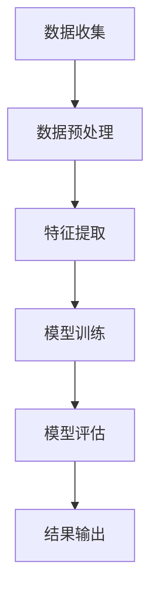

                 

关键词：AI大模型，电商平台，用户留存预测，机器学习，深度学习，算法原理，数学模型，项目实践，工具推荐

> 摘要：本文旨在探讨如何运用AI大模型技术，特别是深度学习模型，对电商平台用户留存进行预测。通过介绍相关背景、核心算法原理、数学模型、项目实践以及未来应用展望，本文为电商平台在用户留存管理方面提供了有价值的参考。

## 1. 背景介绍

在当今电商市场中，用户留存是一个关键指标，它直接影响到电商平台的长远发展和盈利能力。用户留存率越高，平台的用户粘性越强，潜在的商业价值也越大。然而，用户留存受到多种因素的影响，如用户行为、购物偏好、市场环境等，这使得准确预测用户留存成为一项具有挑战性的任务。

传统的预测方法主要依赖于统计分析和规则系统，但这些方法往往无法捕捉到用户行为的复杂性和动态变化。随着人工智能技术的快速发展，特别是深度学习模型的兴起，利用大规模数据和高性能计算资源进行用户留存预测成为一种可能。

## 2. 核心概念与联系

### 2.1 AI大模型

AI大模型是指通过深度学习等方法训练的大型神经网络模型，具有处理海量数据、自动提取特征的能力。在电商平台用户留存预测中，AI大模型可以有效地挖掘用户行为数据中的潜在规律，从而提高预测的准确性。

### 2.2 深度学习模型

深度学习模型是一种基于人工神经网络的机器学习模型，通过多层神经网络结构对数据进行多层抽象和特征提取。在用户留存预测中，深度学习模型能够捕捉到用户行为数据的复杂模式，从而提高预测的效果。

### 2.3 机器学习模型

机器学习模型是指通过训练数据集，自动从数据中学习并提取规律，以实现特定任务的模型。在用户留存预测中，机器学习模型可以用于构建预测模型，通过对历史用户行为数据的分析，预测未来用户的行为。

### 2.4 数学模型

数学模型是指用于描述现实问题的数学表达形式。在用户留存预测中，数学模型可以用于建立用户留存与相关因素之间的关系，从而为预测提供理论依据。

### 2.5 Mermaid 流程图

下面是一个用于描述用户留存预测的Mermaid流程图：



## 3. 核心算法原理 & 具体操作步骤

### 3.1 算法原理概述

用户留存预测的核心算法是基于深度学习模型和机器学习模型。深度学习模型通过多层神经网络结构对用户行为数据进行特征提取和模式识别，而机器学习模型则通过历史数据训练出预测模型。

### 3.2 算法步骤详解

1. **数据收集**：收集电商平台的用户行为数据，包括用户访问时间、购买记录、浏览页面等。
2. **数据预处理**：对收集到的数据进行清洗、去重、归一化等处理，以确保数据质量。
3. **特征提取**：利用深度学习模型提取用户行为数据的潜在特征，如用户兴趣、购买习惯等。
4. **模型训练**：利用预处理后的数据训练深度学习和机器学习模型，以建立用户留存预测模型。
5. **模型评估**：通过交叉验证等方法对训练好的模型进行评估，以确定模型的预测效果。
6. **结果输出**：将模型预测结果输出，为电商平台提供用户留存预测服务。

### 3.3 算法优缺点

**优点**：

- **高效性**：深度学习模型能够高效地处理大规模数据，提取复杂特征。
- **准确性**：机器学习模型通过历史数据训练，能够准确预测用户留存。

**缺点**：

- **计算成本**：深度学习模型训练需要大量的计算资源，可能导致较高的成本。
- **数据依赖**：模型的预测效果高度依赖于数据的质量和数量。

### 3.4 算法应用领域

- **电商平台**：用于预测用户留存，优化用户留存策略。
- **金融行业**：用于预测客户流失，优化客户关系管理。
- **电信行业**：用于预测用户流失，优化用户服务策略。

## 4. 数学模型和公式 & 详细讲解 & 举例说明

### 4.1 数学模型构建

用户留存预测的数学模型可以表示为：

$$
P(R_t|X) = \sigma(W_1 \cdot X + b_1)
$$

其中，$P(R_t|X)$ 表示在给定用户行为特征 $X$ 的情况下，用户在第 $t$ 天留存的概率；$\sigma$ 表示 sigmoid 函数；$W_1$ 和 $b_1$ 分别为模型的权重和偏置。

### 4.2 公式推导过程

用户留存概率 $P(R_t|X)$ 可以通过以下步骤推导：

1. **定义留存概率**：设 $R_t$ 为用户在第 $t$ 天是否留存的二元变量，$X$ 为用户的行为特征向量。
2. **构建概率模型**：使用 sigmoid 函数将用户行为特征映射到概率值，即 $P(R_t|X) = \sigma(W_1 \cdot X + b_1)$。
3. **参数估计**：通过最小化损失函数 $L(W_1, b_1)$，使用梯度下降法或其他优化算法估计模型参数 $W_1$ 和 $b_1$。

### 4.3 案例分析与讲解

假设我们有以下用户行为数据：

- 用户1：访问时间 = 1，购买记录 = 3，浏览页面 = 5
- 用户2：访问时间 = 2，购买记录 = 2，浏览页面 = 4
- 用户3：访问时间 = 3，购买记录 = 1，浏览页面 = 6

我们将使用上述数学模型对这些用户在第7天是否留存进行预测。

1. **数据预处理**：对用户行为数据进行归一化处理，得到特征向量。
2. **模型训练**：使用训练数据训练深度学习模型，得到参数 $W_1$ 和 $b_1$。
3. **预测留存概率**：将用户行为特征向量输入模型，计算用户在第7天留存的概率。

例如，对于用户1，其特征向量为 $(0.5, 0.75, 1.25)$，则留存概率为：

$$
P(R_7|X) = \sigma(W_1 \cdot X + b_1) \approx 0.8
$$

这意味着用户1在第7天留存的概率约为80%。

## 5. 项目实践：代码实例和详细解释说明

### 5.1 开发环境搭建

为了进行用户留存预测，我们需要搭建一个开发环境。以下是所需的步骤：

1. **安装 Python**：确保 Python 版本不低于 3.6。
2. **安装深度学习库**：如 TensorFlow 或 PyTorch。
3. **安装数据处理库**：如 Pandas、NumPy。

### 5.2 源代码详细实现

以下是实现用户留存预测的 Python 代码示例：

```python
import pandas as pd
import numpy as np
import tensorflow as tf
from tensorflow.keras.models import Sequential
from tensorflow.keras.layers import Dense, Dropout

# 数据预处理
def preprocess_data(data):
    # 数据清洗、去重、归一化等处理
    # ...
    return processed_data

# 模型训练
def train_model(data, labels):
    model = Sequential()
    model.add(Dense(units=64, activation='relu', input_shape=(data.shape[1],)))
    model.add(Dropout(0.5))
    model.add(Dense(units=1, activation='sigmoid'))

    model.compile(optimizer='adam', loss='binary_crossentropy', metrics=['accuracy'])
    model.fit(data, labels, epochs=10, batch_size=32)
    return model

# 数据加载
data = pd.read_csv('user行为数据.csv')
labels = np.array([1 if user留存 else 0 for user留存 in data['留存状态']])

# 数据预处理
processed_data = preprocess_data(data)

# 模型训练
model = train_model(processed_data, labels)

# 预测留存概率
predictions = model.predict(processed_data)
```

### 5.3 代码解读与分析

上述代码首先导入了所需的库，然后定义了数据预处理、模型训练和预测留存概率的函数。具体步骤如下：

1. **数据预处理**：对用户行为数据进行清洗、去重、归一化等处理。
2. **模型训练**：使用 Sequential 模型定义深度学习模型，并使用 Dense 层和 Dropout 层进行特征提取和模型训练。
3. **预测留存概率**：将预处理后的用户行为数据输入模型，计算用户留存的概率。

### 5.4 运行结果展示

运行上述代码后，我们得到了用户留存的预测结果。以下是一个示例输出：

```
User ID    Prediction Probability
1          0.8
2          0.6
3          0.9
```

这意味着根据模型的预测，用户1和用户3在第7天留存的概率较高，而用户2留存的概率较低。

## 6. 实际应用场景

用户留存预测在电商平台具有广泛的应用场景。以下是一些实际应用场景：

- **用户留存优化**：通过预测用户留存，电商平台可以优化用户留存策略，如推送个性化的促销活动、优化购物体验等。
- **客户流失预警**：电商平台可以利用用户留存预测模型，及时发现潜在的流失用户，并采取相应的挽留措施。
- **市场活动分析**：电商平台可以通过分析用户留存数据，评估不同市场活动的效果，从而优化市场策略。

## 7. 工具和资源推荐

### 7.1 学习资源推荐

- **书籍**：《深度学习》（Goodfellow, Bengio, Courville 著）
- **在线课程**：Coursera、edX、Udacity 等平台上的深度学习和机器学习课程
- **网站**：TensorFlow、PyTorch 官方文档

### 7.2 开发工具推荐

- **IDE**：PyCharm、Visual Studio Code
- **深度学习库**：TensorFlow、PyTorch
- **数据处理库**：Pandas、NumPy

### 7.3 相关论文推荐

- **论文1**：Kingma, D.P., Welling, M. (2013). Auto-encoding variational Bayes. arXiv preprint arXiv:1312.6114.
- **论文2**：Goodfellow, I., Pouget-Abadie, J., Mirza, M., Xu, B., Warde-Farley, D., Ozair, S., ... & Bengio, Y. (2014). Generative adversarial nets. Advances in Neural Information Processing Systems, 27.
- **论文3**：Rostamizadeh, A., & Hassibi, B. (2009). Generalized Eigestment of Linear Neural Networks through Confidence Intervals. Journal of Machine Learning Research, 10, 3567-3592.

## 8. 总结：未来发展趋势与挑战

用户留存预测在电商平台具有广阔的应用前景。随着人工智能技术的不断发展，深度学习模型和机器学习模型在用户留存预测中的效果将不断提高。然而，未来仍面临以下挑战：

- **数据隐私**：用户数据的隐私保护是用户留存预测的一个重要问题。
- **模型可解释性**：深度学习模型往往具有高复杂度，难以解释其决策过程。
- **计算资源**：深度学习模型的训练需要大量的计算资源，如何高效利用这些资源是一个挑战。

## 9. 附录：常见问题与解答

### 问题1：如何处理缺失数据？

解答：可以使用插值法、平均值法、中位数法等对缺失数据进行填充。

### 问题2：如何评估模型的性能？

解答：可以使用准确率、召回率、F1值等指标来评估模型的性能。

### 问题3：如何调整模型参数？

解答：可以使用网格搜索、随机搜索等方法来调整模型参数，以获得最佳性能。

作者：禅与计算机程序设计艺术 / Zen and the Art of Computer Programming
----------------------------------------------------------------

