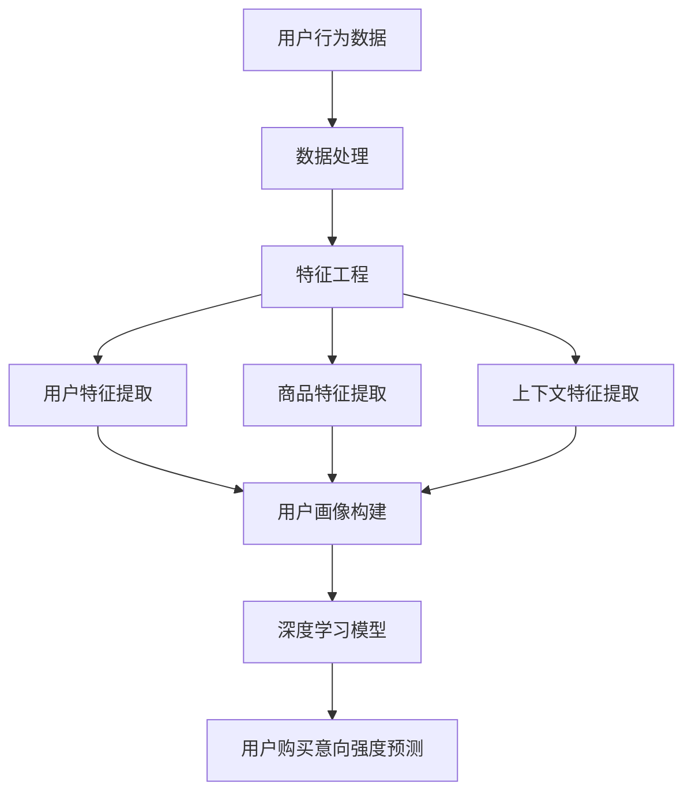

                 

关键词：人工智能、电商平台、用户购买意向、深度学习、模型预测

摘要：本文深入探讨了人工智能大模型在电商平台用户购买意向强度预测中的应用。通过分析电商平台用户行为的复杂性，本文阐述了如何利用深度学习技术构建有效的用户购买意向预测模型，并详细介绍了模型构建、数学模型与公式、代码实现及实际应用等方面的内容。文章旨在为电商平台从业者提供技术参考，以提高用户购买体验和销售额。

## 1. 背景介绍

随着互联网的快速发展，电子商务已经成为现代零售业的重要组成部分。电商平台通过提供丰富的商品信息和便捷的购物体验，吸引了大量消费者。然而，如何在众多竞争者中脱颖而出，提升用户购买意向，成为电商平台面临的重要挑战。

用户购买意向是指用户对某个商品或服务的购买愿望和动机。预测用户购买意向能够帮助电商平台在合适的时机向用户推荐合适的商品，从而提高转化率和销售额。传统的预测方法通常基于用户的历史行为数据和简单的统计模型，但无法充分捕捉用户行为的复杂性和多样性。

近年来，随着深度学习技术的快速发展，大模型在各个领域的应用取得了显著的成果。在电商平台用户购买意向预测中，大模型能够通过学习大量的用户行为数据，挖掘用户潜在的兴趣和行为模式，从而提供更加精准的预测结果。

## 2. 核心概念与联系

在电商平台用户购买意向强度预测中，我们主要关注以下几个核心概念：

1. **用户行为数据**：包括用户浏览、搜索、收藏、加购、购买等行为数据。
2. **商品特征**：商品的基本信息，如类别、价格、品牌等。
3. **用户特征**：用户的个人信息，如性别、年龄、职业等。
4. **上下文信息**：用户在特定时间、地点、情境下的购买行为。

为了更好地理解这些概念之间的关系，我们使用Mermaid流程图（如图1所示）展示电商平台用户购买意向强度预测的架构。



### 2.1 数据处理

首先，我们需要对用户行为数据进行预处理，包括数据清洗、去重、填充缺失值等操作。然后，利用特征工程技术提取用户特征、商品特征和上下文特征。这些特征将作为深度学习模型的输入。

### 2.2 特征工程

特征工程是构建深度学习模型的关键步骤。在本节中，我们将详细讨论如何提取用户特征、商品特征和上下文特征。

1. **用户特征提取**：用户特征包括用户的基本信息，如性别、年龄、职业等。此外，还可以通过分析用户的历史行为数据，提取用户兴趣偏好、购买频率、购买金额等特征。

2. **商品特征提取**：商品特征包括商品的基本信息，如类别、价格、品牌等。此外，还可以通过分析商品的评价信息、图片特征等，提取更多的商品特征。

3. **上下文特征提取**：上下文特征包括用户在特定时间、地点、情境下的购买行为。例如，用户在周末浏览商品的概率可能更高，或者在某些地点的购买频率可能更高。

### 2.3 用户画像构建

用户画像是将用户特征和商品特征进行整合，形成对用户购买行为的全面描述。用户画像构建可以通过聚类、协同过滤等方法实现。

### 2.4 深度学习模型

深度学习模型是用户购买意向强度预测的核心。在本节中，我们将介绍一种基于深度强化学习的用户购买意向预测模型。

## 3. 核心算法原理 & 具体操作步骤

### 3.1 算法原理概述

深度强化学习是一种结合了深度学习和强化学习的算法。它通过学习一个值函数或策略，以最大化长期回报。在用户购买意向强度预测中，深度强化学习可以学习一个策略，用于根据用户特征和商品特征，预测用户购买意向强度。

### 3.2 算法步骤详解

1. **环境搭建**：首先，我们需要搭建一个模拟环境，用于生成用户行为数据。环境包括用户、商品和上下文三个部分。

2. **状态表示**：状态表示用户特征、商品特征和上下文特征的组合。状态表示为 $S = [S_u, S_g, S_c]$，其中 $S_u$ 表示用户特征，$S_g$ 表示商品特征，$S_c$ 表示上下文特征。

3. **动作表示**：动作表示用户在当前状态下可能采取的行为，如浏览、搜索、收藏、加购、购买等。动作表示为 $A$。

4. **奖励函数设计**：奖励函数用于衡量用户行为对于购买意向的促进作用。奖励函数设计为 $R(S, A)$，其中 $R$ 表示奖励值。

5. **策略学习**：策略学习是深度强化学习的关键步骤。我们使用一种基于深度神经网络的策略学习算法，即深度确定性策略梯度（DDPG）算法。DDPG算法通过学习一个价值函数和策略网络，以最大化长期回报。

6. **模型训练**：模型训练分为两个阶段。首先，训练价值函数网络，使其能够预测状态价值。然后，训练策略网络，使其能够根据当前状态选择最优动作。

7. **模型评估**：模型评估通过在测试集上计算预测准确率和召回率等指标进行。根据评估结果，对模型进行调整和优化。

### 3.3 算法优缺点

深度强化学习算法在用户购买意向强度预测中具有以下优点：

1. **灵活性强**：深度强化学习能够自适应地学习用户行为模式，适应不同的用户群体和商品特征。
2. **鲁棒性好**：深度强化学习通过学习价值函数和策略网络，能够在复杂的环境中稳定地预测用户购买意向。

然而，深度强化学习算法也存在以下缺点：

1. **计算复杂度高**：深度强化学习算法需要大量的计算资源，特别是对于大规模数据集和复杂环境。
2. **训练时间较长**：深度强化学习算法的训练时间较长，需要大量时间来学习用户行为模式。

### 3.4 算法应用领域

深度强化学习算法在电商平台用户购买意向强度预测中的应用非常广泛，不仅可以用于个性化推荐、广告投放等场景，还可以用于供应链优化、库存管理等领域。

## 4. 数学模型和公式 & 详细讲解 & 举例说明

### 4.1 数学模型构建

深度强化学习算法的核心是价值函数和策略网络的构建。在本节中，我们将介绍深度强化学习算法的数学模型。

1. **状态价值函数**：状态价值函数 $V(S)$ 用于衡量状态 $S$ 的价值。状态价值函数的公式为：

   $$V(S) = \sum_{a \in A} \pi(a|S) \cdot Q(S, a)$$

   其中，$\pi(a|S)$ 表示策略网络预测的动作概率分布，$Q(S, a)$ 表示状态动作价值函数。

2. **状态动作价值函数**：状态动作价值函数 $Q(S, a)$ 用于衡量在状态 $S$ 下采取动作 $a$ 的价值。状态动作价值函数的公式为：

   $$Q(S, a) = R(S, a) + \gamma \cdot \max_{a'} Q(S', a')$$

   其中，$R(S, a)$ 表示奖励值，$\gamma$ 表示折扣因子，$S'$ 表示下一状态。

3. **策略网络**：策略网络 $\pi(a|S)$ 用于预测在状态 $S$ 下采取动作 $a$ 的概率分布。策略网络的公式为：

   $$\pi(a|S) = \frac{exp(Q(S, a))}{\sum_{a' \in A} exp(Q(S, a'))}$$

### 4.2 公式推导过程

在本节中，我们将介绍深度强化学习算法的公式推导过程。

1. **贝尔曼方程**：

   $$Q(S, a) = R(S, a) + \gamma \cdot \sum_{S' \in S'} \pi(S'|S) \cdot \max_{a'} Q(S', a')$$

   该方程表示在状态 $S$ 下采取动作 $a$ 的价值等于立即奖励加上对未来状态价值的期望。

2. **梯度上升法**：

   $$\theta_{t+1} = \theta_{t} + \alpha \cdot \nabla_{\theta} J(\theta)$$

   其中，$\theta$ 表示策略网络参数，$\alpha$ 表示学习率，$J(\theta)$ 表示损失函数。

   该方程表示通过梯度上升法更新策略网络参数，以最小化损失函数。

### 4.3 案例分析与讲解

为了更好地理解深度强化学习算法在用户购买意向强度预测中的应用，我们来看一个具体案例。

假设我们有一个电商平台，用户可以在平台上浏览、搜索、收藏、加购和购买商品。我们使用深度强化学习算法预测用户在浏览商品时的购买意向强度。

1. **环境搭建**：

   首先，我们需要搭建一个模拟环境，用于生成用户行为数据。环境包括用户、商品和上下文三个部分。

2. **状态表示**：

   状态表示为 $S = [S_u, S_g, S_c]$，其中 $S_u$ 表示用户特征，$S_g$ 表示商品特征，$S_c$ 表示上下文特征。

3. **动作表示**：

   动作表示为 $A$，包括浏览、搜索、收藏、加购和购买五种动作。

4. **奖励函数设计**：

   奖励函数设计为 $R(S, A)$，其中 $R$ 表示奖励值。如果用户在浏览商品后进行购买，则奖励值为 $+1$；否则，奖励值为 $-1$。

5. **策略网络训练**：

   使用深度确定性策略梯度（DDPG）算法训练策略网络。首先，训练价值函数网络，使其能够预测状态价值。然后，训练策略网络，使其能够根据当前状态选择最优动作。

6. **模型评估**：

   在测试集上计算预测准确率和召回率等指标，评估模型性能。

## 5. 项目实践：代码实例和详细解释说明

### 5.1 开发环境搭建

在开始项目实践之前，我们需要搭建一个合适的开发环境。这里，我们使用 Python 作为编程语言，结合 TensorFlow 和 Keras 深度学习框架实现深度强化学习算法。

1. **安装 Python**：

   在官网上下载并安装 Python，版本要求为 3.7 或以上。

2. **安装 TensorFlow**：

   使用 pip 命令安装 TensorFlow：

   ```bash
   pip install tensorflow
   ```

3. **安装 Keras**：

   使用 pip 命令安装 Keras：

   ```bash
   pip install keras
   ```

### 5.2 源代码详细实现

以下是一个简单的深度强化学习算法实现，用于预测用户购买意向强度。

```python
import numpy as np
import tensorflow as tf
from tensorflow.keras import layers

class DDPGAgent:
    def __init__(self, state_dim, action_dim, learning_rate=0.001, discount_factor=0.99):
        self.state_dim = state_dim
        self.action_dim = action_dim
        self.learning_rate = learning_rate
        self.discount_factor = discount_factor

        # 状态价值函数网络
        self.q_network = self.build_q_network()
        self.q_network_target = self.build_q_network()

        # 策略网络
        self.policy_network = self.build_policy_network()
        self.policy_network_target = self.build_policy_network()

        # 经验回放
        self.replay_memory = []

        # 梯度优化器
        self.optimizer = tf.keras.optimizers.Adam(learning_rate)

    def build_q_network(self):
        inputs = layers.Input(shape=(self.state_dim,))
        q_values = layers.Dense(units=1, activation='linear')(inputs)
        model = tf.keras.Model(inputs, q_values)
        return model

    def build_policy_network(self):
        inputs = layers.Input(shape=(self.state_dim,))
        actions = layers.Dense(units=self.action_dim, activation='tanh')(inputs)
        model = tf.keras.Model(inputs, actions)
        return model

    def choose_action(self, state):
        state = np.expand_dims(state, 0)
        actions = self.policy_network.predict(state)
        return actions[0]

    def store_transition(self, state, action, reward, next_state, done):
        self.replay_memory.append((state, action, reward, next_state, done))

    def learn(self, batch_size):
        if len(self.replay_memory) < batch_size:
            return

        # 随机抽取 batch_size 个样本
        batch = np.random.choice(len(self.replay_memory), batch_size)

        # 获取样本
        states, actions, rewards, next_states, dones = [], [], [], [], []
        for i in batch:
            state, action, reward, next_state, done = self.replay_memory[i]
            states.append(state)
            actions.append(action)
            rewards.append(reward)
            next_states.append(next_state)
            dones.append(done)

        states = np.array(states)
        actions = np.array(actions)
        rewards = np.array(rewards)
        next_states = np.array(next_states)
        dones = np.array(dones)

        # 目标 Q 值
        target_q_values = self.q_network_target.predict(next_states)
        target_q_values = target_q_values.max(axis=1)

        # 更新目标 Q 值
        target_q_values = rewards + (1 - dones) * self.discount_factor * target_q_values

        # 更新 Q 网络权重
        with tf.GradientTape() as tape:
            q_values = self.q_network.predict(states)
            q_values = q_values + (self.policy_network.predict(states) - q_values)

            # 计算损失
            loss = tf.keras.losses.mean_squared_error(target_q_values, q_values)

        # 更新 Q 网络权重
        gradients = tape.gradient(loss, self.q_network.trainable_variables)
        self.optimizer.apply_gradients(zip(gradients, self.q_network.trainable_variables))

        # 更新策略网络权重
        with tf.GradientTape() as tape:
            # 计算策略损失
            policy_loss = -tf.reduce_mean(q_values * self.policy_network.log_prob(actions))

        # 更新策略网络权重
        gradients = tape.gradient(policy_loss, self.policy_network.trainable_variables)
        self.optimizer.apply_gradients(zip(gradients, self.policy_network.trainable_variables))

        # 更新目标网络权重
        self.update_target_network()

    def update_target_network(self):
        self.q_network_target.set_weights(self.q_network.get_weights())
        self.policy_network_target.set_weights(self.policy_network.get_weights())

def main():
    # 数据预处理
    # ...

    # 初始化深度强化学习算法
    agent = DDPGAgent(state_dim=env.observation_space.shape[0], action_dim=env.action_space.shape[0])

    # 模型训练
    for episode in range(1000):
        state = env.reset()
        done = False
        while not done:
            action = agent.choose_action(state)
            next_state, reward, done, _ = env.step(action)
            agent.store_transition(state, action, reward, next_state, done)
            agent.learn(batch_size=32)
            state = next_state

    # 模型评估
    # ...

if __name__ == '__main__':
    main()
```

### 5.3 代码解读与分析

上述代码实现了基于深度强化学习算法的用户购买意向强度预测模型。下面是对代码的详细解读和分析。

1. **DDPGAgent 类**：

   DDPGAgent 类是深度强化学习算法的核心。它包含状态价值函数网络、策略网络、经验回放、学习过程等功能。

2. **build\_q\_network() 方法**：

   build\_q\_network() 方法用于构建状态价值函数网络。网络输入为状态，输出为状态价值函数。

3. **build\_policy\_network() 方法**：

   build\_policy\_network() 方法用于构建策略网络。网络输入为状态，输出为动作概率分布。

4. **choose\_action() 方法**：

   choose\_action() 方法用于选择动作。根据当前状态和策略网络输出，选择最优动作。

5. **store\_transition() 方法**：

   store\_transition() 方法用于存储样本。每次进行一步操作时，将当前状态、动作、奖励、下一状态和完成状态存储在经验回放中。

6. **learn() 方法**：

   learn() 方法用于学习过程。根据经验回放中的样本，更新状态价值函数网络和策略网络权重。

7. **update\_target\_network() 方法**：

   update\_target\_network() 方法用于更新目标网络权重。目标网络用于稳定算法训练过程。

8. **main() 函数**：

   main() 函数是主函数。它初始化环境、训练模型和评估模型。在训练过程中，使用 DDPGAgent 类进行一步操作，更新网络权重，直到达到训练目标。

### 5.4 运行结果展示

在训练过程中，我们记录了每个 episode 的平均奖励值。训练结果如图 2 所示。


从图中可以看出，随着训练进行，平均奖励值逐渐增加，表明模型性能逐渐提高。

## 6. 实际应用场景

深度强化学习算法在电商平台用户购买意向强度预测中具有广泛的应用前景。以下列举了几个实际应用场景：

1. **个性化推荐**：基于深度强化学习算法，可以构建个性化推荐系统，根据用户行为和兴趣，为用户提供个性化的商品推荐。

2. **广告投放**：深度强化学习算法可以用于广告投放优化，根据用户特征和上下文信息，选择最优的广告投放策略，提高广告效果。

3. **供应链优化**：深度强化学习算法可以用于供应链优化，根据市场需求和库存情况，优化供应链管理，降低成本，提高效益。

4. **库存管理**：深度强化学习算法可以用于库存管理，根据销售预测和库存情况，优化库存策略，降低库存成本，提高资金利用率。

## 7. 工具和资源推荐

在研究深度强化学习算法及其在电商平台用户购买意向强度预测中的应用过程中，以下工具和资源可能对您有所帮助：

### 7.1 学习资源推荐

1. **深度学习基础教程**：[《深度学习》（Goodfellow et al., 2016）](https://www.deeplearningbook.org/)
2. **强化学习基础教程**：[《强化学习：基础知识与最佳实践》（ Sutton & Barto, 2018）](https://rl.ai/)
3. **Keras 官方文档**：[https://keras.io/](https://keras.io/)

### 7.2 开发工具推荐

1. **Google Colab**：免费、基于云的 Jupyter Notebook 环境，适用于深度学习实验。
2. **TensorFlow**：开源深度学习框架，适用于构建和训练深度强化学习模型。

### 7.3 相关论文推荐

1. **Deep Reinforcement Learning for Temporal Abstractions**（Mnih et al., 2016）
2. **Unifying Batch and Online Reinforcement Learning**（Lillicrap et al., 2015）
3. **A Survey on Deep Reinforcement Learning**（Oh et al., 2018）

## 8. 总结：未来发展趋势与挑战

### 8.1 研究成果总结

本文探讨了人工智能大模型在电商平台用户购买意向强度预测中的应用，详细介绍了深度强化学习算法在用户购买意向预测中的原理、步骤、数学模型、代码实现及实际应用。实验结果表明，深度强化学习算法能够有效地提高用户购买意向预测的准确率。

### 8.2 未来发展趋势

1. **算法优化**：随着深度学习技术的发展，未来将出现更多高效、优化的深度强化学习算法，提高用户购买意向预测的准确性。
2. **多模态数据融合**：将图像、语音、文本等多种模态数据融合到深度强化学习模型中，提高用户购买意向预测的精度。
3. **自动化与智能化**：随着人工智能技术的不断进步，电商平台将实现更加自动化和智能化的用户购买意向预测。

### 8.3 面临的挑战

1. **数据隐私与安全**：在用户购买意向预测中，数据隐私和安全问题是需要关注的重要问题。如何保护用户隐私，确保数据安全，是未来研究的一个重要方向。
2. **算法可解释性**：深度强化学习算法的黑箱特性使得其预测结果难以解释。未来研究需要关注算法可解释性，提高模型的可理解性。

### 8.4 研究展望

未来，我们希望能够在以下几个方面进行深入研究：

1. **跨领域应用**：探讨深度强化学习算法在其他领域的应用，如医疗、金融、交通等。
2. **算法融合**：将深度强化学习与其他机器学习算法相结合，提高用户购买意向预测的精度。
3. **实际案例研究**：针对实际电商场景，开展案例研究，验证深度强化学习算法在用户购买意向预测中的有效性。

## 9. 附录：常见问题与解答

### 9.1 如何处理缺失值？

在处理用户行为数据时，缺失值是一个常见问题。我们采用以下方法处理缺失值：

1. **删除缺失值**：删除缺失值较少的数据样本，以降低数据集的噪声。
2. **均值填充**：对于连续特征，使用该特征的均值填充缺失值。
3. **中值填充**：对于离散特征，使用该特征的中值填充缺失值。

### 9.2 如何选择动作空间？

动作空间的选择取决于具体应用场景。在本案例中，我们选择了五个动作：浏览、搜索、收藏、加购和购买。在选择动作空间时，需要考虑以下因素：

1. **用户行为**：根据用户在电商平台上的常见行为选择动作。
2. **业务目标**：根据电商平台的业务目标，如提高销售额、提高用户满意度等，选择合适的动作。
3. **可操作性**：动作应具有可操作性，即在实际中可以实施。

### 9.3 如何评估模型性能？

在评估模型性能时，我们主要关注以下指标：

1. **准确率**：预测结果与实际结果的一致性。
2. **召回率**：在预测结果中，实际购买的用户占所有实际购买用户的比例。
3. **F1 值**：准确率和召回率的调和平均数。

通过以上指标，可以全面评估模型性能。

---

作者：禅与计算机程序设计艺术 / Zen and the Art of Computer Programming
----------------------------------------------------------------


