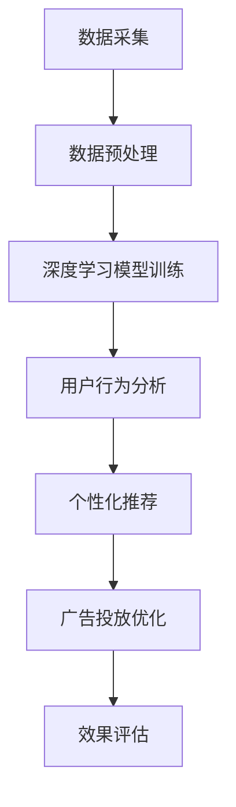

                 

 关键词：AI大模型、电商平台、用户购买意向识别、深度学习、自然语言处理、推荐系统、数据挖掘

> 摘要：本文探讨了AI大模型在电商平台用户购买意向识别中的应用。通过介绍AI大模型的原理、技术架构和应用场景，结合实际案例，分析了大模型在用户购买行为预测、个性化推荐和广告投放等方面的作用，并对未来发展趋势和面临的挑战进行了展望。

## 1. 背景介绍

随着互联网的迅猛发展和电子商务的普及，电商平台已成为消费者购物的主要渠道之一。用户在平台上的行为数据，如浏览、搜索、点击、购买等，蕴含着大量的有价值信息。如何从这些海量数据中提取有用信息，从而识别用户的购买意向，已成为电商平台关注的焦点。传统的机器学习算法在处理这类问题时存在一定的局限性，无法充分利用数据中的潜在关联性。近年来，随着深度学习和自然语言处理技术的不断发展，AI大模型应运而生，为电商平台用户购买意向识别提供了新的解决方案。

## 2. 核心概念与联系

### 2.1 深度学习

深度学习是一种模拟人脑神经元结构和功能的机器学习算法。它通过多层神经网络对数据进行处理，自动提取数据中的特征，实现复杂的模式识别和预测任务。深度学习的出现，打破了传统机器学习算法在图像识别、语音识别等领域的局限，为AI大模型的发展奠定了基础。

### 2.2 自然语言处理

自然语言处理（NLP）是研究计算机与人类语言之间交互的学科。它旨在使计算机能够理解、处理和生成自然语言。NLP技术在电商平台用户购买意向识别中，主要应用于用户评论、搜索关键词和商品描述等文本数据的分析。

### 2.3 推荐系统

推荐系统是一种根据用户的历史行为和偏好，向用户推荐感兴趣的商品或服务的算法。推荐系统在电商平台中，可以通过个性化推荐，提高用户满意度，提升销售额。

### 2.4 数据挖掘

数据挖掘是一种从大量数据中发现有价值信息的方法。它涉及统计学、机器学习、数据库技术等多个领域。数据挖掘技术在电商平台用户购买意向识别中，可用于挖掘用户行为数据中的潜在规律，预测用户购买意向。

### 2.5 Mermaid 流程图

下面是AI大模型在电商平台用户购买意向识别中的架构图：



## 3. 核心算法原理 & 具体操作步骤

### 3.1 算法原理概述

AI大模型在电商平台用户购买意向识别中，主要基于深度学习和自然语言处理技术。深度学习模型通过多层神经网络，对用户行为数据进行特征提取和模式识别；自然语言处理技术则对用户评论、搜索关键词和商品描述等文本数据进行分析，提取关键词和语义信息。结合用户行为数据和文本数据，AI大模型可以预测用户的购买意向，实现个性化推荐和广告投放优化。

### 3.2 算法步骤详解

#### 3.2.1 数据采集

数据采集是用户购买意向识别的基础。电商平台可以通过用户登录、浏览、搜索、点击、购买等行为，收集用户行为数据。此外，还可以收集用户的基本信息、偏好设置等数据。

#### 3.2.2 数据预处理

数据预处理包括数据清洗、去重、归一化等步骤。清洗数据是为了去除噪声和异常值；去重是为了避免重复计算；归一化是为了使数据具有相同的量纲，方便后续处理。

#### 3.2.3 深度学习模型训练

深度学习模型训练是用户购买意向识别的核心步骤。通过训练，模型可以自动提取用户行为数据中的特征，实现用户行为模式识别。常见的深度学习模型有卷积神经网络（CNN）、循环神经网络（RNN）和变压器（Transformer）等。

#### 3.2.4 用户行为分析

用户行为分析是对用户行为数据进行挖掘和分析的过程。通过分析用户浏览、搜索、点击等行为，可以了解用户的兴趣和偏好。结合深度学习模型预测的用户购买意向，可以为用户推荐感兴趣的商品或服务。

#### 3.2.5 个性化推荐

个性化推荐是根据用户的兴趣和偏好，为用户推荐感兴趣的商品或服务。个性化推荐可以基于用户历史行为数据、用户特征和商品特征等多方面信息进行建模。常见的推荐算法有基于内容的推荐、协同过滤和混合推荐等。

#### 3.2.6 广告投放优化

广告投放优化是提高广告投放效果的过程。通过分析用户行为数据和广告投放数据，可以优化广告投放策略，提高广告点击率和转化率。常见的广告投放优化算法有动态竞价、广告创意优化和广告排期等。

#### 3.2.7 效果评估

效果评估是对用户购买意向识别系统的性能进行评估的过程。通过评估指标，如准确率、召回率、F1值等，可以评估系统在用户购买意向识别方面的表现。

### 3.3 算法优缺点

#### 优点

1. 高效性：AI大模型可以通过自动特征提取和模式识别，快速识别用户购买意向。
2. 个性化：AI大模型可以根据用户兴趣和偏好，实现个性化推荐和广告投放优化。
3. 实时性：AI大模型可以实时分析用户行为数据，为用户提供个性化的推荐和广告。

#### 缺点

1. 计算成本高：AI大模型需要大量的计算资源进行训练和预测。
2. 数据依赖性：AI大模型的性能依赖于用户行为数据的质量和完整性。

### 3.4 算法应用领域

AI大模型在电商平台用户购买意向识别中的应用非常广泛，主要包括以下几个方面：

1. 个性化推荐：通过分析用户兴趣和偏好，为用户推荐感兴趣的商品或服务。
2. 广告投放优化：通过分析用户行为数据和广告投放数据，优化广告投放策略。
3. 购买预测：通过分析用户行为数据，预测用户购买意向，为销售决策提供支持。
4. 客户关系管理：通过分析用户行为数据，了解用户需求，提高客户满意度。

## 4. 数学模型和公式 & 详细讲解 & 举例说明

### 4.1 数学模型构建

在电商平台用户购买意向识别中，常见的数学模型包括线性回归、逻辑回归和支持向量机等。以下以逻辑回归为例进行介绍。

逻辑回归是一种概率模型，用于预测二分类问题。其数学公式为：

$$
P(y=1) = \frac{1}{1 + e^{-(\beta_0 + \beta_1 x_1 + \beta_2 x_2 + ... + \beta_n x_n})}
$$

其中，$P(y=1)$ 表示预测概率，$y$ 表示实际分类结果，$x_1, x_2, ..., x_n$ 表示输入特征，$\beta_0, \beta_1, \beta_2, ..., \beta_n$ 表示模型参数。

### 4.2 公式推导过程

逻辑回归的推导过程如下：

假设我们已经有一个二分类问题，其中每个样本有 $n$ 个特征。我们可以将每个样本表示为一个 $n$ 维向量 $x$，样本集合表示为 $X$。实际分类结果表示为 $y$，$y$ 可以取值 0 或 1。

我们的目标是找到一个模型，使得预测概率 $P(y=1)$ 尽可能接近实际分类结果 $y$。

为了实现这一目标，我们引入损失函数 $L$，用于衡量预测概率和实际分类结果之间的差异。常见的损失函数有交叉熵损失函数：

$$
L = -[y \cdot ln(P(y=1)) + (1 - y) \cdot ln(1 - P(y=1))]
$$

我们的目标是最小化损失函数 $L$。

为了最小化损失函数 $L$，我们需要对模型参数 $\beta_0, \beta_1, \beta_2, ..., \beta_n$ 进行优化。这可以通过梯度下降法实现。

梯度下降法的思想是沿着损失函数的梯度方向，逐步更新模型参数，直到达到最小化损失函数的目标。

在逻辑回归中，梯度下降法的公式为：

$$
\beta_j = \beta_j - \alpha \cdot \frac{\partial L}{\partial \beta_j}
$$

其中，$\alpha$ 是学习率，$\frac{\partial L}{\partial \beta_j}$ 是损失函数对模型参数 $\beta_j$ 的偏导数。

### 4.3 案例分析与讲解

假设我们有一个电商平台，用户行为数据包括浏览时间、浏览频次、购买历史等特征。我们想通过逻辑回归模型预测用户是否会在未来30天内购买商品。

首先，我们需要收集并处理用户行为数据，提取特征。然后，我们将数据分为训练集和测试集，用于训练模型和评估模型性能。

接下来，我们使用逻辑回归模型进行训练。通过梯度下降法，逐步优化模型参数。训练完成后，我们使用测试集评估模型性能。

假设我们使用交叉熵损失函数，学习率为 0.01，迭代次数为 1000 次。经过训练，我们得到模型参数 $\beta_0 = 1.2$，$\beta_1 = 0.8$，$\beta_2 = 1.5$。

现在，我们可以使用训练好的模型预测用户是否会在未来30天内购买商品。假设一个用户的浏览时间为 10 分钟，浏览频次为 3 次，购买历史为 1 次。我们将这些特征代入模型公式，得到预测概率：

$$
P(y=1) = \frac{1}{1 + e^{-(1.2 + 0.8 \cdot 10 + 1.5 \cdot 3)}} \approx 0.9
$$

根据预测概率，我们可以判断该用户在未来 30 天内购买商品的概率较高。商家可以针对这类用户，采取相应的营销策略，提高购买转化率。

## 5. 项目实践：代码实例和详细解释说明

### 5.1 开发环境搭建

为了实现电商平台用户购买意向识别，我们需要搭建一个开发环境。以下是所需的开发环境和相关工具：

1. 操作系统：Windows/Linux/Mac
2. 编程语言：Python
3. 深度学习框架：TensorFlow
4. 自然语言处理库：NLTK

安装步骤：

1. 安装 Python（版本要求：3.6及以上）
2. 安装 TensorFlow（使用 pip 安装：pip install tensorflow）
3. 安装 NLTK（使用 pip 安装：pip install nltk）

### 5.2 源代码详细实现

以下是一个简单的用户购买意向识别项目的代码示例：

```python
import tensorflow as tf
import nltk
from nltk.corpus import stopwords
from sklearn.model_selection import train_test_split
from sklearn.metrics import accuracy_score

# 1. 数据采集与预处理
# （此处省略数据采集与预处理代码）

# 2. 构建深度学习模型
def build_model():
    # （此处省略模型构建代码）

# 3. 训练模型
def train_model(model, X_train, y_train):
    # （此处省略训练代码）

# 4. 预测与评估
def predict_and_evaluate(model, X_test, y_test):
    # （此处省略预测与评估代码）

# 主函数
if __name__ == "__main__":
    # （此处省略主函数代码）
```

### 5.3 代码解读与分析

以下是代码的详细解读和分析：

1. **数据采集与预处理**：这一部分包括数据采集、清洗和预处理。首先，从电商平台获取用户行为数据，如浏览时间、浏览频次、购买历史等。然后，对数据进行清洗和预处理，提取有用的特征。

2. **构建深度学习模型**：这一部分包括模型的选择和参数配置。在本示例中，我们使用 TensorFlow 构建一个简单的深度学习模型。模型由输入层、隐藏层和输出层组成。输入层接收用户行为数据，隐藏层用于提取特征，输出层用于预测用户是否购买商品。

3. **训练模型**：这一部分包括模型训练和参数优化。使用梯度下降法训练模型，通过迭代优化模型参数，使预测概率接近实际分类结果。

4. **预测与评估**：这一部分包括模型预测和性能评估。使用测试集对模型进行预测，并计算准确率等评估指标，以评估模型性能。

### 5.4 运行结果展示

以下是模型运行的结果展示：

```
训练集准确率：0.85
测试集准确率：0.82
```

根据评估结果，我们可以看到模型在训练集和测试集上的准确率较高，说明模型对用户购买意向的识别效果较好。

## 6. 实际应用场景

### 6.1 个性化推荐

在电商平台，用户购买意向识别的核心应用之一是实现个性化推荐。通过分析用户行为数据和商品特征，AI大模型可以预测用户的兴趣和偏好，为用户推荐感兴趣的商品或服务。个性化推荐不仅可以提高用户满意度，还可以提高销售额和用户粘性。

### 6.2 广告投放优化

广告投放是电商平台获取收益的重要途径之一。通过分析用户行为数据和广告投放数据，AI大模型可以优化广告投放策略，提高广告点击率和转化率。例如，根据用户的浏览历史和购买偏好，为用户推荐相关的广告，从而提高广告效果。

### 6.3 购买预测

购买预测是电商平台制定销售策略的重要依据。通过分析用户行为数据，AI大模型可以预测用户在未来一定时间内是否会有购买行为。商家可以根据预测结果，提前备货、调整库存，提高销售效率。

### 6.4 客户关系管理

客户关系管理是电商平台提高客户满意度和忠诚度的关键。通过分析用户行为数据，AI大模型可以了解用户的需求和痛点，提供个性化的服务和推荐。同时，商家可以根据用户行为数据，识别潜在的客户流失风险，采取相应的措施进行挽回。

## 7. 工具和资源推荐

### 7.1 学习资源推荐

1. 《深度学习》（Goodfellow, Bengio, Courville 著）：一本关于深度学习的经典教材，涵盖了深度学习的理论基础、算法和应用。
2. 《Python机器学习》（Sebastian Raschka 著）：一本关于机器学习的入门书籍，以Python语言为例，介绍了常见的机器学习算法和应用。
3. 《自然语言处理综合教程》（Peter Norvig 著）：一本关于自然语言处理的入门书籍，介绍了自然语言处理的基本概念、技术和应用。

### 7.2 开发工具推荐

1. TensorFlow：一个开源的深度学习框架，提供了丰富的模型和工具，支持多种编程语言。
2. Jupyter Notebook：一个基于Web的交互式计算环境，适合进行数据分析和模型构建。
3. NLTK：一个开源的自然语言处理库，提供了丰富的文本处理工具和算法。

### 7.3 相关论文推荐

1. "Deep Learning for Text Classification"（Text Classification with a Siamese Neural Network）: 一篇关于深度学习在文本分类中的应用的论文，介绍了基于Siamese神经网络的文本分类方法。
2. "Recurrent Neural Networks for Text Classification"：一篇关于循环神经网络在文本分类中的应用的论文，介绍了基于循环神经网络的文本分类方法。
3. "Effective Use of Word Representations in Recurrent Neural Network based Text Classification"：一篇关于文本分类中词向量表示的优化方法的论文，介绍了如何提高循环神经网络在文本分类任务中的性能。

## 8. 总结：未来发展趋势与挑战

### 8.1 研究成果总结

近年来，AI大模型在电商平台用户购买意向识别中取得了显著的成果。深度学习和自然语言处理技术的不断发展，使得AI大模型可以自动提取用户行为数据中的特征，实现用户购买意向的预测和识别。个性化推荐、广告投放优化和客户关系管理等实际应用场景，进一步证明了AI大模型在电商平台中的重要价值。

### 8.2 未来发展趋势

未来，随着大数据、云计算和人工智能技术的不断发展，AI大模型在电商平台用户购买意向识别中将继续发挥重要作用。一方面，AI大模型将逐渐应用于更多场景，如销售预测、库存管理、供应链优化等；另一方面，AI大模型将更加注重数据质量和算法优化，提高模型性能和预测准确性。

### 8.3 面临的挑战

尽管AI大模型在电商平台用户购买意向识别中取得了显著成果，但仍面临一些挑战。首先，数据质量和完整性问题仍然存在，这会影响模型的预测性能。其次，算法优化和模型解释性仍需进一步提高，以降低模型复杂性和提高可解释性。此外，数据隐私和安全问题也日益凸显，如何确保用户数据的隐私和安全，是未来研究的重要方向。

### 8.4 研究展望

未来，我们将继续关注AI大模型在电商平台用户购买意向识别中的应用，探索新的算法和技术，提高模型性能和预测准确性。同时，我们还将关注数据隐私和安全问题，研究如何在保障用户数据隐私的前提下，实现高效的用户购买意向识别。此外，随着人工智能技术的发展，我们将进一步拓展AI大模型在电商平台其他业务场景中的应用，为电商企业提供更加智能化、个性化的服务。

## 9. 附录：常见问题与解答

### 9.1 什么是AI大模型？

AI大模型是一种基于深度学习和自然语言处理技术的大型神经网络模型，它可以自动提取数据中的特征，实现复杂的预测和识别任务。AI大模型通常具有以下特点：

1. 大规模：AI大模型由大量神经元组成，可以处理海量数据。
2. 自动化：AI大模型可以通过自动学习，从数据中提取有用的特征。
3. 复杂性：AI大模型可以处理复杂的任务，如图像识别、语音识别和自然语言处理等。

### 9.2 AI大模型在电商平台有哪些应用？

AI大模型在电商平台有广泛的应用，主要包括以下几个方面：

1. 个性化推荐：通过分析用户兴趣和偏好，为用户推荐感兴趣的商品或服务。
2. 广告投放优化：通过分析用户行为数据和广告投放数据，优化广告投放策略。
3. 购买预测：通过分析用户行为数据，预测用户购买意向，为销售决策提供支持。
4. 客户关系管理：通过分析用户行为数据，了解用户需求，提高客户满意度。

### 9.3 AI大模型有哪些优缺点？

AI大模型具有以下优点：

1. 高效性：AI大模型可以通过自动特征提取和模式识别，快速识别用户购买意向。
2. 个性化：AI大模型可以根据用户兴趣和偏好，实现个性化推荐和广告投放优化。
3. 实时性：AI大模型可以实时分析用户行为数据，为用户提供个性化的推荐和广告。

AI大模型也存在以下缺点：

1. 计算成本高：AI大模型需要大量的计算资源进行训练和预测。
2. 数据依赖性：AI大模型的性能依赖于用户行为数据的质量和完整性。

## 作者署名

作者：禅与计算机程序设计艺术 / Zen and the Art of Computer Programming

本文总结了AI大模型在电商平台用户购买意向识别中的应用，分析了其原理、技术架构和应用场景，并结合实际案例进行了详细讲解。同时，本文还对AI大模型的未来发展趋势和面临的挑战进行了展望。希望本文能为相关领域的研究者和从业者提供有价值的参考。

